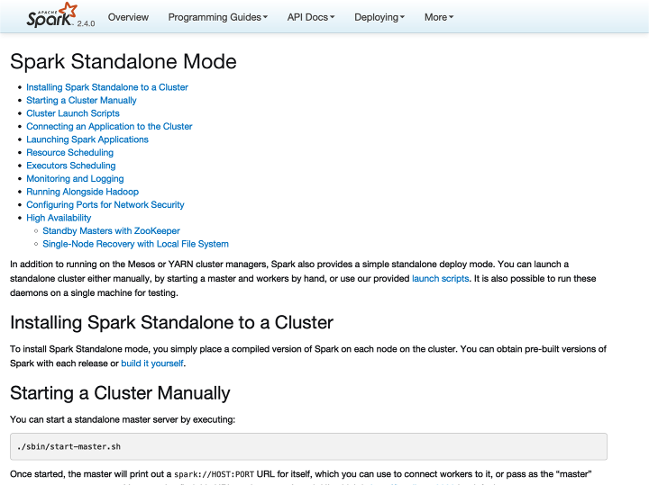
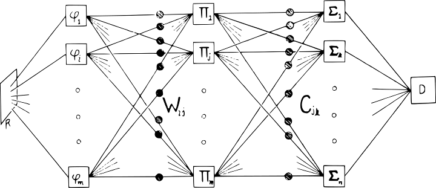
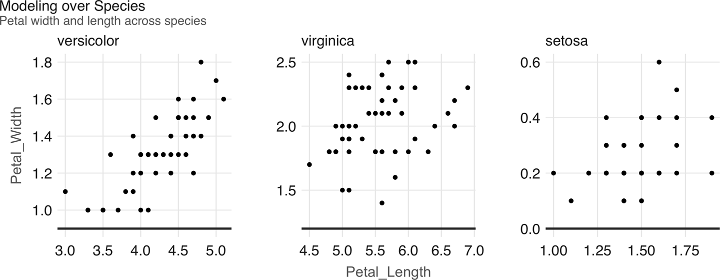

```{r, echo=F}
library(knitr)
library(formatR)
opts_chunk$set(tidy=T, message=FALSE, fig.align='center', eval=F)
```


# Foreword

Apache Spark is a distributed computing platform built on extensibility: Spark’s APIs
make it easy to combine input from many data sources and process it using diverse
programming languages and algorithms to build a data application. R is one of the
most powerful languages for data science and statistics, so it makes a lot of sense to
connect R to Spark. Fortunately, R’s rich language features enable simple APIs for
calling Spark from R that look similar to running R on local data sources. With a bit
of background about both systems, you will be able to invoke massive computations
in Spark or run your R code in parallel from the comfort of your favorite R program‐
ming environment.
This book explores using Spark from R in detail, focusing on the `sparklyr` package
that enables support for `dplyr` and other packages known to the R community. It
covers all of the main use cases in detail, ranging from querying data using the Spark
engine to exploratory data analysis, machine learning, parallel execution of R code,
and streaming. It also has a self-contained introduction to running Spark and moni‐
toring job execution. The authors are exactly the right people to write about this
topic—Javier, Kevin, and Edgar have been involved in `sparklyr` development since
the project started. I was excited to see how well they’ve assembled this clear and
focused guide about using Spark with R.
I hope that you enjoy this book and use it to scale up your R workloads and connect
them to the capabilities of the broader Spark ecosystem. And because all of the infra‐
structure here is open source, don’t hesitate to give the developers feedback about
making these tools better.
— Matei Zaharia
Assistant Professor at Stanford University,
Chief Technologist at Databricks,
and original creator of Apache Spark

# 序

In a world where information is growing exponentially, leading tools like Apache
Spark provide support to solve many of the relevant problems we face today. From
companies looking for ways to improve based on data-driven decisions, to research
organizations solving problems in health care, finance, education, and energy, Spark
enables analyzing much more information faster and more reliably than ever before.
Various books have been written for learning Apache Spark; for instance, Spark: The
Definitive Guide is a comprehensive resource, and Learning Spark is an introductory
book meant to help users get up and running (both are from O’Reilly). However, as of
this writing, there is neither a book to learn Apache Spark using the R computing lan‐
guage nor a book specifically designed for the R user or the aspiring R user.
There are some resources online to learn Apache Spark with R, most notably the
spark.rstudio.com site and the Spark documentation site at spark.apache.org. Both
sites are great online resources; however, the content is not intended to be read from
start to finish and assumes you, the reader, have some knowledge of Apache Spark, R,
and cluster computing.
The goal of this book is to help anyone get started with Apache Spark using R. Addi‐
tionally, because the R programming language was created to simplify data analysis, it
is also our belief that this book provides the easiest path for you to learn the tools
used to solve data analysis problems with Spark. The first chapters provide an intro‐
duction to help anyone get up to speed with these concepts and present the tools
required to work on these problems on your own computer. We then quickly ramp
up to relevant data science topics, cluster computing, and advanced topics that should
interest even the most experienced users.
Therefore, this book is intended to be a useful resource for a wide range of users,
from beginners curious to learn Apache Spark, to experienced readers seeking to
understand why and how to use Apache Spark from R.
This book has the following general outline:
xiiiIntroduction
In the first two chapters, Chapter 1, Introduction, and Chapter 2, Getting Started,
you learn about Apache Spark, R and the tools to perform data analysis with
Spark and R.
Analysis
In Chapter 3, Analysis, you learn how to analyze, explore, transform, and visual‐
ize data in Apache Spark with R.
Modeling
In the Chapter 4, Modeling and Chapter 5, Pipelines, you learn how to create stat‐
istical models with the purpose of extracting information, predicticting out‐
comes, and automating this process in production-ready workflows.
Scaling
Up to this point, the book has focused on performing operations on your per‐
sonal computer and with limited data formats. Chapter 6, Clusters, Chapter 7,
Connections, Chapter 8, Data, and Chapter 9, Tuning, introduce distributed com‐
puting techniques required to perform analysis and modeling across many
machines and data formats to tackle the large-scale data and computation prob‐
lems for which Apache Spark was designed.
Extensions
Chapter 10, Extensions, describes optional components and extended functional‐
ity applicable to specific, relevant use cases. You learn about alternative modeling
frameworks, graph processing, preprocessing data for deep learning, geospatial
analysis, and genomics at scale.
Advanced
The book closes with a set of advanced chapters, Chapter 11, Distributed R,
Chapter 12, Streaming, and Chapter 13, Contributing; these will be of greatest
interest to advanced users. However, by the time you reach this section, the con‐
tent won’t seem as intimidating; instead, these chapters will be equally relevant,
useful, and interesting as the previous ones.
The first group of chapters, 1–5, provides a gentle introduction to performing data
science and machine learning at scale. If you are planning to read this book while also
following along with code examples, these are great chapters to consider executing
the code line by line. Because these chapters teach all of the concepts using your per‐
sonal computer, you won’t be taking advantage of multiple computers, which Spark
was designed to use. But worry not: the next set of chapters will teach this in detail!
The second group of chapters, 6–9, introduces fundamental concepts in the exciting
world of cluster computing using Spark. To be honest, they also introduce some of
the not-so-fun parts of cluster computing, but believe us, it’s worth learning the con‐
cepts we present. Besides, the overview sections in each chapter are especially
xiv | Prefaceinteresting, informative, and easy to read, and help you develop intuitions as to how
cluster computing truly works. For these chapters, we actually don’t recommend exe‐
cuting the code line by line—especially not if you are trying to learn Spark from start
to finish. You can always come back and execute code after you have a proper Spark
cluster. If you already have a cluster at work or you are really motivated to get one,
however, you might want to use Chapter 6 to pick one and then Chapter 7 to connect
to it.
The third group of chapters, 10–13, presents tools that should be quite interesting to
most readers and will make it easier to follow along. Many advanced topics are pre‐
sented, and it is natural to be more interested in some topics than others; for instance,
you might be interested in analyzing geographic datasets, or perhaps you’re more
interested in processing real-time datasets, or maybe you’d like to do both! Based on
your personal interests or problems at hand, we encourage you to execute the code
examples that are most relevant to you. All of the code in these chapters is written to
be executed on your personal computer, but you are also encouraged to use proper
Spark clusters given that you’ll have the tools required to troubleshoot issues and
tune large-scale computations.

## Formatting

Tables generated from code are formatted as follows:

```{r}
# A tibble: 3 x 2
numbers text
<dbl> <chr>
1 1 one
2 2 two
3 3 three
```

The dimensions of the table (number of rows and columns) are described in the first
row, followed by column names in the second row and column types in the third row.
There are also various subtle visual improvements provided by the tibble package
that we make use of throughout this book.
Most plots are rendered using the `ggplot2` package and a custom theme available in
the appendix; however, because this book is not focused on data visualization, we
only provide code to render a basic plot that won’t match the formatting we applied.
If you are interested in learning more about visualization in R, consider specialized
books like R Graphics Cookbook (O’Reilly).

## Acknowledgments

We thank the package authors that enabled Spark with R: Javier Luraschi, Kevin Kuo,
Kevin Ushey, and JJ Allaire (sparklyr); Romain François and Hadley Wickham
Preface | xv(dbplyr); Hadley Wickham and Edgar Ruiz (dpblyr); Kirill Mülller (DBI); and the
authors of the Apache Spark project itself, and its original author Matei Zaharia.
We thank the package authors that released extensions to enrich the Spark and R eco‐
system: Akhil Nair (crassy); Harry Zhu (geospark); Kevin Kuo (graphframes, mleap,
sparktf, and sparkxgb); Jakub Hava, Navdeep Gill, Erin LeDell, and Michal Maloh‐
lava (rsparkling); Jan Wijffels (spark.sas7bdat); Aki Ariga (sparkavro); Martin
Studer (sparkbq); Matt Pollock (sparklyr.nested); Nathan Eastwood (sparkts); and
Samuel Macêdo (variantspark).
We thank our wonderful editor, Melissa Potter, for providing us with guidance,
encouragement, and countless hours of detailed feedback to make this book the best
we could have ever written.
To Bradley Boehmke, Bryan Adams, Bryan Jonas, Dusty Turner, and Hossein Falaki,
we thank you for your technical reviews, time, and candid feedback, and for sharing
your expertise with us. Many readers will have a much more pleasant experience
thanks to you.
Thanks to RStudio, JJ Allaire, and Tareef Kawaf for supporting this work, and the R
community itself for its continuous support and encouragement.
Max Kuhn, thank you for your invaluable feedback on Chapter 4, in which, with his
permission, we adapted examples from his wonderful book Feature Engineering and
Selection: A Practical Approach for Predictive Models (CRC Press).
We also thank everyone indirectly involved but not explicitly listed in this section; we
are truly standing on the shoulders of giants.
This book itself was written in R using bookdown by Yihui Xie, rmarkdown by JJ Allaire
and Yihui Xie, and knitr by Yihui Xie; we drew the visualizations using `ggplot2` by
Hadley Wickham and Winston Chang; we created the diagrams using nomnoml by
Daniel Kallin and Javier Luraschi; and we did the document conversions using pan
doc by John MacFarlane.
Conventions Used in This Book
The following typographical conventions are used in this book:
Italic
Indicates new terms, URLs, email addresses, filenames, and file extensions.
Constant width
Used for program listings as well as within paragraphs to refer to program ele‐
ments such as variable or function names, databases, data types, environment
variables, statements, and keywords.
xvi | PrefaceConstant width bold
Shows commands or other text that should be typed literally by the user.
Constant width italic
Shows text that should be replaced with user-supplied values or by values deter‐
mined by context.
This element signifies a tip or suggestion.
This element signifies a general note.

## Using Code Examples

Supplemental material (code examples, exercises, etc.) is available for download at
https://github.com/r-spark/the-r-in-spark.
This book is here to help you get your job done. In general, if example code is offered
with this book, you may use it in your programs and documentation. You do not
need to contact us for permission unless you’re reproducing a significant portion of
the code. For example, writing a program that uses several chunks of code from this
book does not require permission. Selling or distributing a CD-ROM of examples
from O’Reilly books does require permission. Answering a question by citing this
book and quoting example code does not require permission. Incorporating a signifi‐
cant amount of example code from this book into your product’s documentation does
require permission.
We appreciate, but do not require, attribution. An attribution usually includes the
title, author, publisher, and ISBN. For example: “Mastering Spark with R by Javier Lur‐
aschi, Kevin Kuo, and Edgar Ruiz (O’Reilly). Copyright 2020 Javier Luraschi, Kevin
Kuo, and Edgar Ruiz, 978-1-492-04637-0.”
If you feel your use of code examples falls outside fair use or the permission given
above, feel free to contact us at permissions@oreilly.com.
Preface | xviiO’Reilly Online Learning
For almost 40 years, O’Reilly Media has provided technology
and business training, knowledge, and insight to help compa‐
nies succeed.
Our unique network of experts and innovators share their knowledge and expertise
through books, articles, conferences, and our online learning platform. O’Reilly’s
online learning platform gives you on-demand access to live training courses, indepth learning paths, interactive coding environments, and a vast collection of text
and video from O’Reilly and 200+ other publishers. For more information, please
visit http://oreilly.com.

## How to Contact Us

Please address comments and questions concerning this book to the publisher:
O’Reilly Media, Inc.
1005 Gravenstein Highway North
Sebastopol, CA 95472
800-998-9938 (in the United States or Canada)
707-829-0515 (international or local)
707-829-0104 (fax)
We have a web page for this book, where we list errata, examples, and any additional
information. You can access this page at https://oreil.ly/SparkwithR.
To comment or ask technical questions about this book, send email to bookques‐
tions@oreilly.com.
For more information about our books, courses, conferences, and news, see our web‐
site at http://www.oreilly.com.
Find us on Facebook: http://facebook.com/oreilly
Follow us on Twitter: http://twitter.com/oreillymedia
Watch us on YouTube: http://www.youtube.com/oreillymedia

# 第1章 引言

> 你什么都不知道，Jon Snow。

> — Ygritte

随着信息以指数的速率增长，历史学家把这段历史时期称作信息时代也就不意外了。逐步加速的数据收集速度也创造了很多新的机会，并且必然会创造更多的机会。本章介绍一些用于解决大规模数据挑战的工具。首先，作为处理大规模数据集的流行工具，本章会介绍Apache Spark。有了这一基础，我们会介绍R编程语言，它是专门设计用于简化数据分析的。最后，我们会介绍`sparklyr`，该项目将R和Spark结合成为大家都可使用的强大工具。

*第二章，这就开始*会介绍用于在个人电脑上执行Spark和R运算所需的预备知识，工具和步骤。你会学到如何安装和初始化Spark，了解常见操作，处理第一份数据和完成建模任务。本章的目的就是要帮助读者掌握处理大规模数据问题所需的概念和工具，而这些问题目前只有少数组织可以接触到。

然后，你可以继续学习如何分析大规模数据，以及构建模型支持预测趋势和发现隐藏在海量信息中的知识。接着，你可以掌握一些用于执行数据分析和大规模建模的工具。后续章节会帮助你从本地计算机中跳出来，转向计算集群，以便解决许多真实世界的问题。最后几章会介绍一些其他的话题，例如实时数据处理和图分析，可以帮助你真正的掌握任何规模数据分析的最先进的技能。本书的最后一章会介绍一些工具和想法，读者可以考虑在Spark和R社区中做些贡献。

我们希望，阅读本书能成为一种愉悦的经历，可以帮助你解决职业生涯的数据问题，并推动世界作出有利于所有人的更好决策。

## 概述

人类大约从公元前3000年苏美尔人时期就开始用美索不达米亚成熟的书写体系保存，获取，操作和沟通信息了 。根据使用的保存和处理技术，人类的信息处理可能分成四个不同的发展时期：前机械工具时期（公元前3000至公元后1450年），机械工具时期（1450–1840），电子机械时期（1840–1940），和电子时期（1940至今）[^1]。

[^1]:Laudon KC, Traver CG, Laudon JP (1996). “Information technology and systems.” Cambridge, MA: Course Technology。

数学家George Stibitz在1942年使用词语digital来描述快速的电子脉冲[^2]。直到今天，我们把用电子格式存储的信息还叫做数字信息。相反，模拟信息表示用非电子格式存储的各种信息，例如手写笔记，书籍，报纸等。

[^2]: Ceruzzi PE (2012). Computing: a concise history. MIT Press.

世界银行发布的关于数字发展的报告给出了过去三十年保存下来的数字信息和模拟信息总量估计[^3]。这份报告指出数字信息大概在2003年超过了模拟信息，其总量有大约一千万太字节，大约相当于今天的一千万存储驱动。然而，这份报告中更相关的发现是，我们的数字信息正在以指数的速度增长。图1-1展示了这份报告的结论。注意到，每隔一年，世界上的信息都会增长10倍。

[^3]: Group WB (2016). The Data Revolution. World Bank Publications.

为了提供工具找出所有新的数字信息，许多公司都试图提供相关的功能，例如我们今天熟知的用于搜索网络的搜索引擎。给定海量的数字信息，管理如此规模的信息绝对是一项挑战。搜索引擎并不能存储所有的网页信息，支持在单一电脑上搜索网页。这就意味着它必须把信息分成几个文件，并存储在多个机器上。这项技术就是*谷歌文件系统（Google File System）*，它在谷歌2003年发表的学术文献中有介绍[^4]。

[^4]: Ghemawat S, Gobioff H, Leung S (2003). “The Google File System.” In Proceedings of the Nineteenth ACM Symposium on Operating Systems Principles. ISBN 1-58113-757-5.


## Hadoop

一年以后，谷歌发表了新的的文章，描述了如何在谷歌文件系统上执行操作，也就是后来的*MapReduce*技术。[^5]。正如你可以预见到的，MapReduce中有两种操作：map和reduce。*map*操作提供任意一种方法把每个文件转化为一个新的文件，而*reduce*操作可以合并两个文件。两种操作都需要定制计算机代码，而MapReduce框架关注一次性在多个电脑上的自动执行。这两个操作足够支持网络上所有数据的处理，同时也提供足够的灵活性从数据中得到有意义的信息。

[^5]: Dean J, Ghemawat S (2004). “MapReduce: Simplified data processing on large clusters.” In USENIX Symposium on Operating System Design and Implementation (OSDI).

例如在图1-2中，我们可以使用MapReduce计算存放在不同机器上的两个不同文本文件的词语数量。map操作切分原始文件中的每个词语，并输出一个新的词语计数文件，其包含词语到计数的映射。reduce操作可以定义成对两个词语计数文件的合并，其通过整合每个词语的计数总数来实现。最终的文件会包含来自所有原始文件的词语计数。

词语计数通常是最基础的MapReduce示例，但是我们也可以使用MapReduce完成更加复杂和有趣的应用。例如，我们可以在谷歌的PageRank算法中对网页排序，该算法可以基于链接到一个网页的超链接数对所有网页排序，以及给出该网页的排位。


在谷歌发表了这些文献之后，雅虎的一个团队致力于实现谷歌文件系统和MapReduce作为一个单一的开源项目。这个项目就是2006发布的*Hadoop*，其中谷歌文件系统通过*Hadoop分布式文件系统（Hadoop Distributed File System，HDFS）*。Hadoop项目使得基于分布式文件的计算可以被更多的用户和组织获取，这也使得MapReduce的能力突破了网络数据处理。

尽管Hadoop提供了在分布式文件系统上执行MapReduce操作的支持，但是它依然需要在每次数据分析的时候写好MapReduce操作代码。为了改进这一繁琐的过程，Facebook于2008年发布了Hive项目。它给Hadoop引入了*结构化查询语句（Structured Query Language，SQL）*。这意味着大规模数据分析不再需要为每个MapReduce操作编写代码。相反，用户可以用SQL编写原生的，更加容易理解和编写的数据分析语句。

## Spark

2009年，Apache Spark开始作为加州大学伯克利分校AMP实验室的科研项目，以期改进MapReduce。Spark针对性的提供了更加丰富的MapReduce以外的运算符集合，便于优化多个机器上代码运行。Spark同时将数据加载到内存中，使得各种操作要比Hadoop的磁盘存储快很多。最新的一项结果显示，运行逻辑斯蒂回归，一种在第四章中介绍的数据建模技术，利用内存中数据集的Spark要比Hadoop快10倍[^6]。类似于图1-3的结果在原始研究文献中也有展示。

[^6]: Zaharia M, Chowdhury M, Franklin MJ, Shenker S, Stoica I (2010). “Spark: Cluster computing with working sets.” HotCloud, 10(10-10), 95.


尽管Spark以内存操作性能而闻名，而当初设计时是作为支持内存和磁盘操作的一种通用执行引擎。例如，Spark创造了新的大规模排序记录，而这些数据并没有存在内存中。相反，Spark改进了网络序列化，网络改组，CPU缓存的高效利用，进而极大的提高了性能。如果你需要对大规模数据进行排序，世界上没有比Spark更快的系统了。

为了让你了解Spark有多快多高效，Hadoop使用了72分钟，2,100台计算机完成对100太字节数据的排序，但是Spark只用了23分钟和206台计算机。另外，Spark拥有云端排序记录，使得其成为云端对大规模数据进行排序的最剧性价比的解决方案。

| |Hadoop记录 |Spark记录|
|-----|-----|------|
|数据规模| 102.5 TB |100 TB|
|使用时间| 72分钟|23分钟|
|节点数量| 2,100 |206|
|核心数量| 50,400 |6,592|
|磁盘| 3,150 GB/秒| 618 GB/秒|
|网络| 10 GB/秒| 10 GB/秒|
|排序速度| 1.42 TB/分钟 |4.27 TB/分钟|
|排序速度/节点| 0.67 GB/分钟| 20.7 GB/分钟|


Spark也比Hadoop易用。例如，词语计数的MapReduce示例在Hadoop中需要50行代码，而在Spark中只需要2行代码。正如所见，和Hadoop相比，Spark更快，更高效，更易用。

2010年，Spark作为开源项目发布出来，并于2013年捐赠给了Apache软件基金会。Spark执行Apache 2.0协议，运行用户免费使用，修改和分发。Spark有超过1,000名贡献者，是Apache软件基金会中最活跃的项目。

下面的表述介绍了Spark的定位。我们可以按照项目网站那样正式介绍Apache Spark：

> Apache Spark是一个面向大规模数据处理的统一分析引擎。

为了帮助我们理解Apache Spark的概念，我们把它分成如下几个方面：

* 统一

    Spark支持许多程序包，集群技术和存储系统。

* 分析

    分析是发现和理解数据，以期产出和沟通信息的行为。

* 引擎

    Spark是高效的和原生的。

* 大规模

    你可以把大规模理解成集群规模，一些连接一起的，共同工作的计算机。

Spark可以看做是一种*引擎*，因为它是原生和高效的。它的原生性是因为Spark可以优化和执行原生代码，也就是说，对于Spark中的程序代码并没有什么类型限制。它的高效性是因为Spark可以有效利用内存，网络和CPU加速计算集群中的数据处理算法，正如之前提到的，比其它技术都要快速。

这些特点使得Spark在许多分析任务中，例如Netflix的电影排序，蛋白质序列对齐，和CERN的高能物理分析，成为理想的工具。

作为一种*统一*的平台，Spark可以支持许多集群技术和多种数据源。你可以分别在第六章和第八章中了解到。它也可以支持许多不同的程序包，例如Spark SQL，MLlib，GraphX和Spark Streaming，分别支持分析，建模，图处理和实时数据处理。总之，Spark是一种支持请求集群，数据源和各种程序包的平台，进而实现大规模计算，如图1-4所示。


Spark支持大规模运算，意味着Spark的良好用例应该是使用多台机器解决问题。例如，当数据无法在单个磁盘或内存中存放，Spark会是一种良好的备选方案。然而，你也可以在面对非大规模问题的时候考虑使用Spark。此时，多台计算机可以加速计算。例如，CPU密集型的模型和科学模拟也可以从Spark中受益。

因此，Spark不但擅长解决大规模数据处理问题，即通常所说的*大数据*（数据集比传统的要更加庞大和复杂），而且擅长解决大规模计算问题，即通常所说的*大计算*（协调使用大量CPU和内存资源的工具和技术）。大数据经常需要大计算，但是*大计算不一定需要大数据*。

大数据和大计算问题通常很容易识别。如果数据不能存放在单个机器，你就遇到了大数据问题；如果数据可以存放在单个机器，但是数据处理却需要数天，数周甚至更长的时间来完成，你就遇到了大计算问题。

但是，还有第三类问题，既不是大数据问题，也不是大计算问题，它们也可以从类似Spark的集群计算框架中受益良多。这类问题，有以下几种场景：

* 高速性

    假设你有一个10GB的数据集，它的数据处理过程需要30分钟。这既不是一个大数据问题也不是一个大计算问题。但是，如果你突然要想着改进模型的准确率，减少运行时间到3分钟以内，这就是一个显著的改进。这种数据分析速度的改进可以带来有意义的推进和生产力的提高。另外，你也可能需要更快的处理数据速度，比如支持股票交易。尽管三分钟已经足够快，但是这对于实时数据处理依然很慢。这种场景下，你可能需要在几秒内甚至几毫秒内完成数据处理。

* 多样性
  
    你可能有了一个高效的数据收集流程，从多个数据源收集数据放在一个位置，通常是一个数据库。这个过程可能已经非常高效并且接近实时。这样的过程就是通常所说的*抽取，转换和加载*（Extract, Transform,
Load，ETL）；数据从多个数据源抽取，转换成所需的格式，加载到单个数据存储结构中。尽管这一方法已经流行了多年，但是其中的权衡是添加新的数据源代价很高。因为系统是集中控制的，并且是严密操作的，任何改变都可能使整个过程暂停；因此，添加新的数据源通常要花费很长的时间才能实现。相反，你可以把全部数据按照自然格式存放，并且按照需要使用集群处理，即数据湖的架构。另外，按照原始格式存放数据支持处理图片，声音，和视频格式的新文件，而不需要明确如何把它们放进传统的结构化存储系统。

* 真实性

    当使用多个数据源的时候，你可能发现它们之间的数据质量参差不齐，需要专门的分析方法来改进准确性。例如，假设你有一个城市列表，取值包括旧金山，西雅图，和波士顿。当数据包含拼错的单词，例如“Bston”，会发生什么呢？在传统的关系型数据库中，这类非法输入可能会被舍弃。但是，舍弃取值并不一定所以情形下是最好的方法；你会希望利用地理编码，交叉验证数据源，或者尽最大努力匹配来纠正这些字段。所以，理解和改进原始数据源的真实性可以带来更准确的结果。

如果我们把“海量性”当做是大数据的同义词，你就得到了方便记忆的大数据的4个V。一些人也把它扩展成5个V甚至10个V。除了几个便于记忆的符号，今天集群计算也正在以更加创新的方式使用。看到各个组织实验新的工作流，以及传统意义上并不适用集群计算的各种任务，已经不再稀奇。更多的源于大数据的热潮都是这类问题。严格意义上讲，你不是在解决大数据，但是依然可以从大数据和大计算工具的使用中获益。

我们希望本书可以帮助你理解集群计算的机遇和局限，特别是使用Apache Spark和R的机遇和局限。

## R

R编程语言源于诞生在贝尔实验室的S语言。Rick Becker在2016年的useR会议上解释，在那时的贝尔实验室里，计算是通过调用Fortran语句写成的子程序而实现的，而这种程序显然不好处理。而S计算语言当时是作为一种接口语言而设计的，它可以解决特殊的问题，而不需要使用其他语言，例如Fortran。S语言的发明者，John Chambers在图1-5中给出了S是如何设计出来了，进而提供简化数据处理的一种接口，他的共同发明者也在2016年的useR!上展示了这一原图，启发了S的设计。


R语言是S语言一种现代而自由的实现。特别的，根据《面向统计计算的R项目》：

> R是一种面向统计计算和图形学的编程语言和免费软件。

处理数据的时候，我们相信R语言有两大特点：

* R语言

    R是由统计学家设计的，也是面向统计学家使用的。这意味着R是少有的，成功的面向非编程人员的编程语言之一。所以学习R会更加自然。另外，因为R语言是其他语言和工具的接口，所以R可以让你更多的关注理解问题，而更少的花在计算机科学和工程上。

* R社区

    R社区通过*R语言综合文档网络（Comprehensive R Archive Network，CRAN）*提供了丰富的程序包，支持安装即时可用的程序包，来执行各种任务——最享有盛名的高质量数据操作，可视化，和统计模型。许多操作只能在R中进行。另外，R社区是一个热情的，活跃的组织，这些优秀的朋友都愿意帮助你成功。R社区提供的许多程序包，到目前为止，都是统计计算的最优选择。一些下载最多的程序包包括：操作数据的`dplyr`，分析聚类的`cluster`，可视化数据的`ggplot2`。通过画出每天CRAN里R程序包的下载量，图1-6定量刻画了R社区的增长。


除了统计分析，R也用在其他领域。以下领域和本书高度相关：

* 数据科学

    数据科学基于来自统计学和计算机科学的知识和实践，通过数据分析和建模技术把原始数据变成深刻理解[^7]。统计学的方法提供了理解世界和进行预测的坚实基础，而计算机模型中的自动化技术可以让我们简化统计分析并易于实现。一些人认为，统计学应该重新命名为数据科学[^8]，然而数据科学结合了计算机的进展，并超出了统计学的范畴[^9]。本书给出了统计学中常见的分析和建模技术，但是会应用到大数据集上，而这又需要分布式计算的成果。

[^7]: Wickham H, Grolemund G (2016). R for data science: import, tidy, transform, visualize, and model data. O’Reilly Media, Inc
[^8]: Wu CJ (1997). “Statistics = Data Science?”
[^9]: Cleveland WS (2001). “Data Science: An Action Plan for Expanding the Technical Areas of the Field of Statistics?”

* 机器学习

    机器学习利用来自于统计学和计算机科学的实践。但是，它更多的关注自动化和预测。例如，Arthur Samuel在实现跳棋的计算机自动化程序的时候发明了词语machine learning[^10]。尽管我们可以在专门的游戏上实践数据科学，但是编写一个跳棋的程序需要我们自动化整个过程。因此，这个问题就是机器学习的范畴，而不是数据科学的范畴。机器学习使得许多用户在无意识中利用统计学的方法成为可能。机器学习中最重要的一个应用是过滤垃圾邮件。在这个例子中，只做数据分析和对每个邮箱账户建模是不可行的，因此机器学习可以自动化发现垃圾邮件的整个过程，并在用户没有参与的情况下过滤出去。本书给出了把数据科学工作流转换为完全自动化的机器学习的方法，例如，支持构建和导出Spark流程，以便容易的在自动化环境中复用此流程。
    
[^10]: Samuel AL (1959). “Some studies in machine learning using the game of checkers.” IBM Journal of research and development, 3(3), 210–229.

* 深度学习

    深度学习建立在统计学，数据科学和机器学习知识的基础上，并受到生物神经系统的些许启发而定义模型。当梯度散失问题通过一次一层的训练解决后，深度学习就从神经网络模型逐步进化了[^11]，并被证明在图像识别和语音识别任务中非常强大。例如，在语音助手应用中，诸如Siri，Alexa，Cortana，或谷歌助手，实现语音到文本转换的模型大部分都是基于深度学习模型。尽管*图形处理器（Graphic Processing Units，GPUs）*已经成功的用在了训练深度学习过程中[^12]，一些数据集并不能在单个GPU上处理。另一个事实是，深度学习模型需要大量的数据。这也需要在多个机器上预处理一下，然后才交给单个GPU训练。本书并不会直接给出深度学习模型的任何参考文献。但是你可以使用我们在本书中给出的方法，准备深度学习数据。在未来几年里，使用深度学习大规模计算技术会变得非常普遍。事实上，Spark的最新版本已经加入了为执行深度学习训练而优化过的模型。
    
[^11]:Hinton GE, Osindero S, Teh Y (2006). “A fast learning algorithm for deep belief nets.” Neural computation, 18(7), 1527–1554.
[^12]:Krizhevsky A, Sutskever I, Hinton GE (2012). “Imagenet classification with deep convolutional neural networks.” In Advances in neural information processing systems, 1097–1105.

处理上述几个领域时，你要么会面对逐渐增大的数据集，要么会面对逐渐复杂的计算过程。这些流程执行起来都很慢，或者某些时候在单台计算机上变得不可能。但是，要知道，Spark并不一定是所有计算问题的答案。而面对R中的计算问题时，使用以下技术会很有效：

* 采样

    第一个要尝试的技术是通过采样，减少需要处理的数据量。然而，我们必须使用可靠的统计学原理，合适地采样数据。例如，选取有序数据集的头部数据是不够的。使用随机采样，会得到占比较少的数据集。这些都可以通过分层采样克服，但是选取合适的类别增加了算法复杂度。讲解如何进行合适的统计采样超出了本书的范畴，但是有很多有用的资源都是关于这个话题的。

* 分析器

    你可以试着理解为什么计算很慢，进而需要改进。分析器是检查代码执行情况，帮助识别瓶颈的工具。在R中，R的分析器，`profvis`程序包和RStudio的分析器功能可以让你轻松的重试和可视化一个分析器。然而，优化代码通常并不容易。

* 纵向扩展

    加速计算通过可以通过购买更快或者更强劲的硬件（即提高机器内存，更新硬盘，或者使用CPU更多的计算器）来实现。这些手段叫做纵向扩展。但是，对于单个计算机的纵向扩展通常存在硬极限，即使使用大量的CPU，你还需要新的框架来有效地并行化计算。

* 横向扩展

    最后，我们可以考虑把计算和存储扩大到对台机器上。这种手段提供了最高纬度的扩展性能。因为你可以使用任意数量的机器来执行计算。这个技术通常叫做横向扩展。但是，有效的扩展计算是一项复杂的实践，特别是没有使用专门的工具和框架，例如Apache Spark的时候。

最后一点更加具体的介绍了本书的目的，即Apache Spark提供的分布式计算系统的能力，借助R解决数据科学和相关领域中有意义的计算问题。

## `sparklyr`

考虑到Spark提供的计算能力和R语言的易用性，我们很自然的想让二者无缝的结合起来。这也是R社区期望的：提供Spark接口的R程序包用起来很简单，并与其它R程序包兼容，而且可以在CRAN上找到。为此，我们开始开发`sparklyr`。第一版，`sparklyr 0.4`，在2016年的useR!大会上发布。第一版包括对`dplyr`，`DBI`，建模工具`MLlib`的支持，以及支持类似H2O的`rsparkling`程序包的可扩展API。 从此，许多新的功能和改进在`sparklyr 0.5, 0.6, 0.7, 0.8, 0.9`和`1.0`做了实现。

根据官方定义，`sparklyr`是Apache Spark的R语言接口。它可以通过CRAN获取，像其他CRAN程序包一样工作。这意味着人们无需知道Spark的版本，易于安装，同时服务于R社区，兼容其他R程序包，并接受来自R社区的使用反馈，等等。它托管在GitHub，遵循Apache 2.0协议，允许克隆，修改，并参与项目开发。使用`sparklyr`的用户应该包含以下角色：

* 新用户

    对于新用户，我们坚信`sparklyr`提供了使用Spark的最简单的方式。我们希望本书的前面几章可以帮助你逐渐熟悉并毫无压力的使用Spark，进而为长期任务做准备。

* 数据科学家

    对于已经使用和钟爱R的数据科学家，`sparklyr`整合了许多其他的R实践和程序包，例如`dplyr`，`magrittr`，`broom`，`DBI`，`tibble`，`rlang`，以及其它框架，让你使用Spark从容自如。而对于R和Spark的新手，`sparklyr`的高级别工作流整合和低级别扩展机制保证Spark是一个高产的环境，可以满足每个数据科学家的需求和技能。

* 专家用户

    对于已经深度使用Spark，并可以编写Scala原生代码的用户，可以考虑让你的Spark程序包作为一个R程序包贡献给R社区。一个多样的，强大的社区可以让你的工作贡献出最好的价值，促进开源社会的发展。

我们编写这本书是为了介绍和传授Apache Spark和R融合的部分。`sparklyr`就是把这些社区，期望和未来方向，程序包及其扩展整合在一起的R程序包。我们相信，有机会使用这本书来搭起R和Spark社区的桥梁：给R社区介绍为什么Spark让人兴奋，给Spark社区介绍为什么R如此伟大。两个社区都在使用不同的技术和背景来解决相似的问题。因此，我们希望`sparklyr`可以是创新的肥沃土壤，是新手的好客之地，是数据科学达人的高产环境，也是集群计算，数据科学，机器学习一起交流的开放社区。

## 小结

本章介绍了Spark这一现代而强大的计算平台，R这一易用的，基于扎实的统计建模理论的计算语言，以及`sparklyr`这一连接两个技术和社区的项目。w我们处在一个信息指数级增长的世界，学习如何分析大规模数据可以帮助你解决当今人类面临的问题和机遇。但是，在分析数据之前，第二章会介绍本书后面内容所需的工具。确保你可以明白每一步操作，并花点时间安装推荐的工具，它们会成为你经常使用和喜爱的资源。

----------

# 第2章 开始

> I always wanted to be a wizard.

> — Samwell Tarly

完成第一章的学习，你应该熟悉了Spark可以解决的各类问题。显而易见，Spark利用多台计算机来解决数据无法在单个机器上运行或者计算太慢的问题。如果你是R的新手，也可以看到，把Spark和数据科学工具，例如可视化工具`ggplot2`，数据变换的`dplyr`，结合起来可以给大规模数据科学项目带来美好的愿景。我们也希望你为自己成为大规模数据计算高手而感到兴奋。

在本章中，我们会浏览一下成为Spark高手所需要的工具。我们鼓励你能够实现本章的代码，因为这样会让你理解分析，建模，读取和写入数据的各种动作。换句话说，你需要坚持不懈，在使用Spark前反复实践。

在第三章中，我们会深入介绍分析，建模，并给出在单个集群上，也就是你的个人电脑上运行的例子。后续章节介绍集群计算，以及成功在多台机器上运行代码所需的概念和技术。

## 概述

R使用`sparklyr`来打通Spark和本地集群，整个过程和安装加载`sparklyr`程序包一样简单，后面安装Spark也通过`sparklyr`完成。但是，我们假设你在使用一个全新的电脑运行Windows，macOS或者Linux，因此我们会在连接本地Spark集群前，完成预备操作。

尽管本章是为了在个人电脑上使用Spark做准备，一些读者可能已经有了Spark集群，或者喜欢使用在线Spark集群。例如，Databricks托管了一个免费的社区版的Spark，你可以很容易的从浏览器访问。如果你最终选择了这条路，可以跳过“预备操作”。但是要确保你查阅了合适的资源，支持已有的或在线的Spark集群。或者，完成预备操作后，你首先要学习如何连接Spark。我们会介绍本书后续章节中用到的最重要的工具和操作。我们不会过多关注教授概念或者如何使用概念。我们不可能在一章中解释完建模或流式计算。但是，完成本章的学习让你窥见到Spark的能力，以及确信工具已经完成正确的部署，可以应付未来更多棘手的问题了。

所用的工具大部分都分成R代码和Spark网络接口。所有Spark操作都在R中运行。但是，分布式操作的监控动作在Spark的网络接口操作，你可以从任何一个网络浏览器加载看到。然后我们断开本地集群的连接。虽然容易忘记，我们还是强烈建议在使用本地集群和共享集群的时候能够记得这一操作.

本章末尾会介绍一些功能，使得在Rstudio中操作Spark更容易。更具体的，我们会介绍由`sparklyr`实现的RStudio扩展。但是，如果你喜欢使用Jupyter Notebooks或者你的集群已经装好了别的R用户界面，确保你可以通过纯R代码使用Spark。现在，让我们开始学习预备操作。

## 预备操作

R可以在许多平台和环境中运行。所以，不管你用Windows，Mac，还是Linux，第一步都需要从r-project.org安装R。具体信息在“安装R”中有说明。

大部分人在使用编程语言时会使用工具，以便让编程更加高效。对于R，RStudio就是这样一个工具。严格地说，RStudio是一个*集成开发环境（integrated development environment，IDE）*，现在它也支持许多平台和环境。如果还没有安装Rstudio，我们强烈推荐你安装，具体操作见“安装RStudio”。

> 使用Windows的时候，我们建议不要使用路径上有空格的目录。如果运行`getwd()`返回了带有空格的路径，可以使用`setwd("path")`换成不带空格的路径，或者把RStudio项目创建到没有空格的路径中。

另外，因为Spark是用Scala实现的，运行在Java虚拟机（Java Virtual Machine，JVM）上，所有你还需要给系统安装Java 8。你的系统可能装了Java，但是还需要检查版本，按照“安装Java”的内容升级或降级。你可以使用如下R命令检查安装在系统的版本：

```
system("java -version")
java version "1.8.0_201"
Java(TM) SE Runtime Environment (build 1.8.0_201-b09)
Java HotSpot(TM) 64-Bit Server VM (build 25.201-b09, mixed mode)
```
你也可以运行`Sys.setenv(JAVA_HOME = "path-to-java-8")`，使用`JAVA_HOME`环境变量来指定具体的Java版本，或者，在安装`sparklyr`之前，确保R环境可以使用Java 8版本。

### 安装`sparklyr`

和许多其他的R程序包一样，你可以使用如下命令安装CRAN上的`sparklyr`：

```{r}
install.packages("sparklyr")
```
本书的示例假设你使用最新版本的`sparklyr`。你可以运行如下代码，验证你的版本是不是我们的一样新：

```{r}
packageVersion("sparklyr")
[1] '1.0.2'
```

### 安装Spark

使用`sparklyr`安装:

```{r}
library(sparklyr)
```
这个代码可以实现R中所有的`sparklyr`函数，非常有用。否则，你需要带着前缀`sparklyr::`运行每一个`sparklyr`命令。

你可以简单的通过运行`spark_install()`安装Spark。这个命令可以在本地电脑上下载，安装和配置最新版本的Spark。但是，因为我们这本书是根据Spark 2.3编写的，所以你也可以安装这个版本，并顺畅的运行所有示例：
```{r}
spark_install("2.3")
```
你可以运行如下命令，输出所有可以安装的Spark版本：

```{r}
spark_available_versions()
## spark
## 1 1.6
## 2 2.0
## 3 2.1
## 4 2.2
## 5 2.3
## 6 2.4
```
你可以使用Spark版本信息安装特定的版本，或者也可以明确Hadoop版本。例如，要安装Spark 1.6.3，你可以运行：
```{r}
spark_install(version = "1.6.3")
```
你也可以使用如下命令，检查已经安装的版本：

```{r}
spark_installed_versions()
spark hadoop dir
7 2.3.1 2.7 /spark/spark-2.3.1-bin-hadoop2.7
```
Spark的安装路径通常是Spark的主目录，可以通过R代码和系统配置的`SPARK_HOME`标识符来定义。当你使用安装有`sparklyr`的本地Spark集群时，这个路径是已知的，不需要额外的配置。

最后，要卸载具体版本的Spark，你可以指定Spark和Hadoop的版本信息，运行`spark_uninstall()`，如下：
```{r}
spark_uninstall(version = "1.6.3", hadoop = "2.6")
```

> 默认的安装路径是：macOS和Linux的~/spark，Windows的%LOCALAPPDATA%/spark。要定制化安装路径，可以在`spark_install()`和`spark_connect()`之前运行`options(spark.install.dir = "installation-path")`。 

## 连接

到目前为止，我们只安装了本地集群。本地集群对于初始学习，测试代码，轻松的排查故障非常有好处。后面的章节会介绍在哪里发现，安装和连接真正的有多台机器的Spark集群。但是对于开始的几章，我们只会使用本地集群。

要连接本地集群，只需运行如下代码：
```{r}
library(sparklyr)
sc <- spark_connect(master = "local", version = "2.3")
```
> 如果你使用的是自己的或者在线的Spark集群，确保你是按照集群管理员的配置或者在线文档进行连接。如果你需要指针，可以参考第七章，它会详细介绍如何连接Spark集群。

`master`参数明确了Spark集群中哪一个是主机器。这个机器通常叫做*驱动节点（driver node）*。使用多台机器的真实集群时，你会发现大部分机器是工作机器，一个是主机器。因为我们只有一个单台机器的本地集群，从现在开始我们会默认使用“`local`”。

建立好连接后，`spark_connect()`会获取一个工作的Spark连接，通常在大部分代码中命名为`sc`，你可以使用`sc`执行Spark命令。

如果连接失败了，第七章包含有故障排查的章节，可以帮助你解决连接问题。

## 使用Spark

建立连接后，我们可以运行几个简单的命令。例如，首先使用`copy_to()`把`mtcars`数据集复制给Apache Spark:
```{r}
cars <- copy_to(sc, mtcars)
```
现在数据复制给了Spark，我们可以使用`cars`从R中请求数据。要打印具体内容，我们可以键入`*cars*`:

```{r}
cars
# Source: spark<mtcars> [?? x 11]
mpg cyl disp hp drat wt qsec vs am gear carb
<dbl> <dbl> <dbl> <dbl> <dbl> <dbl> <dbl> <dbl> <dbl> <dbl> <dbl>
1 21 6 160 110 3.9 2.62 16.5 0 1 4 4
2 21 6 160 110 3.9 2.88 17.0 0 1 4 4
3 22.8 4 108 93 3.85 2.32 18.6 1 1 4 1
4 21.4 6 258 110 3.08 3.22 19.4 1 0 3 1
5 18.7 8 360 175 3.15 3.44 17.0 0 0 3 2
6 18.1 6 225 105 2.76 3.46 20.2 1 0 3 1
7 14.3 8 360 245 3.21 3.57 15.8 0 0 3 4
8 24.4 4 147. 62 3.69 3.19 20 1 0 4 2
9 22.8 4 141. 95 3.92 3.15 22.9 1 0 4 2
10 19.2 6 168. 123 3.92 3.44 18.3 1 0 4 4
# … with more rows
```

很棒！你成功的连接了Spark并加载了第一个数据集。

让我们看看`copy_to()`做了什么操作。第一个参数`sc`，给函数提供了一个工作的Spark连接指向，这个连接是之前通过`spark_connect()`创建的。第二个参数给出了要加载到Spark的数据集。现在，`copy_to()`返回Spark中数据集，并由R环境自动打印。只要Spark打印数据集，它都会收集几条数据记录并在前台展示。在这个例子中，数据集只包含几行描述机动车型号的信息以及诸如马力，和每加仑可行驶英里数的说明。

### 网络接口

大部分Spark命令都在R控制台执行。但是，监控和分析动作是在Spark的网络界面完成，如图2-1所示。这个接口是Spark提供的网络应用，你可以运行如下代码进行请求：
```{r}
spark_web(sc)
```


打印`cars`数据集会收集几行记录并展示到R控制台。你可以在Spark网络接口中看到，一个作业用于在Spark中收集这个信息。你可以可选择Storage标签，查看Spark内存中的`mtcars`数据集，如图2-2所示。

注意，根据Fraction Cached列100%取值，这个数据集完全加载到了内存中。因此，根据Size in Memory列，你可以准确的看到这个数据集使用了多少内存。


Executors标签，如图2-3所示，提供了集群资源的总览。对于本地连接，你只能看到一个2 GB内存的，384 MB计算内存的Spark工作节点。在第九章中国，你会看到，如何请求更过的计算实例和资源，以及内存如何分配。


最后一个要介绍的标签是Environment标签，如图2-4所示；这个标签列出了所有Spark应用的设置，我们会在第九章中介绍。你可以看到，大部分设置不需要明确的配置，但是要在大规模数据上顺利运行，你还是要熟悉这些配置。


然后，你可以使用小的数据子集进行练习。我们会在第三章中国详细介绍。

### 分析

在R中使用Spark分析数据，你可以使用SQL（结构化查询语句）或者`dplyr`（数据操作语法）。你可以通过`DBI`程序包使用SQL。例如，要计算我们的`cars`数据集中有多少记录，我们可以运行如下代码：

```{r}
library(DBI)
dbGetQuery(sc, "SELECT count(*) FROM mtcars")
count(1)
1 32
```

使用`dplyr`的时候，需要的代码更少。而且通常比SQL容易的多。这也是为什么本书不用SQL的原因，但是，如果你对SQL很熟悉，这也是备选方案。例如，`dplyr`中计算行数要更简洁，且易于理解：
```{r}
library(dplyr)
count(cars)
# Source: spark<?> [?? x 1]
n
<dbl>
1 32
```

一般情况下，我们通常首先使用`dplyr`做Spark中的数据分析，然后进行采样和列维度的子集选取。最后一步是从Spark中收集数据，并在R中做进一步数据处理，例如数据可视化。让我们运行一个非常简单的数据分析例子，包括对Spark中`cars`数据集选取，采样，绘制图形:

```{r}
select(cars, hp, mpg) %>%
sample_n(100) %>%
collect() %>%
plot()
```

图2-5看到，随着汽车马力的增加，它的每加仑英里数燃料效率在降低。尽管这个分析很深刻，但是要定量预测增加的马力影响多少燃料效率也并不容易。建模工作可以帮助我们解决这个问题。


### 建模

尽管数据分析可以让你快速理解数据，构建数学模型描述和泛化数据集也非常有用。在第一章中，你学习了机器学习和数据科学领域使用数学模型进行预测和发现重要的观点。例如，我们可以使用线性模型估计燃料效率和马力的关系：

```{r}
model <- ml_linear_regression(cars, mpg ~ hp)
model
Formula: mpg ~ hp
Coefficients:
(Intercept) hp
30.09886054 -0.06822828
```
现在我们可以使用这个模型预测不在原始数据集中的值。例如，我们可以添加马力大于250的数据，并可视化预测的值，如图2-6所示。

```{r}
model %>% 
ml_predict(copy_to(sc, data.frame(hp = 250 + 10 * 1:10))) %>%
transmute(hp = hp, mpg = prediction) %>%
full_join(select(cars, hp, mpg)) %>%
collect() %>%
plot()
```


尽管前面的例子缺少建模中所用的诸多技术，但是也足以作为一个简单的例子简要介绍Spark的建模能力。我们会在第四章中介绍所有Spark的模型，技术和最佳实践。

### 数据

简单起见，我们确实把`mtcars`数据集复制给了Spark。但是，一般情况下数据通常不在Saprk中。相反，数据要从已有的数据源中读取，格式也多种多样，例如纯文本，CSV，JSON，Java数据库连接JDBC和其它。我们会在第八章中详细介绍这些内容。例如，我们可以把`cars`数据集输出为CSV文件：
```{r}
spark_write_csv(cars, "cars.csv")
```
实际工作中，我们会从分布式存储系统例如HDFS中读取已有额数据集，但是我们也可以从本地文件系统中读取数据：
```{r}
cars <- spark_read_csv(sc, "cars.csv")
```

### 扩展

R以其活跃的程序包作者社区而著名。同样的，许多Spark和R扩展已经编程实现，并随时可用，只是数量较R社区中的少些。第十章会介绍许多有趣的程序包支持高级建模，图分析，深度学习数据预处理等等。

例如，`sparkly.nested`扩展是R的一个程序包，允许`sparklyr`管理包含嵌套信息的取值。常见的用例是，包含嵌套列表的JSON文件，需要在有意义的数据分析前做预处理。要使用这个扩展，我们首先需要按照如下代码安装：
```{r}
install.packages("sparklyr.nested")
```
然后，我们可以使用`sparklyr.nested`扩展，根据气缸数，对所有的马力数据点分组：
points over the number of cylinders:
```{r}
sparklyr.nested::sdf_nest(cars, hp) %>%
group_by(cyl) %>%
summarise(data = collect_list(data))
# Source: spark<?> [?? x 2]
cyl data
<int> <list>
1 6 <list [7]>
2 4 <list [11]>
3 8 <list [14]>
```
尽管嵌套数据不太容易读取，但是在借助`spark_read_json()`和`spark_write_json()`函数处理诸如JSON的嵌套数据格式的时候，确实存在这样的需求。

### 分布式R

对于某些情况下，个别Spark的功能不能实现，或者扩展没有开发完成，你可以考虑把R代码发布到Spark集群上。这是一个强大的工具，但是也带了额外的复杂性。所以你应该把它做为最后的方案。

假设我们需要四舍五入数据集中所有列的取值。一个方法是运行R代码，执行`round()`函数：
```{r}
cars %>% spark_apply(~round(.x))
# Source: spark<?> [?? x 11]
mpg cyl disp hp drat wt qsec vs am gear carb
<dbl> <dbl> <dbl> <dbl> <dbl> <dbl> <dbl> <dbl> <dbl> <dbl> <dbl>
1 21 6 160 110 4 3 16 0 1 4 4
2 21 6 160 110 4 3 17 0 1 4 4
3 23 4 108 93 4 2 19 1 1 4 1
4 21 6 258 110 3 3 19 1 0 3 1
5 19 8 360 175 3 3 17 0 0 3 2
6 18 6 225 105 3 3 20 1 0 3 1
7 14 8 360 245 3 4 16 0 0 3 4
8 24 4 147 62 4 3 20 1 0 4 2
9 23 4 141 95 4 3 23 1 0 4 2
10 19 6 168 123 4 3 18 1 0 4 4
# … with more rows
```

如果你是R语言高手，你会倾向于使用`spark_apply()`处理一切。但是最好别这样！`spark_apply()` 适用于Spark能力受限的高级情形。你会了解到如何执行合适的数据分析和建模，而不用把R代码分发给你的集群。

### 流式计算

虽然处理大量静态数据是Spark的典型应用场景，但是Spark也可以处理实时动态数据集。某些应用中确实有这样的需求。你可以把一个流式数据集看做一个持续更新数据的静态数据源，例如股票市场报价。流式数据通常从Kafka（一个开源的流式数据处理软件平台）或分布式存储中读取。

要体验流式计算，首先创建一个input/文件夹，放入一些流式计算所需的输入数据：
```{r}
dir.create("input")
write.csv(mtcars, "input/cars_1.csv", row.names = F)
```

然后，定义一个作业流，处理来自input/文件夹的数据，执行R代码定义的转换，并输出到一个output/文件夹：
```{r}
stream <- stream_read_csv(sc, "input/") %>%
select(mpg, cyl, disp) %>%
stream_write_csv("output/")
```

实时数据一开始输入，input/文件夹几乎同时开始处理，并在output/文件夹中存入新的转换数据文件。因为输入文件夹只有一个文件，输出文件夹也只包含一个经过`spark_apply()`转换的文件。
```{r}
dir("output", pattern = ".csv")
[1] "part-00000-eece04d8-7cfa-4231-b61e-f1aef8edeb97-c000.csv"
```
到目前为止，这些操作和静态数据的处理很像。但是，我们可以持续添加input/文件夹中的文件，Spark会自动的并行处理数据。让我们添加一个新的文件，检查是否可以自动处理：

```{r}
# Write more data into the stream source
write.csv(mtcars, "input/cars_2.csv", row.names = F)
```
等待几秒，确认Spark作业流处理了数据：

```{r}
# Check the contents of the stream destination
dir("output", pattern = ".csv")
[1] "part-00000-2d8e5c07-a2eb-449d-a535-8a19c671477d-c000.csv"
[2] "part-00000-eece04d8-7cfa-4231-b61e-f1aef8edeb97-c000.csv"
```
然后你应该终止作业流：
```{r}
stream_stop(stream)
```

你可以使用`dplyr`，SQL，Spark模型，或者分布式R分析实时数据流。在第十二章中，我们会详细介绍分析实时数据所需的所有有意思的转换。

### 日志

日志记录肯定比实时数据处理要无聊。但是，它是你应该熟悉的工具。日志是一份文本文件，Spark可以追加集群中任务执行的相关信息。对于本地集群，我们运行如下代码，获取所有相关日志：

```{r}
spark_log(sc)
18/10/09 19:41:46 INFO Executor: Finished task 0.0 in stage 5.0 (TID 5)...
18/10/09 19:41:46 INFO TaskSetManager: Finished task 0.0 in stage 5.0...
18/10/09 19:41:46 INFO TaskSchedulerImpl: Removed TaskSet 5.0, whose...
18/10/09 19:41:46 INFO DAGScheduler: ResultStage 5 (collect at utils...
18/10/09 19:41:46 INFO DAGScheduler: Job 3 finished: collect at utils...
```

我们也可以具体的日志记录，比如包含`sparklyr`的记录。使用`filter`参数，运行如下代码：

```{r}
spark_log(sc, filter = "sparklyr")
## 18/10/09 18:53:23 INFO SparkContext: Submitted application: sparklyr
## 18/10/09 18:53:23 INFO SparkContext: Added JAR...
## 18/10/09 18:53:27 INFO Executor: Fetching spark://localhost:52930/...
## 18/10/09 18:53:27 INFO Utils: Fetching spark://localhost:52930/...
## 18/10/09 18:53:27 INFO Executor: Adding file:/private/var/folders/...
```

多数情况下，你不必操心Spark日志，除非你需要排查一个失败的计算任务。此时，日志是无价之宝。切记！

## 断开连接

对于本地集群（以及任何集群），你应该在完成数据处理后，使用如下代码断开连接：

```{r}
spark_disconnect(sc)
```
这些操作会终止集群连接和集群任务。如果有多个Spark连接在工作，或者连接实例`sc`不再可用，你也可以使用如下命令，断开所有的Spark连接：
```{r}
spark_disconnect_all()
```
注意，退出R或者RStudio，或者重启R进程，也会引起Spark连接终止，进而终止Spark集群并把没有明确保存的数据放在缓存。

### 使用RStudio

既然使用RStudio运行R非常普遍，`sparklyr`也提供了RStudio扩展来帮助简化工作流，提高Rstudio中使用Spark的生产效率。如果你不熟悉RStudio，可以快速浏览依一下“使用Rstudio”部分。一些扩展非常值得关注。

首先，不用Rstudio控制台的`spark_connect()`建立连接，你可以用Connections标签下的New Connection操作，然后选取Spark connection，打开图2-7的对话窗口。你可定制版本号和连接配置，生成正确的`spark_connect()`命令，并在R控制台中执行。


连接到Spark后，RStudio在Connections标签中展示了可用的数据集，如图2-8所示。这是跟踪可用数据集很有用的方法，也提供了探查它们的简便方式。


另外，活跃的连接提供了如下定制的操作：

* Spark UI

    打开Spark网络接口，`spark_web(sc)`快捷操作。

* 日志

    打开Spark网络日志，`spark_log(sc)`快捷操作。
    
* SQL

    打开新的SQL查询。更多关于`DBI`和SQL支持额信息，可以查看第三章。

* 帮助

    在新的浏览器窗口中打开参考文档。
    
* 断开

    断开Spark连接，`spark_disconnect(sc)`快捷操作。
    
本书的后边章节会使用纯R代码。本书中的代码都在R环境中运行。是在R控制台，Rstudio，Jupyter Notebooks，还是其它支持R代码的工具中运行R代码，取决于你个人的需要。

## 资源

我们已经花了很大的精力简化上手过程，不过还有许多其它资源可以帮助你解决具体的上手问题。通常，这些资源会介绍更广泛的Spark和R社区，帮助你找到具体的答案，讨论某个话题，与经常使用Spark和R的用户沟通：

* 文档

    托管在RStudio的Spark网站的文档站点应该是了解更多在R中用Spark知识的首要选择。文档会对示例，引用函数和其他更多相关资源保存持续更新。

* 博客

    要获取最新的重大`sparklyr`通知，你可以关注Rstudio博客。 blog.

* 社区

    对于常见的`sparklyr`问题，你可以在RStudio社区发布帖子，并带上标签`sparklyr`。

* Stack Overflow

    对于常见的Spark问题，Stack Overflow是一个很棒的资源，它也包含很多关于`sparklyr`的话题。

* GitHub

    如果确定一些代码需要修改，你可以新建一个GitHub issue，或者给我们发送一个pull请求。

* Gitter

    对于紧急的问题，或者需要时常保持联系，你可以通过Gitter和我们沟通。

## 小结

在本章中，你学到了使用Spark的预备操作。你已经看到如何使用`spark_connect()`连接Spark，使用`spark_install()`安装本地集群，使用`spark_web(sc)`和`spark_log(sc)`加载简单的数据集，启动网络接口和展示日志，使用RStudio的`spark_disconnect()`断开连接。最后，我们介绍了`sparklyr`提供的Rstudio扩展。

现在，我们希望你准备好使用Spark和R分析真实数据和建模问题。这些内容会在接下来两章介绍。第三章会介绍数据分析，一个探查，清洗和转换数据的过程，达到发现有用的信息的目的。第四章，建模，可以看做是数据分析的一部分。但是适合独立成章，以便真正阐述和利用Spark的建模功能。

----------------

# 第3章 分析


> First lesson: stick them with the pointy end.
> —Jon Snow

之前的章节主要介绍Spark和R，可以让你快速熟悉和鼓励尝试基础的数据分析流程。但是，我们并没有介绍什么是数据分析，尤其是Spark中的数据分析。 我们介绍了本书中需要用到的工具，它们有助于你更多的关注学习而不是排查问题。

本章会介绍使用Spark和R进行数据分析的工具和概念。需要注意的是，这些工具和你只使用R的时候一样！这并非偶然。我们只是希望数据科学家能够屏蔽一些技术细节，而只使用自己熟知和喜欢的程序库，并且确实在Spark框架下可行。现在我们离这个目标还有点距离，但是并不远。所以，你会在本章学到一些广泛使用的R程序包和实际操作来进行数据分析——`dplyr`，`ggplot2`，`formulas`，`rmarkdown`等，这些程序包在Spark框架下依然有效。

第四章会关注创建统计模型来预测，估计和描述数据集。但是首先，我们从分析工作开始！

## 概述

数据分析项目的主要目标是理解数据到底要告诉我们什么，希望能够给出一个具体问题的答案。大部分数据分析项目遵循一些步骤，如图3-1所示。

如图所示，我们首先把数据引入主要分析流程。这个流程会对通过各种数据转换，例如数据合并，完成*数据操作*。然后，我们会对数据*可视化*，以便看到数据的关系和趋势。要获得更深的理解，我们可以用一个或者多个统计模型集合数据。这会帮助我们找出相关模式在数据集上是否成立。最后，结果可以以公开的形式或者私密的形式和同事和相关人员沟通。


当处理小规模数据集，也就是内存允许的数据集时，我们可以按照R语言的步骤执行，不用使用Spark。但是，当数据及无法放入内存，或者计算太慢时，我们可以结合Spark一个优化这些步骤。但是如何优化呢？

对于数据分析师而言，理想的方法是让Spark做它擅长的事情。Spark是并行计算的引擎，可以在大数据集上工作，并提供SQL查询引擎和建模所用的各种库。你可以使用这些技术执行与R大部分相同的操作。这些操作，包括数据选取，转换，建模。 另外，Spark包含了一些执行特殊计算的工具，例如图分析，流式处理和其他等。现在，我们跳过这些非表格数据集，留在后面的章节介绍。

你可以使用Spark进行数据*导入*，*操作*和*建模*。你也可以做一部分可视化工作，后边会介绍这一内容。最终目的是要使用R告诉Spark要做什么数据操作，并把结果返回给R。如图3-2所示，理想的流程可以*推动计算（pushes compute）* 到Spark集群中，并*收集结果（collects results）*返回给。


`sparklyr`程序包助力实现“推动计算，收集结果”的原则。其大部分函数都是Spark API调用的顶层封装。这可以让我们利用Spark的分析组件，而不是R的分析组件。例如，当你需要拟合线性回归模型的时候，不要使用R的熟知的`lm()`函数，你应该使用Spark对应的`ml_linear_regression()`函数。 这个R函数会调用Spark创建模型。图3-3给出了具体的例子。


对于更常见的数据任务，`sparklyr`提供了`dplyr`的强大支持。这就意味着，你可以使用R中已经熟知的`dplyr`操作，然后`sparklyr`和`dplyr`会把这些操作转换成Spark SQL语句。这些语句通常比SQL语句更加紧凑，易读（见图3-4）。所以，如果你对R和`dplyr`很熟悉，无需过多学习。这可能让人觉得有点虎头蛇尾。的确有点这种感觉。但是，可以专注学习大规模计算技能也是很棒的体验。


为了边学边练，本章后边的代码使用简单的练习，可以在本地Spark集群上运行。这样，你可以在自己的电脑上重复代码。确保`sparklyr`可以使用，第二章已经有过相关介绍。

本章会使用一些你可能还没有安装的包，所以确保以下程序包通过如下命令安装成功：
```{r}
install.packages("ggplot2")
install.packages("corrr")
install.packages("dbplot")
install.packages("rmarkdown")
```

首先，加载`sparklyr`和`dplyr`程序包，并打开新的本地连接。
```{r}
library(sparklyr)
library(dplyr)
sc <- spark_connect(master = "local", version = "2.3")
```

环境已经可以用了，下面我们要导入数据，进行分析。

## 数据导入

使用Spark和R的时候，你需要使用不同的导入数据方法。通常，导入意味着R会读取文件，并加载到内存中。而使用Spark的时候，数据导入Spark，而不是R。在图3-5中，我们可以看到，数据源是如何与Spark连接而不是和R连接的。


> 当你进行分析大规模数据集的时候，Spark集群中大部分所需的数据都可以进行操作（通常允许用户通过hive表或直接请求文件系统而实现）。第八章或详细介绍这些内容。

不要把所有的数据都导入Spark中，你可以让Spark请求数据源，而不是导入数据。你应该根据机器速度和性能做出一个决定。给Spark进程导入所有的数据会引起一次性内存支出，因为Spark需要等待所有的数据都加载好了才能分析。而如果没有导入数据，你通过会遇到每次Spark操作的支出问题，因为Spark需要从集群存储，通常是磁盘驱动器中获取数据子集。这通常要比从Spark内存中读取数据要慢得多。第九章会详细介绍这一话题。

让我们首先使用`copy_to()`给Spark导入数据，准备有个带有数据的进程。你也可以从各种格式的分布式文件中导入数据。相关内容会在第八章中介绍。
```{r}
cars <- copy_to(sc, mtcars)
```

> 使用真实集群的时候，你应该只对小的R数据表格使用`copy_to()`进行转换，大的数据表格转换应该使用专门的数据转换工具。

现在Spark可以请求数据，你可以轻松的进行数据转换。下一节会介绍如何在Spark中使用`dplyr`转换数据。

## 数据操作

数据操作利用数据转换理解数据。它通常指的是把“原始”数据转换成其他格式的数据，并试图利于后续数据分析的过程。

异常值，缺失值，以及多重属性的列是常见的需要解决的数据问题，因为这些问题妨碍你理解数据集。例如，“name”字段包括客户的姓和名，这个列有两个属性（姓和名）。为了可用，我们需要把“name”字段转换成“first_name”和“last_name”。


完成数据清洗，你还需要理解数据内容的基本情况。其他转换诸如聚合，可以帮助我们完成这个任务。例如，所有客户的平均余额结果会返回一个数据表。值是所有客户的平均值。当我们观察单个客户或群体客户的余额时，这些信息会提供一些背景知识。

尽可能使用R语言来编写数据转换的代码，这才是主要目的。这样可以节省单个任务中多个计算机技术之间来回切换的认知成本。这种情况下，最好使用`dplyr`，而不要编写Spark的SQL语句，完成 数据转换。

在R环境中，`cars`可以按照本地数据框处理，所以你可以使用`dplyr`语句。例如，我们可以使用`summarise_all()`找出所有列的平均值：
```{r}
summarise_all(cars, mean)
# Source: spark<?> [?? x 11]
 mpg cyl disp hp drat wt qsec vs am gear carb
 <dbl> <dbl> <dbl> <dbl> <dbl> <dbl> <dbl> <dbl> <dbl> <dbl> <dbl>
1 20.1 6.19 231. 147. 3.60 3.22 17.8 0.438 0.406 3.69 2.81
```
 
虽然这些代码与非Spark环境下使用`dplyr`的代码相同，其内部还是做了很多运算。数据并*没有*导入到R中，相反，`dplyr`把这个任务变成SQL语句发送给Spark。`show_query()`命令允许查看由`sparklyr`和`dplyr`创建发送的SQL语句的细节。我们也可以使用管道操作符（`%>%`），一种来自`magrittr`程序包的定制操作符，可以把计算结果当中下一个函数的第一个参数，进而让数据分析更加已读：
```{r}
summarise_all(cars, mean) %>%
show_query()
<SQL>
SELECT AVG(`mpg`) AS `mpg`, AVG(`cyl`) AS `cyl`, AVG(`disp`) AS `disp`,
 AVG(`hp`) AS `hp`, AVG(`drat`) AS `drat`, AVG(`wt`) AS `wt`,
 AVG(`qsec`) AS `qsec`, AVG(`vs`) AS `vs`, AVG(`am`) AS `am`,
 AVG(`gear`) AS `gear`, AVG(`carb`) AS `carb`
FROM `mtcars`
```
可以看到，`dplyr`比SQL语句简洁，但是请放心，使用`dplyr`的时候不需要关心和理解SQL。 你个关注点一直在数据理解上，而不是给出SQL下的一系列数据转换语句。下面是另一个例子，对`cars`数据集按照`transmission`类型分组：
```{r}
cars %>%
mutate(transmission = ifelse(am == 0, "automatic", "manual")) %>%
group_by(transmission) %>%
summarise_all(mean)
# Source: spark<?> [?? x 12]
 transmission mpg cyl disp hp drat wt qsec vs am gear carb
 <chr> <dbl> <dbl> <dbl> <dbl> <dbl> <dbl> <dbl> <dbl> <dbl> <dbl> <dbl>
1 automatic 17.1 6.95 290. 160. 3.29 3.77 18.2 0.368 0 3.21 2.74
2 manmual 24.4 5.08 144. 127. 4.05 2.41 17.4 0.538 1 4.38 2.92
```

`dplyr`支持的大部分本地数据的转换操作也同样支持由Spark连接实现。这意味着，你可以首先关注学习`dplyr`，然后在Spark操作中复用。 由Hadley Wickham和Garrett Grolemund（O’Reilly）编写的 《R语言数据科学》第五章是深入学习`dplyr`的良好资源。如果你已经熟练掌握`dplyr`，我们建议你花些时间，用不同的`dplyr`函数在`cars`数据表上做做实验。

有时，我们可能需要一些`dplyr`和`sparklyr`并不支持的操作。不要把数据加载到R中，而是找到一个Spark中的Hive函数完成所需的任务，下一节会介绍这个话题。

### 内置函数

Spark SQL基于Hive SQL的风格习惯和函数，并且可以使用`dplyr`调用所有的函数。这允许我们是任何一个Spark SQL函数来完成`dplyr`无法支持的数据操作。我们可以向R中的函数一样调用它们。
`dplyr`可以把不曾认识的函数传递给查询引擎，给我们提供了使用函数的极大便利。

例如，`percentile()`函数返回组内一列的确切分位数。这个函数发返回列名，以及一个分位数或一系列分位数。我们可以通过`dplyr`使用这个Spark SQL函数，如下所示:
```{r}
summarise(cars, mpg_percentile = percentile(mpg, 0.25))
# Source: spark<?> [?? x 1]
 mpg_percentile
 <dbl>
1 15.4
```
R中并没有`percentile()`函数，所以`dplyr`把它原封不动的传给了SQL查询中：
```{r}
summarise(cars, mpg_percentile = percentile(mpg, 0.25)) %>%
show_query()
<SQL>
SELECT percentile(`mpg`, 0.25) AS `mpg_percentile`
FROM `mtcars_remote`
```
要给`percentile()`传递多个值，我们可以调用另一个Hive函数`array()`。在这个例子中，`array()`类似于R中的`list()`函数。我们可以按照逗号分割，传递多个值Spark的结果是一个数组变量，会一列表变量的形式导入到R中：
```{r}
summarise(cars, mpg_percentile = percentile(mpg, array(0.25, 0.5, 0.75)))
# Source: spark<?> [?? x 1]
 mpg_percentile
 <list>
1 <list [3]>
```
你可以使用`explode()`函数分割Spark的数组，存到对应的记录中。可以在`mutate()`命令中使用`explode()`，并把包含分位数操作的变量传递出去：
```{r}
summarise(cars, mpg_percentile = percentile(mpg, array(0.25, 0.5, 0.75))) %>%
mutate(mpg_percentile = explode(mpg_percentile))
# Source: spark<?> [?? x 1]
 mpg_percentile
 <dbl>
Wrangle | 39
1 15.4
2 19.2
3 22.8
```
我们在“Hive函数”的章节中罗列了所有的Hive函数。简单浏览一下，就可以感受到Hive函数的强大运算能力。

### 相关性

计算和可视化相关性是非常常见的数据探查技术。我们经常计算后找到哪些成对的变量存在着何种统计关系。Spark提供了在整个数据集上计算相关性的函数，并返回给R，存在数据框对象中：
```{r}
ml_corr(cars)
# A tibble: 11 x 11
 mpg cyl disp hp drat wt qsec
 <dbl> <dbl> <dbl> <dbl> <dbl> <dbl> <dbl>
 1 1 -0.852 -0.848 -0.776 0.681 -0.868 0.419
 2 -0.852 1 0.902 0.832 -0.700 0.782 -0.591
 3 -0.848 0.902 1 0.791 -0.710 0.888 -0.434
 4 -0.776 0.832 0.791 1 -0.449 0.659 -0.708
 5 0.681 -0.700 -0.710 -0.449 1 -0.712 0.0912
 6 -0.868 0.782 0.888 0.659 -0.712 1 -0.175
 7 0.419 -0.591 -0.434 -0.708 0.0912 -0.175 1
 8 0.664 -0.811 -0.710 -0.723 0.440 -0.555 0.745
 9 0.600 -0.523 -0.591 -0.243 0.713 -0.692 -0.230
10 0.480 -0.493 -0.556 -0.126 0.700 -0.583 -0.213
11 -0.551 0.527 0.395 0.750 -0.0908 0.428 -0.656
# ... with 4 more variables: vs <dbl>, am <dbl>,
# gear <dbl>, carb <dbl>
```
`corrr`程序包专门进行相关性计算。它包含友好的准备和可视化结果的函数。程序包还包括连接Spark的后端，所以`corrr`中有Spark对象时，实际的计算发生在Spark中。后台计算中的`correlate()`函数执行`sparklyr::ml_corr()`，所以运行命令前，不需要给R准备任何数据：
```{r}
library(corrr)
correlate(cars, use = "pairwise.complete.obs", method = "pearson")
# A tibble: 11 x 12
 rowname mpg cyl disp hp drat wt
 <chr> <dbl> <dbl> <dbl> <dbl> <dbl> <dbl>
 1 mpg NA -0.852 -0.848 -0.776 0.681 -0.868
 2 cyl -0.852 NA 0.902 0.832 -0.700 0.782
 3 disp -0.848 0.902 NA 0.791 -0.710 0.888
 4 hp -0.776 0.832 0.791 NA -0.449 0.659
 5 drat 0.681 -0.700 -0.710 -0.449 NA -0.712
 6 wt -0.868 0.782 0.888 0.659 -0.712 NA
40 | Chapter 3: Analysis
 7 qsec 0.419 -0.591 -0.434 -0.708 0.0912 -0.175
 8 vs 0.664 -0.811 -0.710 -0.723 0.440 -0.555
 9 am 0.600 -0.523 -0.591 -0.243 0.713 -0.692
10 gear 0.480 -0.493 -0.556 -0.126 0.700 -0.583
11 carb -0.551 0.527 0.395 0.750 -0.0908 0.428
# ... with 5 more variables: qsec <dbl>, vs <dbl>,
# am <dbl>, gear <dbl>, carb <dbl>
```
我们可以把结果输送给其它`corrr`函数。例如，`shave()`函数可以把所有重复值变成NA。而且，尽管这感觉很像标准的R代码，而事实上Spark确实在后端运行相关性计算。

另外，如图3-6所示，结果很容易使用`rplot()`可视化，如下所示:
```{r}
correlate(cars, use = "pairwise.complete.obs", method = "pearson") %>%
shave() %>%
rplot()
```


很容易看到哪些关系是正向的，哪些是负向的。正向关系是灰色的，负向关系是黑色的。圆圈的大小表示关系的显著程度。可视化数据的作用在于它可以让我们更加容易的理解结果。下一节会介绍这方面的内容。

## 可视化

可视化是帮助我们发现数据模式的重要工具。相对于列表，画出一个图形可以让我们更容易发现数据中的异常点。R是做数据可视化的有些工具。

R语言的绘图能力可以通过许多关注分析的程序包来扩展。不幸的是，大部分绘图的R函数都需要数据加载在本地内存中，所以使用它并不能在Spark中使用远程数据表。

然而我们还是可以使用R给Spark中的数据源做可视化。要明白其中的原理，让我们首先理解计算机是如何绘制图形的。首先，程序读入原始数据并完成一些数据转换。转换后的数据映射成一些坐标点。最后，映射出的值绘制在图中。图3-7描述了每一步。


可视化方法本质上与数据操作一样：让Saprk做计算，然后收集结果绘制图形。如图3-8，准备数据的繁重工作，例如按照分组或者分箱聚合数据可以在Spark中完成，而小很多的数据集可以在R中操作。R
中的绘图变成了非常基本的操作。例如，一个直方图的分箱可以在Spark中计算，而R语言不用绘制直方图，而是实现简单的柱形图绘制。R语言没有必要在计算一次分箱。


让我们通过`ggplot2`来应用这个概念模型。

### 使用`ggplot2`

要使用`ggplot2`绘制柱形图，只需调用一个函数：
```{r}
library(ggplot2)
ggplot(aes(as.factor(cyl), mpg), data = mtcars) + geom_col()
```
在这个例子中，`mtcars`原始数据自动的转换成3个离散的聚合数字。然后，每个结果都映射到`x`和`y`轴。接着，画出图形。作为R用户，绘图的所有阶段都非常便捷的抽象出来。

在Spark中，有两个关键的步骤来践行“推动计算，收集数据”的理念。第一个是确保在Spark中完成转换操作。在后面的例子中，`group_by()`和`summarise()`会在Spark中运行。第二个是数据完成转换后返回给R。确保先转换数据后返回结果的顺序。如果`collect()`先运行，R会加载Spark中的全部数据集。根据数据集规模的不同，收集全部数据会拖慢你的系统，甚至宕机。
```{r}
car_group <- cars %>%
group_by(cyl) %>%
summarise(mpg = sum(mpg, na.rm = TRUE)) %>%
collect() %>%
print()
# A tibble: 3 x 2
 cyl mpg
 <dbl> <dbl>
1 6 138.
2 4 293.
3 8 211.
```
在这个例子中，既然数据已经预先聚合好，并且返回给了R，只用给绘图函数传递三条记录即可：
```{r}
ggplot(aes(as.factor(cyl), mpg), data = car_group) +
geom_col(fill = "#999999") + coord_flip()
```

图3-9展示了绘图结果。


绘制其它`ggplot2`可视化都可以使用这个方法。但是，这部分内容超出了本书的范畴。我们推荐你可以查阅 Winston Chang 的《R Graphics Cookbook》，学习其它的Spark支持的可视化技术。现在，要简化可视化前的数据转换，`dbplot`程序包提供了一些立即可用的可视化方法，来自动化Spark中的聚合计算。

### 使用`dbplot`

`dbplot`程序包为远程数据提供了有用的绘图函数。`dbplot`中用于转换数据的代码已经完成，以便可以对应到Spark中。它会使用这些结果，通过`ggplot2`程序包创建图形，其中数据转换和绘图都是由一个函数完成的。`dbplot_histogram()`函数可以让Spark计算分箱，并对每个分箱计数，产出一个`ggplot`对象，这个对象可以通过后续添加其他步骤进行优化。`dbplot_histogram()`也接受`binwidth`参数来控制用于计算分箱的数据范围：
```{r}
library(dbplot)
cars %>%
dbplot_histogram(mpg, binwidth = 3) +
labs(title = "MPG Distribution",
subtitle = "Histogram over miles per gallon")
```
图3-10给出了绘图结果。


直方图是分析单变量的好方法。要分析两个变量，我们经常会用到散点图或光栅图。散点图用来对比两个连续型变量的关系。例如，一个散点图会展示汽车重量和汽油消耗之间的关系。图3-11说明，汽车越重，汽油消耗越多，因为这些点几乎靠拢成一条线，从左上角下降到右下角。下面是是生成图形的代码：
```{r}
ggplot(aes(mpg, wt), data = mtcars) +
geom_point()
```


However, for scatter plots, no amount of “pushing the computation” to Spark will
help with this problem because the data must be plotted in individual dots.
The best alternative is to find a plot type that represents the x/y relationship and con‐
centration in a way that it is easy to perceive and to “physically” plot. The raster plot
might be the best answer. A raster plot returns a grid of x/y positions and the results
of a given aggregation, usually represented by the color of the square.
You can use `dbplot_raster()` to create a scatter-like plot in Spark, while only retriev‐
ing (collecting) a small subset of the remote dataset:
```{r}
dbplot_raster(cars, mpg, wt, resolution = 16)
```
As shown in图3-12, the resulting plot returns a grid no bigger than 5 x 5. This
limits the number of records that need to be collected into R to 25.


> 你也可以使用`dbplot`获取原始数据并用其他方式做可视化。要获取聚合结果，而不是图形，使用
`db_compute_bins()`，`db_compute_count()`，`db_compute_raster()`和`db_compute_boxplot()`。

While visualizations are indispensable, you can complement data analysis using stat‐
istical models to gain even deeper insights into our data. The next section describes
how we can prepare data for modeling with Spark.

## 建模

下面两章完全关注建模。本章不会过多地介绍建模的细节，而是介绍如何在做数据分析的时候与模型交互。

首先，一个分析项目经过很多数据转换和模型才能找出答案。这也是为什么图3-2中的第一个数据分析图展示了一个周期，包括：可视化，数据操作和建模。我们清楚，不管是在R环境中还是使用Spark的过程中，你都不会止步于建模。

所以，理想的数据分析语言可以让你快速的在“数据操作-可视化-建模”的迭代中切换。幸运的是，这就是使用Spark和R的场景。

为了说明在Spark中迭代数据操作和建模多么简单，可以考虑下面的例子。首先我们会在所有的特征上做一个线性回归，并且预测每加仑的英里数：
```{r}
cars %>%
ml_linear_regression(mpg ~ .) %>%
summary()
Deviance Residuals:
 Min 1Q Median 3Q Max
-3.4506 -1.6044 -0.1196 1.2193 4.6271
Coefficients:
(Intercept) cyl disp hp drat wt
12.30337416 -0.11144048 0.01333524 -0.02148212 0.78711097 -3.71530393
 qsec vs am gear carb
0.82104075 0.31776281 2.52022689 0.65541302 -0.19941925
R-Squared: 0.869
Root Mean Squared Error: 2.147
```
现在，很容易使用不同的特征做实验。我们可以简单的改变R中的公式，把`mpg ~ .`改成`mpg ~ hp + cyl`，以便只使用马力和气缸作为特征：
```{r}
cars %>%
ml_linear_regression(mpg ~ hp + cyl) %>%
summary()
Deviance Residuals:
 Min 1Q Median 3Q Max
-4.4948 -2.4901 -0.1828 1.9777 7.2934
Coefficients:
(Intercept) hp cyl
 36.9083305 -0.0191217 -2.2646936
R-Squared: 0.7407
Root Mean Squared Error: 3.021
```
另外，在不同的模型上迭代也非常容易。下面的例子把线性模型换成了广义线性模型：
```{r}
cars %>%
ml_generalized_linear_regression(mpg ~ hp + cyl) %>%
summary()
Deviance Residuals:
 Min 1Q Median 3Q Max
-4.4948 -2.4901 -0.1828 1.9777 7.2934
Coefficients:
(Intercept) hp cyl
 36.9083305 -0.0191217 -2.2646936
(Dispersion parameter for gaussian family taken to be 10.06809)
 Null deviance: 1126.05 on 31 degress of freedom
Residual deviance: 291.975 on 29 degrees of freedom
AIC: 169.56
```
通常，在拟合模型之前，你需要使用多个`dplyr`转换来让数据适合作为模型输入。要保证模型可以尽可能的高效拟合，你应该在拟合之前，把数据集缓存起来。我们会在下面的章节看到。

### 缓存

本节的例子使用非常小的数据集。在实际场景中，模型会使用大规模数据集。如果数据需要预先转换，其规模会消耗Spark大量的进程开销。拟合模型之前，最好把所有转换的结果保存到一个Spark内存的新表中。

`compute()`命令会接棒一个`dplyr`命令把结果保存到Spark内存中：
```{r}
cached_cars <- cars %>%
mutate(cyl = paste0("cyl_", cyl)) %>%
compute("cached_cars")
cached_cars %>%
ml_linear_regression(mpg ~ .) %>%
summary()
Deviance Residuals:
 Min 1Q Median 3Q Max
-3.47339 -1.37936 -0.06554 1.05105 4.39057
Coefficients:
(Intercept) cyl_cyl_8.0 cyl_cyl_4.0 disp hp drat
16.15953652 3.29774653 1.66030673 0.01391241 -0.04612835 0.02635025
 wt qsec vs am gear carb
 -3.80624757 0.64695710 1.74738689 2.61726546 0.76402917 0.50935118
R-Squared: 0.8816
Root Mean Squared Error: 2.041
```
由于数据可以提炼出更多的理解，更多的问题也会随之提出来。这也是为什么我们希望通过数据操作，可视化和建模，来多次迭代。每次迭代应该增量的提供数据给我们传递的含义。我们会有一个时间点， 来达到一个满意的理解水准。在这个点上，我们就可以分享分析的结果。这就是下一章节的主题。

## 沟通

清楚的沟通分析结果非常重要，甚至和分析工作本身一样重要？公众，同事或者利益相关者需要知道你发现了什么信息，以及发现的方法。

为了有效的沟通，我们需要使用一些途径，例如报告或者展示：这些都是可以使用R环境中的*R markdown*创建的常见输出格式。R Markdown文档可以让你一起编写介绍性的文字和代码。不同的输出格式让R markdown的学习和使用变得很迫切。有很多可用的输出格式，例如HTML，PDF，PowerPoint，Word，网页幻灯片，网站，书籍等等。

大部分输出可以通过R markdown的核心程序包生成，例如`knitr`和`rmarkdown`。你可以使用其他程序包扩展R Markdown。例如，本书就是用R Markdown编写的，基于`bookdown`程序包提供的扩展而完成。深度了解R Markdown的最优资源是官方书籍[^13]。

[^13]: Xie Allaire G (2018). R Markdown: The Definite Guide, 1st edition. CRC Press.

在R Markdown中，一个文档可以被渲染成不同的格式。例如，你可以渲染同一份报告，通过在报告中设置不同的参数得到HTML或PDF文件。相反，许多不同类型的文档也可以渲染成同样的输出格式。例如，一个展示平台和一个报告都可以渲染成HTML格式。

使用Spark作为计算引擎，创建一个新的R Markdown报告并不难。在文件头部，R Markdown需要一个YAML标头。第一行和最后一行是三个连续短横线（`---`）。短横线之间的内容可以根据文档类型不同而变化。YAML标头中唯一必需的字段是`output`值。R Markdown需要知道它要把报告渲染成哪种类型的输出。这个YAML标头叫做*前辅文（frontmatter）*。前辅文后面是各种的代码，叫做*代码块（code chunks）*。这些代码块可以和介绍性文件交叉在一起。在Spark中使用R Markdown也并没有什么特别不同的地方：只是和平时的工作一样。

由于R Markdown文档是自含的并且是可以复现的，在润色文档之前，我们首先从Spark断开连接：
```{r}
spark_disconnect(sc)
```
下面的例子展示了创建一个完全可复现的有关Spark处理大规模数据集的报告是多么的容易。介绍性文字，代码，以及最重要的代码输出都记录在最后的HTML文件中。你可以把下面的代码复制粘贴到一个文件中，并用*.Rmd*后缀保存起来，确定一个喜欢的文件名字：

```{rmarkdown, eval=F,echo=T}
---
title: "mtcars analysis"
output:
 html_document:
 fig_width: 6
 fig_height: 3
---

```{r, setup, include = FALSE}
library(sparklyr)
library(dplyr)
sc <- spark_connect(master = "local", version = "2.3")
cars <- copy_to(sc, mtcars)

## Visualize
Aggregate data in Spark, visualize in R.

```{r fig.align='center', warning=FALSE}
library(ggplot2)
cars %>%
 group_by(cyl) %>% summarise(mpg = mean(mpg)) %>%
 ggplot(aes(cyl, mpg)) + geom_bar(stat="identity")


## Model
The selected model was a simple linear regression that
uses the weight as the predictor of MPG

```{r}
cars %>%
 ml_linear_regression(wt ~ mpg) %>%
 summary()


```{r, include = FALSE}
spark_disconnect(sc)


```

要生成这个报告，用*.Rmd*扩展名保存，例如*report.Rmd*，并且运行R中的`render()`。输出结果应该和图3-13类似。
```{r}
rmarkdown::render("report.Rmd")
```


你可以轻松的分享这个报告，并不会消耗阅读者的Spark或R资源。它是一份自含的HTML文件，任何网络浏览器都可以打开。

从一个报告中提炼出各种观点并生成不同的输出格式也很常见。格式的转换也很容易，只需改变输出选项为
`point_presentation`，`pdf_document`，`word_document`或类似的。你甚至可以从一份报告中生成多个输出格式：

```
---
title: "mtcars analysis"
output:
 word_document: default
 pdf_document: default
 powerpoint_presentation: default
---
```

最终结果是一个PowerPoint展示文档，一个Word文档和一个PDF。在原始HTML报告中展示的所有相同的信息都是通过Spark计算得出，并在R中渲染。你可能需要编辑PowerPoint模板，或者代码块的输出。

这个最小例子展示了从一种格式换成另一种格式是非常简单的。当然，R用户需要做更多的编辑工作，来保证幻灯片只包含相关信息。关键要记住，它不需要你为了从一个文档换成另一个文档，学习不同的标记语言或者代码风格。

## 小结

本章对R和Spark的数据分析进行了扎实的介绍。提出的许多技术看起来与只使用R而不使用Spark非常相似。这并非虎头蛇尾，而是要让已经熟悉R的用户简单的过渡到Spark的正确设计。对于不熟悉R的用户，本章还非常简要介绍R中一些最流行的（有用的）程序包。现在应该很清楚，R和Spark是一个强大的组合，一个大型计算平台，以及一个异常强大的R程序包生态系统，成为了理想的分析平台。

在使用R和Spark分析时，请记住将计算推送到Spark，并在R中收集结果。这种范式应该建立一个成功的途径，以各种输出格式分享结果，实现数据操作、可视化和沟通。
各种输出。

第4章将深入探讨如何使用大量更有趣的数据集（还有什么比约会数据集更有趣？）。你还将学习更多的技术，这些技术甚至没有在本章建模部分提及。


-------

# 第4章 建模

> I’ve trusted in your visions, in your prophecies, for years.
> —Stannis Baratheon

在第3章中，你学到了如果在大规模数据集上利用Spark进行数据分析。在本章中，我们会详细介绍使用Spark构建预测模型的步骤。我们会研究`MLlib`，Spark中支持编写高层级代码在分布式数据上进行预测建模的模块，并在特征工程和探索性数据分析的背景下使用数据操作。

我们首先结合Spark的背景以及贯穿全章的数据集，介绍建模。然后我们会展示一个有监督的学习流程，包括探索性数据分析，特征工程，和模型构建。接着，我们会使用非结构化的文本数据继续介绍无监督的主题建模示例。切记，我们的目标是介绍大规模数据集上执行数据科学任务的各种技术，而不是指导严谨一致的分析。Spark中海油许多其他的模型并不会在本章中介绍。，但是在本章的末尾，你会看到一些不错的工具，可以试试用自己的模型做实验。

手动预测数据集通常是一个合理的手段（“手动”是指人们给Spark导入数据集，使用拟合好的模型来丰富或预测取值）。这引出一个问题，我们可以把这个过程自动化为任何人都可以使用的系统吗？例如，我们如何构建一个系统可以自动的识别垃圾邮件，而不用手动分析每一个邮箱账户？第5章会介绍自动化数据分析和建模流程的工具。但是在这之前，我们首先需要知道如何“亲手”训练模型。

## 概述

R中的Spark接口提供了R用户熟悉的建模算法。例如，我们已经用过`ml_linear_regression(cars, mpg ~ .)`，但是我们可以只用简单的运行`ml_logistic_regression(cars, am ~ .)`。

花些时间看看本书附录中长长的`MLlib`函数列表。简单浏览可以发现Spark支持决策树，梯度加速树，加速失效时间生产回归，保序回归，K-Means聚类，高斯混合聚类Clustering等等。

可以看到，Spark提供了大量的算法和特征转换函数。这里我们只涉及具有代表性的一些功能。完整 的预测模型概念讲解已经超出了本书的范畴，所以我们推荐阅读Hadley Wickham和Garrett Grolemund G (O’Reilly)的*《R语言数据科学》*，以及*Feature Engineering and Selection: A Practical Approach for Predictive Models*[^14]。本章中的一些例子和可视化也是从这些材料中引用过来（有时候会原封不动的引用）。

[^14]: Kuhn M, Johnson K (2019). Feature Engineering and Selection: A Practical Approach for Predictive Models. (CRC PRess.)

本章关注预测建模，Spark力求推动机器学习而非统计推断。通常机器学习更多关注预测未来而不是推断数据生产的过程[^15]，进而用来创建自动化系统。机器学习可以分成*监督式学习*（预测建模）和*非监督式学习*。在监督式学习中，通过数据集（X，Y）实例，我们试着学习一个函数可以把X映射到Y。在非监督式学习中，我们只有X，而没有Y标记。所以我们会试着学习X的结构。一些实际的监督式学习的用例包括预测明天的天气，确定信用卡交易是否虚假，制度汽车保险报价。使用非监督式学习，例子包括个人照片的自动聚类，根据购买历史划分顾客，文档聚类。

`sparklyr`中的机器学习接口设计的初衷是为了最小化认知的成本，可以轻松的从本地的，基于内存的原生R工作流转向集群计算，也包括反向的转变。然而Spark生态非常丰富，CRAN上依然有大量的程序包，帮助实现一个项目中所需要的功能。而且，你也会希望利用你在R中的技能和经验保持一定的生产力。我们在第3章中也用到了这一点。记录执行计算的位置，以及集群和R进程之间的合适转换，这很重要。

[^15]: 我们也承认，这里的术语对于不同的人意味着不同的理解，二者之间也是统一的。但是，本书有一定的定义。

本章的例子使用*OkCupid*数据集[^16]。这个数据集包括来自在线约会网站的用户画像数据，以及一系列特征集合，例如性别职业等生平细节特征，还有有关个人兴趣的自由文本字段。这个数据集中有大约60,000份用户画像，可以轻松的导入目前笔记本的内存中， 算不上“大数据”。所以你可以很容易的在本地节点上运行Spark程序。


[^16]: Kim AY, Escobedo-Land A (2015). “OKCupid data for introductory statistics and data science courses.” Journal of Statistics Education, 23(2).

你可以下载这个数据集，代码如下：
```{r}
download.file(
"https://github.com/r-spark/okcupid/raw/master/profiles.csv.zip",
"okcupid.zip")
unzip("okcupid.zip", exdir = "data")
unlink("okcupid.zip")
```

我们不建议对这个数据集采样，因为最终模型的性能会不够好。但是，如果硬件资源受限，你还是需要进行采用，代码入下：
```{r}
profiles <- read.csv("data/profiles.csv")
write.csv(dplyr::sample_n(profiles, 10^3),
"data/profiles.csv", row.names = FALSE)
```

> 本章的例子使用小型数据集，以便你可以在本地节点上运行。在实际工作中，如果你的数据集可以很轻松的导入到本地内存中，可以考虑使用一个高效的，非分布式的模型算法实现。例如你可以使用`ranger`程序包，而不是`ml_random_forest_classifier()`。

另外，你需要安装一些额外的程序包：
```{r}
install.packages("ggmosaic")
install.packages("forcats")
install.packages("FactoMineR")
```
要运行示例，我们考虑以下问题：

  对是否有人还在上班进行预测。也就是说，没有退休，不是学生，也不是失业的状态。
  
下面我们探索这个数据集。

## 探索性数据分析

探索性数据分析（Exploratory data analysis，EDA），在预测建模领域中是指查看部分数据，和进行数据汇总的行为。EDA阶段的具体目的由业务问题定义，但是也有一些共通的目标:

* 确认数据质量；确认缺失值的含义和缺失程度，根据当期条件确定统计量。
* 理解单变量的含义。
* 初步评估纳入的变量和需要的转换。

首先，连接到Spark，加载相关的库，读取数据：
```{r}
library(sparklyr)
library(ggplot2)
library(dbplot)
library(dplyr)
sc <- spark_connect(master = "local", version = "2.3")
okc <- spark_read_csv(
sc,
"data/profiles.csv",
escape = "\"",
memory = FALSE,
options = list(multiline = TRUE) ) %>%
mutate(
height = as.numeric(height),
income = ifelse(income == "-1", NA, as.numeric(income))
) %>%
mutate(sex = ifelse(is.na(sex), "missing", sex)) %>%
mutate(drinks = ifelse(is.na(drinks), "missing", drinks)) %>%
mutate(drugs = ifelse(is.na(drugs), "missing", drugs)) %>%
mutate(job = ifelse(is.na(job), "missing", job))
```
我们给定`escape = "\""`和`options = list(multiline = TRUE)`，接受字段中自带的引号和换行符。我们把`height`和`income`列的属性转换成数值类型，并按字符型记录缺失值。需要注意，最好尝试几次给定不同的参数，保证数据的输入是正确的。有时，即使在获取数据更多数据理解的建模阶段，你也需要回头看看这些步骤。

现在我们可以使用`glimpse()`快速查看一下数据：

```{r}
glimpse(okc)
Observations: ??
Variables: 31
Database: spark_connection
$ age <int> 22, 35, 38, 23, 29, 29, 32, 31, 24, 37, 35…
$ body_type <chr> "a little extra", "average", "thin", "thin…
$ diet <chr> "strictly anything", "mostly other", "anyt…
$ drinks <chr> "socially", "often", "socially", "socially…
$ drugs <chr> "never", "sometimes", "missing", "missing"…
$ education <chr> "working on college/university", "working …
$ essay0 <chr> "about me:<br />\n<br />\ni would love to …
$ essay1 <chr> "currently working as an international age…
$ essay2 <chr> "making people laugh.<br />\nranting about…
$ essay3 <chr> "the way i look. i am a six foot half asia…
$ essay4 <chr> "books:<br />\nabsurdistan, the republic, …
$ essay5 <chr> "food.<br />\nwater.<br />\ncell phone.<br…
$ essay6 <chr> "duality and humorous things", "missing", …
$ essay7 <chr> "trying to find someone to hang out with. …
$ essay8 <chr> "i am new to california and looking for so…
$ essay9 <chr> "you want to be swept off your feet!<br />…
$ ethnicity <chr> "asian, white", "white", "missing", "white…
$ height <dbl> 75, 70, 68, 71, 66, 67, 65, 65, 67, 65, 70…
$ income <dbl> NaN, 80000, NaN, 20000, NaN, NaN, NaN, NaN…
$ job <chr> "transportation", "hospitality / travel", …
$ last_online <chr> "2012-06-28-20-30", "2012-06-29-21-41", "2…
$ location <chr> "south san francisco, california", "oaklan…
$ offspring <chr> "doesn&rsquo;t have kids, but might want t…
$ orientation <chr> "straight", "straight", "straight", "strai…
$ pets <chr> "likes dogs and likes cats", "likes dogs a…
$ religion <chr> "agnosticism and very serious about it", "…
$ sex <chr> "m", "m", "m", "m", "m", "m", "f", "f", "f…
$ sign <chr> "gemini", "cancer", "pisces but it doesn&r…
$ smokes <chr> "sometimes", "no", "no", "no", "no", "no",…
$ speaks <chr> "english", "english (fluently), spanish (p…
$ status <chr> "single", "single", "available", "single",…
```
我们添加一个响应变量作为一列，查看它的分布：
```{r}
okc <- okc %>%
mutate(
not_working = ifelse(job %in% c("student", "unemployed", "retired"), 1 , 0) )
okc %>%
group_by(not_working) %>%
tally()
# Source: spark<?> [?? x 2]
 not_working n
 <dbl> <dbl>
1 0 54541
2 1 5405
```

继续讲解之前，让我们先把数据分成训练集和测试集，并把测试集放在一边。事实上，这是很关键的一步，因为我们希望有一个例外的集合，可以在建模过程结束的时候用来评估模型性能。如果我们在EDA阶段囊括了所有的数据，测试集中的信息会“泄露”到可视化和汇总统计中,让我们的模型构建带有某种偏置。即便一个学习算法没有直接使用这个数据，也会发生这种情况。这会降低性能评估的可信度。我们可以简单的使用`sdf_random_split()`函数分割数据集：
```{r}
data_splits <- sdf_random_split(okc, training = 0.8, testing = 0.2, seed = 42)
okc_train <- data_splits$training
okc_test <- data_splits$testing
```
我们可以快速的查看响应变量的分布：
```{r}
okc_train %>%
group_by(not_working) %>%
tally() %>%
mutate(frac = n / sum(n))
# Source: spark<?> [?? x 3]
 not_working n frac
 <dbl> <dbl> <dbl>
1 0 43785 0.910
2 1 4317 0.0897
```
使用`sdf_describe()`函数，我们可以获取具体列的数值统计信息：
```{r}
sdf_describe(okc_train, cols = c("age", "income"))
# Source: spark<?> [?? x 3]
 summary age income
 <chr> <chr> <chr>
1 count 48102 9193
2 mean 32.336534863415245 104968.99815076689
3 stddev 9.43908920033797 202235.2291773537
4 min 18 20000.0
5 max 110 1000000.0
```
正如我们在第3章看到的，我们也可以使用`dbplot`程序包绘制这些变量的分布。在图4-1中，我们展示了一个年龄变量的分布直方图，其通过以下代码生成： 
```{r}
dbplot_histogram(okc_train, age)
```


一般的EDA操作是要查看响应变量个各个预测变量之间的关系。通常，你可能有些先验知识理解这些关系的含义，所以这些知识可以用在数据质量的检查。而且，一些异常的趋势可以展示变量的交互，你也可能把这些交互信息建模到模型中。作为一个例子，我们可以探索`religion`变量：
```{r}
prop_data <- okc_train %>%
mutate(religion = regexp_extract(religion, "^\\\\w+", 0)) %>%
group_by(religion, not_working) %>%
tally() %>%
group_by(religion) %>%
summarise(
count = sum(n),
prop = sum(not_working * n) / sum(n) ) %>%
mutate(se = sqrt(prop * (1 - prop) / count)) %>%
collect()
prop_data
# A tibble: 10 x 4
 religion count prop se
 <chr> <dbl> <dbl> <dbl>
 1 judaism 2520 0.0794 0.00539
 2 atheism 5624 0.118 0.00436
 3 christianity 4671 0.120 0.00480
 4 hinduism 358 0.101 0.0159
 5 islam 115 0.191 0.0367
 6 agnosticism 7078 0.0958 0.00346
 7 other 6240 0.0841 0.00346
 8 missing 16152 0.0719 0.002
 9 buddhism 1575 0.0851 0.007
10 catholicism 3769 0.0886 0.00458
```
注意`prop_data`是一个小型的数据框，它通过R进程导入到内存中，我们可以利用`ggplot2`创建一个丰富的可视化结果（见图4-2）：
```{r}
prop_data %>%
ggplot(aes(x = religion, y = prop)) + geom_point(size = 2) +
geom_errorbar(aes(ymin = prop - 1.96 * se, ymax = prop + 1.96 * se),
width = .1) +
geom_hline(yintercept = sum(prop_data$prop * prop_data$count) /
sum(prop_data$count))
```


然后，我们看一下两个预测变量之间的关系：饮酒和毒品。我们希望它们之间有某种相关性。你可以通过`sdf_crosstab()`计算出一个列联表：
```{r}
contingency_tbl <- okc_train %>%
sdf_crosstab("drinks", "drugs") %>%
collect()
contingency_tbl
# A tibble: 7 x 5
 drinks_drugs missing never often sometimes
 <chr> <dbl> <dbl> <dbl> <dbl>
1 very often 54 144 44 137
2 socially 8221 21066 126 4106
3 not at all 146 2371 15 109
4 desperately 72 89 23 74
5 often 1049 1718 69 1271
6 missing 1121 1226 10 59
7 rarely 613 3689 35 445
```

我们可以使用一个马赛克图，可视化这个列联表（见图4-3）： 
```{r}
library(ggmosaic)
library(forcats)
library(tidyr)
contingency_tbl %>%
rename(drinks = drinks_drugs) %>%
gather("drugs", "count", missing:sometimes) %>%
mutate(
drinks = as_factor(drinks) %>%
fct_relevel("missing", "not at all", "rarely", "socially",
"very often", "desperately"),
drugs = as_factor(drugs) %>%
fct_relevel("missing", "never", "sometimes", "often") ) %>%
ggplot() +
geom_mosaic(aes(x = product(drinks, drugs), fill = drinks,
weight = count))
```


要进一步探索这两个变量之间的关系，我们可以使用`FactoMineR`程序包进行对应分析[^17]。这项技术可以通过把每个因子映射到平面上的一个点，让我们刻画高维因子水平之间的关系。首先，我们使用`FactoMineR::CA()`获取映射，代码如下：

[^17]: Greenacre M (2017). Correspondence analysis in practice. Chapman and Hall/CRC.

```{r}
dd_obj <- contingency_tbl %>%
tibble::column_to_rownames(var = "drinks_drugs") %>%
FactoMineR::CA(graph = FALSE)
```
然后，我们使用`ggplot`绘制结果，如图4-4所示：
```{r}
dd_drugs <-
dd_obj$row$coord %>%
as.data.frame() %>%
mutate(
label = gsub("_", " ", rownames(dd_obj$row$coord)),
Variable = "Drugs"
)
dd_drinks <-
dd_obj$col$coord %>%
as.data.frame() %>%
mutate(
label = gsub("_", " ", rownames(dd_obj$col$coord)),
Variable = "Alcohol"
)
ca_coord <- rbind(dd_drugs, dd_drinks)
ggplot(ca_coord, aes(x = `Dim 1`, y = `Dim 2`,
col = Variable)) +
geom_vline(xintercept = 0) +
geom_hline(yintercept = 0) +
geom_text(aes(label = label)) +
coord_equal()
```


在图4-4中，我们看到对应分析流程把因子转换成名为*主坐标*的变量，它对应因子的坐标轴并表示列联表包含了多少信息。例如，我们可以把“drinking often”和“using drugs very
often”之间的距离看成是指示性关联。

这是有关EDA的全部介绍。下面让我们介绍特征工程。

## 特征工程

特征工程实践包括数据转换，以便增加模型性能。这些实践具体指，数值的中心化和缩放，字符的操作以便获取有意义的变量等。它也包括变量选取——选择哪些预测因素用到模型中。

在图4-1中，我们看到`age`变量的取值范围是18到60以上。一些算法，特别是神经网络在归一化输入，维持相同的数据规模情况下训练的更快。现在让我们通过移除平均值和缩放单位方差，归一化`age`变量。首先计算平均值和标准差：
```{r}
scale_values <- okc_train %>%
summarise(
mean_age = mean(age),
sd_age = sd(age) ) %>%
collect()
scale_values
# A tibble: 1 x 2
 mean_age sd_age
 <dbl> <dbl>
1 32.3 9.44
```
然后，我们使用这些信息转换数据集：
```{r}
okc_train <- okc_train %>%
mutate(scaled_age = (age - !!scale_values$mean_age) /
!!scale_values$sd_age)
dbplot_histogram(okc_train, scaled_age)
```
在图4-5中，我们看到缩放后的`age`变量取值位于零附近。下面我们讨论其他类型的转换，但是在做特征工程的时候，你可能会希望对所有模型中用到的数值变量进行归一化。
Feature Engineering | 63


由于一些特征会被多次选取，换句话说，一个人可能对一个变量关联多个选择，我们需要在构建有意义的模型前做些处理。例如，如果我们看一下`ethnicity`列，可以发现有许多组合：
```{r}
okc_train %>%
group_by(ethnicity) %>%
tally()
# Source: spark<?> [?? x 2]
 ethnicity n
 <chr> <dbl>
 1 hispanic / latin, white 1051
 2 black, pacific islander, hispanic / latin 2
 3 asian, black, pacific islander 5
 4 black, native american, white 91
 5 middle eastern, white, other 34
 6 asian, other 78
 7 asian, black, white 12
 8 asian, hispanic / latin, white, other 7
 9 middle eastern, pacific islander 1
10 indian, hispanic / latin 5
# … with more rows
```
一种处理方式是把种族的每一种组合都看成是一个独立的水平，但是这会导致生成大量的水平，这会给许多算法带来问题。为了更好的编码这些信息，我们可以为每个种族创建哑变量，代码如下：
```{r}
ethnicities <- c("asian", "middle eastern", "black", "native american", "indian",
"pacific islander", "hispanic / latin", "white", "other")
ethnicity_vars <- ethnicities %>%
purrr::map(~ expr(ifelse(like(ethnicity, !!.x), 1, 0))) %>%
purrr::set_names(paste0("ethnicity_", gsub("\\s|/", "", ethnicities)))
okc_train <- mutate(okc_train, !!!ethnicity_vars)
okc_train %>%
select(starts_with("ethnicity_")) %>%
glimpse()
Observations: ??
Variables: 9
Database: spark_connection
$ ethnicity_asian <dbl> 0, 0, 0, 0, 0, 0, 0, 0, 0, 0…
$ ethnicity_middleeastern <dbl> 0, 0, 0, 0, 0, 0, 0, 0, 0, 0…
$ ethnicity_black <dbl> 0, 1, 0, 0, 0, 0, 0, 0, 0, 0…
$ ethnicity_nativeamerican <dbl> 0, 0, 0, 0, 0, 0, 0, 0, 0, 0…
$ ethnicity_indian <dbl> 0, 0, 0, 0, 0, 0, 0, 0, 0, 0…
$ ethnicity_pacificislander <dbl> 0, 0, 0, 0, 0, 0, 0, 0, 0, 0…
$ ethnicity_hispaniclatin <dbl> 0, 0, 0, 0, 0, 0, 0, 0, 0, 0…
$ ethnicity_white <dbl> 1, 0, 1, 0, 1, 1, 1, 0, 1, 0…
$ ethnicity_other <dbl> 0, 0, 0, 0, 0, 0, 0, 0, 0, 0…
```
对于自由文本字段，一个直接的获取特征的方法是计算字符数量。我们会把训练集存在Spark的内存中，使用`compute()`计算。
```{r}
okc_train <- okc_train %>%
mutate(
essay_length = char_length(paste(!!!syms(paste0("essay", 0:9))))
) %>% compute()
dbplot_histogram(okc_train, essay_length, bins = 100)
```
我们可以看到`essay_length`变量的分布，如图4-6所示。


我们会在第5章中使用这个数据集，所以让我们先存成一个Parquet文件，一种数值型数据的高效文件格式：
```{r}
spark_write_parquet(okc_train, "data/okc-train.parquet")
```
现在我们有了一些可用的特征，可以进行一些监督式的学习算法。

## 监督式学习

一旦我们有了数据集，我们就可以开始构建一些模型。在我们开始之前，需要制定一个计划来调整和验证备选模型。在建模项目中，我们经常尝试不同类型的模型和方法来进行拟合，看看哪一个表现最好。因为我们处理的是一个二分类问题，可用的指标包括准确度，精确度，灵敏度，以及接受者操作特性曲线（ROC AUC）下的面积，以及其他度量方法。要优化的指标取决于特定业务问题，但是在本次练习中，我们将重点放在ROC AUC上。

很重要的一点是，我们在最终结束前不要偷看测试集，因为我们获得的任何信息都可能影响我们的建模决策，这会反过来让模型性能估计不够可信。为了调试验证，我们进行10折交叉验证，这是模型的标准调试方法。具体方案如下：首先将数据集划分为10个大致相同的子集。我们把第2到第10组作为训练集，而在第一个集合上验证模型结果。然后，我们把第2组作为验证集，并在第1，第3到第10组上训练算法。最终，我们培训了10个模型，并对性能进行平均。如果时间和资源允许，你还可以使用不同的随机分区多次执行此过程。在我们的例子中，我们进行一次交叉验证。从现在开始，我们把与每个分割相关的训练集称为分析数据，并将验证集作为评估数据。

使用`sdf_random_split()`函数，我们可以构建一系列`okc_train`数据表的子集：
```{r}
vfolds <- sdf_random_split(
okc_train,
weights = purrr::set_names(rep(0.1, 10), paste0("fold", 1:10)),
seed = 42
)
```
然后，我们创建第一次分析/评估数据集分割，代码如下：
```{r}
analysis_set <- do.call(rbind, vfolds[2:10])
assessment_set <- vfolds[[1]]
```

这里我们需要仔细处理的一个问题是变量的缩放。我们需要确保不要把评估集的任何信息泄漏给分析集，所以我们只在分析集上计算平均值和标准差，并对两个集合做相同的转换。以下是我们对`age`变量所做的操作：
```{r}
make_scale_age <- function(analysis_data) {
scale_values <- analysis_data %>%
summarise(
mean_age = mean(age),
sd_age = sd(age) ) %>%
collect()
function(data) {
data %>%
mutate(scaled_age = (age - !!scale_values$mean_age) /
!!scale_values$sd_age) } }
scale_age <- make_scale_age(analysis_set)
train_set <- scale_age(analysis_set)
validation_set <- scale_age(assessment_set)
```

为了简洁起见，这里我们只展示如何转换`age`变量。但是在实践中，你可能希望归一化每一个连续预测变量，例如前一节中导出的`essay_length` 变量。

逻辑回归通常是二分类问题的合理起点，所以让我们试试看。假设我们的领域知识给我们提供了一组初始预测变量。然后，我们可以使用`Formula`接口拟合模型：

```{r}
lr <- ml_logistic_regression(
analysis_set, not_working ~ scaled_age + sex + drinks + drugs + essay_length
)
lr
Formula: not_working ~ scaled_age + sex + drinks + drugs + essay_length
Coefficients:
 (Intercept) scaled_age sex_m drinks_socially
 -2.823517e+00 -1.309498e+00 -1.918137e-01 2.235833e-01
 drinks_rarely drinks_often drinks_not at all drinks_missing
 6.732361e-01 7.572970e-02 8.214072e-01 -4.456326e-01
drinks_very often drugs_never drugs_missing drugs_sometimes
 8.032052e-02 -1.712702e-01 -3.995422e-01 -7.483491e-02
 essay_length
 3.664964e-05
```
要获取评估集的性能度量信息，我们可以使用`ml_evaluate()`函数：
```{r}
validation_summary <- ml_evaluate(lr, assessment_set)
```
你可以打印`validation_summary`，查看可用的度量：
```{r}
validation_summary
BinaryLogisticRegressionSummaryImpl
 Access the following via `$` or `ml_summary()`.
 - features_col()
 - label_col()
 - predictions()
 - probability_col()
 - area_under_roc()
 - f_measure_by_threshold()
 - pr()
 - precision_by_threshold()
 - recall_by_threshold()
 - roc()
 - prediction_col()
 - accuracy()
 - f_measure_by_label()
 - false_positive_rate_by_label()
 - labels()
 - precision_by_label()
 - recall_by_label()
 - true_positive_rate_by_label()
 - weighted_f_measure()
 - weighted_false_positive_rate()
 - weighted_precision()
 - weighted_recall()
 - weighted_true_positive_rate()
```
我们可以使用`validation_summary$roc()`的输出和`ggplot2`，绘制ROC曲线：
```{r}
roc <- validation_summary$roc() %>%
collect()
ggplot(roc, aes(x = FPR, y = TPR)) +
geom_line() + geom_abline(lty = "dashed")
```
图4-7展示了绘制结果。

ROC曲线绘制了真阳性率（敏感性）与假阳性率（1-特异性）之间的关系，以便反映分类阈值的变化。在实践中，业务问题有助于确定曲线上设置分类阈值的位置。AUC是一种用于确定模型质量的汇总度量，我们可以通过调用`area_under_roc()`函数来计算它。


```{r}
validation_summary$area_under_roc()
[1] 0.7872754
```

> Spark只为广义线性模型（包括线性模型和逻辑回归）提供了评估方法。对于其他算法，你可以使用评估函数（例如，数据框的`ml_binary_classification_evaluator()` ，或者是自己的度量算法。

现在，我们可以轻松的重复这个已经用在分割分析/评估数据集上的逻辑：
```{r}
cv_results <- purrr::map_df(1:10, function(v) {
analysis_set <- do.call(rbind, vfolds[setdiff(1:10, v)]) %>% compute()
assessment_set <- vfolds[[v]]
scale_age <- make_scale_age(analysis_set)
train_set <- scale_age(analysis_set)
validation_set <- scale_age(assessment_set)
model <- ml_logistic_regression(
analysis_set, not_working ~ scaled_age + sex + drinks + drugs + essay_length
)s <- ml_evaluate(model, assessment_set)
roc_df <- s$roc() %>%
collect()
auc <- s$area_under_roc()
tibble(
Resample = paste0("Fold", stringr::str_pad(v, width = 2, pad = "0")),
Supervised Learning | 69
roc_df = list(roc_df),
auc = auc
)
})
```
这会返回10条ROC曲线：
```{r}
unnest(cv_results, roc_df) %>%
ggplot(aes(x = FPR, y = TPR, color = Resample)) +
geom_line() + geom_abline(lty = "dashed")
```
图4-8展示了绘图结果：


我们可以获取AUC度量的平均值：
```{r}
mean(cv_results$auc)
[1] 0.7715102
```

### 广义线性回归

如果你对广义线性模型（generalized linear model，GLM）诊断感兴趣，你也可以通过广义线性回归接口，给定`family= "binomial"`，拟合一个逻辑回归模型。因为结果是一个回归模型，`ml_predict()`方法不会给出类别概率。但是它包含了置信区间，可以进行系数估计：
```{r}
glr <- ml_generalized_linear_regression(
analysis_set,
not_working ~ scaled_age + sex + drinks + drugs,
family = "binomial"
)
tidy_glr <- tidy(glr)
```
我们可以把置信估计存到一个整齐的数据框中，以便进一步处理。例如，创建一个系数绘图，如图4-9所示：
```{r}
tidy_glr %>%
ggplot(aes(x = term, y = estimate)) +
geom_point() +
geom_errorbar(
aes(ymin = estimate - 1.96 * std.error,
ymax = estimate + 1.96 * std.error, width = .1) ) +
coord_flip() +
geom_hline(yintercept = 0, linetype = "dashed")
```


> `ml_logistic_regression()`和`ml_linear_regression()`都支持通过`reg_param`和`elastic_net_param`参数，实现弹性网正则化[^19]。`reg_param`对应$\lambda$，而`elastic_net_param`对应$\alpha$。`ml_generalized_linear_regression()`只支持`reg_param`。 

[^19]: Zou H, Hastie T (2005). “Regularization and variable selection via the elastic net.” Journal of the royal statistical society: series B (statistical methodology), 67(2), 301–320.


### 其它模型

Spark支持许多标准的建模算法，很容易为特定问题应用这些模型和超参数（控制模型拟合过程的值）。你可以在附录中找到支持ML相关函数的列表。访问这些功能的接口大部分是相同的，因此很容易进行实验。例如，为了拟合神经网络模型，我们可以运行以下命令：

```{r}
nn <- ml_multilayer_perceptron_classifier(
analysis_set,
not_working ~ scaled_age + sex + drinks + drugs + essay_length,
layers = c(12, 64, 64, 2) )
```

这返回一个前馈神经网络模型，它有两个隐藏层，每层64个节点。注意，必须在`layers`参数中为输入和输出层指定正确的值。我们可以使用`ml_predict()`在验证集上获取预测值：
```{r}
predictions <- ml_predict(nn, assessment_set)
```
然后，我们可以通过`ml_binary_classification_evaluator()`计算AUC：
```{r}
ml_binary_classification_evaluator(predictions)
[1] 0.7812709
```
到目前为止，我们还没有查看文章字段中的非结构化文本，只是做了一些简单的字符计数。在下一节中，我们会具体探索文本数据。

## 非监督式学习

除了语音、图像和视频之外，文本数据也是大数据爆炸的表现之一。在现代文本挖掘技术和计算资源之前，公司很少使用自由格式的文本字段。今天，文本被认为是一个丰富的无处不在的信息来源，从医生的笔记到客户的投诉。在本节中，我们将展示一些`sparklyr`基本的文本分析能力。如果想了解文本挖掘技术的更多背景知识，我们建议阅读David Robinson和Julie Silge的《R文本挖掘》（O’Reilly）。

在本节中，我们将展示如何对OKCupid数据集中的文章数据进行基本的主题建模任务。我们的计划是连接每个用户的文章字段（其中有10个），并将每个用户看成为一个文档，然后尝试使用隐狄利克雷分布（Latent Dirichlet Allocation ，LDA）来发现主题（我们很快会定义这些主题）。

### 数据准备

和往常一样，在分析一个数据集（或其中的一个子集）之前，我们希望快速地查看它以便确定自己的方向。在这种情况下，我们关注用户在约会档案中输入的自由格式文本。

```{r}
essay_cols <- paste0("essay", 0:9)
essays <- okc %>%
select(!!essay_cols)
essays %>%
glimpse()
Observations: ??
Variables: 10
Database: spark_connection
$ essay0 <chr> "about me:<br />\n<br />\ni would love to think that…
$ essay1 <chr> "currently working as an international agent for a f…
$ essay2 <chr> "making people laugh.<br />\nranting about a good sa…
$ essay3 <chr> "the way i look. i am a six foot half asian, half ca…
$ essay4 <chr> "books:<br />\nabsurdistan, the republic, of mice an…
$ essay5 <chr> "food.<br />\nwater.<br />\ncell phone.<br />\nshelt…
$ essay6 <chr> "duality and humorous things", "missing", "missing",…
$ essay7 <chr> "trying to find someone to hang out with. i am down …
$ essay8 <chr> "i am new to california and looking for someone to w…
$ essay9 <chr> "you want to be swept off your feet!<br />\nyou are …
```
从这些输出，我们看到：

* 文本包含HTML标签。
* 文本包含换行符（\\n）。
* 数据中有缺失值。

HTML标记和特殊字符会污染数据，因为它们不是用户直接输入的，也不提供有意义的信息。类似地，由于我们已经用*missing*字符串对丢失的字符字段进行了编码，所以需要删除它。（注意，这样还将删除用户编写的单词“missing”的实例，但删除过程中丢失的信息可能很小。）

当你分析自己的文本数据时，你会很快发现并熟悉特定数据集的独有性质。与表格数值数据一样，预处理文本数据是一个迭代的过程。经过几次尝试之后，我们得到以下转换结果：
```{r}
essays <- essays %>%
# Replace `missing` with empty string.
mutate_all(list(~ ifelse(. == "missing", "", .))) %>%
# Concatenate the columns.
mutate(essay = paste(!!!syms(essay_cols))) %>%
# Remove miscellaneous characters and HTML tags
mutate(words = regexp_replace(essay, "\\n|&nbsp;|<[^>]*>|[^A-Za-z|']", " "))
```

这里注意我们使用`regex_replace()`，它是一个Spark的SQL函数。下面，我们讨论LDA以及如何应用到干净的数据集上。

### 主题建模

LDA是一种主题模型，用于识别一组文档中的抽象“主题”。它是一种无监督的算法，因为我们不给输入文档提供任何标签或主题。LDA假设每个文档都是主题的混合体，并且主题是词的混合体。在训练阶段，它试图同时估计这两个变量。主题模型的典型用例包括对许多文档进行分类，这些文档由于量大使得手动方法不可行。应用领域从GitHub问题到法律文档。

在我们遵循上一节的工作流，得到一个非常干净的数据集之后，可以用`ml_lda()`来拟合LDA模型：
```{r}
stop_words <- ml_default_stop_words(sc) %>%
c(
"like", "love", "good", "music", "friends", "people", "life",
"time", "things", "food", "really", "also", "movies"
)
lda_model <- ml_lda(essays, ~ words, k = 6, max_iter = 1, min_token_length = 4,
stop_words = stop_words, min_df = 5)
```

我们还需要一个`stop_words`向量，由常用的英语单词和我们数据集中常见的单词组成，它会告诉算法忽略它们。在模型拟合之后，我们可以使用`tidy()`函数从模型中提取相关的`beta`，即每个主题中每个单词的概率。
```{r}
betas <- tidy(lda_model)
betas
# A tibble: 256,992 x 3
 topic term beta
 <int> <chr> <dbl>
 1 0 know 303.
 2 0 work 250.
 3 0 want 367.
 4 0 books 211.
 5 0 family 213.
 6 0 think 291.
 7 0 going 160.
 8 0 anything 292.
 9 0 enjoy 145.
10 0 much 272.
# … with 256,982 more rows
```
然后，我们可以按主题查看单词概率来可视化输出。在图4-10和图4-11中，我们显示了1次迭代和100次迭代的结果。下面是生成图4-10的代码；要生成图4-11，您需要在运行`ml_lda()`时设置`max_iter = 100`，但要注意在单机上这可能需要长时间——这是一个大计算问题，而一个合适Spark集群可以很容易地解决。

```{r}
betas %>%
group_by(topic) %>%
top_n(10, beta) %>%
ungroup() %>%
arrange(topic, -beta) %>%
mutate(term = reorder(term, beta)) %>%
ggplot(aes(term, beta, fill = factor(topic))) +
geom_col(show.legend = FALSE) +
facet_wrap(~ topic, scales = "free") +
coord_flip()
```


在100次迭代中，我们可以看到“主题”开始出现。如果你正在挖掘大量不熟悉的文档，这本身就是一个有趣的信息。学到的主题也可以作为下游监督学习任务的特征；例如，我们可以考虑在模型中使用主题编号作为预测变量，在我们的预测建模例子


最后，要结束本章，你应该断开Spark连接。第5章也会使用`OKCupid`数据集，但是我们会从零开始，介绍如何重新加载它：
```{r}
spark_disconnect(sc)
```

## 小结

在本章中，我们介绍了用R在Spark中构建预测模型的基础知识，包括EDA、特征工程和构建监督式模型，我们探索了逻辑回归和神经网络，模型。这只是Spark中通过`MLlib`提供的几十种模型中的一小部分。

然后我们探索了如何使用无监督式学习来处理原始文本。我们创建了一个主题模型，该模型自动将文档分为六个类别。我们介绍了使用一台机器构建主题模型会需要花费大量的时间。这几乎是引入全功能计算集群的完美理由。但要注意：我们首先需要考虑如何自动化数据科学工作流程。

正如我们在介绍本章时提到的，本章重点是预测建模。Spark可以助力大规模数据科学项目，也可以产品化数据科学工作流程，使之可以自动化，也就是我们熟知的机器学习。第5章介绍工具，让预测模型，以及整个训练流程，融合到自动化环境中，可以持续的运行，或者导出到web应用程序、移动应用程序和其他环境中。

----------

# 第5章 管道操作

> You will never walk again, but you will fly!
> —Three-Eyed Raven

在第4章中，你学习了如何使用Spark提供的高级函数以及与Spark协同工作的著名R包，来构建预测模型。你首先学习了监督式算法，最后学习了原始文本上的非监督式算法。

在本章中，我们将深入学习Spark管道操作，这是第四章中介绍的特征工程的动力。例如，当通过R中的公式接口调用`MLlib`函数时，例如`ml_logistic_regression(cars, am ~ .)`，一个*管道*就在背后构建完成了。因此，管道允许使用高级数据处理和建模流程。此外，管道还允许将其*部署*到生产系统，web应用程序、移动应用程序等,促进了跨数据科学和工程团队的协作。

本章也是鼓励使用本地计算机作为Spark集群的最后一章。你离真正的集群计算，以及数据科学或机器学习只有一章之遥，它们可以扩展到最苛刻的计算问题上。

## 概述

管道的构件是称为*转换器*和*评估器*的对象，它们统称为*管道阶段*。转换器可将转换操作应用于数据框并返回另一个数据框；生成的数据框通常包含原始数据框及其追加的新列。另一方面，估计器可以用来创建一个提供训练数据的转换器。考虑下面的例子来说明这种关系：一个“中心和扩展“估计器可以学习一些数据的平均值和标准差，并将统计信息存储在最后的转换器对象中；然后，可以使用这个转换器来归一化它所训练的数据以及任何新的、但看不见的数据。

这里是定义一个评估器的过程：
```{r}
library(sparklyr)
library(dplyr)
sc <- spark_connect(master = "local", version = "2.3")
scaler <- ft_standard_scaler(
sc,
input_col = "features",
output_col = "features_scaled",
with_mean = TRUE)
scaler
StandardScaler (Estimator)
<standard_scaler_7f6d46f452a1>
 (Parameters -- Column Names)
 input_col: features
 output_col: features_scaled
 (Parameters)
 with_mean: TRUE
 with_std: TRUE
```
现在我们可以创建一些数据（我们已经知道平均值和标准差），然后使用`ml_fit()`函数拟合扩展模型：
```{r}
df <- copy_to(sc, data.frame(value = rnorm(100000))) %>%
ft_vector_assembler(input_cols = "value", output_col = "features")
scaler_model <- ml_fit(scaler, df)
scaler_model
StandardScalerModel (Transformer)
<standard_scaler_7f6d46f452a1>
 (Parameters -- Column Names)
 input_col: features
 output_col: features_scaled
 (Transformer Info)
 mean: num 0.00421
 std: num 0.999
```

> 在Spark ML中，许多算法和特征变换都要求输入为矢量列。函数`ft_vector_assembler()`执行此任务。你还可以使用该函数初始化要在管道中使用的转换器。

我们看到，平均值和标准差分别非常接近0和1，这正是我们期望的。借助`ml_transform()`函数，我们可以使用转换器来转换数据框：
```{r}
scaler_model %>%
ml_transform(df) %>%
glimpse()
Observations: ??
Variables: 3
Database: spark_connection
$ value <dbl> 0.75373300, -0.84207731, 0.59365113, -…
$ features <list> [0.753733, -0.8420773, 0.5936511, -0.…
$ features_scaled <list> [0.7502211, -0.8470762, 0.58999, -0.4…
```
既然你已经有了基本的评估器和转换器例子。我们继续介绍管道。

## 创建工作

一个*管道*是一系列转换器和评估器，一个*管道模型*是在数据上完成训练的一个管道。因此，所有部件都变成了转换器。

在`sparklyr`中，有两种方法构建管道，二者都使用`ml_pipeline()`函数。

我们可以使用`ml_pipeline(sc)`初始化空管道，并追加一些阶段：
```{r}
ml_pipeline(sc) %>%
ft_standard_scaler(
input_col = "features",
output_col = "features_scaled",
with_mean = TRUE)
Pipeline (Estimator) with 1 stage
<pipeline_7f6d6a6a38ee>
 Stages
 |--1 StandardScaler (Estimator)
 | <standard_scaler_7f6d63bfc7d6>
 | (Parameters -- Column Names)
 | input_col: features
 | output_col: features_scaled
 | (Parameters)
 | with_mean: TRUE
 | with_std: TRUE
```
或者，我们也可以直接把阶段传给`ml_pipeline()`：
```{r}
pipeline <- ml_pipeline(scaler)
```
我们按照拟合评估器的方式，拟合一个管道：
```{r}
pipeline_model <- ml_fit(pipeline, df)
pipeline_model
PipelineModel (Transformer) with 1 stage
<pipeline_7f6d64df6e45>
 Stages
 |--1 StandardScalerModel (Transformer)
 | <standard_scaler_7f6d46f452a1>
 | (Parameters -- Column Names)
 | input_col: features
 | output_col: features_scaled
 | (Transformer Info)
 | mean: num 0.00421
 | std: num 0.999
pipeline
```

> 由于Spark ML的设计，即使管道只包含转换器，它也始终看成是评估器对象。这意味着，如果有一个只有转换器的管道，你仍然需要对其调用`ml_fit()`，以获得一个转换器。本例中的“拟合”过程实际上不会修改任何转换器。

## 用例

既然你已经了解了ML管道的基本概念，那么让我们把它们用到上一章中的预测建模问题。在上一章中，我们试图通过查看人们的画像来预测他们目前是否有工作。我们从带有相关列的`okc_train`数据框开始。

```{r}
okc_train <- spark_read_parquet(sc, "data/okc-train.parquet")
okc_train <- okc_train %>%
select(not_working, age, sex, drinks, drugs, essay1:essay9, essay_length)
```
首先，我们展示管道，包括特征工程和建模步骤，然后逐步走通：
```{r}
pipeline <- ml_pipeline(sc) %>%
ft_string_indexer(input_col = "sex", output_col = "sex_indexed") %>%
ft_string_indexer(input_col = "drinks", output_col = "drinks_indexed") %>%
ft_string_indexer(input_col = "drugs", output_col = "drugs_indexed") %>%
ft_one_hot_encoder_estimator(
input_cols = c("sex_indexed", "drinks_indexed", "drugs_indexed"),
output_cols = c("sex_encoded", "drinks_encoded", "drugs_encoded") ) %>%
ft_vector_assembler(
input_cols = c("age", "sex_encoded", "drinks_encoded",
"drugs_encoded", "essay_length"),
output_col = "features") %>%
ft_standard_scaler(input_col = "features", output_col = "features_scaled",
with_mean = TRUE) %>%
ml_logistic_regression(features_col = "features_scaled",
label_col = "not_working")
```

前三个阶段通过`ft_string_indexer()`为`sex`、`drinks`和`drugs`字符型列建立数值索引。这对于接下来的`ft_one_hot_encoder_estimator()`是必要的，因为它需要数值列输入。当我们所有的预测变量都是数值类型时（回想一下，`age`已经是数值类型），我们可以使用`ft_vector_assembler()`创建特征向量，它将其所有输入拼接成一个列向量中。然后我们可以使`ft_standard_scaler()`归一化特征列的所有元素（包括类别型变量独热编码的0/1值），最后通过`ml_logistic_regression()`使用逻辑回归。

在原型设计期间，你可能将数据框传递给`ft_`和`ml_`函数并检查转换后的数据框，以此*急切地*在数据的一小部分上执行这些转换。即时的反馈方便快速迭代想法；当你获得所需的处理步骤时，你可以将它们打包成一个管道。例如，你可以执行以下操作：

```{r}
okc_train %>%
ft_string_indexer("sex", "sex_indexed") %>%
select(sex_indexed)
# Source: spark<?> [?? x 1]
 sex_indexed
 <dbl>
 1 0
 2 0
 3 1
 4 0
 5 1
 6 0
 7 0
 8 1
 9 1
10 0
# … with more rows
```

找到数据集的合适转换后，可以用`ml_pipeline(sc)`替换数据框输入，结果是一个可以应用到任何具有合适结构的数据框的管道。在下一节中，我们将看到管道如何使我们更容易测试不同的模型配置。

### 超参调试

回到前面创建的管道，我们可以使用`ml_cross_validator()`来执行在上一章中介绍的交叉验证工作流，并轻松测试不同的超参数组合。在这个例子中，我们测试逻辑回归中变量的中心化和各种正则化手段是否可以改善预测。我们定义交叉验证器，代码如下：

```{r}
cv <- ml_cross_validator(
sc,
estimator = pipeline,
estimator_param_maps = list(
standard_scaler = list(with_mean = c(TRUE, FALSE)),
logistic_regression = list(
elastic_net_param = c(0.25, 0.75),
reg_param = c(1e-2, 1e-3) )
),
evaluator = ml_binary_classification_evaluator(sc, label_col = "not_working"),
num_folds = 10)
```
`estimator`参数只是我们想要调整的评估器，在本例中，它是我们定义的管道。我们通过`estimator_param_maps`参数给我们感兴趣的超参提供数值，该参数采用一个嵌套的命名列表。第一层的名称对应UID，它是与每个我们要调试的管道阶段对象关联的唯一标识符（如果只提供了部分UID，`sparklyr`将尝试将其与管道阶段匹配）。而第二级的名称对应于每个阶段的参数。在开始的代码片段中，我们指定要测试以下内容：

* 标准标量
    `with_mean`的`TRUE`和`FALSE`值，表示预测变量的值是否中心化。
* 逻辑回归
    $\alpha$的`0.25`和`0.75`值，$\lambda$的`1e-2`和`1e-3`值。

我们希望这些信息可以生成`2 × 2 × 2 = 8`种超参数组合，我们可以通过打印`cv`对象来确认：
```
cv
CrossValidator (Estimator)
<cross_validator_d5676ac6f5>
 (Parameters -- Tuning)
 estimator: Pipeline
 <pipeline_d563b0cba31>
 evaluator: BinaryClassificationEvaluator
 <binary_classification_evaluator_d561d90b53d>
 with metric areaUnderROC
 num_folds: 10
 [Tuned over 8 hyperparameter sets]
```
有了其它的评估器，我们可以使用`ml_fit()`拟合交叉验证器：
```{r}
cv_model <- ml_fit(cv, okc_train)
```
并查看结果：
```{r}
ml_validation_metrics(cv_model) %>%
arrange(-areaUnderROC)
 areaUnderROC elastic_net_param_1 reg_param_1 with_mean_2
1 0.7722700 0.75 0.001 TRUE
2 0.7718431 0.75 0.010 FALSE
3 0.7718350 0.75 0.010 TRUE
4 0.7717677 0.25 0.001 TRUE
5 0.7716070 0.25 0.010 TRUE
6 0.7715972 0.25 0.010 FALSE
7 0.7713816 0.75 0.001 FALSE
8 0.7703913 0.25 0.001 FALSE
```
因为我们看到了实际工作中的管道API，因此让我们更加正式的介绍它们在不同的问题背景下是如何运行的：

## 操作模式

截止到目前，你很可能已经注意到，管道阶段函数，例如`ft_string_indexer()`和`ml_logistic_regression()`会根据传入的第一个变量返回不同类型的对象。表5-1给出了完整的模式。

表5-1. 机器学习函数的操作模式

第一个变量 |返回值| 示例
-----------|-----------|------------
Spark连接|评估器或转换器对象| `ft_string_indexer(sc)`
管道 |管道| `ml_pipeline(sc) %>% ft_string_indexer()`
数据框，不带公式|数据框 |`ft_string_indexer(iris, "Species", "indexed")`
数据框，带公式|数据框 |`sparklyr` ML模型对象| `ml_logistic_regression(iris, Species ~ .)`

这些函数是使用S3实现的，S3是R提供的最流行的面向对象编程范例。就我们的目的而言，只需知道`ml_`或`ft_`函数的行为是由提供的第一个参数的类决定的就可以了。这可以使我们在不引入额外函数名的情况下提供很多功能。现在我们总结一下这些函数的行为：

* 如果提供了Spark连接，则函数返回一个转换器或评估器对象，它们可以直接通过`ml_fit()`或`ml_transform()`调用，也可以包含在管道中。

* 如果提供了管道，函数将返回一个追加有阶段的管道对象。

* 如果将数据框提供给特征转换函数（带有前缀`ft_`的函数），或者不带公式的ML算法，则该函数将实例化管道阶段对象，必要时会完成拟合（如果阶段是评估器），然后转换返回数据框。

* 如果给支持公式接口的ML算法提供了数据框和公式，那么`sparklyr`会在后台构建管道模型，并返回包含其他元数据信息的ML模型对象。

公式接口方法是我们在第4章中学到的，这就是我们推荐给Spark新手的入门方法，因为它的语法类似于现有的R建模程序包，并且抽象掉了一些SPARM ML特性。然而，为了充分利用Spark ML的强大功能并利用管道进行工作流组织和交互性，学习ML管道的API还是很值得的。

随着管道基础知识的深入，我们现在开始讨论本章导言中提到的协作和模型部署话题。


## 交互性

管道最强大的功能之一是，它们可以序列化到磁盘，并且可以与其他Spark api（如Python和Scala）完全可交互。这意味着你可以在使用不同语言的Spark用户之间轻松地共享成果，其中可能包括其他数据科学家、数据工程师和部署工程师。要保存管道模型，请调用`ml_save()`并提供路径：

```{r}
model_dir <- file.path("spark_model")
ml_save(cv_model$best_model, model_dir, overwrite = TRUE)
Model successfully saved.
```
让我们看一下刚才写的目录：
```{r}
list.dirs(model_dir,full.names = FALSE) %>%
head(10)
 [1] ""
 [2] "metadata"
 [3] "stages"
 [4] "stages/0_string_indexer_5b42c72817b"
 [5] "stages/0_string_indexer_5b42c72817b/data"
 [6] "stages/0_string_indexer_5b42c72817b/metadata"
 [7] "stages/1_string_indexer_5b423192b89f"
 [8] "stages/1_string_indexer_5b423192b89f/data"
 [9] "stages/1_string_indexer_5b423192b89f/metadata"
[10] "stages/2_string_indexer_5b421796e826"
```
我们可以再试两个文件，看看保存了什么类型的数据：
```{r}
spark_read_json(sc, file.path(
file.path(dir(file.path(model_dir, "stages"),
pattern = "1_string_indexer.*",
full.names = TRUE), "metadata")
)) %>%
glimpse()
Observations: ??
Variables: 5
Database: spark_connection
$ class <chr> "org.apache.spark.ml.feature.StringIndexerModel"
$ paramMap <list> [["error", "drinks", "drinks_indexed", "frequencyDesc"]]
$ sparkVersion <chr> "2.3.2"
$ timestamp <dbl> 1.561763e+12
$ uid <chr> "string_indexer_ce05afa9899"
spark_read_parquet(sc, file.path(
file.path(dir(file.path(model_dir, "stages"),
pattern = "6_logistic_regression.*",
full.names = TRUE), "data")
))
# Source: spark<data> [?? x 5]
 numClasses numFeatures interceptVector coefficientMatr… isMultinomial
 <int> <int> <list> <list> <lgl>
1 2 12 <dbl [1]> <-1.27950828662… FALSE
```
我们看到，从`dplyr`转换器中的SQL语句到逻辑回归的拟合系数估计，我们已经导出了相当多的信息。然后，我们可以（在新的Spark进程中）使用`ml_load()`重建模型：

```{r}
model_reload <- ml_load(sc, model_dir)
```
让我们看看我们是否可以从管道模型中得到逻辑回归阶段：
```{r}
ml_stage(model_reload, "logistic_regression")
LogisticRegressionModel (Transformer)
<logistic_regression_5b423b539d0f>
 (Parameters -- Column Names)
 features_col: features_scaled
 label_col: not_working
 prediction_col: prediction
 probability_col: probability
 raw_prediction_col: rawPrediction
 (Transformer Info)
 coefficient_matrix: num [1, 1:12] -1.2795 -0.0915 0 0.126 -0.0324 ...
 coefficients: num [1:12] -1.2795 -0.0915 0 0.126 -0.0324 ...
 intercept: num -2.79
 intercept_vector: num -2.79
 num_classes: int 2
 num_features: int 12
 threshold: num 0.5
 thresholds: num [1:2] 0.5 0.5
```
注意，导出的JSON和parquet文件与导出它们的API无关。这意味着，在多语言机器学习工程团队中，你可以从使用Python的数据工程师那里获取数据预处理管道，基于此构建预测模型，然后将最终管道交给使用Scala的部署工程。在下一节中，我们会详细讨论模型的部署。


> 为（使用公式接口创建的）`sparklyr` ml模型调用`ml_save()`时，将保存关联的管道模型，但不会保存任何`sparklyr`相关的元数据，例如索引标签。换句话说，保存一个`sparklyr` `ml_model`对象以及后续的加载将生成一个管道模型对象，就像是通过ml 管道API创建的一样。这个行为需要与其他编程语言一起使用管道。

在我们继续讨论如何在生产环境汇总运行管道之前，确保你断开了Spark：
```{r}
spark_disconnect(sc)
```
我们可以重启一个全新的环境，这也是你给生产环境部署管道时所期望的。

## 部署

我们刚刚介绍的内容值得强调：通过在ML管道框架内协作，我们减少了数据科学团队中不同角色之间的摩擦。特别的，我们减少了从建模到部署的时间。

在许多情况下，一个数据科学项目并不仅仅是以一个带有见解和建议的幻灯片结束。相反，手头的业务问题可能需要实时的按计划或按需求给新的数据点打分。例如，一家银行可能希望每晚评估其抵押贷款组合风险，或就信用卡申请提供即时决策。将模型转换为其他人可以使用的服务的过程通常称为*部署*或*产品化*。历史上，构建模型的分析人员和部署模型的工程人员之间存在巨大的鸿沟。前者可能使用R并开发了大量打分机制的文档，以便后者可以在C++或Java中重新实现模型。这种做法在一些组织中很可能需要几个月的时间，也并不盛行。但在Spark ML工作流中几乎都不必要。

前面提到的每晚投资组合风险和信贷应用评分示例代表了两种ML部署模式，即批处理和实时。简单的说，批处理是指同时处理许多记录，而且只要执行时间合理（通常以分钟到小时为单位），执行时间就不重要。另一方面，实时处理意味着一次给一条或几条记录打分，但延迟是至关重要的（在小于1秒的范围内）。现在让我们来看看如何把我们的`OKCupid`管道模型应用到“生产”中。


### 批打分

对于批打分和实时打分两种方法，我们将以超文本传输协议（Hypertext Transfer Protocol，HTTP）上API的形式将模型发布为web服务，这是软件通信的主要桥梁。通过提供API，其他服务或最终用户可以在不了解R或Spark的情况下利用我们的模型。R程序包`plumber`通过注释我们的预测函数让我们能够很容易做到这一点。

你需要确保安装了`plumber`, `callr`和`httr`程序包，代码如下：

```{r}
install.packages(c("plumber", "callr", "httr"))
```

`callr`包支持在单独的R进程中运行R代码。这不是必须的，但我们将使用它在后台启动web服务。`httr`包允许我们使用R的web api。

在批量打分用例中，我们只需启动一个Spark连接并加载保存的模型。把以下脚本保存为*plumber/spark-plumber.R*：

```{r}
library(sparklyr)
sc <- spark_connect(master = "local", version = "2.3")
spark_model <- ml_load(sc, "spark_model")
#* @post /predict
score_spark <- function(age, sex, drinks, drugs, essay_length) {
new_data <- data.frame(
age = age,
sex = sex,
drinks = drinks,
drugs = drugs,
essay_length = essay_length,
stringsAsFactors = FALSE
)
new_data_tbl <- copy_to(sc, new_data, overwrite = TRUE)
ml_transform(spark_model, new_data_tbl) %>%
dplyr::pull(prediction) }
```

然后，我们可以通过执行下列代码初始化服务：
```{r}
service <- callr::r_bg(function() { p <- plumber::plumb("plumber/spark-plumber.R") p$run(port = 8000)
})
```
这个代码会启动本地web服务，然后我们可以使用要打分的数据查询服务。然而，你可能需要等待几秒钟，让Spark服务完成初始化：
```{r}
httr::content(httr::POST(
"http://127.0.0.1:8000/predict",
body = '{"age": 42, "sex": "m", "drinks": "not at all",
 "drugs": "never", "essay_length": 99}'
))
[[1]]
[1] 0
```
这个结果告知我们，这个人很可能不是失业，也就是在业。我们现在可以通过停止`callr`服务来终止`plumber`服务：

```{r}
service$interrupt()
```

如果我们对该操作进行计时（例如，使用`system.time()`），我们会看到延迟大约为数百毫秒级别，这可能适用于批处理应用，但不足以满足实时操作。主要的瓶颈是R数据框和Spark数据框之间的两个方向的序列化。此外，它还需要一个工作的Spark进程，这是一个很重的运行时要求。为了改善这些问题，我们接下来讨论一种更适合实时部署的方法。

### 实时打分

对于实时生产，我们希望尽可能减少依赖关系，以便能够针对更多的平台进行部署。现在我们介绍如何使用`mleap`程序包（它提供了*MLeap*库的接口）来序列化和服务Spark ML模型。MLeap是开源的（Apache License 2.0），支持很多功能，诸如Spark ML转换器。在运行时，环境的唯一需求是Java虚拟机（Java Virtual Machine，JVM）和MLeap运行时库。这既避免了Spark二进制文件，也避免了将数据转换为和转换出Spark数据框的昂贵开销。

由于`mleap`是`sparklyr`扩展和R程序包，所以首先需要从CRAN安装它：

```{r}
install.packages("mleap")
```
然后它必须在调用`spark_connect()`的时候加载。所以让我们重启R进程，建立新的连接[^20]，加载之前保存的管道模型：

[^20]: 编写本书的时候，MLeap还不支持Spark 2.4。

```{r}
library(sparklyr)
library(mleap)
sc <- spark_connect(master = "local", version = "2.3")
spark_model <- ml_load(sc, "spark_model")
```
我们将模型保存为MLeap bundle格式的方法与使用Spark ML 管道API保存模型的方法非常相似；唯一的附加参数是`sample_input`，它是一个Spark数据框，带有我们希望给新数据打分的模式：

```{r}
sample_input <- data.frame(
sex = "m",
drinks = "not at all",
drugs = "never",
essay_length = 99,
age = 25,
stringsAsFactors = FALSE
)
sample_input_tbl <- copy_to(sc, sample_input)
ml_write_bundle(spark_model, sample_input_tbl, "mleap_model.zip", overwrite =
TRUE)
```
现在我们可以在任何运行Java并具备开源mleap运行时依赖的设备中部署刚刚创建的结果*mleap_model.zip*，而不需要Spark或R！事实上，我们可以继续断开与Spark的连接：

```{r}
spark_disconnect(sc)
```
在使用MLeap模型之前，确保已经安装运行时依赖：
```{r}
mleap::install_maven()
mleap::install_mleap()
```
要测试这个模型，我们可以创建一个新的`plumber` API，并完成发布。脚本*plumber/mleap-plumber.R*非常类似于之前的例子：
```{r}
library(mleap)
mleap_model <- mleap_load_bundle("mleap_model.zip") 
#* @post /predict
score_spark <- function(age, sex, drinks, drugs, essay_length) {
new_data <- data.frame(
age = as.double(age),
sex = sex,
drinks = drinks,
drugs = drugs,
essay_length = as.double(essay_length),
stringsAsFactors = FALSE
)
mleap_transform(mleap_model, new_data)$prediction
}
```
我们启动服务的方法也一样：
```{r}
service <- callr::r_bg(function() { p <- plumber::plumb("plumber/mleap-plumber.R") p$run(port = 8000)
})
```
我们可以运行之前编写的完全一样的代码，在新的服务中测试对失业人员的预测：
```{r}
httr::POST(
"http://127.0.0.1:8000/predict",
body = '{"age": 42, "sex": "m", "drinks": "not at all",
 "drugs": "never", "essay_length": 99}'
) %>%
httr::content()
[[1]]
[1] 0
```
如果我们对这个操作计时，可以看到服务现在在几十毫秒内返回预测结果。

让我们停止服务，结束这一章：

```{r}
service$interrupt()
```

## Recap

在本章中，我们讨论了Spark管道，这是第4章中介绍的建模函数背后的引擎。你学习了如何通过将数据处理和建模算法组织到管道中来整理预测建模工作流。您学习了管道还通过共享与语言无关的序列化格式促进了多语言数据科学和工程团队成员之间的协作，也就是说，你可以从R导出Spark管道，让其他人使用Python或Scala将你的管道重新加载到Spark中，这使得他们可以在不改变语言选择的情况下进行合作。

你还学习了如何使用`mleap`部署管道。它是一个Java运行时，提供了另一条产品化Spark模型的方法，即你可以导出管道并将其集成到支持Java的环境中，而不要求目标环境支持Spark或R。

你可能注意到一些算法，特别是无监督的学习算法，速度很慢。甚至对于可以加载到内存中的`OKCupid`数据集也是如此。如果我们能够访问一个合适的Spark集群，我们可以用更多的时间建模，用更少的时间等待！不仅如此，我们还可以使用集群资源运行更广泛的超参数优化作业并处理大型数据集。为了达到这个目的，第6章介绍了什么是计算集群，并解释了值得你考虑的各种选项，比如建立自己的集群或按需使用云集群。

------

# 第6章 集群

> I have a very large army and very large dragons.
> —Daenerys Targaryen

前几章集中讨论了在一个计算实例上,即你的个人计算机上，使用Spark。在本章中，我们将介绍在多个计算实例（也称为计算集群）上运行Spark的技术。本章和后续章节将介绍并使用适用于计算集群的概念；但是，并不需要使用计算集群来继续学习，因此你仍然可以使用个人计算机。值得一提的是，虽然前面的章节主要关注一个计算实例，但你也可以在计算集群中使用介绍的所有数据分析和建模技术，而无需更改任何代码。

如果你的组织中已经有了Spark集群，可以考虑跳过第7章，它会教你如何连接到现有的集群。否则，如果没有集群或正在考虑对现有基础设施的改进，本章将介绍目前可用的集群趋势、管理者和供应商。

## 概述

集群计算有三大趋势值得讨论：内部部署、云计算和Kubernetes。刻画这些在时间上的趋势将有助于我们了解它们是如何形成的，它们是什么，以及它们的未来可能是什么。为了说明这一点，图6-1使用来自Google trends的数据绘制了这些随时间变化的趋势图。

对于内部群集，你或你组织中的某个人购买了用于集群计算的物理计算机。集群中的计算机是由*现成*的硬件组成的，这意味着有人下订单购买了通常在商店货架上就可以找到的计算机；或者是*高性能*硬件组成的，这意味着计算供应商提供了高度定制的计算硬件，它还针对高性能网络连接、功耗等进行了优化。


在购买成百上千个计算实例时，将它们放在我们熟知的常见计算机箱中是没有意义的；相反，尽可能高效地将它们堆叠在一起以最小化使用空间是有意义的。这组高效堆叠的计算实例称为*机架*。当集群增长到数千台计算机之后，你还需要托管数百个计算设备机架；在这种规模下，您还需要大量的物理空间来托管这些机架。

提供计算实例机架的建筑通常称为*数据中心*。在数据中心的规模上，你还需要找到提高建筑物效率的方法，特别是冷却系统、电源、网络连接等。由于这是一项耗时的工作，一些组织以开放计算项目计划（open Compute Project initiative）的名义联合起来开放其基础设施的源代码，该计划为任何人免费提供一组数据中心蓝图。

没有什么可以阻止你构建自己的数据中心。事实上，许多组织都已经开始了这条道路。例如，亚马逊最初是一家在线书店，但经过几年的发展，它的销售远远不止是书。随着在线商店的增长，其数据中心的规模也在增长。2002年，亚马逊考虑把数据中心的服务器出租给公众。两年后，亚马逊网络服务（Amazon Web Services，AWS）推出，让任何人都可以按需租用该公司数据中心的服务器，这意味着您你需购买、配置、维护或拆除自己的集群；相反，你可以直接从AWS租下来。

这种按需计算模型就是我们今天熟知的云计算。在云中，你使用的集群不归你所有，也不在你的物理建筑中；而是由其他人拥有和管理的数据中心。今天，这个领域有许多云提供商，包括AWS、Databricks、Google、Microsoft、Qubole和许多其他公司。大多数云计算平台通过web应用程序或命令行提供用户界面来请求和管理资源。

虽然多年来在云中处理数据的好处是显而易见的，但选择一个云提供商却产生了意想不到的副作用，即把组织锁定到一个特定提供商，使得很难在提供商之间切换或返回到本地群集。201年谷歌发布的Kubernetes是一个开源系统，用于跨多个主机管理容器化应用程序。实际上，它使跨多个云提供商和本地部署变得更容易。

总而言之，我们已经看到了从本地到云计算的转变，以及最近的Kubernetes。这些技术通常被简单地描述为私有云、公共云，以及启用混合云的编排服务之一。本章将带你了解Spark和R环境中的每一种集群计算趋势。

## 本地化

如概述部分所述，内部部署群集代表一组由组织中的工作人员采购和管理的计算实例。这些群集可以高度定制和控制；但是，它们也可能产生较高的初始费用和维护成本。

在使用本地Spark群集时，你应该考虑两个概念：

* 集群管理员
    与操作系统（如Windows或macOS）允许你在同一台计算机上运行多个应用程序类似，集群管理器允许多个应用程序在同一个集群中运行。在使用内部部署集群时，你需要自己选择一个。
* Spark分发
    虽然你可以从Apache Spark站点安装Spark，但是许多组织与能够为Apache Spark提供支持和增强的公司合作，我们通常称之为Spark分发。
    
### 管理器

要在一个计算集群上运行Spark,你需要运行能够在每一个物理机器上初始化Spark并注册所有可用计算节点的软件。这个软件就是集群管理器。Spark中可用的集群管理器包括Spark单机，YARN，Mesos和Kubernetes。

> 在分布式系统和集群文献中，我们经常把每一个物理机器叫做一个*计算实例*，*计算结点*或者*结点*。

#### 单机

在Spark单机中，Spark使用自己作为自己的集群管理器，这允许你无需在集群中安装其他软件的情况下使用Spark。如果你计划使用集群仅运行Spark应用程序，这可能很有用；如果该集群不只用于Spark，那么像YARN、Mesos或Kubernetes这样的通用集群管理器会更适合。Spark独立文档包含有关配置、启动、监视和启用高可用性的详细信息，如图6-2所示。

由于Spark单机包含在第2章介绍的Spark安装中，你可以使用Spark安装来初始化自己机器上的本地Spark 单机集群。实际工作中，你可能希望启动不同的机器上的工作节点，但为了简单起见，我们提供了在单个机器上启动单机集群的代码。

首先，通过运行`spark_home_dir()`来获取`SPARK_HOME`目录，然后按如下代码启动主节点和工作节点：

```{r}
# Retrieve the Spark installation directory
spark_home <- spark_home_dir()
# Build paths and classes
spark_path <- file.path(spark_home, "bin", "spark-class")
# Start cluster manager master node
system2(spark_path, "org.apache.spark.deploy.master.Master", wait = FALSE)
```


上一个命令初始化主节点。你可以通过localhost:8080访问主节点接口，如图6-3所示。注意，Spark主URL被指定为Spark://address:port。 你需要此URL来初始化工作节点。

然后，我们可以使用主URL初始化单个工作节点；但是，你可以使用类似的方法，即多次运行代码，在不同的机器上初始化多个工作节点：

```{r}
# Start worker node, find master URL at http://localhost:8080/
system2(spark_path, c("org.apache.spark.deploy.worker.Worker",
"spark://address:port"), wait = FALSE)
```

Spark单机中只注册了一个工作节点。点击这个工作节点的链接，查看这个节点的细节，例如内存和处理器，如图6-4所示。


在这个集群执行完计算之后，你需要停止主节点和工作节点。你可以使用`jps`命令来标识要终止的进程号。在下面的例子中，`15330`和`15353`是可以终止并结束集群的进程。要终止进程，可以在Windows中使用`system("Taskkill /PID ##### /F")`，在macOS或Linux中使用`system("kill -9 #####")`。

```{r}
system("jps")
15330 Master
15365 Jps
15353 Worker
1689 QuorumPeerMain
```

你可以按照类似的方法配置集群，即在集群中的每台计算机上运行初始化代码。

虽然可以初始化一个简单的单机集群，但是要配置一个合适的Spark单机集群，满足从计算机重启和故障中恢复，并且支持多个用户、权限等，通常是一更加漫长的过程。这超出了本书的范围。以下各节介绍了几种更易于在本地或通过云服务进行管理的替代方案。我们首先介绍YARN。

#### YARN

Hadoop YARN，或者简称为YARN，是Hadoop项目的资源管理器。它最初是在Hadoop项目中开发的，但在Hadoop 2中被重构为自己的项目。正如我们在第1章中提到的，Spark是为了加快Hadoop上的计算速度而构建的，因此在Hadoop集群上安装Spark很常见。

YARN的一个优点是它可能已经安装在许多支持Hadoop的现有集群上，这意味着你可以轻松地使用Spark与许多现有的Hadoop集群，而不需要对现有集群的基础设施进行任何重大改变。Spark部署在YARN集群中也非常常见，因为许多集群最初是Hadoop集群，最终也会升级支持Spark。

您可以通过两种模式提交YARN应用：YARN客户端和YARN群集。在YARN集群模式下，驱动程序（可能）正在远程运行，而在YARN客户端模式下，驱动程序在本地运行。这两种模式都支持，我们将在第7章中进一步结束它们。

YARN提供了一个资源管理用户界面，可用于访问日志、监视可用资源、终止应用程序等。从R连接到Spark后，你能够用YARN管理正在运行的应用程序，如图6-5所示。

由于YARN是Hadoop项目中的集群管理器，因此可以在Hadoop.apache.org上找到YARN的文档。你还可以参考Spark.apache.org上的““Running Spark on YARN”指南。


#### Apache Mesos

Apache Mesos是一个用于管理计算机集群的开源项目。Mesos最初是加州大学伯克利分校RAD实验室的一个研究项目，它利用Linux Cgroup为CPU、内存、I/O和文件系统访问提供隔离。

与YARN一样，Mesos支持执行许多集群框架，包括Spark。然而，Mesos的一个优势是它允许像Spark这样的集群框架实现定制的任务调度器。调度器是集群中协调应用程序分配执行时间和资源的组件。Spark使用粗粒度的调度器，它根据应用程序的持续时间调度资源；但是，其他框架可能使用Mesos的细粒度调度器，它可以通过在较短的时间区间内调度任务来提高集群的整体效率，从而允许任务之间共享资源。

Mesos提供了一个web界面来管理正在运行的应用程序、资源等。从R连接到Spark后，你的应用程序像Mesos中运行的任何其他应用程序一样完成注册。图6-6显示了从R到Spark的成功连接。

Mesos是一个Apache项目，它的文档可以在Mesos.Apache.org上找到。如果你选择使用Mesos作为集群管理器，《Running Spark on Mesos》指南也是一个很好的资源。


### 发行版

正如前一节所介绍的，你可以在本地群集中使用群集管理器；但是，许多组织（包括但不限于Apache Spark）选择与提供附加管理软件、服务和资源的公司合作，以帮助管理其群集中的应用程序。一些本地集群提供商包括*Cloudera*、*Hortonworks*和*MapR*。下面我们会简要介绍它们。

Cloudera，Inc.是一家美国软件公司，为商业客户提供基于Apache Hadoop和Apache Spark的软件、支持、服务以及培训。Cloudera的混合开源Apache Hadoop发行版，即含Apache Hadoop的Cloudera发行版（CDH），目标成为该技术的企业级部署方案。Cloudera将其50%以上的工程输出捐赠给Apache许可的各种开源项目（Apache Hive、Apache Avro、Apache HBase等），这些项目结合在一起形成Apache Hadoop平台。Cloudera也是Apache软件基金会的赞助商。

Cloudera集群使用包。包是包含程序文件和元数据的二进制发行版。Spark恰好作为一个包安装在Cloudera上。介绍如何配置Cloudera集群超出了本书的范围，但是可以在Cloudera.com和Cloudera博客上的“Introducing
sparklyr, an R Interface for Apache Spark”下找到资源和文档。

Cloudera提供Cloudera管理器网络接口来管理资源、服务、包、诊断等。图6-7显示了运行在Cloudera管理器中的Spark包，你可以稍后使用它连接R。


`sparklyr`通过了Cloudera认证，意味着Cloudera也会支持`sparklyr`，可以有效帮助使用Spark和R的组织。表6-1总结了当前认证的版本。

表6-1. Cloudera认证d额`sparklyr`版本

Cloudera版本|产品 |版本|构件|Kerberos
------|----------|-------|------|-------
CDH5.9 |`sparklyr` |0.5 |HDFS, Spark | 是
CDH5.9 |`sparklyr` |0.6 |HDFS, Spark |是
CDH5.9 |`sparklyr` |0.7 |HDFS, Spark |是

Hortonworks是一家总部位于加州圣克拉拉的大数据软件公司。公司开发、支持并提供一整套的完全开源的软件，旨在管理从物联网（IoT）到高级分析和机器学习等的数据和处理。Hortonworks相信它是一家连接云和数据中心的数据管理公司。

Hortonworks与微软合作，改善微软Windows对Hadoop和Spark的支持。这一点曾是区别于Cloudera的一个不同点；然而，自从两家公司于2019年1月合并以来，Hortonworks和Cloudera的比较在今天就不那么重要了。尽管已经合并，对Cloudera和Hortonworks的Spark发行版的支持仍然可用。在Hortonworks下配置Spark的其他资源可以在Hortonworks.com上找到。

MapR也是一家总部位于加利福尼亚州圣克拉拉的商业软件公司。MapR提供从单个计算机集群访问各种数据源的权限，包括大数据工作负载，如Apache Hadoop和Apache Spark，分布式文件系统，多模式数据库管理系统和事件流处理，实时分析与操作应用的结合。它的技术运行在商品硬件和公有云计算服务上。

## 云端

如果你既没有本地群集也没有备用计算机可重用，那么从云集群开始可能会非常方便，因为它允许你在几分钟内访问正确的集群。本节简要介绍了一些主要的云基础设施提供商，并提供了一些资源，帮助你在选择使用云提供商时上手。

在云服务中，计算实例的计费时间与Spark集群的运行时间一样长；当集群启动时开始计费，当集群停止时停止计费。此成本需要乘以为集群保留的实例数。因此，例如，如果一个云提供商每小时从每个计算实例收费1.00美元，而你启动一个三节点集群，使用一小时10分钟，那么你会收到1.00美元x2小时x 3节点=6.00美元的账单。 一些云提供商按分钟收费，但至少你可以采用他们每小时计算收费。

请注意，虽然小型集群的计算成本可能很低，但不经意地让集群一直运行可能会导致高额的帐单费用。因此，值得花额外的时间检查两次集群是否在不再需要时就可以终止。这也是每天使用集群时监测成本的优质实践，同时确保你的期望符合每天的账单。

根据以往的经验，在处理大型项目时，你还应该计划提前请求计算资源。但是在发出正式支持请求之前，各种云提供商不允许启动包含数百台计算机的集群。虽然这可能很麻烦，但它也是帮助你控制成本的一种方法。

由于集群的大小很灵活，从小型集群开始并按需扩展计算资源是一个很好的实践。即使你事先知道将需要一个很大规模的集群，从小规模开始也提供了一个以较低成本解决问题的机会，因为你的数据分析不太可能在第一次尝试大规模运行时毫无问题。经验法则是，以指数方式增长实例；如果需要在八节点群集上运行计算，需要从一个节点和整个数据集的八分之一开始，然后是两个节点和四分之一数据集，然后是四个节点和一半数据集，最后是八个节点和整个数据集。当你变得更有经验时，会对如何解决问题以及所需集群的大小有一个很好的了解，并且可以跳过中间步骤。但对于新手来说，这是一个很好的实践。

你还可以使用云提供商获取计算资源，然后自己安装上一节中介绍的内部部署发行版；例如，您可以在亚马逊的弹性计算云（Amazon Elastic Compute cloud，Amazon EC2）上运行Cloudera发行版。此模型可以避免获取同位置的硬件，但它仍然允许你密切管理和定制集群。本书只简单介绍了云提供商提供的完全托管的Spark服务。但是，你通常可以在网上轻松找到有关如何在云中安装本地发行版的说明。

云计算基础设施的主要供应商包括亚马逊、Databricks、谷歌、IBM、微软和Qubole。接下来的章节会简要介绍每一个供应商。

### 亚马逊

亚马逊通过AWS提供云服务。更具体的，它通过亚马逊EMR提供按需Spark集群。

使用R和亚马逊EMR的具体说明发表在Amazon的大数据博客中，名为“Running `sparklyr` on Amazon EMR”。这篇博文介绍了`sparklyr`的启动和通过其配置亚马逊集群的说明。例如，它推荐你可以使用亚马逊命令行界面启动三个节点的集群，代码如下：

```
aws emr create-cluster --applications Name=Hadoop Name=Spark Name=Hive \
 --release-label emr-5.8.0 --service-role EMR_DefaultRole --instance-groups \
InstanceGroupType=MASTER,InstanceCount=1,InstanceType=m3.2xlarge \
InstanceGroupType=CORE,InstanceCount=2,InstanceType=m3.2xlarge \
 --bootstrap-action Path=s3://aws-bigdata-blog/artifacts/aws-blog-emr-\
rstudio-sparklyr/rstudio_sparklyr_emr5.sh,Args=["--user-pw", "<password>", \
"--rstudio", "--arrow"] --ec2-attributes InstanceProfile=EMR_EC2_DefaultRole
```
然后，你可以看到集群启动，并最终在AWS门户网站中运行，如图6-8所示。

接着，你可以导航至Master Public DNS，并在端口8787下找到RStudio，例`如ec2-12-34-567-890.us-west-1.compute.amazonaws.com:8787`，然后使用用户名`hadoop`和密码`password`登陆进入。


你也可以使用网络界面启动亚马逊EMR集群。同一篇介绍性博文包含专门为亚马逊EMR设计的其他详细信息和步骤。

在启动亚马逊EMR集群进行敏感数据分析时，记住关闭集群以避免不必要的费用，并使用适当的安全限制。

关于成本，你可以在Amazon EMR Pricing上找到最新的信息。表6-2显示了`us-west-1`区域中（截至写书的时候）可用的一些实例类型；这是为了提供与云处理相关的资源和成本的简介。注意，“EMR价格是亚马逊EC2价格（底层服务器的价格）之外的价格。”

表6-2. 亚马逊EMR定价信息

实例| CPU| 内存| 存储| EC2 |成本| EMR成本
------|-----|----|-----|-------|------|-----
c1.medium |2 |1.7 GB |350 GB |0.148美元/小时 |0.030美元/小时
m3.2xlarge |8 |30 GB |160 GB |0.616美元/小时 |0.140美元/小时
|i2.8xlarge |32 |244 GB |6400 GB |7.502美元/小时|0.270美元/小时

> 我们仅介绍了截至2019年亚马逊和后续云提供商提供额可用计算实例的一个子集；但是 需要注意，硬件（CPU速度、硬盘驱动器速度等）因供应商和位置而异。因此，你不能使用这些硬件表作为准确的价格比较。准确的比较需要运行特定的工作负载并考虑计算实例成本之外的其他方面。

### Databricks

Databricks是由Apache Spark的创建者创立的一家公司，其目标是帮助客户使用Spark进行基于云的大数据处理。Databricks源于加州大学伯克利分校的AMPLab项目。

Databricks提供了企业级的集群计算套餐，以及一个免费/社区版本，用于探索功能并熟悉其环境。

启动集群后，你可以按照第2章中提供的步骤或通过在数据块上安装RStudio来使用Databricks笔记本中的R和`sparklyr`。图6-9展示了通过`sparkylyr`使用Spark的Databricks笔记本。


其他资源可以在Databricks工程博客文章“Using
sparklyr in Databricks”和`sparklyr`的Databricks文档下获得。

你可以在databricks.com/product/pricing上找到最新的定价信息。表6-3列出了截至本文撰写时可用的套餐。

表6-3. Databricks定价信息

套餐| 基础定价|数据工程|数据分析
----|----|-----|------
AWS标准版| 0.07美元/DBU |0.20美元/DBU |0.40美元/DBU
Azure标准版| |0.20美元/DBU |0.40美元/DBU
Azure高级版| |0.35美元/DBU |0.55美元/DBU

注意，定价基于每小时DBU的成本。在Databricks中，“Databricks单位（DBU）是Apache Spark每小时处理能力的一个单位。对于一组不同的实例，DBU是一种更透明的查看使用情况的方法，而不是节点-小时。”

### 谷歌

谷歌提供谷歌云Dataproc，作为谷歌云平台（GCP）上提供的云端托管Spark和Hadoop的服务。Dataproc利用许多GCP技术，如谷歌计算引擎和g弍云存储，来提供运行主流数据处理框架（如Apache Hadoop和Apache Spark）的完全托管集群。

你可以从谷歌云控制台或谷歌云命令行界面（CLI）轻松创建集群，如图6-10所示。


创建集群后，可以转发端口以允许从计算机访问此集群。例如，通过启动Chrome来使用此代理并安全地连接到Dataproc集群。配置此连接，代码如下：

```
gcloud compute ssh sparklyr-m --project=<project> --zone=<region> -- -D 1080 \
 -N "<path to chrome>" --proxy-server="socks5://localhost:1080" \
 --user-data-dir="/tmp/sparklyr-m" http://sparklyr-m:8088

```

有各种教程（cloud.google.com/dataproc/docs/tutorials）可以参考，包括配置RStudio和`sparklyr`的综合教程。

你可以在cloud.google.com/dataproc/pricing上找到最新的定价信息。在表6-4中，注意成本是在计算引擎和dataproc高级版之间分摊的。

Table 6-4. 谷歌云Dataproc定价信息

实例e |CPU|内存 |计算引擎| Dataproc高级版
------|------|------|------|------
n1-standard-1 |1 |3.75 GB |0.0475美元/小时 |0.010美元/小时
n1-standard-8 |8 |30 GB |0.3800美元/小时 |0.080美元/小时
n1-standard-64 |64| 244 GB |3.0400美元/小时 |0.640美元/小时

### IBM

IBM云计算是一套面向业务的云计算服务。IBM云包括通过公共、私有和混合云交付模型提供的基础设施即服务（IaaS）的云、软件即服务的云（SaaS）和平台即服务的云（PaaS），以及组成这些云的组件。

在IBM云服务中，打开Watson Studio并创建一个数据科学项目，在项目设置下添加一个Spark集群，然后在Launch IDE菜单上启动RStudio。请注意，截至写书的时候，提供的`sparklyr`版本不是CRAN中提供的最新版本，因为`sparklyr`被修改了以便IBM云下运行。在任何情况下，请按照IBM的文档作为权威参考，在IBM云上运行R和Spark，特别是如何恰当的升级`sparklyr`。图6-11展示了启动Spark集群的IBM的云门户。


最新的定价信息可以在ibm.com/cloud/pricing获得。在表6-5中，计算成本使用每月成本对应的31天进行了归一。

表6-5. IBM云服务定价信息

实例 |CPU |内存| 存储 |成本
------|------|-------|-----|------
C1.1c1x25 |1 |1 GB |25 GB |0.033美元/小时
C1.4x4x25 4 4 GB |25 GB |0.133美元/小时
C1.32x32x25 |32 |25 GB |25 GB |0.962美元/小时

### 微软

微软Azure是由微软创建的云计算服务，用于通过微软管理的数据中心全球网络来构建、测试、部署和管理应用程序和服务。它提供SaaS、PaaS和IaaS，并支持许多不同的编程语言、工具和框架，包括微软特定的和第三方软件和系统。

通过Azure门户，Azure HDInsight服务为定制化Spark集群提供支持。通过选择ML Services集群类型，可以轻松创建支持Spark和RStudio的HDInsight集群。注意，提供的`sparklyr`版本可能不是CRAN中的最新版本，因为默认的程序包仓库似乎是使用微软R应用程序网络（MRAN）而初始化的，而不是直接从CRAN初始化的。图6-12显示了使用R启动Spark集群的Azure门户。


HDInsight的最新定价信息可以在azure.microsoft.com/en-us/pricing/details/hdinsight找到。表6-6列出了写书之时的报价。

表6-6. Azure HDInsight定价信息

实例 |CPU |内存 |总成本
-----|-----|------|--------
D1 v2 |1 |3.5 GB |0.074美元/小时
D4 v2 |8 |28 GB |0.59美元/小时
G5 |64 |448 GB |9.298美元/小时

### Qubole

Qubole成立于2013年，其使命是缩小数据的可访问性差距。Qubole为基于亚马逊、微软、谷歌和甲骨文云的大数据分析提供了一个自助服务平台。在Qubole，你可以启动Spark集群，支持通过Qubole笔记本或RStudio服务器使用。图6-13展示了一个用RStudio和`sparklyr`初始化的Qubole集群。


你可以在Qubole的定价页面上找到最新的定价信息。表6-7列出了截至写书的时候Qubole当前套餐的价格。注意，定价基于QCU/hr的成本，即“每小时Qubole计算单位”，而企业版本需要一份年度合同。

表6-7. Qubole定价信息

测试驱动 |全功能试用版|企业版
------|------|----
0美元 0美元 0.14美元/QCU

## Kubernetes

Kubernetes是一个开源的容器编排系统，用于容器化应用程序的自动部署、扩展和管理，最初由Google设计，现在由云原生计算基金会（Cloud Native Computing Foundation，CNCF）维护。Kubernetes最初基于Docker，而和Mesos一样，它现在也基于Linux Cgroups。

Kubernetes可以执行许多集群应用和框架，你可以通过使用具有特定资源和库的容器镜像进行高度定制。这可以让Kubernetes集群用于数据分析之外的许多不同目的，进而又帮助组织轻松地管理他们的计算资源。使用自定义镜像需要权衡增加了进一步的配置开销的问题，但又使Kubernetes集群非常灵活。然而，这种灵活性证明，在许多组织中都有助于轻松管理集群资源。正如之前“概述”中所指出的，Kubernetes正在成为一个非常流行的集群框架。

所有主要的云提供商都支持Kubernetes。它们都提供了关于如何启动、管理和拆除Kubernetes集群的大量文档；图6-14展示了创建Kubernetes集群时的GCP控制台。你可以在任何Kubernetes集群上部署Spark，并且可以使用R来完成连接、分析、建模等操作。


你可以在kubernetes.io上了解更多信息，并通过Spark.apache.org阅读《kubernetes运行Spark指南》。

严格地说，Kubernetes是一种集群技术，而不是一种特定的集群体系结构。然而，Kubernetes代表了一个更大的趋势，通常被称为混合云。混合云是一种计算环境，它利用内部部署和公有云服务，在不同平台之间进行调度。现在，要准确的对形成集群计算混合方法的主要技术进行分类还为时尚早。尽管前面提到，Kubernetes是领先的方案，但还有更多技术可能形成补充，甚至替代现有技术。

## 工具

虽然对于一些集群来说，仅使用R和Spark就足够了，但通常在集群中还会安装补充工具,例如分别使用Ganglia、Hue和Oozie等应用来改进监视、SQL分析、工作流协调等。本节并不打算涵盖所有工具，而是介绍常用的工具。

#### RStudio

通过第1章的学习，你知道RStudio是R的一个著名的免费桌面开发环境；因此，很可能大家正在使用RStudio 桌面版完成本书中的示例。但是，你可能不知道RStudio也可以作为web服务在Spark集群中运行。这个版本的RStudio称为RStudio Server。你可以在图6-15中看到正在运行的RStudio Server。与Spark UI在集群中运行的方式相同，你可以在集群中安装RStudio Server，然后连接到RStudio Server，并按照RStudio Desktop完全相同的方式使用RStudio，同时支持针对Spark集群运行代码。如图6-15所示，RStudio Server不管看起来，还是感觉起来都像RStudio Desktop，但是它支持通过所在的集环境中来高效的运行命令。


如果你熟悉R的话，Shiny服务是从R构建交互式web应用程序的一个非常流行的工具。我们建议你直接在Spark集群中安装Shiny。

RStudio和Shiny服务器是免费开源的产品；但是，RStudio还提供RStudio Server、RStudio Server Pro、Shiny Server Pro和RStudio Connect等专业产品。你可以在集群内安装这些产品以支持其他R工作流程。`sparklyr`不需要任何额外的工具，但它们带来了值得考虑的生产力显著提高。你可以在rstudio.com/products/上了解更多相关信息。


#### Jupyter

Juyter项目为开发开源软件、公开标准和跨几十种编程语言的交互式计算服务而生。Jupyter笔记本支持多种编程语言，包括R。你可以使用R内核实现`sparklyr`与Jupyter笔记本一起使用。图6-16展示了`sparklyr`在本地Jupyter笔记本中运行的情况。


#### Livy

Apache Livy是Apache中的一个孵化项目，支持通过web界面远程使用Spark集群。直接连接到Spark集群是最理想的；但是，有时直接连接到Spark集群是不可行的。当面临这些限制时，你可以考虑在集群中安装Livy并对其进行适当的安全保护，以便能够通过web协议进行远程使用。不过，请注意，在`sparklyr`中使用Livy会带来明显的性能开销。

为了帮助在本地测试Livy，`sparklyr`通过执行`livy_available_versions()`列出、安装、启动和停止本地Livy实例：

```{r}
## livy
## 1 0.2.0
## 2 0.3.0
## 3 0.4.0
## 4 0.5.0
```

这个命令可以列出可安装的版本。我们建议安装最新的版本并完成验证，代码如下：

```{r}
# Install default Livy version
livy_install()
114 | Chapter 6: Clusters
# List installed Livy services
livy_installed_versions()
# Start the Livy service
livy_service_start()
```
你可以导航至本地http://localhost:8998 上的Livy进程。第7章会具体介绍如何通过Livy连接。连接成功后，你可以导航至Livy web应用，如图6-17所示。


确保你在使用本地Livy实例的时候已经终止了Livy服务（而对于集群中运行的正常Livy服务，你无需这么做）： 

```{r}
# Stops the Livy service
livy_service_stop()
```

## 小结

本章介绍了内部部署和云计算的历史和权衡，以及Kubernetes这一提供跨内部部署或多个云提供商之间灵活性的有前途的框架。本章还引入了集群管理器（Spark Standalone、YARN、Mesos和Kubernetes），作为运行Spark集群应用所需的软件。本章还简要介绍本地集群提供商，如Cloudera、Hortonworks和MapR，以及主要的Spark云提供商：亚马逊、Databricks、IBM、谷歌、微软和Qubole。

虽然本章为理解当前集群计算趋势、工具和服务提供商在处理大规模数据科学项目上提供了坚实的基础，但它并没有提供一个全面的框架来帮助你决定选择哪种集群技术。相反，可以将本章作为概述和起点来寻找其他资源，以帮助找到最适合组织需要的集群。

第7章将重点介绍如何连接到现有的集群，因此，就像我们在本章中介绍的,它假定Spark集群已经可用。

-------

# 第7章 连接

> They don’t get to choose.
> —Daenerys Targaryen

第6章介绍了主要的集群计算趋势、集群管理器、发行版和云服务提供商，以帮助你选择最适合需要的Spark集群。相比之下，本章会介绍Spark集群内部组件以及如何连接到特定Spark集群。

阅读本章时，无需执行每一行代码。这会非常困难，因为你需要准备不同的Spark环境。相反，如果你已经有了一个Spark集群，或者上一章让你有足够的动力去注册一个按需的集群，那么现在是学习如何连接集群的时候了。本章帮助你连接到已经选择的集群。如果还没有选择集群，我们建议你学习这些概念，然后回来运行相关代码。

此外，本章还提供了各种连接故障排除技术。虽然我们不希望你需要使用它们，但还是保证你可以运用这些技术解决连接问题。

虽然本章的内容可能有点枯燥，因为连接和故障排除绝对不是大规模计算中最让人兴奋的内容，但是本章还是会介绍Spark集群的构成和交互方式,通常被称为Apache Spark*体系结构*。本章以及第8章和第9章将详细介绍Spark的工作原理，这将帮助你成长为Spark的中级用户，能够真正理解使用Apache Spark进行分布式计算的精彩内容。

## 概述

Spark集群的所有连接体系结构由三种类型的计算实例组成：*驱动节点*、*工作节点*和*集群管理器*。集群管理器是一种允许Spark在集群中执行的服务。这部分内容第之前的“管理器”中有详细说明。工作节点（也称为执行器）在分区数据上执行计算任务，并将中间结果传递给其他工作节点或返回给驱动节点。驱动节点的任务是将工作委托给工作节点，同时还负责聚合它们的结果和控制计算流。在大多数情况下，聚合发生在工作节点中；然而，即使在节点聚合数据之后，驱动节点通常也需要收集工作节点的结果。因此，驱动节点通常至少配备（通常更多）一些计算资源（内存、CPU、本地存储等），可以作为工作节点。

严格地说，驱动节点和工作节点只是分配了具有特定角色的机器的名称，而驱动节点中的实际计算则根据*Spark上下文*执行的。Spark上下文是Spark功能的主要入口，因为它的任务是调度任务、管理存储、跟踪执行状态、指定访问配置的设置、取消作业等。在工作节点中，实际计算是在spark执行器下执行的，spark执行器是一个spark组件，其任务是针对特定的数据分区执行子任务。图7-1说明了这个概念，其中驱动节点通过集群管理器编排一个工作节点的工作。


如果你的组织中已经有一个Spark集群，那么你应该向集群管理员请求指向该集群的连接信息，仔细阅读它们的使用策略，并遵循它们的建议。因为集群可以在许多用户之间共享，所以你需要确保只请求所需的计算资源。我们将在第9章中介绍如何请求资源。系统管理员将指定它是本地集群还是云集群、使用的集群管理器、支持的连接和支持的工具。你可以使用此信息直接跳转到本地、单机、YARN、Mesos、Livy或Kubernetes，根据这些信息可以选择适合需求的方案。


> 使用`spark_connect()`连接后，可以借助`sc`连接方法使用在前面章节中描述的技术；例如，你可以使用前面章节中介绍的相同代码进行数据分析或建模。

### 边缘节点

计算集群会完成配置，支持节点之间的大带宽和快速网络连接。为了优化网络连接，集群中的节点被配置为相互信任并禁用安全功能。这会提高性能，但需要你关闭所有外部网络通信，从而使整个集群成为一个安全的整体，只有少数集群计算机在精心配置后接受来自集群外部的连接。理论上讲，这些计算机位于集群的“边缘”，称为*边缘节点*。因此，在连接到Apache Spark之前，可能首先需要连接到集群中的边缘节点。有两种连接方法：

* 终端
    使用计算机终端应用程序，可以使用Secure Shell建立到集群的远程连接；连接到集群后，可以启动R，然后使用`sparklyr`。但是，终端对于一些任务，如探索性数据分析来说可能会很麻烦，因此它通常只在配置集群或故障排查时使用。
* 网络浏览器
    虽然可以从终端使用`sparklyr`，但在边缘节点安装web服务器通常会更高效，该节点提供从网络浏览器运行R和`sparklyr`的访问权限。很可能，你会考虑使用RStudio或Jupyter，而不是从终端连接。

图7-2形象的解释了这些概念。左边部分通常是你的网络浏览器，右边部分是边缘节点。在使用网路浏览器的时候，客户端和边缘节点使用HTTP通信；在使用终端的时候，客户端和边缘节点使用Secure Shell （SSH）通信。


### Spark主目录

在连接到边缘节点之后，下一步是确定Spark安装在哪里，一个名为`SPARK_HOME`的位置。在大多数情况下，集群管理器已经将`SPARK_HOME`环境变量设置为正确的安装路径。如果没有，你需要得到正确的*SPARK_HOME*路径。必须指定`SPARK_HOME`路径作为环境变量，或者在运行`spark_connect()`时显式地指定`spark_connect()`路径。

如果你的集群提供商或集群管理员已经为提供了*SPARK_HOME*，那么下面的代码应该返回路径而不是空字符串：

```{r}
Sys.getenv("SPARK_HOME")
```
如果这段代码返回了空字符串，这就意味着集群中的`SPARK_HOME`环境变量没有设置。所以你需要在使用`spark_connect()`的时候指定`SPARK_HOME`，代码如下：
```{r}
sc <- spark_connect(master = "master", spark_home = "local/path/to/spark")
```
在这个例子里，设置`master`，为Spark单机，YARN，Mesos，Kubernetes或Livy指向集群管理器主节点。

## 本地模式

当你以本地模式连接到Spark时，Spark会像Spark上下文和单个执行一样，启动一个运行大多数集群组件的进程。这对于在大型计算集群上运行Spark、脱机工作、故障排查或测试代码非常理想。图7-3描述了Spark的本地连接。


注意，本地模式下既没有集群管理器，也没有工作进程，因为在本地模式下，所有工作都在驱动应用程序中运行。另外值得注意的是，`sparklyr`通过`spark-submit`启动Spark上下文 。`spark-submit`是每个Spark安装程序中都提供的一个脚本，允许用户向Spark提交自定义应用程序。如果你好奇的话，第13章会解释`sparklyr`中发生的提交此应用程序并从R正确连接的内部过程。

要执行本地连接，我们可以使用前面章节中熟悉的以下代码：

```{r}
# Connect to local Spark instance
sc <- spark_connect(master = "local")
```

## 单机模式

连接到Spark单机集群需要集群管理器主节点实例的位置。就像之前在“单机”部分介绍的，你可以在集群管理器的web界面中找到该实例。你可以通过查找以spark://开头的URL来找到此位置。

单机模式下的连接从`sparklyr`开始，它会启动`spark-submit`，然后提交`sparklyr`应用程序并创建Spark上下文。该上下文从运行在给定主节点地址下的Spark单机实例中请求执行器。图7-4说明了此过程，这与图7-1中的总体连接架构非常相似，但有一些单机集群和`sparklyr`特有的附加细节。


要完成连接，使用`spark_connect()`中的`master = "spark://hostname:port"`，代码如下：
```{r}
sc <- spark_connect(master = "spark://hostname:port")
```

## YARN

Hadoop YARN是Hadoop项目中的集群管理器。这是集群中最常见的集群管理器，最初是Hadoop集群；之后是和亚马逊EMR类似的Cloudera、Hortonworks和MapR发行版。YARN支持两种连接方式：YARN客户端和YARN集群。然而，YARN客户端模式比YARN集群更常见，因为它更高效，更容易建立。


### YARN客户端

当你使用YARN客户端模式连接时，驱动实例运行R，`sparklyr`和Spark上下文。这些操作需要YARN工作节点来运行Spark执行器，如图7-5所示。


要完成连接，你只需运行`master = "yarn"`，代码如下：
```{r}
sc <- spark_connect(master = "yarn")
```
当你使用客户端模式运行YARN时，集群管理器会在后台执行你希望集群管理器执行的操作：它从集群分配资源并将它们分配给Spark应用程序。Spark上下文会为你管理这些应用。在之前的的“YARN”部分中有一点需要注意，Spark上下文位于运行R代码的同一台机器中；这与集群模式下运行YARN有所不同。

### YARN集群

在集群模式下运行YARN与在客户端模式下运行YARN的主要区别在于，在集群模式下，不要求驱动节点是启动R和`sparklyr`的节点。相反，驱动节点仍然是专门指定的，通常与运行R的边缘节点不同。当边缘节点有太多并发用户、缺少计算资源或诸如RStudio或Jupyter的工具需要区别于其他集群资源管理工具进行独立管理时，考虑使用集群模式可能会有帮助。

图7-6展示了在集群模式下运行时不同组件是如何分离的。注意，仍然有一条连接客户端和集群管理器的线路，因为首先，仍然需要从集群管理器分配资源；但是，在分配资源之后，客户端直接与驱动节点通信，驱动节点与工作节点通信。从图7-6中，你可能认为集群模式看起来比客户端模式复杂得多。这种认识是正确的；因此，如果可能的话，最好避免集群模式，因为它有额外的配置开销。


为了连接YARN集群节点，只需要运行下列代码：
```{r}
sc <- spark_connect(master = "yarn-cluster")
```

集群模式假定运行`spark_connect()`的节点都正确配置好了，这意味着存在`yarn-site.xml`，并且`YARN_CONF_DIR`环境变量都配置正确。。当使用Hadoop作为文件系统时，还需要`HADOOP_CONF_DIR`环境变量配置正确。此外，你需要确保客户端和驱动节点之间的网络连接正确，这不仅仅是需要两台机器都可以访问，而且还需要确保它们之间有足够的带宽。此配置通常由系统管理员提供，不需要手动配置。

## Livy

与其他需要在集群中使用边缘节点的连接方法不同，Livy提供了一个web API，使Spark集群可以从集群外部访问，并且不需要在客户端中安装Spark。在通过web API连接之后，*Livy服务*通过从集群管理器请求资源并像往常一样分发工作来启动Spark上下文。图7-7展示了一个Livy连接；注意，客户端通过web API远程连接到驱动节点。


通过Livy连接需要指向Livy服务的URL，应该与https://hostname:port/livy类似。因为允许远程连接，连接通常至少需要基本的认证：
```{r}
sc <- spark_connect(
master = "https://hostname:port/livy",
method = "livy", config = livy_config(
spark_version = "2.3.1",
username = "<username>",
password = "<password>"
))
```
要在本地机器上使用Livy，你可以想之前在“Livy”中描述的那样，安装运行Livy服务并进行连接，代码如下：
```{r}
sc <- spark_connect(
master = "http://localhost:8998",
method = "livy",
version = "2.3.1")
```
通过Livy连接后，你可以使用`sparklyr`的任何特性；但是，Livy不适合探索性数据分析，因为执行命令会带来很大的性能开销。虽然这么说，但在长时间运行计算时，这种开销可能被认为是无关紧要的。一般来说，你应该避免使用Livy并直接在集群中的边缘节点内工作；当这种策略不可行时，使用Livy才是一种合理的方法。

> 通过`spark_version`参数指定Spark版本是可选的；但是，当指定了版本时，部署与给定版本兼容的预编译Java二进制文件会显著提高集群性能。因此，在使用Livy连接到Spark时，最好指定Spark版本。

## Mesos

与YARN类似，Mesos支持客户端模式和集群模式；但是，`sparklyr`目前仅支持Mesos下的客户端模式。因此，图7-8所示的图相当于YARN客户端图，只有集群管理器从YARN更改为Mesos。


连接需要指向Mesos主节点的网址。对于使用ZooKeeper的Mesos，通常形式是mesos://host:port或者mesos://zk://host1:2181,host2:2181,host3:2181/mesos。

```{r}
sc <- spark_connect(master = "mesos://host:port")
```
The `MESOS_NATIVE_JAVA_LIBRARY`需要经过系统管理员的设置，或者在本地机器上运行Mesos的时候手动设置。例如，在MacOS中，你可以用终端安装和初始化，然后通过手动设置Mesos库，并使用`spark_connect()`进行连接：
```
brew install mesos
/usr/local/Cellar/mesos/1.6.1/sbin/mesos-master --registry=in_memory
 --ip=127.0.0.1 MESOS_WORK_DIR=. /usr/local/Cellar/mesos/1.6.1/sbin/mesos-slave
 --master=127.0.0.1:5050

Sys.setenv(MESOS_NATIVE_JAVA_LIBRARY =
"/usr/local/Cellar/mesos/1.6.1/lib/libmesos.dylib")
sc <- spark_connect(master = "mesos://localhost:5050",
spark_home = spark_home_dir())
```

## Kubernetes

Kubernetes并不像Mesos或者YARN支持客户端模式。相反，连接模型类似于YARN集集群，其中的驱动节点由Kubernetes指定，如图7-9所示。


要使用Kubernetes，你需要准备一个安装了Spark并完成正确配置的虚拟机；但是，本书不讨论如何创建一个虚拟机。完成创建后，Kubernetes连接的流程如下：

```{r}
library(sparklyr)
sc <- spark_connect(config = spark_config_kubernetes(
"k8s://https://<apiserver-host>:<apiserver-port>",
account = "default",
image = "docker.io/owner/repo:version",
version = "2.3.1"))
```
如果你的计算机已经完成使用Kubernetes集群的配置，你可以使用下面的命令找出`apiserver-host`和`apiserver-port`：
```{r}
system2("kubectl", "cluster-info")
```

## 云模式

当你使用云服务提供商时，有不同的连接方式。例如，从Databricks连接需要下面的方法：
```{r}
sc <- spark_connect(method = "databricks")
```
因为亚马逊EMR使用YARN，因此你可以使用`master = "yarn"`进行连接：
```{r}
sc <- spark_connect(master = "yarn")
```
当使用IBM的Watson Studio连接到Spark时，需要你通过IBM提供的`load_spark_kernels()`函数获取一个配置对象：
```{r}
kernels <- load_spark_kernels()
sc <- spark_connect(config = kernels[2])
```
使用微软的Azure HDInsights和ML服务（R服务器）时，Spark连接按照以下方式初始化：
```{r}
library(RevoScaleR)
cc <- rxSparkConnect(reset = TRUE, interop = "sparklyr")
sc <- rxGetSparklyrConnection(cc)
```
从Qubole连接需要使用`qubole`连接方法：
```{r}
sc <- spark_connect(method = "qubole")
```
如果需要帮助，参考你的云服务提供商文档和支持渠道。

## 批量模式

大多数情况下，你可以交互使用`sparklyr`；也就是说，你可以显式地与`spark_connect()`连接，然后执行命令来分析和建模大规模数据。但是，你也可以通过调度使用`sparklyr`的spark作业来自动化进程。Spark不提供调度数据处理任务的工具；相反，你要使用其他工作流管理工具。这对于转换数据、准备模型和隔夜数据打分，或者其他系统使用Spark非常有用。

例如，你可以创建名为`batch.R`的文件，其中包含以下内容：

```{r}
library(sparklyr)
sc <- spark_connect(master = "local")
sdf_len(sc, 10) %>% spark_write_csv("batch.csv")
spark_disconnect(sc)
```
然后，你可以使用`spark_submit()`给Spark提交这个申请。`master`参数应该完成设置：
```{r}
spark_submit(master = "local", "batch.R")
```
你也可以从Shell直接调用`spark-submit`代码如下：
```{r}
/spark-home-path/spark-submit
 --class `sparklyr`.Shell '/spark-jars-path/sparklyr-2.3-2.11.jar'
8880 12345 --batch /path/to/batch.R
```
最后一个参数表示端口号8880和进程号12345。你可以将其设置为任何唯一的数字标识符。使用以下R代码获得正确的路径：

```{r}
# Retrieve spark-home-path
spark_home_dir()
# Retrieve spark-jars-path
system.file("java", package = "sparklyr")
```
你可以通过给`spark_submit()`传递额外的命令行参数定制你的脚本，并使用R的`commandArgs()`读取出来。

## 工具

使用Jupyter和RStudio等工具连接到Spark集群时，你可以运行本章中介绍的相同连接参数。但是，由于许多云提供商使用web代理来保护Spark的web界面，要使用`spark_web()`或RStudio Connections窗口扩展，你需要正确配置`sparklyr.web.spark`，然后通过`config`参数将其传递给`spark_config()`。

例如，在使用亚马逊EMR时，可以通过动态检索YARN应用程序和构建EMR代理URL来配置`sparklyr.web.spark`和`sparklyr.web.yarn`：
```{r}
domain <- "http://ec2-12-345-678-9.us-west-2.compute.amazonaws.com"
config <- spark_config()
config$sparklyr.web.spark <- ~paste0(
domain, ":20888/proxy/", invoke(spark_context(sc), "applicationId"))
config$sparklyr.web.yarn <- paste0(domain, ":8088")
sc <- spark_connect(master = "yarn", config = config)
```

## 多次连接

通常，我们只会连接Spark一次，而且只有一次。但是，你也可以通过连接到不同的集群或指定`app_name`参数来打开多次Spark连接。这有助于在提交到集群之前比较Spark版本或验证你的分析结果。以下示例打开了与Spark 1.6.3、2.3.0和Spark单击的连接：

```{r}
# Connect to local Spark 1.6.3
sc_16 <- spark_connect(master = "local", version = "1.6")
# Connect to local Spark 2.3.0
sc_23 <- spark_connect(master = "local", version = "2.3", appName = "Spark23")
# Connect to local Spark Standalone
sc_standalone <- spark_connect(master = "spark://host:port")
```
最后，你可以断开每个连接：
```{r}
spark_disconnect(sc_1_6_3)
spark_disconnect(sc_2_3_0)
spark_disconnect(sc_standalone)
```
你也可以一次性断开所有连接：
```{r}
spark_disconnect_all()
```

## 故障排除

最后，我们介绍以下故障排除技术：日志记录、Spark Submit和Windows。如果不确定从何处开始，请在使用Windows系统时从Windows部分开始，然后是日志记录，最后是Spark Submit。当运行`spark_connect()`失败并显示错误消息时，这些技术非常有用。

### 记录日志

第一项故障排除技术是直接打印Spark日志到控制台，帮助你定位额外的错误消息：
```{r}
sc <- spark_connect(master = "local", log = "console")
```
另外，你可以通过设定连接时`sparklyr.verbose`选项为`TRUE`来开启详细日志：
```{r}
sc <- spark_connect(master = "local", log = "console",
config = list(sparklyr.verbose = TRUE))
```

### Spark Submit

通常，你可以通过`spark_submit()`运行一个示例任务，判断一个连接问题是R导致的还是Spark导致的，并说明没有抛出错误：
```{r}
# Find the spark directory using an environment variable
spark_home <- Sys.getenv("SPARK_HOME")
# Or by getting the local spark installation
spark_home <- sparklyr::spark_home_dir()
```
然后，使用故障排除中正确的`master`参数替换`"local"`计算圆周率例子：
```{r}
# Launching a sample application to compute Pi
system2(
file.path(spark_home, "bin", "spark-submit"),
c(
"--master", "local",
"--class", "org.apache.spark.examples.SparkPi",
dir(file.path(spark_home, "examples", "jars"),
pattern = "spark-examples", full.names = TRUE),
100),
stderr = FALSE
)
Pi is roughly 3.1415503141550314
```

如果前面的消息没有显示，你需要调查为什么您的Spark集群没有正确配置。这超出了本书的范围。首先，重新运行圆周率例子，但是要删除`stderr = FALSE`；这会将错误消息打印到控制台，然后你可以使用控制台的消息来调查问题可能的原因。当使用云提供商或Spark发行版时，你可以联系他们的支持团队帮助进一步解决此问题；另外，Stack Overflow也是一个很好的调查问题的起点。如果你确实看到消息，这意味着你的Spark群集已正确配置，但是不知道为什么故R无法使用Spark，因此你还需要详细地解决此问题，我们接下来会解释。

#### 故障排除细节

要详细排除连接过程的故障，可以手动复制两步连接过程，这通常对诊断连接问题非常有帮助。首先，从R调用`spark_submit()`，将应用提交给spark；其次，R连接到正在运行的spark应用程序。

首先，通过运行以下命令来标识Spark安装目录和正确`sparklyr*.jar`文件路径：

```{r}
dir(system.file("java", package = "sparklyr"),
pattern = "sparklyr", full.names = T)
```
确保你找到了匹配Saprk的正确版本。例如，`sparklyr-2.1-2.11.jar`匹配Spark 2.1。

然后，在终端中运行以下代码：
```
$SPARK_HOME/bin/spark-submit --class `sparklyr`。Shell $PATH_TO_SPARKLYR_JAR 8880 42
18/06/11 12:13:53 INFO sparklyr: Session (42) found port 8880 is available
18/06/11 12:13:53 INFO sparklyr: Gateway (42) is waiting for `sparklyr` client
 to connect to port 8880
```
参数8880表示`sparklyr`中使用的默认端口，而42是进程号，这是`sparklyr`生成的加密安全号，但出于故障排除的目的，可以简化为42。

如果第一个连接步骤失败，这意味着集群无法接受应用程序。这通常意味着没有足够的资源，或者存在权限限制。

第二步是按如下方式从R连接（注意有60秒的超时，在运行终端命令后需要运行R命令；如果需要，你可以按照第9章中的说明配置超时参数）：

```{r}
library(sparklyr)
sc <- spark_connect(master = "sparklyr://localhost:8880/42", version = "2.3")
```
如果第二个连接步骤失败，通常意味着R和驱动节点之间存在连接问题。例如，你可以尝试使用其他连接端口。

### Windows

在大多数情况下，Windows连接和从Linux和macOS连接一样简单。但是，有几个常见的连接问题需要注意：

* 防火墙和防病毒软件可能会阻止连接端口。`sparklyr`使用的默认端口是8880；请仔细检查此端口是否未被阻止。
* 长路径名可能会导致问题，特别是对于像Windows 7这样的旧Windows系统。使用这些系统时，请尝试与所有文件夹一起安装的Spark连接，最多使用8个字符，名称中不要有空格。


## 小结

本章介绍了Spark的体系结构、连接概念和在本地模式、单机模式、YARN模式、Mesos模式、Kubernetes模式和Livy模式下连接的示例，并介绍了边缘节点及其在连接到Spark集群时的作用。这些内容应该可以给你提供足够的信息，以便成功连接到任何Apache Spark集群。

要解决本章介绍的技术之外的连接问题，我们建议你在Stack Overflow、`sparklyr`问题的GitHub页面中搜索连接问题。如果需要，在`sparklyr`中打开一个新的GitHub问题以进一步获得帮助。

在第8章中，我们会介绍如何使用Spark读写来自从各种数据源和格式的数据，这可以让你在数据分析时更加灵活的添加新的数据源。过去需要几天，几周，甚至几个月完成的事情，现在你可以通过拥抱数据湖在数小时内完成。


------

# 第8章 数据

> Has it occurred to you that she might not have
> been a reliable source of information?
> —Jon Snow

根据前面章节中获得的知识，你现在可以进行大规模数据分析和建模了！然而，到目前为止，我们还没有真正解释过如何将数据读入Spark。我们已经探索了如何使用`copy_to()`上传小数据集或使用函数，如`spark_read_csv()`或 `spark_write_csv()`，但没有详细解释过程和原因。

所以，你会学习到如何使用Spark读写数据。尽管这一点很重要，但本章还会向介绍数据湖——按照自然或原始格式存储的数据仓库，它提供了有别于现有存储体系结构的优点。例如，你可以轻松地集成来自外部系统的数据，而无需将其转换为通用格式，也无需假定这些源与内部数据源一样可靠。

此外，我们还将讨论如何扩展Spark的能力，使其能够处理无法直接访问的数据，并提出一些提高数据读写性能建议。读取大型数据集通常需要微调Spark集群配置，但这是第9章的主题。

## 概述

在第1章中，你学习到除了大数据和大计算之外，还可以使用Spark来提高数据任务的速度、多样性和准确性。虽然你可以将本章的知识用于任何需要加载和存储数据的任务中，但在处理各种数据源的时，本章的内容尤其有趣。为了理解原因，我们首先应该快速看一下，当今数据在许多组织中是如何处理的。

多年来，人们经常把大型数据集存储在关系*数据库*中，这是Edgar F.Codd于1970年首次提出的一种系统[^21]。你可以将数据库视为相互关联的表的集合，其中每个表都经过精心设计以保存特定的数据类型和与其他表的关系。大多数关系数据库系统使用*结构化查询语言（Structured Query Language，SQL）*来查询和维护数据库。数据库在今天仍然被广泛使用，这是有充分理由的：它们可靠且一致地存储数据；事实上，你的银行很可会将帐户余额存储在数据库中，这是一种很好的实践。

[^21]: Codd EF (1970). “A relational model of data for large shared data banks.”

然而，数据库也被用来存储来自其他应用程序和系统的信息。例如，你的银行还可能存储其他银行生成的数据，例如传入的支票。要做到这一点，需要从外部系统中提取外部数据，转换成适合当前数据库的数据，最后加载到数据库。这称为*提取*、*转换*和*加载*（ETL），是一种将数据从一个或多个源复制到目标系统的通用过程，该目标系统以不同于源的方式表示数据。ETL过程从20世纪70年代开始流行。

除了数据库之外，数据通常还加载到*数据仓库*中，数据仓库是一个用于报告和数据分析的系统。数据通常以提高数据分析速度的格式存储和索引，但这种格式通常不适合建模或运行自定义的分布式代码。挑战在于，更改数据库和数据仓库通常是一个漫长而微妙的过程，因为需要重新建立数据索引，并且需要小心地将来自多个数据源的数据转换为单个跨数据源共享的表。

不要试图将所有数据源转换为通用格式，你可以在一个数据湖、即一个以其自然格式存储的数据系统或存储库中包含各种数据源（见图8-1）。由于数据湖允许使数据以其原始格式存储，所以不必预先对其进行仔细的转换，任何人都可以使用它进行分析，这就大大增加了ETL的灵活性。然后，你可以使用Spark通过一个可在所有数据池、数据库和数据仓库中扩展的单一接口来统一数据处理。一些组织还使用Spark替换现有ETL过程；然而，这属于数据工程领域，远远超出了这本书的范围。我们在图8-1中用虚线来说明这一点。


为了支持各种各样的数据源，Spark需要能够读写几种不同的文件格式（CSV、JSON、Parquet和其他格式），并访问存储在几个文件系统（HDFS、S3、DBFS等）中的数据，并且可能与其他存储系统（数据库、数据仓库等）进行交互。我们会讨论所有这些内容，但首先，我们会介绍如何使用Spark读取、写入和复制数据。

## 读取数据

如果你是Spark新手，强烈建议你在开始使用大型数据集之前查阅本节。我们将介绍几种提高数据读取速度和效率的技术。每个子章节都介绍了利用Spark读取文件的具体方法，例如可以将整个文件夹视为数据集，以及可以描述数据集以便在Spark中更快地读取。

### 路径

在分析数据时，通常将多个文件加载到单个数据对象中。在R中，我们通常使用循环或函数式编程指令来实现这一点。这是因为R必须单独加载每个文件传递到R进程中。让我们在文件夹中创建几个CSV文件，并先用R进行读取：

```{r}
letters <- data.frame(x = letters, y = 1:length(letters))
dir.create("data-csv")
write.csv(letters[1:3, ], "data-csv/letters1.csv", row.names = FALSE)
write.csv(letters[1:3, ], "data-csv/letters2.csv", row.names = FALSE)
do.call("rbind", lapply(dir("data-csv", full.names = TRUE), read.csv))
 x y
1 a 1
2 b 2
3 c 3
4 a 1
5 b 2
6 c 3
```
在Spark中，将一个文件夹作为数据集是一个重要的思想。我们只需传递包含所有文件的路径就可以，而不是枚举每个文件。Spark假设该文件夹中的每个文件都是同一数据集的一部分。这意味着目标文件夹只能用于数据目的。这一点尤其重要，因为像HDFS这样的存储系统会存储跨多台计算机的文件，但从概念上讲，它们存储在同一个文件夹中；当Spark从这个文件夹中读取文件时，实际上是执行分布式代码来读取每台计算机中的每个文件。当读取分布式文件的时候，并没有数据转移：

```{r}
library(sparklyr)
sc <- spark_connect(master = "local", version = "2.3")
spark_read_csv(sc, "data-csv/")
# Source: spark<datacsv> [?? x 2]
 x y
 <chr> <int>
 1 a 1
 2 b 2
 3 c 3
 4 d 4
 5 e 5
 6 a 1
 7 b 2
 8 c 3
 9 d 4
10 e 5
```
“文件夹即表”的思想也可以在其他开源技术中找到。Hive表的后台工作原理是一样的。当你查询一个Hive表时，映射会在同一文件夹中的多个文件上完成。文件夹的名称通常与用户可见的表的名称匹配。

接下来，我们会介绍一种技术，它允许Spark更快地读取文件，并通过预先描述数据集的结构来避免读取失败。

### 模式

在读取数据时，Spark能够确定数据源的列名和列类型，也称为模式。然而，猜测模式是有代价的；Spark需要初步传递一些数据来猜测它是什么。对于大型数据集，这会给数据读取过程增加大量时间，即使对于中等大小的数据集，这也会增加成本。对于反复读取的文件，额外的读取时间会随着时间的推移而累积。

为了避免这种情况，Spark允许通过提供一个`columns`参数定义列，来描述数据集。你自己可以对原始文件的一小部分进行采样来创建这个模式：

```{r}
spec_with_r <- sapply(read.csv("data-csv/letters1.csv", nrows = 10), class)
spec_with_r
 x y
 "factor" "integer"
```
你也可以把列的说明来设置为一个显式包含列类型的向量。这个向量的值按照与字段名匹配的方式命名：
```{r}
spec_explicit <- c(x = "character", y = "numeric")
spec_explicit
 x y
"character" "numeric"
```
可接受的变量类型有：`integer`，`character`，`logical`，`double`，`numeric`，`factor`，`Date`和 `POSIXct`。

然后，在使用`spark_read_csv()`读取时，可以`spec_with_r`传递给`columns`参数，以匹配原始文件的名称和类型。这有助于提高性能，因为Spark不需要确定列类型。

```{r}
spark_read_csv(sc, "data-csv/", columns = spec_with_r)
# Source: spark<datacsv> [?? x 2]
 x y
 <chr> <int>
1 a 1
2 b 2
3 c 3
4 a 1
5 b 2
6 c 3
```
下面的示例演示如何将字段类型设置为不同的类型。新的字段类型需要与原始数据集兼容。例如，不能将`character`字段设置为`numeric`。如果使用不兼容的类型，文件读取会失败并出现错误。此外，以下示例同时会更改原始字段的名称：

```{r}
spec_compatible <- c(my_letter = "character", my_number = "character")
spark_read_csv(sc, "data-csv/", columns = spec_compatible)

# Source: spark<datacsv> [?? x 2]
 my_letter my_number
 <chr> <chr>
1 a 1
2 b 2
3 c 3
4 a 1
5 b 2
6 c 3
```
在Spark中，格式错误的记录会在读取过程中导致错误，特别是对于非字符型字段。为了防止这种错误，我们可以使用一个文件说明，将字段作为字符型导入，然后使用`dplyr`将字段强制为所需的类型。本小节回顾了如何能够更快地读取文件且失败更少，从而使我们能够更快地开始分析。另一种加速分析的方法是将更少的数据加载到Spark内存中，我们会在下一节中介绍这个话题。

### 内存

默认情况下，当使用Spark和R环境读取数据时，数据被复制到Spark的分布式内存中，使得数据分析和其他操作非常快速。有些情况下，例如当数据太大时，加载所有数据可能不实际，甚至不必要。对于这些情况，Spark只需“映射”文件，而无需将数据复制到内存中。

映射在Spark中创建了一种虚拟表。这意味着，当查询该表时，Spark需要从文件中读取数据。任何后续读取都将执行相同的操作。实际上，Spark变成了高速的数据传递。这种方法的优点是几乎不需要提前“读取”文件；映射速度非常快。缺点是运行实际提取数据的查询需要更长的时间。

这由读取函数的`memory`参数控制。将其设置为`FALSE`可防止数据复制（默认值为`TRUE`）：

```{r}
mapped_csv <- spark_read_csv(sc, "data-csv/", memory = FALSE)
```

这个方法有一些很好的用例，其中一个用例是不需要表的所有列。例如，以包含许多列的非常大的文件为例。假设这不是你第一次与这些数据交互，那么你可能知道分析需要哪些列。当你知道需要哪些列时，可以使用`memory=FALSE`读取文件，然后使用`dplyr`选择所需的列。然后，可以使用`compute()`函数将生成的`dplyr`变量缓存到内存中。这会告诉Spark查询文件，抽取所选字段，并只将数据复制到内存中。结果是，读取时间相对较短的内存中的表：

```{r}
mapped_csv %>%
dplyr::select(y) %>%
dplyr::compute("test")
```
下一节会介绍一个小技术，使得读取导入数据的原始字段名更加容易。

### 列

Spark 1.6要求对列名进行清理，所以默认情况下R是这样做的。在某些情况下，你可能希望保持原始名称的完整性，或者在使用Spark 2.0或更高版本。为此，可以把`sparklyr.sanitize.column.names`选项设置为`FALSE`：

```{r}
options(sparklyr.sanitize.column.names = FALSE)
copy_to(sc, iris, overwrite = TRUE)
# Source: table<iris> [?? x 5]
# Database: spark_connection
 Sepal.Length Sepal.Width Petal.Length Petal.Width Species
 <dbl> <dbl> <dbl> <dbl> <chr>
 1 5.1 3.5 1.4 0.2 setosa
 2 4.9 3 1.4 0.2 setosa
 3 4.7 3.2 1.3 0.2 setosa
 4 4.6 3.1 1.5 0.2 setosa
 5 5 3.6 1.4 0.2 setosa
 6 5.4 3.9 1.7 0.4 setosa
 7 4.6 3.4 1.4 0.3 setosa
 8 5 3.4 1.5 0.2 setosa
 9 4.4 2.9 1.4 0.2 setosa
10 4.9 3.1 1.5 0.1 setosa
# ... with more rows
```
学习完如何给Spark读取数据，我们继续介绍如何从Spark进程中写入数据。

## 写入数据

有些项目要求将Spark中生成的新数据写回远程的数据源。例如，数据可以是由Spark模型返回的新预测值。Spark作业会处理大量的预测生成任务，预测值需要存储。本节重点介绍如何使用Spark将数据从Spark传递到外部目的地。

许多新用户首先会把Spark数据下载到R中，然后将其上传到目标数据地址，如图8-2所示。它适用于较小的数据集，对于较大的数据集效率会变得低下。数据通常会增长到R不再可行的程度。


应尽一切努力将Spark连接到最终目标位置。这样，读、处理和写就发生在同一个Spark进程中。如图8-3所示，更好的方法是使用Spark来读取、处理和写入目标。这种方法能够扩展到Spark集群能力所及的范围，并防止R成为瓶颈。


考虑以下场景：一个Spark作业刚刚处理了一个大型数据集的预测任务，产生了大量的预测值。选择写入结果的方法取决于你正在使用的基础技术架构。更具体地说，它将取决于Spark和目标位置是否在同一集群中运行。

回到我们的场景，Spark中有一个需要保存的大型数据集。当Spark和目标位置在同一个集群中时，复制结果是没有问题的；数据传输是在同一集群的内存和磁盘之间进行的，或者通过高速连接高效的完成。但如果目标不在Spark集群内怎么办？有两个选项，需要根据数据大小和网络速度选择一个：

* Spark传输
    在这种情况下，Spark连接到远程目标位置并复制新数据。如果这是在同一个数据中心或云提供商内完成的，那么数据传输速度可能足够快，保证Spark可以直接写入数据。
* 外部传输和其他方式
    Spark可以将结果写入磁盘并通过第三方应用进行传输。Spark将结果作为文件写入，然后一个单独的作业完成文件复制。在目标位置，你可以使用单独的进程将数据传输到目标位置。

最好意识到Spark、R和任何其他技术都是工具。没有工具可以做任何事情，你也不应该期望它能做任何事。接下来我们将描述如何将数据复制到Spark或收集内存无法加载的大型数据集，这些数据集可用于跨集群传输数据或帮助初始化分布式数据集。 

## 复制数据

前几章使用`copy_to()`作为复制数据到Spark的便捷助手；但是，你只能使用`copy_to()`来传输已经加载到内存中的内存数据集。这些数据集往往比要复制到Spark中的数据集要小得多。

例如，假设我们生成了一个3GB的数据集，如下所示：
```{r}
dir.create("largefile.txt")
write.table(matrix(rnorm(10 * 10^6), ncol = 10), "largefile.txt/1",
append = T, col.names = F, row.names = F)
for (i in 2:30)
file.copy("largefile.txt/1", paste("largefile.txt/", i))
```
如果驱动节点中只有2GB内存，则无法使用`copy_to()`将此3GB文件加载到内存中。相反，当使用HDFS作为集群中的存储时，可以使用hadoop命令行工具将文件从磁盘复制到Spark中，如下所示。请注意，以下代码仅在使用HDFS的集群中有效，而在本地环境中无效。

```
hadoop fs -copyFromLocal largefile.txt largefile.txt
```
然后你可以按照“文件格式”部分介绍的，读取上传的数据集。对于文本文件，你可以运行：
```{r}
spark_read_text(sc, "largefile.txt", memory = FALSE)
# Source: spark<largefile> [?? x 1]
 line
 <chr>
 1 0.0982531064914565 -0.577567317599452 -1.66433938237253 -0.20095089489…
 2 -1.08322304504007 1.05962389624635 1.1852771207729 -0.230934710049462 …
 3 -0.398079835552421 0.293643382374479 0.727994248743204 -1.571547990532…
 4 0.418899768227183 0.534037617828835 0.921680317620166 -1.6623094393911…
 5 -0.204409401553028 -0.0376212693728992 -1.13012269711811 0.56149527218…
 6 1.41192628218417 -0.580413572014808 0.727722566256326 0.5746066486689 …
 7 -0.313975036262443 -0.0166426329807508 -0.188906975208319 -0.986203251…
 8 -0.571574679637623 0.513472254005066 0.139050812059352 -0.822738334753…
 9 1.39983023148955 -1.08723592838627 1.02517804413913 -0.412680186313667…
10 0.6318328148434 -1.08741784644221 -0.550575696474202 0.971967251067794…
# … with more rows
```
`collect()`也有类似的限制，因为它只能收集适合驱动节点内存的数据集；但是，如果必须通过驱动节点从Spark中提取大型数据集，则可以使用分布式存储提供的专用工具。对于HDFS，你可以运行以下命令：

```
hadoop fs -copyToLocal largefile.txt largefile.txt
```
或者，你也可以通过一个`collect()`的回调任务来收集不适合内存的数据集。回调只是一个R函数，它会在每个Spark分区上调用。然后你可以将数据集写入磁盘或通过网络推送到其他群集。即使收集数据集的驱动节点内存小于3GB，也可以使用以下代码。也就是说，正如第3章所介绍的，你应该避免将大型数据集收集到一台计算机中，因为这会造成一个明显的性能瓶颈。为了简洁起见，我们只收集前100万行；如果时间允许，可以放心移除`head(10^6)`：

```{r}
dir.create("large")
spark_read_text(sc, "largefile.txt", memory = FALSE) %>%
head(10^6) %>%
collect(callback = function(df, idx) {
writeLines(df$line, paste0("large/large-", idx, ".txt"))
})
```
确保你清除了这些大型文件，也清空了你的回收站：
```{r}
unlink("largefile.txt", recursive = TRUE)
unlink("large", recursive = TRUE)
```
在大多数情况下，数据已经存储在集群中，因此不必担心复制大型数据集；相反，你可以专注于读取和写入不同的文件格式，我们下面介绍这些格式。

## 文件格式

Out of the box, Spark is able to interact with several file formats, like CSV, JSON,
LIBSVM, ORC, and Parquet. Table 8-1 maps the file format to the function you
should use to read and write data in Spark.
Table 8-1. Spark functions to read and write file formats

Format |Read |Write
-----|------|------
CSV |`spark_read_csv()` |`spark_write_csv()`
JSON |`spark_read_json()` |`spark_write_json()`
LIBSVM |`spark_read_libsvm()` |`spark_write_libsvm()`
ORC |`spark_read_orc()` |`spark_write_orc()`
Apache Parquet |`spark_read_parquet()` |`spark_write_parquet()`
Text |`spark_read_text()` |`spark_write_text()`

The following sections will describe special considerations particular to each file for‐
mat as well as some of the strengths and weaknesses of some popular file formats,
starting with the well-known CSV file format.

### CSV

The CSV format might be the most common file type in use today. It is defined by a
text file separated by a given character, usually a comma. It should be pretty straight‐
forward to read CSV files; however, it’s worth mentioning a couple techniques that
can help you process CSVs that are not fully compliant with a well-formed CSV file.
Spark offers the following modes for addressing parsing issues:

* Permissive
    Inserts NULL values for missing tokens
* Drop Malformed
    Drops lines that are malformed
* Fail Fast
    Aborts if it encounters any malformed line
You can use these in `sparklyr` by passing them inside the `options` argument. The fol‐
lowing example creates a file with a broken entry. It then shows how it can be read
into Spark:
```{r}
## Creates bad test file
writeLines(c("bad", 1, 2, 3, "broken"), "bad.csv")
spark_read_csv(
sc,
"bad3",
"bad.csv",
columns = list(foo = "integer"),
options = list(mode = "DROPMALFORMED"))
# Source: spark<bad3> [?? x 1]
 foo
 <int>
1 1
2 2
3 3
```
Spark provides an issue tracking column, which was hidden by default. To enable it,
`add _corrupt_record` to the columns list. You can combine this with the use of the
`PERMISSIVE` mode. All rows will be imported, invalid entries will receive an `NA`, and
the issue will be tracked in the `_corrupt_record` column:
```{r}
spark_read_csv(
sc,
"bad2",
"bad.csv",
columns = list(foo = "integer", "_corrupt_record" = "character"),
options = list(mode = "PERMISSIVE") )
# Source: spark<bad2> [?? x 2]
 foo `_corrupt_record`
 <int> <chr>
1 1 NA
2 2 NA
3 3 NA
4 NA broken
```
Reading and storing data as CSVs is quite common and supported across most sys‐
tems. For tabular datasets, it is still a popular option, but for datasets containing nes‐
ted structures and nontabular data, JSON is usually preferred.

### JSON

JSON is a file format originally derived from JavaScript that has grown to be
language-independent and very popular due to its flexibility and ubiquitous support.
Reading and writing JSON files is quite straightforward:
```{r}
writeLines("{'a':1, 'b': {'f1': 2, 'f3': 3}}", "data.json")
simple_json <- spark_read_json(sc, "data.json")
simple_json
# Source: spark<data> [?? x 2]
 a b
 <dbl> <list>
1 1 <list [2]>
```
However, when you deal with a dataset containing nested fields like the one from this
example, it is worth pointing out how to extract nested fields. One approach is to use
a JSON path, which is a domain-specific syntax commonly used to extract and query
JSON files. You can use a combination of `get_json_object()` and `to_json()` to spec‐
ify the JSON path you are interested in. To extract f1 you would run the following
transformation:
```{r}
simple_json %>% dplyr::transmute(z = get_json_object(to_json(b), '$.f1'))
# Source: spark<?> [?? x 3]
 a b z
 <dbl> <list> <chr>
1 1 <list [2]> 2
```
Another approach is to install `sparkly.nested` from CRAN with `install.packages("sparklyr.nested")` and then unnest nested data with `sdf_unnest()`:
```{r}
sparklyr.nested::sdf_unnest(simple_json, "b")
# Source: spark<?> [?? x 3]
 a f1 f3
146 | Chapter 8: Data
 <dbl> <dbl> <dbl>
1 1 2 3
```
While JSON and CSVs are quite simple to use and versatile, they are not optimized
for performance; however, other formats like ORC, AVRO, and Parquet are.

### Parquet

Apache Parquet, Apache ORC, and Apache AVRO are all file formats designed with
performance in mind. Parquet and ORC store data in columnar format, while AVRO
is row-based. All of them are binary file formats, which reduces storage space and
improves performance. This comes at the cost of making them a bit more difficult to
read by external systems and libraries; however, this is usually not an issue when used
as intermediate data storage within Spark.
To illustrate this,图8-4 plots the result of running a 1-million-row write-speed
benchmark using the bench package; feel free to use your own benchmarks over
meaningful datasets when deciding which format best fits your needs:
```{r}
numeric <- copy_to(sc, data.frame(nums = runif(10^6)))
bench::mark(
CSV = spark_write_csv(numeric, "data.csv", mode = "overwrite"),
JSON = spark_write_json(numeric, "data.json", mode = "overwrite"),
Parquet = spark_write_parquet(numeric, "data.parquet", mode = "overwrite"),
ORC = spark_write_parquet(numeric, "data.orc", mode = "overwrite"),
iterations = 20
) %>% ggplot2::autoplot()
```
From now on, be sure to disconnect from Spark whenever we present a new
`spark_connect()` command:
```{r}
spark_disconnect(sc)
```
This concludes the introduction to some of the out-of-the-box supported file formats.
Next, we describe how to deal with formats that require external packages and
customization.
File Formats | 147


### Others

Spark is a very flexible computing platform. It can add functionality by using exten‐
sion programs, called packages. You can access a new source type or file system by
using the appropriate package.
Packages need to be loaded into Spark at connection time. To load the package, Spark
needs its location, which could be inside the cluster, in a file share, or the internet.
In `sparklyr`, the package location is passed to `spark_connect()`. All packages should
be listed in the `sparklyr.connect.packages` entry of the connection configuration.
It is possible to access data source types that we didn’t previously list. Loading the
appropriate default package for Spark is the first of two steps The second step is to
actually read or write the data. The `spark_read_source()` and
`spark_write_source()` functions do that. They are generic functions that can use the
libraries imported by a default package.
For instance, we can read XML files as follows:
```{r}
sc <- spark_connect(master = "local", version = "2.3", config = list(
sparklyr.connect.packages = "com.databricks:spark-xml_2.11:0.5.0"))
writeLines("<ROWS><ROW><text>Hello World</text></ROW>", "simple.xml")
spark_read_source(sc, "simple_xml", "simple.xml", "xml")
# Source: spark<data> [?? x 1]
 text
 <chr>
1 Hello World
```
which you can also write back to XML with ease, as follows:
```{r}
tbl(sc, "simple_xml") %>%
spark_write_source("xml", options = list(path = "data.xml"))
```
In addition, there are a few extensions developed by the R community to load addi‐
tional file formats, such as `sparklyr.nested` to assist with nested data,
spark.sas7bdat to read data from SAS, sparkavro to read data in AVRO format, and
sparkwarc to read WARC files, which use extensibility mechanisms introduced in
Chapter 10. Chapter 11 presents techniques to use R packages to load additional file
formats, and Chapter 13 presents techniques to use Java libraries to complement this
further. But first, let’s explore how to retrieve and store files from several different file
systems.

## File Systems

Spark defaults to the file system on which it is currently running. In a YARN man‐
aged cluster, the default file system will be HDFS. An example path of /home/user/
file.csv will be read from the cluster’s HDFS folders, not the Linux folders. The operat‐
ing system’s file system will be accessed for other deployments, such as Standalone,
and sparklyr’s local.
The file system protocol can be changed when reading or writing. You do this via the
path argument of the `sparklyr` function. For example, a full path of file://home/user/
file.csv forces the use of the local operating system’s file system.
There are many other file system protocols, such as _dbfs://_ for Databricks’ file
system, _s3a://_ for Amazon’s S3 service, _wasb://_ for Microsoft Azure storage,
and _gs://_ for Google storage.
Spark does not provide support for all them directly; instead, they are configured as
needed. For instance, accessing the “s3a” protocol requires adding a package to the
`sparklyr.connect.packages` configuration setting, while connecting and specifying
appropriate credentials might require using the `AWS_ACCESS_KEY_ID` and
`AWS_SECRET_ACCESS_KEY` environment variables.
```{r}
Sys.setenv(AWS_ACCESS_KEY_ID = my_key_id)
Sys.setenv(AWS_SECRET_ACCESS_KEY = my_secret_key)
sc <- spark_connect(master = "local", version = "2.3", config = list(
sparklyr.connect.packages = "org.apache.hadoop:hadoop-aws:2.7.7"))
my_file <- spark_read_csv(sc, "my-file", path = "s3a://my-bucket/my-file.csv")
```
Accessing other file protocols requires loading different packages, although, in some
cases, the vendor providing the Spark environment might load the package for you.
Please refer to your vendor’s documentation to find out whether that is the case.
File Systems | 149

## Storage Systems

A data lake and Spark usually go hand-in-hand, with optional access to storage sys‐
tems like databases and data warehouses. Presenting all the different storage systems
with appropriate examples would be quite time-consuming, so instead we present
some of the commonly used storage systems.
As a start, Apache Hive is a data warehouse software that facilitates reading, writing,
and managing large datasets residing in distributed storage using SQL. In fact, Spark
has components from Hive built directly into its sources. It is very common to have
installations of Spark or Hive side-by-side, so we will start by presenting Hive, fol‐
lowed by Cassandra, and then close by looking at JDBC connections.

### Hive

In YARN managed clusters, Spark provides a deeper integration with Apache Hive.
Hive tables are easily accessible after opening a Spark connection.
You can access a Hive table’s data using DBI by referencing the table in a SQL
statement:
```{r}
sc <- spark_connect(master = "local", version = "2.3")
spark_read_csv(sc, "test", "data-csv/", memory = FALSE)
DBI::dbGetQuery(sc, "SELECT * FROM test limit 10")
```
Another way to reference a table is with `dplyr` using the `tbl()` function, which
retrieves a reference to the table:
```{r}
dplyr::tbl(sc, "test")
```
It is important to reiterate that no data is imported into R; the `tbl()` function only
creates a reference. You then can pipe more `dplyr` verbs following the `tbl()`
command:
```{r}
dplyr::tbl(sc, "test") %>%
dplyr::group_by(y) %>%
dplyr::summarise(totals = sum(y))
```
Hive table references assume a default database source. Often, the needed table is in a
different database within the metastore. To access it using SQL, prefix the database
name to the table. Separate them using a period, as demonstrated here:
```{r}
DBI::dbSendQuery(sc, "SELECT * FROM databasename.table")
```
In dplyr, the `in_schema()` function can be used. The function is used inside the
`tbl()` call:
```{r}
tbl(sc, dbplyr::in_schema("databasename", "table"))
```
You can also use the `tbl_change_db()` function to set the current session’s default
database. Any subsequent call via `DBI` or `dplyr` will use the selected name as the
default database:
```{r}
tbl_change_db(sc, "databasename")
```
The following examples require additional Spark packages and databases which
might be difficult to follow unless you happen to have a JDBC driver or Cassandra
database accessible to you.
Next, we explore a less structured storage system, often referred to as a
NoSQL database.

### Cassandra

Apache Cassandra is a free and open source, distributed, wide-column store, NoSQL
database management system designed to handle large amounts of data across many
commodity servers. While there are many other database systems beyond Cassandra,
taking a quick look at how Cassandra can be used from Spark will give you insight
into how to make use of other database and storage systems like Solr, Redshift, Delta
Lake, and others.
The following example code shows how to use the `datastax:spark-cassandra-connector` package to read from Cassandra. The key is to use the
`org.apache.spark.sql.cassandra` library as the source argument. It provides the
mapping Spark can use to make sense of the data source. Unless you have a Cassan‐
dra database, skip executing the following statement:
```{r}
sc <- spark_connect(master = "local", version = "2.3", config = list(
sparklyr.connect.packages = "datastax:spark-cassandra-connector:2.3.1-s_2.11"))
spark_read_source(
sc,
name = "emp",
source = "org.apache.spark.sql.cassandra",
options = list(keyspace = "dev", table = "emp"),
memory = FALSE)
```
One of the most useful features of Spark when dealing with external databases and
data warehouses is that Spark can push down computation to the database, a feature
known as pushdown predicates. In a nutshell, pushdown predicates improve perfor‐
mance by asking remote databases smart questions. When you execute a query that
contains the `filter(age > 20)` expression against a remote table referenced through
`spark_read_source()` and not loaded in memory, rather than bringing the entire
table into Spark, it will be passed to the remote database and only a subset of the
remote table is retrieved.
Storage Systems | 151
While it is ideal to find Spark packages that support the remote storage system, there
will be times when a package is not available and you need to consider vendor JDBC
drivers.

### JDBC

When a Spark package is not available to provide connectivity, you can consider a
JDBC connection. JDBC is an interface for the programming language Java, which
defines how a client can access a database.
It is quite easy to connect to a remote database with `spark_read_jdbc()`, and
`spark_write_jdbc()`; as long as you have access to the appropriate JDBC driver,
which at times is trivial and other times is quite an adventure. To keep this simple, we
can briefly consider how a connection to a remote MySQL database could be
accomplished.
First, you would need to download the appropriate JDBC driver from MySQL’s devel‐
oper portal and specify this additional driver as a `sparklyr.shell.driver-class-path` connection option. Since JDBC drivers are Java-based, the code is contained
within a JAR (Java ARchive) file. As soon as you’re connected to Spark with the
appropriate driver, you can use the jdbc:// protocol to access particular drivers and
databases. Unless you are willing to download and configure MySQL on your own,
skip executing the following statement:
```{r}
sc <- spark_connect(master = "local", version = "2.3", config = list(
"sparklyr.shell.driver-class-path" =
"~/Downloads/mysql-connector-java-5.1.41/mysql-connector-java-5.1.41-bin.jar"
))
spark_read_jdbc(sc, "person_jdbc", options = list(
url = "jdbc:mysql://localhost:3306/sparklyr",
user = "root", password = "<password>",
dbtable = "person"))
```
If you are a customer of particular database vendors, making use of the vendor-provided resources is usually the best place to start looking for appropriate drivers.

## Recap

This chapter expanded on how and why you should use Spark to connect and process
a variety of data sources through a new data storage model known as data lakes—a
storage pattern that provides more flexibility than standard ETL processes by ena‐
bling you to use raw datasets with, potentially, more information to enrich data analy‐
sis and modeling.
We also presented best practices for reading, writing, and copying data into and from
Spark. We then returned to exploring the components of a data lake: file formats and
152 | Chapter 8: Data
file systems, with the former representing how data is stored, and the latter where the
data is stored. You then learned how to tackle file formats and storage systems that
require additional Spark packages, reviewed some of the performance trade-offs
across file formats, and learned the concepts required to make use of storage systems
(databases and warehouses) in Spark.
While reading and writing datasets should come naturally to you, you might still hit
resource restrictions while reading and writing large datasets. To handle these situa‐
tions, Chapter 9 shows you how Spark manages tasks and data across multiple
machines, which in turn allows you to further improve the performance of your
analysis and modeling tasks.

-------

# 第9章 调试

> Chaos isn’t a pit. Chaos is a ladder.
> —Petyr Baelish

In previous chapters, we’ve assumed that computation within a Spark cluster works
efficiently. While this is true in some cases, it is often necessary to have some knowl‐
edge of the operations Spark runs internally to fine-tune configuration settings that
will make computations run efficiently. This chapter explains how Spark computes
data over large datasets and provides details on how to optimize its operations.
For instance, in this chapter you’ll learn how to request more compute nodes and
increase the amount of memory, which, if you remember from Chapter 2, defaults to
only 2 GB in local instances. You will learn how Spark unifies computation through
partitioning, shuffling, and caching. As mentioned a few chapters back, this is the last
chapter describing the internals of Spark; after you complete this chapter, we believe
that you will have the intermediate Spark skills necessary to be productive at using
Spark.
In Chapters 10–12 we explore exciting techniques to deal with specific modeling,
scaling, and computation problems. However, we must first understand how Spark
performs internal computations, what pieces we can control, and why.
Overview
Spark performs distributed computation by configuring, partitioning, executing,
shuffling, caching, and serializing data, tasks, and resources across multiple
machines:

* Configuring requests the cluster manager for resources: total machines, memory,
and so on.
* Partitioning splits the data among various machines. Partitions can be either
implicit or explicit.
* Executing means running an arbitrary transformation over each partition.
* Shuffling redistributes data to the correct machine.
* Caching preserves data in memory across different computation cycles.
* Serializing transforms data to be sent over the network to other workers or back
to the driver node.

To illustrate each concept, let’s create three partitions with unordered integers and
then sort them using `arrange()`:
```{r}
data <- copy_to(sc,
data.frame(id = c(4, 9, 1, 8, 2, 3, 5, 7, 6)),
repartition = 3)
data %>% arrange(id) %>% collect()
```
Figure 9-1 shows how this sorting job would conceptually work across a cluster of
machines. First, Spark would configure the cluster to use three worker machines. In
this example, the numbers 1 through 9 are partitioned across three storage instances.
Since the data is already partitioned, each worker node loads this implicit partition;
for instance, 4, 9, and 1 are loaded in the first worker node. Afterward, a task is dis‐
tributed to each worker to apply a transformation to each data partition in each
worker node; this task is denoted by `f(x)`. In this example, `f(x)` executes a sorting
operation within a partition. Since Spark is general, execution over a partition can be
as simple or complex as needed.
The result is then shuffled to the correct machine to finish the sorting operation
across the entire dataset, which completes a stage. A stage is a set of operations that
Spark can execute without shuffling data between machines. After the data is sorted
across the cluster, the sorted results can be optionally cached in memory to avoid
rerunning this computation multiple times.
Finally, a small subset of the results is serialized, through the network connecting the
cluster machines, back to the driver node to print a preview of this sorting example.
Notice that while图9-1 describes a sorting operation, a similar approach applies
to filtering or joining datasets and analyzing and modeling data at scale. Spark pro‐
vides support to perform custom partitions, custom shuffling, and so on, but most of
these lower-level operations are not exposed in `sparklyr`; instead, `sparklyr` makes
those operations available through higher-level commands provided by data analysis
tools like `dplyr` or `DBI`, modeling, and by using many extensions. For those few cases
in which you might need to implement low-level operations, you can always use
Spark’s Scala API through `sparklyr` extensions or run custom distributed R code.

To effectively tune Spark, we will start by getting familiar with Spark’s computation
graph and Spark’s event timeline. Both are accessible through Spark’s web interface.


### Graph

Spark describes all computation steps using a Directed Acyclic Graph (DAG), which
means that all computations in Spark move computation forward without repeating
previous steps, which helps Spark optimize computations effectively.
The best way to understand Spark’s computation graph for a given operation—sort‐
ing for our example—is to open the last completed query on the SQL tab in Spark’s
web interface.图9-2 shows the resulting graph for this sorting operation, which
contains the following operations:

* WholeStageCodegen
    This block specifies that the operations it contains were used to generate com‐
puter code that was efficiently translated to byte code. There is usually a small
cost associated with translating operations into byte code, but this is a worthwhile
price to pay since the operations then can be executed much faster from Spark. In
general, you can ignore this block and focus on the operations that it contains.
* InMemoryTableScan
    This means that the original dataset data was stored in memory and traversed
row by row once.
* Exchange
    Partitions were exchanged—that is, shuffled—across executors in your cluster.
* Sort
    After the records arrived at the appropriate executor, they were sorted in this
final stage.


From the query details, you then can open the last Spark job to arrive to the job
details page, which you can expand by using “DAG Visualization” to create a graph
similar to图9-3. This graph shows a few additional details and the stages in this
job. Notice that there are no arrows pointing back to previous steps, since Spark
makes use of acyclic graphs.


Next, we dive into a Spark stage and explore its event timeline.

### Timeline

The event timeline is a great summary of how Spark is spending computation cycles
over each stage. Ideally, you want to see this timeline consisting of mostly CPU usage
since other tasks can be considered overhead. You also want to see Spark using all the
CPUs across all the cluster nodes available to you.
Select the first stage in the current job and expand the event timeline, which should
look similar to图9-4. Notice that we explicitly requested three partitions, which
are represented by three lanes in this visualization.


Since our machine is equipped with four CPUs, we can parallelize this computation
even further by explicitly repartitioning data using `sdf_repartition()`, with the
result shown in图9-5:
```{r}
data %>% sdf_repartition(4) %>% arrange(id) %>% collect()
```


Figure 9-5 now shows four execution lanes with most time spent under Executor
Computing Time, which shows us that this particular operation is making better use
of our compute resources. When you are working with clusters, requesting more
compute nodes from your cluster should shorten computation time. In contrast, for
timelines that show significant time spent shuffling, requesting more compute nodes
might not shorten time and might actually make everything slower. There is no con‐
crete set of rules to follow to optimize a stage; however, as you gain experience under‐
standing this timeline over multiple operations, you will develop insights as to how to
properly optimize Spark operations.

## Configuring

When tuning a Spark application, the most common resources to configure are
memory and cores, specifically:

* Memory in driver
    The amount of memory required in the driver node
* Memory per worker
    The amount of memory required in the worker nodes
* Cores per worker
    The number of CPUs required in the worker nodes
* Number of workers
    The number of workers required for this session
    
> It is recommended to request significantly more memory for the
driver than the memory available over each worker node. In most
cases, you will want to request one core per worker.

In local mode there are no workers, but we can still configure memory and cores to
use through the following:
```{r}
# Initialize configuration with defaults
config <- spark_config()
# Memory
config["sparklyr.shell.driver-memory"] <- "2g"
# Cores
config["sparklyr.connect.cores.local"] <- 2
# Connect to local cluster with custom configuration
sc <- spark_connect(master = "local", config = config)
```
When using the Spark Standalone and the Mesos cluster managers, all the available
memory and cores are assigned by default; therefore, there are no additional configu‐
ration changes required, unless you want to restrict resources to allow multiple users
to share this cluster. In this case, you can use `total-executor-cores` to restrict the
total executors requested. The Spark Standalone and Spark on Mesos guides provide
additional information on sharing clusters.
When running under YARN Client, you would configure memory and cores as
follows:
```{r}
# Memory in driver
config["sparklyr.shell.driver-memory"] <- "2g"
# Memory per worker
config["sparklyr.shell.executor-memory"] <- "2g"
# Cores per worker
config["sparklyr.shell.executor-cores"] <- 1
# Number of workers
config["sparklyr.shell.num-executors"] <- 3
```
When using YARN in cluster mode you can use `sparklyr.shell.driver-cores` to
configure total cores requested in the driver node. The Spark on YARN guide pro‐
vides additional configuration settings that can benefit you.
There are a few types of configuration settings:

* Connect
    These settings are set as parameters to spark_connect(). They are common settings used while connecting.
* Submit
    These settings are set while `sparklyr` is being submitted to Spark through spark￾submit; some are dependent on the cluster manager being used.
* Runtime
    These settings configure Spark when the Spark session is created. They are independent of the cluster manager and specific to Spark.
* sparklyr
    Use these to configure `sparklyr` behavior. These settings are independent of the
cluster manager and particular to R.

The following subsections present extensive lists of all the available settings. It is not
required that you fully understand them all while tuning Spark, but skimming
through them could prove useful in the future for troubleshooting issues. If you pre‐
fer, you can skip these subsections and use them instead as reference material as
needed.

### Connect Settings

You can use the parameters listed in Table 9-1 with `spark_connect()`. They configure
high-level settings that define the connection method, Spark’s installation path, and
the version of Spark to use.

Table 9-1. Parameters used when connecting to Spark

Name |Value
-----|------
master |Spark cluster URL to connect to. Use "local" to connect to a local instance of Spark installed via `spark_install()`.
SPARK_HOME |The path to a Spark installation. Defaults to the path provided by the SPARK_HOME environment variable.If SPARK_HOME is defined, it will always be used unless the version parameter is specified to force the use of a locally installed version.
method |The method used to connect to Spark. Default connection method is "shell" to connect using `spark-submit`. Use "livy" to perform remote connections using HTTP, or "databricks" when using a Databricks cluster, or "qubole" when using a Qubole cluster.
app_name |The application name to be used while running in the Spark cluster.
version| The version of Spark to use. This is applicable only to "local" and "livy" connections.
config |Custom configuration for the generated Spark connection. See `spark_config` for details.

You can configure additional settings by specifying a list in the config parameter.
Let’s now take a look at what those settings can be.

### Submit Settings

Some settings must be specified when spark-submit (the terminal application that
launches Spark) is run. For instance, since `spark-submit` launches a driver node that
runs as a Java instance, how much memory is allocated needs to be specified as a
parameter to `spark-submit`.
You can list all the available spark-submit parameters by running the following:
```{r}
spark_home_dir() %>% file.path("bin", "spark-submit") %>% system2()
```
For readability, we’ve provided the output of this command in Table 9-2, replacing
the spark-submit parameter with the appropriate `spark_config()` setting and
removing the parameters that are not applicable or already presented in this chapter.

Table 9-2. Setting available to configure spark-submit

Name |Value
-----|------
`sparklyr.shell.jars` |Specified as jars parameter in `spark_connect()`.
`sparklyr.shell.packages`| Comma-separated list of Maven coordinates of JARs to include on the driver and executor classpaths. Will search the local Maven repo, then Maven Central and any additional remote repositories given by `sparklyr.shell.repositories`. The format for the coordinates should be `groupId:artifactId:version`.
`sparklyr.shell.exclude-packages`|Comma-separated list of groupId:artifactId, to exclude while resolving the dependencies provided in `sparklyr.shell.packages` to avoid dependency conflicts.
`sparklyr.shell.repositories`| Comma-separated list of additional remote repositories to search for the Maven coordinates given with `sparklyr.shell.packages`.
`sparklyr.shell.files` |Comma-separated list of files to be placed in the working directory of each executor. Filepaths of these files in executors can be accessed via Spark `Files.get(fileName)`.
`sparklyr.shell.conf` |Arbitrary Spark configuration property set as `PROP=VALUE`.
`sparklyr.shell.properties-file`|Path to a file from which to load extra properties. If not specified, this will look for conf/spark-defaults.conf.
`sparklyr.shell.driver-java-options`|Extra Java options to pass to the driver.
`sparklyr.shell.driver-library-path`|Extra library path entries to pass to the driver.
`sparklyr.shell.driver-class-path`|Extra class path entries to pass to the driver. Note that JARs added with `sparklyr.shell.jars` are automatically included in the classpath.
`sparklyr.shell.proxy-user` |User to impersonate when submitting the application. This argument does not work with `sparklyr.shell.principal/sparklyr.shell.key tab`.
`sparklyr.shell.verbose`| Print additional debug output.

The remaining settings, shown in Table 9-3, are specific to YARN.

Table 9-3. Settings avalable to configure spark-submit when using YARN

Name |Value
-----|-----
`sparklyr.shell.queue` |The YARN queue to submit to (Default: “default”).
`sparklyr.shell.archives` |Comma-separated list of archives to be extracted into the working directory of each executor.
`sparklyr.shell.principal` |Principal to be used to log in to KDC while running on secure HDFS.
`sparklyr.shell.keytab` |The full path to the file that contains the keytab for the principal just specified. This keytab will be copied to the node running the Application Master via the Secure Distributed Cache, for renewing the login tickets and the delegation tokens periodically.

In general, any `spark-submit` setting is configured through `sparklyr.shell.X`,where X is the name of the `spark-submit` parameter without the -- prefix.

### Runtime Settings

As mentioned, some Spark settings configure the session runtime. The runtime set‐
tings are a superset of the submit settings given that it is usually helpful to retrieve the
current configuration even if a setting can’t be changed.
To list the Spark settings set in your current Spark session, you can run the following:
```{r}
spark_session_config(sc)
```
Table 9-4 describes the runtime settings.

Table 9-4. Setting available to configure the Spark session

Name |Value
------|-----
`spark.master` |local[4]
`spark.sql.shuffle.partitions` |4
`spark.driver.port` |62314
`spark.submit.deployMode` |`client`
`spark.executor.id` |`driver`
`spark.jars` |/Library/…/sparklyr/java/sparklyr-2.3-2.11.jar
`spark.app.id` |local-1545518234395
`spark.env.SPARK_LOCAL_IP` |127.0.0.1
`spark.sql.catalogImplementation` |`hive`
`spark.spark.port.maxRetries` |128
`spark.app.name` |`sparklyr`
`spark.home` |/Users/…/spark/spark-2.3.2-bin-hadoop2.7
`spark.driver.host` |`localhost`

However, there are many more configuration settings available in Spark, as described
in the Spark Configuration guide. It’s beyond the scope of this book to describe them
all, so, if possible, take some time to identify the ones that might be of interest to your
particular use cases.

### sparklyr Settings

Apart from Spark settings, there are a few settings particular to `sparklyr`。 You usually
don’t use these settings while tuning Spark; instead, they are helpful while trouble‐
shooting Spark from R. For instance, you can use `sparklyr.log.console = TRUE` to
output the Spark logs into the R console; this is ideal while troubleshooting but too
noisy otherwise. Here’s how to list the settings (results are presented in Table 9-5):
```{r}
spark_config_settings()
```
Table 9-5. Settings available to configure the `sparklyr` package

Name |Description
-----|-----
`sparklyr.apply.packages`|Configures default value for packages parameter in `spark_apply()`.
`sparklyr.apply.rlang` |Experimental feature. Turns on improved serialization for `spark_apply()`.
`sparklyr.apply.serializer` |Configures the version `spark_apply()` uses to serialize the closure.
`sparklyr.apply.schema.infer` |Number of rows collected to infer schema when column types specified in `spark_apply()`.
`sparklyr.arrow` |Use Apache Arrow to serialize data?
`sparklyr.backend.interval` |Total seconds `sparklyr` will check on a backend operation.
`sparklyr.backend.timeout` |Total seconds before `sparklyr` will give up waiting for a backend operation to complete.
`sparklyr.collect.batch` |Total rows to collect when using batch collection; defaults to 100,000.
`sparklyr.cancellable` |Cancel Spark jobs when the R session is interrupted?
`sparklyr.connect.aftersubmit` |R function to call after `spark-submit` executes.
`sparklyr.connect.app.jar` |The path to the `sparklyr JAR` used in `spark_connect()`.
`sparklyr.connect.cores.local` |Number of cores to use in `spark_connect(master = "local")`, defaults to `parallel::detectCores()`.
`sparklyr.connect.csv.embedded` |Regular expression to match against versions of Spark that require package extension to support CSVs.
`sparklyr.connect.csv.scala11` |Use Scala 2.11 JARs when using embedded `CSV JARS` in Spark 1.6.X.
`sparklyr.connect.jars` |Additional JARs to include while submitting application to Spark.
`sparklyr.connect.master` |The cluster master as `spark_connect()` master parameter; note that the `spark.master` setting is usually preferred.
`sparklyr.connect.packages` |Spark packages to include when connecting to Spark.
`sparklyr.connect.ondisconnect` |R function to call after `spark_disconnect()`.
`sparklyr.connect.sparksubmit` |Command executed instead of `spark-submit` when connecting.
`sparklyr.connect.timeout` |Total seconds before giving up connecting to the `sparklyr` gateway while initializing.
`sparklyr.dplyr.period.splits` |Should `dplyr` split column names into database and table?
`sparklyr.extensions.catalog` |Catalog PATH where extension JARs are located. Defaults to `TRUE`; `FALSE` to disable.
`sparklyr.gateway.address` |The address of the driver machine.
`sparklyr.gateway.config.retries` |Number of retries to retrieve port and address from config; useful when using functions to query port or address in Kubernetes.
`sparklyr.gateway.interval` |Total of seconds sparkyr will check on a gateway connection.
`sparklyr.gateway.port` |The port the `sparklyr` gateway uses in the driver machine.
`sparklyr.gateway.remote` |Should the `sparklyr` gateway allow remote connections? This is required in YARN cluster, for example.
`sparklyr.gateway.routing` |Should the `sparklyr` gateway service route to other sessions? Consider disabling in Kubernetes.
`sparklyr.gateway.service` |Should the `sparklyr` gateway be run as a service without shutting down when the last connection disconnects?
`sparklyr.gateway.timeout` |Total seconds before giving up connecting to the `sparklyr` gateway after initialization.
`sparklyr.gateway.wait` |Total seconds to wait before retrying to contact the `sparklyr` gateway.
`sparklyr.livy.auth` |Authentication method for Livy connections.
`sparklyr.livy.headers` |Additional HTTP headers for Livy connections.
`sparklyr.livy.sources` |Should `sparklyr` sources be sourced when connecting? If false, manually register `sparklyr JARs`.
`sparklyr.log.invoke` |Should every call to `invoke()` be printed in the console? Can be set to `callstack` to log call stack.
`sparklyr.log.console` |Should driver logs be printed in the console?
`sparklyr.progress` |Should job progress be reported to RStudio?
`sparklyr.progress.interval` |Total of seconds to wait before attempting to retrieve job progress in Spark.
`sparklyr.sanitize.column.names` |Should partially unsupported column names be cleaned up?
`sparklyr.stream.collect.timeout` |Total seconds before stopping collecting a stream sample in `sdf_collect_stream()`.
`sparklyr.stream.validate.timeout` |Total seconds before stopping to check if stream has errors while being created.
`sparklyr.verbose` |Use verbose logging across all `sparklyr` operations?
`sparklyr.verbose.na` |Use verbose logging when dealing with NAs?
`sparklyr.verbose.sanitize` |Use verbose logging while sanitizing columns and other objects?
`sparklyr.web.spark` |The URL to Spark’s web interface.
`sparklyr.web.yarn` |The URL to YARN’s web interface.
`sparklyr.worker.gateway.address`|The address of the worker machine, most likely `localhost`.
`sparklyr.worker.gateway.port` |The port the `sparklyr` gateway uses in the driver machine.
`sparklyr.yarn.cluster.accepted.timeout` |Total seconds before giving up waiting for cluster resources in YARN cluster mode.
`sparklyr.yarn.cluster.hostaddress.timeout` |Total seconds before giving up waiting for the cluster to assign a host address in YARN cluster mode.
`sparklyr.yarn.cluster.lookup.byname` |Should the current username be used to filter YARN cluster jobs while searching for submitted one?
`sparklyr.yarn.cluster.lookup.prefix` |Application name prefix used to filter YARN cluster jobs while searching for submitted one.
`sparklyr.yarn.cluster.lookup.username` |The username used to filter YARN cluster jobs while searching for submitted one.
`sparklyr.yarn.cluster.start.timeout` |Total seconds before giving up waiting for YARN cluster application to get registered.

## Partitioning

As mentioned in Chapter 1, MapReduce and Spark were designed with the purpose
of performing computations against data stored across many machines. The subset of
the data available for computation over each compute instance is known as a
partition.
By default, Spark computes over each existing implicit partition since it’s more effec‐
tive to run computations where the data is already located. However, there are cases
for which you will want to set an explicit partition to help Spark make more efficient
use of your cluster resources.

### Implicit Partitions

As Chapter 8 explained, Spark can read data stored in many formats and different
storage systems; however, since shuffling data is an expensive operation, Spark exe‐
cutes tasks reusing the partitions in the storage system. Therefore, these partitions are
implicit to Spark since they are already well defined and expensive to rearrange.
There is always an implicit partition for every computation in Spark defined by the
distributed storage system, even for operations which you wouldn’t expect that create
partitions, like `copy_to()`.
You can explore the number of partitions a computation will require by using
`sdf_num_partitions()`:
```{r}
sdf_len(sc, 10) %>% sdf_num_partitions()
[1] 2
```
While in most cases the default partitions work just fine, there are cases for which
you will need to be explicit about the partitions you choose.
Partitioning | 167

### Explicit Partitions

There will be times when you have many more or far fewer compute instances than
data partitions. In both cases, it can help to repartition data to match your cluster
resources.
Various data functions, like `spark_read_csv()`, already support a repartition
parameter to request that Spark repartition data appropriately. For instance, we can
create a sequence of 10 numbers partitioned by 10 as follows:
```{r}
sdf_len(sc, 10, repartition = 10) %>% sdf_num_partitions()
[1] 10
```
For datasets that are already partitioned, we can also use `sdf_repartition()`:
```{r}
sdf_len(sc, 10, repartition = 10) %>%
sdf_repartition(4) %>%
sdf_num_partitions()
[1] 4
```
The number of partitions usually significantly changes the speed and resources being
used; for instance, the following example calculates the mean over 10 million rows
with different partition sizes:
```{r}
library(microbenchmark)
library(ggplot2)
microbenchmark(
"1 Partition(s)" = sdf_len(sc, 10^7, repartition = 1) %>%
summarise(mean(id)) %>% collect(),
"2 Partition(s)" = sdf_len(sc, 10^7, repartition = 2) %>%
summarise(mean(id)) %>% collect(),
times = 10
) %>% autoplot() + theme_light()
```
Figure 9-6 shows that sorting data with two partitions is almost twice as fast. This is
because two CPUs can be used to execute this operation. However, it is not necessar‐
ily the case that higher partitions produce faster computation; instead, partitioning
data is particular to your computing cluster and the data analysis operations being
performed.


## Caching

Recall from Chapter 1 that Spark was designed to be faster than its predecessors by
using memory instead of disk to store data. This is formally known as a Spark resil‐
ient distributed dataset (RDD). An RDD distributes copies of the same data across
many machines, such that if one machine fails, others can complete the task—hence,
the term “resilient.” Resiliency is important in distributed systems since, while things
will usually work in one machine, when running over thousands of machines the
likelihood of something failing is much higher. When a failure happens, it is prefera‐
ble to be fault tolerant to avoid losing the work of all the other machines. RDDs
accomplish this by tracking data lineage information to rebuild lost data automati‐
cally on failure.
In `sparklyr`, you can control when an RDD is loaded or unloaded from memory
using `tbl_cache()` and `tbl_uncache()`.
Most `sparklyr` operations that retrieve a Spark DataFrame cache the results in mem‐
ory. For instance, running `spark_read_parquet()` or `copy_to()` will provide a Spark
DataFrame that is already cached in memory. As a Spark DataFrame, this object can
be used in most `sparklyr` functions, including data analysis with `dplyr` or machine
learning:
```{r}
library(sparklyr)
sc <- spark_connect(master = "local")
iris_tbl <- copy_to(sc, iris, overwrite = TRUE)
```
You can inspect which tables are cached by navigating to the Spark UI using
`spark_web(sc)`, clicking the Storage tab, and then clicking on a specific RDD, as illus‐
trated in图9-7.


Data loaded in memory will be released when the R session terminates, either explic‐
itly or implicitly, with a restart or disconnection; however, to free up resources, you
can use `tbl_uncache()`:
```{r}
tbl_uncache(sc, "iris")
```

### Checkpointing

Checkpointing is a slightly different type of caching; while it also saves data, it will
additionally break the graph computation lineage. For example, if a cached partition
is lost, it can be computed from the computation graph, which is not possible with
checkpointing since the source of computation is lost.
When performing operations which create expensive computation graphs, it can
make sense to checkpoint to save and break the computation lineage in order to help
Spark reduce graph computation resources; otherwise, Spark might try to optimize a
computation graph that is really not useful to optimize.
You can checkpoint explicitly by saving to CSV, Parquet, and other file formats. Or,
let Spark checkpoint this for you by using `sdf_checkpoint()` in `sparklyr`, as follows:
```{r}
# set checkpoint path
spark_set_checkpoint_dir(sc, getwd())
# checkpoint the iris dataset
iris_tbl %>% sdf_checkpoint()
```
Notice that checkpointing truncates the computation lineage graph, which can speed
up performance if the same intermediate result is used multiple times.

### Memory

Memory in Spark is categorized into reserved, user, execution, or storage:

* Reserved
    Reserved memory is the memory Spark needs to function and therefore is overhead that is required and should not be configured. This value defaults to 300MB.
* User
    User memory is the memory used to execute custom code. `sparklyr` makes use of this memory only indirectly when executing `dplyr` expressions or modeling a dataset.
* Execution
    Execution memory is used to execute code by Spark, mostly to process the results from the partition and perform shuffling.
* Storage
    Storage memory is used to cache RDDs—for instance, when using `compute()` in `sparklyr`.

As part of tuning execution, you can consider tweaking the amount of memory allo‐
cated for user, execution, and storage by creating a Spark connection with different
values than the defaults provided in Spark:
```{r}
config <- spark_config()
# define memory available for storage and execution
config$spark.memory.fraction <- 0.75
# define memory available for storage
config$spark.memory.storageFraction <- 0.5
```
For instance, if you want to use Spark to store large amounts of data in memory with
the purpose of quickly filtering and retrieving subsets, you can expect Spark to use
little execution or user memory. Therefore, to maximize storage memory, you can
tune Spark as follows:
```{r}
config <- spark_config()
# define memory available for storage and execution
config$spark.memory.fraction <- 0.90
# define memory available for storage
config$spark.memory.storageFraction <- 0.90
```
However, note that Spark will borrow execution memory from storage and vice versa
if needed and if possible; therefore, in practice, there should be little need to tune the
memory settings.

## Shuffling

Shuffling is the operation that redistributes data across machines; it is usually expen‐
sive and therefore something you should try to minimize. You can easily identify
whether significant time is being spent shuffling by looking at the event timeline. It is
possible to reduce shuffling by reframing data analysis questions or hinting Spark
appropriately.
This would be relevant, for instance, when joining DataFrames that differ in size sig‐
nificantly; that is, one set is orders of magnitude smaller than the other one. You can
consider using `sdf_broadcast()` to mark a DataFrame as small enough for use in
broadcast joins, meaning it pushes one of the smaller DataFrames to each of the
worker nodes to reduce shuffling the bigger DataFrame. Here’s one example for
`sdf_broadcast()`:
```{r}
sdf_len(sc, 10000) %>%
sdf_broadcast() %>%
left_join(sdf_len(sc, 100))
```

## Serialization

Serialization is the process of translating data and tasks into a format that can be
transmitted between machines and reconstructed on the receiving end.
It is not that common to need to adjust serialization when tuning Spark; however, it is
worth mentioning that there are alternative serialization modules like the Kryo Seri‐
alizer that can provide performance improvements over the default Java Serializer.
You can turn on the Kryo Serializer in `sparklyr` through the following:
```{r}
config <- spark_config()
config$spark.serializer <- "org.apache.spark.serializer.KryoSerializer"
sc <- spark_connect(master = "local", config = config)
```

## Configuration Files

Configuring the `spark_config()` settings before connecting is the most common
approach while tuning Spark. However, after you identify the parameters in your
connection, you should consider switching to use a configuration file since it will
remove the clutter in your connection code and also allow you to share the configu‐
ration settings across projects and coworkers.

For instance, instead of connecting to Spark like this:
```{r}
config <- spark_config()
config["sparklyr.shell.driver-memory"] <- "2G"
sc <- spark_connect(master = "local", config = config)
```
you can define a *config.yml* file with the desired settings. This file should be located in
the current working directory or in parent directories. For example, you can create
the following *config.yml* file to modify the default driver memory:
```{r}
default:
sparklyr.shell.driver-memory: 2G
```
Then, connecting with the same configuration settings becomes much cleaner by
using instead:
```{r}
sc <- spark_connect(master = "local")
```
You can also specify an alternate configuration filename or location by setting the
`file` parameter in `spark_config()`. One additional benefit from using configuration
files is that a system administrator can change the default configuration by changing
the value of the `R_CONFIG_ACTIVE` environment variable. See the GitHub rstudio/
config repo for additional information.

## Recap

This chapter provided a broad overview of Spark internals and detailed configuration
settings to help you speed up computation and enable high computation loads. It pro‐
vided the foundations to understand bottlenecks and guidance on common configu‐
ration considerations. However, fine-tuning Spark is a broad topic that would require
many more chapters to cover extensively. Therefore, while troubleshooting Spark’s
performance and scalability, searching the web, and consulting online communities,
it is often necessary to fine-tune your particular environment as well.
Chapter 10 introduces the ecosystem of Spark extensions that are available in R. Most
extensions are highly specialized, but they will prove to be extremely useful in specific
cases and for readers with particular needs. For instance, they can process nested
data, perform graph analysis, and use different modeling libraries like rsparkling
from H20. In addition, the next few chapters introduce many advanced data analysis
and modeling topics that are required to master large-scale computing in R.

------

# 第10章 扩展

> I try to know as many people as I can. You never know which one you’ll need.
> —Tyrion Lannister

In Chapter 9, you learned how Spark processes data at large scale by allowing users to
configure the cluster resources, partition data implicitly or explicitly, execute com‐
mands across distributed compute nodes, shuffle data across them when needed,
cache data to improve performance, and serialize data efficiently over the network.
You also learned how to configure the different Spark settings used while connecting,
submitting a job, and running an application, as well as particular settings applicable
only to R and R extensions that we present in this chapter.
Chapters 3, 4, and 8 provided a foundation to read and understand most datasets.
However, the functionality that was presented was scoped to Spark’s built-in features
and tabular datasets. This chapter goes beyond tabular data and explores how to ana‐
lyze and model networks of interconnected objects through graph processing, analyze
genomics datasets, prepare data for deep learning, analyze geographic datasets, and
use advanced modeling libraries like H2O and XGBoost over large-scale datasets.
The combination of all the content presented in the previous chapters should take
care of most of your large-scale computing needs. However, for those few use cases
for which functionality is still lacking, the following chapters provide tools to extend
Spark yourself—through custom R transformation, custom Scala code, or a recent
new execution mode in Spark that enables analyzing real-time datasets. However,
before reinventing the wheel, let’s examine some of the extensions available in Spark.
175

## Overview

In Chapter 1, we presented the R community as a vibrant group of individuals collab‐
orating with each other in many ways—for example, moving open science forward by
creating R packages that you can install from CRAN. In a similar way, but at a much
smaller scale, the R community has contributed extensions that increase the function‐
ality initially supported in Spark and R. Spark itself also provides support for creating
Spark extensions and, in fact, many R extensions make use of Spark extensions.
Extensions are constantly being created, so this section will be outdated at some given
point in time. In addition, we might not even be aware of many Spark and R exten‐
sions. However, at the very least we can track the extensions that are available in
CRAN by looking at the “reverse imports” for `sparklyr` in CRAN. Extensions and R
packages published in CRAN tend to be the most stable since when a package is pub‐
lished in CRAN, it goes through a review process that increases the overall quality of
a contribution.
While we wish we could present all the extensions, we’ve instead scoped this chapter
to the extensions that should be the most interesting to you. You can find additional
extensions at the github.com/r-spark organization or by searching repositories on
GitHub with the `sparklyr` tag.

* `rsparkling`
    The rsparkling extensions allow you to use H2O and Spark from R. This exten‐
sion is what we would consider advanced modeling in Spark. While Spark’s built￾in modeling library, Spark MLlib, is quite useful in many cases, H2O’s modeling
capabilities can compute additional statistical metrics and can provide perfor‐
mance and scalability improvements over Spark MLlib. We have neither per‐
formed detailed comparisons nor benchmarks between MLlib and H2O; this is
something you will need to research on your own to create a complete picture of
when to use H2O’s capabilities.
* `graphframes`
    The graphframes extensions adds support to process graphs in Spark. A graph is
a structure that describes a set of objects in which some pairs of the objects are in
some sense related. As you learned in Chapter 1, ranking web pages was an early
motivation to develop precursors to Spark powered by MapReduce; web pages
happen to form a graph if you consider a link between pages as the relationship
between each pair of pages. Computing operations likes PageRank over graphs
can be quite useful in web search and social networks, for example.
* `sparktf`
    The `sparktf` extension provides support to write TensorFlow records in Spark.
TensorFlow is one of the leading deep learning frameworks, and it is often used
with large amounts of numerical data represented as TensorFlow records, a file
format optimized for TensorFlow. Spark is often used to process unstructured
and large-scale datasets into smaller numerical datasets that can easily fit into a
GPU. You can use this extension to save datasets in the TensorFlow record file
format.
* `xgboost`
The `xgboost` extension brings the well-known XGBoost modeling library to the
world of large-scale computing. XGBoost is a scalable, portable, and distributed
library for gradient boosting. It became well known in the machine learning
competition circles after its use in the winning solution of the Higgs Boson
Machine Learning Challenge and has remained popular in other Kaggle competi‐
tions since then.
* `variantspark`
The `variantspark` extension provides an interface to use Variant Spark, a scala‐
ble toolkit for genome-wide association studies (GWAS). It currently provides
functionality to build random forest models, estimating variable importance, and
reading variant call format (VCF) files. While there are other random forest
implementations in Spark, most of them are not optimized to deal with GWAS
datasets, which usually come with thousands of samples and millions of
variables.
* `geospark`
The `geospark` extension enables us to load and query large-scale geographic
datasets. Usually datasets containing latitude and longitude points or complex
areas are defined in the well-known text (WKT) format, a text markup language
for representing vector geometry objects on a map.
Before you learn how and when to use each extension, we should first briefly explain
how you can use extensions with R and Spark.
First, a Spark extension is just an R package that happens to be aware of Spark. As
with any other R package, you will first need to install the extension. After you’ve
installed it, it is important to know that you will need to reconnect to Spark before
the extension can be used. So, in general, here’s the pattern you should follow:
```{r}
library(sparkextension)
library(sparklyr)
sc <- spark_connect(master = "<master>")
```
Notice that `sparklyr` is loaded after the extension to allow the extension to register
properly. If you had to install and load a new extension, you would first need to dis‐
connect using `spark_disconnect(sc)`, restart your R session, and repeat the preced‐
ing steps with the new extension.
It’s not difficult to install and use Spark extensions from R; however, each extension
can be a world of its own, so most of the time you will need to spend time under‐
standing what the extension is, when to use it, and how to use it properly. The first
extension you will learn about is the rsparkling extension, which enables you to use
H2O in Spark with R.
* H2O
    H2O, created by H2O.ai, is open source software for large-scale modeling that allows
you to fit thousands of potential models as part of discovering patterns in data. You
can consider using H2O to complement or replace Spark’s default modeling algo‐
rithms. It is common to use Spark’s default modeling algorithms and transition to
H2O when Spark’s algorithms fall short or when advanced functionality (like addi‐
tional modeling metrics or automatic model selection) is desired.
We can’t do justice to H2O’s great modeling capabilities in a single paragraph;
explaining H2O properly would require a book in and of itself. Instead, we would like
to recommend reading Darren Cook’s Practical Machine Learning with H2O
(O’Reilly) to explore in-depth H2O’s modeling algorithms and features. In the mean‐
time, you can use this section as a brief guide to get started using H2O in Spark with
R.
To use H2O with Spark, it is important to know that there are four components
involved: H2O, Sparkling Water, `rsparkling`, and Spark. Sparkling Water allows
users to combine the fast, scalable machine learning algorithms of H2O with the
capabilities of Spark. You can think of Sparkling Water as a component bridging
Spark with H2O and rsparkling as the R frontend for Sparkling Water, as depicted
in图10-1.


First, install rsparkling and h2o as specified on the rsparkling documentation site.
```{r}
install.packages("h2o", type = "source",
repos = "http://h2o-release.s3.amazonaws.com/h2o/rel-yates/5/R")
install.packages("rsparkling", type = "source",
repos = "http://h2o-release.s3.amazonaws.com/sparkling-water/rel-2.3/31/R")
```
It is important to note that you need to use compatible versions of Spark, Sparkling
Water, and H2O as specified in their documentation; we present instructions for
Spark 2.3, but using different Spark versions will require you to install different ver‐
sions. So let’s start by checking the version of H2O by running the following:
```{r}
packageVersion("h2o")
## [1] '3.24.0.5'
packageVersion("rsparkling")
## [1] '2.3.31'
```
We then can connect with the supported Spark versions as follows (you will have to
adjust the master parameter for your particular cluster):
```{r}
library(rsparkling)
library(sparklyr)
library(h2o)
sc <- spark_connect(master = "local", version = "2.3",
config = list(sparklyr.connect.timeout = 3 * 60))
cars <- copy_to(sc, mtcars)
```
H2O provides a web interface that can help you monitor training and access much of
H2O’s functionality. You can access the web interface (called H2O Flow) through
`h2o_flow(sc)`, as shown in图10-2.
When using H2O, you will need to convert your Spark DataFrame into an H2O Data‐
Frame through `as_h2o_frame`:
```{r}
cars_h2o <- as_h2o_frame(sc, cars)
cars_h2o
 mpg cyl disp hp drat wt qsec vs am gear carb
1 21.0 6 160 110 3.90 2.620 16.46 0 1 4 4
2 21.0 6 160 110 3.90 2.875 17.02 0 1 4 4
3 22.8 4 108 93 3.85 2.320 18.61 1 1 4 1
4 21.4 6 258 110 3.08 3.215 19.44 1 0 3 1
5 18.7 8 360 175 3.15 3.440 17.02 0 0 3 2
6 18.1 6 225 105 2.76 3.460 20.22 1 0 3 1
[32 rows x 11 columns]
```

Then, you can use many of the modeling functions available in the `h2o` package with
ease. For instance, we can fit a generalized linear model with ease:
```{r}
model <- h2o.glm(x = c("wt", "cyl"),
y = "mpg",
training_frame = cars_h2o,
lambda_search = TRUE)
```
H2O provides additional metrics not necessarily available in Spark’s modeling algo‐
rithms. The model that we just fit, `Residual Deviance`, is provided in the model,
while this would not be a standard metric when using Spark MLlib.
```{r}
model
...
MSE: 6.017684
RMSE: 2.453097
MAE: 1.940985
RMSLE: 0.1114801
Mean Residual Deviance : 6.017684
R^2 : 0.8289895
Null Deviance :1126.047
Null D.o.F. :31
Residual Deviance :192.5659
Residual D.o.F. :29
AIC :156.2425
```
Then, you can run prediction over the generalized linear model (GLM). A similar
approach would work for many other models available in H2O:
```{r}
predictions <- as_h2o_frame(sc, copy_to(sc, data.frame(wt = 2, cyl = 6)))
h2o.predict(model, predictions)
 predict
1 24.05984
[1 row x 1 column]
```
You can also use H2O to perform automatic training and tuning of many models,
meaning that H2O can choose which model to use for you using AutoML:
```{r}
automl <- h2o.automl(x = c("wt", "cyl"), y = "mpg",
training_frame = cars_h2o,
max_models = 20,
seed = 1)
```
For this particular dataset, H2O determines that a deep learning model is a better fit
than a GLM.1
 Specifically, H2O’s AutoML explored using XGBoost, deep learning,
GLM, and a Stacked Ensemble model:
```{r}
automl@leaderboard
model_id mean_residual_dev… rmse mse mae rmsle
1 DeepLearning_… 6.541322 2.557601 6.541322 2.192295 0.1242028
2 XGBoost_grid_1… 6.958945 2.637981 6.958945 2.129421 0.1347795
3 XGBoost_grid_1_… 6.969577 2.639996 6.969577 2.178845 0.1336290
4 XGBoost_grid_1_… 7.266691 2.695680 7.266691 2.167930 0.1331849
5 StackedEnsemble… 7.304556 2.702694 7.304556 1.938982 0.1304792
6 XGBoost_3_… 7.313948 2.704431 7.313948 2.088791 0.1348819
```
Rather than using the leaderboard, you can focus on the best model through
`automl@leader`; for example, you can glance at the particular parameters from this
deep learning model as follows:
```{r}
tibble::tibble(parameter = names(automl@leader@parameters),
value = as.character(automl@leader@parameters))
# A tibble: 20 x 2
 parameter values
 <chr> <chr>
 1 model_id DeepLearning_grid_1_AutoML…
 2 training_frame automl_training_frame_rdd…
 3 nfolds 5
 4 keep_cross_validation_models FALSE
 5 keep_cross_validation_predictions TRUE
 6 fold_assignment Modulo
 7 overwrite_with_best_model FALSE
 8 activation RectifierWithDropout
 9 hidden 200
10 epochs 10003.6618461538
11 seed 1
12 rho 0.95
13 epsilon 1e-06
14 input_dropout_ratio 0.2
15 hidden_dropout_ratios 0.4
16 stopping_rounds 0
17 stopping_metric deviance
18 stopping_tolerance 0.05
19 x c("cyl", "wt")
20 y mpg
```
You can then predict using the leader as follows:
```{r}
h2o.predict(automl@leader, predictions)
 predict
1 30.74639
[1 row x 1 column]
```
Many additional examples are available, and you can also request help from the offi‐
cial GitHub repository for the `rsparkling` package.
The next extension, `graphframes`, allows you to process large-scale relational data‐
sets. Before you start using it, make sure to disconnect with `spark_disconnect(sc)`
and restart your R session since using a different extension requires you to reconnect
to Spark and reload `sparklyr`。

## Graphs

The first paper in the history of graph theory was written by Leonhard Euler on the
Seven Bridges of Königsberg in 1736. The problem was to devise a walk through the
city that would cross each bridge once and only once.图10-3 presents the origi‐
nal diagram.


Today, a graph is defined as an ordered pair $G = (V, E)$ , with V a set of vertices (nodes
or points) and $E \subseteq \{ \{x, y\}|(x,y) \in V^2 \wedge   x\ne y\}$ a set of edges (links or lines), which
are either an unordered pair for undirected graphs or an ordered pair for directed
graphs. The former describes links where the direction does not matter, and the latter
describes links where it does.
As a simple example, we can use the highschool dataset from the ggraph package,
which tracks friendship among high school boys. In this dataset, the vertices are the
students and the edges describe pairs of students who happen to be friends in a par‐
ticular year:
```{r}
install.packages("ggraph")
install.packages("igraph")
ggraph::highschool
# A tibble: 506 x 3
 from to year
 <dbl> <dbl> <dbl>
 1 1 14 1957
 2 1 15 1957
 3 1 21 1957
 4 1 54 1957
 5 1 55 1957
 6 2 21 1957
 7 2 22 1957
 8 3 9 1957
 9 3 15 1957
10 4 5 1957
# … with 496 more rows
```
While the high school dataset can easily be processed in R, even medium-size graph
datasets can be difficult to process without distributing this work across a cluster of
machines, for which Spark is well suited. Spark supports processing graphs through
the `graphframes` extension, which in turn uses the GraphX Spark component.
GraphX is Apache Spark’s API for graphs and graph-parallel computation. It’s compa‐
rable in performance to the fastest specialized graph-processing systems and provides
a growing library of graph algorithms.
A graph in Spark is also represented as a DataFrame of edges and vertices; however,
our format is slightly different since we will need to construct a DataFrame for verti‐
ces. Let’s first install the `graphframes` extension:
```{r}
install.packages("graphframes")
```
Next, we need to connect, copying the `highschool` dataset and transforming the
graph to the format that this extension expects. Here, we scope this dataset to the
friendships of the year 1957:
```{r}
library(graphframes)
library(sparklyr)
library(dplyr)
sc <- spark_connect(master = "local", version = "2.3")
highschool_tbl <- copy_to(sc, ggraph::highschool, "highschool") %>%
filter(year == 1957) %>%
transmute(from = as.character(as.integer(from)),
to = as.character(as.integer(to)))
from_tbl <- highschool_tbl %>% distinct(from) %>% transmute(id = from)
to_tbl <- highschool_tbl %>% distinct(to) %>% transmute(id = to)
vertices_tbl <- distinct(sdf_bind_rows(from_tbl, to_tbl))
edges_tbl <- highschool_tbl %>% transmute(src = from, dst = to)
```
The `vertices_tbl` table is expected to have a single `id` column:
```{r}
vertices_tbl
# Source: spark<?> [?? x 1]
 id
 <chr>
 1 1
 2 34
 3 37
 4 43
 5 44
 6 45
 7 56
 8 57
 9 65
10 71
# … with more rows
```
And the `edges_tbl` is expected to have `src` and `dst` columns:
```{r}
edges_tbl
# Source: spark<?> [?? x 2]
 src dst
 <chr> <chr>
 1 1 14
 2 1 15
 3 1 21
 4 1 54
 5 1 55
 6 2 21
 7 2 22
 8 3 9
 9 3 15
10 4 5
# … with more rows
```
You can now create a GraphFrame:
```{r}
graph <- gf_graphframe(vertices_tbl, edges_tbl)
```
We now can use this graph to start analyzing this dataset. For instance, we’ll find out
how many friends on average every boy has, which is referred to as the degree or
valency of a vertex:
```{r}
gf_degrees(graph) %>% summarise(friends = mean(degree))
# Source: spark<?> [?? x 1]
 friends
 <dbl>
1 6.94
```
We then can find what the shortest path to some specific vertex (a boy for this data‐
set). Since the data is anonymized, we can just pick the boy identified as 33 and find
how many degrees of separation exist between them:
```{r}
gf_shortest_paths(graph, 33) %>%
filter(size(distances) > 0) %>%
mutate(distance = explode(map_values(distances))) %>%
select(id, distance)
# Source: spark<?> [?? x 2]
 id distance
 <chr> <int>
 1 19 5
 2 5 4
 3 27 6
 4 4 4
 5 11 6
 6 23 4
 7 36 1
 8 26 2
Graphs | 185
 9 33 0
10 18 5
# … with more rows
```
Finally, we can also compute PageRank over this graph, which was presented in
Chapter 1’s discussion of Google’s page ranking algorithm:
```{r}
gf_graphframe(vertices_tbl, edges_tbl) %>%
gf_pagerank(reset_prob = 0.15, max_iter = 10L)
GraphFrame
Vertices:
 Database: spark_connection
 $ id <dbl> 12, 12, 14, 14, 27, 27, 55, 55, 64, 64, 41, 41, 47, 47, 6…
 $ pagerank <dbl> 0.3573460, 0.3573460, 0.3893665, 0.3893665, 0.2362396, 0.…
Edges:
 Database: spark_connection
 $ src <dbl> 7, 7, 7, 7, 7, 7, 7, 7, 7, 7, 7, 7, 7, 7, 7, 7, 12, 12, 12,…
 $ dst <dbl> 17, 17, 17, 17, 17, 17, 17, 17, 17, 17, 17, 17, 17, 17, 17,…
 $ weight <dbl> 0.25000000, 0.25000000, 0.25000000, 0.25000000, 0.25000000,…
```
To give you some insights into this dataset,图10-4 plots this chart using the
ggraph and highlights the highest PageRank scores for the following dataset:
```{r}
highschool_tbl %>%
igraph::graph_from_data_frame(directed = FALSE) %>%
ggraph(layout = 'kk') +
geom_edge_link(alpha = 0.2,
arrow = arrow(length = unit(2, 'mm')),
end_cap = circle(2, 'mm'),
start_cap = circle(2, 'mm')) +
geom_node_point(size = 2, alpha = 0.4)
```


There are many more graph algorithms provided in `graphframes`—for example,
breadth-first search, connected components, label propagation for detecting com‐
munities, strongly connected components, and triangle count. For questions on this
extension refer to the official GitHub repository. We now present a popular gradient-boosting framework—make sure to disconnect and restart before trying the next
extension.

## XGBoost

A decision tree is a flowchart-like structure in which each internal node represents a
test on an attribute, each branch represents the outcome of the test, and each leaf
node represents a class label. For example,图10-5 shows a decision tree that
could help classify whether an employee is likely to leave given a set of factors like job
satisfaction and overtime. When a decision tree is used to predict continuous vari‐
ables instead of discrete outcomes—say, how likely someone is to leave a company—it
is referred to as a regression tree.


While a decision tree representation is quite easy to understand and to interpret,
finding out the decisions in the tree requires mathematical techniques like gradient
descent to find a local minimum. Gradient descent takes steps proportional to the
negative of the gradient of the function at the current point. The gradient is repre‐
sented by $\nabla$, and the learning rate by $\gamma$. You simply start from a given state an
and
compute the next iteration an + 1 by following the direction of the gradient:
$$a_{n + 1} = a_n − \gamma \nabla F(a_n)$$
XGBoost is an open source software library that provides a gradient-boosting frame‐
work. It aims to provide scalable, portable, and distributed gradient boosting for
training gradient-boosted decision trees (GBDT) and gradient-boosted regression

trees (GBRT). Gradient-boosted means XGBoost uses gradient descent and boosting,
which is a technique that chooses each predictor sequentially.
sparkxgb is an extension that you can use to train XGBoost models in Spark; how‐
ever, be aware that currently Windows is unsupported. To use this extension, first
install it from CRAN:
```{r}
install.packages("sparkxgb")
```
Then, you need to import the sparkxgb extension followed by your usual Spark con‐
nection code, adjusting master as needed:
```{r}
library(sparkxgb)
library(sparklyr)
library(dplyr)
sc <- spark_connect(master = "local", version = "2.3")
```
For this example, we use the attrition dataset from the rsample package, which you
would need to install by using `install.packages("rsample")`. This is a fictional
dataset created by IBM data scientists to uncover the factors that lead to employee
attrition:
```{r}
attrition <- copy_to(sc, rsample::attrition)
attrition
# Source: spark<?> [?? x 31]
 Age Attrition BusinessTravel DailyRate Department DistanceFromHome
 <int> <chr> <chr> <int> <chr> <int>
 1 41 Yes Travel_Rarely 1102 Sales 1
 2 49 No Travel_Freque… 279 Research_… 8
 3 37 Yes Travel_Rarely 1373 Research_… 2
 4 33 No Travel_Freque… 1392 Research_… 3
 5 27 No Travel_Rarely 591 Research_… 2
 6 32 No Travel_Freque… 1005 Research_… 2
 7 59 No Travel_Rarely 1324 Research_… 3
 8 30 No Travel_Rarely 1358 Research_… 24
 9 38 No Travel_Freque… 216 Research_… 23
10 36 No Travel_Rarely 1299 Research_… 27
# … with more rows, and 25 more variables: Education <chr>,
# EducationField <chr>, EnvironmentSatisfaction <chr>, Gender <chr>,
# HourlyRate <int>, JobInvolvement <chr>, JobLevel <int>, JobRole <chr>,
# JobSatisfaction <chr>, MaritalStatus <chr>, MonthlyIncome <int>,
# MonthlyRate <int>, NumCompaniesWorked <int>, OverTime <chr>,
# PercentSalaryHike <int>, PerformanceRating <chr>,
# RelationshipSatisfaction <chr>, StockOptionLevel <int>,
# TotalWorkingYears <int>, TrainingTimesLastYear <int>,
# WorkLifeBalance <chr>, YearsAtCompany <int>, YearsInCurrentRole <int>,
# YearsSinceLastPromotion <int>, YearsWithCurrManager <int>
```
To build an XGBoost model in Spark, use `xgboost_classifier()`. We will compute
attrition against all other features by using the `Attrition ~ .` formula and specify 2

2 Rosenblatt F (1958). “The perceptron: a probabilistic model for information storage and organization in the
brain.” Psychological review.
for the number of classes since the attrition attribute tracks only whether an
employee leaves or stays. Then, you can use `ml_predict()` to predict over large-scale
datasets:
```{r}
xgb_model <- xgboost_classifier(attrition,
Attrition ~ .,
num_class = 2,
num_round = 50,
max_depth = 4)
xgb_model %>%
ml_predict(attrition) %>%
select(Attrition, predicted_label, starts_with("probability_")) %>%
glimpse()
Observations: ??
Variables: 4
Database: spark_connection
$ Attrition <chr> "Yes", "No", "Yes", "No", "No", "No", "No", "No", "No", …
$ predicted_label <chr> "No", "Yes", "No", "Yes", "Yes", "Yes", "Yes", "Yes", "Y…
$ probability_No <dbl> 0.753938094, 0.024780750, 0.915146366, 0.143568754, 0.07…
$ probability_Yes <dbl> 0.24606191, 0.97521925, 0.08485363, 0.85643125, 0.927375…
```
XGBoost became well known in the competition circles after its use in the winning
solution of the Higgs Machine Learning Challenge, which uses the ATLAS experi‐
ment to identify the Higgs boson. Since then, it has become a popular model and
used for a large number of Kaggle competitions. However, decision trees could prove
limiting especially in datasets with nontabular data like images, audio, and text, which
you can better tackle with deep learning models—should we remind you to discon‐
nect and restart?

## Deep Learning

A perceptron is a mathematical model introduced by Frank Rosenblatt,2 who devel‐
oped it as a theory for a hypothetical nervous system. The perceptron maps stimuli to
numeric inputs that are weighted into a threshold function that activates only when
enough stimuli is present, mathematically:
$$
f(x) =
\begin{cases}
1 & \Sigma^m _{i=1} w_ix_i+b \gt 1 \\
0 & otherwise
\end{cases}
$$
Minsky and Papert found out that a single perceptron can classify only datasets that
are linearly separable; however, they also revealed in their book Perceptrons that

layering perceptrons would bring additional classification capabilities.3图10-6
presents the original diagram showcasing a multilayered perceptron.

Before we start, let’s first install all the packages that we are about to use:
```{r}
install.packages("sparktf")
install.packages("tfdatasets")
```
Using Spark we can create a multilayer perceptron classifier with `ml_multilayer_perceptron_classifier()` and gradient descent to classify and predict over large data‐
sets. Gradient descent was introduced to layered perceptrons by Geoff Hinton.4
```{r}
library(sparktf)
library(sparklyr)
sc <- spark_connect(master = "local", version = "2.3")
attrition <- copy_to(sc, rsample::attrition)
nn_model <- ml_multilayer_perceptron_classifier(
attrition,
Attrition ~ Age + DailyRate + DistanceFromHome + MonthlyIncome,
layers = c(4, 3, 2),
solver = "gd")
nn_model %>%
ml_predict(attrition) %>%
select(Attrition, predicted_label, starts_with("probability_")) %>%
glimpse()
Observations: ??
Variables: 4
Database: spark_connection
$ Attrition <chr> "Yes", "No", "Yes", "No", "No", "No", "No", "No", "No"…
$ predicted_label <chr> "No", "No", "No", "No", "No", "No", "No", "No", "No", …
$ probability_No <dbl> 0.8439275, 0.8439275, 0.8439275, 0.8439275, 0.8439275,…
$ probability_Yes <dbl> 0.1560725, 0.1560725, 0.1560725, 0.1560725, 0.1560725,…
```
Notice that the columns must be numeric, so you will need to manually convert them
with the feature transforming techniques presented in Chapter 4. It is natural to try to
add more layers to classify more complex datasets; however, adding too many layers
will cause the gradient to vanish, and other techniques will need to use these deep lay‐
ered networks, also known as deep learning models.
Deep learning models solve the vanishing gradient problem by making use of special
activation functions, dropout, data augmentation and GPUs. You can use Spark to
retrieve and preprocess large datasets into numerical-only datasets that can fit in a
GPU for deep learning training. TensorFlow is one of the most popular deep learning
frameworks. As mentioned previously, it supports a binary format known as Tensor‐
Flow records.
You can write TensorFlow records using the `sparktf` in Spark, which you can prepare
to process in GPU instances with libraries like Keras or TensorFlow.
You can then preprocess large datasets in Spark and write them as TensorFlow
records using `spark_write_tf()`:
```{r}
copy_to(sc, iris) %>%
ft_string_indexer_model(
"Species", "label",
labels = c("setosa", "versicolor", "virginica") ) %>%
spark_write_tfrecord(path = "tfrecord")
```
After you have trained the dataset with Keras or TensorFlow, you can use the `tfdatasets` package to load it. You will also need to install the TensorFlow runtime by using
`install_tensorflow()` and install Python on your own. To learn more about train‐
ing deep learning models with Keras, we recommend reading Deep Learning with R.5
```{r}
tensorflow::install_tensorflow()
tfdatasets::tfrecord_dataset("tfrecord/part-r-00000")
<DatasetV1Adapter shapes: (), types: tf.string>
```
Training deep learning models in a single local node with one or more GPUs is often
enough for most applications; however, recent state-of-the-art deep learning models
train using distributed computing frameworks like Apache Spark. Distributed com‐
puting frameworks are used to achieve higher petaflops each day the systems spends
training these models. OpenAI analyzed trends in the field of artificial intelligence
(AI) and cluster computing (illustrated in图10-7). It should be obvious from the
figure that there is a trend in recent years to use distributed computing frameworks.


Training large-scale deep learning models is possible in Spark and TensorFlow
through frameworks like Horovod. Today, it’s possible to use Horovod with Spark
from R using the `reticulate` package, since Horovod requires Python and Open
MPI, this goes beyond the scope of this book. Next, we will introduce a different
Spark extension in the domain of genomics.

## Genomics

The human genome consists of two copies of about 3 billion base pairs of DNA
within the 23 chromosome pairs.图10-8 shows the organization of the genome
into chromosomes. DNA strands are composed of nucleotides, each composed of one
of four nitrogen-containing nucleobases: cytosine (C), guanine (G), adenine (A), or
thymine (T). Since the DNA of all humans is nearly identical, we need to store only
the differences from the reference genome in the form of a variant call format (VCF)
file.


`variantspark` is a framework based on Scala and Spark to analyze genome datasets.
It is being developed by CSIRO Bioinformatics team in Australia. `variantspark` was
tested on datasets with 3,000 samples, each one containing 80 million features in
either unsupervised clustering approaches or supervised applications, like classifica‐
tion and regression. `variantspark` can read VCF files and run analyses while using
familiar Spark DataFrames.
To get started, install variantspark from CRAN, connect to Spark, and retrieve a vsc
connection to variantspark:
```{r}
library(variantspark)
library(sparklyr)
sc <- spark_connect(master = "local", version = "2.3",
config = list(sparklyr.connect.timeout = 3 * 60))
vsc <- vs_connect(sc)
```
We can start by loading a VCF file:
```{r}
vsc_data <- system.file("extdata/", package = "variantspark")
hipster_vcf <- vs_read_vcf(vsc, file.path(vsc_data, "hipster.vcf.bz2"))
hipster_labels <- vs_read_csv(vsc, file.path(vsc_data, "hipster_labels.txt"))
labels <- vs_read_labels(vsc, file.path(vsc_data, "hipster_labels.txt"))
```
`variantspark` uses random forest to assign an importance score to each tested var‐
iant reflecting its association to the interest phenotype. A variant with higher impor‐
tance score implies it is more strongly associated with the phenotype of interest. You
can compute the importance and transform it into a Spark table, as follows:
```{r}
importance_tbl <- vs_importance_analysis(vsc, hipster_vcf,
labels, n_trees = 100) %>%
importance_tbl()
importance_tbl
# Source: spark<?> [?? x 2]
 variable importance
 <chr> <dbl>
 1 2_109511398 0
 2 2_109511454 0
 3 2_109511463 0.00000164
 4 2_109511467 0.00000309
 5 2_109511478 0
 6 2_109511497 0
 7 2_109511525 0
 8 2_109511527 0
 9 2_109511532 0
10 2_109511579 0
# … with more rows
```
You then can use `dplyr` and `ggplot2` to transform the output and visualize it (see
Figure 10-9):
```{r}
library(dplyr)
library(ggplot2)
importance_df <- importance_tbl %>%
arrange(-importance) %>%
head(20) %>%
collect()
ggplot(importance_df) +
aes(x = variable, y = importance) +
geom_bar(stat = 'identity') +
scale_x_discrete(limits =
importance_df[order(importance_df$importance), 1]$variable) +
coord_flip()
```

This concludes a brief introduction to genomic analysis in Spark using the `variantspark` extension. Next, we move away from microscopic genes to macroscopic data‐
sets that contain geographic locations across the world.

## Spatial

`geospark` enables distributed geospatial computing using a grammar compatible with
`dplyr` and `sf`, which provides a set of tools for working with geospatial vectors.
You can install geospark from CRAN, as follows:
```{r}
install.packages("geospark")
```
Then, initialize the geospark extension and connect to Spark:
```{r}
library(geospark)
library(sparklyr)
sc <- spark_connect(master = "local", version = "2.3")
```
Next, we load a spatial dataset containing polygons and points:
```{r}
polygons <- system.file("examples/polygons.txt", package="geospark") %>%
read.table(sep="|", col.names = c("area", "geom"))
points <- system.file("examples/points.txt", package="geospark") %>%
read.table(sep = "|", col.names = c("city", "state", "geom"))
polygons_wkt <- copy_to(sc, polygons)
points_wkt <- copy_to(sc, points)
```
There are various spatial operations defined in `geospark`, as depicted in图10-10.
These operations allow you to control how geospatial data should be queried based
on overlap, intersection, disjoint sets, and so on.

For instance, we can use these operations to find the polygons that contain a given set
of points using `st_contains()`:
```{r}
library(dplyr)
polygons_wkt <- mutate(polygons_wkt, y = st_geomfromwkt(geom))
points_wkt <- mutate(points_wkt, x = st_geomfromwkt(geom))
inner_join(polygons_wkt,
points_wkt,
sql_on = sql("st_contains(y,x)")) %>%
group_by(area, state) %>%
summarise(cnt = n())
# Source: spark<?> [?? x 3]
# Groups: area
 area state cnt
 <chr> <chr> <dbl>
1 california area CA 10
2 new york area NY 9
3 dakota area ND 10
4 texas area TX 10
5 dakota area SD 1
```
You can also plot these datasets by collecting a subset of the entire dataset or aggre‐
gating the geometries in Spark before collecting them. One package you should look
into is sf.
We close this chapter by presenting a couple of troubleshooting techniques applicable
to all extensions.

## Troubleshooting

When you are using a new extension for the first time, we recommend increasing the
connection timeout (given that Spark will usually need to download extension depen‐
dencies) and changing logging to verbose to help you troubleshoot when the down‐
load process does not complete:
```{r}
config <- spark_config()
config$sparklyr.connect.timeout <- 3 * 60
config$sparklyr.log.console = TRUE
sc <- spark_connect(master = "local", config = config)
```
In addition, you should know that Apache IVY is a popular dependency manager
focusing on flexibility and simplicity, and is used by Apache Spark for installing
extensions. When the connection fails while you are using an extension, consider
clearing your IVY cache by running the following:
```{r}
unlink("~/.ivy2", recursive = TRUE)
```
In addition, you can also consider opening GitHub issues from the following exten‐
sions repositories to get help from the extension authors:

* `rsparkling`
* `sparkxgb`
* `sparktf`
* `variantspark`
* `geospark`

## Recap

This chapter provided a brief overview on using some of the Spark extensions avail‐
able in R, which happens to be as easy as installing a package. You then learned how
to use the rsparkling extension, which provides access to H2O in Spark, which in
turn provides additional modeling functionality like enhanced metrics and the ability
to automatically select models. We then jumped to graphframes, an extension to help
you process relational datasets that are formally referred to as graphs. You also
learned how to compute simple connection metrics or run complex algorithms like
PageRank.
The XGBoost and deep learning sections provided alternate modeling techniques that
use gradient descent: the former over decision trees, and the latter over deep multi‐
layered perceptrons where we can use Spark to preprocess datasets into records that
later can be consumed by TensorFlow and Keras using the `sparktf` extension. The
last two sections introduced extensions to process genomic and spatial datasets
through the `variantspark` and `geospark` extensions.
These extensions, and many more, provide a comprehensive library of advanced
functionality that, in combination with the analysis and modeling techniques presen‐
ted, should cover most tasks required to run in computing clusters. However, when
functionality is lacking, you can consider writing your own extension, which is what
we discuss in Chapter 13, or you can apply custom transformations over each parti‐
tion using R code, as we describe in Chapter 11.

------

# 第11章 分布式R

> Not like this. Not like this. Not like this.
> —Cersei Lannister

In previous chapters, you learned how to perform data analysis and modeling in local
Spark instances and proper Spark clusters. In Chapter 10 specifically, we examined
how to make use of the additional functionality provided by the Spark and R com‐
munities at large. In most cases, the combination of Spark functionality and exten‐
sions is more than enough to perform almost any computation. However, for those
cases in which functionality is lacking in Spark and their extensions, you could con‐
sider distributing R computations to worker nodes yourself.
You can run arbitrary R code in each worker node to run any computation—you can
run simulations, crawl content from the web, transform data, and so on. In addition,
you can also make use of any package available in CRAN and private packages avail‐
able in your organization, which reduces the amount of code that you need to write
to help you remain productive.
If you are already familiar with R, you might be tempted to use this approach for all
Spark operations; however, this is not the recommended use of `spark_apply()`. Pre‐
vious chapters provided more efficient techniques and tools to solve well-known
problems; in contrast, `spark_apply()` introduces additional cognitive overhead,
additional troubleshooting steps, performance trade-offs, and, in general, additional
complexity you should avoid. Not to say that `spark_apply()` should never be used;
rather, `spark_apply()` is reserved to support use cases for which previous tools and
techniques fell short.

## Overview

Chapter 1 introduced MapReduce as a technique capable of processing large-scale
datasets. It also described how Apache Spark provided a superset of operations to
perform MapReduce computations easily and more efficiently. Chapter 9 presented
insights into how Spark works by applying custom transformations over each parti‐
tion of the distributed datasets. For instance, if we multiplied each element of a dis‐
tributed numeric dataset by 10, Spark would apply a mapping operation over each
partition through multiple workers. A conceptual view of this process is illustrated in
Figure 11-1.

This chapter presents how to define a custom `f(x)` mapping operation using
`spark_apply()`; for the previous example, spark_apply() provides support to define
`10 * x`, as follows:
```{r}
sdf_len(sc, 3) %>% spark_apply(~ 10 * .x)
# Source: spark<?> [?? x 1]
 id
* <dbl>
1 10
2 20
3 30
```
Notice that `~ 10 * .x` is plain R code executed across all worker nodes. The `~` opera‐
tor is defined in the `rlang` package and provides a compact definition of a function
equivalent to `function(.x) 10 * .x`; this compact form is also known as an anony‐
mous function, or lambda expression.
The `f(x)` function must take an R DataFrame (or something that can be automati‐
cally transformed to one) as input and must also produce an R DataFrame as output,
as shown in图11-2.


We can refer back to the original MapReduce example from Chapter 1, where the
map operation was defined to split sentences into words and the total unique words
were counted as the reduce operation.
In R, we could make use of the `unnest_tokens()` function from the `tidytext` R
package, which you would need to install from CRAN before connecting to Spark.
You can then use `tidytext` with `spark_apply()` to tokenize those sentences into a
table of words:
```{r}
sentences <- copy_to(sc, data_frame(text = c("I like apples", "I like bananas")))
sentences %>%
spark_apply(~tidytext::unnest_tokens(.x, word, text))
# Source: spark<?> [?? x 1]
 word
* <chr>
1 i
2 like
3 apples
4 i
5 like
6 bananas
```
We can complete this MapReduce example by performing the reduce operation with
`dplyr`, as follows:
```{r}
sentences %>%
spark_apply(~tidytext::unnest_tokens(., word, text)) %>%
group_by(word) %>%
summarise(count = count())
# Source: spark<?> [?? x 2]
 word count
* <chr> <dbl>
1 i 2
2 apples 1
3 like 2
4 bananas 1
```
The rest of this chapter will explain in detail the use cases, features, caveats, consider‐
ations, and troubleshooting techniques required when you are defining custom mappings through `spark_apply()`.

> The previous sentence tokenizer example can be more efficiently
implemented using concepts from previous chapters, specifically
through `sentences %>% ft_tokenizer("text", "words") %>% transmute(word = explode(words))`.

## Use Cases

Now that we’ve presented an example to help you understand how spark_apply()
works, we’ll cover a few practical use cases for it:

* Import
    You can consider using R to import data from external data sources and formats.
For example, when a file format is not natively supported in Spark or its exten‐
sions, you can consider using R code to implement a distributed custom parser
using R packages.
* Model
    It is natural to use the rich modeling capabilities already available in R with
Spark. In most cases, R models can’t be used across large data; however, we will
present two particular use cases where R models can be useful at scale. For
instance, when data fits into a single machine, you can use grid search to optimize
their parameters in parallel. In cases where the data can be partitioned to create
several models over subsets of the data, you can use partitioned modeling in R to
compute models across partitions.
* Transform
    You can use R’s rich data transformation capabilities to complement Spark. We’ll
present a use case of evaluating data by external systems, and use R to interoper‐
ate with them by calling them through a web API.
* Compute
    When you need to perform large-scale computation in R, or big compute as
described in Chapter 1, Spark is ideal to distribute this computation. We will
present simulations as a particular use case for large-scale computing in R.
As we now explore each use case in detail, we’ll provide a working example to help
you understand how to use `spark_apply()` effectively.

### Custom Parsers

Though Spark and its various extensions provide support for many file formats
(CSVs, JSON, Parquet, AVRO, etc.), you might need other formats to use at scale. You
can parse these additional formats using `spark_apply()` and many existing R pack‐
ages. In this section, we will look at how to parse logfiles, though similar approaches
can be followed to parse other file formats.

It is common to use Spark to analyze logfiles—for instance, logs that track download
data from Amazon S3. The `webreadr` package can simplify the process of parsing logs
by providing support to load logs stored as Amazon S3, Squid, and the Common log
format. You should install `webreadr` from CRAN before connecting to Spark.
For example, an Amazon S3 log looks as follows:
```
#Version: 1.0
#Fields: date time x-edge-location sc-bytes c-ip cs-method cs(Host) cs-uri-stem
 sc-status cs(Referer) cs(User-Agent) cs-uri-query cs(Cookie) x-edge-result-type
 x-edge-request-id x-host-header cs-protocol cs-bytes time-taken
2014-05-23 01:13:11 FRA2 182 192.0.2.10 GET d111111abcdef8.cloudfront.net
 /view/my/file.html 200 www.displaymyfiles.com Mozilla/4.0%20
 (compatible;%20MSIE%205.0b1;%20Mac_PowerPC) - zip=98101 RefreshHit
 MRVMF7KydIvxMWfJIglgwHQwZsbG2IhRJ07sn9AkKUFSHS9EXAMPLE==
 d111111abcdef8.cloudfront.net http - 0.001
```
This can be parsed easily with `read_aws()`, as follows:
```{r}
aws_log <- system.file("extdata/log.aws", package = "webreadr")
webreadr::read_aws(aws_log)
# A tibble: 2 x 18
 date edge_location bytes_sent ip_address http_method host path
 <dttm> <chr> <int> <chr> <chr> <chr> <chr>
1 2014-05-23 01:13:11 FRA2 182 192.0.2.10 GET d111… /vie…
2 2014-05-23 01:13:12 LAX1 2390282 192.0.2.2… GET d111… /sou…
# ... with 11 more variables: status_code <int>, referer <chr>, user_agent <chr>,
# query <chr>, cookie <chr>, result_type <chr>, request_id <chr>,
# host_header <chr>, protocol <chr>, bytes_received <chr>, time_elapsed <dbl>
```
To scale this operation, we can make use of `read_aws()` using `spark_apply()`:
```{r}
spark_read_text(sc, "logs", aws_log, overwrite = TRUE, whole = TRUE) %>%
spark_apply(~webreadr::read_aws(.x$contents))
# Source: spark<?> [?? x 18]
 date edge_location bytes_sent ip_address http_method host path
* <dttm> <chr> <int> <chr> <chr> <chr> <chr>
1 2014-05-23 01:13:11 FRA2 182 192.0.2.10 GET d111… /vie…
2 2014-05-23 01:13:12 LAX1 2390282 192.0.2.2… GET d111… /sou…
# ... with 11 more variables: status_code <int>, referer <chr>, user_agent <chr>,
# query <chr>, cookie <chr>, result_type <chr>, request_id <chr>,
# host_header <chr>, protocol <chr>, bytes_received <chr>, time_elapsed <dbl>
```
The code used by plain R and `spark_apply()` is similar; however, with
`spark_apply()`, logs are parsed in parallel across all the worker nodes available in
your cluster.
This concludes the custom parsers discussion; you can parse many other file formats
at scale from R following a similar approach. Next we’ll look at present partitioned
modeling as another use case focused on modeling across several datasets in parallel.

### Partitioned Modeling

There are many modeling packages available in R that can also be run at scale by par‐
titioning the data into manageable groups that fit in the resources of a single
machine.
For instance, suppose that you have a 1 TB dataset for sales data across multiple cities
and you are tasked with creating sales predictions over each city. For this case, you
can consider partitioning the original dataset per city—say, into 10 GB of data per city
—which could be managed by a single compute instance. For this kind of partitiona‐
ble dataset, you can also consider using `spark_apply()` by training each model over
each city.
As a simple example of partitioned modeling, we can run a linear regression using the
iris dataset partitioned by species:
```{r}
iris <- copy_to(sc, datasets::iris)
iris %>%
spark_apply(nrow, group_by = "Species")
# Source: spark<?> [?? x 2]
 Species result
 <chr> <int>
1 versicolor 50
2 virginica 50
3 setosa 50
```
Then you can run a linear regression over each species using `spark_apply()`:
```{r}
iris %>%
spark_apply(
function(e) summary(lm(Petal_Length ~ Petal_Width, e))$r.squared,
names = "r.squared",
group_by = "Species")
# Source: spark<?> [?? x 2]
 Species r.squared
 <chr> <dbl>
1 versicolor 0.619
2 virginica 0.104
3 setosa 0.110
```
As you can see from the r.squared results and intuitively in图11-3, the linear
model for versicolor better fits to the regression line:
```{r}
purrr::map(c("versicolor", "virginica", "setosa"),
~dplyr::filter(datasets::iris, Species == !!.x) %>%
ggplot2::ggplot(ggplot2::aes(x = Petal.Length, y = Petal.Width)) +
ggplot2::geom_point())
```

This concludes our brief overview on how to perform modeling over several different
partitionable datasets. A similar technique can be applied to perform modeling over
the same dataset using different modeling parameters, as we cover next.

### Grid Search

Many R packages provide models that require defining multiple parameters to con‐
figure and optimize. When the value of these parameters is unknown, we can distrib‐
ute this list of unknown parameters across a cluster of machines to find the optimal
parameter combination. If the list contains more than one parameter to optimize, it is
common to test against all the combinations between parameter A and parameter B,
creating a grid of parameters. The process of searching for the best parameter over
this parameter grid is commonly known as grid search.
For example, we can define a grid of parameters to optimize decision tree models as
follows:
```{r}
grid <- list(minsplit = c(2, 5, 10), maxdepth = c(1, 3, 8)) %>%
purrr:::cross_df() %>%
copy_to(sc, ., repartition = 9)
grid
# Source: spark<?> [?? x 2]
 minsplit maxdepth
 <dbl> <dbl>
1 2 1
2 5 1
3 10 1
4 2 3
5 5 3
6 10 3
7 2 8
8 5 8
9 10 8
```
The grid dataset was copied by using `repartition = 9` to ensure that each partition
is contained in one machine, since the grid also has nine rows. Now, assuming that
the original dataset fits in every machine, we can distribute this dataset to many
machines and perform parameter search to find the model that best fits this data:
```{r}
spark_apply(
grid,
function(grid, cars) {
model <- rpart::rpart(
am ~ hp + mpg,
data = cars,
control = rpart::rpart.control(minsplit = grid$minsplit,
maxdepth = grid$maxdepth) )
dplyr::mutate(
grid,
accuracy = mean(round(predict(model, dplyr::select(cars, -am))) == cars$am) )
},
context = mtcars)
# Source: spark<?> [?? x 3]
 minsplit maxdepth accuracy
 <dbl> <dbl> <dbl>
1 2 1 0.812
2 5 1 0.812
3 10 1 0.812
4 2 3 0.938
5 5 3 0.938
6 10 3 0.812
7 2 8 1
8 5 8 0.938
9 10 8 0.812
```
For this model, `minsplit = 2` and `maxdepth = 8` produces the most accurate results.
You can now use this specific parameter combination to properly train your model.

### Web APIs

A web API is a program that can do something useful through a web interface that
other programs can reuse. For instance, services like Twitter provide web APIs that
allow you to automate reading tweets from a program written in R and other pro‐
gramming languages. You can make use of web APIs using `spark_apply()` by send‐
ing programmatic requests to external services using R code.
For example, Google provides a web API to label images using deep learning techni‐
ques; you can use this API from R, but for larger datasets, you need to access its APIs
from Spark. You can use Spark to prepare data to be consumed by a web API and
then use `spark_apply()` to perform this call and process all the incoming results back
in Spark.

The next example makes use of the googleAuthR package to authenticate to Google
Cloud, the RoogleVision package to perform labeling over the Google Vision API,
and spark_apply() to interoperate between Spark and Google’s deep learning ser‐
vice. To run the following example, you’ll first need to disconnect from Spark and
download your cloudml.json file from the Google developer portal:
```{r}
sc <- spark_connect(
master = "local",
config = list(sparklyr.shell.files = "cloudml.json"))
images <- copy_to(sc, data.frame(
image = "http://pbs.twimg.com/media/DwzcM88XgAINkg-.jpg"
))
spark_apply(images, function(df) {
googleAuthR::gar_auth_service(
scope = "https://www.googleapis.com/auth/cloud-platform",
json_file = "cloudml.json")
RoogleVision::getGoogleVisionResponse(
df$image,
download = FALSE)
})
# Source: spark<?> [?? x 4]
 mid description score topicality
 <chr> <chr> <dbl> <dbl>
1 /m/04rky Mammal 0.973 0.973
2 /m/0bt9lr Dog 0.958 0.958
3 /m/01z5f Canidae 0.956 0.956
4 /m/0kpmf Dog breed 0.909 0.909
5 /m/05mqq3 Snout 0.891 0.891
```
To successfully run a large distributed computation over a web API, the API needs to
be able to scale to support the load from all the Spark executors. We can trust that
major service providers are likely to support all the requests incoming from your
cluster. But when you’re calling internal web APIs, make sure the API can handle the
load. Also, when you’re using third-party services, consider the cost of calling their
APIs across all the executors in your cluster to avoid potentially expensive and unex‐
pected charges.
Next we’ll describe a use case for big compute where R is used to perform distributed
rendering.

### Simulations

You can use R combined with Spark to perform large-scale computing. The use case
we explore here is rendering computationally expensive images using the `rayrender`

package, which uses ray tracing, a photorealistic technique commonly used in movie
production.
Let’s use this package to render a simple scene that includes a few spheres (see
Figure 11-4) that use a lambertian material, a diffusely reflecting material or “matte.”
First, install `rayrender` using `install.packages("rayrender")`. Then, be sure
you’ve disconnected and reconnected Spark:
```{r}
library(rayrender)
scene <- generate_ground(material = lambertian()) %>%
add_object(sphere(material = metal(color="orange"), z = -2)) %>%
add_object(sphere(material = metal(color="orange"), z = +2)) %>%
add_object(sphere(material = metal(color="orange"), x = -2))
render_scene(scene, lookfrom = c(10, 5, 0), parallel = TRUE)
```

In higher resolutions, say 1920 x 1080, the previous example takes several minutes to
render the single frame from图11-4; rendering a few seconds at 30 frames per
second would take several hours in a single machine. However, we can reduce this
time using multiple machines by parallelizing computation across them. For instance,
using 10 machines with the same number of CPUs would cut rendering time tenfold:
```{r}
system2("hadoop", args = c("fs", "-mkdir", "/rendering"))
sdf_len(sc, 628, repartition = 628) %>%
spark_apply(function(idx, scene) {
render <- sprintf("%04d.png", idx$id)
rayrender::render_scene(scene, width = 1920, height = 1080,
lookfrom = c(12 * sin(idx$id/100),
5, 12 * cos(idx$id/100)),
filename = render)
system2("hadoop", args = c("fs", "-put", render, "/user/hadoop/rendering/"))
}, context = scene, columns = list()) %>% collect()
```
After all the images are rendered, the last step is to collect them from HDFS and use
tools like `ffmpeg` to convert individual images into an animation:
```
hadoop fs -get rendering/
ffmpeg -s 1920x1080 -i rendering/%d.png -vcodec libx264 -crf 25
 -pix_fmt yuv420p rendering.mp4
```

> This example assumes HDFS is used as the storage technology for
Spark and being run under a hadoop user, you will need to adjust
this for your particular storage or user.

We’ve covered some common use cases for `spark_apply()`, but you are certainly wel‐
come to find other use cases for your particular needs. The next sections present
technical concepts you’ll need to understand to create additional use cases and to use
`spark_apply()` effectively.

## Partitions
Most Spark operations that analyze data with `dplyr` or model with MLlib don’t
require understanding how Spark partitions data; they simply work automatically.
However, for distributed R computations, this is not the case. For these you will have
to learn and understand how exactly Spark is partitioning your data and provide
transformations that are compatible with them. This is required since `spark_apply()`
receives each partition and allows you to perform any transformation, not the entire
dataset. You can refresh concepts like partitioning and transformations using the dia‐
grams and examples from Chapter 9.
To help you understand how partitions are represented in `spark_apply()`, consider
the following code:
```{r}
sdf_len(sc, 10) %>%
spark_apply(~nrow(.x))
# Source: spark<?> [?? x 1]
 result
* <int>
1 5
2 5
```
Should we expect the output to be the total number of rows? As you can see from the
results, in general the answer is no; Spark assumes data will be distributed across
multiple machines, so you’ll often find it already partitioned, even for small datasets.
Because we should not expect `spark_apply()` to operate over a single partition, let’s
find out how many partitions `sdf_len(sc, 10)` contains:
```{r}
sdf_len(sc, 10) %>% sdf_num_partitions()
[1] 2
```
This explains why counting rows through `nrow()` under `spark_apply()` retrieves two
rows since there are two partitions, not one. `spark_apply()` is retrieving the count of
rows over each partition, and each partition contains 5 rows, not 10 rows total, as you
might have expected.
For this particular example, we could further aggregate these partitions by reparti‐
tioning and then adding up—this would resemble a simple MapReduce operation
using `spark_apply()`:
```{r}
sdf_len(sc, 10) %>%
spark_apply(~nrow(.x)) %>%
sdf_repartition(1) %>%
spark_apply(~sum(.x))
# Source: spark<?> [?? x 1]
 result
* <int>
1 10
```
So now that you know about partitions using spark_apply(), we’ll move on to using
`group_by` to control partitions.

## Grouping

When using `spark_apply()`, we can request explicit partitions from Spark. For
instance, if we had to process numbers less than four in one partition and the remain‐
ing ones in a second partition, we could create these groups explicitly and then
request `spark_apply()` to use them:
```{r}
sdf_len(sc, 10) %>%
transmute(groups = id < 4) %>%
spark_apply(~nrow(.x), group_by = "groups")
# Source: spark<?> [?? x 2]
 groups result
* <lgl> <int>
1 TRUE 3
2 FALSE 7
```
Notice that `spark_apply()` is still processing two partitions, but in this case we
expect these partitions since we explicitly requested them in `spark_apply()`; there‐
fore, you can safely interpret the results as “there are three integers less than four.”

> You can only group data by partitions that fit in a single machine; if
one of the groups is too large, an exception will be thrown. To per‐
form operations over groups that exceed the resources of a single
node, you can consider partitioning to smaller units or use
`dplyr::do`, which is currently optimized for large partitions.

The takeaway from this section is to always consider partitions when dealing with
`spark_apply()`. Next, we will zoom in to spark_apply() to understand how columns
are interpreted.

## Columns

By default, `spark_apply()` automatically inspects the DataFrame being produced to
learn column names and types. For example:
```{r}
sdf_len(sc, 1) %>%
spark_apply(~ data.frame(numbers = 1, names = "abc"))
# Source: spark<?> [?? x 2]
 numbers names
* <dbl> <chr>
1 1 abc
```
However, this is inefficient since `spark_apply()` needs to run twice: first, to find col‐
umns by computing `spark_apply()` against a subset of all the data, and then to com‐
pute the actual desired values.
To improve performance, you can explicitly specify the columns through the columns
parameters. This parameter takes a named list of types expected in the resulting Data‐
Frame. We can then rewrite the previous example to run only once by specifying the
correct type for the numbers column:
```{r}
sdf_len(sc, 1) %>%
spark_apply( ~ data.frame(numbers = 1, names = "abc"),
columns = list(numbers = "double", names = "character"))
# Source: spark<?> [?? x 2]
 numbers names
* <dbl> <chr>
1 1 abc
```
Now that we’ve presented how rows and columns interact with `spark_apply()`, let’s
move on to making use of the contextual information sometimes required when pro‐
cessing distributed datasets.

## Context

To process partitions using `spark_apply()`, you might need to include auxiliary data
that is small enough to fit in each node. This was the case in the grid search use case,
where the dataset was passed to all partitions and remained unpartitioned itself.
We can modify the initial `f(x) = 10 * x` example in this chapter to customize the
multiplier. It was originally set to 10, but we can make it configurable by specifying it
as the context parameter:
```{r}
sdf_len(sc, 4) %>%
spark_apply(
function(data, context) context * data,
context = 100
)
# Source: spark<?> [?? x 1]
 id
 <dbl>
1 100
2 200
3 300
4 400
```
Figure 11-5 illustrates this example conceptually. Notice that the data partitions are
still variable; however, the contextual parameter is distributed to all the nodes.


The grid search example used this parameter to pass a DataFrame to each worker
node; however, since the context parameter is serialized as an R object, it can contain
anything. For instance, if you need to pass multiple values—or even multiple datasets
—you can pass a list with values.

The following example defines a `f(x) = m * x + b` function and runs `m = 10` and `b = 2`:
```{r}
sdf_len(sc, 4) %>%
spark_apply( ~.y$m * .x + .y$b,
context = list(b = 2, m = 10) )
# Source: spark<?> [?? x 1]
 id
 <dbl>
1 12
2 22
3 32
4 42
```
Notice that we’ve renamed `context` to `.y` to shorten the variable name. This works
because `spark_apply()` assumes context is the second parameter in functions and
expressions.
You’ll find the context parameter extremely useful; for instance, the next section
presents how to properly construct functions, and `context` is used in advanced use
cases to construct functions dependent on other functions.

## Functions

Earlier we presented `spark_apply()` as an operation to perform custom transforma‐
tions using a function or expression. In programming literature, functions with a
context are also referred to as a closure.
Expressions are useful to define short transformations, like `~ 10 * .x`. For an expres‐
sion, `.x` contains a partition and .y the context, when available. However, it can be
hard to define an expression for complex code that spans multiple lines. For those
cases, functions are more appropriate.
Functions enable complex and multiline transformations, and are defined as `function(data, context) {}` where you can provide arbitrary code within the `{}`. We’ve
seen them in previous sections when using Google Cloud to transform images into
image captions.
The function passed to `spark_apply()` is serialized using serialize(), which is
described as “a simple low-level interface for serializing to connections.” One current
limitation of `serialize()` is that it won’t serialize objects being referenced outside its
environment. For instance, the following function errors out since the closure refer‐
ences `external_value`:
```{r}
external_value <- 1
spark_apply(iris, function(e) e + external_value)
```
As workarounds to this limitation, you can add the functions your closure needs into
the context and then assign the functions into the global environment:
```{r}
func_a <- function() 40
func_b <- function() func_a() + 1
func_c <- function() func_b() + 1
sdf_len(sc, 1) %>% spark_apply(function(df, context) {
for (name in names(context)) assign(name, context[[name]], envir = .GlobalEnv)
func_c()
}, context = list(
func_a = func_a,
func_b = func_b,
func_c = func_c
))
# Source: spark<?> [?? x 1]
 result
 <dbl>
1 42
```
When this isn’t feasible, you can also create your own R package with the functional‐
ity you need and then use your package in `spark_apply()`.
You’ve learned all the functionality available in `spark_apply()` using plain R code. In
the next section we present how to use packages when distributing computations. R
packages are essential when you are creating useful transformations.

## Packages

With `spark_apply()` you can use any R package inside Spark. For instance, you can
use the `broom` package to create a tidy DataFrame from linear regression output:
```{r}
spark_apply(
iris,
function(e) broom::tidy(lm(Petal_Length ~ Petal_Width, e)),
names = c("term", "estimate", "std.error", "statistic", "p.value"),
group_by = "Species")
# Source: spark<?> [?? x 6]
 Species term estimate std.error statistic p.value
 <chr> <chr> <dbl> <dbl> <dbl> <dbl>
1 versicolor (Intercept) 1.78 0.284 6.28 9.48e- 8
2 versicolor Petal_Width 1.87 0.212 8.83 1.27e-11
3 virginica (Intercept) 4.24 0.561 7.56 1.04e- 9
4 virginica Petal_Width 0.647 0.275 2.36 2.25e- 2
5 setosa (Intercept) 1.33 0.0600 22.1 7.68e-27
6 setosa Petal_Width 0.546 0.224 2.44 1.86e- 2
```
The first time you call `spark_apply()`, all the contents in your local `.libPaths()`
(which contains all R packages) will be copied into each Spark worker node. Packages
are only copied once and persist as long as the connection remains open. It’s not
uncommon for R libraries to be several gigabytes in size, so be prepared for a one￾time tax while the R packages are copied over to your Spark cluster. You can disable
package distribution by setting `packages = FALSE`.

> Since packages are copied only once for the duration of the
`spark_connect()` connection, installing additional packages is not
supported while the connection is active. Therefore, if a new pack‐
age needs to be installed, `spark_disconnect()` the connection,
modify packages, and then reconnect. In addition, R packages are
not copied in local mode, because the packages already exist on the
local system.

Though this section was brief, using packages with distributed R code opens up an
entire new universe of interesting use cases. Some of those use cases were presented
in this chapter, but by looking at the rich ecosystem of R packages available today
you’ll find many more.
This section completes our discussion of the functionality needed to distribute R code
with R packages. We’ll now cover some of the requirements your cluster needs to
make use of `spark_apply()`.

## Cluster Requirements

The functionality presented in previous chapters did not require special configura‐
tion of your Spark cluster—as long as you had a properly configured Spark cluster,
you could use R with it. However, for the functionality presented here, your cluster
administrator, cloud provider, or you will have to configure your cluster by installing
either:

* R in every node, to execute R code across your cluster
* Apache Arrow in every node when using Spark 2.3 or later (Arrow provides performance improvements that bring distributed R code closer to native Scala code)

Let’s take a look at each requirement to ensure that you properly consider the trade￾offs or benefits that they provide.

### Installing R

Starting with the first requirement, the R runtime is expected to be preinstalled in
every node in the cluster; this is a requirement specific to `spark_apply()`.
Failure to install R in every node will trigger a Cannot run program, no such file
or directory error when you attempt to use `spark_apply()`.
Contact your cluster administrator to consider making the R runtime available
throughout the entire cluster. If R is already installed, you can specify the installation
path to use with the `spark.r.command` configuration setting, as shown here:
```{r}
config <- spark_config()
config["spark.r.command"] <- "<path-to-r-version>"
sc <- spark_connect(master = "local", config = config)
sdf_len(sc, 10) %>% spark_apply(function(e) e) 
```
A homogeneous cluster is required since the driver node distributes, and potentially
compiles, packages to the workers. For instance, the driver and workers must have
the same processor architecture, system libraries, and so on. This is usually the case
for most clusters, but might not be true for yours.
Different cluster managers, Spark distributions, and cloud providers support differ‐
ent solutions to install additional software (like R) across every node in the cluster;
follow instructions when installing R over each worker node. Here are a few
examples:

* Spark Standalone
    Requires connecting to each machine and installing R; tools like pssh allow you to run a single installation command against multiple machines.
* Cloudera
    Provides an R parcel (see the Cloudera blog post “How to Distribute Your R code with `sparklyr` and Cloudera Data Science Workbench”), which enables R over each worker node.
* Amazon EMR
    R is preinstalled when starting an EMR cluster as mentioned in “Amazon” on page 104.
* Microsoft HDInsight
    R is preinstalled and no additional steps are needed.
* Livy
    Livy connections do not support distributing packages because the client machine where the libraries are precompiled might not have the same processor architecture or operating systems as the cluster machines.

Strictly speaking, this completes the last requirement for your cluster. However, we
strongly recommend you use Apache Arrow with `spark_apply()` to support large￾scale computation with minimal overhead.

### Apache Arrow

Before introducing Apache Arrow, we’ll discuss how data is stored and transferred
between Spark and R. As R was designed from its inception to perform fast numeric
computations to accomplish this, it’s important to图out the best way to store
data.
Some computing systems store data internally by row; however, most interesting
numerical operations require data to be processed by column. For example, calculat‐
ing the mean of a column requires processing each column on its own, not the entire
row. Spark stores data by default by row, since it’s easier to partition; in contrast, R
stores data by column. Therefore, something needs to transform both representations
when data is transferred between Spark and R, as shown in图11-6.


This transformation from rows to columns needs to happen for each partition. In
addition, data also must be transformed from Scala’s internal representation to R’s
internal representation. Apache Arrow reduces these transformations that waste a lot
of CPU cycles.
Apache Arrow is a cross-language development platform for in-memory data. In
Spark, it speeds up transferring data between Scala and R by defining a common data
format compatible with many programming languages. Instead of having to trans‐
form between Scala’s internal representation and R’s, you can use the same structure
for both languages. In addition, transforming data from row-based storage to colum‐
nar storage is performed in parallel in Spark, which can be further optimized by using
the columnar storage formats presented in Chapter 8. The improved transformations
are shown in图11-7.


Apache Arrow is not required but is strongly recommended while you are working
with `spark_apply()`. It has been available since Spark 2.3.0; however, it requires sys‐
tem administrators to install the Apache Arrow runtime in every node (see http://
arrow.apache.org/install/).
In addition, to use Apache Arrow with sparklyr, you also need to install the arrow
package:
```{r}
install.packages("arrow")
```
Before we use arrow, let’s take a measurement to validate:
```{r}
system.time(
sdf_len(sc, 10^4) %>% spark_apply(nrow) %>% collect()
)
 user system elapsed
 0.240 0.020 7.957
```
In our particular system, processing 10,000 rows takes about 8 seconds. To enable
Arrow, simply include the library and use `spark_apply()` as usual. Let’s measure how
long it takes `spark_apply()` to process 1 million rows:
```{r}
library(arrow)
system.time(
sdf_len(sc, 10^6) %>% spark_apply(nrow) %>% collect()
)
 user system elapsed
 0.317 0.021 3.922
```
In our system, Apache Arrow can process 100 times more data in half the time: just 4
seconds.
Most functionality in arrow simply works in the background, improving performance
and data serialization; however, there is one setting you should be aware of. The
`spark.sql.execution.arrow.maxRecordsPerBatch` configuration setting specifies
the default size of each arrow data transfer. It’s shared with other Spark components
and defaults to 10,000 rows:
```{r}
218 | Chapter 11: Distributed R
library(arrow)
sdf_len(sc, 2 * 10^4) %>% spark_apply(nrow)
# Source: spark<?> [?? x 1]
 result
 <int>
1 10000
2 10000
```
You might need to adjust this number based on how much data your system can han‐
dle, making it smaller for large datasets or bigger for operations that require records
to be processed together. We can change this setting to 5,000 rows and verify the par‐
titions change appropriately:
```{r}
config <- spark_config()
config$spark.sql.execution.arrow.maxRecordsPerBatch <- 5 * 10^3
sc <- spark_connect(master = "local", config = config)
sdf_len(sc, 2 * 10^4) %>% spark_apply(nrow)
# Source: spark<?> [?? x 1]
 result
 <int>
1 5000
2 5000
3 5000
4 5000
```
So far we’ve presented use cases, main operations, and cluster requirements. Now
we’ll discuss the troubleshooting techniques useful when distributing R code.

## Troubleshooting

A custom transformation can fail for many reasons. To learn how to troubleshoot
errors, let’s simulate a problem by triggering an error ourselves:
```{r}
sdf_len(sc, 1) %>% spark_apply(~stop("force an error"))
Error in force(code) :
 `sparklyr` worker rscript failure, check worker logs for details
 Log: wm_bx4cn70s6h0r5vgsldm0000gn/T/Rtmpob83LD/file2aac1a6188_spark.log
---- Output Log ----
19/03/11 14:12:24 INFO sparklyr: Worker (1) completed wait using lock for RScript
```
Notice that the error message mentions inspecting the logs. When running in local
mode, you can simply run the following:
```{r}
spark_log(sc, filter = "terminated unexpectedly")
19/03/11 14:12:24 ERROR sparklyr: RScript (1) terminated unexpectedly:
 force an error
```
This points to the artificial `stop("force an error")` error we mentioned. However,
if you’re not working in local mode, you will have to retrieve the worker logs from
your cluster manager. Since this can be cumbersome, one alternative is to rerun
`spark_apply()` but return the error message yourself:
```{r}
sdf_len(sc, 1) %>% spark_apply(~tryCatch(
stop("force an error"),
error = function(e) e$message
))
# Source: spark<?> [?? x 1]
 result
 <chr>
1 force an error
```
Among the other, more advanced troubleshooting techniques applicable to
`spark_apply()`, the following sections present these techniques in order. You should
try to troubleshoot by using worker logs first, then identifying partitioning errors,
and finally, attempting to debug a worker node.

### Worker Logs

Whenever `spark_apply()` is executed, information regarding execution is written
over each worker node. You can use this log to write custom messages to help you
diagnose and fine-tune your code.
For instance, suppose that we don’t know what the first column name of df is. We can
write a custom log message executed from the worker nodes using `worker_log()` as
follows:
```{r}
sdf_len(sc, 1) %>% spark_apply(function(df) {
worker_log("the first column in the data frame is named ", names(df)[[1]])
df
})
# Source: spark<?> [?? x 1]
 id
* <int>
1 1
```
When running locally, we can filter the log entries for the worker as follows:
```{r}
spark_log(sc, filter = "sparklyr: RScript")
18/12/18 11:33:47 INFO sparklyr: RScript (3513) the first column in
the dataframe is named id
18/12/18 11:33:47 INFO sparklyr: RScript (3513) computed closure
18/12/18 11:33:47 INFO sparklyr: RScript (3513) updating 1 rows
18/12/18 11:33:47 INFO sparklyr: RScript (3513) updated 1 rows
18/12/18 11:33:47 INFO sparklyr: RScript (3513) finished apply
18/12/18 11:33:47 INFO sparklyr: RScript (3513) finished
220 | Chapter 11: Distributed R
```
Notice that the logs print our custom log entry, showing that id is the name of the
first column in the given DataFrame.
This functionality is useful when troubleshooting errors; for instance, if we force an
error using the `stop()` function:
```{r}
sdf_len(sc, 1) %>% spark_apply(function(df) {
stop("force an error")
})
```
We will get an error similar to the following:
```{r}
 Error in force(code) :
 `sparklyr` worker rscript failure, check worker logs for details
```
As suggested by the error, we can look in the worker logs for the specific errors as
follows:
```{r}
spark_log(sc)
```
This will show an entry containing the error and the call stack:
```
18/12/18 11:26:47 INFO sparklyr: RScript (1860) computing closure
18/12/18 11:26:47 ERROR sparklyr: RScript (1860) terminated unexpectedly:
 force an error
18/12/18 11:26:47 ERROR sparklyr: RScript (1860) collected callstack:
11: stop("force and error")
10: (function (df)
{
 stop("force and error")
})(structure(list(id = 1L), class = "data.frame", row.names = c(NA,
-1L)))
```
Notice that `spark_log(sc)` only retrieves the worker logs when you’re using local
clusters. When running in proper clusters with multiple machines, you will have to
use the tools and user interface provided by the cluster manager to find these log
entries.

### Resolving Timeouts

When you are running with several hundred executors, it becomes more likely that
some tasks will hang indefinitely. In this situation, most of the tasks in your job com‐
plete successfully, but a handful of them are still running and do not fail or succeed.
Suppose that you need to calculate the size of many web pages. You could use
`spark_apply()` with something similar to:
```{r}
sdf_len(sc, 3, repartition = 3) %>%
spark_apply(~ download.file("https://google.com", "index.html") +
file.size("index.html"))
```
Some web pages might not exist or take too long to download. In this case, most tasks
will succeed, but a few will hang. To prevent these few tasks from blocking all compu‐
tations, you can use the `spark.speculation` Spark setting. With this setting enabled,
once 75% of all tasks succeed, Spark will look for tasks taking longer than the median
task execution time and retry. You can use the `spark.speculation.multiplier` set‐
ting to configure the time multiplier used to determine when a task is running slow.
Therefore, for this example, you could configure Spark to retry tasks that take four
times longer than the median as follows:
```{r}
config <- spark_config()
config["spark.speculation"] <- TRUE
config["spark.speculation.multiplier"] <- 4
```

### Inspecting Partitions

If a particular partition fails, you can detect the broken partition by computing a
digest and then retrieving that particular partition. As usual, you can install digest
from CRAN before connecting to Spark:
```{r}
sdf_len(sc, 3) %>% spark_apply(function(x) {
worker_log("processing ", digest::digest(x), " partition")
# your code
x
})
```
This will add an entry similar to:
```
18/11/03 14:48:32 INFO sparklyr: RScript (2566)
 processing f35b1c321df0162e3f914adfb70b5416 partition
```
When executing this in your cluster, look in the logs for the task that is not finishing.
Once you have that digest, you can cancel the job. Then you can use that digest to
retrieve the specific DataFrame to R with something like this:
```{r}
sdf_len(sc, 3) %>% spark_apply(function(x) {
if (identical(digest::digest(x),
"f35b1c321df0162e3f914adfb70b5416")) x else x[0,]
}) %>% collect()
# A tibble: 1 x 1
 result
 <int>
1 1
```
You can then run this in R to troubleshoot further.

### Debugging Workers

A debugger is a tool that lets you execute your code line by line; you can use this to
troubleshoot `spark_apply()` for local connections. You can start `spark_apply()` in
debug mode by using the `debug` parameter and then following the instructions:
```{r}
sdf_len(sc, 1) %>% spark_apply(function() {
stop("Error!")
}, debug = TRUE)
Debugging spark_apply(), connect to worker debugging session as follows:
 1. Find the workers <sessionid> and <port> in the worker logs, from RStudio
 click 'Log' under the connection, look for the last entry with contents:
 'Session (<sessionid>) is waiting for `sparklyr` client to connect to
 port <port>'
 2. From a new R session run:
 debugonce(sparklyr:::spark_worker_main)
 sparklyr:::spark_worker_main(<sessionid>, <port>)
```
As these instructions indicate, you’ll need to connect “as the worker node” from a dif‐
ferent R session and then step through the code. This method is less straightforward
than previous ones, since you’ll also need to step through some lines of `sparklyr`
code; thus, we only recommend this as a last resort. (You can also try the online
resources described in Chapter 2.)
Let’s now wrap up this chapter with a brief recap of the functionality we presented.

## Recap

This chapter presented `spark_apply()` as an advanced technique you can use to fill
gaps in functionality in Spark or its many extensions. We presented example use cases
for `spark_apply()` to parse data, model in parallel many small datasets, perform a
grid search, and call web APIs. You learned how partitions relate to `spark_apply()`,
and how to create custom groups, distribute contextual information across all nodes,
and troubleshoot problems, limitations, and cluster configuration caveats.
We also strongly recommended using Apache Arrow as a library when working with
Spark with R, and presented installation, use cases, and considerations you should be
aware of.
Up to this point, we’ve only worked with large datasets of static data, which doesn’t
change over time and remains invariant while we analyze, model, and visualize them.
In Chapter 12, we will introduce techniques to process datasets that, in addition to
being large, are also growing in such a way that they resemble a stream of
information.

------

# 第12章 流式计算

> Our stories aren’t over yet.
> —Arya Stark

Looking back at the previous chapters, we’ve covered a good deal, but not everything.
We’ve analyzed tabular datasets, performed unsupervised learning over raw text, ana‐
lyzed graphs and geographic datasets, and even transformed data with custom R
code! So now what?
Though we weren’t explicit about this, we’ve assumed until this point that your data is
static, and didn’t change over time. But suppose for a moment your job is to analyze
traffic patterns to give recommendations to the department of transportation. A rea‐
sonable approach would be to analyze historical data and then design predictive
models that compute forecasts overnight. Overnight? That’s very useful, but traffic
patterns change by the hour and even by the minute. You could try to preprocess and
predict faster and faster, but eventually this model breaks—you can’t load large-scale
datasets, transform them, score them, unload them, and repeat this process by the
second.
Instead, we need to introduce a different kind of dataset—one that is not static but
rather dynamic, one that is like a table but is growing constantly. We will refer to such
datasets as streams.

## Overview

We know how to work with large-scale static datasets, but how can we reason about
large-scale real-time datasets? Datasets with an infinite amount of entries are known
as streams.
For static datasets, if we were to do real-time scoring using a pretrained topic model,
the entries would be lines of text; for real-time datasets, we would perform the same
225
scoring over an infinite number of lines of text. Now, in practice, you will never pro‐
cess an infinite number of records. You will eventually stop the stream—or this uni‐
verse might end, whichever comes first. Regardless, thinking of the datasets as infinite
makes it much easier to reason about them.
Streams are most relevant when processing real-time data—for example, when ana‐
lyzing a Twitter feed or stock prices. Both examples have well-defined columns, like
“tweet” or “price,” but there are always new rows of data to be analyzed.
Spark Streaming provides scalable and fault-tolerant data processing over streams of
data. That means you can use many machines to process multiple streaming sources,
perform joins with other streams or static sources, and recover from failures with at￾least-once guarantees (each message is certain to be delivered, but may do so multiple
times).
In Spark, you create streams by defining a source, a transformation, and a sink; you
can think of these steps as reading, transforming, and writing a stream, as shown in
Figure 12-1.


Let’s take a look at each of these a little more closely:

* Reading
    Streams read data using any of the `stream_read_*()` functions; the read operation defines the source of the stream. You can define one or multiple sources from which to read.
* Transforming
    A stream can perform one or multiple transformations using `dplyr`, `SQL`, feature transformers, scoring pipelines, or distributed R code. Transformations can not only be applied to one or more streams, but can also use a combination of streams and static data sources; for instance, those loaded into Spark with `spark_read_()` functions—this means that you can combine static data and real￾time data sources with ease.
* Writing
    The write operations are performed with the family of `stream_write_*()` functions, while the read operation defined the sink of the stream. You can specify a single sink or multiple ones to write data to.

You can read and write to streams in several different file formats: CSV, JSON, Par‐
quet, Optimized Row Columnar (ORC), and text (see Table 12-1). You also can read
and write from and to Kafka, which we will introduce later on.

Table 12-1. Spark functions to read and write streams

Format| Read |Write
CSV |`stream_read_csv` |`stream_write_csv`
JSON |`stream_read_json` |`stream_write_json`
Kafka |`stream_read_kafka` |`stream_write_kafka`
ORC |`stream_read_orc` |`stream_write_orc`
Parquet| `stream_read_parquet` |`stream_write_parquet`
Text| `stream_read_text` |`stream_write_text`
Memory| |`stream_write_memory`

Since the transformation step is optional, the simplest stream we can define is one
that continuously copies text files between source and destination.
First, install the `future` package using `install.packages("future")` and connect to
Spark.
Since a stream requires the source to exist, create a `_source_` folder:
```{r}
dir.create("source")
```
We are now ready to define our first stream!
```{r}
stream <- stream_read_text(sc, "source/") %>%
stream_write_text("destination/")
```
The streams starts running with `stream_write_*()`; once executed, the stream will
monitor the `source` path and process data into the destination / path as it arrives.
We can use `stream_generate_test()` to produce a file every second containing lines
of text that follow a given distribution; you can read more about this in Appendix A.
In practice, you would connect to existing sources without having to generate data
artificially. We can then use `view_stream()` to track the rows per second (rps) being
processed in the source, and in the destination, and their latest values over time:
```{r}
future::future(stream_generate_test(interval = 0.5))
stream_view(stream)
```
The result is shown in图12-2.


Notice that the rps rate in the destination stream is higher than that in the source
stream. This is expected and desirable since Spark measures incoming rates from the
source stream, but also actual row-processing times in the destination stream. For
example, if 10 rows per second are written to the source/ path, the incoming rate is
10 rps. However, if it takes Spark only 0.01 seconds to write all those 10 rows, the out‐
put rate is 100 rps.
Use `stream_stop()` to properly stop processing data from this stream:
```{r}
stream_stop(stream)
```
This exercise introduced how we can easily start a Spark stream that reads and writes
data based on a simulated stream. Let’s do something more interesting than just copy‐
ing data with proper transformations.

## Transformations

In a real-life scenario, the incoming data from a stream would not be written as is to
the output. The Spark Streaming job would make transformations to the data, and
then write the transformed data.

Streams can be transformed using `dplyr`, SQL queries, ML pipelines, or R code. We
can use as many transformations as needed in the same way that Spark DataFrames
can be transformed with `sparklyr`。
The source of the transformation can be a stream or DataFrame, but the output is
always a stream. If needed, you can always take a snapshot from the destination
stream and then save the output as a DataFrame. That is what `sparklyr` will do for
you if a destination stream is not specified.
Each of the following subsections covers an option provided by `sparklyr` to perform
transformations on a stream.

### Analysis

You can analyze streams with `dplyr` verbs and SQL using `DBI.` As a quick example, we
will filter rows and add columns over a stream. We won’t explicitly call `stream_generate_test()`, but you can call it on your own through the later package if you feel
the urge to verify that data is being processed continuously:
```{r}
library(dplyr)
stream_read_csv(sc, "source") %>%
filter(x > 700) %>%
mutate(y = round(x / 100))
# Source: spark<?> [inf x 2]
 x y
 <int> <dbl>
 1 701 7
 2 702 7
 3 703 7
 4 704 7
 5 705 7
 6 706 7
 7 707 7
 8 708 7
 9 709 7
10 710 7
# … with more rows
```
It’s also possible to perform aggregations over the entire history of the stream. The
history could be filtered or not:
```{r}
stream_read_csv(sc, "source") %>%
filter(x > 700) %>%
mutate(y = round(x / 100)) %>%
count(y)
# Source: spark<?> [inf x 2]
 y n
 <dbl> <dbl>
1 8 25902
2 9 25902
3 10 13210
4 7 12692
```
Grouped aggregations of the latest data in the stream require a timestamp. The time‐
stamp will note when the reading function (in this case `stream_read_csv()`) first
“saw” that specific record. In Spark Streaming terminology, the timestamp is called a
watermark. The `spark_watermark()` function adds the timestamp. In this example,
the watermark will be the same for all records, since the five files were read by the
stream after they were created. Note that only Kafka and memory outputs support
watermarks:
```{r}
stream_read_csv(sc, "source") %>%
stream_watermark()
# Source: spark<?> [inf x 2]
 x timestamp
 <int> <dttm>
 1 276 2019-06-30 07:14:21
 2 277 2019-06-30 07:14:21
 3 278 2019-06-30 07:14:21
 4 279 2019-06-30 07:14:21
 5 280 2019-06-30 07:14:21
 6 281 2019-06-30 07:14:21
 7 282 2019-06-30 07:14:21
 8 283 2019-06-30 07:14:21
 9 284 2019-06-30 07:14:21
10 285 2019-06-30 07:14:21
# … with more rows
```
After the watermark is created, you can use it in the `group_by()` verb. You can then
pipe it into a `summarise()` function to get some stats of the stream:
```{r}
stream_read_csv(sc, "source") %>%
stream_watermark() %>%
group_by(timestamp) %>%
summarise(
max_x = max(x, na.rm = TRUE),
min_x = min(x, na.rm = TRUE),
count = n()
)
# Source: spark<?> [inf x 4]
 timestamp max_x min_x count
 <dttm> <int> <int> <dbl>
1 2019-06-30 07:14:55 1000 1 259332
```

### Modeling

Spark streams currently don’t support training on real-time datasets. Aside from the
technical challenges, even if it were possible, it would be quite difficult to train

models since the model itself would need to adapt over time. Known as online learn‐
ing, this is perhaps something that Spark will support in the future.
That said, there are other modeling concepts we can use with streams, like feature
transformers and scoring. Let’s try out a feature transformer with streams, and leave
scoring for the next section, since we will need to train a model.
The next example uses the `ft_bucketizer()` feature transformer to modify the
stream followed by regular `dplyr` functions, which you can use just as you would
with static datasets:
```{r}
stream_read_csv(sc, "source") %>%
mutate(x = as.numeric(x)) %>%
ft_bucketizer("x", "buckets", splits = 0:10 * 100) %>%
count(buckets) %>%
arrange(buckets)
# Source: spark<?> [inf x 2]
# Ordered by: buckets
 buckets n
 <dbl> <dbl>
 1 0 25747
 2 1 26008
 3 2 25992
 4 3 25908
 5 4 25905
 6 5 25903
 7 6 25904
 8 7 25901
 9 8 25902
10 9 26162
```

### Pipelines

Spark pipelines can be used for scoring streams, but not to train over streaming data.
The former is fully supported, while the latter is a feature under active development
by the Spark community.
To score a stream, it’s necessary to first create our model. So let’s build, fit, and save a
simple pipeline:
```{r}
cars <- copy_to(sc, mtcars)
model <- ml_pipeline(sc) %>%
ft_binarizer("mpg", "over_30", 30) %>%
ft_r_formula(over_30 ~ wt) %>%
ml_logistic_regression() %>%
ml_fit(cars)
```

> If you choose to, you can make use of other concepts presented in
Chapter 5, like saving and reloading pipelines through `ml_save()`
and `ml_load()` before scoring streams.

We can then generate a stream based on `mtcars` using `stream_generate_test()`, and
score the model using `ml_transform()`:
```{r}
future::future(stream_generate_test(mtcars, "cars-stream", iterations = 5))
ml_transform(model, stream_read_csv(sc, "cars-stream"))
# Source: spark<?> [inf x 17]
 mpg cyl disp hp drat wt qsec vs am gear carb over_30
 <dbl> <int> <dbl> <int> <dbl> <dbl> <dbl> <int> <int> <int> <int> <dbl>
 1 15.5 8 318 150 2.76 3.52 16.9 0 0 3 2 0
 2 15.2 8 304 150 3.15 3.44 17.3 0 0 3 2 0
 3 13.3 8 350 245 3.73 3.84 15.4 0 0 3 4 0
 4 19.2 8 400 175 3.08 3.84 17.0 0 0 3 2 0
 5 27.3 4 79 66 4.08 1.94 18.9 1 1 4 1 0
 6 26 4 120. 91 4.43 2.14 16.7 0 1 5 2 0
 7 30.4 4 95.1 113 3.77 1.51 16.9 1 1 5 2 1
 8 15.8 8 351 264 4.22 3.17 14.5 0 1 5 4 0
 9 19.7 6 145 175 3.62 2.77 15.5 0 1 5 6 0
10 15 8 301 335 3.54 3.57 14.6 0 1 5 8 0
# … with more rows, and 5 more variables: features <list>, label <dbl>,
# rawPrediction <list>, probability <list>, prediction <dbl>
```
Though this example was put together with a few lines of code, what we just accom‐
plished is actually quite impressive. You copied data into Spark, performed feature
engineering, trained a model, and scored the model over a real-time dataset, with just
seven lines of code! Let’s try now to use custom transformations, in real time.

### Distributed R

Arbitrary R code can also be used to transform a stream with the use of
`spark_apply()`. This approach follows the same principles discussed in Chapter 11,
where `spark_apply()` runs R code over each executor in the cluster where data is
available. This enables processing high-throughput streams and fulfills low-latency
requirements:
```{r}
stream_read_csv(sc, "cars-stream") %>%
select(mpg) %>%
spark_apply(~ round(.x), mpg = "integer") %>%
stream_write_csv("cars-round")
```
which, as you would expect, processes data from cars-stream into cars-round by
running the custom `round()` R function. Let’s peek into the output sink:
```{r}
spark_read_csv(sc, "cars-round")
232 | Chapter 12: Streaming
# Source: spark<carsround> [?? x 1]
 mpg
 <dbl>
 1 16
 2 15
 3 13
 4 19
 5 27
 6 26
 7 30
 8 16
 9 20
10 15
# … with more rows
```
Again, make sure you apply the concepts you already know about `spark_apply()`
when using streams; for instance, you should consider using arrow to significantly
improve performance. Before we move on, disconnect from Spark:
```{r}
spark_disconnect(sc)
```
This was our last transformation for streams. We’ll now learn how to use Spark
Streaming with Kafka.

## Kafka

Apache Kafka is an open source stream-processing software platform developed by
LinkedIn and donated to the Apache Software Foundation. It is written in Scala and
Java. To describe it using an analogy, Kafka is to real-time storage what Hadoop is to
static storage.
Kafka stores the stream as records, which consist of a key, a value, and a timestamp. It
can handle multiple streams that contain different information, by categorizing them
by topic. Kafka is commonly used to connect multiple real-time applications. A pro‐
ducer is an application that streams data into Kafka, while a consumer is the one that
reads from Kafka; in Kafka terminology, a consumer application subscribes to topics.
Therefore, the most basic workflow we can accomplish with Kafka is one with a sin‐
gle producer and a single consumer; this is illustrated in图12-3.


If you are new to Kafka, we don’t recommend you run the code from this section.
However, if you’re really motivated to follow along, you will first need to install Kafka
as explained in Appendix A or deploy it in your cluster.
Using Kafka also requires you to have the Kafka package when connecting to Spark.
Make sure this is specified in your connection config:
```{r}
library(sparklyr)
library(dplyr)
sc <- spark_connect(master = "local",version = "2.3", config = list(
sparklyr.shell.packages = "org.apache.spark:spark-sql-kafka-0-10_2.11:2.3.1"
))
```
Once connected, it’s straightforward to read data from a stream:
```{r}
stream_read_kafka(
sc,
options = list(
kafka.bootstrap.server = "host1:9092, host2:9092",
subscribe = "<topic-name>"
) )
```
However, notice that you need to properly configure the options list; `kafka.bootstrap.server` expects a list of Kafka hosts, while `topic` and `subscribe` define which
topic should be used when writing or reading from Kafka, respectively.
Though we’ve started by presenting a simple single-producer and single-consumer
use case, Kafka also allows much more complex interactions. We will next read from
one topic, process its data, and then write the results to a different topic. Systems that
are producers and consumers from the same topic are referred to as stream processors.
In图12-4, the stream processor reads topic A and then writes results to topic B.
This allows for a given consumer application to read results instead of “raw” feed
data.


Three modes are available when processing Kafka streams in Spark: `complete`,
`update`, and `append.` The complete mode provides the totals for every group every
time there is a new batch; update provides totals for only the groups that have
updates in the latest batch; and append adds raw records to the target topic. The
append mode is not meant for aggregates, but works well for passing a filtered subset
to the target topic.
In our next example, the producer streams random letters into Kafka under a let
ters topic. Then, Spark will act as the stream processor, reading the letters topic
and computing unique letters, which are then written back to Kafka under the totals
topic. We’ll use the update mode when writing back into Kafka; that is, only the totals
that changed will be sent to Kafka. This change is determined after each batch from
the letters topic:
```{r}
hosts <- "localhost:9092"
read_options <- list(kafka.bootstrap.servers = hosts, subscribe = "letters")
write_options <- list(kafka.bootstrap.servers = hosts, topic = "totals")
stream_read_kafka(sc, options = read_options) %>%
mutate(value = as.character(value)) %>% # coerce into a character
count(value) %>% # group and count letters
mutate(value = paste0(value, "=", n)) %>% # kafka expects a value field
stream_write_kafka(mode = "update",
options = write_options)
```
You can take a quick look at totals by reading from Kafka:
```{r}
stream_read_kafka(sc, options = totals_options)
```
Using a new terminal session, use Kafka’s command-line tool to manually add single
letters into the `letters` topic:
```
kafka-console-producer.sh --broker-list localhost:9092 --topic letters
>A
>B
>C
```
The letters that you input are pushed to Kafka, read by Spark, aggregated within
Spark, and pushed back into Kafka, Then, finally, they are consumed by Spark again
to give you a glimpse into the totals topic. This was quite a setup, but also a realistic
configuration commonly found in real-time processing projects.
Next, we will use the Shiny framework to visualize streams, in real time!

## Shiny

Shiny’s reactive framework is well suited to support streaming information, which
you can use to display real-time data from Spark using `reactiveSpark()`. There is far

more to learn about Shiny than we could possibly present here. However, if you’re
already familiar with Shiny, this example should be quite easy to understand.
We have a modified version of the k-means Shiny example that, instead of getting the
data from the static iris dataset, is generated with `stream_generate_test()`, con‐
sumed by Spark, retrieved to Shiny through `reactiveSpark()`, and then displayed as
shown in图12-5.
To run this example, store the following Shiny app under shiny/shiny-stream.R:
```{r}
library(sparklyr)
library(shiny)
unlink("shiny-stream", recursive = TRUE)
dir.create("shiny-stream", showWarnings = FALSE)
sc <- spark_connect(
master = "local", version = "2.3",
config = list(sparklyr.sanitize.column.names = FALSE))
ui <- pageWithSidebar(
headerPanel('Iris k-means clustering from Spark stream'),
sidebarPanel(
selectInput('xcol', 'X Variable', names(iris)),
selectInput('ycol', 'Y Variable', names(iris),
selected=names(iris)[[2]]),
numericInput('clusters', 'Cluster count', 3,
min = 1, max = 9)
),
mainPanel(plotOutput('plot1'))
)
server <- function(input, output, session) {
iris <- stream_read_csv(sc, "shiny-stream",
columns = sapply(datasets::iris, class)) %>%
reactiveSpark()
selectedData <- reactive(iris()[, c(input$xcol, input$ycol)])
clusters <- reactive(kmeans(selectedData(), input$clusters))
output$plot1 <- renderPlot({
par(mar = c(5.1, 4.1, 0, 1))
plot(selectedData(), col = clusters()$cluster, pch = 20, cex = 3)
points(clusters()$centers, pch = 4, cex = 4, lwd = 4)
})
}
shinyApp(ui, server)
```
This Shiny application can then be launched with `runApp()`, like so:
```{r}
shiny::runApp("shiny/shiny-stream.R")
```
While the Shiny app is running, launch a new R session from the same directory and
create a test stream with `stream_generate_test()`. This will generate a stream of
continuous data that Spark can process and Shiny can visualize (as illustrated in
Figure 12-5):
```{r}
sparklyr::stream_generate_test(datasets::iris, "shiny/shiny-stream",
rep(5, 10^3))
```


In this section you learned how easy it is to create a Shiny app that can be used for
several different purposes, such as monitoring and dashboarding.
In a more complex implementation, the source would more likely be a Kafka stream.
Before we transition, disconnect from Spark and clear the folders that we used:
```{r}
spark_disconnect(sc)
unlink(c("source", "destination", "cars-stream",
"car-round", "shiny/shiny-stream"), recursive = TRUE)
```

## Recap

From static datasets to real-time datasets, you’ve truly mastered many of the large￾scale computing techniques. Specifically, in this chapter, you learned how static data
can be generalized to real time if we think of it as an infinite table. We were then able
to create a simple stream, without any data transformations, that copies data from
point A to point B.
This humble start became quite useful when you learned about the several different
transformations you can apply to streaming data—from data analysis transformations

using the `dplyr` and `DBI` packages, to feature transformers introduced while model‐
ing, to fully fledged pipelines capable of scoring in real time, to, last but not least,
transforming datasets with custom R code. This was a lot to digest, for sure.
We then presented Apache Kafka as a reliable and scalable solution for real-time data.
We showed you how a real-time system could be structured by introducing you to
consumers, producers, and topics. These, when properly combined, create powerful
abstractions to process real-time data.
Then we closed with “a cherry on top of the sundae”: presenting how to use Spark
Streaming in Shiny. Since a stream can be transformed into a reactive (which is the
lingua franca of the world of reactivity), the ease of this approach was a nice surprise.
It’s time now to move on to our very last (and quite short) chapter, Chapter 13; there
we’ll try to persuade you to use your newly acquired knowledge for the benefit of the
Spark and R communities at large.

------

# 第13章 社区贡献

> Hold the door, hold the door.
> —Hodor

In Chapter 12, we equipped you with the tools to tackle large-scale and real-time data
processing in Spark using R. In this final chapter we focus less on learning and more
on giving back to the Spark and R communities or colleagues in your professional
career. It really takes an entire community to keep this going, so we are counting on
you!
There are many ways to contribute, from helping community members and opening
GitHub issues to providing new functionality for yourself, colleagues, or the R and
Spark community. However, we’ll focus here on writing and sharing code that
extends Spark, to help others use new functionality you can provide as an author of
Spark extensions using R. Specifically, you’ll learn what an extension is, the different
types of extensions you can build, what building tools are available, and when and
how to build an extension from scratch.
You will also learn how to make use of the hundreds of extensions available in Spark
and the millions of components available in Java that can easily be used in R. We’ll
also cover how to create code natively in Scala that makes use of Spark. As you might
know, R is a great language for interfacing with other languages, such as C++, SQL,
Python, and many others. It’s no surprise, then, that working with Scala from R will
follow similar practices that make R ideal for providing easy-to-use interfaces that
make data processing productive and that are loved by many of us.

## Overview

When you think about giving back to your larger coding community, the most
important question you can ask about any piece of code you write is: would this code
be useful to someone else?
Let’s start by considering one of the first and simplest lines of code presented in this
book. This code was used to load a simple CSV file:
```{r}
spark_read_csv(sc, "cars.csv")
```
Code this basic is probably not useful to someone else. However, you could tailor that
same example to something that generates more interest, perhaps the following:
```{r}
spark_read_csv(sc, "/path/that/is/hard/to/remember/data.csv")
```
This code is quite similar to the first. But if you work with others who are working
with this dataset, the answer to the question about usefulness would be yes—this
would very likely be useful to someone else!
This is surprising since it means that not all useful code needs to be advanced or
complicated. However, for it to be useful to others, it does need to be packaged, pre‐
sented, and shared in a format that is easy to consume.
A first attempt would be to save this into a `teamdata.R` file and write a function wrap‐
ping it:
```{r}
load_team_data <- function() {
spark_read_text(sc, "/path/that/is/hard/to/remember/data.csv") }
```
This is an improvement, but it would require users to manually share this file again
and again. Fortunately, this problem is easily solved in R, through R packages.
An R package contains R code in a format that is installable using the function
`install.packages()`. One example is `sparklyr`。 There are many other R packages
available; you can also create your own. For those of you new to creating them, we
encourage you to read Hadley Wickham’s book, R Packages (O’Reilly). Creating an R
package allows you to easily share your functions with others by sharing the package
file in your organization.
Once you create a package, there are many ways of sharing it with colleagues or the
world. For instance, for packages meant to be private, consider using Drat or prod‐
ucts like RStudio Package Manager. R packages meant for public consumption are
made available to the R community in CRAN (the Comprehensive R Archive
Network).

These repositories of R packages allow users to install packages through
`install.packages("teamdata")` without having to worry where to download the
package from. It also allows other packages to reuse your package.
In addition to using R packages like sparklyr, dplyr, broom, and others to create new
R packages that extend Spark, you can also use all the functionality available in the
Spark API or Spark Extensions or write custom Scala code.
For instance, suppose that there is a new file format similar to a CSV but not quite the
same. We might want to write a function named `spark_read_file()` that would take
a path to this new file type and read it in Spark. One approach would be to use dplyr
to process each line of text or any other R library using `spark_apply()`. Another
would be to use the Spark API to access methods provided by Spark. A third
approach would be to check whether someone in the Spark community has already
provided a Spark extension that supports this new file format. Last but not least, you
could write your own custom Scala code that makes use of any Java library, including
Spark and its extensions. This is shown in图13-1.


We will focus first on extending Spark using the Spark API, since the techniques
required to call the Spark API are also applicable while calling Spark extensions or
custom Scala code.

## The Spark API

Before we introduce the Spark API, let’s consider a simple and well-known problem.
Suppose we want to count the number of lines in a distributed and potentially large
text file—say, cars.csv, which we initialize as follows:
```{r}
library(sparklyr)
library(dplyr)
sc <- spark_connect(master = "local")
cars <- copy_to(sc, mtcars)
spark_write_csv(cars, "cars.csv")
```
Now, to count how many lines are available in this file, we can run the following:
```{r}
spark_read_text(sc, "cars.csv") %>% count()
# Source: spark<?> [?? x 1]
 n
 <dbl>
1 33
```
Easy enough: we used `spark_read_text()` to read the entire text file, followed by
counting lines using `dplyr`’s `count()`. Now, suppose that neither
`spark_read_text()`, nor dplyr, nor any other Spark functionality, is available to you.
How would you ask Spark to count the number of rows in `cars.csv`?
If you do this in Scala, you find in the Spark documentation that by using the Spark
API you can count lines in a file as follows:
```{r}
val textFile = spark.read.textFile("cars.csv")
textFile.count()
```
So, to use the functionality available in the Spark API from R, like spark.read.text
File, you can use `invoke()`, `invoke_static()`, or `invoke_new()`. (As their names
suggest, the first invokes a method from an object, the second invokes a method from
a static object, and the third creates a new object.) We then use these functions to call
Spark’s API and execute code similar to the one provided in Scala:
```{r}
spark_context(sc) %>%
invoke("textFile", "cars.csv", 1L) %>%
invoke("count")
[1] 33
```
While the `invoke()` function was originally designed to call Spark code, it can also
call any code available in Java. For instance, we can create a Java BigInteger with the
following code:
```{r}
invoke_new(sc, "java.math.BigInteger", "1000000000")
242 | Chapter 13: Contributing
<jobj[225]>
java.math.BigInteger
1000000000
```
As you can see, the object created is not an R object but rather a proper Java object. In
R, this Java object is represented by the `spark_jobj`. These objects are meant to be
used with the `invoke()` functions or `spark_dataframe()` and `spark_connection()`.
`spark_dataframe()` transforms a `spark_jobj` into a Spark DataFrame when possible,
whereas `spark_connect()` retrieves the original Spark connection object, which can
be useful to avoid passing the `sc` object across functions.
While calling the Spark API can be useful in some cases, most of the functionality
available in Spark is already supported in `sparklyr`。 Therefore, a more interesting
way to extend Spark is by using one of its many existing extensions.

## Spark Extensions

Before we get started with this section, consider navigating to spark-packages.org, a
site that tracks Spark extensions provided by the Spark community. Using the same
techniques presented in the previous section, you can use these extensions from R.
For instance, there is Apache Solr, a system designed to perform full-text searches
over large datasets, something that Apache Spark currently does not support natively.
Also, as of this writing, there is no extension for R to support Solr. So, let’s try to solve
this by using a Spark extension.
First, if you search “spark-packages.org” to find a Solr extension, you should be able
to locate spark-solr. The “How to” extension mentions that the
`com.lucidworks.spark:spark-solr:2.0.1` should be loaded. We can accomplish
this in R using the `sparklyr.shell.packages` configuration option:
```{r}
config <- spark_config()
config["sparklyr.shell.packages"] <- "com.lucidworks.spark:spark-solr:3.6.3"
config["sparklyr.shell.repositories"] <-
"http://repo.spring.io/plugins-release/,http://central.maven.org/maven2/"
sc <- spark_connect(master = "local", config = config)
```
While specifying the `sparklyr.shell.packages` parameter is usually enough, for this
particular extension, dependencies failed to download from the Spark packages
repository. You would need to manually find the failed dependencies in the Maven
repo and add further repositories under the `sparklyr.shell.repositories`
parameter.

> When you use an extension, Spark connects to the Maven package
repository to retrieve it. This can take significant time depending
on the extension and your download speeds. In this case, consider
using the `sparklyr.connect.timeout` configuration parameter to
allow Spark to download the required files.

From the spark-solr documentation, you would find that this extension can be used
with the following Scala code:
```{r}
val options = Map(
"collection" -> "{solr_collection_name}",
"zkhost" -> "{zk_connect_string}"
)
val df = spark.read.format("solr") .options(options) .load()
```
We can translate this to R code:
```{r}
spark_session(sc) %>%
invoke("read") %>%
invoke("format", "solr") %>%
invoke("option", "collection", "<collection>") %>%
invoke("option", "zkhost", "<host>") %>%
invoke("load")
```
This code will fail, however, since it would require a valid Solr instance and configur‐
ing Solr goes beyond the scope of this book. But this example provides insights as to
how you can create Spark extensions. It’s also worth mentioning that you can use
`spark_read_source()` to read from generic sources to avoid writing custom
`invoke()` code.
As pointed out in “Overview” on page 240, consider sharing code with others using R
packages. While you could require users of your package to specify `sparklyr.shell.packages`, you can avoid this by registering dependencies in your R
package. Dependencies are declared under a `spark_dependencies()` function; thus,
for the example in this section:
```{r}
spark_dependencies <- function(spark_version, scala_version, ...) {
spark_dependency(
packages = "com.lucidworks.spark:spark-solr:3.6.3",
repositories = c(
"http://repo.spring.io/plugins-release/",
"http://central.maven.org/maven2/") ) }
.onLoad <- function(libname, pkgname) {
244 | Chapter 13: Contributing
sparklyr::register_extension(pkgname) }
```
The `onLoad` function is automatically called by R when your library loads. It should
call `register_extension()`, which will then call back `spark_dependencies()`, to
allow your extension to provide additional dependencies. This example supports
Spark 2.4, but you should also support mapping Spark and Scala versions to the cor‐
rect Spark extension version.
There are about 450 Spark extensions you can use; in addition, you can also use any
Java library from a Maven repository, where Maven Central has over 3 million arti‐
facts. While not all Maven Central libraries might be relevant to Spark, the combina‐
tion of Spark extensions and Maven repositories certainly opens many interesting
possibilities for you to consider!
However, for those cases where no Spark extension is available, the next section will
teach you how to use custom Scala code from your own R package.

## Using Scala Code

Scala code enables you to use any method in the Spark API, Spark extensions, or Java
library. In addition, writing Scala code when running in Spark can provide perfor‐
mance improvements over R code using `spark_apply()`. In general, the structure of
your R package will contain R code and Scala code; however, the Scala code will need
to be compiled as JARs (Java ARchive files) and included in your package.
Figure 13-2 shows this structure.


As usual, the R code should be placed under a top-level R folder, Scala code under a
java folder, and the compiled JARs under an inst/java folder. Though you are cer‐
tainly welcome to manually compile the Scala code, you can use helper functions to
download the required compiler and compile Scala code.
To compile Scala code, you’ll need to install the Java Development Kit 8 (JDK8, for
short). Download the JDK from Oracle’s Java download page; this will require you to
restart your R session.

You’ll also need a Scala compiler for Scala 2.11 and 2.12. The Scala compilers can be
automatically downloaded and installed using `download_scalac()`:
```{r}
download_scalac()
```
Next, you’ll need to compile your Scala sources using `compile_package_jars()`. By
default, it uses `spark_compilation_spec()`, which compiles your sources for the fol‐
lowing Spark versions:
```{r}
## [1] "1.5.2" "1.6.0" "2.0.0" "2.3.0" "2.4.0"
```
You can also customize this specification by creating custom entries with `spark_compilation_spec()`.
While you could create the project structure for the Scala code from scratch, you can
also simply call `spark_extension(path)` to create an extension in the given path.
This extension will be mostly empty but will contain the appropriate project structure
to call the Scala code.
Since `spark_extension()` is registered as a custom project extension in RStudio, you
can also create an R package that extends Spark using Scala code from the File menu;
click New Project and then select “R Package using Spark” as shown in图13-3.


Once you are ready to compile your package JARs, you can simply run the following:
```{r}
compile_package_jars()
```
Since the JARs are compiled by default into the inst/ package path, when you are
building the R package all the JARs will also be included within the package. This

means that you can share or publish your R package, and it will be fully functional by
R users. For advanced Spark users with most of their expertise in Scala, it’s compel‐
ling to consider writing libraries for R users and the R community in Scala and then
easily packaging these into R packages that are easy to consume, use, and share
among them.
If you are interested in developing a Spark extension with R and you get stuck along
the way, consider joining the `sparklyr` Gitter channel, where many of us hang out to
help this wonderful community to grow. We hope to hear from you soon!

## Recap

This final chapter introduced you to a new set of tools to use to expand Spark func‐
tionality beyond what R and R packages currently support. This vast new space of
libraries includes more than 450 Spark extensions and millions of Java artifacts you
can use in Spark from R. Beyond these resources, you also learned how to build Java
artifacts using Scala code that can be easily embedded and compiled from R.
This brings us back to this book’s purpose, presented early on; while we know you’ve
learned how to perform large-scale computing using Spark in R, we’re also confident
that you have acquired the knowledge required to help other community members
through Spark extensions. We can’t wait to see your new creations, which will surely
help grow the Spark and R communities at large.
To close, we hope the first chapters gave you an easy introduction to Spark and R.
Following that, we presented analysis and modeling as foundations for using Spark,
with the familiarity of R packages you already know and love. You moved on to learn‐
ing how to perform large-scale computing in proper Spark clusters. The last third of
this book focused on advanced topics: using extensions, distributing R code, process‐
ing real-time data, and, finally, giving back by using Spark extensions using R and
Scala code.
We’ve tried to present the best possible content. However, if you know of any way to
improve this book, please open a GitHub issue under the the-r-in-spark repo, and
we’ll address your suggestions in upcoming revisions. We hope you enjoyed reading
this book, and that you’ve learned as much as we have learned while writing it. We
hope it was worthy of your time—it has been an honor having you as our reader.

# 附录A :Supplemental Code References

Throughout the book we’ve included references to this appendix. Here we’ve included
important content (and listed the sections where this material can be found).

## Preface

### Formatting

The following `ggplot2` theme was used to format all plots in this book:
```{r}
plot_style <- function() {
font <- "Helvetica"
ggplot2::theme_classic() +
ggplot2::theme(
plot.title = ggplot2::element_text(
family = font, size=14, color = "#222222"),
plot.subtitle = ggplot2::element_text(
family=font, size=12, color = "#666666"),
legend.position = "right",
legend.background = ggplot2::element_blank(),
legend.title = ggplot2::element_blank(),
legend.key = ggplot2::element_blank(),
legend.text = ggplot2::element_text(
family=font, size=14, color="#222222"),
axis.title.y = ggplot2::element_text(
margin = ggplot2::margin(t = 0, r = 8, b = 0, l = 0),
size = 14, color="#666666"),
axis.title.x = ggplot2::element_text(
margin = ggplot2::margin(t = -2, r = 0, b = 0, l = 0),
size = 14, color = "#666666"),
axis.text = ggplot2::element_text(
family=font, size=14, color="#222222"),
axis.text.x = ggplot2::element_text(
margin = ggplot2::margin(5, b = 10)),
axis.ticks = ggplot2::element_blank(),
axis.line = ggplot2::element_blank(),
panel.grid.minor = ggplot2::element_blank(),
panel.grid.major.y = ggplot2::element_line(color = "#eeeeee"),
panel.grid.major.x = ggplot2::element_line(color = "#ebebeb"),
panel.background = ggplot2::element_blank(),
strip.background = ggplot2::element_rect(fill = "white"),
strip.text = ggplot2::element_text(size = 20, hjust = 0) ) }
```
You can activate this with the following:
```{r}
ggplot2::theme_set(plot_style())
```

## Chapter 1

### The World’s Capacity to Store Information

The following script was used to generate图1-1:
```{r}
library(ggplot2)
library(dplyr)
library(tidyr)
read.csv("data/01-worlds-capacity-to-store-information.csv", skip = 8) %>%
gather(key = storage, value = capacity, analog, digital) %>%
mutate(year = X, terabytes = capacity / 1e+12) %>%
ggplot(aes(x = year, y = terabytes, group = storage)) +
geom_line(aes(linetype = storage)) +
geom_point(aes(shape = storage)) +
scale_y_log10(
breaks = scales::trans_breaks("log10", function(x) 10^x),
labels = scales::trans_format("log10", scales::math_format(10^x))
) +
theme_light() +
theme(legend.position = "bottom")
```

### Daily Downloads of CRAN Packages

Figure 1-6 was generated through the following code:
```{r}
downloads_csv <- "data/01-intro-r-cran-downloads.csv"
if (!file.exists(downloads_csv)) {
downloads <- cranlogs::cran_downloads(from = "2014-01-01", to = "2019-01-01")
readr::write_csv(downloads, downloads_csv)
250 | Appendix A: Supplemental Code References
}
cran_downloads <- readr::read_csv(downloads_csv)
ggplot(cran_downloads, aes(date, count)) +
labs(title = "CRAN Packages",
subtitle = "Total daily downloads over time") +
geom_point(colour="black", pch = 21, size = 1) +
scale_x_date() + xlab("year") + ylab("downloads") +
scale_x_date(date_breaks = "1 year",
labels = function(x) substring(x, 1, 4)) +
scale_y_continuous(
limits = c(0, 3.5 * 10^6),
breaks = c(0.5 * 10^6, 10^6, 1.5 * 10^6, 2 * 10^6, 2.5 * 10^6, 3 * 10^6,
3.5 * 10^6),
labels = c("", "1M", "", "2M", "", "3M", "") )
```

## Chapter 2

### Prerequisites

#### Installing R

Download the R installer (see图A-1) and launch it for your Windows, Mac, or
Linux platform.
Supplemental Code References | 251


#### Installing Java

Download the Java installer (see图A-2) and launch it for your Windows, Mac, or
Linux platform.
252 | Appendix A: Supplemental Code References

Starting with Spark 2.1, Java 8 is required; however, previous versions of Spark sup‐
port Java 7. Regardless, we recommend installing Java Runtime Engine 8 (JRE 8).

> If you’re an advanced reader who is already using the Java Develop‐
ment Kit (JDK), note that JDK 9+ is currently unsupported. So you
will need to downgrade to JDK 8 by uninstalling JDK 9+ or by set‐
ting JAVA_HOME appropiately.

#### Installing RStudio

While installing RStudio is not strictly required to work with Spark with R, it will
make you much more productive and therefore, we recommend it. Download the
RStudio installer (see图A-3), then launch it for your Windows, Mac, or Linux
platform.


After launching RStudio, you can use its console panel to execute the code provided
in this chapter.

#### Using RStudio

If you’re unfamiliar with RStudio (see图A-4), you should make note of the fol‐
lowing panes:

* Console
    You can use a standalone R console to execute all the code presented in this book.
* Packages
    This pane allows you to install `sparklyr` with ease, check its version, navigate to
the help contents, and more.
* Connections
    This pane allows you to connect to Spark, manage your active connection, and
view the available datasets.


## Chapter 3

### Hive Functions

Name | Description
-------|----------
`size(Map<K.V>)` |Returns the number of elements in the map type.
`size(Array)` |Returns the number of elements in the array type.
`map_keys(Map<K.V>)` |Returns an unordered array containing the keys of the input map.
`map_values(Map<K.V>)` |Returns an unordered array containing the values of the input map.
`array_contains(Array, value)` |Returns TRUE if the array contains a value.
`sort_array(Array)` |Sorts the input array in ascending order according to the natural ordering of the array elements and returns it.
`binary(string or binary)` |Casts the parameter into a binary.
`cast(expr as a given type)` |Converts the results of the expression `expr` to the given type.
`from_unixtime(bigint unixtime[, string format])`|Converts the number of seconds from Unix epoch (1970-01-01 00:00:00 UTC) to a string.
`unix_timestamp()` |Gets current Unix timestamp in seconds.
`unix_timestamp(string date)` |Converts a time string in the format yyyy-MM-dd HH:mm:ss to a Unix timestamp (in seconds).
`to_date(string timestamp)` |Returns the date part of a timestamp string.
`year(string date)` |Returns the year part of a date.
`quarter(date/timestamp/string)` |Returns the quarter of the year for a date.
`month(string date)` |Returns the month part of a date or a timestamp string.
`day(string date) dayofmonth(date)`|Returns the day part of a date or a timestamp string.
`hour(string date)` |Returns the hour of the timestamp.
`minute(string date)` |Returns the minute of the timestamp.
`second(string date)` |Returns the second of the timestamp.
`weekofyear(string date)` |Returns the week number of a timestamp string.
`extract(field FROM source)` |Retrieve fields such as days or hours from source. Source must be a date,timestamp, interval, or string that can be converted into either a date or timestamp.
`datediff(string enddate, string startdate)`|Returns the number of days from `startdate` to `enddate`.
`date_add(date/timestamp/string startdate, tinyint/smallint/int days)`|Adds a number of days to `startdate`.
`date_sub(date/timestamp/string startdate, tinyint/smallint/int days)`|Subtracts a number of days to `startdate`.
`from_utc_timestamp(\{any primitive type} ts, string timezone)`|Converts a timestamp in UTC to a given time zone.
`to_utc_timestamp(\{any primitive type} ts, string timezone)`|Converts a timestamp in a given time zone to UTC.
`current_date` |Returns the current date.
`current_timestamp` |Returns the current timestamp.
`add_months(string start_date, int num_months, output_date_format)`|Returns the date that is `num_months` after `start_date`.
`last_day(string date)` |Returns the last day of the month to which the date belongs.
`next_day(string start_date, string day_of_week)`|Returns the first date that is later than `start_date` and named as `day_of_week`.
`trunc(string date, string format)`|Returns date truncated to the unit specified by the format.
`months_between(date1, date2)` |Returns number of months between dates `date1` and `date2`.
`date_format(date/timestamp/string ts, string fmt)`|Converts a date/timestamp/string to a value of `string` in the format specified by the date format `fmt`.
`if(boolean testCondition, T valueTrue, T valueFalseOrNull)`|Returns valueTrue when `testCondition` is true; returns `valueFalseOrNull` otherwise.
`isnull( a )` |Returns true if a is `NULL` and `false` otherwise.
`isnotnull( a )` |Returns true if a is not `NULL` and `false` otherwise.
`nvl(T value, T default_value)` |Returns default value if value is `NULL`; else returns `value`.
`COALESCE(T v1, T v2, …)` |Returns the first v that is not `NULL`, or `NULL` if all vs are `NULL`.
`CASE a WHEN b THEN c [WHEN d THEN e]* [ELSE f] END` |When `a = b`, returns `c`; when `a = d`, returns `e`; else returns `f`.
`nullif( a, b )` |Returns `NULL` if `a = b`; otherwise returns `a.`
`assert_true(boolean condition)`| Throw an exception if `condition` is not true; otherwise return `NULL`.
`ascii(string str)` |Returns the numeric value of the first character of `str`.
`base64(binary bin)`| Converts the argument from binary to a base64 string.
`character_length(string str)` |Returns the number of UTF-8 characters contained in `str`.
`chr(bigint double A)`| 
`concat(stringǀbinary A, stringǀbinary B…)`|Returns the string or bytes resulting from concatenating the strings or bytes passed in as parameters in order. For example, `concat(foo, bar)` results in `foobar`.
`context_ngrams(array<array>,array, int K, int pf)`|Returns the top-k contextual N-grams from a set of tokenized sentences.
`concat_ws(string SEP, string A, string B…)`|Like `concat()`, but with custom separator `SEP`.
`decode(binary bin, string charset)`|Decodes the first argument into a string using the provided character set (one of US-ASCII, ISO-8859-1, UTF-8, UTF-16BE, UTF-16LE, or UTF-16). If either argument is `NULL`, the result will also be `NULL`.
`elt(N int,str1 string,str2 string,str3 string,…)`|Return string at index number; `elt(2,hello,world)` |Returns world.
`encode(string src, string charset)`|Encodes the first argument into a BINARY using the provided character set (one of US-ASCII, ISO-8859-1, UTF-8, UTF-16BE, UTF-16LE, UTF-16).
`field(val T,val1 T,val2 T,val3 T,…)`|Returns the index of val in the `val1`,`val2`,`val3`,… list or 0 if not found.
`find_in_set(string str, string strList)`|Returns the first occurance of `str` in `strList` where `strList` is a comma-delimited string.
`format_number(number x, int d)`|Formats the number `x` to a format like '#,###,###.##', rounded to `d` decimal places, and returns the result `as a string`. If `d` is 0, the result has no decimal point or fractional part.
`get_json_object(string json_string, string path)`|Extracts JSON object from a JSON string based on JSON path specified, and returns JSON string of the extracted JSON object.
`in_file(string str, string filename)`|Returns `true` if the string `str` appears as an entire line in filename.
`instr(string str, string substr)`|Returns the position of the first occurrence of `substr` in `str`.
`length(string A)` |Returns the length of the string.
`locate(string substr, string str[, int pos])`|Returns the position of the first occurrence of substr in `str` after position `pos`.
`lower(string A) lcase(string A)`|Returns the string resulting from converting all characters of B to lowercase.
`lpad(string str, int len, string pad)`|Returns `str`, left-padded with pad to a length of `len`. If `str` is longer than `len`, the return value is shortened to `len` characters.
`ltrim(string A)` |Returns the string resulting from trimming spaces from the beginning (left side) of A.
`ngrams(array<array>, int N, int K, int pf)`|Returns the top-k N-grams from a set of tokenized sentences, such as those returned by the `sentences() UDAF`.
`octet_length(string str)` |Returns the number of octets required to hold the string str in UTF-8 encoding.
`parse_url(string urlString, string partToExtract [, string keyToExtract])`|Returns the specified part from the URL. Valid values for `partToExtract` include `HOST`, `PATH`, `QUERY`, `REF`, `PROTOCOL`, `AUTHORITY`, `FILE`, and `USERINFO`.
`printf(String format, Obj… args)`|Returns the input formatted according do `printf`-style format strings.
`regexp_extract(string subject, string pattern, int index)`|Returns the string extracted using the pattern.
`regexp_replace(string INITIAL_STRING, string PATTERN, string REPLACEMENT)`|Returns the string resulting from replacing all substrings in `INITIAL_STRING` that match the Java regular expression syntax defined in PATTERN with instances of `REPLACEMENT`.
`repeat(string str, int n)` |Repeats `str` `n` times.
`replace(string A, string OLD, string NEW)`|Returns the string A with all non-overlapping occurrences of `OLD` replaced with `NEW`.
`reverse(string A)` |Returns the reversed string.
`rpad(string str, int len, string pad)`|Returns `str`, right-padded with `pad` to a length of `len`.
`rtrim(string A)` |Returns the string resulting from trimming spaces from the end (right side) of A.
`sentences(string str, string lang, string locale)`|Tokenizes a string of natural language text into words and sentences, where each sentence is broken at the appropriate sentence boundary and returned as an array of words.
`space(int n)` |Returns a string of n spaces.
`split(string str, string pat)`| Splits `str` around `pat` (`pat` is a regular expression).
`str_to_map(text[, delimiter1, delimiter2])`|Splits text into key-value pairs using two delimiters. `delimiter1` separates text into key-value pairs, and `delimiter2` splits each key-value pair. Default delimiters are , for `delimiter1` and : for `delimiter2`.
`substr(string binary A, int start)`|Returns the substring or slice of the byte array of A starting from start position till the end of string A.
`substring_index(string A, string delim, int count)`|Returns the substring from string A before count occurrences of the delimiter `delim`.
`translate(stringǀcharǀvarchar input, stringǀcharǀvarchar from, stringǀcharǀvarchar to)`|Translates the input string by replacing the characters present in the from string with the corresponding characters in the to string.
`trim(string A)` |Returns the string resulting from trimming spaces from both ends of A.
`unbase64(string str)`| Converts the argument from a `base64` string to `BINARY`.
`upper(string A) ucase(string A)`|Returns the string resulting from converting all characters of A to uppercase. For example, `upper(fOoBaR)` results in `FOOBAR’\`.
`initcap(string A)` |Returns string, with the first letter of each word in uppercase, and all other letters in lowercase. Words are delimited by whitespace.
`levenshtein(string A, string B)`|Returns the Levenshtein distance between two strings.
`soundex(string A)` |Returns `soundex` code of the string.
`mask(string str[, string upper[, string lower[, string number]]])`|Returns a masked version of `str`.
`mask_first_n(string str[, int n])`|Returns a masked version of `str` with the first n values masked.
`mask_first_n("1234-5678-8765-4321", 4) `|Results in nnnn-5678-8765-4321.
`mask_last_n(string str[, int n])`|Returns a masked version of `str` with the last n values masked.
`mask_show_first_n(string str[, int n])`|Returns a masked version of `str`, showing the first n characters unmasked.
`mask_show_last_n(string str[, int n])`|Returns a masked version of `str`, showing the last n characters unmasked.
`mask_hash(stringǀcharǀvarchar str)`|Returns a hashed value based on `str`.
`java_method(class, method[, arg1[, arg2..]])`|Synonym for reflect.
`reflect(class, method[, arg1[, arg2..]])`|Calls a Java method by matching the argument signature, using reflection.
`hash(a1[, a2…])` |Returns a hash value of the arguments.
`current_user()` |Returns current username from the configured authenticator manager.
`logged_in_user()` |Returns current username from the session state.
`current_database()` |Returns current database name.
`md5(string/binary)`| Calculates an MD5 128-bit checksum for the string or binary.
`sha1(string/binary) sha(string/binary)`|Calculates the SHA-1 digest for string or binary and returns the value as a hex string.
`crc32(string/binary)`| Computes a cyclic redundancy check value for string or binary argument and returns bigint value.
`sha2(string/binary, int)`| Calculates the SHA-2 family of hash functions (SHA-224, SHA-256, SHA-384, and SHA-512).
`aes_encrypt(input string/binary, key string/binary)`|Encrypt input using AES.
`aes_decrypt(input binary, key string/binary)`|Decrypt input using AES.
`version()` |Returns the Hive version.
`count(expr)` |Returns the total number of retrieved rows.
`sum(col), sum(DISTINCT col)` |Returns the sum of the elements in the group or the sum of the distinct values of the column in the group.
`avg(col), avg(DISTINCT col)` |Returns the average of the elements in the group or the average of the distinct values of the column in the group.
`min(col)` |Returns the minimum value of the column in the group.
`max(col)` |Returns the maximum value of the column in the group.
`variance(col), var_pop(col)` |Returns the variance of a numeric column in the group.
`var_samp(col)` |Returns the unbiased sample variance of a numeric column in the group.
`stddev_pop(col)` |Returns the standard deviation of a numeric column in the group.
`stddev_samp(col)` |Returns the unbiased sample standard deviation of a numeric column in the group.
`covar_pop(col1, col2)` |Returns the population covariance of a pair of numeric columns in the group.
`covar_samp(col1, col2)` |Returns the sample covariance of a pair of a numeric columns in the group.
`corr(col1, col2)` |Returns the Pearson coe…cient of correlation of a pair of a numeric columns in the group.
`percentile(BIGINT col, p)` |Returns the exact _p_th percentile of a column in the group (does not work with floating-point types). p must be between 0 and 1.
`percentile(BIGINT col, array(p1 [, p2]…))`|Returns the exact percentiles p1, p2, … of a column in the group. pi must be between 0 and 1.
`percentile_approx(DOUBLE col, p [, B])`|Returns an approximate _p_th percentile of a numeric column (including floating point types) in the group. The B parameter controls approximation accuracy at the cost of memory. Higher values yield better approximations, and the default is 10,000. When the number of distinct values in `col` is smaller than B, this gives an exact percentile value.
`percentile_approx(DOUBLE col, array(p1 [, p2]…) [, B])`|Same as previous, but accepts and returns an array of percentile values instead of a single one.
`regr_avgx(independent, dependent)`|Equivalent to `avg(dependent)`.
`regr_avgy(independent, dependent)`|Equivalent to `avg(independent)`.
`regr_count(independent, dependent)`|Returns the number of non-null pairs used to fit the linear regression line.
`regr_intercept(independent, dependent)`|Returns the y-intercept of the linear regression line—that is, the value of b in the equation `dependent = a * independent + b`.
`regr_r2(independent, dependent)`|Returns the coe…cient of determination for the regression.
`regr_slope(independent, dependent)`|Returns the slope of the linear regression line—that is, the value of a in the equation `dependent = a * independent + b`.
`regr_sxx(independent, dependent)`|Equivalent to `regr_count(independent, dependent) * var_pop(dependent)`.
`regr_sxy(independent, dependent)`|Equivalent to `regr_count(independent, dependent) * covar_pop(independent, dependent)` 
`regr_syy(independent, dependent)`|Equivalent to `regr_count(independent, dependent) * var_pop(independent)`.
`histogram_numeric(col, b)`| Computes a histogram of a numeric column in the group using b non￾uniformly spaced bins. The output is an array of size b of double-valued (x,y) coordinates that represent the bin centers and heights.
`collect_set(col)` |Returns a set of objects with duplicate elements eliminated.
`collect_list(col)` |Returns a list of objects with duplicates.
`ntile(INTEGER x)`| Divides an ordered partition into x groups called buckets and assigns a bucket number to each row in the partition. This allows easy calculation of tertiles, quartiles, deciles, percentiles, and other common summary statistics.
`explode(ARRAY a)`| Explodes an array to multiple rows. Returns a row-set with a single column (`col`), one row for each element from the array.
`explode(MAP<Tkey,Tvalue> m)`| Explodes a map to multiple rows. Returns a row-set with a two columns `(key,value)`, one row for each key-value pair from the input map.
`posexplode(ARRAY a)`|Explodes an array to multiple rows with additional positional column of int type (position of items in the original array, starting with 0). Returns a row￾set with two columns (`pos,val`), one row for each element from the array.
`inline(ARRAY<STRUCT<f1:T1,…,fn:Tn>> a)`|Explodes an array of structs to multiple rows. Returns a row-set with N columns (N = number of top-level elements in the struct), one row per struct from the array.
`stack(int r,T1 V1,…,Tn/r Vn)`| Breaks up n values V1,…,Vn into r rows. Each row will have `n/r` columns. `r` must be constant.
`json_tuple(string jsonStr,string k1,…,string kn)`|Takes JSON string and a set of n keys, and returns a tuple of n values.
`parse_url_tuple(string urlStr,string p1,…,string pn)`|Takes URL string and a set of n URL parts, and returns a tuple of n values.

## Chapter 4

### MLlib Functions

The following table exhibits the ML algorithms supported in sparklyr:
Classification

Algorithm |Function
------|-------
Decision trees| `ml_decision_tree_classifier()`
Gradient-boosted trees |`ml_gbt_classifier()`
Linear support vector machines |`ml_linear_svc()`
Logistic regression |`ml_logistic_regression()`
Multilayer perceptron |`ml_multilayer_perceptron_classifier()`
Naive-Bayes |`ml_naive_bayes()`
One vs rest |`ml_one_vs_rest()`
Random forests |`ml_random_forest_classifier()`

#### Regression

Algorithm |Function
------|-------
Accelerated failure time survival regression |`ml_aft_survival_regression()`
Decision trees |`ml_decision_tree_regressor()`
Generalized linear regression |`ml_generalized_linear_regression()`
Gradient-boosted trees |`ml_gbt_regressor()`
Isotonic regression |`ml_isotonic_regression()`
Linear regression |`ml_linear_regression()`

#### Clustering

Algorithm |Function
------|-------
Bisecting k-means clustering |`ml_bisecting_kmeans()`
Gaussian mixture clustering |`ml_gaussian_mixture()`
k-means clustering |`ml_kmeans()`
Latent Dirichlet allocation |`ml_lda()`

#### Recommendation

Algorithm |Function
------|-------
Alternating least squares factorization |`ml_als()`

#### Frequent Pattern Mining

Algorithm |Function
------|-------
FPGrowth |`ml_fpgrowth()`

#### Feature Transformers

Transformer| Function
------|-------
Binarizer |`ft_binarizer()`
Bucketizer |`ft_bucketizer()`
Chi-squared feature selector |`ft_chisq_selector()`
Vocabulary from document collections |`ft_count_vectorizer()`
Discrete cosine transform |`ft_discrete_cosine_transform()`
Transformation using `dplyr` |`ft_dplyr_transformer()`
Hadamard product |`ft_elementwise_product()`
Feature hasher |`ft_feature_hasher()`
Term frequencies using hashing |`export(`ft_hashing_tf)
Inverse document frequency |`ft_idf()`
Imputation for missing values |`export(`ft_imputer)
Index to string |`ft_index_to_string()`
Feature Interaction transform |`ft_interaction()`
Rescale to [–1, 1] range |`ft_max_abs_scaler()`
Rescale to [min, max] range |`ft_min_max_scaler()`
Locality sensitive hashing |`ft_minhash_lsh()`
Converts to n-grams |`ft_ngram()`
Normalize using the given P-norm |`ft_normalizer()`
One-hot encoding |`ft_one_hot_encoder()`
Feature expansion in polynomial space |`ft_polynomial_expansion()`
Maps to binned categorical features |`ft_quantile_discretizer()`
SQL transformation |`ft_sql_transformer()`
Standardizes features using corrected STD |`ft_standard_scaler()`
Filters out stop words |`ft_stop_words_remover()`
Map to label indices |`ft_string_indexer()`
Splits by white spaces |`ft_tokenizer()`
Combine vectors to row vector |`ft_vector_assembler()`
Indexing categorical feature |`ft_vector_indexer()`
Subarray of the original feature |`ft_vector_slicer()`
Transform word into code |`ft_word2vec()`

## Chapter 6

### Google Trends for On-Premises (Mainframes), Cloud Computing, and Kubernetes

The data that created图6-1 can be downloaded from https://bit.ly/2YnHkNI.
```{r}
library(dplyr)
read.csv("data/clusters-trends.csv", skip = 2) %>%
mutate(year = as.Date(paste(Month, "-01", sep = ""))) %>%
mutate(`On-Premise` = `mainframe...Worldwide.`,
Cloud = `cloud.computing...Worldwide.`,
Kubernetes = `kubernetes...Worldwide.`) %>%
tidyr::gather(`On-Premise`, Cloud, Kubernetes,
key = "trend", value = "popularity") %>%
ggplot(aes(x=year, y=popularity, group=trend)) +
geom_line(aes(linetype = trend, color = trend)) +
scale_x_date(date_breaks = "2 year", date_labels = "%Y") +
labs(title = "Cluster Computing Trends",
subtitle = paste("Search popularity for on-premise (mainframe)",
"cloud computing and kubernetes ")) +
scale_color_grey(start = 0.6, end = 0.2) +
geom_hline(yintercept = 0, size = 1, colour = "#333333") +
theme(axis.title.x = element_blank())
```

## Chapter 12

### Stream Generator

The stream_generate_test() function presented in Chapter 12 creates a local test
stream. This function works independently from a Spark connection. The following
example will create five files in the source subfolder. Each file will be created 1 second
after the previous file’s creation:
```{r}
library(sparklyr)
stream_generate_test(iterations = 5, path = "source", interval = 1)
```
After the function completes, all of the files should show up in the source folder.
Notice that the file sizes vary: this is so that it simulates what a true stream would do:
```{r}
file.info(file.path("source", list.files("source")))[1]
## size
## source/stream_1.csv 44
## source/stream_2.csv 121
## source/stream_3.csv 540
## source/stream_4.csv 2370
## source/stream_5.csv 7236
```
The stream_generate_test() by default creates a single numeric variable Data‐
Frame.
```{r}
readr::read_csv("source/stream_5.csv")
## # A tibble: 1,489 x 1
## x
## <dbl>
## 1 630
## 2 631
## 3 632
## 4 633
## 5 634
## 6 635
## 7 636
## 8 637
## 9 638
## 10 639
## # ... with 1,479 more rows
```

### Installing Kafka

These instructions were compiled using information from the current Quickstart
page of the official Kafka site. (Newer versions of Kafka will undoubtedly be available
not long after this book is published.) The idea here is to “timestamp” the versions
used in the example in “Kafka” on page 233:

1. Download Kafka.
```
wget http://apache.claz.org/kafka/2.2.0/kafka_2.12-2.2.0.tgz
```
2. Expand the tar file and enter the new folder.
```
tar -xzf kafka_2.12-2.2.0.tgz
cd kafka_2.12-2.2.0
```
3. Start the Zookeeper service that comes with Kafka.
```
bin/zookeeper-server-start.sh config/zookeeper.properties
```
4. Start the Kafka service.
```
bin/kafka-server-start.sh config/server.properties
```
Make sure to always start Zookeeper first, and then Kafka.


# Index

Symbols
10 V’s of Big Data, 8
4 V’s of big data, 8 A
acyclic graphs, 157
Amazon EMR, 104-106, 128, 216
Amazon Web Services (AWS), 94, 104-106
AMPLab project, 106
analog information, 2
analysis data, 66
analytics projects, 6
Apache Arrow, 217-219
Apache Kafka
installing, 265
streaming, 233
Apache Livy, 114, 124, 216
Apache Mesos, 100, 126, 160
Apache Parquet, 147
Apache Solr, 243
Apache Spark (see also Spark using R)
architecture, 117
characteristics of, 6
checking version installed, 18
computation graph, 157
displaying available versions, 18
extensions, 25
versus Hadoop, 6
home identifier, 18, 120
installing, 17
large-scale sorting speed, 5
memory categories in, 171
online clusters, 16
online resources, 30
origins of, 4
push compute, collect results principle, 43
uninstalling, 18
web interface, 20
Arrow, 217-219
artificial intelligence (AI), 192
assessment data, 66
Azure, 109, 128
B
batch scoring, 87
batches, 128
big compute, 7, 202
big data, 7
bookdown package, 49
broom package, 14
C
caching
benefits of, 169
checkpointing, 170
example of, 48
memory, 171
purpose of, 156
callr package, 87
Cassandra, 151
Cgroups, 100, 111
checkpointing, 170
cloud computing
Amazon, 104-106
Databricks, 16, 106, 128
defined, 95
Google, 107, 264
IBM, 108, 128
267
Microsoft, 109
overview of, 103
Qubole, 110, 128
Cloud Native Computing Foundation (CNCF),
111
cloud providers, 95, 128
Cloudera, 101-103, 216
cluster managers
Apache Mesos, 100
Hadoop YARN, 99, 123
purpose of, 95, 118
Spark Standalone, 96-99, 121, 216
cluster-scale, defined, 6
clusters
benefits of, 7
cloud cluster computing, 103-111
complementary tools used for, 112-115
connecting to local, 18, 120
connecting to online, 16, 117-133 (see also
connections)
Kubernetes cluster computing, 111
on-premises cluster computing, 95-103
overview of, 93-95
with distributed R, 215-219
coarse-grained scheduler, 100
code examples, obtaining and using, xvii
coefficient estimates, 71
collaboration, 86, 90
columns, 141, 211
commands
collect(), 43
compute(), 48
copy_to(), 19, 36
correlate(), 40
dbplot_histogram(), 44
dbplot_raster(), 45
db_compute_bins(), 46
db_compute_boxplot(), 46
db_compute_count(), 46
db_compute_raster(), 46
ft_bucketizer(), 231
ft_one_hot_encoder_estimator(), 81
ft_standard_scaler(), 81
ft_string_indexer(), 81, 83
ft_vector-assembler(), 78
ft_vector_assembler(), 81
glimpse(), 56
group_by(), 43
install.packages(), 240
ml_cross_validator(), 82
ml_evaluate(), 68
ml_fit(), 78, 80, 83, 84
ml_linear_regression(), 71
ml_load(), 85
ml_logistic_regression(), 71, 81, 83
ml_pipeline(), 79
ml_pipeline(sc), 79
ml_save(), 84, 86
ml_transform(), 79, 84
mutate(), 39
render(), 50
rplot(), 41
sdf_checkpoint(), 170
sdf_random_split(), 66
show_query(), 38
spark_apply(), 26, 199
spark_config_settings(), 164
spark_connect(), 19, 119, 161
spark_disconnect(sc), 28, 86
spark_disconnect_all(), 28
spark_install(), 17
spark_log(sc), 27
spark_read_csv(), 139
spark_uninstall(), 18
spark_web(), 129
spark_web(sc), 20
stream_write_*(), 227
summarise(), 43
tbl_cache(), 169
tbl_uncache(), 169
tidy(), 74
unnest_tokens(), 201
worker_log(), 220
comments and questions, xviii
communicating results, 49
compute instances, 96
compute nodes, 96
configuration files, 172
configuring
common resources to configure, 160
connect settings, 161
purpose of, 155
runtime settings, 163
sparklyr settings, 164-167
Standalone and Mesos, 160
submit settings, 162
types of configuration settings, 161
YARN, 160
268 | Index
connections
batches, 128
cloud providers, 128
Kubernetes, 127
Livy, 124
managing multiple, 129
Mesos, 126
overview of, 118
Spark Standalone, 121
to edge nodes, 119
to local clusters, 18, 120
tools for, 129
troubleshooting, 19, 130
YARN, 122, 122
consumers, 233
context, 212
contributing
overview of, 240
Spark API, 242
Spark extensions, 243
using Scala code, 245
copying data, 143
corr package
benefits of, 40
installing, 35
correlations, calculating, 40
CRAN (Comprehensive R Archive Network),
10, 250
CSV format, 145
custom parsers, 202
D
DAG Visualization, 158
data analysis
communicating results, 49
importing data, 36
modeling, 46
overview of, 22, 33
push compute, collect results principle, 34
visualizing data, 42-46
wrangling data, 37-41
data handling
copying data, 143
file formats, 144-149
file systems, 149
importing, 202
overview of, 135
reading data, 137-141
storage systems, 150-152
writing data, 141
data lakes, 8
data science
benefits of R for, 11
benefits of `sparklyr` for, 14
performing at scale, 15
data wrangling, 37-40
Databricks, 16, 106, 128
datacenters, 94
DataFrames
columns and, 211
constructing for vertices, 184
converting data to and from, 88
converting into H2O DataFrames, 179
correlations and, 40
creating numeric variable, 265
extracting coefficient estimates into, 71
from linear regression output, 214
grid search and, 212
joining frames that differ in size, 172
operating modes in ML functions, 83
pipelines and, 81
reading VCF files and running analyses, 193
retrieving, 169, 222
transforming, 77, 79, 81, 84, 229
using `dplyr` verbs with, 35, 37
visualization using ggplot2, 60
DBI package, 14, 22
dbplot package
installing, 35
visualizations using, 44
DBU per hour, 107
debugging, 223
decision trees, 187
deep learning, 11, 189-192
degree of a vertex, 185
deployment
batch scoring, 87
benefits of collaboration through pipelines,
86, 90
defined, 86
modes of, 87
real-time scoring, 88
digital information, 2
Directed Acyclic Graph (DAG), 157
directed graphs, 183
disconnecting, 28
distributed R
cluster requirements, 215-219
Index | 269
columns, 211
context, 212
functions, 213
grouping, 210
installing R, 216
overview of, 200
packages, 214
partitions, 209
Spark using R, 26
streaming, 232
troubleshooting, 219-223
use cases, 202-209
Docker, 111
dplyr package
benefits of, 22
data transformations, 38
integration with sparklyr, 14
sparklyr backend for, 35
SQL statements using, 37
driver nodes, 19, 118
E
edge nodes, 119
errata, xviii
estimators, 77
event timeline, 159, 172
execution, defined, 156
executors, 118
explicit partitions, 168
exploratory data analysis (EDA), 56-63
extensions
contributing to, 243
deep learning, 189-192
genomics, 192-195
graphs, 182-187
H2O, 178-182
overview of, 176-178
sparkly.nested extension, 25
spatial, 195
troubleshooting, 197
using with R and Spark, 177
XGBoost, 187
Extract, Transform, Load (ETL), 8 F
feature engineering, 63
feedforward neural network model, 72
file formats
CSV, 145
JSON, 146
others, 148
Parquet, 147
file systems, 149
fine-grained scheduler, 100
folder as a table idea, 138
formatting plots, xv, 249
four V’s of big data, 8
functions, 213
G
Ganglia, 112
generalized linear regression, 70
genome-wide association studies (GWAS), 177
genomics, 192-195
geospark extensions, 195
geospark extensios, 177
getting started
connecting, 18
disconnecting, 28
installing Spark, 17
installing sparklyr, 17
overview of, 15
prerequisites, 16
resources, 30
using RStudio, 28
using Spark from R, 19-28
ggplot2 package
formatting plots, xv, 249
installing, 35
visualizations using, 42
Google Cloud Platform (GCP), 107, 264
Google File System, 2
gradient descent, 187
gradient-boosted decision trees (GBDT), 187
gradient-boosted regression trees (GBRT), 187
graphframes extensions, 176
graphs
additional graph algorithms, 187
degree of a vertex, 185
directed and undirected, 183
graph theory, 182
GraphX component, 184
PageRank algorithm, 186
GraphX component, 184
grid search, 202, 205
grouping, 210
270 | Index
H
H2O, 178-182
Hadoop Distributed File System (HDFS), 4
Hadoop YARN, 99, 122
HDInsight, 109, 128, 216
high-performance hardware, 93
histograms, 44
Hive project
benefits of, 4
functions, 255-262
Spark integration with, 150
SQL conventions, 39
homogeneous clusters, 216
Hortonworks, 101-103
httr package, 87
Hue, 112
hybrid cloud, 95, 112
hyperparameter tuning, 82
I
IBM Cloud, 108, 128
implicit partitions, 167
information storage and retrieval
analog versus digital information, 2
Apache Spark, 4-7
cluster computing benefits, 7
Google File System, 2
Hadoop, MapReduce, and SQL, 3
historical phases of, 2
R computing language, 9-13
sparklyr package, 13
input/ folder, 26
instances, 96
J
Java
checking version installed, 17
installing, 252
JDBC, 152
job execution, process of, 156
JSON file format, 146
Jupyter, 114
K
Kafka
installing, 265
reading and writing from, 227, 230
streaming, 233
knitr package, 49
Kubernetes, 95, 111, 127, 264
L
lambda expressions, 200
large-scale data processing, 7, 202
Linux Cgroups, 100, 111
Livy, 114, 124, 216
local clusters, 18, 120
logistic regression, 4, 67, 82
logs and logging, 27, 130, 220
M
machine learning, 11, 54, 262-264
magrittr package, 14, 38
malformed entries, 140
map operation, 3, 200
MapR, 101, 102
MapReduce, 3
master parameter, 19
memory, 140, 171
Mesos, 100, 126, 160
Microsoft Azure, 109, 128
Microsoft HDInsight, 109, 128, 216
missing values, 37
mleap package, 88
MLlib, 262-264
modeling
exploratory data analysis, 56-63
feature engineering, 63
overview of, 23, 46, 54
pipeline models, 79
predictive modeling, 54
Spark streams, 230
supervised learning, 66-72
unsupervised learning, 72
multilayered perceptrons, 189
N
nodes, 96
NoSQL databases, 151
O
off-the-shelf hardware, 93
on-premises cluster computing
cluster managers, 95-100
overview of, 95
Spark distributions, 101-103
Index | 271
online learning, 230
Oozie, 112
Open Compute Project, 94
OpenAI, 192
output/ folder, 26
P
packages, 214, 240
PageRank algorithm, 3, 186
parallel execution, 13, 34, 159, 184, 202-223
parcels, 101
Parquet, 147
parsers, custom, 202
partitioned modeling, 202, 204
partitioning
explicit partitions, 168
implicit partitions, 167
purpose of, 156
partitions, 209, 222
paths, 137
perceptrons, 189
pipe (%>%) operator, 38
pipeline models, 79
pipeline stages, 77
pipelines
creating, 79
deployment, 86-90
interoperability, 84-86
operating modes, 83
overview of, 77-79
purpose of, 77
Spark pipelines, 231
use cases, 80-83
plumber package, 87
prediction models, 53, 80
(see also modeling)
present partitioned modeling, 204
principal coordinates, 63
private cloud, 95
producers, 233
productionization, 86
profiling, 12
public cloud, 95
pushdown predicates, 151
Q
Qubole, 110, 128
questions and comments, xviii
R
R community, 10
R computing language (see also Spark using R)
benefits of, 9
extensions, 25
fields used in, 10
installing, 16, 251
origins of, 9
techniques used with, 12
visualizations using, 42
R Markdown, 35, 49
R Packages, 240
racks, 94
raster plots, 45
reading data
columns, 141
memory, 140
paths, 137
schema, 138
real-time scoring, 88
receiver operating characteristic curve (ROC
AUC), 66
reduce operation, 3
regression trees, 187
repartitioning, 168
resilient distributed dataset (RDD), 169
rlang package, 14
rsparkling extensions, 176
RStudio
Databricks and, 106
installing, 16, 253
using, 28, 254
RStudio Server, 113
S
S computing language, 9
S3, 83
sampling, 12
Scala, 245
scaling out, 13
scaling up, 13
scatter plots, 45
schemas, 138
serialization
purpose of, 156
tuning, 172
Shiny Server, 113, 235
shuffling, 156, 172
simulations, 202, 207
272 | Index
sink, 226
Solr, 243
sorting operations, 156
source, 226
Spark API, 242
Spark context, 118
Spark distributions, 101-103
Spark ecosystem, 54
spark executor, 118
Spark Standalone, 96-99, 121, 216
Spark Streaming, 226
Spark using R
benefits of `sparklyr` package for, 13
data analysis, 22, 33-52
data formats, 25
distributed R, 26
goal of, 13
installing Spark, 17
installing sparklyr, 17
logs, 27
modeling, 23, 53-76
online resources, xiii, 30
streaming, 26
using extensions with, 25, 177
web interface, 20
spark-submit script, 121, 130, 162
sparkly.nested extension, 25
sparklyr package (see also Spark using R)
applications for, 13
benefits of, 13
checking version installed, 17
configuration settings, 164-167
development of, 13
installing, 17
machine learning interface, 54
MLib algorithms supported, 262-264
online resources, 30
pipeline construction, 79
pipeline model objects, 86
push compute, collect results principle, 35
spark-submit script, 121, 130, 162
versions certified with Cloudera, 102
sparktf extension, 176
SPARK_HOME, 18, 120
spatial operations, 195
Stack Overflow, 30
stage, 156
Standalone clusters, 96-99, 121, 216
standard scaler, 82
storage systems
Cassandra, 151
Hive, 150
JDBC, 152
overview of, 150
streaming
Kafka, 233
overview of, 225
Shiny, 235
Spark using R, 26
stream_generate_test(), 264
transformations, 228-233
Structured Query Language (SQL), 4, 22
subscribers, 233
supervised learning
generalized linear regression, 70
other models, 72
overview of, 66
process of, 54
T
ten V’s of Big Data, 8
TensorFlow, 176
tibble package, 14
timeline, 159, 172
timeouts, resolving, 221
topic modeling, 74
transformations
analysis, 229
data wrangling, 37
distributed R, 232
modeling, 230
overview of, 228
pipelines, 231
transformers and estimators, 77
troubleshooting
connections, 19
detailed, 131
distributed R, 219-223
extensions, 197
first steps, 130
logging, 130
spark-submit script, 130
Windows connections, 132
tuning
caching, 169
configuration files, 172
configuring, 160-167
overview of, 155-159
Index | 273
partitioning, 167
serialization, 172
shuffling, 172
U
undirected graphs, 183
unified analytics, 6
unsupervised learning
data preparation, 73
overview of, 72
process of, 54
topic modeling, 74
V
valency of a vertex, 185
variant call format (VCF), 192
variantspark extension, 177, 193
variety, 8
velocity, 8
veracity, 8
visualizations
applications for, 42
using dbplot, 44
using ggplot2, 42
using R, 42
volume, 8 W
watermarks, 230
web APIs, 202, 206
web interface, 20
Well-Known Text (WKT) format, 177
Windows connections, 132
worker logs, 220
worker nodes, 118
writing data, 141
X
xgboost extension, 177, 187
Y
YARN, 99, 122
------

# About the Authors

Javier Luraschi is a software engineer with experience in technologies ranging from
desktop, web, mobile, and backend, to augmented reality and deep learning applica‐
tions. He previously worked for Microsoft Research and SAP and holds a double
degree in mathematics and software engineering. He is the creator of sparklyr,
cloudml, r2d3, mlflow, tfdeploy, and kerasjs.
Kevin Kuo builds open source libraries for machine learning and model deployment.
He has held data science positions in various industries, including insurance, where
he was a credentialed actuary. Kevin is the creator of mlflow, mleap, and sparkxgb
among various R packages. He is also an amateur mixologist and sommelier.
Edgar Ruiz has a background in deploying enterprise reporting and business intelli‐
gence solutions. He is the author of multiple articles and blog posts sharing analytics
insights and server infrastructure for data science. Edgar is the author and adminis‐
trator of the db.rstudio.com website, and the current administrator of the sparklyr
website. He also coauthored the dbplyr package and created the dbplot, tidypre
dict, and modeldb packages.
--------

# Colophon

The animal on the cover of Mastering Spark with R is a rose fish (Sebastes norvegicus),
a deep-sea species of rockfish. Although most rockfish live in the North Pacific, the
rose fish is one of four species that live in the North Atlantic.
Juvenile rose fish live around fjords, while adults live in waters up to 3,280 feet deep.
Adults average 18 inches long, although they can reach up to 3 feet. They are slow￾growing fish that reach full maturity around 8 or 9 years old. Rose fish are vivipari‐
ous; in winter, females give birth to 50,000–350,000 larvae. They can live to be 60
years old.
Rose fish are commercially fished, with an annual catch of 40 to 60 kilotons. They are
considered to be severely overfished, especially given that it takes 8 or 9 years to reach
reproductive age.
Many of the animals on O’Reilly covers are endangered; all of them are important to
the world.
The cover illustration is by Jose Marzan, based on a black and white engraving from
Histoire Naturelle. The cover fonts are Gilroy Semibold and Guardian Sans. The text
font is Adobe Minion Pro; the heading font is Adobe Myriad Condensed; and the
code font is Dalton Maag’s Ubuntu Mono.
There’s much more 
where this came from.
Experience books, videos, live online 
training courses, and more from O’Reilly 
and our 200+ partners—all in one place.
Learn more at oreilly.com/online-learning
©2019 O’Reilly Media, Inc. O’Reilly is a registered trademark of O’Reilly Media, Inc. | 175