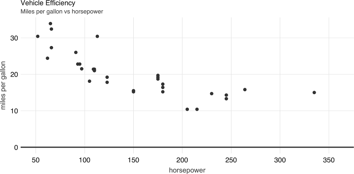

```{r, echo=F}
library(knitr)
library(formatR)
opts_chunk$set(tidy=T, message=FALSE, fig.align='center', eval=F)
```


# Foreword

Apache Spark is a distributed computing platform built on extensibility: Spark’s APIs
make it easy to combine input from many data sources and process it using diverse
programming languages and algorithms to build a data application. R is one of the
most powerful languages for data science and statistics, so it makes a lot of sense to
connect R to Spark. Fortunately, R’s rich language features enable simple APIs for
calling Spark from R that look similar to running R on local data sources. With a bit
of background about both systems, you will be able to invoke massive computations
in Spark or run your R code in parallel from the comfort of your favorite R program‐
ming environment.
This book explores using Spark from R in detail, focusing on the `sparklyr` package
that enables support for `dplyr` and other packages known to the R community. It
covers all of the main use cases in detail, ranging from querying data using the Spark
engine to exploratory data analysis, machine learning, parallel execution of R code,
and streaming. It also has a self-contained introduction to running Spark and moni‐
toring job execution. The authors are exactly the right people to write about this
topic—Javier, Kevin, and Edgar have been involved in sparklyr development since
the project started. I was excited to see how well they’ve assembled this clear and
focused guide about using Spark with R.
I hope that you enjoy this book and use it to scale up your R workloads and connect
them to the capabilities of the broader Spark ecosystem. And because all of the infra‐
structure here is open source, don’t hesitate to give the developers feedback about
making these tools better.
— Matei Zaharia
Assistant Professor at Stanford University,
Chief Technologist at Databricks,
and original creator of Apache Spark

# Preface

In a world where information is growing exponentially, leading tools like Apache
Spark provide support to solve many of the relevant problems we face today. From
companies looking for ways to improve based on data-driven decisions, to research
organizations solving problems in health care, finance, education, and energy, Spark
enables analyzing much more information faster and more reliably than ever before.
Various books have been written for learning Apache Spark; for instance, Spark: The
Definitive Guide is a comprehensive resource, and Learning Spark is an introductory
book meant to help users get up and running (both are from O’Reilly). However, as of
this writing, there is neither a book to learn Apache Spark using the R computing lan‐
guage nor a book specifically designed for the R user or the aspiring R user.
There are some resources online to learn Apache Spark with R, most notably the
spark.rstudio.com site and the Spark documentation site at spark.apache.org. Both
sites are great online resources; however, the content is not intended to be read from
start to finish and assumes you, the reader, have some knowledge of Apache Spark, R,
and cluster computing.
The goal of this book is to help anyone get started with Apache Spark using R. Addi‐
tionally, because the R programming language was created to simplify data analysis, it
is also our belief that this book provides the easiest path for you to learn the tools
used to solve data analysis problems with Spark. The first chapters provide an intro‐
duction to help anyone get up to speed with these concepts and present the tools
required to work on these problems on your own computer. We then quickly ramp
up to relevant data science topics, cluster computing, and advanced topics that should
interest even the most experienced users.
Therefore, this book is intended to be a useful resource for a wide range of users,
from beginners curious to learn Apache Spark, to experienced readers seeking to
understand why and how to use Apache Spark from R.
This book has the following general outline:
xiiiIntroduction
In the first two chapters, Chapter 1, Introduction, and Chapter 2, Getting Started,
you learn about Apache Spark, R and the tools to perform data analysis with
Spark and R.
Analysis
In Chapter 3, Analysis, you learn how to analyze, explore, transform, and visual‐
ize data in Apache Spark with R.
Modeling
In the Chapter 4, Modeling and Chapter 5, Pipelines, you learn how to create stat‐
istical models with the purpose of extracting information, predicticting out‐
comes, and automating this process in production-ready workflows.
Scaling
Up to this point, the book has focused on performing operations on your per‐
sonal computer and with limited data formats. Chapter 6, Clusters, Chapter 7,
Connections, Chapter 8, Data, and Chapter 9, Tuning, introduce distributed com‐
puting techniques required to perform analysis and modeling across many
machines and data formats to tackle the large-scale data and computation prob‐
lems for which Apache Spark was designed.
Extensions
Chapter 10, Extensions, describes optional components and extended functional‐
ity applicable to specific, relevant use cases. You learn about alternative modeling
frameworks, graph processing, preprocessing data for deep learning, geospatial
analysis, and genomics at scale.
Advanced
The book closes with a set of advanced chapters, Chapter 11, Distributed R,
Chapter 12, Streaming, and Chapter 13, Contributing; these will be of greatest
interest to advanced users. However, by the time you reach this section, the con‐
tent won’t seem as intimidating; instead, these chapters will be equally relevant,
useful, and interesting as the previous ones.
The first group of chapters, 1–5, provides a gentle introduction to performing data
science and machine learning at scale. If you are planning to read this book while also
following along with code examples, these are great chapters to consider executing
the code line by line. Because these chapters teach all of the concepts using your per‐
sonal computer, you won’t be taking advantage of multiple computers, which Spark
was designed to use. But worry not: the next set of chapters will teach this in detail!
The second group of chapters, 6–9, introduces fundamental concepts in the exciting
world of cluster computing using Spark. To be honest, they also introduce some of
the not-so-fun parts of cluster computing, but believe us, it’s worth learning the con‐
cepts we present. Besides, the overview sections in each chapter are especially
xiv | Prefaceinteresting, informative, and easy to read, and help you develop intuitions as to how
cluster computing truly works. For these chapters, we actually don’t recommend exe‐
cuting the code line by line—especially not if you are trying to learn Spark from start
to finish. You can always come back and execute code after you have a proper Spark
cluster. If you already have a cluster at work or you are really motivated to get one,
however, you might want to use Chapter 6 to pick one and then Chapter 7 to connect
to it.
The third group of chapters, 10–13, presents tools that should be quite interesting to
most readers and will make it easier to follow along. Many advanced topics are pre‐
sented, and it is natural to be more interested in some topics than others; for instance,
you might be interested in analyzing geographic datasets, or perhaps you’re more
interested in processing real-time datasets, or maybe you’d like to do both! Based on
your personal interests or problems at hand, we encourage you to execute the code
examples that are most relevant to you. All of the code in these chapters is written to
be executed on your personal computer, but you are also encouraged to use proper
Spark clusters given that you’ll have the tools required to troubleshoot issues and
tune large-scale computations.

## Formatting

Tables generated from code are formatted as follows:

```{r}
# A tibble: 3 x 2
numbers text
<dbl> <chr>
1 1 one
2 2 two
3 3 three
```

The dimensions of the table (number of rows and columns) are described in the first
row, followed by column names in the second row and column types in the third row.
There are also various subtle visual improvements provided by the tibble package
that we make use of throughout this book.
Most plots are rendered using the ggplot2 package and a custom theme available in
the appendix; however, because this book is not focused on data visualization, we
only provide code to render a basic plot that won’t match the formatting we applied.
If you are interested in learning more about visualization in R, consider specialized
books like R Graphics Cookbook (O’Reilly).

## Acknowledgments

We thank the package authors that enabled Spark with R: Javier Luraschi, Kevin Kuo,
Kevin Ushey, and JJ Allaire (sparklyr); Romain François and Hadley Wickham
Preface | xv(dbplyr); Hadley Wickham and Edgar Ruiz (dpblyr); Kirill Mülller (DBI); and the
authors of the Apache Spark project itself, and its original author Matei Zaharia.
We thank the package authors that released extensions to enrich the Spark and R eco‐
system: Akhil Nair (crassy); Harry Zhu (geospark); Kevin Kuo (graphframes, mleap,
sparktf, and sparkxgb); Jakub Hava, Navdeep Gill, Erin LeDell, and Michal Maloh‐
lava (rsparkling); Jan Wijffels (spark.sas7bdat); Aki Ariga (sparkavro); Martin
Studer (sparkbq); Matt Pollock (sparklyr.nested); Nathan Eastwood (sparkts); and
Samuel Macêdo (variantspark).
We thank our wonderful editor, Melissa Potter, for providing us with guidance,
encouragement, and countless hours of detailed feedback to make this book the best
we could have ever written.
To Bradley Boehmke, Bryan Adams, Bryan Jonas, Dusty Turner, and Hossein Falaki,
we thank you for your technical reviews, time, and candid feedback, and for sharing
your expertise with us. Many readers will have a much more pleasant experience
thanks to you.
Thanks to RStudio, JJ Allaire, and Tareef Kawaf for supporting this work, and the R
community itself for its continuous support and encouragement.
Max Kuhn, thank you for your invaluable feedback on Chapter 4, in which, with his
permission, we adapted examples from his wonderful book Feature Engineering and
Selection: A Practical Approach for Predictive Models (CRC Press).
We also thank everyone indirectly involved but not explicitly listed in this section; we
are truly standing on the shoulders of giants.
This book itself was written in R using bookdown by Yihui Xie, rmarkdown by JJ Allaire
and Yihui Xie, and knitr by Yihui Xie; we drew the visualizations using ggplot2 by
Hadley Wickham and Winston Chang; we created the diagrams using nomnoml by
Daniel Kallin and Javier Luraschi; and we did the document conversions using pan
doc by John MacFarlane.
Conventions Used in This Book
The following typographical conventions are used in this book:
Italic
Indicates new terms, URLs, email addresses, filenames, and file extensions.
Constant width
Used for program listings as well as within paragraphs to refer to program ele‐
ments such as variable or function names, databases, data types, environment
variables, statements, and keywords.
xvi | PrefaceConstant width bold
Shows commands or other text that should be typed literally by the user.
Constant width italic
Shows text that should be replaced with user-supplied values or by values deter‐
mined by context.
This element signifies a tip or suggestion.
This element signifies a general note.

## Using Code Examples

Supplemental material (code examples, exercises, etc.) is available for download at
https://github.com/r-spark/the-r-in-spark.
This book is here to help you get your job done. In general, if example code is offered
with this book, you may use it in your programs and documentation. You do not
need to contact us for permission unless you’re reproducing a significant portion of
the code. For example, writing a program that uses several chunks of code from this
book does not require permission. Selling or distributing a CD-ROM of examples
from O’Reilly books does require permission. Answering a question by citing this
book and quoting example code does not require permission. Incorporating a signifi‐
cant amount of example code from this book into your product’s documentation does
require permission.
We appreciate, but do not require, attribution. An attribution usually includes the
title, author, publisher, and ISBN. For example: “Mastering Spark with R by Javier Lur‐
aschi, Kevin Kuo, and Edgar Ruiz (O’Reilly). Copyright 2020 Javier Luraschi, Kevin
Kuo, and Edgar Ruiz, 978-1-492-04637-0.”
If you feel your use of code examples falls outside fair use or the permission given
above, feel free to contact us at permissions@oreilly.com.
Preface | xviiO’Reilly Online Learning
For almost 40 years, O’Reilly Media has provided technology
and business training, knowledge, and insight to help compa‐
nies succeed.
Our unique network of experts and innovators share their knowledge and expertise
through books, articles, conferences, and our online learning platform. O’Reilly’s
online learning platform gives you on-demand access to live training courses, indepth learning paths, interactive coding environments, and a vast collection of text
and video from O’Reilly and 200+ other publishers. For more information, please
visit http://oreilly.com.

## How to Contact Us

Please address comments and questions concerning this book to the publisher:
O’Reilly Media, Inc.
1005 Gravenstein Highway North
Sebastopol, CA 95472
800-998-9938 (in the United States or Canada)
707-829-0515 (international or local)
707-829-0104 (fax)
We have a web page for this book, where we list errata, examples, and any additional
information. You can access this page at https://oreil.ly/SparkwithR.
To comment or ask technical questions about this book, send email to bookques‐
tions@oreilly.com.
For more information about our books, courses, conferences, and news, see our web‐
site at http://www.oreilly.com.
Find us on Facebook: http://facebook.com/oreilly
Follow us on Twitter: http://twitter.com/oreillymedia
Watch us on YouTube: http://www.youtube.com/oreillymedia

# 第一章 引言

> 你什么都不知道，Jon Snow。

> — Ygritte

随着信息以指数的速率增长，历史学家把这段历史时期称作信息时代也就不意外了。逐步加速的数据收集速度也创造了很多新的机会，并且必然会创造更多的机会。本章介绍一些用于解决大规模数据挑战的工具。首先，作为处理大规模数据集的流行工具，本章会介绍Apache Spark。有了这一基础，我们会介绍R编程语言，它是专门设计用于简化数据分析的。最后，我们会介绍`sparklyr`，该项目将R和Spark结合成为大家都可使用的强大工具。

*第二章，这就开始*会介绍用于在个人电脑上执行Spark和R运算所需的预备知识，工具和步骤。你会学到如何安装和初始化Spark，了解常见操作，处理第一份数据和完成建模任务。本章的目的就是要帮助读者掌握处理大规模数据问题所需的概念和工具，而这些问题目前只有少数组织可以接触到。

然后，你可以继续学习如何分析大规模数据，以及构建模型支持预测趋势和发现隐藏在海量信息中的知识。接着，你可以掌握一些用于执行数据分析和大规模建模的工具。后续章节会帮助你从本地计算机中跳出来，转向计算集群，以便解决许多真实世界的问题。最后几章会介绍一些其他的话题，例如实时数据处理和图分析，可以帮助你真正的掌握任何规模数据分析的最先进的技能。本书的最后一章会介绍一些工具和想法，读者可以考虑在Spark和R社区中做些贡献。

我们希望，阅读本书能成为一种愉悦的经历，可以帮助你解决职业生涯的数据问题，并推动世界作出有利于所有人的更好决策。

## 概述

人类大约从公元前3000年苏美尔人时期就开始用美索不达米亚成熟的书写体系保存，获取，操作和沟通信息了 。根据使用的保存和处理技术，人类的信息处理可能分成四个不同的发展时期：前机械工具时期（公元前3000至公元后1450年），机械工具时期（1450–1840），电子机械时期（1840–1940），和电子时期（1940至今）[^1]。

[^1]:Laudon KC, Traver CG, Laudon JP (1996). “Information technology and systems.” Cambridge, MA: Course Technology。

数学家George Stibitz在1942年使用词语digital来描述快速的电子脉冲[^2]。直到今天，我们把用电子格式存储的信息还叫做数字信息。相反，模拟信息表示用非电子格式存储的各种信息，例如手写笔记，书籍，报纸等。

[^2]: Ceruzzi PE (2012). Computing: a concise history. MIT Press.

世界银行发布的关于数字发展的报告给出了过去三十年保存下来的数字信息和模拟信息总量估计[^3]。这份报告指出数字信息大概在2003年超过了模拟信息，其总量有大约一千万太字节，大约相当于今天的一千万存储驱动。然而，这份报告中更相关的发现是，我们的数字信息正在以指数的速度增长。图1-1展示了这份报告的结论。注意到，每隔一年，世界上的信息都会增长10倍。

[^3]: Group WB (2016). The Data Revolution. World Bank Publications.

为了提供工具找出所有新的数字信息，许多公司都试图提供相关的功能，例如我们今天熟知的用于搜索网络的搜索引擎。给定海量的数字信息，管理如此规模的信息绝对是一项挑战。搜索引擎并不能存储所有的网页信息，支持在单一电脑上搜索网页。这就意味着它必须把信息分成几个文件，并存储在多个机器上。这项技术就是*谷歌文件系统（Google File System）*，它在谷歌2003年发表的学术文献中有介绍[^4]。

[^4]: Ghemawat S, Gobioff H, Leung S (2003). “The Google File System.” In Proceedings of the Nineteenth ACM Symposium on Operating Systems Principles. ISBN 1-58113-757-5.


## Hadoop

一年以后，谷歌发表了新的的文章，描述了如何在谷歌文件系统上执行操作，也就是后来的*MapReduce*技术。[^5]。正如你可以预见到的，MapReduce中有两种操作：map和reduce。*map*操作提供任意一种方法把每个文件转化为一个新的文件，而*reduce*操作可以合并两个文件。两种操作都需要定制计算机代码，而MapReduce框架关注一次性在多个电脑上的自动执行。这两个操作足够支持网络上所有数据的处理，同时也提供足够的灵活性从数据中得到有意义的信息。

[^5]: Dean J, Ghemawat S (2004). “MapReduce: Simplified data processing on large clusters.” In USENIX Symposium on Operating System Design and Implementation (OSDI).

例如在图1-2中，我们可以使用MapReduce计算存放在不同机器上的两个不同文本文件的词语数量。map操作切分原始文件中的每个词语，并输出一个新的词语计数文件，其包含词语到计数的映射。reduce操作可以定义成对两个词语计数文件的合并，其通过整合每个词语的计数总数来实现。最终的文件会包含来自所有原始文件的词语计数。

词语计数通常是最基础的MapReduce示例，但是我们也可以使用MapReduce完成更加复杂和有趣的应用。例如，我们可以在谷歌的PageRank算法中对网页排序，该算法可以基于链接到一个网页的超链接数对所有网页排序，以及给出该网页的排位。


在谷歌发表了这些文献之后，雅虎的一个团队致力于实现谷歌文件系统和MapReduce作为一个单一的开源项目。这个项目就是2006发布的*Hadoop*，其中谷歌文件系统通过*Hadoop分布式文件系统（Hadoop Distributed File System，HDFS）*。Hadoop项目使得基于分布式文件的计算可以被更多的用户和组织获取，这也使得MapReduce的能力突破了网络数据处理。

尽管Hadoop提供了在分布式文件系统上执行MapReduce操作的支持，但是它依然需要在每次数据分析的时候写好MapReduce操作代码。为了改进这一繁琐的过程，Facebook于2008年发布了Hive项目。它给Hadoop引入了*结构化查询语句（Structured Query Language，SQL）*。这意味着大规模数据分析不再需要为每个MapReduce操作编写代码。相反，用户可以用SQL编写原生的，更加容易理解和编写的数据分析语句。

## Spark

2009年，Apache Spark开始作为加州大学伯克利分校AMP实验室的科研项目，以期改进MapReduce。Spark针对性的提供了更加丰富的MapReduce以外的运算符集合，便于优化多个机器上代码运行。Spark同时将数据加载到内存中，使得各种操作要比Hadoop的磁盘存储快很多。最新的一项结果显示，运行逻辑斯蒂回归，一种在第四章中介绍的数据建模技术，利用内存中数据集的Spark要比Hadoop快10倍[^6]。类似于图1-3的结果在原始研究文献中也有展示。

[^6]: Zaharia M, Chowdhury M, Franklin MJ, Shenker S, Stoica I (2010). “Spark: Cluster computing with working sets.” HotCloud, 10(10-10), 95.


尽管Spark以内存操作性能而闻名，而当初设计时是作为支持内存和磁盘操作的一种通用执行引擎。例如，Spark创造了新的大规模排序记录，而这些数据并没有存在内存中。相反，Spark改进了网络序列化，网络改组，CPU缓存的高效利用，进而极大的提高了性能。如果你需要对大规模数据进行排序，世界上没有比Spark更快的系统了。

为了让你了解Spark有多快多高效，Hadoop使用了72分钟，2,100台计算机完成对100太字节数据的排序，但是Spark只用了23分钟和206台计算机。另外，Spark拥有云端排序记录，使得其成为云端对大规模数据进行排序的最剧性价比的解决方案。

| |Hadoop记录 |Spark记录|
|-----|-----|------|
|数据规模| 102.5 TB |100 TB|
|使用时间| 72分钟|23分钟|
|节点数量| 2,100 |206|
|核心数量| 50,400 |6,592|
|磁盘| 3,150 GB/秒| 618 GB/秒|
|网络| 10 GB/秒| 10 GB/秒|
|排序速度| 1.42 TB/分钟 |4.27 TB/分钟|
|排序速度/节点| 0.67 GB/分钟| 20.7 GB/分钟|


Spark也比Hadoop易用。例如，词语计数的MapReduce示例在Hadoop中需要50行代码，而在Spark中只需要2行代码。正如所见，和Hadoop相比，Spark更快，更高效，更易用。

2010年，Spark作为开源项目发布出来，并于2013年捐赠给了Apache软件基金会。Spark执行Apache 2.0协议，运行用户免费使用，修改和分发。Spark有超过1,000名贡献者，是Apache软件基金会中最活跃的项目。

下面的表述介绍了Spark的定位。我们可以按照项目网站那样正式介绍Apache Spark：

> Apache Spark是一个面向大规模数据处理的统一分析引擎。

为了帮助我们理解Apache Spark的概念，我们把它分成如下几个方面：

* 统一

    Spark支持许多程序包，集群技术和存储系统。

* 分析

    分析是发现和理解数据，以期产出和沟通信息的行为。

* 引擎

    Spark是高效的和原生的。

* 大规模

    你可以把大规模理解成集群规模，一些连接一起的，共同工作的计算机。

Spark可以看做是一种*引擎*，因为它是原生和高效的。它的原生性是因为Spark可以优化和执行原生代码，也就是说，对于Spark中的程序代码并没有什么类型限制。它的高效性是因为Spark可以有效利用内存，网络和CPU加速计算集群中的数据处理算法，正如之前提到的，比其它技术都要快速。

这些特点使得Spark在许多分析任务中，例如Netflix的电影排序，蛋白质序列对齐，和CERN的高能物理分析，成为理想的工具。

作为一种*统一*的平台，Spark可以支持许多集群技术和多种数据源。你可以分别在第六章和第八章中了解到。它也可以支持许多不同的程序包，例如Spark SQL，MLlib，GraphX和Spark Streaming，分别支持分析，建模，图处理和实时数据处理。总之，Spark是一种支持请求集群，数据源和各种程序包的平台，进而实现大规模计算，如图1-4所示。


Spark支持大规模运算，意味着Spark的良好用例应该是使用多台机器解决问题。例如，当数据无法在单个磁盘或内存中存放，Spark会是一种良好的备选方案。然而，你也可以在面对非大规模问题的时候考虑使用Spark。此时，多台计算机可以加速计算。例如，CPU密集型的模型和科学模拟也可以从Spark中受益。

因此，Spark不但擅长解决大规模数据处理问题，即通常所说的*大数据*（数据集比传统的要更加庞大和复杂），而且擅长解决大规模计算问题，即通常所说的*大计算*（协调使用大量CPU和内存资源的工具和技术）。大数据经常需要大计算，但是*大计算不一定需要大数据*。

大数据和大计算问题通常很容易识别。如果数据不能存放在单个机器，你就遇到了大数据问题；如果数据可以存放在单个机器，但是数据处理却需要数天，数周甚至更长的时间来完成，你就遇到了大计算问题。

但是，还有第三类问题，既不是大数据问题，也不是大计算问题，它们也可以从类似Spark的集群计算框架中受益良多。这类问题，有以下几种场景：

* 高速性

    假设你有一个10GB的数据集，它的数据处理过程需要30分钟。这既不是一个大数据问题也不是一个大计算问题。但是，如果你突然要想着改进模型的准确率，减少运行时间到3分钟以内，这就是一个显著的改进。这种数据分析速度的改进可以带来有意义的推进和生产力的提高。另外，你也可能需要更快的处理数据速度，比如支持股票交易。尽管三分钟已经足够快，但是这对于实时数据处理依然很慢。这种场景下，你可能需要在几秒内甚至几毫秒内完成数据处理。

* 多样性
  
    你可能有了一个高效的数据收集流程，从多个数据源收集数据放在一个位置，通常是一个数据库。这个过程可能已经非常高效并且接近实时。这样的过程就是通常所说的*抽取，转换和加载*（Extract, Transform,
Load，ETL）；数据从多个数据源抽取，转换成所需的格式，加载到单个数据存储结构中。尽管这一方法已经流行了多年，但是其中的权衡是添加新的数据源代价很高。因为系统是集中控制的，并且是严密操作的，任何改变都可能使整个过程暂停；因此，添加新的数据源通常要花费很长的时间才能实现。相反，你可以把全部数据按照自然格式存放，并且按照需要使用集群处理，即数据湖的架构。另外，按照原始格式存放数据支持处理图片，声音，和视频格式的新文件，而不需要明确如何把它们放进传统的结构化存储系统。

* 真实性

    当使用多个数据源的时候，你可能发现它们之间的数据质量参差不齐，需要专门的分析方法来改进准确性。例如，假设你有一个城市列表，取值包括旧金山，西雅图，和波士顿。当数据包含拼错的单词，例如“Bston”，会发生什么呢？在传统的关系型数据库中，这类非法输入可能会被舍弃。但是，舍弃取值并不一定所以情形下是最好的方法；你会希望利用地理编码，交叉验证数据源，或者尽最大努力匹配来纠正这些字段。所以，理解和改进原始数据源的真实性可以带来更准确的结果。

如果我们把“海量性”当做是大数据的同义词，你就得到了方便记忆的大数据的4个V。一些人也把它扩展成5个V甚至10个V。除了几个便于记忆的符号，今天集群计算也正在以更加创新的方式使用。看到各个组织实验新的工作流，以及传统意义上并不适用集群计算的各种任务，已经不再稀奇。更多的源于大数据的热潮都是这类问题。严格意义上讲，你不是在解决大数据，但是依然可以从大数据和大计算工具的使用中获益。

我们希望本书可以帮助你理解集群计算的机遇和局限，特别是使用Apache Spark和R的机遇和局限。

## R

R编程语言源于诞生在贝尔实验室的S语言。Rick Becker在2016年的useR会议上解释，在那时的贝尔实验室里，计算是通过调用Fortran语句写成的子程序而实现的，而这种程序显然不好处理。而S计算语言当时是作为一种接口语言而设计的，它可以解决特殊的问题，而不需要使用其他语言，例如Fortran。S语言的发明者，John Chambers在图1-5中给出了S是如何设计出来了，进而提供简化数据处理的一种接口，他的共同发明者也在2016年的useR!上展示了这一原图，启发了S的设计。


R语言是S语言一种现代而自由的实现。特别的，根据《面向统计计算的R项目》：

> R是一种面向统计计算和图形学的编程语言和免费软件。

处理数据的时候，我们相信R语言有两大特点：

* R语言

    R是由统计学家设计的，也是面向统计学家使用的。这意味着R是少有的，成功的面向非编程人员的编程语言之一。所以学习R会更加自然。另外，因为R语言是其他语言和工具的接口，所以R可以让你更多的关注理解问题，而更少的花在计算机科学和工程上。

* R社区

    R社区通过*R语言综合文档网络（Comprehensive R Archive Network，CRAN）*提供了丰富的程序包，支持安装即时可用的程序包，来执行各种任务——最享有盛名的高质量数据操作，可视化，和统计模型。许多操作只能在R中进行。另外，R社区是一个热情的，活跃的组织，这些优秀的朋友都愿意帮助你成功。R社区提供的许多程序包，到目前为止，都是统计计算的最优选择。一些下载最多的程序包包括：操作数据的`dplyr`，分析聚类的`cluster`，可视化数据的`ggplot2`。通过画出每天CRAN里R程序包的下载量，图1-6定量刻画了R社区的增长。


除了统计分析，R也用在其他领域。以下领域和本书高度相关：

* 数据科学

    数据科学基于来自统计学和计算机科学的知识和实践，通过数据分析和建模技术把原始数据变成深刻理解[^7]。统计学的方法提供了理解世界和进行预测的坚实基础，而计算机模型中的自动化技术可以让我们简化统计分析并易于实现。一些人认为，统计学应该重新命名为数据科学[^8]，然而数据科学结合了计算机的进展，并超出了统计学的范畴[^9]。本书给出了统计学中常见的分析和建模技术，但是会应用到大数据集上，而这又需要分布式计算的成果。

[^7]: Wickham H, Grolemund G (2016). R for data science: import, tidy, transform, visualize, and model data. O’Reilly Media, Inc
[^8]: Wu CJ (1997). “Statistics = Data Science?”
[^9]: Cleveland WS (2001). “Data Science: An Action Plan for Expanding the Technical Areas of the Field of Statistics?”

* 机器学习

    机器学习利用来自于统计学和计算机科学的实践。但是，它更多的关注自动化和预测。例如，Arthur Samuel在实现跳棋的计算机自动化程序的时候发明了词语machine learning[^10]。尽管我们可以在专门的游戏上实践数据科学，但是编写一个跳棋的程序需要我们自动化整个过程。因此，这个问题就是机器学习的范畴，而不是数据科学的范畴。机器学习使得许多用户在无意识中利用统计学的方法成为可能。机器学习中最重要的一个应用是过滤垃圾邮件。在这个例子中，只做数据分析和对每个邮箱账户建模是不可行的，因此机器学习可以自动化发现垃圾邮件的整个过程，并在用户没有参与的情况下过滤出去。本书给出了把数据科学工作流转换为完全自动化的机器学习的方法，例如，支持构建和导出Spark流程，以便容易的在自动化环境中复用此流程。
    
[^10]: Samuel AL (1959). “Some studies in machine learning using the game of checkers.” IBM Journal of research and development, 3(3), 210–229.

* 深度学习

    深度学习建立在统计学，数据科学和机器学习知识的基础上，并受到生物神经系统的些许启发而定义模型。当梯度散失问题通过一次一层的训练解决后，深度学习就从神经网络模型逐步进化了[^11]，并被证明在图像识别和语音识别任务中非常强大。例如，在语音助手应用中，诸如Siri，Alexa，Cortana，或谷歌助手，实现语音到文本转换的模型大部分都是基于深度学习模型。尽管*图形处理器（Graphic Processing Units，GPUs）*已经成功的用在了训练深度学习过程中[^12]，一些数据集并不能在单个GPU上处理。另一个事实是，深度学习模型需要大量的数据。这也需要在多个机器上预处理一下，然后才交给单个GPU训练。本书并不会直接给出深度学习模型的任何参考文献。但是你可以使用我们在本书中给出的方法，准备深度学习数据。在未来几年里，使用深度学习大规模计算技术会变得非常普遍。事实上，Spark的最新版本已经加入了为执行深度学习训练而优化过的模型。
    
[^11]:Hinton GE, Osindero S, Teh Y (2006). “A fast learning algorithm for deep belief nets.” Neural computation, 18(7), 1527–1554.
[^12]:Krizhevsky A, Sutskever I, Hinton GE (2012). “Imagenet classification with deep convolutional neural networks.” In Advances in neural information processing systems, 1097–1105.

处理上述几个领域时，你要么会面对逐渐增大的数据集，要么会面对逐渐复杂的计算过程。这些流程执行起来都很慢，或者某些时候在单台计算机上变得不可能。但是，要知道，Spark并不一定是所有计算问题的答案。而面对R中的计算问题时，使用以下技术会很有效：

* 采样

    第一个要尝试的技术是通过采样，减少需要处理的数据量。然而，我们必须使用可靠的统计学原理，合适地采样数据。例如，选取有序数据集的头部数据是不够的。使用随机采样，会得到占比较少的数据集。这些都可以通过分层采样克服，但是选取合适的类别增加了算法复杂度。讲解如何进行合适的统计采样超出了本书的范畴，但是有很多有用的资源都是关于这个话题的。

* 分析器

    你可以试着理解为什么计算很慢，进而需要改进。分析器是检查代码执行情况，帮助识别瓶颈的工具。在R中，R的分析器，`profvis`程序包和RStudio的分析器功能可以让你轻松的重试和可视化一个分析器。然而，优化代码通常并不容易。

* 纵向扩展

    加速计算通过可以通过购买更快或者更强劲的硬件（即提高机器内存，更新硬盘，或者使用CPU更多的计算器）来实现。这些手段叫做纵向扩展。但是，对于单个计算机的纵向扩展通常存在硬极限，即使使用大量的CPU，你还需要新的框架来有效地并行化计算。

* 横向扩展

    最后，我们可以考虑把计算和存储扩大到对台机器上。这种手段提供了最高纬度的扩展性能。因为你可以使用任意数量的机器来执行计算。这个技术通常叫做横向扩展。但是，有效的扩展计算是一项复杂的实践，特别是没有使用专门的工具和框架，例如Apache Spark的时候。

最后一点更加具体的介绍了本书的目的，即Apache Spark提供的分布式计算系统的能力，借助R解决数据科学和相关领域中有意义的计算问题。

## `sparklyr`

考虑到Spark提供的计算能力和R语言的易用性，我们很自然的想让二者无缝的结合起来。这也是R社区期望的：提供Spark接口的R程序包用起来很简单，并与其它R程序包兼容，而且可以在CRAN上找到。为此，我们开始开发`sparklyr`。第一版，`sparklyr 0.4`，在2016年的useR!大会上发布。第一版包括对`dplyr`，`DBI`，建模工具`MLlib`的支持，以及支持类似H2O的`rsparkling`程序包的可扩展API。 从此，许多新的功能和改进在`sparklyr 0.5, 0.6, 0.7, 0.8, 0.9`和`1.0`做了实现。

根据官方定义，`sparklyr`是Apache Spark的R语言接口。它可以通过CRAN获取，像其他CRAN程序包一样工作。这意味着人们无需知道Spark的版本，易于安装，同时服务于R社区，兼容其他R程序包，并接受来自R社区的使用反馈，等等。它托管在GitHub，遵循Apache 2.0协议，允许克隆，修改，并参与项目开发。使用`sparklyr`的用户应该包含以下角色：

* 新用户

    对于新用户，我们坚信`sparklyr`提供了使用Spark的最简单的方式。我们希望本书的前面几章可以帮助你逐渐熟悉并毫无压力的使用Spark，进而为长期任务做准备。

* 数据科学家

    对于已经使用和钟爱R的数据科学家，`sparklyr`整合了许多其他的R实践和程序包，例如`dplyr`，`magrittr`，`broom`，`DBI`，`tibble`，`rlang`，以及其它框架，让你使用Spark从容自如。而对于R和Spark的新手，`sparklyr`的高级别工作流整合和低级别扩展机制保证Spark是一个高产的环境，可以满足每个数据科学家的需求和技能。

* 专家用户

    对于已经深度使用Spark，并可以编写Scala原生代码的用户，可以考虑让你的Spark程序包作为一个R程序包贡献给R社区。一个多样的，强大的社区可以让你的工作贡献出最好的价值，促进开源社会的发展。

我们编写这本书是为了介绍和传授Apache Spark和R融合的部分。`sparklyr`就是把这些社区，期望和未来方向，程序包及其扩展整合在一起的R程序包。我们相信，有机会使用这本书来搭起R和Spark社区的桥梁：给R社区介绍为什么Spark让人兴奋，给Spark社区介绍为什么R如此伟大。两个社区都在使用不同的技术和背景来解决相似的问题。因此，我们希望`sparklyr`可以是创新的肥沃土壤，是新手的好客之地，是数据科学达人的高产环境，也是集群计算，数据科学，机器学习一起交流的开放社区。

## 总结

本章介绍了Spark这一现代而强大的计算平台，R这一易用的，基于扎实的统计建模理论的计算语言，以及`sparklyr`这一连接两个技术和社区的项目。w我们处在一个信息指数级增长的世界，学习如何分析大规模数据可以帮助你解决当今人类面临的问题和机遇。但是，在分析数据之前，第二章会介绍本书后面内容所需的工具。确保你可以明白每一步操作，并花点时间安装推荐的工具，它们会成为你经常使用和喜爱的资源。

----------

# 第二章 开始

> I always wanted to be a wizard.

> — Samwell Tarly

完成第一章的学习，你应该熟悉了Spark可以解决的各类问题。显而易见，Spark利用多台计算机来解决数据无法在单个机器上运行或者计算太慢的问题。如果你是R的新手，也可以看到，把Spark和数据科学工具，例如可视化工具`ggplot2`，数据变换的`dplyr`，结合起来可以给大规模数据科学项目带来美好的愿景。我们也希望你为自己成为大规模数据计算高手而感到兴奋。

在本章中，我们会浏览一下成为Spark高手所需要的工具。我们鼓励你能够实现本章的代码，因为这样会让你理解分析，建模，读取和写入数据的各种动作。换句话说，你需要坚持不懈，在使用Spark前反复实践。

在第三章中，我们会深入介绍分析，建模，并给出在单个集群上，也就是你的个人电脑上运行的例子。后续章节介绍集群计算，以及成功在多台机器上运行代码所需的概念和技术。

## 概述

R使用`sparklyr`来打通Spark和本地集群，整个过程和安装加载`sparklyr`程序包一样简单，后面安装Spark也通过`sparklyr`完成。但是，我们假设你在使用一个全新的电脑运行Windows，macOS或者Linux，因此我们会在连接本地Spark集群前，完成预备操作。

尽管本章是为了在个人电脑上使用Spark做准备，一些读者可能已经有了Spark集群，或者喜欢使用在线Spark集群。例如，Databricks托管了一个免费的社区版的Spark，你可以很容易的从浏览器访问。如果你最终选择了这条路，可以跳过“预备操作”。但是要确保你查阅了合适的资源，支持已有的或在线的Spark集群。或者，完成预备操作后，你首先要学习如何连接Spark。我们会介绍本书后续章节中用到的最重要的工具和操作。我们不会过多关注教授概念或者如何使用概念。我们不可能在一章中解释完建模或流式计算。但是，完成本章的学习让你窥见到Spark的能力，以及确信工具已经完成正确的部署，可以应付未来更多棘手的问题了。

所用的工具大部分都分成R代码和Spark网络接口。所有Spark操作都在R中运行。但是，分布式操作的监控动作在Spark的网络接口操作，你可以从任何一个网络浏览器加载看到。然后我们断开本地集群的连接。虽然容易忘记，我们还是强烈建议在使用本地集群和共享集群的时候能够记得这一操作.

本章末尾会介绍一些功能，使得在Rstudio中操作Spark更容易。更具体的，我们会介绍由`sparklyr`实现的RStudio扩展。但是，如果你喜欢使用Jupyter Notebooks或者你的集群已经装好了别的R用户界面，确保你可以通过纯R代码使用Spark。现在，让我们开始学习预备操作。

## 预备操作

R可以在许多平台和环境中运行。所以，不管你用Windows，Mac，还是Linux，第一步都需要从r-project.org安装R。具体信息在“安装R”中有说明。

大部分人在使用编程语言时会使用工具，以便让编程更加高效。对于R，RStudio就是这样一个工具。严格地说，RStudio是一个*集成开发环境（integrated development environment，IDE）*，现在它也支持许多平台和环境。如果还没有安装Rstudio，我们强烈推荐你安装，具体操作见“安装RStudio”。

> 使用Windows的时候，我们建议不要使用路径上有空格的目录。如果运行`getwd()`返回了带有空格的路径，可以使用`setwd("path")`换成不带空格的路径，或者把RStudio项目创建到没有空格的路径中。

另外，因为Spark是用Scala实现的，运行在Java虚拟机（Java Virtual Machine，JVM）上，所有你还需要给系统安装Java 8。你的系统可能装了Java，但是还需要检查版本，按照“安装Java”的内容升级或降级。你可以使用如下R命令检查安装在系统的版本：

```
system("java -version")
java version "1.8.0_201"
Java(TM) SE Runtime Environment (build 1.8.0_201-b09)
Java HotSpot(TM) 64-Bit Server VM (build 25.201-b09, mixed mode)
```
你也可以运行`Sys.setenv(JAVA_HOME = "path-to-java-8")`，使用`JAVA_HOME`环境变量来指定具体的Java版本，或者，在安装`sparklyr`之前，确保R环境可以使用Java 8版本。

### 安装`sparklyr`

和许多其他的R程序包一样，你可以使用如下命令安装CRAN上的`sparklyr`：

```{r}
install.packages("sparklyr")
```
本书的示例假设你使用最新版本的`sparklyr`。你可以运行如下代码，验证你的版本是不是我们的一样新：

```{r}
packageVersion("sparklyr")
[1] '1.0.2'
```

### 安装Spark

使用`sparklyr`安装:

```{r}
library(sparklyr)
```
这个代码可以实现R中所有的`sparklyr`函数，非常有用。否则，你需要带着前缀`sparklyr::`运行每一个`sparklyr`命令。

你可以简单的通过运行`spark_install()`安装Spark。这个命令可以在本地电脑上下载，安装和配置最新版本的Spark。但是，因为我们这本书是根据Spark 2.3编写的，所以你也可以安装这个版本，并顺畅的运行所有示例：
```{r}
spark_install("2.3")
```
你可以运行如下命令，输出所有可以安装的Spark版本：

```{r}
spark_available_versions()
## spark
## 1 1.6
## 2 2.0
## 3 2.1
## 4 2.2
## 5 2.3
## 6 2.4
```
你可以使用Spark版本信息安装特定的版本，或者也可以明确Hadoop版本。例如，要安装Spark 1.6.3，你可以运行：
```{r}
spark_install(version = "1.6.3")
```
你也可以使用如下命令，检查已经安装的版本：

```{r}
spark_installed_versions()
spark hadoop dir
7 2.3.1 2.7 /spark/spark-2.3.1-bin-hadoop2.7
```
Spark的安装路径通常是Spark的主目录，可以通过R代码和系统配置的`SPARK_HOME`标识符来定义。当你使用安装有`sparklyr`的本地Spark集群时，这个路径是已知的，不需要额外的配置。

最后，要卸载具体版本的Spark，你可以指定Spark和Hadoop的版本信息，运行`spark_uninstall()`，如下：
```{r}
spark_uninstall(version = "1.6.3", hadoop = "2.6")
```

> 默认的安装路径是：macOS和Linux的~/spark，Windows的%LOCALAPPDATA%/spark。要定制化安装路径，可以在`spark_install()`和`spark_connect()`之前运行`options(spark.install.dir = "installation-path")`。 

## 连接

到目前为止，我们只安装了本地集群。本地集群对于初始学习，测试代码，轻松的排查故障非常有好处。后面的章节会介绍在哪里发现，安装和连接真正的有多台机器的Spark集群。但是对于开始的几章，我们只会使用本地集群。

要连接本地集群，只需运行如下代码：
```{r}
library(sparklyr)
sc <- spark_connect(master = "local", version = "2.3")
```
> 如果你使用的是自己的或者在线的Spark集群，确保你是按照集群管理员的配置或者在线文档进行连接。如果你需要指针，可以参考第七章，它会详细介绍如何连接Spark集群。

`master`参数明确了Spark集群中哪一个是主机器。这个机器通常叫做*驱动节点（driver node）*。使用多台机器的真实集群时，你会发现大部分机器是工作机器，一个是主机器。因为我们只有一个单台机器的本地集群，从现在开始我们会默认使用“`local`”。

建立好连接后，`spark_connect()`会获取一个工作的Spark连接，通常在大部分代码中命名为`sc`，你可以使用`sc`执行Spark命令。

如果连接失败了，第七章包含有故障排查的章节，可以帮助你解决连接问题。

## 使用Spark

建立连接后，我们可以运行几个简单的命令。例如，首先使用`copy_to()`把`mtcars`数据集复制给Apache Spark:
```{r}
cars <- copy_to(sc, mtcars)
```
现在数据复制给了Spark，我们可以使用`cars`从R中请求数据。要打印具体内容，我们可以键入`*cars*`:

```{r}
cars
# Source: spark<mtcars> [?? x 11]
mpg cyl disp hp drat wt qsec vs am gear carb
<dbl> <dbl> <dbl> <dbl> <dbl> <dbl> <dbl> <dbl> <dbl> <dbl> <dbl>
1 21 6 160 110 3.9 2.62 16.5 0 1 4 4
2 21 6 160 110 3.9 2.88 17.0 0 1 4 4
3 22.8 4 108 93 3.85 2.32 18.6 1 1 4 1
4 21.4 6 258 110 3.08 3.22 19.4 1 0 3 1
5 18.7 8 360 175 3.15 3.44 17.0 0 0 3 2
6 18.1 6 225 105 2.76 3.46 20.2 1 0 3 1
7 14.3 8 360 245 3.21 3.57 15.8 0 0 3 4
8 24.4 4 147. 62 3.69 3.19 20 1 0 4 2
9 22.8 4 141. 95 3.92 3.15 22.9 1 0 4 2
10 19.2 6 168. 123 3.92 3.44 18.3 1 0 4 4
# … with more rows
```

很棒！你成功的连接了Spark并加载了第一个数据集。

让我们看看`copy_to()`做了什么操作。第一个参数`sc`，给函数提供了一个工作的Spark连接指向，这个连接是之前通过`spark_connect()`创建的。第二个参数给出了要加载到Spark的数据集。现在，`copy_to()`返回Spark中数据集，并由R环境自动打印。只要Spark打印数据集，它都会收集几条数据记录并在前台展示。在这个例子中，数据集只包含几行描述机动车型号的信息以及诸如马力，和每加仑可行驶英里数的说明。

## 网络接口

大部分Spark命令都在R控制台执行。但是，监控和分析动作是在Spark的网络界面完成，如图2-1所示。这个接口是Spark提供的网络应用，你可以运行如下代码进行请求：
```{r}
spark_web(sc)
```


打印`cars`数据集会收集几行记录并展示到R控制台。你可以在Spark网络接口中看到，一个作业用于在Spark中收集这个信息。你可以可选择Storage标签，查看Spark内存中的`mtcars`数据集，如图2-2所示。

注意，根据Fraction Cached列100%取值，这个数据集完全加载到了内存中。因此，根据Size in Memory列，你可以准确的看到这个数据集使用了多少内存。


The Executors tab, shown in Figure 2-3, provides a view of your cluster resources. For
local connections, you will find only one executor active with only 2 GB of memory
allocated to Spark, and 384 MB available for computation. In Chapter 9 you will learn
how to request more compute instances and resources, and how memory is allocated.


The last tab to explore is the Environment tab, shown in Figure 2-4; this tab lists all of
the settings for this Spark application, which we look at in Chapter 9. As you will
learn, most settings don’t need to be configured explicitly, but to properly run them at
scale, you need to become familiar with some of them, eventually.


Next, you will make use of a small subset of the practices that we cover in depth in
Chapter 3.

## Analysis

When using Spark from R to analyze data, you can use SQL (Structured Query Lan‐
guage) or dplyr (a grammar of data manipulation). You can use SQL through the DBI
package; for instance, to count how many records are available in our cars dataset,
we can run the following:

```{r}
library(DBI)
dbGetQuery(sc, "SELECT count(*) FROM mtcars")
count(1)
1 32
```

When using dplyr, you write less code, and it’s often much easier to write than SQL.
This is precisely why we won’t make use of SQL in this book; however, if you are pro‐
ficient in SQL, this is a viable option for you. For instance, counting records in dplyr
is more compact and easier to understand:
```{r}
library(dplyr)
count(cars)
# Source: spark<?> [?? x 1]
n
<dbl>
1 32
```

In general, we usually start by analyzing data in Spark with dplyr, followed by sam‐
pling rows and selecting a subset of the available columns. The last step is to collect
data from Spark to perform further data processing in R, like data visualization. Let’s
perform a very simple data analysis example by selecting, sampling, and plotting the
cars dataset in Spark:
```{r}
select(cars, hp, mpg) %>%
sample_n(100) %>%
collect() %>%
plot()
```

The plot in Figure 2-5 shows that as we increase the horsepower in a vehicle, its fuel
efficiency measured in miles per gallon decreases. Although this is insightful, it’s diffi‐
cult to predict numerically how increased horsepower would affect fuel efficiency.
Modeling can help us overcome this.



## Modeling

Although data analysis can take you quite far toward understanding data, building a
mathematical model that describes and generalizes the dataset is quite powerful. In
Chapter 1 you learned that the fields of machine learning and data science make use
of mathematical models to perform predictions and find additional insights.
Using Spark | 23For instance, we can use a linear model to approximate the relationship between fuel
efficiency and horsepower:

```{r}
model <- ml_linear_regression(cars, mpg ~ hp)
model
Formula: mpg ~ hp
Coefficients:
(Intercept) hp
30.09886054 -0.06822828
```
Now we can use this model to predict values that are not in the original dataset. For
instance, we can add entries for cars with horsepower beyond 250 and also visualize
the predicted values, as shown in Figure 2-6.

```{r}
model %>% 
ml_predict(copy_to(sc, data.frame(hp = 250 + 10 * 1:10))) %>%
transmute(hp = hp, mpg = prediction) %>%
full_join(select(cars, hp, mpg)) %>%
collect() %>%
plot()
```


Even though the previous example lacks many of the appropriate techniques that you
should use while modeling, it’s also a simple example to briefly introduce the model‐
ing capabilities of Spark. We introduce all of the Spark models, techniques, and best
practices in Chapter 4.

## Data
For simplicity, we copied the mtcars dataset into Spark; however, data is usually not
copied into Spark. Instead, data is read from existing data sources in a variety of for‐
mats, like plain text, CSV, JSON, Java Database Connectivity (JDBC), and many
more, which we examine in detail in Chapter 8. For instance, we can export our cars
dataset as a CSV file:
```{r}
spark_write_csv(cars, "cars.csv")
```
In practice, we would read an existing dataset from a distributed storage system like
HDFS, but we can also read back from the local file system:
```{r}
cars <- spark_read_csv(sc, "cars.csv")
```

## Extensions
In the same way that R is known for its vibrant community of package authors, at a
smaller scale, many extensions for Spark and R have been written and are available to
you. Chapter 10 introduces many interesting ones to perform advanced modeling,
graph analysis, preprocessing of datasets for deep learning, and more.
For instance, the sparkly.nested extension is an R package that extends sparklyr to
help you manage values that contain nested information. A common use case
involves JSON files that contain nested lists that require preprocessing before you can
do meaningful data analysis. To use this extension, we first need to install it as
follows:
```{r}
install.packages("sparklyr.nested")
```
Then, we can use the sparklyr.nested extension to group all of the horsepower data
points over the number of cylinders:
```{r}
sparklyr.nested::sdf_nest(cars, hp) %>%
group_by(cyl) %>%
summarise(data = collect_list(data))
# Source: spark<?> [?? x 2]
cyl data
<int> <list>
1 6 <list [7]>
2 4 <list [11]>
3 8 <list [14]>
```
Even though nesting data makes it more difficult to read, it is a requirement when
you are dealing with nested data formats like JSON using the spark_read_json()
and spark_write_json() functions.

## Distributed R
For those few cases when a particular functionality is not available in Spark and no
extension has been developed, you can consider distributing your own R code across
the Spark cluster. This is a powerful tool, but it comes with additional complexity, so
you should only use it as a last resort.
Suppose that we need to round all of the values across all the columns in our dataset.
One approach would be running custom R code, making use of R’s round() function:
```{r}
cars %>% spark_apply(~round(.x))
# Source: spark<?> [?? x 11]
mpg cyl disp hp drat wt qsec vs am gear carb
<dbl> <dbl> <dbl> <dbl> <dbl> <dbl> <dbl> <dbl> <dbl> <dbl> <dbl>
1 21 6 160 110 4 3 16 0 1 4 4
2 21 6 160 110 4 3 17 0 1 4 4
3 23 4 108 93 4 2 19 1 1 4 1
4 21 6 258 110 3 3 19 1 0 3 1
5 19 8 360 175 3 3 17 0 0 3 2
6 18 6 225 105 3 3 20 1 0 3 1
7 14 8 360 245 3 4 16 0 0 3 4
8 24 4 147 62 4 3 20 1 0 4 2
9 23 4 141 95 4 3 23 1 0 4 2
10 19 6 168 123 4 3 18 1 0 4 4
# … with more rows
```

If you are a proficient R user, it can be quite tempting to use spark_apply() for
everything, but please, don’t! spark_apply() was designed for advanced use cases
where Spark falls short. You will learn how to do proper data analysis and modeling
without having to distribute custom R code across your cluster.

## Streaming

While processing large static datasets is the most typical use case for Spark, process‐
ing dynamic datasets in real time is also possible and, for some applications, a
requirement. You can think of a streaming dataset as a static data source with new
data arriving continuously, like stock market quotes. Streaming data is usually read
from Kafka (an open source stream-processing software platform) or from dis‐
tributed storage that receives new data continuously.
To try out streaming, let’s first create an input/ folder with some data that we will use
as the input for this stream:
```{r}
dir.create("input")
write.csv(mtcars, "input/cars_1.csv", row.names = F)
```
Then, we define a stream that processes incoming data from the input/ folder, per‐
forms a custom transformation in R, and pushes the output into an output/ folder:
```{r}
stream <- stream_read_csv(sc, "input/") %>%
select(mpg, cyl, disp) %>%
stream_write_csv("output/")
```
As soon as the stream of real-time data starts, the input/ folder is processed and
turned into a set of new files under the output/ folder containing the new transformed
files. Since the input contained only one file, the output folder will also contain a sin‐
gle file resulting from applying the custom spark_apply() transformation.
```{r}
dir("output", pattern = ".csv")
[1] "part-00000-eece04d8-7cfa-4231-b61e-f1aef8edeb97-c000.csv"
```
Up to this point, this resembles static data processing; however, we can keep adding
files to the input/ location, and Spark will parallelize and process data automatically.
Let’s add one more file and validate that it’s automatically processed:

```{r}
# Write more data into the stream source
write.csv(mtcars, "input/cars_2.csv", row.names = F)
```
Wait a few seconds and validate that the data is processed by the Spark stream:

```{r}
# Check the contents of the stream destination
dir("output", pattern = ".csv")
[1] "part-00000-2d8e5c07-a2eb-449d-a535-8a19c671477d-c000.csv"
[2] "part-00000-eece04d8-7cfa-4231-b61e-f1aef8edeb97-c000.csv"
```
You should then stop the stream:
```{r}
stream_stop(stream)
```
You can use dplyr, SQL, Spark models, or distributed R to analyze streams in real
time. In Chapter 12 we properly introduce you to all the interesting transformations
you can perform to analyze real-time data.

## Logs

Logging is definitely less interesting than real-time data processing; however, it’s a
tool you should be or become familiar with. A log is just a text file to which Spark
appends information relevant to the execution of tasks in the cluster. For local clus‐
ters, we can retrieve all the recent logs by running the following:
```{r}
spark_log(sc)
18/10/09 19:41:46 INFO Executor: Finished task 0.0 in stage 5.0 (TID 5)...
18/10/09 19:41:46 INFO TaskSetManager: Finished task 0.0 in stage 5.0...
18/10/09 19:41:46 INFO TaskSchedulerImpl: Removed TaskSet 5.0, whose...
18/10/09 19:41:46 INFO DAGScheduler: ResultStage 5 (collect at utils...
18/10/09 19:41:46 INFO DAGScheduler: Job 3 finished: collect at utils...
```
Or, we can retrieve specific log entries containing, say, sparklyr, by using the filter
parameter, as follows:
```{r}
spark_log(sc, filter = "sparklyr")
## 18/10/09 18:53:23 INFO SparkContext: Submitted application: sparklyr
## 18/10/09 18:53:23 INFO SparkContext: Added JAR...
## 18/10/09 18:53:27 INFO Executor: Fetching spark://localhost:52930/...
## 18/10/09 18:53:27 INFO Utils: Fetching spark://localhost:52930/...
## 18/10/09 18:53:27 INFO Executor: Adding file:/private/var/folders/...
```
Most of the time, you won’t need to worry about Spark logs, except in cases for which
you need to troubleshoot a failed computation; in those cases, logs are an invaluable
resource to be aware of. Now you know.

### Disconnecting

For local clusters (really, any cluster), after you are done processing data, you should
disconnect by running the following:
```{r}
spark_disconnect(sc)
```
This terminates the connection to the cluster as well as the cluster tasks. If multiple
Spark connections are active, or if the connection instance sc is no longer available,
you can also disconnect all your Spark connections by running this command:
```{r}
spark_disconnect_all()
```
Notice that exiting R, or RStudio, or restarting your R session, also causes the Spark
connection to terminate, which in turn terminates the Spark cluster and cached data
that is not explicitly saved.
Using RStudio
Since it’s very common to use RStudio with R, sparklyr provides RStudio extensions
to help simplify your workflows and increase your productivity while using Spark in
RStudio. If you are not familiar with RStudio, take a quick look at “Using RStudio” on
page 254. Otherwise, there are a couple extensions worth highlighting.
First, instead of starting a new connection using spark_connect() from RStudio’s R
console, you can use the New Connection action from the Connections tab and then
select the Spark connection, which opens the dialog shown in Figure 2-7. You can
then customize the versions and connect to Spark, which will simply generate the
right spark_connect() command and execute this in the R console for you.


After you’re connected to Spark, RStudio displays your available datasets in the Con‐
nections tab, as shown in Figure 2-8. This is a useful way to track your existing data‐
sets and provides an easy way to explore each of them.


Additionally, an active connection provides the following custom actions:
Spark UI
Opens the Spark web interface; a shortcut to spark_web(sc).
Using RStudio | 29Log
Opens the Spark web logs; a shortcut to spark_log(sc).
SQL
Opens a new SQL query. For more information about DBI and SQL support, see
Chapter 3.
Help
Opens the reference documentation in a new web browser window.
Disconnect
Disconnects from Spark; a shortcut to spark_disconnect(sc).
The rest of this book will use plain R code. It is up to you whether to execute this code
in the R console, RStudio, Jupyter Notebooks, or any other tool that supports execut‐
ing R code, since the examples provided in this book execute in any R environment.

## Resources

While we’ve put significant effort into simplifying the onboarding process, there are
many additional resources that can help you to troubleshoot particular issues while
getting started and, in general, introduce you to the broader Spark and R communi‐
ties to help you get specific answers, discuss topics, and connect with many users
actively using Spark with R:
Documentation
The documentation site hosted in RStudio’s Spark website should be your first
stop to learn more about Spark when using R. The documentation is kept up to
date with examples, reference functions, and many more relevant resources.
Blog
To keep up to date with major sparklyr announcements, you can follow the
RStudio blog.
Community
For general sparklyr questions, you can post in the RStudio Community tagged
as sparklyr.
Stack Overflow
For general Spark questions, Stack Overflow is a great resource; there are also
many topics specifically about sparklyr.
GitHub
If you believe something needs to be fixed, open a GitHub issue or send us a pull
request.
30 | Chapter 2: Getting StartedGitter
For urgent issues or to keep in touch, you can chat with us in Gitter.

## Recap
In this chapter you learned about the prerequisites required to work with Spark. You
saw how to connect to Spark using spark_connect(); install a local cluster using
spark_install(); load a simple dataset, launch the web interface, and display logs
using spark_web(sc) and spark_log(sc), respectively; and disconnect from RStudio
using spark_disconnect(). We close by presenting the RStudio extensions that spar
klyr provides.
At this point, we hope that you feel ready to tackle actual data analysis and modeling
problems in Spark and R, which will be introduced over the next two chapters. Chap‐
ter 3 will present data analysis as the process of inspecting, cleaning, and transform‐
ing data with the goal of discovering useful information. Modeling, the subject of
Chapter 4, can be considered part of data analysis; however, it deserves its own chap‐
ter to truly describe and take advantage of the modeling functionality available in
Spark.