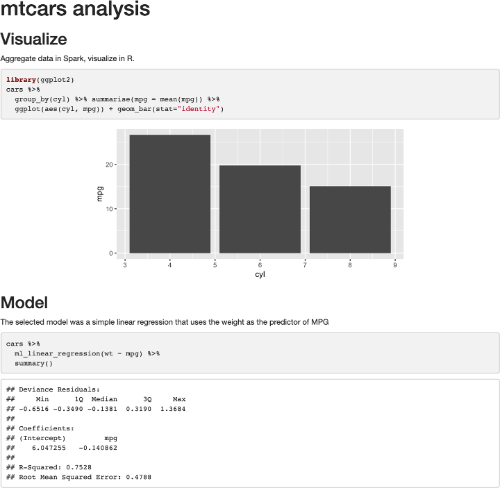

```{r, echo=F}
library(knitr)
library(formatR)
opts_chunk$set(tidy=T, message=FALSE, fig.align='center', eval=F)
```


# Foreword

Apache Spark is a distributed computing platform built on extensibility: Spark’s APIs
make it easy to combine input from many data sources and process it using diverse
programming languages and algorithms to build a data application. R is one of the
most powerful languages for data science and statistics, so it makes a lot of sense to
connect R to Spark. Fortunately, R’s rich language features enable simple APIs for
calling Spark from R that look similar to running R on local data sources. With a bit
of background about both systems, you will be able to invoke massive computations
in Spark or run your R code in parallel from the comfort of your favorite R program‐
ming environment.
This book explores using Spark from R in detail, focusing on the `sparklyr` package
that enables support for `dplyr` and other packages known to the R community. It
covers all of the main use cases in detail, ranging from querying data using the Spark
engine to exploratory data analysis, machine learning, parallel execution of R code,
and streaming. It also has a self-contained introduction to running Spark and moni‐
toring job execution. The authors are exactly the right people to write about this
topic—Javier, Kevin, and Edgar have been involved in `sparklyr` development since
the project started. I was excited to see how well they’ve assembled this clear and
focused guide about using Spark with R.
I hope that you enjoy this book and use it to scale up your R workloads and connect
them to the capabilities of the broader Spark ecosystem. And because all of the infra‐
structure here is open source, don’t hesitate to give the developers feedback about
making these tools better.
— Matei Zaharia
Assistant Professor at Stanford University,
Chief Technologist at Databricks,
and original creator of Apache Spark

# Preface

In a world where information is growing exponentially, leading tools like Apache
Spark provide support to solve many of the relevant problems we face today. From
companies looking for ways to improve based on data-driven decisions, to research
organizations solving problems in health care, finance, education, and energy, Spark
enables analyzing much more information faster and more reliably than ever before.
Various books have been written for learning Apache Spark; for instance, Spark: The
Definitive Guide is a comprehensive resource, and Learning Spark is an introductory
book meant to help users get up and running (both are from O’Reilly). However, as of
this writing, there is neither a book to learn Apache Spark using the R computing lan‐
guage nor a book specifically designed for the R user or the aspiring R user.
There are some resources online to learn Apache Spark with R, most notably the
spark.rstudio.com site and the Spark documentation site at spark.apache.org. Both
sites are great online resources; however, the content is not intended to be read from
start to finish and assumes you, the reader, have some knowledge of Apache Spark, R,
and cluster computing.
The goal of this book is to help anyone get started with Apache Spark using R. Addi‐
tionally, because the R programming language was created to simplify data analysis, it
is also our belief that this book provides the easiest path for you to learn the tools
used to solve data analysis problems with Spark. The first chapters provide an intro‐
duction to help anyone get up to speed with these concepts and present the tools
required to work on these problems on your own computer. We then quickly ramp
up to relevant data science topics, cluster computing, and advanced topics that should
interest even the most experienced users.
Therefore, this book is intended to be a useful resource for a wide range of users,
from beginners curious to learn Apache Spark, to experienced readers seeking to
understand why and how to use Apache Spark from R.
This book has the following general outline:
xiiiIntroduction
In the first two chapters, Chapter 1, Introduction, and Chapter 2, Getting Started,
you learn about Apache Spark, R and the tools to perform data analysis with
Spark and R.
Analysis
In Chapter 3, Analysis, you learn how to analyze, explore, transform, and visual‐
ize data in Apache Spark with R.
Modeling
In the Chapter 4, Modeling and Chapter 5, Pipelines, you learn how to create stat‐
istical models with the purpose of extracting information, predicticting out‐
comes, and automating this process in production-ready workflows.
Scaling
Up to this point, the book has focused on performing operations on your per‐
sonal computer and with limited data formats. Chapter 6, Clusters, Chapter 7,
Connections, Chapter 8, Data, and Chapter 9, Tuning, introduce distributed com‐
puting techniques required to perform analysis and modeling across many
machines and data formats to tackle the large-scale data and computation prob‐
lems for which Apache Spark was designed.
Extensions
Chapter 10, Extensions, describes optional components and extended functional‐
ity applicable to specific, relevant use cases. You learn about alternative modeling
frameworks, graph processing, preprocessing data for deep learning, geospatial
analysis, and genomics at scale.
Advanced
The book closes with a set of advanced chapters, Chapter 11, Distributed R,
Chapter 12, Streaming, and Chapter 13, Contributing; these will be of greatest
interest to advanced users. However, by the time you reach this section, the con‐
tent won’t seem as intimidating; instead, these chapters will be equally relevant,
useful, and interesting as the previous ones.
The first group of chapters, 1–5, provides a gentle introduction to performing data
science and machine learning at scale. If you are planning to read this book while also
following along with code examples, these are great chapters to consider executing
the code line by line. Because these chapters teach all of the concepts using your per‐
sonal computer, you won’t be taking advantage of multiple computers, which Spark
was designed to use. But worry not: the next set of chapters will teach this in detail!
The second group of chapters, 6–9, introduces fundamental concepts in the exciting
world of cluster computing using Spark. To be honest, they also introduce some of
the not-so-fun parts of cluster computing, but believe us, it’s worth learning the con‐
cepts we present. Besides, the overview sections in each chapter are especially
xiv | Prefaceinteresting, informative, and easy to read, and help you develop intuitions as to how
cluster computing truly works. For these chapters, we actually don’t recommend exe‐
cuting the code line by line—especially not if you are trying to learn Spark from start
to finish. You can always come back and execute code after you have a proper Spark
cluster. If you already have a cluster at work or you are really motivated to get one,
however, you might want to use Chapter 6 to pick one and then Chapter 7 to connect
to it.
The third group of chapters, 10–13, presents tools that should be quite interesting to
most readers and will make it easier to follow along. Many advanced topics are pre‐
sented, and it is natural to be more interested in some topics than others; for instance,
you might be interested in analyzing geographic datasets, or perhaps you’re more
interested in processing real-time datasets, or maybe you’d like to do both! Based on
your personal interests or problems at hand, we encourage you to execute the code
examples that are most relevant to you. All of the code in these chapters is written to
be executed on your personal computer, but you are also encouraged to use proper
Spark clusters given that you’ll have the tools required to troubleshoot issues and
tune large-scale computations.

## Formatting

Tables generated from code are formatted as follows:

```{r}
# A tibble: 3 x 2
numbers text
<dbl> <chr>
1 1 one
2 2 two
3 3 three
```

The dimensions of the table (number of rows and columns) are described in the first
row, followed by column names in the second row and column types in the third row.
There are also various subtle visual improvements provided by the tibble package
that we make use of throughout this book.
Most plots are rendered using the `ggplot2` package and a custom theme available in
the appendix; however, because this book is not focused on data visualization, we
only provide code to render a basic plot that won’t match the formatting we applied.
If you are interested in learning more about visualization in R, consider specialized
books like R Graphics Cookbook (O’Reilly).

## Acknowledgments

We thank the package authors that enabled Spark with R: Javier Luraschi, Kevin Kuo,
Kevin Ushey, and JJ Allaire (sparklyr); Romain François and Hadley Wickham
Preface | xv(dbplyr); Hadley Wickham and Edgar Ruiz (dpblyr); Kirill Mülller (DBI); and the
authors of the Apache Spark project itself, and its original author Matei Zaharia.
We thank the package authors that released extensions to enrich the Spark and R eco‐
system: Akhil Nair (crassy); Harry Zhu (geospark); Kevin Kuo (graphframes, mleap,
sparktf, and sparkxgb); Jakub Hava, Navdeep Gill, Erin LeDell, and Michal Maloh‐
lava (rsparkling); Jan Wijffels (spark.sas7bdat); Aki Ariga (sparkavro); Martin
Studer (sparkbq); Matt Pollock (sparklyr.nested); Nathan Eastwood (sparkts); and
Samuel Macêdo (variantspark).
We thank our wonderful editor, Melissa Potter, for providing us with guidance,
encouragement, and countless hours of detailed feedback to make this book the best
we could have ever written.
To Bradley Boehmke, Bryan Adams, Bryan Jonas, Dusty Turner, and Hossein Falaki,
we thank you for your technical reviews, time, and candid feedback, and for sharing
your expertise with us. Many readers will have a much more pleasant experience
thanks to you.
Thanks to RStudio, JJ Allaire, and Tareef Kawaf for supporting this work, and the R
community itself for its continuous support and encouragement.
Max Kuhn, thank you for your invaluable feedback on Chapter 4, in which, with his
permission, we adapted examples from his wonderful book Feature Engineering and
Selection: A Practical Approach for Predictive Models (CRC Press).
We also thank everyone indirectly involved but not explicitly listed in this section; we
are truly standing on the shoulders of giants.
This book itself was written in R using bookdown by Yihui Xie, rmarkdown by JJ Allaire
and Yihui Xie, and knitr by Yihui Xie; we drew the visualizations using `ggplot2` by
Hadley Wickham and Winston Chang; we created the diagrams using nomnoml by
Daniel Kallin and Javier Luraschi; and we did the document conversions using pan
doc by John MacFarlane.
Conventions Used in This Book
The following typographical conventions are used in this book:
Italic
Indicates new terms, URLs, email addresses, filenames, and file extensions.
Constant width
Used for program listings as well as within paragraphs to refer to program ele‐
ments such as variable or function names, databases, data types, environment
variables, statements, and keywords.
xvi | PrefaceConstant width bold
Shows commands or other text that should be typed literally by the user.
Constant width italic
Shows text that should be replaced with user-supplied values or by values deter‐
mined by context.
This element signifies a tip or suggestion.
This element signifies a general note.

## Using Code Examples

Supplemental material (code examples, exercises, etc.) is available for download at
https://github.com/r-spark/the-r-in-spark.
This book is here to help you get your job done. In general, if example code is offered
with this book, you may use it in your programs and documentation. You do not
need to contact us for permission unless you’re reproducing a significant portion of
the code. For example, writing a program that uses several chunks of code from this
book does not require permission. Selling or distributing a CD-ROM of examples
from O’Reilly books does require permission. Answering a question by citing this
book and quoting example code does not require permission. Incorporating a signifi‐
cant amount of example code from this book into your product’s documentation does
require permission.
We appreciate, but do not require, attribution. An attribution usually includes the
title, author, publisher, and ISBN. For example: “Mastering Spark with R by Javier Lur‐
aschi, Kevin Kuo, and Edgar Ruiz (O’Reilly). Copyright 2020 Javier Luraschi, Kevin
Kuo, and Edgar Ruiz, 978-1-492-04637-0.”
If you feel your use of code examples falls outside fair use or the permission given
above, feel free to contact us at permissions@oreilly.com.
Preface | xviiO’Reilly Online Learning
For almost 40 years, O’Reilly Media has provided technology
and business training, knowledge, and insight to help compa‐
nies succeed.
Our unique network of experts and innovators share their knowledge and expertise
through books, articles, conferences, and our online learning platform. O’Reilly’s
online learning platform gives you on-demand access to live training courses, indepth learning paths, interactive coding environments, and a vast collection of text
and video from O’Reilly and 200+ other publishers. For more information, please
visit http://oreilly.com.

## How to Contact Us

Please address comments and questions concerning this book to the publisher:
O’Reilly Media, Inc.
1005 Gravenstein Highway North
Sebastopol, CA 95472
800-998-9938 (in the United States or Canada)
707-829-0515 (international or local)
707-829-0104 (fax)
We have a web page for this book, where we list errata, examples, and any additional
information. You can access this page at https://oreil.ly/SparkwithR.
To comment or ask technical questions about this book, send email to bookques‐
tions@oreilly.com.
For more information about our books, courses, conferences, and news, see our web‐
site at http://www.oreilly.com.
Find us on Facebook: http://facebook.com/oreilly
Follow us on Twitter: http://twitter.com/oreillymedia
Watch us on YouTube: http://www.youtube.com/oreillymedia

# 第一章 引言

> 你什么都不知道，Jon Snow。

> — Ygritte

随着信息以指数的速率增长，历史学家把这段历史时期称作信息时代也就不意外了。逐步加速的数据收集速度也创造了很多新的机会，并且必然会创造更多的机会。本章介绍一些用于解决大规模数据挑战的工具。首先，作为处理大规模数据集的流行工具，本章会介绍Apache Spark。有了这一基础，我们会介绍R编程语言，它是专门设计用于简化数据分析的。最后，我们会介绍`sparklyr`，该项目将R和Spark结合成为大家都可使用的强大工具。

*第二章，这就开始*会介绍用于在个人电脑上执行Spark和R运算所需的预备知识，工具和步骤。你会学到如何安装和初始化Spark，了解常见操作，处理第一份数据和完成建模任务。本章的目的就是要帮助读者掌握处理大规模数据问题所需的概念和工具，而这些问题目前只有少数组织可以接触到。

然后，你可以继续学习如何分析大规模数据，以及构建模型支持预测趋势和发现隐藏在海量信息中的知识。接着，你可以掌握一些用于执行数据分析和大规模建模的工具。后续章节会帮助你从本地计算机中跳出来，转向计算集群，以便解决许多真实世界的问题。最后几章会介绍一些其他的话题，例如实时数据处理和图分析，可以帮助你真正的掌握任何规模数据分析的最先进的技能。本书的最后一章会介绍一些工具和想法，读者可以考虑在Spark和R社区中做些贡献。

我们希望，阅读本书能成为一种愉悦的经历，可以帮助你解决职业生涯的数据问题，并推动世界作出有利于所有人的更好决策。

## 概述

人类大约从公元前3000年苏美尔人时期就开始用美索不达米亚成熟的书写体系保存，获取，操作和沟通信息了 。根据使用的保存和处理技术，人类的信息处理可能分成四个不同的发展时期：前机械工具时期（公元前3000至公元后1450年），机械工具时期（1450–1840），电子机械时期（1840–1940），和电子时期（1940至今）[^1]。

[^1]:Laudon KC, Traver CG, Laudon JP (1996). “Information technology and systems.” Cambridge, MA: Course Technology。

数学家George Stibitz在1942年使用词语digital来描述快速的电子脉冲[^2]。直到今天，我们把用电子格式存储的信息还叫做数字信息。相反，模拟信息表示用非电子格式存储的各种信息，例如手写笔记，书籍，报纸等。

[^2]: Ceruzzi PE (2012). Computing: a concise history. MIT Press.

世界银行发布的关于数字发展的报告给出了过去三十年保存下来的数字信息和模拟信息总量估计[^3]。这份报告指出数字信息大概在2003年超过了模拟信息，其总量有大约一千万太字节，大约相当于今天的一千万存储驱动。然而，这份报告中更相关的发现是，我们的数字信息正在以指数的速度增长。图1-1展示了这份报告的结论。注意到，每隔一年，世界上的信息都会增长10倍。

[^3]: Group WB (2016). The Data Revolution. World Bank Publications.

为了提供工具找出所有新的数字信息，许多公司都试图提供相关的功能，例如我们今天熟知的用于搜索网络的搜索引擎。给定海量的数字信息，管理如此规模的信息绝对是一项挑战。搜索引擎并不能存储所有的网页信息，支持在单一电脑上搜索网页。这就意味着它必须把信息分成几个文件，并存储在多个机器上。这项技术就是*谷歌文件系统（Google File System）*，它在谷歌2003年发表的学术文献中有介绍[^4]。

[^4]: Ghemawat S, Gobioff H, Leung S (2003). “The Google File System.” In Proceedings of the Nineteenth ACM Symposium on Operating Systems Principles. ISBN 1-58113-757-5.


## Hadoop

一年以后，谷歌发表了新的的文章，描述了如何在谷歌文件系统上执行操作，也就是后来的*MapReduce*技术。[^5]。正如你可以预见到的，MapReduce中有两种操作：map和reduce。*map*操作提供任意一种方法把每个文件转化为一个新的文件，而*reduce*操作可以合并两个文件。两种操作都需要定制计算机代码，而MapReduce框架关注一次性在多个电脑上的自动执行。这两个操作足够支持网络上所有数据的处理，同时也提供足够的灵活性从数据中得到有意义的信息。

[^5]: Dean J, Ghemawat S (2004). “MapReduce: Simplified data processing on large clusters.” In USENIX Symposium on Operating System Design and Implementation (OSDI).

例如在图1-2中，我们可以使用MapReduce计算存放在不同机器上的两个不同文本文件的词语数量。map操作切分原始文件中的每个词语，并输出一个新的词语计数文件，其包含词语到计数的映射。reduce操作可以定义成对两个词语计数文件的合并，其通过整合每个词语的计数总数来实现。最终的文件会包含来自所有原始文件的词语计数。

词语计数通常是最基础的MapReduce示例，但是我们也可以使用MapReduce完成更加复杂和有趣的应用。例如，我们可以在谷歌的PageRank算法中对网页排序，该算法可以基于链接到一个网页的超链接数对所有网页排序，以及给出该网页的排位。


在谷歌发表了这些文献之后，雅虎的一个团队致力于实现谷歌文件系统和MapReduce作为一个单一的开源项目。这个项目就是2006发布的*Hadoop*，其中谷歌文件系统通过*Hadoop分布式文件系统（Hadoop Distributed File System，HDFS）*。Hadoop项目使得基于分布式文件的计算可以被更多的用户和组织获取，这也使得MapReduce的能力突破了网络数据处理。

尽管Hadoop提供了在分布式文件系统上执行MapReduce操作的支持，但是它依然需要在每次数据分析的时候写好MapReduce操作代码。为了改进这一繁琐的过程，Facebook于2008年发布了Hive项目。它给Hadoop引入了*结构化查询语句（Structured Query Language，SQL）*。这意味着大规模数据分析不再需要为每个MapReduce操作编写代码。相反，用户可以用SQL编写原生的，更加容易理解和编写的数据分析语句。

## Spark

2009年，Apache Spark开始作为加州大学伯克利分校AMP实验室的科研项目，以期改进MapReduce。Spark针对性的提供了更加丰富的MapReduce以外的运算符集合，便于优化多个机器上代码运行。Spark同时将数据加载到内存中，使得各种操作要比Hadoop的磁盘存储快很多。最新的一项结果显示，运行逻辑斯蒂回归，一种在第四章中介绍的数据建模技术，利用内存中数据集的Spark要比Hadoop快10倍[^6]。类似于图1-3的结果在原始研究文献中也有展示。

[^6]: Zaharia M, Chowdhury M, Franklin MJ, Shenker S, Stoica I (2010). “Spark: Cluster computing with working sets.” HotCloud, 10(10-10), 95.


尽管Spark以内存操作性能而闻名，而当初设计时是作为支持内存和磁盘操作的一种通用执行引擎。例如，Spark创造了新的大规模排序记录，而这些数据并没有存在内存中。相反，Spark改进了网络序列化，网络改组，CPU缓存的高效利用，进而极大的提高了性能。如果你需要对大规模数据进行排序，世界上没有比Spark更快的系统了。

为了让你了解Spark有多快多高效，Hadoop使用了72分钟，2,100台计算机完成对100太字节数据的排序，但是Spark只用了23分钟和206台计算机。另外，Spark拥有云端排序记录，使得其成为云端对大规模数据进行排序的最剧性价比的解决方案。

| |Hadoop记录 |Spark记录|
|-----|-----|------|
|数据规模| 102.5 TB |100 TB|
|使用时间| 72分钟|23分钟|
|节点数量| 2,100 |206|
|核心数量| 50,400 |6,592|
|磁盘| 3,150 GB/秒| 618 GB/秒|
|网络| 10 GB/秒| 10 GB/秒|
|排序速度| 1.42 TB/分钟 |4.27 TB/分钟|
|排序速度/节点| 0.67 GB/分钟| 20.7 GB/分钟|


Spark也比Hadoop易用。例如，词语计数的MapReduce示例在Hadoop中需要50行代码，而在Spark中只需要2行代码。正如所见，和Hadoop相比，Spark更快，更高效，更易用。

2010年，Spark作为开源项目发布出来，并于2013年捐赠给了Apache软件基金会。Spark执行Apache 2.0协议，运行用户免费使用，修改和分发。Spark有超过1,000名贡献者，是Apache软件基金会中最活跃的项目。

下面的表述介绍了Spark的定位。我们可以按照项目网站那样正式介绍Apache Spark：

> Apache Spark是一个面向大规模数据处理的统一分析引擎。

为了帮助我们理解Apache Spark的概念，我们把它分成如下几个方面：

* 统一

    Spark支持许多程序包，集群技术和存储系统。

* 分析

    分析是发现和理解数据，以期产出和沟通信息的行为。

* 引擎

    Spark是高效的和原生的。

* 大规模

    你可以把大规模理解成集群规模，一些连接一起的，共同工作的计算机。

Spark可以看做是一种*引擎*，因为它是原生和高效的。它的原生性是因为Spark可以优化和执行原生代码，也就是说，对于Spark中的程序代码并没有什么类型限制。它的高效性是因为Spark可以有效利用内存，网络和CPU加速计算集群中的数据处理算法，正如之前提到的，比其它技术都要快速。

这些特点使得Spark在许多分析任务中，例如Netflix的电影排序，蛋白质序列对齐，和CERN的高能物理分析，成为理想的工具。

作为一种*统一*的平台，Spark可以支持许多集群技术和多种数据源。你可以分别在第六章和第八章中了解到。它也可以支持许多不同的程序包，例如Spark SQL，MLlib，GraphX和Spark Streaming，分别支持分析，建模，图处理和实时数据处理。总之，Spark是一种支持请求集群，数据源和各种程序包的平台，进而实现大规模计算，如图1-4所示。


Spark支持大规模运算，意味着Spark的良好用例应该是使用多台机器解决问题。例如，当数据无法在单个磁盘或内存中存放，Spark会是一种良好的备选方案。然而，你也可以在面对非大规模问题的时候考虑使用Spark。此时，多台计算机可以加速计算。例如，CPU密集型的模型和科学模拟也可以从Spark中受益。

因此，Spark不但擅长解决大规模数据处理问题，即通常所说的*大数据*（数据集比传统的要更加庞大和复杂），而且擅长解决大规模计算问题，即通常所说的*大计算*（协调使用大量CPU和内存资源的工具和技术）。大数据经常需要大计算，但是*大计算不一定需要大数据*。

大数据和大计算问题通常很容易识别。如果数据不能存放在单个机器，你就遇到了大数据问题；如果数据可以存放在单个机器，但是数据处理却需要数天，数周甚至更长的时间来完成，你就遇到了大计算问题。

但是，还有第三类问题，既不是大数据问题，也不是大计算问题，它们也可以从类似Spark的集群计算框架中受益良多。这类问题，有以下几种场景：

* 高速性

    假设你有一个10GB的数据集，它的数据处理过程需要30分钟。这既不是一个大数据问题也不是一个大计算问题。但是，如果你突然要想着改进模型的准确率，减少运行时间到3分钟以内，这就是一个显著的改进。这种数据分析速度的改进可以带来有意义的推进和生产力的提高。另外，你也可能需要更快的处理数据速度，比如支持股票交易。尽管三分钟已经足够快，但是这对于实时数据处理依然很慢。这种场景下，你可能需要在几秒内甚至几毫秒内完成数据处理。

* 多样性
  
    你可能有了一个高效的数据收集流程，从多个数据源收集数据放在一个位置，通常是一个数据库。这个过程可能已经非常高效并且接近实时。这样的过程就是通常所说的*抽取，转换和加载*（Extract, Transform,
Load，ETL）；数据从多个数据源抽取，转换成所需的格式，加载到单个数据存储结构中。尽管这一方法已经流行了多年，但是其中的权衡是添加新的数据源代价很高。因为系统是集中控制的，并且是严密操作的，任何改变都可能使整个过程暂停；因此，添加新的数据源通常要花费很长的时间才能实现。相反，你可以把全部数据按照自然格式存放，并且按照需要使用集群处理，即数据湖的架构。另外，按照原始格式存放数据支持处理图片，声音，和视频格式的新文件，而不需要明确如何把它们放进传统的结构化存储系统。

* 真实性

    当使用多个数据源的时候，你可能发现它们之间的数据质量参差不齐，需要专门的分析方法来改进准确性。例如，假设你有一个城市列表，取值包括旧金山，西雅图，和波士顿。当数据包含拼错的单词，例如“Bston”，会发生什么呢？在传统的关系型数据库中，这类非法输入可能会被舍弃。但是，舍弃取值并不一定所以情形下是最好的方法；你会希望利用地理编码，交叉验证数据源，或者尽最大努力匹配来纠正这些字段。所以，理解和改进原始数据源的真实性可以带来更准确的结果。

如果我们把“海量性”当做是大数据的同义词，你就得到了方便记忆的大数据的4个V。一些人也把它扩展成5个V甚至10个V。除了几个便于记忆的符号，今天集群计算也正在以更加创新的方式使用。看到各个组织实验新的工作流，以及传统意义上并不适用集群计算的各种任务，已经不再稀奇。更多的源于大数据的热潮都是这类问题。严格意义上讲，你不是在解决大数据，但是依然可以从大数据和大计算工具的使用中获益。

我们希望本书可以帮助你理解集群计算的机遇和局限，特别是使用Apache Spark和R的机遇和局限。

## R

R编程语言源于诞生在贝尔实验室的S语言。Rick Becker在2016年的useR会议上解释，在那时的贝尔实验室里，计算是通过调用Fortran语句写成的子程序而实现的，而这种程序显然不好处理。而S计算语言当时是作为一种接口语言而设计的，它可以解决特殊的问题，而不需要使用其他语言，例如Fortran。S语言的发明者，John Chambers在图1-5中给出了S是如何设计出来了，进而提供简化数据处理的一种接口，他的共同发明者也在2016年的useR!上展示了这一原图，启发了S的设计。


R语言是S语言一种现代而自由的实现。特别的，根据《面向统计计算的R项目》：

> R是一种面向统计计算和图形学的编程语言和免费软件。

处理数据的时候，我们相信R语言有两大特点：

* R语言

    R是由统计学家设计的，也是面向统计学家使用的。这意味着R是少有的，成功的面向非编程人员的编程语言之一。所以学习R会更加自然。另外，因为R语言是其他语言和工具的接口，所以R可以让你更多的关注理解问题，而更少的花在计算机科学和工程上。

* R社区

    R社区通过*R语言综合文档网络（Comprehensive R Archive Network，CRAN）*提供了丰富的程序包，支持安装即时可用的程序包，来执行各种任务——最享有盛名的高质量数据操作，可视化，和统计模型。许多操作只能在R中进行。另外，R社区是一个热情的，活跃的组织，这些优秀的朋友都愿意帮助你成功。R社区提供的许多程序包，到目前为止，都是统计计算的最优选择。一些下载最多的程序包包括：操作数据的`dplyr`，分析聚类的`cluster`，可视化数据的`ggplot2`。通过画出每天CRAN里R程序包的下载量，图1-6定量刻画了R社区的增长。


除了统计分析，R也用在其他领域。以下领域和本书高度相关：

* 数据科学

    数据科学基于来自统计学和计算机科学的知识和实践，通过数据分析和建模技术把原始数据变成深刻理解[^7]。统计学的方法提供了理解世界和进行预测的坚实基础，而计算机模型中的自动化技术可以让我们简化统计分析并易于实现。一些人认为，统计学应该重新命名为数据科学[^8]，然而数据科学结合了计算机的进展，并超出了统计学的范畴[^9]。本书给出了统计学中常见的分析和建模技术，但是会应用到大数据集上，而这又需要分布式计算的成果。

[^7]: Wickham H, Grolemund G (2016). R for data science: import, tidy, transform, visualize, and model data. O’Reilly Media, Inc
[^8]: Wu CJ (1997). “Statistics = Data Science?”
[^9]: Cleveland WS (2001). “Data Science: An Action Plan for Expanding the Technical Areas of the Field of Statistics?”

* 机器学习

    机器学习利用来自于统计学和计算机科学的实践。但是，它更多的关注自动化和预测。例如，Arthur Samuel在实现跳棋的计算机自动化程序的时候发明了词语machine learning[^10]。尽管我们可以在专门的游戏上实践数据科学，但是编写一个跳棋的程序需要我们自动化整个过程。因此，这个问题就是机器学习的范畴，而不是数据科学的范畴。机器学习使得许多用户在无意识中利用统计学的方法成为可能。机器学习中最重要的一个应用是过滤垃圾邮件。在这个例子中，只做数据分析和对每个邮箱账户建模是不可行的，因此机器学习可以自动化发现垃圾邮件的整个过程，并在用户没有参与的情况下过滤出去。本书给出了把数据科学工作流转换为完全自动化的机器学习的方法，例如，支持构建和导出Spark流程，以便容易的在自动化环境中复用此流程。
    
[^10]: Samuel AL (1959). “Some studies in machine learning using the game of checkers.” IBM Journal of research and development, 3(3), 210–229.

* 深度学习

    深度学习建立在统计学，数据科学和机器学习知识的基础上，并受到生物神经系统的些许启发而定义模型。当梯度散失问题通过一次一层的训练解决后，深度学习就从神经网络模型逐步进化了[^11]，并被证明在图像识别和语音识别任务中非常强大。例如，在语音助手应用中，诸如Siri，Alexa，Cortana，或谷歌助手，实现语音到文本转换的模型大部分都是基于深度学习模型。尽管*图形处理器（Graphic Processing Units，GPUs）*已经成功的用在了训练深度学习过程中[^12]，一些数据集并不能在单个GPU上处理。另一个事实是，深度学习模型需要大量的数据。这也需要在多个机器上预处理一下，然后才交给单个GPU训练。本书并不会直接给出深度学习模型的任何参考文献。但是你可以使用我们在本书中给出的方法，准备深度学习数据。在未来几年里，使用深度学习大规模计算技术会变得非常普遍。事实上，Spark的最新版本已经加入了为执行深度学习训练而优化过的模型。
    
[^11]:Hinton GE, Osindero S, Teh Y (2006). “A fast learning algorithm for deep belief nets.” Neural computation, 18(7), 1527–1554.
[^12]:Krizhevsky A, Sutskever I, Hinton GE (2012). “Imagenet classification with deep convolutional neural networks.” In Advances in neural information processing systems, 1097–1105.

处理上述几个领域时，你要么会面对逐渐增大的数据集，要么会面对逐渐复杂的计算过程。这些流程执行起来都很慢，或者某些时候在单台计算机上变得不可能。但是，要知道，Spark并不一定是所有计算问题的答案。而面对R中的计算问题时，使用以下技术会很有效：

* 采样

    第一个要尝试的技术是通过采样，减少需要处理的数据量。然而，我们必须使用可靠的统计学原理，合适地采样数据。例如，选取有序数据集的头部数据是不够的。使用随机采样，会得到占比较少的数据集。这些都可以通过分层采样克服，但是选取合适的类别增加了算法复杂度。讲解如何进行合适的统计采样超出了本书的范畴，但是有很多有用的资源都是关于这个话题的。

* 分析器

    你可以试着理解为什么计算很慢，进而需要改进。分析器是检查代码执行情况，帮助识别瓶颈的工具。在R中，R的分析器，`profvis`程序包和RStudio的分析器功能可以让你轻松的重试和可视化一个分析器。然而，优化代码通常并不容易。

* 纵向扩展

    加速计算通过可以通过购买更快或者更强劲的硬件（即提高机器内存，更新硬盘，或者使用CPU更多的计算器）来实现。这些手段叫做纵向扩展。但是，对于单个计算机的纵向扩展通常存在硬极限，即使使用大量的CPU，你还需要新的框架来有效地并行化计算。

* 横向扩展

    最后，我们可以考虑把计算和存储扩大到对台机器上。这种手段提供了最高纬度的扩展性能。因为你可以使用任意数量的机器来执行计算。这个技术通常叫做横向扩展。但是，有效的扩展计算是一项复杂的实践，特别是没有使用专门的工具和框架，例如Apache Spark的时候。

最后一点更加具体的介绍了本书的目的，即Apache Spark提供的分布式计算系统的能力，借助R解决数据科学和相关领域中有意义的计算问题。

## `sparklyr`

考虑到Spark提供的计算能力和R语言的易用性，我们很自然的想让二者无缝的结合起来。这也是R社区期望的：提供Spark接口的R程序包用起来很简单，并与其它R程序包兼容，而且可以在CRAN上找到。为此，我们开始开发`sparklyr`。第一版，`sparklyr 0.4`，在2016年的useR!大会上发布。第一版包括对`dplyr`，`DBI`，建模工具`MLlib`的支持，以及支持类似H2O的`rsparkling`程序包的可扩展API。 从此，许多新的功能和改进在`sparklyr 0.5, 0.6, 0.7, 0.8, 0.9`和`1.0`做了实现。

根据官方定义，`sparklyr`是Apache Spark的R语言接口。它可以通过CRAN获取，像其他CRAN程序包一样工作。这意味着人们无需知道Spark的版本，易于安装，同时服务于R社区，兼容其他R程序包，并接受来自R社区的使用反馈，等等。它托管在GitHub，遵循Apache 2.0协议，允许克隆，修改，并参与项目开发。使用`sparklyr`的用户应该包含以下角色：

* 新用户

    对于新用户，我们坚信`sparklyr`提供了使用Spark的最简单的方式。我们希望本书的前面几章可以帮助你逐渐熟悉并毫无压力的使用Spark，进而为长期任务做准备。

* 数据科学家

    对于已经使用和钟爱R的数据科学家，`sparklyr`整合了许多其他的R实践和程序包，例如`dplyr`，`magrittr`，`broom`，`DBI`，`tibble`，`rlang`，以及其它框架，让你使用Spark从容自如。而对于R和Spark的新手，`sparklyr`的高级别工作流整合和低级别扩展机制保证Spark是一个高产的环境，可以满足每个数据科学家的需求和技能。

* 专家用户

    对于已经深度使用Spark，并可以编写Scala原生代码的用户，可以考虑让你的Spark程序包作为一个R程序包贡献给R社区。一个多样的，强大的社区可以让你的工作贡献出最好的价值，促进开源社会的发展。

我们编写这本书是为了介绍和传授Apache Spark和R融合的部分。`sparklyr`就是把这些社区，期望和未来方向，程序包及其扩展整合在一起的R程序包。我们相信，有机会使用这本书来搭起R和Spark社区的桥梁：给R社区介绍为什么Spark让人兴奋，给Spark社区介绍为什么R如此伟大。两个社区都在使用不同的技术和背景来解决相似的问题。因此，我们希望`sparklyr`可以是创新的肥沃土壤，是新手的好客之地，是数据科学达人的高产环境，也是集群计算，数据科学，机器学习一起交流的开放社区。

## 小结

本章介绍了Spark这一现代而强大的计算平台，R这一易用的，基于扎实的统计建模理论的计算语言，以及`sparklyr`这一连接两个技术和社区的项目。w我们处在一个信息指数级增长的世界，学习如何分析大规模数据可以帮助你解决当今人类面临的问题和机遇。但是，在分析数据之前，第二章会介绍本书后面内容所需的工具。确保你可以明白每一步操作，并花点时间安装推荐的工具，它们会成为你经常使用和喜爱的资源。

----------

# 第二章 开始

> I always wanted to be a wizard.

> — Samwell Tarly

完成第一章的学习，你应该熟悉了Spark可以解决的各类问题。显而易见，Spark利用多台计算机来解决数据无法在单个机器上运行或者计算太慢的问题。如果你是R的新手，也可以看到，把Spark和数据科学工具，例如可视化工具`ggplot2`，数据变换的`dplyr`，结合起来可以给大规模数据科学项目带来美好的愿景。我们也希望你为自己成为大规模数据计算高手而感到兴奋。

在本章中，我们会浏览一下成为Spark高手所需要的工具。我们鼓励你能够实现本章的代码，因为这样会让你理解分析，建模，读取和写入数据的各种动作。换句话说，你需要坚持不懈，在使用Spark前反复实践。

在第三章中，我们会深入介绍分析，建模，并给出在单个集群上，也就是你的个人电脑上运行的例子。后续章节介绍集群计算，以及成功在多台机器上运行代码所需的概念和技术。

## 概述

R使用`sparklyr`来打通Spark和本地集群，整个过程和安装加载`sparklyr`程序包一样简单，后面安装Spark也通过`sparklyr`完成。但是，我们假设你在使用一个全新的电脑运行Windows，macOS或者Linux，因此我们会在连接本地Spark集群前，完成预备操作。

尽管本章是为了在个人电脑上使用Spark做准备，一些读者可能已经有了Spark集群，或者喜欢使用在线Spark集群。例如，Databricks托管了一个免费的社区版的Spark，你可以很容易的从浏览器访问。如果你最终选择了这条路，可以跳过“预备操作”。但是要确保你查阅了合适的资源，支持已有的或在线的Spark集群。或者，完成预备操作后，你首先要学习如何连接Spark。我们会介绍本书后续章节中用到的最重要的工具和操作。我们不会过多关注教授概念或者如何使用概念。我们不可能在一章中解释完建模或流式计算。但是，完成本章的学习让你窥见到Spark的能力，以及确信工具已经完成正确的部署，可以应付未来更多棘手的问题了。

所用的工具大部分都分成R代码和Spark网络接口。所有Spark操作都在R中运行。但是，分布式操作的监控动作在Spark的网络接口操作，你可以从任何一个网络浏览器加载看到。然后我们断开本地集群的连接。虽然容易忘记，我们还是强烈建议在使用本地集群和共享集群的时候能够记得这一操作.

本章末尾会介绍一些功能，使得在Rstudio中操作Spark更容易。更具体的，我们会介绍由`sparklyr`实现的RStudio扩展。但是，如果你喜欢使用Jupyter Notebooks或者你的集群已经装好了别的R用户界面，确保你可以通过纯R代码使用Spark。现在，让我们开始学习预备操作。

## 预备操作

R可以在许多平台和环境中运行。所以，不管你用Windows，Mac，还是Linux，第一步都需要从r-project.org安装R。具体信息在“安装R”中有说明。

大部分人在使用编程语言时会使用工具，以便让编程更加高效。对于R，RStudio就是这样一个工具。严格地说，RStudio是一个*集成开发环境（integrated development environment，IDE）*，现在它也支持许多平台和环境。如果还没有安装Rstudio，我们强烈推荐你安装，具体操作见“安装RStudio”。

> 使用Windows的时候，我们建议不要使用路径上有空格的目录。如果运行`getwd()`返回了带有空格的路径，可以使用`setwd("path")`换成不带空格的路径，或者把RStudio项目创建到没有空格的路径中。

另外，因为Spark是用Scala实现的，运行在Java虚拟机（Java Virtual Machine，JVM）上，所有你还需要给系统安装Java 8。你的系统可能装了Java，但是还需要检查版本，按照“安装Java”的内容升级或降级。你可以使用如下R命令检查安装在系统的版本：

```
system("java -version")
java version "1.8.0_201"
Java(TM) SE Runtime Environment (build 1.8.0_201-b09)
Java HotSpot(TM) 64-Bit Server VM (build 25.201-b09, mixed mode)
```
你也可以运行`Sys.setenv(JAVA_HOME = "path-to-java-8")`，使用`JAVA_HOME`环境变量来指定具体的Java版本，或者，在安装`sparklyr`之前，确保R环境可以使用Java 8版本。

### 安装`sparklyr`

和许多其他的R程序包一样，你可以使用如下命令安装CRAN上的`sparklyr`：

```{r}
install.packages("sparklyr")
```
本书的示例假设你使用最新版本的`sparklyr`。你可以运行如下代码，验证你的版本是不是我们的一样新：

```{r}
packageVersion("sparklyr")
[1] '1.0.2'
```

### 安装Spark

使用`sparklyr`安装:

```{r}
library(sparklyr)
```
这个代码可以实现R中所有的`sparklyr`函数，非常有用。否则，你需要带着前缀`sparklyr::`运行每一个`sparklyr`命令。

你可以简单的通过运行`spark_install()`安装Spark。这个命令可以在本地电脑上下载，安装和配置最新版本的Spark。但是，因为我们这本书是根据Spark 2.3编写的，所以你也可以安装这个版本，并顺畅的运行所有示例：
```{r}
spark_install("2.3")
```
你可以运行如下命令，输出所有可以安装的Spark版本：

```{r}
spark_available_versions()
## spark
## 1 1.6
## 2 2.0
## 3 2.1
## 4 2.2
## 5 2.3
## 6 2.4
```
你可以使用Spark版本信息安装特定的版本，或者也可以明确Hadoop版本。例如，要安装Spark 1.6.3，你可以运行：
```{r}
spark_install(version = "1.6.3")
```
你也可以使用如下命令，检查已经安装的版本：

```{r}
spark_installed_versions()
spark hadoop dir
7 2.3.1 2.7 /spark/spark-2.3.1-bin-hadoop2.7
```
Spark的安装路径通常是Spark的主目录，可以通过R代码和系统配置的`SPARK_HOME`标识符来定义。当你使用安装有`sparklyr`的本地Spark集群时，这个路径是已知的，不需要额外的配置。

最后，要卸载具体版本的Spark，你可以指定Spark和Hadoop的版本信息，运行`spark_uninstall()`，如下：
```{r}
spark_uninstall(version = "1.6.3", hadoop = "2.6")
```

> 默认的安装路径是：macOS和Linux的~/spark，Windows的%LOCALAPPDATA%/spark。要定制化安装路径，可以在`spark_install()`和`spark_connect()`之前运行`options(spark.install.dir = "installation-path")`。 

## 连接

到目前为止，我们只安装了本地集群。本地集群对于初始学习，测试代码，轻松的排查故障非常有好处。后面的章节会介绍在哪里发现，安装和连接真正的有多台机器的Spark集群。但是对于开始的几章，我们只会使用本地集群。

要连接本地集群，只需运行如下代码：
```{r}
library(sparklyr)
sc <- spark_connect(master = "local", version = "2.3")
```
> 如果你使用的是自己的或者在线的Spark集群，确保你是按照集群管理员的配置或者在线文档进行连接。如果你需要指针，可以参考第七章，它会详细介绍如何连接Spark集群。

`master`参数明确了Spark集群中哪一个是主机器。这个机器通常叫做*驱动节点（driver node）*。使用多台机器的真实集群时，你会发现大部分机器是工作机器，一个是主机器。因为我们只有一个单台机器的本地集群，从现在开始我们会默认使用“`local`”。

建立好连接后，`spark_connect()`会获取一个工作的Spark连接，通常在大部分代码中命名为`sc`，你可以使用`sc`执行Spark命令。

如果连接失败了，第七章包含有故障排查的章节，可以帮助你解决连接问题。

## 使用Spark

建立连接后，我们可以运行几个简单的命令。例如，首先使用`copy_to()`把`mtcars`数据集复制给Apache Spark:
```{r}
cars <- copy_to(sc, mtcars)
```
现在数据复制给了Spark，我们可以使用`cars`从R中请求数据。要打印具体内容，我们可以键入`*cars*`:

```{r}
cars
# Source: spark<mtcars> [?? x 11]
mpg cyl disp hp drat wt qsec vs am gear carb
<dbl> <dbl> <dbl> <dbl> <dbl> <dbl> <dbl> <dbl> <dbl> <dbl> <dbl>
1 21 6 160 110 3.9 2.62 16.5 0 1 4 4
2 21 6 160 110 3.9 2.88 17.0 0 1 4 4
3 22.8 4 108 93 3.85 2.32 18.6 1 1 4 1
4 21.4 6 258 110 3.08 3.22 19.4 1 0 3 1
5 18.7 8 360 175 3.15 3.44 17.0 0 0 3 2
6 18.1 6 225 105 2.76 3.46 20.2 1 0 3 1
7 14.3 8 360 245 3.21 3.57 15.8 0 0 3 4
8 24.4 4 147. 62 3.69 3.19 20 1 0 4 2
9 22.8 4 141. 95 3.92 3.15 22.9 1 0 4 2
10 19.2 6 168. 123 3.92 3.44 18.3 1 0 4 4
# … with more rows
```

很棒！你成功的连接了Spark并加载了第一个数据集。

让我们看看`copy_to()`做了什么操作。第一个参数`sc`，给函数提供了一个工作的Spark连接指向，这个连接是之前通过`spark_connect()`创建的。第二个参数给出了要加载到Spark的数据集。现在，`copy_to()`返回Spark中数据集，并由R环境自动打印。只要Spark打印数据集，它都会收集几条数据记录并在前台展示。在这个例子中，数据集只包含几行描述机动车型号的信息以及诸如马力，和每加仑可行驶英里数的说明。

### 网络接口

大部分Spark命令都在R控制台执行。但是，监控和分析动作是在Spark的网络界面完成，如图2-1所示。这个接口是Spark提供的网络应用，你可以运行如下代码进行请求：
```{r}
spark_web(sc)
```


打印`cars`数据集会收集几行记录并展示到R控制台。你可以在Spark网络接口中看到，一个作业用于在Spark中收集这个信息。你可以可选择Storage标签，查看Spark内存中的`mtcars`数据集，如图2-2所示。

注意，根据Fraction Cached列100%取值，这个数据集完全加载到了内存中。因此，根据Size in Memory列，你可以准确的看到这个数据集使用了多少内存。


Executors标签，如图2-3所示，提供了集群资源的总览。对于本地连接，你只能看到一个2 GB内存的，384 MB计算内存的Spark工作节点。在第九章中国，你会看到，如何请求更过的计算实例和资源，以及内存如何分配。


最后一个要介绍的标签是Environment标签，如图2-4所示；这个标签列出了所有Spark应用的设置，我们会在第九章中介绍。你可以看到，大部分设置不需要明确的配置，但是要在大规模数据上顺利运行，你还是要熟悉这些配置。


然后，你可以使用小的数据子集进行练习。我们会在第三章中国详细介绍。

### 分析

在R中使用Spark分析数据，你可以使用SQL（结构化查询语句）或者`dplyr`（数据操作语法）。你可以通过`DBI`程序包使用SQL。例如，要计算我们的`cars`数据集中有多少记录，我们可以运行如下代码：

```{r}
library(DBI)
dbGetQuery(sc, "SELECT count(*) FROM mtcars")
count(1)
1 32
```

使用`dplyr`的时候，需要的代码更少。而且通常比SQL容易的多。这也是为什么本书不用SQL的原因，但是，如果你对SQL很熟悉，这也是备选方案。例如，`dplyr`中计算行数要更简洁，且易于理解：
```{r}
library(dplyr)
count(cars)
# Source: spark<?> [?? x 1]
n
<dbl>
1 32
```

一般情况下，我们通常首先使用`dplyr`做Spark中的数据分析，然后进行采样和列维度的子集选取。最后一步是从Spark中收集数据，并在R中做进一步数据处理，例如数据可视化。让我们运行一个非常简单的数据分析例子，包括对Spark中`cars`数据集选取，采样，绘制图形:

```{r}
select(cars, hp, mpg) %>%
sample_n(100) %>%
collect() %>%
plot()
```

图2-5看到，随着汽车马力的增加，它的每加仑英里数燃料效率在降低。尽管这个分析很深刻，但是要定量预测增加的马力影响多少燃料效率也并不容易。建模工作可以帮助我们解决这个问题。


### 建模

尽管数据分析可以让你快速理解数据，构建数学模型描述和泛化数据集也非常有用。在第一章中，你学习了机器学习和数据科学领域使用数学模型进行预测和发现重要的观点。例如，我们可以使用线性模型估计燃料效率和马力的关系：

```{r}
model <- ml_linear_regression(cars, mpg ~ hp)
model
Formula: mpg ~ hp
Coefficients:
(Intercept) hp
30.09886054 -0.06822828
```
现在我们可以使用这个模型预测不在原始数据集中的值。例如，我们可以添加马力大于250的数据，并可视化预测的值，如图2-6所示。

```{r}
model %>% 
ml_predict(copy_to(sc, data.frame(hp = 250 + 10 * 1:10))) %>%
transmute(hp = hp, mpg = prediction) %>%
full_join(select(cars, hp, mpg)) %>%
collect() %>%
plot()
```


尽管前面的例子缺少建模中所用的诸多技术，但是也足以作为一个简单的例子简要介绍Spark的建模能力。我们会在第四章中介绍所有Spark的模型，技术和最佳实践。

### 数据

简单起见，我们确实把`mtcars`数据集复制给了Spark。但是，一般情况下数据通常不在Saprk中。相反，数据要从已有的数据源中读取，格式也多种多样，例如纯文本，CSV，JSON，Java数据库连接JDBC和其它。我们会在第八章中详细介绍这些内容。例如，我们可以把`cars`数据集输出为CSV文件：
```{r}
spark_write_csv(cars, "cars.csv")
```
实际工作中，我们会从分布式存储系统例如HDFS中读取已有额数据集，但是我们也可以从本地文件系统中读取数据：
```{r}
cars <- spark_read_csv(sc, "cars.csv")
```

### 扩展

R以其活跃的程序包作者社区而著名。同样的，许多Spark和R扩展已经编程实现，并随时可用，只是数量较R社区中的少些。第十章会介绍许多有趣的程序包支持高级建模，图分析，深度学习数据预处理等等。

例如，`sparkly.nested`扩展是R的一个程序包，允许`sparklyr`管理包含嵌套信息的取值。常见的用例是，包含嵌套列表的JSON文件，需要在有意义的数据分析前做预处理。要使用这个扩展，我们首先需要按照如下代码安装：
```{r}
install.packages("sparklyr.nested")
```
然后，我们可以使用`sparklyr.nested`扩展，根据气缸数，对所有的马力数据点分组：
points over the number of cylinders:
```{r}
sparklyr.nested::sdf_nest(cars, hp) %>%
group_by(cyl) %>%
summarise(data = collect_list(data))
# Source: spark<?> [?? x 2]
cyl data
<int> <list>
1 6 <list [7]>
2 4 <list [11]>
3 8 <list [14]>
```
尽管嵌套数据不太容易读取，但是在借助`spark_read_json()`和`spark_write_json()`函数处理诸如JSON的嵌套数据格式的时候，确实存在这样的需求。

### 分布式R

对于某些情况下，个别Spark的功能不能实现，或者扩展没有开发完成，你可以考虑把R代码发布到Spark集群上。这是一个强大的工具，但是也带了额外的复杂性。所以你应该把它做为最后的方案。

假设我们需要四舍五入数据集中所有列的取值。一个方法是运行R代码，执行`round()`函数：
```{r}
cars %>% spark_apply(~round(.x))
# Source: spark<?> [?? x 11]
mpg cyl disp hp drat wt qsec vs am gear carb
<dbl> <dbl> <dbl> <dbl> <dbl> <dbl> <dbl> <dbl> <dbl> <dbl> <dbl>
1 21 6 160 110 4 3 16 0 1 4 4
2 21 6 160 110 4 3 17 0 1 4 4
3 23 4 108 93 4 2 19 1 1 4 1
4 21 6 258 110 3 3 19 1 0 3 1
5 19 8 360 175 3 3 17 0 0 3 2
6 18 6 225 105 3 3 20 1 0 3 1
7 14 8 360 245 3 4 16 0 0 3 4
8 24 4 147 62 4 3 20 1 0 4 2
9 23 4 141 95 4 3 23 1 0 4 2
10 19 6 168 123 4 3 18 1 0 4 4
# … with more rows
```

如果你是R语言高手，你会倾向于使用`spark_apply()`处理一切。但是最好别这样！`spark_apply()` 适用于Spark能力受限的高级情形。你会了解到如何执行合适的数据分析和建模，而不用把R代码分发给你的集群。

### 流式计算

虽然处理大量静态数据是Spark的典型应用场景，但是Spark也可以处理实时动态数据集。某些应用中确实有这样的需求。你可以把一个流式数据集看做一个持续更新数据的静态数据源，例如股票市场报价。流式数据通常从Kafka（一个开源的流式数据处理软件平台）或分布式存储中读取。

要体验流式计算，首先创建一个input/文件夹，放入一些流式计算所需的输入数据：
```{r}
dir.create("input")
write.csv(mtcars, "input/cars_1.csv", row.names = F)
```

然后，定义一个作业流，处理来自input/文件夹的数据，执行R代码定义的转换，并输出到一个output/文件夹：
```{r}
stream <- stream_read_csv(sc, "input/") %>%
select(mpg, cyl, disp) %>%
stream_write_csv("output/")
```

实时数据一开始输入，input/文件夹几乎同时开始处理，并在output/文件夹中存入新的转换数据文件。因为输入文件夹只有一个文件，输出文件夹也只包含一个经过`spark_apply()`转换的文件。
```{r}
dir("output", pattern = ".csv")
[1] "part-00000-eece04d8-7cfa-4231-b61e-f1aef8edeb97-c000.csv"
```
到目前为止，这些操作和静态数据的处理很像。但是，我们可以持续添加input/文件夹中的文件，Spark会自动的并行处理数据。让我们添加一个新的文件，检查是否可以自动处理：

```{r}
# Write more data into the stream source
write.csv(mtcars, "input/cars_2.csv", row.names = F)
```
等待几秒，确认Spark作业流处理了数据：

```{r}
# Check the contents of the stream destination
dir("output", pattern = ".csv")
[1] "part-00000-2d8e5c07-a2eb-449d-a535-8a19c671477d-c000.csv"
[2] "part-00000-eece04d8-7cfa-4231-b61e-f1aef8edeb97-c000.csv"
```
然后你应该终止作业流：
```{r}
stream_stop(stream)
```

你可以使用`dplyr`，SQL，Spark模型，或者分布式R分析实时数据流。在第十二章中，我们会详细介绍分析实时数据所需的所有有意思的转换。

### 日志

日志记录肯定比实时数据处理要无聊。但是，它是你应该熟悉的工具。日志是一份文本文件，Spark可以追加集群中任务执行的相关信息。对于本地集群，我们运行如下代码，获取所有相关日志：

```{r}
spark_log(sc)
18/10/09 19:41:46 INFO Executor: Finished task 0.0 in stage 5.0 (TID 5)...
18/10/09 19:41:46 INFO TaskSetManager: Finished task 0.0 in stage 5.0...
18/10/09 19:41:46 INFO TaskSchedulerImpl: Removed TaskSet 5.0, whose...
18/10/09 19:41:46 INFO DAGScheduler: ResultStage 5 (collect at utils...
18/10/09 19:41:46 INFO DAGScheduler: Job 3 finished: collect at utils...
```

我们也可以具体的日志记录，比如包含`sparklyr`的记录。使用`filter`参数，运行如下代码：

```{r}
spark_log(sc, filter = "sparklyr")
## 18/10/09 18:53:23 INFO SparkContext: Submitted application: sparklyr
## 18/10/09 18:53:23 INFO SparkContext: Added JAR...
## 18/10/09 18:53:27 INFO Executor: Fetching spark://localhost:52930/...
## 18/10/09 18:53:27 INFO Utils: Fetching spark://localhost:52930/...
## 18/10/09 18:53:27 INFO Executor: Adding file:/private/var/folders/...
```

多数情况下，你不必操心Spark日志，除非你需要排查一个失败的计算任务。此时，日志是无价之宝。切记！

## 断开连接

对于本地集群（以及任何集群），你应该在完成数据处理后，使用如下代码断开连接：

```{r}
spark_disconnect(sc)
```
这些操作会终止集群连接和集群任务。如果有多个Spark连接在工作，或者连接实例`sc`不再可用，你也可以使用如下命令，断开所有的Spark连接：
```{r}
spark_disconnect_all()
```
注意，退出R或者RStudio，或者重启R进程，也会引起Spark连接终止，进而终止Spark集群并把没有明确保存的数据放在缓存。

### 使用RStudio

既然使用RStudio运行R非常普遍，`sparklyr`也提供了RStudio扩展来帮助简化工作流，提高Rstudio中使用Spark的生产效率。如果你不熟悉RStudio，可以快速浏览依一下“使用Rstudio”部分。一些扩展非常值得关注。

首先，不用Rstudio控制台的`spark_connect()`建立连接，你可以用Connections标签下的New Connection操作，然后选取Spark connection，打开图2-7的对话窗口。你可定制版本号和连接配置，生成正确的`spark_connect()`命令，并在R控制台中执行。


连接到Spark后，RStudio在Connections标签中展示了可用的数据集，如图2-8所示。这是跟踪可用数据集很有用的方法，也提供了探查它们的简便方式。


另外，活跃的连接提供了如下定制的操作：

* Spark UI

    打开Spark网络接口，`spark_web(sc)`快捷操作。

* 日志

    打开Spark网络日志，`spark_log(sc)`快捷操作。
    
* SQL

    打开新的SQL查询。更多关于`DBI`和SQL支持额信息，可以查看第三章。

* 帮助

    在新的浏览器窗口中打开参考文档。
    
* 断开

    断开Spark连接，`spark_disconnect(sc)`快捷操作。
    
本书的后边章节会使用纯R代码。本书中的代码都在R环境中运行。是在R控制台，Rstudio，Jupyter Notebooks，还是其它支持R代码的工具中运行R代码，取决于你个人的需要。

## 资源

我们已经花了很大的精力简化上手过程，不过还有许多其它资源可以帮助你解决具体的上手问题。通常，这些资源会介绍更广泛的Spark和R社区，帮助你找到具体的答案，讨论某个话题，与经常使用Spark和R的用户沟通：

* 文档

    托管在RStudio的Spark网站的文档站点应该是了解更多在R中用Spark知识的首要选择。文档会对示例，引用函数和其他更多相关资源保存持续更新。

* 博客

    要获取最新的重大`sparklyr`通知，你可以关注Rstudio博客。 blog.

* 社区

    对于常见的`sparklyr`问题，你可以在RStudio社区发布帖子，并带上标签`sparklyr`。

* Stack Overflow

    对于常见的Spark问题，Stack Overflow是一个很棒的资源，它也包含很多关于`sparklyr`的话题。

* GitHub

    如果确定一些代码需要修改，你可以新建一个GitHub issue，或者给我们发送一个pull请求。

* Gitter

    对于紧急的问题，或者需要时常保持联系，你可以通过Gitter和我们沟通。

## 小结

在本章中，你学到了使用Spark的预备操作。你已经看到如何使用`spark_connect()`连接Spark，使用`spark_install()`安装本地集群，使用`spark_web(sc)`和`spark_log(sc)`加载简单的数据集，启动网络接口和展示日志，使用RStudio的`spark_disconnect()`断开连接。最后，我们介绍了`sparklyr`提供的Rstudio扩展。

现在，我们希望你准备好使用Spark和R分析真实数据和建模问题。这些内容会在接下来两章介绍。第三章会介绍数据分析，一个探查，清洗和转换数据的过程，达到发现有用的信息的目的。第四章，建模，可以看做是数据分析的一部分。但是适合独立成章，以便真正阐述和利用Spark的建模功能。

----------------

# 第三章 分析


> First lesson: stick them with the pointy end.
> —Jon Snow

之前的章节主要介绍Spark和R，可以让你快速熟悉和鼓励尝试基础的数据分析流程。但是，我们并没有介绍什么是数据分析，尤其是Spark中的数据分析。 我们介绍了本书中需要用到的工具，它们有助于你更多的关注学习而不是排查问题。

本章会介绍使用Spark和R进行数据分析的工具和概念。需要注意的是，这些工具和你只使用R的时候一样！这并非偶然。我们只是希望数据科学家能够屏蔽一些技术细节，而只使用自己熟知和喜欢的程序库，并且确实在Spark框架下可行。现在我们离这个目标还有点距离，但是并不远。所以，你会在本章学到一些广泛使用的R程序包和实际操作来进行数据分析——`dplyr`，`ggplot2`，`formulas`，`rmarkdown`等，这些程序包在Spark框架下依然有效。

第四章会关注创建统计模型来预测，估计和描述数据集。但是首先，我们从分析工作开始！

## 概述

数据分析项目的主要目标是理解数据到底要告诉我们什么，希望能够给出一个具体问题的答案。大部分数据分析项目遵循一些步骤，如图3-1所示。

如图所示，我们首先把数据引入主要分析流程。这个流程会对通过各种数据转换，例如数据合并，完成*数据操作*。然后，我们会对数据*可视化*，以便看到数据的关系和趋势。要获得更深的理解，我们可以用一个或者多个统计模型集合数据。这会帮助我们找出相关模式在数据集上是否成立。最后，结果可以以公开的形式或者私密的形式和同事和相关人员沟通。


当处理小规模数据集，也就是内存允许的数据集时，我们可以按照R语言的步骤执行，不用使用Spark。但是，当数据及无法放入内存，或者计算太慢时，我们可以结合Spark一个优化这些步骤。但是如何优化呢？

对于数据分析师而言，理想的方法是让Spark做它擅长的事情。Spark是并行计算的引擎，可以在大数据集上工作，并提供SQL查询引擎和建模所用的各种库。你可以使用这些技术执行与R大部分相同的操作。这些操作，包括数据选取，转换，建模。 另外，Spark包含了一些执行特殊计算的工具，例如图分析，流式处理和其他等。现在，我们跳过这些非表格数据集，留在后面的章节介绍。

你可以使用Spark进行数据*导入*，*操作*和*建模*。你也可以做一部分可视化工作，后边会介绍这一内容。最终目的是要使用R告诉Spark要做什么数据操作，并把结果返回给R。如图3-2所示，理想的流程可以*推动计算（pushes compute）* 到Spark集群中，并*收集结果（collects results）*返回给。


`sparklyr`程序包助力实现“推动计算，收集结果”的原则。其大部分函数都是Spark API调用的顶层封装。这可以让我们利用Spark的分析组件，而不是R的分析组件。例如，当你需要拟合线性回归模型的时候，不要使用R的熟知的`lm()`函数，你应该使用Spark对应的`ml_linear_regression()`函数。 这个R函数会调用Spark创建模型。图3-3给出了具体的例子。


对于更常见的数据任务，`sparklyr`提供了`dplyr`的强大支持。这就意味着，你可以使用R中已经熟知的`dplyr`操作，然后`sparklyr`和`dplyr`会把这些操作转换成Spark SQL语句。这些语句通常比SQL语句更加紧凑，易读（见图3-4）。所以，如果你对R和`dplyr`很熟悉，无需过多学习。这可能让人觉得有点虎头蛇尾。的确有点这种感觉。但是，可以专注学习大规模计算技能也是很棒的体验。


为了边学边练，本章后边的代码使用简单的练习，可以在本地Spark集群上运行。这样，你可以在自己的电脑上重复代码。确保`sparklyr`可以使用，第二章已经有过相关介绍。

本章会使用一些你可能还没有安装的包，所以确保以下程序包通过如下命令安装成功：
```{r}
install.packages("ggplot2")
install.packages("corrr")
install.packages("dbplot")
install.packages("rmarkdown")
```

首先，加载`sparklyr`和`dplyr`程序包，并打开新的本地连接。
```{r}
library(sparklyr)
library(dplyr)
sc <- spark_connect(master = "local", version = "2.3")
```

环境已经可以用了，下面我们要导入数据，进行分析。

## 数据导入

使用Spark和R的时候，你需要使用不同的导入数据方法。通常，导入意味着R会读取文件，并加载到内存中。而使用Spark的时候，数据导入Spark，而不是R。在图3-5中，我们可以看到，数据源是如何与Spark连接而不是和R连接的。


> 当你进行分析大规模数据集的时候，Spark集群中大部分所需的数据都可以进行操作（通常允许用户通过hive表或直接请求文件系统而实现）。第八章或详细介绍这些内容。

不要把所有的数据都导入Spark中，你可以让Spark请求数据源，而不是导入数据。你应该根据机器速度和性能做出一个决定。给Spark进程导入所有的数据会引起一次性内存支出，因为Spark需要等待所有的数据都加载好了才能分析。而如果没有导入数据，你通过会遇到每次Spark操作的支出问题，因为Spark需要从集群存储，通常是磁盘驱动器中获取数据子集。这通常要比从Spark内存中读取数据要慢得多。第九章会详细介绍这一话题。

让我们首先使用`copy_to()`给Spark导入数据，准备有个带有数据的进程。你也可以从各种格式的分布式文件中导入数据。相关内容会在第八章中介绍。
```{r}
cars <- copy_to(sc, mtcars)
```

> 使用真实集群的时候，你应该只对小的R数据表格使用`copy_to()`进行转换，大的数据表格转换应该使用专门的数据转换工具。

现在Spark可以请求数据，你可以轻松的进行数据转换。下一节会介绍如何在Spark中使用`dplyr`转换数据。

## 数据操作

数据操作利用数据转换理解数据。它通常指的是把“原始”数据转换成其他格式的数据，并试图利于后续数据分析的过程。

异常值，缺失值，以及多重属性的列是常见的需要解决的数据问题，因为这些问题妨碍你理解数据集。例如，“name”字段包括客户的姓和名，这个列有两个属性（姓和名）。为了可用，我们需要把“name”字段转换成“first_name”和“last_name”。


完成数据清洗，你还需要理解数据内容的基本情况。其他转换诸如聚合，可以帮助我们完成这个任务。例如，所有客户的平均余额结果会返回一个数据表。值是所有客户的平均值。当我们观察单个客户或群体客户的余额时，这些信息会提供一些背景知识。

The main goal is to write the data transformations using R syntax as much as possi‐
ble. This saves us from the cognitive cost of having to switch between multiple com‐
puter technologies to accomplish a single task. In this case, it is better to take
advantage of `dplyr` instead of writing Spark SQL statements for data exploration.
In the R environment, cars can be treated as if it were a local DataFrame, so you can
use `dplyr` verbs. For instance, we can find out the mean of all columns by using `summarise_all()`:
```{r}
summarise_all(cars, mean)
# Source: spark<?> [?? x 11]
 mpg cyl disp hp drat wt qsec vs am gear carb
 <dbl> <dbl> <dbl> <dbl> <dbl> <dbl> <dbl> <dbl> <dbl> <dbl> <dbl>
1 20.1 6.19 231. 147. 3.60 3.22 17.8 0.438 0.406 3.69 2.81
```
 
While this code is exactly the same as the code you would run when using dplyr
without Spark, a lot is happening under the hood. The data is not being imported into
Wrangle | 37
R; instead, `dplyr` converts this task into SQL statements that are then sent to Spark.
The show_query() command makes it possible to peer into the SQL statement that
sparklyr and `dplyr` created and sent to Spark. We can also use this time to introduce
the pipe operator (%>%), a custom operator from the magrittr package that pipes a
computation into the first argument of the next function, making your data analysis
much easier to read:
```{r}
summarise_all(cars, mean) %>%
show_query()
<SQL>
SELECT AVG(`mpg`) AS `mpg`, AVG(`cyl`) AS `cyl`, AVG(`disp`) AS `disp`,
 AVG(`hp`) AS `hp`, AVG(`drat`) AS `drat`, AVG(`wt`) AS `wt`,
 AVG(`qsec`) AS `qsec`, AVG(`vs`) AS `vs`, AVG(`am`) AS `am`,
 AVG(`gear`) AS `gear`, AVG(`carb`) AS `carb`
FROM `mtcars`
```
As is evident, `dplyr` is much more concise than SQL, but rest assured, you will not
need to see or understand SQL when using `dplyr`。 Your focus can remain on obtain‐
ing insights from the data, as opposed to figuring out how to express a given set of
transformations in SQL. Here is another example that groups the cars dataset by
transmission type:
```{r}
cars %>%
mutate(transmission = ifelse(am == 0, "automatic", "manual")) %>%
group_by(transmission) %>%
summarise_all(mean)
# Source: spark<?> [?? x 12]
 transmission mpg cyl disp hp drat wt qsec vs am gear carb
 <chr> <dbl> <dbl> <dbl> <dbl> <dbl> <dbl> <dbl> <dbl> <dbl> <dbl> <dbl>
1 automatic 17.1 6.95 290. 160. 3.29 3.77 18.2 0.368 0 3.21 2.74
2 manmual 24.4 5.08 144. 127. 4.05 2.41 17.4 0.538 1 4.38 2.92
```
Most of the data transformation operations made available by `dplyr` to work with
local DataFrames are also available to use with a Spark connection. This means that
you can focus on learning `dplyr` first and then reuse that skill when working with
Spark. Chapter 5 from the book R for Data Science by Hadley Wickham and Garrett
Grolemund (O’Reilly) is a great resource to learn `dplyr` in depth. If proficiency with
dplyr is not an issue for you, we recommend that you take some time to experiment
with different `dplyr` functions against the cars table.
Sometimes, we might need to perform an operation not yet available through dplyr
and `sparklyr`。 Instead of downloading the data into R, there is usually a Hive func‐
tion within Spark to accomplish what we need. The next section covers this scenario.
38 | Chapter 3: Analysis

### Built-in Functions

Spark SQL is based on Hive’s SQL conventions and functions, and it is possible to call
all these functions using `dplyr` as well. This means that we can use any Spark SQL
functions to accomplish operations that might not be available via `dplyr`。 We can
access the functions by calling them as if they were R functions. Instead of failing,
dplyr passes functions it does not recognize as is to the query engine. This gives us a
lot of flexibility on the functions we can use.
For instance, the percentile() function returns the exact percentile of a column in a
group. The function expects a column name, and either a single percentile value or an
array of percentile values. We can use this Spark SQL function from dplyr, as follows:
```{r}
summarise(cars, mpg_percentile = percentile(mpg, 0.25))
# Source: spark<?> [?? x 1]
 mpg_percentile
 <dbl>
1 15.4
```
There is no percentile() function in R, so `dplyr` passes that portion of the code as￾is to the resulting SQL query:
```{r}
summarise(cars, mpg_percentile = percentile(mpg, 0.25)) %>%
show_query()
<SQL>
SELECT percentile(`mpg`, 0.25) AS `mpg_percentile`
FROM `mtcars_remote`
```
To pass multiple values to percentile(), we can call another Hive function called
array(). In this case, array() would work similarly to R’s list() function. We can
pass multiple values separated by commas. The output from Spark is an array vari‐
able, which is imported into R as a list variable column:
```{r}
summarise(cars, mpg_percentile = percentile(mpg, array(0.25, 0.5, 0.75)))
# Source: spark<?> [?? x 1]
 mpg_percentile
 <list>
1 <list [3]>
```
You can use the explode() function to separate Spark’s array value results into their
own record. To do this, use `explode()` within a `mutate()` command, and pass the
variable containing the results of the percentile operation:
```{r}
summarise(cars, mpg_percentile = percentile(mpg, array(0.25, 0.5, 0.75))) %>%
mutate(mpg_percentile = explode(mpg_percentile))
# Source: spark<?> [?? x 1]
 mpg_percentile
 <dbl>
Wrangle | 39
1 15.4
2 19.2
3 22.8
```
We have included a comprehensive list of all the Hive functions in the section “Hive
Functions” on page 255. Glance over them to get a sense of the wide range of opera‐
tions that you can accomplish with them.

### Correlations

A very common exploration technique is to calculate and visualize correlations,
which we often calculate to find out what kind of statistical relationship exists
between paired sets of variables. Spark provides functions to calculate correlations
across the entire dataset and returns the results to R as a DataFrame object:
```{r}
ml_corr(cars)
# A tibble: 11 x 11
 mpg cyl disp hp drat wt qsec
 <dbl> <dbl> <dbl> <dbl> <dbl> <dbl> <dbl>
 1 1 -0.852 -0.848 -0.776 0.681 -0.868 0.419
 2 -0.852 1 0.902 0.832 -0.700 0.782 -0.591
 3 -0.848 0.902 1 0.791 -0.710 0.888 -0.434
 4 -0.776 0.832 0.791 1 -0.449 0.659 -0.708
 5 0.681 -0.700 -0.710 -0.449 1 -0.712 0.0912
 6 -0.868 0.782 0.888 0.659 -0.712 1 -0.175
 7 0.419 -0.591 -0.434 -0.708 0.0912 -0.175 1
 8 0.664 -0.811 -0.710 -0.723 0.440 -0.555 0.745
 9 0.600 -0.523 -0.591 -0.243 0.713 -0.692 -0.230
10 0.480 -0.493 -0.556 -0.126 0.700 -0.583 -0.213
11 -0.551 0.527 0.395 0.750 -0.0908 0.428 -0.656
# ... with 4 more variables: vs <dbl>, am <dbl>,
# gear <dbl>, carb <dbl>
```
The corrr R package specializes in correlations. It contains friendly functions to pre‐
pare and visualize the results. Included inside the package is a backend for Spark, so
when a Spark object is used in `corrr`, the actual computation also happens in Spark.
In the background, the `correlate()` function runs `sparklyr::ml_corr()`, so there is
no need to collect any data into R prior to running the command:
```{r}
library(corrr)
correlate(cars, use = "pairwise.complete.obs", method = "pearson")
# A tibble: 11 x 12
 rowname mpg cyl disp hp drat wt
 <chr> <dbl> <dbl> <dbl> <dbl> <dbl> <dbl>
 1 mpg NA -0.852 -0.848 -0.776 0.681 -0.868
 2 cyl -0.852 NA 0.902 0.832 -0.700 0.782
 3 disp -0.848 0.902 NA 0.791 -0.710 0.888
 4 hp -0.776 0.832 0.791 NA -0.449 0.659
 5 drat 0.681 -0.700 -0.710 -0.449 NA -0.712
 6 wt -0.868 0.782 0.888 0.659 -0.712 NA
40 | Chapter 3: Analysis
 7 qsec 0.419 -0.591 -0.434 -0.708 0.0912 -0.175
 8 vs 0.664 -0.811 -0.710 -0.723 0.440 -0.555
 9 am 0.600 -0.523 -0.591 -0.243 0.713 -0.692
10 gear 0.480 -0.493 -0.556 -0.126 0.700 -0.583
11 carb -0.551 0.527 0.395 0.750 -0.0908 0.428
# ... with 5 more variables: qsec <dbl>, vs <dbl>,
# am <dbl>, gear <dbl>, carb <dbl>
```
We can pipe the results to other `corrr` functions. For example, the `shave()` function
turns all of the duplicated results into NAs. Again, while this feels like standard R code
using existing R packages, Spark is being used under the hood to perform the
correlation.
Additionally, as shown in图3-6, the results can be easily visualized using the
`rplot()` function, as shown here:
```{r}
correlate(cars, use = "pairwise.complete.obs", method = "pearson") %>%
shave() %>%
rplot()
```


It is much easier to see which relationships are positive or negative: positive relation‐
ships are in gray, and negative relationships are black. The size of the circle indicates
how significant their relationship is. The power of visualizing data is in how much
easier it makes it for us to understand results. The next section expands on this step
of the process.

## Visualize

Visualizations are a vital tool to help us find patterns in the data. It is easier for us to
identify outliers in a dataset of 1,000 observations when plotted in a graph, as
opposed to reading them from a list.
R is great at data visualizations. Its capabilities for creating plots are extended by the
many R packages that focus on this analysis step. Unfortunately, the vast majority of
R functions that create plots depend on the data already being in local memory
within R, so they fail when using a remote table within Spark.
It is possible to create visualizations in R from data sources that exist in Spark. To
understand how to do this, let’s first break down how computer programs build plots.
To begin, a program takes the raw data and performs some sort of transformation.
The transformed data is then mapped to a set of coordinates. Finally, the mapped val‐
ues are drawn in a plot.图3-7 summarizes each of the steps.


In essence, the approach for visualizing is the same as in wrangling: push the compu‐
tation to Spark, and then collect the results in R for plotting. As illustrated in

Figure 3-8, the heavy lifting of preparing the data, such as aggregating the data by
groups or bins, can be done within Spark, and then the much smaller dataset can be
collected into R. Inside R, the plot becomes a more basic operation. For example, for
a histogram, the bins are calculated in Spark, and then plotted in R using a simple
column plot, as opposed to a histogram plot, because there is no need for R to recal‐
culate the bins.


Let’s apply this conceptual model when using `ggplot2`.

### Using `ggplot2`

To create a bar plot using `ggplot2`, we simply call a function:
```{r}
library(ggplot2)
ggplot(aes(as.factor(cyl), mpg), data = mtcars) + geom_col()
```
In this case, the mtcars raw data was automatically transformed into three discrete
aggregated numbers. Next, each result was mapped into an x and y plane. Then the
plot was drawn. As R users, all of the stages of building the plot are conveniently
abstracted for us.
In Spark, there are a couple of key steps when codifying the “push compute, collect
results” approach. First, ensure that the transformation operations happen within
Spark. In the example that follows, `group_by()` and `summarise()` will run inside
Spark. The second is to bring the results back into R after the data has been trans‐
formed. Be sure to transform and then collect, in that order; if `collect()` is run first,
R will try to ingest the entire dataset from Spark. Depending on the size of the data,
collecting all of the data will slow down or can even bring down your system.
```{r}
car_group <- cars %>%
group_by(cyl) %>%
summarise(mpg = sum(mpg, na.rm = TRUE)) %>%
collect() %>%
print()
# A tibble: 3 x 2
 cyl mpg
 <dbl> <dbl>
1 6 138.
2 4 293.
3 8 211.
```
In this example, now that the data has been preaggregated and collected into R, only
three records are passed to the plotting function:
```{r}
ggplot(aes(as.factor(cyl), mpg), data = car_group) +
geom_col(fill = "#999999") + coord_flip()
```

Figure 3-9 shows the resulting plot.


Any other `ggplot2` visualization can be made to work using this approach; however,
this is beyond the scope of the book. Instead, we recommend that you read R Graph‐
ics Cookbook, by Winston Chang (O’Reilly) to learn additional visualization techni‐
ques applicable to Spark. Now, to ease this transformation step before visualizing, the
dbplot package provides a few ready-to-use visualizations that automate aggregation
in Spark.

### Using dbplot

The dbplot package provides helper functions for plotting with remote data. The R
code dbplot that’s used to transform the data is written so that it can be translated
into Spark. It then uses those results to create a graph using the `ggplot2` package
where data transformation and plotting are both triggered by a single function.
The `dbplot_histogram()` function makes Spark calculate the bins and the count per
bin and outputs a ggplot object, which we can further refine by adding more steps to
the plot object. `dbplot_histogram()` also accepts a binwidth argument to control the
range used to compute the bins:
```{r}
library(dbplot)
cars %>%
dbplot_histogram(mpg, binwidth = 3) +
labs(title = "MPG Distribution",
subtitle = "Histogram over miles per gallon")
```
Figure 3-10 presents the resulting plot.


Histograms provide a great way to analyze a single variable. To analyze two variables,
a scatter or raster plot is commonly used.
Scatter plots are used to compare the relationship between two continuous variables.
For example, a scatter plot will display the relationship between the weight of a car
and its gas consumption. The plot in图3-11 shows that the higher the weight,
the higher the gas consumption because the dots clump together into almost a line
that goes from the upper left toward the lower right. Here’s the code to generate the
plot:
```{r}
ggplot(aes(mpg, wt), data = mtcars) +
geom_point()
```


However, for scatter plots, no amount of “pushing the computation” to Spark will
help with this problem because the data must be plotted in individual dots.
The best alternative is to find a plot type that represents the x/y relationship and con‐
centration in a way that it is easy to perceive and to “physically” plot. The raster plot
might be the best answer. A raster plot returns a grid of x/y positions and the results
of a given aggregation, usually represented by the color of the square.
You can use `dbplot_raster()` to create a scatter-like plot in Spark, while only retriev‐
ing (collecting) a small subset of the remote dataset:
```{r}
dbplot_raster(cars, mpg, wt, resolution = 16)
```
As shown in图3-12, the resulting plot returns a grid no bigger than 5 x 5. This
limits the number of records that need to be collected into R to 25.


> You can also use dbplot to retrieve the raw data and visualize by
other means; to retrieve the aggregates, but not the plots, use
db_compute_bins(), db_compute_count(), db_compute_raster(),
and db_compute_boxplot().

While visualizations are indispensable, you can complement data analysis using stat‐
istical models to gain even deeper insights into our data. The next section describes
how we can prepare data for modeling with Spark.

## Model

The next two chapters focus entirely on modeling, so rather than introducing model‐
ing in too much detail in this chapter, we want to cover how to interact with models
while doing data analysis.
First, an analysis project goes through many transformations and models to find the
answer. That’s why the first data analysis diagram we introduced in图3-2 illus‐
trates a cycle of: visualizing, wrangling, and modeling—we know you don’t end with
modeling, not in R, nor when using Spark.
Therefore, the ideal data analysis language enables you to quickly adjust over each
wrangle-visualize-model iteration. Fortunately, this is the case when using Spark and
R.
To illustrate how easy it is to iterate over wrangling and modeling in Spark, consider
the following example. We will start by performing a linear regression against all fea‐
tures and predict miles per gallon:
46 | Chapter 3: Analysis
```{r}
cars %>%
ml_linear_regression(mpg ~ .) %>%
summary()
Deviance Residuals:
 Min 1Q Median 3Q Max
-3.4506 -1.6044 -0.1196 1.2193 4.6271
Coefficients:
(Intercept) cyl disp hp drat wt
12.30337416 -0.11144048 0.01333524 -0.02148212 0.78711097 -3.71530393
 qsec vs am gear carb
0.82104075 0.31776281 2.52022689 0.65541302 -0.19941925
R-Squared: 0.869
Root Mean Squared Error: 2.147
```
At this point, it is very easy to experiment with different features, we can simply
change the R formula from `mpg ~ .` to, say, `mpg ~ hp + cyl` to only use horsepower
and cylinders as features:
```{r}
cars %>%
ml_linear_regression(mpg ~ hp + cyl) %>%
summary()
Deviance Residuals:
 Min 1Q Median 3Q Max
-4.4948 -2.4901 -0.1828 1.9777 7.2934
Coefficients:
(Intercept) hp cyl
 36.9083305 -0.0191217 -2.2646936
R-Squared: 0.7407
Root Mean Squared Error: 3.021
```
Additionally, it is also very easy to iterate with other kinds of models. The following
one replaces the linear model with a generalized linear model:
```{r}
cars %>%
ml_generalized_linear_regression(mpg ~ hp + cyl) %>%
summary()
Deviance Residuals:
 Min 1Q Median 3Q Max
-4.4948 -2.4901 -0.1828 1.9777 7.2934
Coefficients:
(Intercept) hp cyl
 36.9083305 -0.0191217 -2.2646936
(Dispersion parameter for gaussian family taken to be 10.06809)
 Null deviance: 1126.05 on 31 degress of freedom
Model | 47
Residual deviance: 291.975 on 29 degrees of freedom
AIC: 169.56
```
Usually, before fitting a model you would need to use multiple `dplyr` transformations
to get it ready to be consumed by a model. To make sure the model can be fitted as
efficiently as possible, you should cache your dataset before fitting it, as described
next.

### Caching

The examples in this chapter are built using a very small dataset. In real-life scenarios,
large amounts of data are used for models. If the data needs to be transformed first,
the volume of the data could exact a heavy toll on the Spark session. Before fitting the
models, it is a good idea to save the results of all the transformations in a new table
loaded in Spark memory.
The `compute()` command can take the end of a `dplyr` command and save the results
to Spark memory:
```{r}
cached_cars <- cars %>%
mutate(cyl = paste0("cyl_", cyl)) %>%
compute("cached_cars")
cached_cars %>%
ml_linear_regression(mpg ~ .) %>%
summary()
Deviance Residuals:
 Min 1Q Median 3Q Max
-3.47339 -1.37936 -0.06554 1.05105 4.39057
Coefficients:
(Intercept) cyl_cyl_8.0 cyl_cyl_4.0 disp hp drat
16.15953652 3.29774653 1.66030673 0.01391241 -0.04612835 0.02635025
 wt qsec vs am gear carb
 -3.80624757 0.64695710 1.74738689 2.61726546 0.76402917 0.50935118
R-Squared: 0.8816
Root Mean Squared Error: 2.041
```
As more insights are gained from the data, more questions might be raised. That is
why we expect to iterate through the data wrangle, visualize, and model cycle multi‐
ple times. Each iteration should provide incremental insights into what the data is
“telling us.” There will be a point when we reach a satisfactory level of understanding.
It is at this point that we will be ready to share the results of the analysis. This is the
topic of the next section.

## Communicate

It is important to clearly communicate the analysis results—as important as the
analysis work itself! The public, colleagues, or stakeholders need to understand what
you found out and how.
To communicate effectively, we need to use artifacts such as reports and presenta‐
tions; these are common output formats that we can create in R, using R Markdown.
R Markdown documents allow you to weave narrative text and code together. The
variety of output formats provides a very compelling reason to learn and use R Mark‐
down. There are many available output formats like HTML, PDF, PowerPoint, Word,
web slides, websites, books, and so on.
Most of these outputs are available in the core R packages of R Markdown: knitr and
rmarkdown. You can extend R Markdown with other R packages. For example, this
book was written using R Markdown thanks to an extension provided by the book
down package. The best resource to delve deeper into R Markdown is the official
book.1
In R Markdown, one singular artifact could potentially be rendered in different for‐
mats. For example, you could render the same report in HTML or as a PDF file by
changing a setting within the report itself. Conversely, multiple types of artifacts
could be rendered as the same output. For example, a presentation deck and a report
could be rendered in HTML.
Creating a new R Markdown report that uses Spark as a computer engine is easy. At
the top, R Markdown expects a YAML header. The first and last lines are three con‐
secutive dashes (---). The content in between the dashes varies depending on the
type of document. The only required field in the YAML header is the output value. R
Markdown needs to know what kind of output it needs to render your report into.
This YAML header is called frontmatter. Following the frontmatter are sections of
code, called code chunks. These code chunks can be interlaced with the narratives.
There is nothing particularly interesting to note when using Spark with R Markdown;
it is just business as usual.
Since an R Markdown document is self-contained and meant to be reproducible,
before rendering documents, we should first disconnect from Spark to free resources:
```{r}
spark_disconnect(sc)
```
The following example shows how easy it is to create a fully reproducible report that
uses Spark to process large-scale datasets. The narrative, code, and, most important,
1 Xie Allaire G (2018). R Markdown: The Definite Guide, 1st edition. CRC Press.
Communicate | 49
the output of the code is recorded in the resulting HTML file. You can copy and paste
the following code in a file. Save the file with a .Rmd extension, and choose whatever
name you would like:
```
---
title: "mtcars analysis"
output:
 html_document:
 fig_width: 6
 fig_height: 3
---
\```{r, setup, include = FALSE}
library(sparklyr)
library(dplyr)
sc <- spark_connect(master = "local", version = "2.3")
cars <- copy_to(sc, mtcars)
```
## Visualize
Aggregate data in Spark, visualize in R.
\```{r fig.align='center', warning=FALSE}
library(ggplot2)
cars %>%
 group_by(cyl) %>% summarise(mpg = mean(mpg)) %>%
 ggplot(aes(cyl, mpg)) + geom_bar(stat="identity")
```
## Model
The selected model was a simple linear regression that
uses the weight as the predictor of MPG
\```{r}
cars %>%
 ml_linear_regression(wt ~ mpg) %>%
 summary()
\```
\```{r, include = FALSE}
spark_disconnect(sc)
\```
```
To knit this report, save the file with a .Rmd extension such as report.Rmd, and run
render() from R. The output should look like that shown in图3-13.
```{r}
rmarkdown::render("report.Rmd")
```


You can now easily share this report, and viewers of won’t need Spark or R to read
and consume its contents; it’s just a self-contained HTML file, trivial to open in any
browser.
It is also common to distill insights of a report into many other output formats.
Switching is quite easy: in the top frontmatter, change the output option to power
point_presentation, pdf_document, word_document, or the like. Or you can even
produce multiple output formats from the same report:
```
---
title: "mtcars analysis"
output:
 word_document: default
 pdf_document: default
Communicate | 51
 powerpoint_presentation: default
---
```
The result will be a PowerPoint presentation, a Word document, and a PDF. All of the
same information that was displayed in the original HTML report is computed in
Spark and rendered in R. You’ll likely need to edit the PowerPoint template or the
output of the code chunks.
This minimal example shows how easy it is to go from one format to another. Of
course, it will take some more editing on the R user’s side to make sure the slides con‐
tain only the pertinent information. The main point is that it does not require that
you learn a different markup or code conventions to switch from one artifact to
another.

## 小结

This chapter presented a solid introduction to data analysis with R and Spark. Many
of the techniques presented looked quite similar to using just R and no Spark, which,
while anticlimactic, is the right design to help users already familiar with R to easily
transition to Spark. For users unfamiliar with R, this chapter also served as a very
brief introduction to some of the most popular (and useful!) packages available in R.
It should now be quite obvious that, together, R and Spark are a powerful combina‐
tion—a large-scale computing platform, along with an incredibly robust ecosystem of
R packages, makes for an ideal analysis platform.
While doing analysis in Spark with R, remember to push computation to Spark and
focus on collecting results in R. This paradigm should set up a successful approach to
data manipulation, visualization and communication through sharing your results in
a variety of outputs.
Chapter 4 will dive deeper into how to build statistical models in Spark using a much
more interesting dataset (what’s more interesting than dating datasets?). You will also
learn many more techniques that we did not even mention in the brief modeling sec‐
tion from this chapter.
-------

# 第四章 建模

> I’ve trusted in your visions, in your prophecies, for years.
> —Stannis Baratheon

In Chapter 3 you learned how to scale up data analysis to large datasets using Spark.
In this chapter, we detail the steps required to build prediction models in Spark. We
explore MLlib, the component of Spark that allows you to write high-level code to
perform predictive modeling on distributed data, and use data wrangling in the con‐
text of feature engineering and exploratory data analysis.
We will start this chapter by introducing modeling in the context of Spark and the
dataset you will use throughout the chapter. We then demonstrate a supervised learn‐
ing workflow that includes exploratory data analysis, feature engineering, and model
building. Then we move on to an unsupervised topic modeling example using
unstructured text data. Keep in mind that our goal is to show various techniques of
executing data science tasks on large data rather than conducting a rigorous and
coherent analysis. There are also many other models available in Spark that won’t be
covered in this chapter, but by the end of the chapter, you will have the right tools to
experiment with additional ones on your own.
While predicting datasets manually is often a reasonable approach (by “manually,” we
mean someone imports a dataset into Spark and uses the fitted model to enrich or
predict values), it does beg the question, could we automate this process into systems
that anyone can use? For instance, how can we build a system that automatically
identifies an email as spam without having to manually analyze each email account?
Chapter 5 presents the tools to automate data analysis and modeling with pipelines,
but to get there, we need to first understand how to train models “by hand.”
53

## 概述

The R interface to Spark provides modeling algorithms that should be familiar to R
users. For instance, we’ve already used `ml_linear_regression(cars, mpg ~ .)`, but
we could just as easily run `ml_logistic_regression(cars, am ~ .)`.
Take a moment to look at the long list of MLlib functions included in the appendix of
this book; a quick glance at this list shows that Spark supports Decision Trees,
Gradient-Boosted Trees, Accelerated Failure Time Survival Regression, Isotonic
Regression, K-Means Clustering, Gaussian Mixture Clustering, and more.
As you can see, Spark provides a wide range of algorithms and feature transformers,
and here we touch on a representative portion of the functionality. A complete treat‐
ment of predictive modeling concepts is beyond the scope of this book, so we recom‐
mend complementing this discussion with R for Data Science by Hadley Wickham
and Garrett Grolemund G (O’Reilly) and Feature Engineering and Selection: A Practi‐
cal Approach for Predictive Models,1
 from which we adopted (sometimes verbatim)
some of the examples and visualizations in this chapter.
This chapter focuses on predictive modeling, since Spark aims to enable machine
learning as opposed to statistical inference. Machine learning is often more con‐
cerned about forecasting the future rather than inferring the process by which our
data is generated,2
 which is then used to create automated systems. Machine learning
can be categorized into supervised learning (predictive modeling) and unsupervised
learning. In supervised learning, we try to learn a function that will map from X to Y,
from a dataset of (x, y) examples. In unsupervised learning, we just have X and not
the Y labels, so instead we try to learn something about the structure of X. Some
practical use cases for supervised learning include forecasting tomorrow’s weather,
determining whether a credit card transaction is fraudulent, and coming up with a
quote for your car insurance policy. With unsupervised learning, examples include
automated grouping of photos of individuals, segmenting customers based on their
purchase history, and clustering of documents.
The ML interface in `sparklyr` has been designed to minimize the cognitive effort for
moving from a local, in-memory, native-R workflow to the cluster, and back. While
the Spark ecosystem is very rich, there is still a tremendous number of packages from
CRAN, with some implementing functionality that you might require for a project.
Also, you might want to leverage your skills and experience working in R to maintain
productivity. What we learned in Chapter 3 also applies here—it is important to keep

[^]: Kuhn M, Johnson K (2019). Feature Engineering and Selection: A Practical Approach for Predictive Models.
(CRC PRess.)
[^]: We acknowledge that the terms here might mean different things to different people and that there is a continuum between the two approaches; however, they are defined.

track of where you are performing computations and move between the cluster and
your R session as appropriate.
The examples in this chapter utilize the OkCupid dataset.3 The dataset consists of user
profile data from an online dating site and contains a diverse set of features, including
biographical characteristics such as gender and profession, as well as free text fields
related to personal interests. There are about 60,000 profiles in the dataset, which fits
comfortably into memory on a modern laptop and wouldn’t be considered “big data,”
so you can easily follow along running Spark in local mode.
You can download this dataset as follows:
```{r}
download.file(
"https://github.com/r-spark/okcupid/raw/master/profiles.csv.zip",
"okcupid.zip")
unzip("okcupid.zip", exdir = "data")
unlink("okcupid.zip")
```

We don’t recommend sampling this dataset since the model won’t be nearly as rich;
however, if you have limited hardware resources, you are welcome to sample it as
follows:
```{r}
profiles <- read.csv("data/profiles.csv")
write.csv(dplyr::sample_n(profiles, 10^3),
"data/profiles.csv", row.names = FALSE)
```

> The examples in this chapter utilize small datasets so that you can
easily follow along in local mode. In practice, if your dataset fits
comfortably in memory on your local machine, you might be bet‐
ter off using an efficient, nondistributed implementation of the
modeling algorithm. For example, you might want to use the
`ranger` package instead of `ml_random_forest_classifier()`.

In addition, to follow along, you will need to install a few additional packages:
```{r}
install.packages("ggmosaic")
install.packages("forcats")
install.packages("FactoMineR")
```
To motivate the examples, we consider the following problem:
Predict whether someone is actively working—that is, not retired, a student, or unem‐
ployed.
Next up, we explore this dataset.
3 Kim AY, Escobedo-Land A (2015). “OKCupid data for introductory statistics and data science courses.” Jour‐
nal of Statistics Education, 23(2).

## 探索性数据分析

Exploratory data analysis (EDA), in the context of predictive modeling, is the exercise
of looking at excerpts and summaries of the data. The specific goals of the EDA stage
are informed by the business problem, but here are some common objectives:

* Check for data quality; confirm meaning and prevalence of missing values andreconcile statistics against existing controls.
* Understand univariate relationships between variables.
* Perform an initial assessment on what variables to include and what transformations need to be done on them.

To begin, we connect to Spark, load libraries, and read in the data:
```{r}
library(sparklyr)
library(ggplot2)
library(dbplot)
library(dplyr)
sc <- spark_connect(master = "local", version = "2.3")
okc <- spark_read_csv(
sc,
"data/profiles.csv",
escape = "\"",
memory = FALSE,
options = list(multiline = TRUE) ) %>%
mutate(
height = as.numeric(height),
income = ifelse(income == "-1", NA, as.numeric(income))
) %>%
mutate(sex = ifelse(is.na(sex), "missing", sex)) %>%
mutate(drinks = ifelse(is.na(drinks), "missing", drinks)) %>%
mutate(drugs = ifelse(is.na(drugs), "missing", drugs)) %>%
mutate(job = ifelse(is.na(job), "missing", job))
```
We specify `escape = "\""` and `options = list(multiline = TRUE)` here to accom‐
modate embedded quote characters and newlines in the essay fields. We also convert
the height and income columns to numeric types and recode missing values in the
string columns. Note that it might very well take a few tries of specifying different
parameters to get the initial data ingest correct, and sometimes you might need to
revisit this step after you learn more about the data during modeling.
We can now take a quick look at our data by using `glimpse()`:

```{r}
glimpse(okc)
56 | Chapter 4: Modeling
Observations: ??
Variables: 31
Database: spark_connection
$ age <int> 22, 35, 38, 23, 29, 29, 32, 31, 24, 37, 35…
$ body_type <chr> "a little extra", "average", "thin", "thin…
$ diet <chr> "strictly anything", "mostly other", "anyt…
$ drinks <chr> "socially", "often", "socially", "socially…
$ drugs <chr> "never", "sometimes", "missing", "missing"…
$ education <chr> "working on college/university", "working …
$ essay0 <chr> "about me:<br />\n<br />\ni would love to …
$ essay1 <chr> "currently working as an international age…
$ essay2 <chr> "making people laugh.<br />\nranting about…
$ essay3 <chr> "the way i look. i am a six foot half asia…
$ essay4 <chr> "books:<br />\nabsurdistan, the republic, …
$ essay5 <chr> "food.<br />\nwater.<br />\ncell phone.<br…
$ essay6 <chr> "duality and humorous things", "missing", …
$ essay7 <chr> "trying to find someone to hang out with. …
$ essay8 <chr> "i am new to california and looking for so…
$ essay9 <chr> "you want to be swept off your feet!<br />…
$ ethnicity <chr> "asian, white", "white", "missing", "white…
$ height <dbl> 75, 70, 68, 71, 66, 67, 65, 65, 67, 65, 70…
$ income <dbl> NaN, 80000, NaN, 20000, NaN, NaN, NaN, NaN…
$ job <chr> "transportation", "hospitality / travel", …
$ last_online <chr> "2012-06-28-20-30", "2012-06-29-21-41", "2…
$ location <chr> "south san francisco, california", "oaklan…
$ offspring <chr> "doesn&rsquo;t have kids, but might want t…
$ orientation <chr> "straight", "straight", "straight", "strai…
$ pets <chr> "likes dogs and likes cats", "likes dogs a…
$ religion <chr> "agnosticism and very serious about it", "…
$ sex <chr> "m", "m", "m", "m", "m", "m", "f", "f", "f…
$ sign <chr> "gemini", "cancer", "pisces but it doesn&r…
$ smokes <chr> "sometimes", "no", "no", "no", "no", "no",…
$ speaks <chr> "english", "english (fluently), spanish (p…
$ status <chr> "single", "single", "available", "single",…
```
Now, we add our response variable as a column in the dataset and look at its
distribution:
```{r}
okc <- okc %>%
mutate(
not_working = ifelse(job %in% c("student", "unemployed", "retired"), 1 , 0) )
okc %>%
group_by(not_working) %>%
tally()
# Source: spark<?> [?? x 2]
 not_working n
 <dbl> <dbl>
1 0 54541
2 1 5405
```

Before we proceed further, let’s perform an initial split of our data into a training set
and a testing set and put away the latter. In practice, this is a crucial step because we
would like to have a holdout set that we set aside at the end of the modeling process
to evaluate model performance. If we were to include the entire dataset during EDA,
information from the testing set could “leak” into the visualizations and summary
statistics and bias our model-building process even though the data is not used
directly in a learning algorithm. This would undermine the credibility of our perfor‐
mance metrics. We can easily split the data by using the `sdf_random_split()`
function:
```{r}
data_splits <- sdf_random_split(okc, training = 0.8, testing = 0.2, seed = 42)
okc_train <- data_splits$training
okc_test <- data_splits$testing
```
We can quickly look at the distribution of our response variable:
```{r}
okc_train %>%
group_by(not_working) %>%
tally() %>%
mutate(frac = n / sum(n))
# Source: spark<?> [?? x 3]
 not_working n frac
 <dbl> <dbl> <dbl>
1 0 43785 0.910
2 1 4317 0.0897
```
Using the `sdf_describe()` function, we can obtain numerical summaries of specific
columns:
```{r}
sdf_describe(okc_train, cols = c("age", "income"))
# Source: spark<?> [?? x 3]
 summary age income
 <chr> <chr> <chr>
1 count 48102 9193
2 mean 32.336534863415245 104968.99815076689
3 stddev 9.43908920033797 202235.2291773537
4 min 18 20000.0
5 max 110 1000000.0
```
Like we saw in Chapter 3, we can also utilize the `dbplot` package to plot distributions
of these variables. In图4-1 we show a histogram of the distribution of the age
variable, which is the result of the following code:
```{r}
dbplot_histogram(okc_train, age)
```


A common EDA exercise is to look at the relationships between the response and the
individual predictors. Often, you might have prior business knowledge of what these
relationships should be, so this can serve as a data quality check. Also, unexpected
trends can inform variable interactions that you might want to include in the model.
As an example, we can explore the religion variable:
```{r}
prop_data <- okc_train %>%
mutate(religion = regexp_extract(religion, "^\\\\w+", 0)) %>%
group_by(religion, not_working) %>%
tally() %>%
group_by(religion) %>%
summarise(
count = sum(n),
prop = sum(not_working * n) / sum(n) ) %>%
mutate(se = sqrt(prop * (1 - prop) / count)) %>%
collect()
prop_data
# A tibble: 10 x 4
 religion count prop se
 <chr> <dbl> <dbl> <dbl>
 1 judaism 2520 0.0794 0.00539
 2 atheism 5624 0.118 0.00436
 3 christianity 4671 0.120 0.00480
 4 hinduism 358 0.101 0.0159
 5 islam 115 0.191 0.0367
 6 agnosticism 7078 0.0958 0.00346
 7 other 6240 0.0841 0.00346
 8 missing 16152 0.0719 0.002
Exploratory Data Analysis | 59
 9 buddhism 1575 0.0851 0.007
10 catholicism 3769 0.0886 0.00458
```
Note that prop_data is a small DataFrame that has been collected into memory in
our R session, we can take advantage of `ggplot2` to create an informative visualiza‐
tion (see图4-2):
```{r}
prop_data %>%
ggplot(aes(x = religion, y = prop)) + geom_point(size = 2) +
geom_errorbar(aes(ymin = prop - 1.96 * se, ymax = prop + 1.96 * se),
width = .1) +
geom_hline(yintercept = sum(prop_data$prop * prop_data$count) /
sum(prop_data$count))
```


Next, we take a look at the relationship between a couple of predictors: alcohol use
and drug use. We would expect there to be some correlation between them. You can
compute a contingency table via `sdf_crosstab()`:
```{r}
contingency_tbl <- okc_train %>%
sdf_crosstab("drinks", "drugs") %>%
collect()
contingency_tbl
# A tibble: 7 x 5
 drinks_drugs missing never often sometimes
 <chr> <dbl> <dbl> <dbl> <dbl>
1 very often 54 144 44 137
2 socially 8221 21066 126 4106
3 not at all 146 2371 15 109
4 desperately 72 89 23 74
5 often 1049 1718 69 1271
60 | Chapter 4: Modeling
6 missing 1121 1226 10 59
7 rarely 613 3689 35 445
```

We can visualize this contingency table using a mosaic plot (see图4-3):
```{r}
library(ggmosaic)
library(forcats)
library(tidyr)
contingency_tbl %>%
rename(drinks = drinks_drugs) %>%
gather("drugs", "count", missing:sometimes) %>%
mutate(
drinks = as_factor(drinks) %>%
fct_relevel("missing", "not at all", "rarely", "socially",
"very often", "desperately"),
drugs = as_factor(drugs) %>%
fct_relevel("missing", "never", "sometimes", "often") ) %>%
ggplot() +
geom_mosaic(aes(x = product(drinks, drugs), fill = drinks,
weight = count))
```


To further explore the relationship between these two variables, we can perform correspondence analysis4
 using the `FactoMineR` package. This technique enables us to
summarize the relationship between the high-dimensional factor levels by mapping
each level to a point on the plane. We first obtain the mapping using `FactoMineR::CA()` as follows:
4 Greenacre M (2017). Correspondence analysis in practice. Chapman and Hall/CRC.
```{r}
dd_obj <- contingency_tbl %>%
tibble::column_to_rownames(var = "drinks_drugs") %>%
FactoMineR::CA(graph = FALSE)
```
We can then plot the results using `ggplot`, which you can see in图4-4:
```{r}
dd_drugs <-
dd_obj$row$coord %>%
as.data.frame() %>%
mutate(
label = gsub("_", " ", rownames(dd_obj$row$coord)),
Variable = "Drugs"
)
dd_drinks <-
dd_obj$col$coord %>%
as.data.frame() %>%
mutate(
label = gsub("_", " ", rownames(dd_obj$col$coord)),
Variable = "Alcohol"
)
ca_coord <- rbind(dd_drugs, dd_drinks)
ggplot(ca_coord, aes(x = `Dim 1`, y = `Dim 2`,
col = Variable)) +
geom_vline(xintercept = 0) +
geom_hline(yintercept = 0) +
geom_text(aes(label = label)) +
coord_equal()
```


62 | Chapter 4: Modeling
In图4-4, we see that the correspondence analysis procedure has transformed the
factors into variables called principal coordinates, which correspond to the axes in the
plot and represent how much information in the contingency table they contain. We
can, for example, interpret the proximity of “drinking often” and “using drugs very
often” as indicating association.
This concludes our discussion on EDA. Let’s proceed to feature engineering.

## 特征工程

The feature engineering exercise comprises transforming the data to increase the per‐
formance of the model. This can include things like centering and scaling numerical
values and performing string manipulation to extract meaningful variables. It also
often includes variable selection—the process of selecting which predictors are used
in the model.
In图4-1 we see that the age variable has a range from 18 to over 60. Some algo‐
rithms, especially neural networks, train faster if we normalize our inputs so that they
are of the same magnitude. Let’s now normalize the age variable by removing the
mean and scaling to unit variance, beginning by calculating its mean and standard
deviation:
```{r}
scale_values <- okc_train %>%
summarise(
mean_age = mean(age),
sd_age = sd(age) ) %>%
collect()
scale_values
# A tibble: 1 x 2
 mean_age sd_age
 <dbl> <dbl>
1 32.3 9.44
```
We can then use these to transform the dataset:
```{r}
okc_train <- okc_train %>%
mutate(scaled_age = (age - !!scale_values$mean_age) /
!!scale_values$sd_age)
dbplot_histogram(okc_train, scaled_age)
```
In图4-5, we see that the scaled age variable has values that are closer to zero. We
now move on to discussing other types of transformations, but during your feature
engineering workflow you might want to perform the normalization for all numeric
variables that you want to include in the model.
Feature Engineering | 63


Since some of the profile features are multiple-select—in other words, a person can
choose to associate multiple options for a variable—we need to process them before
we can build meaningful models. If we take a look at the ethnicity column, for exam‐
ple, we see that there are many different combinations:
```{r}
okc_train %>%
group_by(ethnicity) %>%
tally()
# Source: spark<?> [?? x 2]
 ethnicity n
 <chr> <dbl>
 1 hispanic / latin, white 1051
 2 black, pacific islander, hispanic / latin 2
 3 asian, black, pacific islander 5
 4 black, native american, white 91
 5 middle eastern, white, other 34
 6 asian, other 78
 7 asian, black, white 12
 8 asian, hispanic / latin, white, other 7
 9 middle eastern, pacific islander 1
10 indian, hispanic / latin 5
# … with more rows
```
One way to proceed would be to treat each combination of races as a separate level,
but that would lead to a very large number of levels, which becomes problematic in
many algorithms. To better encode this information, we can create dummy variables
for each race, as follows:
```{r}
ethnicities <- c("asian", "middle eastern", "black", "native american", "indian",
"pacific islander", "hispanic / latin", "white", "other")
ethnicity_vars <- ethnicities %>%
64 | Chapter 4: Modeling
purrr::map(~ expr(ifelse(like(ethnicity, !!.x), 1, 0))) %>%
purrr::set_names(paste0("ethnicity_", gsub("\\s|/", "", ethnicities)))
okc_train <- mutate(okc_train, !!!ethnicity_vars)
okc_train %>%
select(starts_with("ethnicity_")) %>%
glimpse()
Observations: ??
Variables: 9
Database: spark_connection
$ ethnicity_asian <dbl> 0, 0, 0, 0, 0, 0, 0, 0, 0, 0…
$ ethnicity_middleeastern <dbl> 0, 0, 0, 0, 0, 0, 0, 0, 0, 0…
$ ethnicity_black <dbl> 0, 1, 0, 0, 0, 0, 0, 0, 0, 0…
$ ethnicity_nativeamerican <dbl> 0, 0, 0, 0, 0, 0, 0, 0, 0, 0…
$ ethnicity_indian <dbl> 0, 0, 0, 0, 0, 0, 0, 0, 0, 0…
$ ethnicity_pacificislander <dbl> 0, 0, 0, 0, 0, 0, 0, 0, 0, 0…
$ ethnicity_hispaniclatin <dbl> 0, 0, 0, 0, 0, 0, 0, 0, 0, 0…
$ ethnicity_white <dbl> 1, 0, 1, 0, 1, 1, 1, 0, 1, 0…
$ ethnicity_other <dbl> 0, 0, 0, 0, 0, 0, 0, 0, 0, 0…
```
For the free text fields, a straightforward way to extract features is counting the total
number of characters. We will store the train dataset in Spark’s memory with `compute()` to speed up computation.
```{r}
okc_train <- okc_train %>%
mutate(
essay_length = char_length(paste(!!!syms(paste0("essay", 0:9))))
) %>% compute()
dbplot_histogram(okc_train, essay_length, bins = 100)
```
We can see the distribution of the `essay_length` variable in图4-6.


Feature Engineering | 65
We use this dataset in Chapter 5, so let’s save it first as a Parquet file—an efficient file
format ideal for numeric data:
```{r}
spark_write_parquet(okc_train, "data/okc-train.parquet")
```
Now that we have a few more features to work with, we can begin running some
unsupervised learning algorithms.

## 监督式学习

Once we have a good grasp on our dataset, we can start building some models. Before
we do so, however, we need to come up with a plan to tune and validate the “candi‐
date” models—in modeling projects, we often try different types of models and ways
to fit them to see which ones perform the best. Since we are dealing with a binary
classification problem, the metrics we can use include accuracy, precision, sensitivity,
and area under the receiver operating characteristic curve (ROC AUC), among oth‐
ers. The metric you optimize depends on your specific business problem, but for this
exercise, we will focus on the ROC AUC.
It is important that we don’t peek at the testing holdout set until the very end, because
any information we obtain could influence our modeling decisions, which would in
turn make our estimates of model performance less credible. For tuning and valida‐
tion, we perform 10-fold cross-validation, which is a standard approach for model
tuning. The scheme works as follows: we first divide our dataset into 10 approxi‐
mately equal-sized subsets. We take the 2nd to 10th sets together as the training set
for an algorithm and validate the resulting model on the 1st set. Next, we reserve the
2nd set as the validation set and train the algorithm on the 1st and 3rd to 10th sets. In
total, we train 10 models and average the performance. If time and resources allow,
you can also perform this procedure multiple times with different random partitions
of the data. In our case, we will demonstrate how to perform the cross-validation
once. Hereinafter, we refer to the training set associated with each split as the analysis
data, and the validation set as assessment data.
Using the `sdf_random_split()` function, we can create a list of subsets from our
`okc_train` table:
```{r}
vfolds <- sdf_random_split(
okc_train,
weights = purrr::set_names(rep(0.1, 10), paste0("fold", 1:10)),
seed = 42
)
```
We then create our first analysis/assessment split as follows:
```{r}
analysis_set <- do.call(rbind, vfolds[2:10])
assessment_set <- vfolds[[1]]
```
One item we need to carefully treat here is the scaling of variables. We need to make
sure that we do not leak any information from the assessment set to the analysis set,
so we calculate the mean and standard deviation on the analysis set only and apply
the same transformation to both sets. Here is how we would handle this for the age
variable:
```{r}
make_scale_age <- function(analysis_data) {
scale_values <- analysis_data %>%
summarise(
mean_age = mean(age),
sd_age = sd(age) ) %>%
collect()
function(data) {
data %>%
mutate(scaled_age = (age - !!scale_values$mean_age) /
!!scale_values$sd_age) } }
scale_age <- make_scale_age(analysis_set)
train_set <- scale_age(analysis_set)
validation_set <- scale_age(assessment_set)
```
For brevity, here we show only how to transform the age variable. In practice, how‐
ever, you would want to normalize each one of your continuous predictors, such as
the `essay_length` variable we derived in the previous section.
Logistic regression is often a reasonable starting point for binary classification prob‐
lems, so let’s give it a try. Suppose also that our domain knowledge provides us with
an initial set of predictors. We can then fit a model by using the Formula interface:
```{r}
lr <- ml_logistic_regression(
analysis_set, not_working ~ scaled_age + sex + drinks + drugs + essay_length
)
lr
Formula: not_working ~ scaled_age + sex + drinks + drugs + essay_length
Coefficients:
 (Intercept) scaled_age sex_m drinks_socially
 -2.823517e+00 -1.309498e+00 -1.918137e-01 2.235833e-01
 drinks_rarely drinks_often drinks_not at all drinks_missing
 6.732361e-01 7.572970e-02 8.214072e-01 -4.456326e-01
drinks_very often drugs_never drugs_missing drugs_sometimes
 8.032052e-02 -1.712702e-01 -3.995422e-01 -7.483491e-02
 essay_length
 3.664964e-05
```
To obtain a summary of performance metrics on the assessment set, we can use the
`ml_evaluate()` function:
```{r}
validation_summary <- ml_evaluate(lr, assessment_set)
```
You can print `validation_summary` to see the available metrics:
```{r}
validation_summary
BinaryLogisticRegressionSummaryImpl
 Access the following via `$` or `ml_summary()`.
 - features_col()
 - label_col()
 - predictions()
 - probability_col()
 - area_under_roc()
 - f_measure_by_threshold()
 - pr()
 - precision_by_threshold()
 - recall_by_threshold()
 - roc()
 - prediction_col()
 - accuracy()
 - f_measure_by_label()
 - false_positive_rate_by_label()
 - labels()
 - precision_by_label()
 - recall_by_label()
 - true_positive_rate_by_label()
 - weighted_f_measure()
 - weighted_false_positive_rate()
 - weighted_precision()
 - weighted_recall()
 - weighted_true_positive_rate()
```
We can plot the ROC curve by collecting the output of `validation_summary$roc()`
and using `ggplot2`:
```{r}
roc <- validation_summary$roc() %>%
collect()
ggplot(roc, aes(x = FPR, y = TPR)) +
geom_line() + geom_abline(lty = "dashed")
```
Figure 4-7 shows the results of the plot.
The ROC curve plots the true positive rate (sensitivity) against the false positive rate
(1–specificity) for varying values of the classification threshold. In practice, the busi‐
ness problem helps to determine where on the curve one sets the threshold for classi‐
fication. The AUC is a summary measure for determining the quality of a model, and
we can compute it by calling the `area_under_roc()` function.


```{r}
validation_summary$area_under_roc()
[1] 0.7872754
```

> Spark provides evaluation methods for only generalized
linear models (including linear models and logistic regression).
For other algorithms, you can use the evaluator functions (e.g.,
`ml_binary_classification_evaluator()` on the prediction Data‐
Frame) or compute your own metrics.

Now, we can easily repeat the logic we already have and apply it to each analysis/
assessment split:
```{r}
cv_results <- purrr::map_df(1:10, function(v) {
analysis_set <- do.call(rbind, vfolds[setdiff(1:10, v)]) %>% compute()
assessment_set <- vfolds[[v]]
scale_age <- make_scale_age(analysis_set)
train_set <- scale_age(analysis_set)
validation_set <- scale_age(assessment_set)
model <- ml_logistic_regression(
analysis_set, not_working ~ scaled_age + sex + drinks + drugs + essay_length
)s <- ml_evaluate(model, assessment_set)
roc_df <- s$roc() %>%
collect()
auc <- s$area_under_roc()
tibble(
Resample = paste0("Fold", stringr::str_pad(v, width = 2, pad = "0")),
Supervised Learning | 69
roc_df = list(roc_df),
auc = auc
)
})
```
This gives us 10 ROC curves:
```{r}
unnest(cv_results, roc_df) %>%
ggplot(aes(x = FPR, y = TPR, color = Resample)) +
geom_line() + geom_abline(lty = "dashed")
```
Figure 4-8 shows the results of the plot.


And we can obtain the average AUC metric:
```{r}
mean(cv_results$auc)
[1] 0.7715102
```

### 广义线性回归

If you are interested in generalized linear model (GLM) diagnostics,you can also fit a
logistic regression via the generalized linear regression interface by specifying `family= "binomial"`. Because the result is a regression model, the `ml_predict()` method
does not give class probabilities. However, it includes confidence intervals for coeffi‐
cient estimates:
```{r}
glr <- ml_generalized_linear_regression(
analysis_set,
not_working ~ scaled_age + sex + drinks + drugs,
family = "binomial"
)
tidy_glr <- tidy(glr)
```
We can extract the coefficient estimates into a tidy DataFrame, which we can then
process further—for example, to create a coefficient plot, which you can see in
Figure 4-9:
```{r}
tidy_glr %>%
ggplot(aes(x = term, y = estimate)) +
geom_point() +
geom_errorbar(
aes(ymin = estimate - 1.96 * std.error,
ymax = estimate + 1.96 * std.error, width = .1) ) +
coord_flip() +
geom_hline(yintercept = 0, linetype = "dashed")
```


> Both `ml_logistic_regression()` and `ml_linear_regression()`
support elastic net regularization5
through the `reg_param` and `elastic_net_param` parameters. `reg_param` corresponds to λ, whereas
`elastic_net_param` corresponds to α. `ml_generalized_linear_regression()` supports only `reg_param`. 

5 Zou H, Hastie T (2005). “Regularization and variable selection via the elastic net.” Journal of the royal statisti‐
cal society: series B (statistical methodology), 67(2), 301–320.
Supervised Learning | 71

### 其它模型

Spark supports many of the standard modeling algorithms and it’s easy to apply these
models and hyperparameters (values that control the model-fitting process) for your
particular problem. You can find a list of supported ML-related functions in the
appendix. The interfaces to access these functionalities are largely identical, so it is
easy to experiment with them. For example, to fit a neural network model we can run
the following:
```{r}
nn <- ml_multilayer_perceptron_classifier(
analysis_set,
not_working ~ scaled_age + sex + drinks + drugs + essay_length,
layers = c(12, 64, 64, 2) )
```
This gives us a feedforward neural network model with two hidden layers of 64 nodes
each. Note that you have to specify the correct values for the input and output layers
in the layers argument. We can obtain predictions on a validation set using
`ml_predict()`:
```{r}
predictions <- ml_predict(nn, assessment_set)
```
Then, we can compute the AUC via `ml_binary_classification_evaluator()`:
```{r}
ml_binary_classification_evaluator(predictions)
[1] 0.7812709
```
Up until now, we have not looked into the unstructured text in the essay fields apart
from doing simple character counts. In the next section, we explore the textual data
in more depth.

## 非监督式学习

Along with speech, images, and videos, textual data is one of the components of the
big data explosion. Prior to modern text-mining techniques and the computational
resources to support them, companies had little use for freeform text fields. Today,
text is considered a rich source of insights that can be found anywhere from physi‐
cian’s notes to customer complaints. In this section, we show some basic text analysis
capabilities of `sparklyr`。 If you would like more background on text-mining techni‐
ques, we recommend reading Text Mining with R by David Robinson and Julie Silge
(O’Reilly).
In this section, we show how to perform a basic topic-modeling task on the essay data
in the OKCupid dataset. Our plan is to concatenate the essay fields (of which there are
10) of each profile and regard each profile as a document, then attempt to discover
topics (we define these soon) using Latent Dirichlet Allocation (LDA).

### 数据准备

As always, before analyzing a dataset (or a subset of one), we want to take a quick
look at it to orient ourselves. In this case, we are interested in the freeform text that
the users entered into their dating profiles.
```{r}
essay_cols <- paste0("essay", 0:9)
essays <- okc %>%
select(!!essay_cols)
essays %>%
glimpse()
Observations: ??
Variables: 10
Database: spark_connection
$ essay0 <chr> "about me:<br />\n<br />\ni would love to think that…
$ essay1 <chr> "currently working as an international agent for a f…
$ essay2 <chr> "making people laugh.<br />\nranting about a good sa…
$ essay3 <chr> "the way i look. i am a six foot half asian, half ca…
$ essay4 <chr> "books:<br />\nabsurdistan, the republic, of mice an…
$ essay5 <chr> "food.<br />\nwater.<br />\ncell phone.<br />\nshelt…
$ essay6 <chr> "duality and humorous things", "missing", "missing",…
$ essay7 <chr> "trying to find someone to hang out with. i am down …
$ essay8 <chr> "i am new to california and looking for someone to w…
$ essay9 <chr> "you want to be swept off your feet!<br />\nyou are …
```
Just from this output, we see the following:

* The text contains HTML tags
* The text contains the newline (\n) character
* There are missing values in the data

The HTML tags and special characters pollute the data since they are not directly
input by the user and do not provide interesting information. Similarly, since we have
encoded missing character fields with the missing string, we need to remove it. (Note
that by doing this we are also removing instances of the word “missing” written by
the users, but the information lost from this removal is likely to be small.)
As you analyze your own text data, you will quickly come across and become familiar
with the peculiarities of the specific dataset. As with tabular numerical data, prepro‐
cessing text data is an iterative process, and after a few tries we have the following
transformations:
```{r}
essays <- essays %>%
# Replace `missing` with empty string.
mutate_all(list(~ ifelse(. == "missing", "", .))) %>%
# Concatenate the columns.
mutate(essay = paste(!!!syms(essay_cols))) %>%
# Remove miscellaneous characters and HTML tags
mutate(words = regexp_replace(essay, "\\n|&nbsp;|<[^>]*>|[^A-Za-z|']", " "))
```

Note here we are using `regex_replace()`, which is a Spark SQL function. Next, we
discuss LDA and how to apply it to our cleaned dataset.

### 主题建模

LDA is a type of topic model for identifying abstract “topics” in a set of documents. It
is an unsupervised algorithm in that we do not provide any labels, or topics, for the
input documents. LDA posits that each document is a mixture of topics, and each
topic is a mixture of words. During training, it attempts to estimate both of these
simultaneously. A typical use case for topic models involves categorizing many docu‐
ments, for which the large number of documents renders manual approaches infeasi‐
ble. The application domains range from GitHub issues to legal documents.
After we have a reasonably clean dataset following the workflow in the previous sec‐
tion, we can fit an LDA model with `ml_lda()`:
```{r}
stop_words <- ml_default_stop_words(sc) %>%
c(
"like", "love", "good", "music", "friends", "people", "life",
"time", "things", "food", "really", "also", "movies"
)
lda_model <- ml_lda(essays, ~ words, k = 6, max_iter = 1, min_token_length = 4,
stop_words = stop_words, min_df = 5)
```
We are also including a stop_words vector, consisting of commonly used English
words and common words in our dataset, that instructs the algorithm to ignore them.
After the model is fit, we can use the `tidy()` function to extract the associated betas,
which are the per-topic-per-word probabilities, from the model.
```{r}
betas <- tidy(lda_model)
betas
# A tibble: 256,992 x 3
 topic term beta
 <int> <chr> <dbl>
 1 0 know 303.
 2 0 work 250.
 3 0 want 367.
 4 0 books 211.
 5 0 family 213.
 6 0 think 291.
 7 0 going 160.
 8 0 anything 292.
 9 0 enjoy 145.
10 0 much 272.
# … with 256,982 more rows
```
We can then visualize this output by looking at word probabilities by topic. In
Figure 4-10 and图4-11, we show the results at 1 iteration and 100 iterations. The
74 | Chapter 4: Modeling
code that generates图4-10 follows; to generate图4-11, you would need to
set `max_iter = 100` when running `ml_lda()`, but beware that this can take a really
long time in a single machine—this is the kind of big-compute problem that a proper
Spark cluster would be able to easily tackle.
```{r}
betas %>%
group_by(topic) %>%
top_n(10, beta) %>%
ungroup() %>%
arrange(topic, -beta) %>%
mutate(term = reorder(term, beta)) %>%
ggplot(aes(term, beta, fill = factor(topic))) +
geom_col(show.legend = FALSE) +
facet_wrap(~ topic, scales = "free") +
coord_flip()
```


At 100 iterations, we can see “topics” starting to emerge. This could be interesting
information in its own right if you were digging into a large collection of documents
with which you aren’t familiar. The learned topics can also serve as features in a
downstream supervised learning task; for example, we could consider using the topic
number as a predictor in our model to predict employment status in our predictive
modeling example.


Finally, to conclude this chapter you should disconnect from Spark. Chapter 5 also
makes use of the `OKCupid` dataset, but we provide instructions to reload it from
scratch:
```{r}
spark_disconnect(sc)
```

## 小结

In this chapter, we covered the basics of building predictive models in Spark with R
by presenting the topics of EDA, feature engineering, and building supervised mod‐
els, in which we explored using logistic regression and neural networks—just to pick
a few from dozens of models available in Spark through MLlib.
We then explored how to use unsupervised learning to process raw text, in which you
created a topic model that automatically grouped the profiles into six categories. We
demonstrated that building the topic model can take a significant amount of time
using a single machine, which is a nearly perfect segue to introduce full-sized com‐
puting clusters! But hold that thought: we first need to consider how to automate data
science workflows.
As we mentioned when introducing this chapter, emphasis was placed on predictive
modeling. Spark can help with data science at scale, but it can also assist in productio‐
nizing data science workflows into automated processes, known by many as machine
learning. Chapter 5 presents the tools we will need to take our predictive models, and
even our entire training workflows, into automated environments that can run con‐
tinuously or be exported and consumed in web applications, mobile applications, and
more.
----------

# 第五章 Pipelines

> You will never walk again, but you will fly!
> —Three-Eyed Raven

In Chapter 4, you learned how to build predictive models using the high-level func‐
tions Spark provides and well-known R packages that work well together with Spark.
You learned about supervised methods first and finished the chapter with an unsu‐
pervised method over raw text.
In this chapter, we dive into Spark Pipelines, which is the engine that powers the fea‐
tures we demonstrated in Chapter 4. So, for instance, when you invoke an MLlib
function via the formula interface in R—for example, `ml_logistic_regression(cars, am ~ .)`—a pipeline is constructed for you under the hood. Therefore,
Pipelines also allow you to make use of advanced data processing and modeling
workflows. In addition, a pipeline also facilitates collaboration across data science
and engineering teams by allowing you to deploy pipelines into production systems,
web applications, mobile applications, and so on.
This chapter also happens to be the last chapter that encourages using your local
computer as a Spark cluster. You are just one chapter away from getting properly
introduced to cluster computing and beginning to perform data science or machine
learning that can scale to the most demanding computation problems.

## Overview

The building blocks of pipelines are objects called transformers and estimators, which
are collectively referred to as pipeline stages. A transformer can be used to apply trans‐
formations to a DataFrame and return another DataFrame; the resulting DataFrame
often comprises the original DataFrame with new columns appended to it. An esti‐
mator, on the other hand, can be used to create a transformer giving some training
77
data. Consider the following example to illustrate this relationship: a “center and
scale” estimator can learn the mean and standard deviation of some data and store
the statistics in a resulting transformer object; this transformer can then be used to
normalize the data that it was trained on and also any new, yet unseen, data.
Here is an example of how to define an estimator:
```{r}
library(sparklyr)
library(dplyr)
sc <- spark_connect(master = "local", version = "2.3")
scaler <- ft_standard_scaler(
sc,
input_col = "features",
output_col = "features_scaled",
with_mean = TRUE)
scaler
StandardScaler (Estimator)
<standard_scaler_7f6d46f452a1>
 (Parameters -- Column Names)
 input_col: features
 output_col: features_scaled
 (Parameters)
 with_mean: TRUE
 with_std: TRUE
```
We can now create some data (for which we know the mean and standard deviation)
and then fit our scaling model to it using the `ml_fit()` function:
```{r}
df <- copy_to(sc, data.frame(value = rnorm(100000))) %>%
ft_vector_assembler(input_cols = "value", output_col = "features")
scaler_model <- ml_fit(scaler, df)
scaler_model
StandardScalerModel (Transformer)
<standard_scaler_7f6d46f452a1>
 (Parameters -- Column Names)
 input_col: features
 output_col: features_scaled
 (Transformer Info)
 mean: num 0.00421
 std: num 0.999
```
In Spark ML, many algorithms and feature transformers require
that the input be a vector column. The function `ft_vector_assembler()` performs this task. You can also use the function to initial‐
ize a transformer to be used in a pipeline.

We see that the mean and standard deviation are very close to 0 and 1, respectively,
which is what we expect. We then can use the transformer to transform a DataFrame,
using the `ml_transform()` function:
```{r}
scaler_model %>%
ml_transform(df) %>%
glimpse()
Observations: ??
Variables: 3
Database: spark_connection
$ value <dbl> 0.75373300, -0.84207731, 0.59365113, -…
$ features <list> [0.753733, -0.8420773, 0.5936511, -0.…
$ features_scaled <list> [0.7502211, -0.8470762, 0.58999, -0.4…
```
Now that you’ve seen basic examples of estimators and transformers, we can move on
to pipelines.

## Creation

A pipeline is simply a sequence of transformers and estimators, and a pipeline model is
a pipeline that has been trained on data so all of its components have been converted
to transformers.
There are a couple of ways to construct a pipeline in `sparklyr`, both of which use the
`ml_pipeline()` function.
We can initialize an empty pipeline with `ml_pipeline(sc)` and append stages to it:
```{r}
ml_pipeline(sc) %>%
ft_standard_scaler(
input_col = "features",
output_col = "features_scaled",
with_mean = TRUE)
Pipeline (Estimator) with 1 stage
<pipeline_7f6d6a6a38ee>
 Stages
 |--1 StandardScaler (Estimator)
 | <standard_scaler_7f6d63bfc7d6>
 | (Parameters -- Column Names)
 | input_col: features
 | output_col: features_scaled
 | (Parameters)
 | with_mean: TRUE
 | with_std: TRUE
```
Alternatively, we can pass stages directly to `ml_pipeline()`:
```{r}
pipeline <- ml_pipeline(scaler)
```
We fit a pipeline as we would fit an estimator:
```{r}
pipeline_model <- ml_fit(pipeline, df)
pipeline_model
PipelineModel (Transformer) with 1 stage
<pipeline_7f6d64df6e45>
 Stages
 |--1 StandardScalerModel (Transformer)
 | <standard_scaler_7f6d46f452a1>
 | (Parameters -- Column Names)
 | input_col: features
 | output_col: features_scaled
 | (Transformer Info)
 | mean: num 0.00421
 | std: num 0.999
pipeline
```

> As a result of the design of Spark ML, pipelines are always estimator objects, even if they comprise only transformers. This means
that if you have a pipeline with only transformers, you still need to
call `ml_fit()` on it to obtain a transformer. The “fitting” procedure
in this case wouldn’t actually modify any of the transformers.

## 用例

Now that you have an understanding of the rudimentary concepts for ML Pipelines,
let’s apply them to the predictive modeling problem from the previous chapter in
which we are trying to predict whether people are currently employed by looking at
their profiles. Our starting point is the okc_train DataFrame with the relevant
columns.
```{r}
okc_train <- spark_read_parquet(sc, "data/okc-train.parquet")
okc_train <- okc_train %>%
select(not_working, age, sex, drinks, drugs, essay1:essay9, essay_length)
```
We first exhibit the pipeline, which includes feature engineering and modeling steps,
and then walk through it:
```{r}
pipeline <- ml_pipeline(sc) %>%
ft_string_indexer(input_col = "sex", output_col = "sex_indexed") %>%
ft_string_indexer(input_col = "drinks", output_col = "drinks_indexed") %>%
ft_string_indexer(input_col = "drugs", output_col = "drugs_indexed") %>%
ft_one_hot_encoder_estimator(
input_cols = c("sex_indexed", "drinks_indexed", "drugs_indexed"),
output_cols = c("sex_encoded", "drinks_encoded", "drugs_encoded") ) %>%
ft_vector_assembler(
input_cols = c("age", "sex_encoded", "drinks_encoded",
"drugs_encoded", "essay_length"),
output_col = "features") %>%
ft_standard_scaler(input_col = "features", output_col = "features_scaled",
with_mean = TRUE) %>%
ml_logistic_regression(features_col = "features_scaled",
label_col = "not_working")
```
The first three stages index the sex, drinks, and drugs columns, which are charac‐
ters, into numeric indices via `ft_string_indexer()`. This is necessary for the
`ft_one_hot_encoder_estimator()` that comes next, which requires numeric column
inputs. When all of our predictor variables are of numeric type (recall that age is
numeric already), we can create our features vector using `ft_vector_assembler()`,
which concatenates all of its inputs together into one column of vectors. We can then
use `ft_standard_scaler()` to normalize all elements of the features column (includ‐
ing the one-hot-encoded 0/1 values of the categorical variables), and finally apply a
logistic regression via `ml_logistic_regression()`.
During prototyping, you might want to execute these transformations eagerly on a
small subset of the data, by passing the DataFrame to the `ft_` and `ml_` functions, and
inspecting the transformed DataFrame. The immediate feedback allows for rapid iter‐
ation of ideas; when you have arrived at the desired processing steps, you can roll
them up into a pipeline. For example, you can do the following:
```{r}
okc_train %>%
ft_string_indexer("sex", "sex_indexed") %>%
select(sex_indexed)
# Source: spark<?> [?? x 1]
 sex_indexed
 <dbl>
 1 0
 2 0
 3 1
 4 0
 5 1
 6 0
 7 0
 8 1
 9 1
10 0
# … with more rows
```
After you have found the appropriate transformations for your dataset, you can
replace the DataFrame input with ml_pipeline(sc), and the result will be a pipeline
that you can apply to any DataFrame with the appropriate schema. In the next sec‐
tion, we’ll see how pipelines can make it easier for us to test different model
specifications.

### 超参调试

Going back to the pipeline we have created earlier, we can use `ml_cross_validator()` to perform the cross-validation workflow we demonstrated in the previous
chapter and easily test different hyperparameter combinations. In this example, we
test whether centering the variables improves predictions together with various regu‐
larization values for the logistic regression. We define the cross-validator as follows:
```{r}
cv <- ml_cross_validator(
sc,
estimator = pipeline,
estimator_param_maps = list(
standard_scaler = list(with_mean = c(TRUE, FALSE)),
logistic_regression = list(
elastic_net_param = c(0.25, 0.75),
reg_param = c(1e-2, 1e-3) )
),
evaluator = ml_binary_classification_evaluator(sc, label_col = "not_working"),
num_folds = 10)
```
The `estimator` argument is simply the estimator that we want to tune, and in this
case it is the pipeline that we defined. We provide the hyperparameter values we are
interested in via the `estimator_param_maps` parameter, which takes a nested named
list. The names at the first level correspond to UIDs, which are unique identifiers
associated with each pipeline stage object, of the stages we want to tune (if a partial
UID is provided, `sparklyr` will attempt to match it to a pipeline stage), and the
names at the second level correspond to parameters of each stage. In the preceding
snippet, we are specifying that we want to test the following:

* Standard scaler
    The values TRUE and FALSE for with_mean, which denotes whether predictor values are centered.
* Logistic regression
    The values 0.25 and 0.75 for α, and the values 1e-2 and 1e-3 for λ.
We expect this to give rise to 2 × 2 × 2 = 8 hyperparameter combinations, which we
can confirm by printing the cv object:
```{r}
cv
CrossValidator (Estimator)
<cross_validator_d5676ac6f5>
 (Parameters -- Tuning)
 estimator: Pipeline
 <pipeline_d563b0cba31>
 evaluator: BinaryClassificationEvaluator
 <binary_classification_evaluator_d561d90b53d>
 with metric areaUnderROC
 num_folds: 10
 [Tuned over 8 hyperparameter sets]
```
As with any other estimator, we can fit the cross-validator by using `ml_fit()`
```{r}
cv_model <- ml_fit(cv, okc_train)
```
and then inspect the results:
```{r}
ml_validation_metrics(cv_model) %>%
arrange(-areaUnderROC)
 areaUnderROC elastic_net_param_1 reg_param_1 with_mean_2
1 0.7722700 0.75 0.001 TRUE
2 0.7718431 0.75 0.010 FALSE
3 0.7718350 0.75 0.010 TRUE
4 0.7717677 0.25 0.001 TRUE
5 0.7716070 0.25 0.010 TRUE
6 0.7715972 0.25 0.010 FALSE
7 0.7713816 0.75 0.001 FALSE
8 0.7703913 0.25 0.001 FALSE
```
Now that we have seen the pipelines API in action, let’s talk more formally about how
they behave in various contexts.

## 操作模式

By now, you have likely noticed that the pipeline stage functions, such as
`ft_string_indexer()` and `ml_logistic_regression()`, return different types of
objects depending on the first argument passed to them. Table 5-1 presents the full
pattern.
Table 5-1. Operating modes in machine learning functions

First argument |Returns| Example
-----------|-----------|------------
Spark connection |Estimator or transformer object| `ft_string_indexer(sc)`
Pipeline |Pipeline| `ml_pipeline(sc) %>% ft_string_indexer()`
DataFrame, without formula |DataFrame |`ft_string_indexer(iris, "Species", "indexed")`
DataFrame, with formula |`sparklyr` ML model object| `ml_logistic_regression(iris, Species ~ .)`

These functions are implemented using S3, which is the most popular object-oriented
programming paradigm provided by R. For our purposes, it suffices to know that the
behavior of an `ml_` or `ft_` function is dictated by the class of the first argument pro‐
vided. This allows us to provide a wide range of features without introducing addi‐
tional function names. We now can summarize the behavior of these functions:

* If a Spark connection is provided, the function returns a transformer or estima‐
tor object, which can be utilized directly using `ml_fit()` or `ml_transform()` or
be included in a pipeline.
* If a pipeline is provided, the function returns a pipeline object with the stage
appended to it.
* If a DataFrame is provided to a feature transformer function (those with prefix
`ft_`), or an ML algorithm without also providing a formula, the function instan‐
tiates the pipeline stage object, fits it to the data if necessary (if the stage is an
estimator), and then transforms the DataFrame returning a DataFrame.
* If a DataFrame and a formula are provided to an ML algorithm that supports the
formula interface, `sparklyr` builds a pipeline model under the hood and returns
an ML model object that contains additional metadata information.

The formula interface approach is what we studied in Chapter 4, and this is what we
recommend users new to Spark start with, since its syntax is similar to existing R
modeling packages and abstracts away some Spark ML peculiarities. However, to take
advantage of the full power of Spark ML and leverage pipelines for workflow organi‐
zation and interoperability, it is worthwhile to learn the ML Pipelines API.
With the basics of pipelines down, we are now ready to discuss the collaboration and
model deployment aspects hinted at in the introduction of this chapter.

## 交互性

One of the most powerful aspects of pipelines is that they can be serialized to disk
and are fully interoperable with the other Spark APIs such as Python and Scala. This
means that you can easily share them among users of Spark working in different lan‐
guages, which might include other data scientists, data engineers, and deployment
engineers. To save a pipeline model, call `ml_save()` and provide a path:
```{r}
model_dir <- file.path("spark_model")
ml_save(cv_model$best_model, model_dir, overwrite = TRUE)
Model successfully saved.
```
Let’s take a look at the directory to which we just wrote:
```{r}
list.dirs(model_dir,full.names = FALSE) %>%
head(10)
 [1] ""
 [2] "metadata"
 [3] "stages"
 [4] "stages/0_string_indexer_5b42c72817b"
 [5] "stages/0_string_indexer_5b42c72817b/data"
 [6] "stages/0_string_indexer_5b42c72817b/metadata"
84 | Chapter 5: Pipelines
 [7] "stages/1_string_indexer_5b423192b89f"
 [8] "stages/1_string_indexer_5b423192b89f/data"
 [9] "stages/1_string_indexer_5b423192b89f/metadata"
[10] "stages/2_string_indexer_5b421796e826"
```
We can dive into a couple of the files to see what type of data was saved:
```{r}
spark_read_json(sc, file.path(
file.path(dir(file.path(model_dir, "stages"),
pattern = "1_string_indexer.*",
full.names = TRUE), "metadata")
)) %>%
glimpse()
Observations: ??
Variables: 5
Database: spark_connection
$ class <chr> "org.apache.spark.ml.feature.StringIndexerModel"
$ paramMap <list> [["error", "drinks", "drinks_indexed", "frequencyDesc"]]
$ sparkVersion <chr> "2.3.2"
$ timestamp <dbl> 1.561763e+12
$ uid <chr> "string_indexer_ce05afa9899"
spark_read_parquet(sc, file.path(
file.path(dir(file.path(model_dir, "stages"),
pattern = "6_logistic_regression.*",
full.names = TRUE), "data")
))
# Source: spark<data> [?? x 5]
 numClasses numFeatures interceptVector coefficientMatr… isMultinomial
 <int> <int> <list> <list> <lgl>
1 2 12 <dbl [1]> <-1.27950828662… FALSE
```
We see that quite a bit of information has been exported, from the SQL statement in
the `dplyr` transformer to the fitted coefficient estimates of the logistic regression. We
can then (in a new Spark session) reconstruct the model by using `ml_load()`:
```{r}
model_reload <- ml_load(sc, model_dir)
```
Let’s see if we can retrieve the logistic regression stage from this pipeline model:
```{r}
ml_stage(model_reload, "logistic_regression")
LogisticRegressionModel (Transformer)
<logistic_regression_5b423b539d0f>
 (Parameters -- Column Names)
 features_col: features_scaled
 label_col: not_working
 prediction_col: prediction
 probability_col: probability
 raw_prediction_col: rawPrediction
 (Transformer Info)
 coefficient_matrix: num [1, 1:12] -1.2795 -0.0915 0 0.126 -0.0324 ...
 coefficients: num [1:12] -1.2795 -0.0915 0 0.126 -0.0324 ...
 intercept: num -2.79
 intercept_vector: num -2.79
 num_classes: int 2
 num_features: int 12
 threshold: num 0.5
 thresholds: num [1:2] 0.5 0.5
```
Note that the exported JSON and parquet files are agnostic of the API that exported
them. This means that in a multilingual machine learning engineering team, you can
pick up a data preprocessing pipeline from a data engineer working in Python, build
a prediction model on top of it, and then hand off the final pipeline to a deployment
engineering working in Scala. In the next section, we discuss deployment of models
in more detail.

> When `ml_save()` is called for `sparklyr` ML models (created using
the formula interface), the associated pipeline model is saved, but
any sparklyr-specific metadata, such as index labels, is not. In
other words, saving a `sparklyr` `ml_model` object and then loading
it will yield a pipeline model object, as if you created it via the ML
Pipelines API. This behavior is required to use pipelines with other
programming languages.

Before we move on to discuss how to run pipelines in production, make sure you dis‐
connect from Spark:
```{r}
spark_disconnect(sc)
```
That way, we can start from a brand new environment, which is also expected when
you are deploying pipelines to production.

## 部署

What we have just demonstrated bears emphasizing: by collaborating within the
framework of ML Pipelines, we reduce friction among different personas in a data
science team. In particular, we cut down on the time from modeling to deployment.
In many cases, a data science project does not end with just a slide deck with insights
and recommendations. Instead, the business problem at hand might require scoring
new data points on a schedule or on-demand in real time. For example, a bank might
want to evaluate its mortgage portfolio risk nightly or provide instant decisions on
credit card applications. This process of taking a model and turning it into a service
that others can consume is usually referred to as deployment or productionization.
Historically, there was a large gap between the analyst who built the model and the
engineer who deployed it: the former might work in R and develop extensive docu‐
mentation on the scoring mechanism, so that the latter can reimplement the model in
C++ or Java. This practice, which might easily take months in some organizations, is
less prevalent today, but is almost always unnecessary in Spark ML workflows.
The aforementioned nightly portfolio risk and credit application scoring examples
represent two modes of ML deployment known as batch and real time. Loosely, batch
processing implies processing many records at the same time, and that execution
time is not important as long it is reasonable (often on the scale of minutes to hours).
On the other hand, real-time processing implies scoring one or a few records at a
time, but the latency is crucial (on the scale of <1 second). Let’s turn now to see how
we can take our OKCupid pipeline model to “production.”

### 批计分

For both scoring methods, batch and real time, we will expose our model as web serv‐
ices, in the form of an API over the Hypertext Transfer Protocol (HTTP). This is the
primary medium over which software communicates. By providing an API, other
services or end users can utilize our model without any knowledge of R or Spark. The
`plumber` R package enables us to do this very easily by annotating our prediction
function.
You will need make sure that `plumber`, `callr`, and the `httr` package are installed by
running the following:
```{r}
install.packages(c("plumber", "callr", "httr"))
```
The `callr` package provides support to run R code in separate R sessions; it is not
strictly required, but we will use it to start a web service in the background. The `httr`
package allows us to use web APIs from R.
In the batch scoring use case, we simply initiate a Spark connection and load the
saved model. Save the following script as plumber/spark-plumber.R:
```{r}
library(sparklyr)
sc <- spark_connect(master = "local", version = "2.3")
spark_model <- ml_load(sc, "spark_model")
#* @post /predict
score_spark <- function(age, sex, drinks, drugs, essay_length) {
new_data <- data.frame(
age = age,
sex = sex,
drinks = drinks,
drugs = drugs,
essay_length = essay_length,
stringsAsFactors = FALSE
)
new_data_tbl <- copy_to(sc, new_data, overwrite = TRUE)
ml_transform(spark_model, new_data_tbl) %>%
dplyr::pull(prediction) }
```

We can then initialize the service by executing the following:
```{r}
service <- callr::r_bg(function() { p <- plumber::plumb("plumber/spark-plumber.R") p$run(port = 8000)
})
```
This starts the web service locally, and then we can query the service with new data to
be scored; however, you might need to wait a few seconds for the Spark service to
initialize:
```{r}
httr::content(httr::POST(
"http://127.0.0.1:8000/predict",
body = '{"age": 42, "sex": "m", "drinks": "not at all",
 "drugs": "never", "essay_length": 99}'
))
[[1]]
[1] 0
```
This reply informs us that this particular profile is likely to not be unemployed—that
is, employed. We can now terminate the `plumber` service by stopping the `callr`
service:
```{r}
service$interrupt()
```
If we were to time this operation (e.g., with `system.time()`), we see that the latency is
on the order of hundreds of milliseconds, which might be appropriate for batch appli‐
cations but is insufficient for real time. The main bottleneck is the serialization of the
R DataFrame to a Spark DataFrame and back. Also, it requires an active Spark ses‐
sion, which is a heavy runtime requirement. To ameliorate these issues, we discuss
next a deployment method more suitable for real-time deployment.

### 实时计分

For real-time production, we want to keep dependencies as light as possible so we can
target more platforms for deployment. We now show how we can use the `mleap` pack‐
age, which provides an interface to the MLeap library, to serialize and serve Spark ML
models. MLeap is open source (Apache License 2.0) and supports a wide range of,
though not all, Spark ML transformers. At runtime, the only prerequisites for the
environment are the Java Virtual Machine (JVM) and the MLeap runtime library.
This avoids both the Spark binaries and expensive overhead in converting data to and
from Spark DataFrames.
Since `mleap` is a `sparklyr` extension and an R package, first we need to install it from
CRAN:
```{r}
install.packages("mleap")
```
It then must be loaded when `spark_connect()` is called; so let’s restart your R session,
establish a new Spark connection,1
 and load the pipeline model that we previously
saved:
```{r}
library(sparklyr)
library(mleap)
sc <- spark_connect(master = "local", version = "2.3")
spark_model <- ml_load(sc, "spark_model")
```
The way we save a model to MLeap bundle format is very similar to saving a model
using the Spark ML Pipelines API; the only additional argument is `sample_input`,
which is a Spark DataFrame with schema that we expect new data to be scored to
have:
```{r}
sample_input <- data.frame(
sex = "m",
drinks = "not at all",
drugs = "never",
essay_length = 99,
age = 25,
stringsAsFactors = FALSE
)
sample_input_tbl <- copy_to(sc, sample_input)
ml_write_bundle(spark_model, sample_input_tbl, "mleap_model.zip", overwrite =
TRUE)
```
We can now deploy the artifact we just created, mleap_model.zip, in any device that
runs Java and has the open source MLeap runtime dependencies, without needing
Spark or R! In fact, we can go ahead and disconnect from Spark already:
```{r}
spark_disconnect(sc)
```
Before we use this MLeap model, make sure the runtime dependencies are installed:
```{r}
mleap::install_maven()
mleap::install_mleap()
```
To test this model, we can create a new plumber API to expose it. The script plumber/
mleap-plumber.R is very similar to the previous example:
```{r}
library(mleap)
mleap_model <- mleap_load_bundle("mleap_model.zip") 
#* @post /predict
score_spark <- function(age, sex, drinks, drugs, essay_length) {
new_data <- data.frame(
age = as.double(age),
sex = sex,
drinks = drinks,
drugs = drugs,
essay_length = as.double(essay_length),
stringsAsFactors = FALSE
)
mleap_transform(mleap_model, new_data)$prediction
}
```
And the way we launch the service is exactly the same:
```{r}
service <- callr::r_bg(function() { p <- plumber::plumb("plumber/mleap-plumber.R") p$run(port = 8000)
})
```
We can run the exact same code we did previously to test unemployment predictions
in this new service:
```{r}
httr::POST(
"http://127.0.0.1:8000/predict",
body = '{"age": 42, "sex": "m", "drinks": "not at all",
 "drugs": "never", "essay_length": 99}'
) %>%
httr::content()
[[1]]
[1] 0
```
If we were to time this operation, we would see that the service now returns predic‐
tions in tens of milliseconds.
Let’s stop this service and then wrap up this chapter:
```{r}
service$interrupt()
```

## Recap

In this chapter, we discussed Spark Pipelines, which is the engine behind the model‐
ing functions introduced in Chapter 4. You learned how to tidy up your predictive
modeling workflows by organizing data processing and modeling algorithms into
pipelines. You learned that pipelines also facilitate collaboration among members of a
multilingual data science and engineering team by sharing a language-agnostic serial‐
ization format—you can export a Spark pipeline from R and let others reload your
pipeline into Spark using Python or Scala, which allows them to collaborate without
changing their language of choice.
90 | Chapter 5: Pipelines
You also learned how to deploy pipelines using mleap, a Java runtime that provides
another path to productionize Spark models—you can export a pipeline and integrate
it to Java-enabled environments without requiring the target environment to support
Spark or R.
You probably noticed that some algorithms, especially the unsupervised learning
kind, were slow, even for the OKCupid dataset, which can be loaded into memory. If
we had access to a proper Spark cluster, we could spend more time modeling and less
time waiting! Not only that, but we could use cluster resources to run broader
hyperparameter-tuning jobs and process large datasets. To get there, Chapter 6
presents what exactly a computing cluster is and explains the various options you can
consider, like building your own or using cloud clusters on demand.

------

# 第六章 集群

> I have a very large army and very large dragons.
> —Daenerys Targaryen

Previous chapters focused on using Spark over a single computing instance, your per‐
sonal computer. In this chapter, we introduce techniques to run Spark over multiple
computing instances, also known as a computing cluster. This chapter and subsequent
ones will introduce and make use of concepts applicable to computing clusters; how‐
ever, it’s not required to use a computing cluster to follow along, so you can still use
your personal computer. It’s worth mentioning that while previous chapters focused
on single computing instances, you can also use all the data analysis and modeling
techniques we presented in a computing cluster without changing any code.
If you already have a Spark cluster in your organization, you could consider skipping
to Chapter 7, which teaches you how to connect to an existing cluster. Otherwise, if
you don’t have a cluster or are considering improvements to your existing infrastruc‐
ture, this chapter introduces the cluster trends, managers, and providers available
today.

## Overview

There are three major trends in cluster computing worth discussing: on-premises,
cloud computing, and Kubernetes. Framing these trends over time will help us under‐
stand how they came to be, what they are, and what their future might be. To illus‐
trate this,图6-1 plots these trends over time using data from Google trends.
For on-premises clusters, you or someone in your organization purchased physical
computers that were intended to be used for cluster computing. The computers in
this cluster are made of off-the-shelf hardware, meaning that someone placed an order
to purchase computers usually found on store shelves, or high-performance hardware,
93
meaning that a computing vendor provided highly customized computing hardware,
which also comes optimized for high-performance network connectivity, power con‐
sumption, and so on.


When purchasing hundreds or thousands of computing instances, it doesn’t make
sense to keep them in the usual computing case that we are all familiar with; instead,
it makes sense to stack them as efficiently as possible on top of one another to mini‐
mize the space the use. This group of efficiently stacked computing instances is
known as a rack. After a cluster grows to thousands of computers, you will also need
to host hundreds of racks of computing devices; at this scale, you would also need
significant physical space to host those racks.
A building that provides racks of computing instances is usually known as a datacen‐
ter. At the scale of a datacenter, you would also need to find ways to make the build‐
ing more efficient, especially the cooling system, power supplies, network
connectivity, and so on. Since this is time-consuming, a few organizations have come
together to open source their infrastructure under the Open Compute Project initia‐
tive, which provides a set of datacenter blueprints free for anyone to use.
There is nothing preventing you from building our own datacenter, and, in fact,
many organizations have followed this path. For instance, Amazon started as an
online bookstore, but over the years it grew to sell much more than just books. Along
with its online store growth, its datacenters also grew in size. In 2002, Amazon con‐
sidered renting servers in their datacenters to the public, and two years later, Amazon
Web Services (AWS) launched as a way to let anyone rent servers in the company’s
datacenters on demand, meaning that you did not need to purchase, configure, main‐
tain, or tear down your own clusters; rather, you could rent them directly from AWS.

This on-demand compute model is what we know today as cloud computing. In the
cloud, the cluster you use is not owned by you, and it’s not in your physical building;
instead it’s a datacenter owned and managed by someone else. Today, there are many
cloud providers in this space, including AWS, Databricks, Google, Microsoft, Qubole,
and many others. Most cloud computing platforms provide a user interface through
either a web application or command line to request and manage resources.
While the benefits of processing data in the cloud were obvious for many years, pick‐
ing a cloud provider had the unintended side effect of locking in organizations with
one particular provider, making it hard to switch between providers or back to on￾premises clusters. Kubernetes, announced by Google in 2014, is an open source sys‐
tem for managing containerized applications across multiple hosts. In practice, it
makes it easier to deploy across multiple cloud providers and on-premises as well.
In summary, we have seen a transition from on-premises to cloud computing and,
more recently, Kubernetes. These technologies are often loosely described as the pri‐
vate cloud, the public cloud, and as one of the orchestration services that can enable a
hybrid cloud, respectively. This chapter walks you through each cluster computing
trend in the context of Spark and R.

## 本地化

As mentioned in the overview section, on-premises clusters represent a set of com‐
puting instances procured and managed by staff members from your organization.
These clusters can be highly customized and controlled; however, they can also incur
higher initial expenses and maintenance costs.
When using on-premises Spark clusters, there are two concepts you should consider:

* Cluster manager
    In a similar way as to how an operating system (like Windows or macOS) allows
you to run multiple applications in the same computer, a cluster manager allows
multiple applications to be run in the same cluster. You need to choose one your‐
self when working with on-premises clusters.
* Spark distribution
    While you can install Spark from the Apache Spark site, many organizations
partner with companies that can provide support and enhancements to Apache
Spark, which we often refer to as Spark distributions.

### Managers

To run Spark within a computing cluster, you will need to run software capable of
initializing Spark over each physical machine and register all the available computing

nodes. This software is known as a cluster manager. The available cluster managers in
Spark are Spark Standalone, YARN, Mesos, and Kubernetes.

> In distributed systems and clusters literature, we often refer to each
physical machine as a compute instance, compute node, instance, or
node.

#### Standalone

In Spark Standalone, Spark uses itself as its own cluster manager, which allows you to
use Spark without installing additional software in your cluster. This can be useful if
you are planning to use your cluster to run only Spark applications; if this cluster is
not dedicated to Spark, a generic cluster manager like YARN, Mesos, or Kubernetes
would be more suitable. The Spark Standalone documentation contains detailed
information on configuring, launching, monitoring, and enabling high availability, as
illustrated in图6-2.
However, since Spark Standalone is contained within a Spark installation, by com‐
pleting Chapter 2, you have now a Spark installation available that you can use to ini‐
tialize a local Spark Standalone cluster on your own machine. In practice, you would
want to start the worker nodes on different machines, but for simplicity, we present
the code to start a standalone cluster on a single machine.
First, retrieve the SPARK_HOME directory by running `spark_home_dir()`, and then start
the master node and a worker node as follows:
```{r}
# Retrieve the Spark installation directory
spark_home <- spark_home_dir()
# Build paths and classes
spark_path <- file.path(spark_home, "bin", "spark-class")
# Start cluster manager master node
system2(spark_path, "org.apache.spark.deploy.master.Master", wait = FALSE)
```

The previous command initializes the master node. You can access the master node
interface at localhost:8080, as captured in图6-3. Note that the Spark master URL
is specified as spark://address:port; you will need this URL to initialize worker nodes.
We then can initialize a single worker using the master URL; however, you could use
a similar approach to initialize multiple workers by running the code multiple times
and, potentially, across different machines:
```{r}
# Start worker node, find master URL at http://localhost:8080/
system2(spark_path, c("org.apache.spark.deploy.worker.Worker",
"spark://address:port"), wait = FALSE)
```

There is one worker register in Spark Standalone. Click the link to this worker node
to view details for this particular worker, like available memory and cores, as shown
in图6-4.

After you are done performing computations in this cluster, you will need to stop the
master and worker nodes. You can use the jps command to identify the process
numbers to terminate. In the following example, 15330 and 15353 are the processes
that you can terminate to finalize this cluster. To terminate a process, you can use
system("Taskkill /PID ##### /F") in Windows, or system("kill -9 #####") in
macOS and Linux.
```{r}
system("jps")
15330 Master
15365 Jps
15353 Worker
1689 QuorumPeerMain
```
You can follow a similar approach to configure a cluster by running the initialization
code over each machine in the cluster.
While it’s possible to initialize a simple standalone cluster, configuring a proper Spark
Standalone cluster that can recover from computer restarts and failures, and supports
multiple users, permissions, and so on, is usually a much longer process that falls
beyond the scope of this book. The following sections present several alternatives that
can be much easier to manage on-premises or through cloud services. We will start
by introducing YARN.

#### YARN

Hadoop YARN, or simply YARN, as it is commonly called, is the resource manager of
the Hadoop project. It was originally developed in the Hadoop project but was refac‐
tored into its own project in Hadoop 2. As we mentioned in Chapter 1, Spark was
built to speed up computation over Hadoop, and therefore it’s very common to find
Spark installed on Hadoop clusters.
One advantage of YARN is that it is likely to be already installed in many existing
clusters that support Hadoop; this means that you can easily use Spark with many
existing Hadoop clusters without requesting any major changes to the existing cluster
infrastructure. It is also very common to find Spark deployed in YARN clusters since
many started out as Hadoop clusters and were eventually upgraded to also support
Spark.
You can submit YARN applications in two modes: yarn-client and yarn-cluster. In
yarn-cluster mode the driver is running remotely (potentially), while in yarn-client
mode, the driver is running locally. Both modes are supported, and we explain them
further in Chapter 7.
YARN provides a resource management user interface useful to access logs, monitor
available resources, terminate applications, and more. After you connect to Spark
from R, you will be able to manage the running application in YARN, as shown in
Figure 6-5.
Since YARN is the cluster manager from the Hadoop project, you can find YARN’s
documentation at hadoop.apache.org. You can also reference the “Running Spark on
YARN” guide at spark.apache.org.
On-Premises | 99


#### Apache Mesos

Apache Mesos is an open source project to manage computer clusters. Mesos began
as a research project in the UC Berkeley RAD Lab. It makes use of Linux Cgroups to
provide isolation for CPU, memory, I/O, and file system access.
Mesos, like YARN, supports executing many cluster frameworks, including Spark.
However, one advantage particular to Mesos is that it allows cluster frameworks like
Spark to implement custom task schedulers. A scheduler is the component that coor‐
dinates in a cluster which applications are allocated execution time and which resour‐
ces are assigned to them. Spark uses a coarse-grained scheduler, which schedules
resources for the duration of the application; however, other frameworks might use
Mesos’ fine-grained scheduler, which can increase the overall efficiency in the cluster
by scheduling tasks in shorter intervals, allowing them to share resources between
them.
Mesos provides a web interface to manage your running applications, resources, and
so on. After connecting to Spark from R, your application will be registered like any
other application running in Mesos.图6-6 shows a successful connection to
Spark from R.
Mesos is an Apache project with its documentation available at mesos.apache.org.
The Running Spark on Mesos guide is also a great resource if you choose to use Mesos
as your cluster manager.
100 | Chapter 6: Clusters


### Distributions

You can use a cluster manager in on-premises clusters, as described in the previous
section; however, many organizations—including, but not limited to, Apache Spark—
choose to partner with companies providing additional management software, serv‐
ices, and resources to help manage applications in their cluster. Some of the on￾premises cluster providers include Cloudera, Hortonworks, and MapR, which we
briefly introduce next.
Cloudera, Inc., is a US-based software company that provides Apache Hadoop and
Apache Spark–based software, support and services, and training to business custom‐
ers. Cloudera’s hybrid open source Apache Hadoop distribution, Cloudera
Distribution Including Apache Hadoop (CDH), targets enterprise-class deployments
of that technology. Cloudera donates more than 50% of its engineering output to the
various Apache-licensed open source projects (Apache Hive, Apache Avro, Apache
HBase, and so on) that combine to form the Apache Hadoop platform. Cloudera is
also a sponsor of the Apache Software Foundation.
Cloudera clusters make use of parcels, which are binary distributions containing pro‐
gram files and metadata. Spark happens to be installed as a parcel in Cloudera. It’s
beyond the scope of this book to present how to configure Cloudera clusters, but
resources and documentation can be found under cloudera.com, and “Introducing
sparklyr, an R Interface for Apache Spark” on the Cloudera blog.
Cloudera provides the Cloudera Manager web interface to manage resources, serv‐
ices, parcels, diagnostics, and more.图6-7 shows a Spark parcel running in Clou‐
dera Manager, which you can later use to connect from R.


sparklyr is certified with Cloudera, meaning that Cloudera’s support is aware of spar
klyr and can be effective helping organizations that are using Spark and R. Table 6-1
summarizes the versions currently certified.
Table 6-1. Versions of `sparklyr` certified with Cloudera

Cloudera version |Product |Version |Components |Kerberos
------|----------|-------|------|-------
CDH5.9 |`sparklyr` |0.5 |HDFS, Spark | Yes
CDH5.9 |`sparklyr` |0.6 |HDFS, Spark |Yes
CDH5.9 |`sparklyr` |0.7 |HDFS, Spark |Yes

Hortonworks is a big data software company based in Santa Clara, California. The
company develops, supports, and provides expertise on an expansive set of entirely
open source software designed to manage data and processing for everything from
Internet of Things (IoT) to advanced analytics and machine learning. Hortonworks
believes that it is a data management company bridging the cloud and the datacenter.
Hortonworks partnered with Microsoft to improve support in Microsoft Windows
for Hadoop and Spark, which used to be a differentiation point from Cloudera; how‐
ever, comparing Hortonworks and Cloudera is less relevant today since the compa‐
nies merged in January 2019. Despite the merger, support for the Cloudera and
Hortonworks Spark distributions are still available. Additional resources to configure
Spark under Hortonworks are available at hortonworks.com.
MapR is a business software company headquartered in Santa Clara, California.
MapR provides access to a variety of data sources from a single computer cluster,
102 | Chapter 6: Clusters
including big data workloads such as Apache Hadoop and Apache Spark, a dis‐
tributed file system, a multimodel database management system, and event stream
processing, combining analytics in real time with operational applications. Its tech‐
nology runs on both commodity hardware and public cloud computing services.

## Cloud

If you have neither an on-premises cluster nor spare machines to reuse, starting with
a cloud cluster can be quite convenient since it will allow you to access a proper clus‐
ter in a matter of minutes. This section briefly mentions some of the major cloud
infrastructure providers and gives you resources to help you get started if you choose
to use a cloud provider.
In cloud services, the compute instances are billed for as long the Spark cluster runs;
your billing starts when the cluster launches, and it stops when the cluster stops. This
cost needs to be multiplied by the number of instances reserved for your cluster. So,
for instance, if a cloud provider charges $1.00 per compute instance per hour, and
you start a three-node cluster that you use for one hour and 10 minutes, it is likely
that you’ll receive a bill for $1.00 x 2 hours x 3 nodes = $6.00. Some cloud providers
charge per minute, but at least you can rely on all of them charging per compute
hour.
Be aware that, while computing costs can be quite low for small clusters, accidentally
leaving a cluster running can cause significant billing expenses. Therefore, it’s worth
taking the extra time to check twice that your cluster is terminated when you no
longer need it. It’s also a good practice to monitor costs daily while using clusters to
make sure your expectations match the daily bill.
From past experience, you should also plan to request compute resources in advance
while dealing with large-scale projects; various cloud providers will not allow you to
start a cluster with hundreds of machines before requesting them explicitly through a
support request. While this can be cumbersome, it’s also a way to help you control
costs in your organization.
Since the cluster size is flexible, it is a good practice to start with small clusters and
scale compute resources as needed. Even if you know in advance that a cluster of sig‐
nificant size will be required, starting small provides an opportunity to troubleshoot
issues at a lower cost since it’s unlikely that your data analysis will run at scale flaw‐
lessly on the first try. As a rule of thumb, grow the instances exponentially; if you
need to run a computation over an eight-node cluster, start with one node and an
eighth of the entire dataset, then two nodes with a fourth, then four nodes with half of
the dataset, and then, finally, eight nodes and the entire dataset. As you become more
experienced, you’ll develop a good sense of how to troubleshoot issues, and of the size
Cloud | 103
of the required cluster, and you’ll be able to skip intermediate steps, but for starters,
this is a good practice to follow.
You can also use a cloud provider to acquire bare computing resources and then
install the on-premises distributions presented in the previous section yourself; for
instance, you can run the Cloudera distribution on Amazon Elastic Compute Cloud
(Amazon EC2). This model would avoid procuring colocated hardware, but it still
allows you to closely manage and customize your cluster. This book presents an over‐
view of only the fully managed Spark services available by cloud providers; however,
you can usually find with ease instructions online on how to install on-premises dis‐
tributions in the cloud.
Some of the major providers of cloud computing infrastructure are Amazon, Data‐
bricks, Google, IBM, and Microsoft and Qubole. The subsections that follow briefly
introduce each one.

### Amazon

Amazon provides cloud services through AWS; more specifically, it provides an on￾demand Spark cluster through Amazon EMR.
Detailed instructions on using R with Amazon EMR were published under Amazon’s
Big Data blog in a post called “Running `sparklyr` on Amazon EMR”. This post intro‐
duced the launch of `sparklyr` and instructions to configure Amazon EMR clusters
with `sparklyr`。 For instance, it suggests you can use the Amazon Command Line
Interface to launch a cluster with three nodes, as follows:
```
aws emr create-cluster --applications Name=Hadoop Name=Spark Name=Hive \
 --release-label emr-5.8.0 --service-role EMR_DefaultRole --instance-groups \
InstanceGroupType=MASTER,InstanceCount=1,InstanceType=m3.2xlarge \
InstanceGroupType=CORE,InstanceCount=2,InstanceType=m3.2xlarge \
 --bootstrap-action Path=s3://aws-bigdata-blog/artifacts/aws-blog-emr-\
rstudio-sparklyr/rstudio_sparklyr_emr5.sh,Args=["--user-pw", "<password>", \
"--rstudio", "--arrow"] --ec2-attributes InstanceProfile=EMR_EC2_DefaultRole
```
You can then see the cluster launching and then eventually running under the AWS
portal, as illustrated in图6-8.
You then can navigate to the Master Public DNS and find RStudio under port 8787—
for example, ec2-12-34-567-890.us-west-1.compute.amazonaws.com:8787—and
then log in with user hadoop and password password.


It is also possible to launch the Amazon EMR cluster using the web interface; the
same introductory post contains additional details and walkthroughs specifically
designed for Amazon EMR.
Remember to turn off your cluster to avoid unnecessary charges and use appropriate
security restrictions when starting Amazon EMR clusters for sensitive data analysis.
Regarding cost, you can find the most up-to-date information at Amazon EMR Pric‐
ing. Table 6-2 presents some of the instance types available in the us-west-1 region
(as of this writing); this is meant to provide a glimpse of the resources and costs asso‐
ciated with cloud processing. Notice that the “EMR price is in addition to the Ama‐
zon EC2 price (the price for the underlying servers).”
Table 6-2. Amazon EMR pricing information
Instance CPUs Memory Storage EC2 cost EMR cost
c1.medium 2 1.7 GB 350 GB $0.148/hour $0.030/hour
m3.2xlarge 8 30 GB 160 GB $0.616/hour $0.140/hour
i2.8xlarge 32 244 GB 6400 GB $7.502/hour $0.270/hour
Cloud | 105
We are presenting only a subset of the available compute instances
for Amazon and subsequent cloud providers as of 2019; however,
note that hardware (CPU speed, hard drive speed, etc.) varies
between vendors and locations; therefore, you can’t use these hard‐
ware tables as an accurate price comparison. Accurate comparison
would require running your particular workloads and considering
other aspects beyond compute instance cost.

### Databricks

Databricks is a company founded by the creators of Apache Spark, whose aim is to
help clients with cloud-based big data processing using Spark. Databricks grew out of
the AMPLab project at the University of California, Berkeley.
Databricks provides enterprise-level cluster computing plans as well as a free/
community tier to explore functionality and become familiar with their environment.
After a cluster is launched, you can use R and `sparklyr` from Databricks notebooks
following the steps provided in Chapter 2 or by installing RStudio on Databricks.
Figure 6-9 shows a Databricks notebook using Spark through sparkylyr.
Figure 6-9. Databricks community notebook running sparklyr
Additional resources are available under the Databricks Engineering Blog post “Using
sparklyr in Databricks” and the Databricks documentation for `sparklyr`。
You can find the latest pricing information at databricks.com/product/pricing.
Table 6-3 lists the available plans as of this writing.
Table 6-3. Databricks procong information
Plan Basic Data engineering Data analytics
AWS Standard $0.07/DBU $0.20/DBU $0.40/DBU
Azure Standard $0.20/DBU $0.40/DBU
106 | Chapter 6: Clusters
Plan Basic Data engineering Data analytics
Azure Premium $0.35/DBU $0.55/DBU
Notice that pricing is based on cost of DBU per hour. From Databricks, “a Databricks
Unit (DBU) is a unit of Apache Spark processing capability per hour. For a varied set
of instances, DBUs are a more transparent way to view usage instead of the node￾hour.”

### Google

Google provides Google Cloud Dataproc as a cloud-based managed Spark and
Hadoop service offered on Google Cloud Platform (GCP). Dataproc utilizes many
GCP technologies, such as Google Compute Engine and Google Cloud Storage, to
offer fully managed clusters running popular data processing frameworks such as
Apache Hadoop and Apache Spark.
You can easily create a cluster from the Google Cloud console or the Google Cloud
command-line interface (CLI) as illustrated in图6-10.
Figure 6-10. Launching a Dataproc cluster
Cloud | 107
After you’ve created your cluster, ports can be forwarded to allow you to access this
cluster from your machine—for instance, by launching Chrome to make use of this
proxy and securely connect to the Dataproc cluster. Configuring this connection
looks as follows:
gcloud compute ssh sparklyr-m --project=<project> --zone=<region> -- -D 1080 \
 -N "<path to chrome>" --proxy-server="socks5://localhost:1080" \
 --user-data-dir="/tmp/sparklyr-m" http://sparklyr-m:8088
There are various tutorials available (cloud.google.com/dataproc/docs/tutorials),
including a comprehensive tutorial to configure RStudio and `sparklyr`。
You can find the latest pricing information at cloud.google.com/dataproc/pricing. In
Table 6-4 notice that the cost is split between compute engine and a dataproc
premium.
Table 6-4. Google Cloud Dataproc pricing information
Instance CPUs Memory Compute engine Dataproc premium
n1-standard-1 1 3.75 GB $0.0475/hour $0.010/hour
n1-standard-8 8 30 GB $0.3800/hour $0.080/hour
n1-standard-64 64 244 GB $3.0400/hour $0.640/hour

### IBM

IBM cloud computing is a set of cloud computing services for business. IBM cloud
includes Infrastructure as a Service (IaaS), Software as a Service (SaaS), and Platform
as a Service (PaaS) offered through public, private, and hybrid cloud delivery models,
in addition to the components that make up those clouds.
From within IBM Cloud, open Watson Studio and create a Data Science project, add
a Spark cluster under the project settings, and then, on the Launch IDE menu, start
RStudio. Please note that, as of this writing, the provided version of `sparklyr` was not
the latest version available in CRAN, since `sparklyr` was modified to run under the
IBM Cloud. In any case, follow IBM’s documentation as an authoritative reference to
run R and Spark on the IBM Cloud and particularly on how to upgrade sparklyr
appropriately.图6-11 captures IBM’s Cloud portal launching a Spark cluster.
108 | Chapter 6: Clusters
Figure 6-11. IBM Watson Studio launching Spark with R support
The most up-to-date pricing information is available at ibm.com/cloud/pricing. In
Table 6-5, compute cost was normalized using 31 days from the per-month costs.
Table 6-5. IBM Cloud pricing information
Instance CPUs Memory Storage Cost
C1.1x1x25 1 1 GB 25 GB $0.033/hour
C1.4x4x25 4 4 GB 25 GB $0.133/hour
C1.32x32x25 32 25 GB 25 GB $0.962/hour

### Microsoft

Microsoft Azure is a cloud computing service created by Microsoft for building, test‐
ing, deploying, and managing applications and services through a global network of
Microsoft-managed datacenters. It provides SaaS, PaaS, and IaaS and supports many
different programming languages, tools, and frameworks, including both Microsoft￾specific and third-party software and systems.
From the Azure portal, the Azure HDInsight service provides support for on￾demand Spark clusters. You can easily create HDInsight cluster with support for
Spark and RStudio by selecting the ML Services cluster type. Note that the provided
version of `sparklyr` might not be the latest version available in CRAN since the
default package repository seems to be initialized using a Microsoft R Application
Network (MRAN) snapshot, not directly from CRAN.图6-12 shows the Azure
portal launching a Spark cluster with support for R.
Cloud | 109
Figure 6-12. Creating an Azure HDInsight Spark cluster
Up-to-date pricing for HDInsight is available at azure.microsoft.com/en-us/pricing/
details/hdinsight; Table 6-6 lists the pricing as of this writing.
Table 6-6. Azure HDInsight pricing information
Instance CPUs Memory Total cost
D1 v2 1 3.5 GB $0.074/hour
D4 v2 8 28 GB $0.59/hour
G5 64 448 GB $9.298/hour

### Qubole

Qubole was founded in 2013 with a mission to close the data accessibility gap. Qubole
delivers a self-service platform for big data analytics built on Amazon, Microsoft,
Google, and Oracle Clouds. In Qubole, you can launch Spark clusters, which you can
then use from Qubole notebooks or RStudio Server.图6-13 shows a Qubole clus‐
ter initialized with RStudio and `sparklyr`。
110 | Chapter 6: Clusters
Figure 6-13. A Qubole cluster initialized with RStudio and sparklyr
You can find the latest pricing information at Qubole’s pricing page. Table 6-7 lists the
price for Qubole’s current plan, as of this writing. Notice that pricing is based on cost
of QCU/hr, which stands for “Qubole Compute Unit per hour,” and the Enterprise
Edition requires an annual contract.
Table 6-7. Qubole pricing information
Test Drive Full-featured trial Enterprise Edition
$0 $0 $0.14/QCU

## Kubernetes

Kubernetes is an open source container orchestration system for automating deploy‐
ment, scaling, and management of containerized applications that was originally
designed by Google and is now maintained by the Cloud Native Computing Founda‐
tion (CNCF). Kubernetes was originally based on Docker, while, like Mesos, it’s also
based on Linux Cgroups.
Kubernetes can execute many cluster applications and frameworks that you can
highly customize by using container images with specific resources and libraries. This
allows a single Kubernetes cluster to be used for many different purposes beyond data
analysis, which in turn helps organizations manage their compute resources with
ease. One trade-off from using custom images is that they add further configuration
overhead but make Kubernetes clusters extremely flexible. Nevertheless, this flexibil‐
ity has proven to be instrumental to easily administer cluster resources in many
organizations and, as pointed out in “Overview” on page 93, Kubernetes is becoming
a very popular cluster framework.
Kubernetes is supported across all major cloud providers. They all provide extensive
documentation as to how to launch, manage, and tear down Kubernetes clusters;
Figure 6-14 shows the GCP console while creating a Kubernetes cluster. You can
Kubernetes | 111
deploy Spark over any Kubernetes cluster, and you can use R to connect, analyze,
model, and more.
Figure 6-14. Creating a Kubernetes cluster for Spark and R using Google Cloud
You can learn more at kubernetes.io, and read the Running Spark on Kubernetes guide
from spark.apache.org.
Strictly speaking, Kubernetes is a cluster technology, not a specific cluster architec‐
ture. However, Kubernetes represents a larger trend often referred to as a hybrid
cloud. A hybrid cloud is a computing environment that makes use of on-premises and
public cloud services with orchestration between the various platforms. It’s still too
early to precisely categorize the leading technologies that will form a hybrid approach
to cluster computing; although, as previously mentioned, Kubernetes is the leading
one, many more are likely to form to complement or even replace existing
technologies.

## Tools

While using only R and Spark can be sufficient for some clusters, it is common to
install complementary tools in your cluster to improve monitoring, SQL analysis,
workflow coordination, and more, with applications like Ganglia, Hue, and Oozie,
respectively. This section is not meant to cover all tools; rather, it mentions the ones
that are commonly used.
112 | Chapter 6: Clusters

#### RStudio

From reading Chapter 1, you are aware that RStudio is a well-known and free desk‐
top development environment for R; therefore, it is likely that you are following the
examples in this book using RStudio Desktop. However, you might not be aware that
you can run RStudio as a web service within a Spark cluster. This version of RStudio
is known as RStudio Server. You can see RStudio Server running in图6-15. In the
same way that the Spark UI runs in the cluster, you can install RStudio Server within
the cluster. Then you can connect to RStudio Server and use RStudio in exactly the
same way you use RStudio Desktop but with the ability to run code against the Spark
cluster. As you can see in图6-15, RStudio Server looks and feels just like RStudio
Desktop, but adds support to run commands efficiently by being located within the
cluster.
Figure 6-15. RStudio Server Pro running in AWS
If you’re familiar with R, Shiny Server is a very popular tool for building interactive
web applications from R. We recommended that you install Shiny directly in your
Spark cluster.
RStudio Server and Shiny Server are a free and open source; however, RStudio also
provides professional products like RStudio Server, RStudio Server Pro, Shiny Server
Pro, and RStudio Connect, which you can install within the cluster to support addi‐
tional R workflows. While `sparklyr` does not require any additional tools, they pro‐
vide significant productivity gains worth considering. You can learn more about them
at rstudio.com/products/.
Tools | 113

#### Jupyter

Project Jupyter exists to develop open source software, open standards, and services
for interactive computing across dozens of programming languages. A Jupyter note‐
book provides support for various programming languages, including R. You can use
sparklyr with Jupyter notebooks using the R Kernel.图6-16 shows sparklyr
running within a local Jupyter notebook.
Figure 6-16. Jupyter notebook running sparklyr

#### Livy

Apache Livy is an incubation project in Apache providing support to use Spark clus‐
ters remotely through a web interface. It is ideal to connect directly into the Spark
cluster; however, there are times where connecting directly to the cluster is not feasi‐
ble. When facing those constraints, you can consider installing Livy in the cluster and
secure it properly to enable remote use over web protocols. Be aware, though, that
there is a significant performance overhead from using Livy in `sparklyr`。
To help test Livy locally, `sparklyr` provides support to list, install, start, and stop a
local Livy instance by executing livy_available_versions():
```{r}
## livy
## 1 0.2.0
## 2 0.3.0
## 3 0.4.0
## 4 0.5.0
```
This lists the versions that you can install; we recommend installing the latest version
and verifying it as follows:
```{r}
# Install default Livy version
livy_install()
114 | Chapter 6: Clusters
# List installed Livy services
livy_installed_versions()
# Start the Livy service
livy_service_start()
```
You then can navigate to the local Livy session at http://localhost:8998. Chapter 7 will
detail how to connect through Livy. After you’re connected, you can navigate to the
Livy web application, as shown in图6-17.
Figure 6-17. Apache Livy running as a local service
Make sure you also stop the Livy service when working with local Livy instances (for
proper Livy services running in a cluster, you won’t have to):
```{r}
# Stops the Livy service
livy_service_stop()
```

## Recap

This chapter explained the history and trade-offs of on-premises and cloud comput‐
ing and presented Kubernetes as a promising framework to provide flexibility across
on-premises or multiple cloud providers. It also introduced cluster managers (Spark
Standalone, YARN, Mesos, and Kubernetes) as the software needed to run Spark as a
cluster application. This chapter briefly mentioned on-premises cluster providers like
Cloudera, Hortonworks, and MapR, as well as the major Spark cloud providers: Ama‐
zon, Databricks, IBM, Google, Microsoft, and Qubole.
While this chapter provided a solid foundation to understand current cluster com‐
puting trends, tools, and service providers useful to perform data science at scale, it
did not provide a comprehensive framework to help you decide which cluster tech‐
nologies to choose. Instead, use this chapter as an overview and a starting point to
seek out additional resources to help you find the cluster stack that best fits your
organization needs.
Chapter 7 will focus on understanding how to connect to existing clusters; therefore,
it assumes a Spark cluster like those we presented in this chapter is already available
to you.

-------

# 第七章 Connections

> They don’t get to choose.
> —Daenerys Targaryen

Chapter 6 presented the major cluster computing trends, cluster managers, distribu‐
tions, and cloud service providers to help you choose the Spark cluster that best suits
your needs. In contrast, this chapter presents the internal components of a Spark
cluster and how to connect to a particular Spark cluster.
When reading this chapter, don’t try to execute every line of code; this would be quite
hard since you would need to prepare different Spark environments. Instead, if you
already have a Spark cluster or if the previous chapter gets you motivated enough to
sign up for an on-demand cluster, now is the time to learn how to connect to it. This
chapter helps you connect to your cluster, which you should have already chosen by
now. Without a cluster, we recommend that you learn the concepts and come back to
execute code later on.
In addition, this chapter provides various troubleshooting connection techniques.
While we hope you won’t need to use them, this chapter prepares you to use them as
effective techniques to resolve connectivity issues.
While this chapter might feel a bit dry—connecting and troubleshooting connections
is definitely not the most exciting part of large-scale computing—it introduces the
components of a Spark cluster and how they interact, often known as the architecture
of Apache Spark. This chapter, along with Chapters 8 and 9, will provide a detailed
view of how Spark works, which will help you move toward becoming an intermedi‐
ate Spark user who can truly understand the exciting world of distributed computing
using Apache Spark.
117

## Overview

The overall connection architecture for a Spark cluster is composed of three types of
compute instances: the driver node, the worker nodes, and the cluster manager. A clus‐
ter manager is a service that allows Spark to be executed in the cluster; this was
detailed in “Managers” on page 95. The worker nodes (also referred to as executors)
execute compute tasks over partitioned data and communicate intermediate results to
other workers or back to the driver node. The driver node is tasked with delegating
work to the worker nodes, but also with aggregating their results and controlling
computation flow. For the most part, aggregation happens in the worker nodes; how‐
ever, even after the nodes aggregate data, it is often the case that the driver node
would need to collect the worker’s results. Therefore, the driver node usually has at
least, but often much more, compute resources (memory, CPUs, local storage, etc.) as
the worker node.
Strictly speaking, the driver node and worker nodes are just names assigned to
machines with particular roles, while the actual computation in the driver node is
performed by the Spark context. The Spark context is the main entry point for Spark
functionality since it’s tasked with scheduling tasks, managing storage, tracking exe‐
cution status, specifying access configuration settings, canceling jobs, and so on. In
the worker nodes, the actual computation is performed under a spark executor, which
is a Spark component tasked with executing subtasks against a specific data partition.
Figure 7-1 illustrates this concept, where the driver node orchestrates a worker’s work
through the cluster manager.


If you already have a Spark cluster in your organization, you should request the con‐
nection information to this cluster from your cluster administrator, read their usage
policies carefully, and follow their advice. Since a cluster can be shared among many
users, you want to ensure that you request only the compute resources you need. We
cover how to request resources in Chapter 9. Your system administrator will specify
whether it’s an on-premises or cloud cluster, the cluster manager being used, sup‐
ported connections, and supported tools. You can use this information to jump
directly to Local, Standalone, YARN, Mesos, Livy, or Kubernetes based on which is
appropriate for your situation.

> After you’ve used `spark_connect()` to connect, you can use all the
techniques described in previous chapters using the sc connection;
for instance, you can do data analysis or modeling with the same
code previous chapters presented.

### Edge Nodes

Computing clusters are configured to enable high bandwidth and fast network con‐
nectivity between nodes. To optimize network connectivity, the nodes in the cluster
are configured to trust one another and to disable security features. This improves
performance but requires you to close all external network communication, making
the entire cluster secure as a whole except for a few cluster machines that are carefully
configured to accept connections from outside the cluster; conceptually, these
machines are located in the “edge” of the cluster and are known as edge nodes.
Therefore, before connecting to Apache Spark, it is likely that you will first need to
connect to an edge node in your cluster. There are two methods to connect:

* Terminal
    Using a computer terminal application, you can use a Secure Shell to establish a
remote connection into the cluster; after you connect into the cluster, you can
launch R and then use `sparklyr`。 However, a terminal can be cumbersome for
some tasks, like exploratory data analysis, so it’s often used only while configur‐
ing the cluster or troubleshooting issues.
* Web browser
    While using `sparklyr` from a terminal is possible, it is usually more productive
to install a web server in an edge node that provides access to run R with spar
klyr from a web browser. Most likely, you will want to consider using RStudio or
Jupyter rather than connecting from the terminal.
Figure 7-2 explains these concepts visually. The left block is usually your web
browser, and the right block is the edge node. Client and edge nodes communicate
Overview | 119
over HTTP when using a web browser or Secure Shell (SSH) when using the
terminal.


### Spark Home

After you connect to an edge node, the next step is to determine where Spark is
installed, a location known as the `SPARK_HOME`. In most cases, your cluster administra‐
tor will have already set the `SPARK_HOME` environment variable to the correct installa‐
tion path. If not, you will need to get the correct `SPARK_HOME` path. You must
specify the `SPARK_HOME` path as an environment variable or explicitly when running
`spark_connect()` using the spark_home parameter.
If your cluster provider or cluster administrator already provided SPARK_HOME for
you, the following code should return a path instead of an empty string:
```{r}
Sys.getenv("SPARK_HOME")
```
If this code returns an empty string, this would mean that the `SPARK_HOME` environ‐
ment variable is not set in your cluster, so you will need to specify `SPARK_HOME` while
using `spark_connect()`, as follows:
```{r}
sc <- spark_connect(master = "master", spark_home = "local/path/to/spark")
```
In this example, master is set to the correct cluster manager master for Spark Stand‐
alone, YARN, Mesos, Kubernetes, or Livy.

## Local

When you connect to Spark in local mode, Spark starts a single process that runs
most of the cluster components like the Spark context and a single executor. This is
ideal to learn Spark, work offline, troubleshoot issues, or test code before you run it
over a large compute cluster.图7-3 depicts a local connection to Spark.
120 | Chapter 7: Connections


Notice that there is neither a cluster manager nor worker process since, in local
mode, everything runs inside the driver application. It’s also worth noting that spar
klyr starts the Spark context through spark-submit, a script available in every Spark
installation to enable users to submit custom applications to Spark. If you’re curious,
Chapter 13 explains the internal processes that take place in `sparklyr` to submit this
application and connect properly from R.
To perform this local connection, we can use the following familiar code from previ‐
ous chapters:
```{r}
# Connect to local Spark instance
sc <- spark_connect(master = "local")
```

## Standalone

Connecting to a Spark Standalone cluster requires the location of the cluster manag‐
er’s master instance, which you can find in the cluster manager web interface as
described in the “Standalone” on page 96 section. You can find this location by look‐
ing for a URL starting with spark://.
A connection in standalone mode starts from sparklyr, which launches `spark-submit`, which then submits the `sparklyr` application and creates the Spark Context,
which requests executors from the Spark Standalone instance running under the
given master address.
Figure 7-4 illustrates this process, which is quite similar to the overall connection
architecture from图7-1 but with additional details that are particular to stand‐
alone clusters and `sparklyr`。
Standalone | 121


To connect, use master = "spark://hostname:port" in `spark_connect()` as fol‐
lows:
```{r}
sc <- spark_connect(master = "spark://hostname:port")
```

## YARN

Hadoop YARN is the cluster manager from the Hadoop project. It’s the most com‐
mon cluster manager that you are likely to find in clusters, which started out as
Hadoop clusters; with Cloudera, Hortonworks, and MapR distributions as when
using Amazon EMR. YARN supports two connection modes: YARN client and YARN
cluster. However, YARN client mode is much more common than YARN cluster since
it’s more efficient and easier to set up.

### YARN Client

When you connect in YARN client mode, the driver instance runs R, `sparklyr`, and
the Spark context, which requests worker nodes from YARN to run Spark executors,
as shown in图7-5.


To connect, you simply run with `master = "yarn"`, as follows:
```{r}
sc <- spark_connect(master = "yarn")
```
Behind the scenes, when you’re running YARN in client mode, the cluster manager
will do what you would expect a cluster manager would do: it allocates resources
from the cluster and assigns them to your Spark application, which the Spark context
will manage for you. The important piece to notice in “YARN” on page 122 is that the
Spark context resides in the same machine where you run R code; this is different
when you’re running YARN in cluster mode.

### YARN Cluster

The main difference between running YARN in cluster mode and running YARN in
client mode is that, in cluster mode, the driver node is not required to be the node
where R and `sparklyr` were launched; instead, the driver node remains the designa‐
ted driver node, which is usually a different node than the edge node where R is run‐
ning. It can be helpful to consider using cluster mode when the edge node has too
many concurrent users, when it is lacking computing resources, or when tools (like
RStudio or Jupyter) need to be managed independently of other cluster resources.
Figure 7-6 shows how the different components become decoupled when running in
cluster mode. Notice there is still a line connecting the client with the cluster manager
since, first of all, resources still need to be allocated from the cluster manager; how‐
ever, after they’re allocated, the client communicates directly with the driver node,
which communicates with the worker nodes. From图7-6, you might think that
cluster mode looks much more complicated than client mode—this would be a
YARN | 123
correct assessment; therefore, if possible, it’s best to avoid cluster mode due to its
additional configuration overhead.


To connect in YARN cluster mode, simply run the following:
```{r}
sc <- spark_connect(master = "yarn-cluster")
```
Cluster mode assumes that the node running `spark_connect()` is properly config‐
ured, meaning that `yarn-site.xml` exists and the `YARN_CONF_DIR` environment vari‐
able is properly set. When using Hadoop as a file system, you will also need the
`HADOOP_CONF_DIR` environment variable properly configured. In addition, you would
need to ensure proper network connectivity between the client and the driver node—
not just by having both machines reachable, but also by making sure that they have
sufficient bandwidth between them. This configuration is usually provided by your
system administrator and is not something that you would need to manually
configure.

## Livy

As opposed to other connection methods that require using an edge node in the clus‐
ter, Livy provides a web API that makes the Spark cluster accessible from outside the
cluster and does not require a Spark installation in the client. After it’s connected
through the web API, the Livy Service starts the Spark context by requesting resources
from the cluster manager and distributing work as usual.图7-7 illustrates a Livy
connection; notice that the client connects remotely to the driver through a web API.
124 | Chapter 7: Connections


Connecting through Livy requires the URL to the Livy service, which should be simi‐
lar to https://hostname:port/livy. Since remote connections are allowed, connec‐
tions usually require, at the very least, basic authentication:
```{r}
sc <- spark_connect(
master = "https://hostname:port/livy",
method = "livy", config = livy_config(
spark_version = "2.3.1",
username = "<username>",
password = "<password>"
))
```
To try out Livy on your local machine, you can install and run a Livy service as
described under the “Livy” on page 114 section and then connect as follows:
```{r}
sc <- spark_connect(
master = "http://localhost:8998",
method = "livy",
version = "2.3.1")
```
After you’re connected through Livy, you can make use of any `sparklyr` feature; how‐
ever, Livy is not suitable for exploratory data analysis, since executing commands has
a significant performance cost. That said, while running long-running computations,
this overhead could be considered irrelevant. In general, you should prefer to avoid
using Livy and work directly within an edge node in the cluster; when this is not fea‐
sible, using Livy could be a reasonable approach.
Livy | 125

> Specifying the Spark version through the spark_version parame‐
ter is optional; however, when the version is specified, performance
is significantly improved by deploying precompiled Java binaries
compatible with the given version. Therefore, it is a best practice to
specify the Spark version when connecting to Spark using Livy.

## Mesos

Similar to YARN, Mesos supports client mode and a cluster mode; however, sparklyr
currently supports only client mode under Mesos. Therefore, the diagram shown in
Figure 7-8 is equivalent to YARN client’s diagram with only the cluster manager
changed from YARN to Mesos.


Connecting requires the address to the Mesos master node, usually in the form of
mesos://host:port or mesos://zk://host1:2181,host2:2181,host3:2181/mesos
for Mesos using ZooKeeper:
```{r}
sc <- spark_connect(master = "mesos://host:port")
```
The MESOS_NATIVE_JAVA_LIBRARY environment variable needs to be set by your sys‐
tem administrator or manually set when you are running Mesos on your local
machine. For instance, in macOS, you can install and initialize Mesos from a termi‐
nal, followed by manually setting the mesos library and connecting with `spark_connect()`:
```{r}
brew install mesos
/usr/local/Cellar/mesos/1.6.1/sbin/mesos-master --registry=in_memory
 --ip=127.0.0.1 MESOS_WORK_DIR=. /usr/local/Cellar/mesos/1.6.1/sbin/mesos-slave
 --master=127.0.0.1:5050

Sys.setenv(MESOS_NATIVE_JAVA_LIBRARY =
"/usr/local/Cellar/mesos/1.6.1/lib/libmesos.dylib")
sc <- spark_connect(master = "mesos://localhost:5050",
spark_home = spark_home_dir())
```

## Kubernetes

Kubernetes clusters do not support client modes like Mesos or YARN; instead, the
connection model is similar to YARN cluster, where the driver node is assigned by
Kubernetes, as illustrated in图7-9.


To use Kubernetes, you need to prepare a virtual machine with Spark installed and
properly configured; however, it is beyond the scope of this book to present how to
create one. Once created, connecting to Kubernetes works as follows:
```{r}
library(sparklyr)
sc <- spark_connect(config = spark_config_kubernetes(
"k8s://https://<apiserver-host>:<apiserver-port>",
account = "default",
image = "docker.io/owner/repo:version",
version = "2.3.1"))
```
If your computer is already configured to use a Kubernetes cluster, you can use the
following command to find the `apiserver-host` and `apiserver-port`:
```{r}
system2("kubectl", "cluster-info")
```

## Cloud

When you are working with cloud providers, there are a few connection differences.
For instance, connecting from Databricks requires the following connection method:
```{r}
sc <- spark_connect(method = "databricks")
```
Since Amazon EMR makes use of YARN, you can connect using `master = "yarn"`:
```{r}
sc <- spark_connect(master = "yarn")
```
Connecting to Spark when using IBM’s Watson Studio requires you to retrieve a con‐
figuration object through a `load_spark_kernels()` function that IBM provides:
```{r}
kernels <- load_spark_kernels()
sc <- spark_connect(config = kernels[2])
```
In Microsoft Azure HDInsights and when using ML Services (R Server), a Spark con‐
nection is initialized as follows:
```{r}
library(RevoScaleR)
cc <- rxSparkConnect(reset = TRUE, interop = "sparklyr")
sc <- rxGetSparklyrConnection(cc)
```
Connecting from Qubole requires using the `qubole` connection method:
```{r}
sc <- spark_connect(method = "qubole")
```
Refer to your cloud provider’s documentation and support channels if you need help.

## Batches

Most of the time, you use `sparklyr` interactively; that is, you explicitly connect with
`spark_connect()` and then execute commands to analyze and model large-scale data.
However, you can also automate processes by scheduling Spark jobs that use spar
klyr. Spark does not provide tools to schedule data-processing tasks; instead, you
would use other workflow management tools. This can be useful to transform data,
prepare a model and score data overnight, or to make use of Spark by other systems.
As an example, you can create a file named batch.R with the following contents:
```{r}
library(sparklyr)
sc <- spark_connect(master = "local")
sdf_len(sc, 10) %>% spark_write_csv("batch.csv")
spark_disconnect(sc)
```
You then can submit this application to Spark in batch mode using `spark_submit()`;
the `master` parameter should be set appropriately:
```{r}
spark_submit(master = "local", "batch.R")
```
You can also invoke `spark-submit` from the shell directly through the following:
```{r}
/spark-home-path/spark-submit
 --class `sparklyr`.Shell '/spark-jars-path/sparklyr-2.3-2.11.jar'
8880 12345 --batch /path/to/batch.R
```
The last parameters represent the port number 8880 and the session number 12345,
which you can set to any unique numeric identifier. You can use the following R code
to get the correct paths:
```{r}
# Retrieve spark-home-path
spark_home_dir()
# Retrieve spark-jars-path
system.file("java", package = "sparklyr")
```
You can customize your script by passing additional command-line arguments to
spark-submit and then read them back in R using `commandArgs()`.

## Tools

When connecting to a Spark cluster using tools like Jupyter and RStudio, you can run
the same connection parameters presented in this chapter. However, since many
cloud providers make use of a web proxy to secure Spark’s web interface, to use
`spark_web()` or the RStudio Connections pane extension, you need to properly con‐
figure the `sparklyr.web.spark` setting, which you would then pass to `spark_config()` through the config parameter.
For instance, when using Amazon EMR, you can configure `sparklyr.web.spark` and
`sparklyr.web.yarn` by dynamically retrieving the YARN application and building
the EMR proxy URL:
```{r}
domain <- "http://ec2-12-345-678-9.us-west-2.compute.amazonaws.com"
config <- spark_config()
config$sparklyr.web.spark <- ~paste0(
domain, ":20888/proxy/", invoke(spark_context(sc), "applicationId"))
config$sparklyr.web.yarn <- paste0(domain, ":8088")
sc <- spark_connect(master = "yarn", config = config)
```

## Multiple Connections

It is common to connect once, and only once, to Spark. However, you can also open
multiple connections to Spark by connecting to different clusters or by specifying the
app_name parameter. This can be helpful to compare Spark versions or validate your
analysis before submitting to the cluster. The following example opens connections to
Spark 1.6.3, 2.3.0 and Spark Standalone:

```{r}
# Connect to local Spark 1.6.3
sc_16 <- spark_connect(master = "local", version = "1.6")
# Connect to local Spark 2.3.0
sc_23 <- spark_connect(master = "local", version = "2.3", appName = "Spark23")
# Connect to local Spark Standalone
sc_standalone <- spark_connect(master = "spark://host:port")
```
Finally, you can disconnect from each connection:
```{r}
spark_disconnect(sc_1_6_3)
spark_disconnect(sc_2_3_0)
spark_disconnect(sc_standalone)
```
Alternatively, you can disconnect from all connections at once:
```{r}
spark_disconnect_all()
```

## Troubleshooting

Last but not least, we introduce the following troubleshooting techniques: Logging,
Spark Submit, and Windows. When in doubt about where to begin, start with the
Windows section when using Windows systems, followed by Logging and finally
Spark Submit. These techniques are useful when running `spark_connect()` fails with
an error message.

### Logging

The first technique to troubleshoot connections is to print Spark logs directly to the
console to help you spot additional error messages:
```{r}
sc <- spark_connect(master = "local", log = "console")
```
In addition, you can enable verbose logging by setting the `sparklyr.verbose` option
to TRUE when connecting:
```{r}
sc <- spark_connect(master = "local", log = "console",
config = list(sparklyr.verbose = TRUE))
```

### Spark Submit

You can diagnose whether a connection issue is specific to R or Spark in general by
running an example job through spark-submit and validating that no errors are
thrown:
```{r}
# Find the spark directory using an environment variable
spark_home <- Sys.getenv("SPARK_HOME")
# Or by getting the local spark installation
spark_home <- sparklyr::spark_home_dir()
```
Then, execute the sample compute Pi example by replacing "local" with the correct
master parameter that you are troubleshooting:
```{r}
# Launching a sample application to compute Pi
system2(
file.path(spark_home, "bin", "spark-submit"),
c(
"--master", "local",
"--class", "org.apache.spark.examples.SparkPi",
dir(file.path(spark_home, "examples", "jars"),
pattern = "spark-examples", full.names = TRUE),
100),
stderr = FALSE
)
Pi is roughly 3.1415503141550314
```
If the preceding message is not displayed, you will need to investigate why your Spark
cluster is not properly configured, which is beyond the scope of this book. As a start,
rerun the Pi example but remove `stderr = FALSE`; this prints errors to the console,
which you then can use to investigate what the problem might be. When using a
cloud provider or a Spark distribution, you can contact their support team to help
you troubleshoot this further; otherwise, Stack Overflow is a good place to start.
If you do see the message, this means that your Spark cluster is properly configured
but somehow R is not able to use Spark, so you need to troubleshoot in detail, as we
will explain next.

#### Detailed troubleshooting

To troubleshoot the connection process in detail, you can manually replicate the two￾step connection process, which is often very helpful to diagnose connection issues.
First, spark-submit is triggered from R, which submits the application to Spark; sec‐
ond, R connects to the running Spark application.
First, identify the Spark installation directory and the path to the correct `sparklyr*.jar` file by running the following:
```{r}
dir(system.file("java", package = "sparklyr"),
pattern = "sparklyr", full.names = T)
```
Ensure that you identify the correct version that matches your Spark cluster—for
instance, `sparklyr-2.1-2.11.jar` for Spark 2.1.
Then, from the terminal, run this:
```
$SPARK_HOME/bin/spark-submit --class `sparklyr`。Shell $PATH_TO_SPARKLYR_JAR 8880 42
18/06/11 12:13:53 INFO sparklyr: Session (42) found port 8880 is available
18/06/11 12:13:53 INFO sparklyr: Gateway (42) is waiting for `sparklyr` client
 to connect to port 8880
```
The parameter 8880 represents the default port to use in `sparklyr`, while 42 is the
session number, which is a cryptographically secure number generated by `sparklyr`,
but for troubleshooting purposes can be as simple as 42.
If this first connection step fails, it means that the cluster can’t accept the application.
This usually means that there are not enough resources, or there are permission
restrictions.
The second step is to connect from R as follows (notice that there is a 60-second
timeout, so you’ll need to run the R command after running the terminal command;
if needed, you can configure this timeout as described in Chapter 9):
```{r}
library(sparklyr)
sc <- spark_connect(master = "sparklyr://localhost:8880/42", version = "2.3")
```
If this second connection step fails, it usually means that there is a connectivity prob‐
lem between R and the driver node. You can try using a different connection port, for
instance.

### Windows

Connecting from Windows is, in most cases, as straightforward as connecting from
Linux and macOS. However, there are a few common connection issues that you
should be aware of:

* Firewalls and antivirus software might block ports for your connection. The
default port used by `sparklyr` is 8880; double-check that this port is not being
blocked.
* Long path names can cause issues, especially with older Windows systems like
Windows 7. When you’re using these systems, try connecting with Spark
installed with all folders, using at most eight characters and no spaces in their
names.

## Recap

This chapter presented an overview of Spark’s architecture, connection concepts, and
examples to connect in local mode, standalone, YARN, Mesos, Kubernetes, and Livy.
It also presented edge nodes and their role while connecting to Spark clusters. This
should have provided you with enough information to successfully connect to any
Apache Spark cluster.

To troubleshoot connection problems beyond the techniques described in this chap‐
ter, we recommend that you search for the connection problem in Stack Overflow,
the `sparklyr` issues GitHub page, and, if needed, open a new GitHub issue in spar
klyr to assist further.

In Chapter 8, we cover how to use Spark to read and write from a variety of data
sources and formats, which allows you to be more agile when adding new data sour‐
ces for data analysis. What used to take days, weeks, or even months, you now can
complete in hours by embracing data lakes.

------

# Data

> Has it occurred to you that she might not have
> been a reliable source of information?
> —Jon Snow

With the knowledge acquired in previous chapters, you are now equipped to start
doing analysis and modeling at scale! So far, however, we haven’t really explained
much about how to read data into Spark. We’ve explored how to use `copy_to()` to
upload small datasets or functions like `spark_read_csv()` or `spark_write_csv()`
without explaining in detail how and why.
So, you are about to learn how to read and write data using Spark. And, while this is
important on its own, this chapter will also introduce you to the data lake—a reposi‐
tory of data stored in its natural or raw format that provides various benefits over
existing storage architectures. For instance, you can easily integrate data from exter‐
nal systems without transforming it into a common format and without assuming
those sources are as reliable as your internal data sources.
In addition, we will also discuss how to extend Spark’s capabilities to work with data
not accessible out of the box and make several recommendations focused on improv‐
ing performance for reading and writing data. Reading large datasets often requires
you to fine-tune your Spark cluster configuration, but that’s the topic of Chapter 9.

## Overview

In Chapter 1, you learned that beyond big data and big compute, you can also use
Spark to improve velocity, variety, and veracity in data tasks. While you can use the
learnings of this chapter for any task requiring loading and storing data, it is particu‐
larly interesting to present this chapter in the context of dealing with a variety of data
135
sources. To understand why, we should first take a quick detour to examine how data
is currently processed in many organizations.
For several years, it’s been a common practice to store large datasets in a relational
database, a system first proposed in 1970 by Edgar F. Codd.1
 You can think of a data‐
base as a collection of tables that are related to one another, where each table is care‐
fully designed to hold specific data types and relationships to other tables. Most
relational database systems use Structured Query Language (SQL) for querying and
maintaining the database. Databases are still widely used today, with good reason:
they store data reliably and consistently; in fact, your bank probably stores account
balances in a database and that’s a good practice.
However, databases have also been used to store information from other applications
and systems. For instance, your bank might also store data produced by other banks,
such as incoming checks. To accomplish this, the external data needs to be extracted
from the external system, transformed into something that fits the current database,
and finally be loaded into it. This is known as Extract, Transform, and Load (ETL), a
general procedure for copying data from one or more sources into a destination sys‐
tem that represents the data differently from the source. The ETL process became
popular in the 1970s.
Aside from databases, data is often also loaded into a data warehouse, a system used
for reporting and data analysis. The data is usually stored and indexed in a format
that increases data analysis speed but that is often not suitable for modeling or run‐
ning custom distributed code. The challenge is that changing databases and data
warehouses is usually a long and delicate process, since data needs to be reindexed
and the data from multiple data sources needs to be carefully transformed into single
tables that are shared across data sources.
Instead of trying to transform all data sources into a common format, you can
embrace this variety of data sources in a data lake, a system or repository of data
stored in its natural format (see图8-1). Since data lakes make data available in its
original format, there is no need to carefully transform it in advance; anyone can use
it for analysis, which adds significant flexibility over ETL. You then can use Spark to
unify data processing from data lakes, databases, and data warehouses through a sin‐
gle interface that is scalable across all of them. Some organizations also use Spark to
replace their existing ETL process; however, this falls in the realm of data engineer‐
ing, which is well beyond the scope of this book. We illustrate this with dotted lines in
Figure 8-1. 1 Codd EF (1970). “A relational model of data for large shared data banks.”
136 | Chapter 8: Data


To support a broad variety of data sources, Spark needs to be able to read and write
data in several different file formats (CSV, JSON, Parquet, and others), and access
them while stored in several file systems (HDFS, S3, DBFS, and more) and, poten‐
tially, interoperate with other storage systems (databases, data warehouses, etc.). We
will get to all of that, but first, we will start by presenting how to read, write, and copy
data using Spark.

## Reading Data

If you are new to Spark, it is highly recommended to review this section before you
start working with large datasets. We will introduce several techniques that improve
the speed and efficiency of reading data. Each subsection presents specific ways to
take advantage of how Spark reads files, such as the ability to treat entire folders as
datasets as well as being able to describe them to read datasets faster in Spark.

### Paths

When analyzing data, loading multiple files into a single data object is a common sce‐
nario. In R, we typically use a loop or a functional programming directive to accom‐
plish this. This is because R must load each file individually into your R session. Let’s
create a few CSV files inside a folder and read them with R first:
```{r}
letters <- data.frame(x = letters, y = 1:length(letters))
dir.create("data-csv")
write.csv(letters[1:3, ], "data-csv/letters1.csv", row.names = FALSE)
write.csv(letters[1:3, ], "data-csv/letters2.csv", row.names = FALSE)
Reading Data | 137
do.call("rbind", lapply(dir("data-csv", full.names = TRUE), read.csv))
 x y
1 a 1
2 b 2
3 c 3
4 a 1
5 b 2
6 c 3
```
In Spark, there is the notion of a folder as a dataset. Instead of enumerating each file,
simply pass the path containing all the files. Spark assumes that every file in that
folder is part of the same dataset. This implies that the target folder should be used
only for data purposes. This is especially important since storage systems like HDFS
store files across multiple machines, but, conceptually, they are stored in the same
folder; when Spark reads the files from this folder, it’s actually executing distributed
code to read each file within each machine—no data is transferred between machines
when distributed files are read:
```{r}
library(sparklyr)
sc <- spark_connect(master = "local", version = "2.3")
spark_read_csv(sc, "data-csv/")
# Source: spark<datacsv> [?? x 2]
 x y
 <chr> <int>
 1 a 1
 2 b 2
 3 c 3
 4 d 4
 5 e 5
 6 a 1
 7 b 2
 8 c 3
 9 d 4
10 e 5
```
The “folder as a table” idea is found in other open source technologies as well. Under
the hood, Hive tables work the same way. When you query a Hive table, the mapping
is done over multiple files within the same folder. The folder’s name usually matches
the name of the table visible to the user.
Next, we will present a technique that allows Spark to read files faster as well as to
reduce read failures by describing the structure of a dataset in advance.

### Schema

When reading data, Spark is able to determine the data source’s column names and
column types, also known as the schema. However, guessing the schema comes at a
138 | Chapter 8: Data
cost; Spark needs to do an initial pass on the data to guess what it is. For a large data‐
set, this can add a significant amount of time to the data ingestion process, which can
become costly even for medium-size datasets. For files that are read over and over
again, the additional read time accumulates over time.
To avoid this, Spark allows you to provide a column definition by providing a col
umns argument to describe your dataset. You can create this schema by sampling a
small portion of the original file yourself:
```{r}
spec_with_r <- sapply(read.csv("data-csv/letters1.csv", nrows = 10), class)
spec_with_r
 x y
 "factor" "integer"
```
Or, you can set the column specification to a vector containing the column types
explicitly. The vector’s values are named to match the field names:
```{r}
spec_explicit <- c(x = "character", y = "numeric")
spec_explicit
 x y
"character" "numeric"
```
The accepted variable types are: `integer`, `character`, `logical`, `double`, `numeric`,
`factor`, `Date`, and `POSIXct`.
Then, when reading using `spark_read_csv()`, you can pass `spec_with_r` to the `columns` argument to match the names and types of the original file. This helps to
improve performance since Spark will not need to determine the column types.
```{r}
spark_read_csv(sc, "data-csv/", columns = spec_with_r)
# Source: spark<datacsv> [?? x 2]
 x y
 <chr> <int>
1 a 1
2 b 2
3 c 3
4 a 1
5 b 2
6 c 3
```
The following example shows how to set the field type to something different. How‐
ever, the new field type needs to be a compatible type in the original dataset. For
example, you cannot set a `character` field to `numeric`. If you use an incompatible
type, the file read will fail with an error. Additionally, the following example also
changes the names of the original fields:
```{r}
spec_compatible <- c(my_letter = "character", my_number = "character")
spark_read_csv(sc, "data-csv/", columns = spec_compatible)

# Source: spark<datacsv> [?? x 2]
 my_letter my_number
 <chr> <chr>
1 a 1
2 b 2
3 c 3
4 a 1
5 b 2
6 c 3
```
In Spark, malformed entries can cause errors during reading, particularly for non￾character fields. To prevent such errors, we can use a file specification that imports
them as characters and then use `dplyr` to coerce the field into the desired type.
This subsection reviewed how we can read files faster and with fewer failures, which
lets us start our analysis more quickly. Another way to accelerate our analysis is by
loading less data into Spark memory, which we examine in the next section.

### Memory

By default, when using Spark with R, when you read data, it is copied into Spark’s dis‐
tributed memory, making data analysis and other operations very fast. There are
cases, such as when the data is too big, for which loading all the data might not be
practical or even necessary. For those cases, Spark can just “map” the files without
copying data into memory.
The mapping creates a sort of virtual table in Spark. The implication is that when a
query runs against that table, Spark needs to read the data from the files at that time.
Any consecutive reads after that will do the same. In effect, Spark becomes a pass￾through for the data. The advantage of this method is that there is almost no up-front
time cost to “reading” the file; the mapping is very fast. The downside is that running
queries that actually extract data will take longer.
This is controlled by the memory argument of the read functions. Setting it to `FALSE`
prevents the data copy (the default is TRUE):
```{r}
mapped_csv <- spark_read_csv(sc, "data-csv/", memory = FALSE)
```
There are good use cases for this method, one of which is when not all columns of a
table are needed. For example, take a very large file that contains many columns.
Assuming this is not the first time you interact with this data, you would know what
columns are needed for the analysis. When you know which columns you need, the
files can be read using `memory = FALSE`, and then the needed columns can be selected
with `dplyr`。 The resulting `dplyr` variable can then be cached into memory, using the
`compute()` function. This will make Spark query the file(s), pull the selected fields,
and copy only that data into memory. The result is an in-memory table that took
comparatively less time to ingest:
```{r}
mapped_csv %>%
dplyr::select(y) %>%
dplyr::compute("test")
```
The next section covers a short technique to make it easier to carry the original field
names of imported data.
Columns
Spark 1.6 required that column names be sanitized, so R does that by default. There
might be cases when you would like to keep the original names intact, or when work‐
ing with Spark version 2.0 or above. To do that, set the `sparklyr.sanitize.column.names` option to `FALSE`:
```{r}
options(sparklyr.sanitize.column.names = FALSE)
copy_to(sc, iris, overwrite = TRUE)
# Source: table<iris> [?? x 5]
# Database: spark_connection
 Sepal.Length Sepal.Width Petal.Length Petal.Width Species
 <dbl> <dbl> <dbl> <dbl> <chr>
 1 5.1 3.5 1.4 0.2 setosa
 2 4.9 3 1.4 0.2 setosa
 3 4.7 3.2 1.3 0.2 setosa
 4 4.6 3.1 1.5 0.2 setosa
 5 5 3.6 1.4 0.2 setosa
 6 5.4 3.9 1.7 0.4 setosa
 7 4.6 3.4 1.4 0.3 setosa
 8 5 3.4 1.5 0.2 setosa
 9 4.4 2.9 1.4 0.2 setosa
10 4.9 3.1 1.5 0.1 setosa
# ... with more rows
```
With this review of how to read data into Spark, we move on to look at how we can
write data from our Spark session.

## Writing Data

Some projects require that new data generated in Spark be written back to a remote
source. For example, the data could be new predicted values returned by a Spark
model. The job processes the mass generation of predictions, but then the predictions
need to be stored. This section focuses on how you should use Spark for moving the
data from Spark into an external destination.
Many new users start by downloading Spark data into R, and then upload it to a tar‐
get, as illustrated in图8-2. It works for smaller datasets, but it becomes ineffi‐
cient for larger ones. The data typically grows in size to the point that it is no longer
feasible for R to be the middle point.
Writing Data | 141


All efforts should be made to have Spark connect to the target location. This way,
reading, processing, and writing happens within the same Spark session.
As图8-3 shows, a better approach is to use Spark to read, process, and write to
the target. This approach is able to scale as big as the Spark cluster allows, and pre‐
vents R from becoming a choke point.


Consider the following scenario: a Spark job just processed predictions for a large
dataset, resulting in a considerable amount of predictions. Choosing a method to
write results will depend on the technology infrastructure you are working on. More
specifically, it will depend on Spark and the target running, or not, in the same
cluster.
Back to our scenario, we have a large dataset in Spark that needs to be saved. When
Spark and the target are in the same cluster, copying the results is not a problem; the
data transfer is between RAM and disk of the same cluster or efficiently shuffled
through a high-bandwidth connection.
But what to do if the target is not within the Spark cluster? There are two options,
and choosing one will depend on the size of the data and network speed:

* Spark transfer
    In this case, Spark connects to the remote target location and copies the new
data. If this is done within the same datacenter, or cloud provider, the data trans‐
fer could be fast enough to have Spark write the data directly.
* External transfer and otherwise
    Spark can write the results to disk and transfers them via a third-party applica‐
tion. Spark writes the results as files and then a separate job copies the files over.
In the target location, you would use a separate process to transfer the data into
the target location.

It is best to recognize that Spark, R, and any other technology are tools. No tool can
do everything, nor should you expect it to. Next we describe how to copy data into
Spark or collect large datasets that don’t fit in memory, which you can use to transfer
data across clusters or help initialize your distributed datasets.

## Copying Data

Previous chapters `used copy_to()` as a handy helper to copy data into Spark; how‐
ever, you can use `copy_to()` only to transfer in-memory datasets that are already
loaded in memory. These datasets tend to be much smaller than the kind of datasets
you would want to copy into Spark.
For instance, suppose that we have a 3 GB dataset generated as follows:
```{r}
dir.create("largefile.txt")
write.table(matrix(rnorm(10 * 10^6), ncol = 10), "largefile.txt/1",
append = T, col.names = F, row.names = F)
for (i in 2:30)
file.copy("largefile.txt/1", paste("largefile.txt/", i))
```
If we had only 2 GB of memory in the driver node, we would not be able to load this
3 GB file into memory using `copy_to()`. Instead, when using the HDFS as storage in
your cluster, you can use the `hadoop` command-line tool to copy files from disk into
Spark from the terminal as follows. Notice that the following code works only in clus‐
ters using HDFS, not in local environments.
```
hadoop fs -copyFromLocal largefile.txt largefile.txt
```
You then can read the uploaded file, as described in the “File Formats” on page 144
section; for text files, you would run:
```{r}
spark_read_text(sc, "largefile.txt", memory = FALSE)
# Source: spark<largefile> [?? x 1]
 line
 <chr>
 1 0.0982531064914565 -0.577567317599452 -1.66433938237253 -0.20095089489…
 2 -1.08322304504007 1.05962389624635 1.1852771207729 -0.230934710049462 …
 3 -0.398079835552421 0.293643382374479 0.727994248743204 -1.571547990532…
 4 0.418899768227183 0.534037617828835 0.921680317620166 -1.6623094393911…
 5 -0.204409401553028 -0.0376212693728992 -1.13012269711811 0.56149527218…
 6 1.41192628218417 -0.580413572014808 0.727722566256326 0.5746066486689 …
 7 -0.313975036262443 -0.0166426329807508 -0.188906975208319 -0.986203251…
 8 -0.571574679637623 0.513472254005066 0.139050812059352 -0.822738334753…
 9 1.39983023148955 -1.08723592838627 1.02517804413913 -0.412680186313667…
10 0.6318328148434 -1.08741784644221 -0.550575696474202 0.971967251067794…
# … with more rows
```
`collect()` has a similar limitation in that it can collect only datasets that fit your
driver memory; however, if you had to extract a large dataset from Spark through the
Copying Data | 143
driver node, you could use specialized tools provided by the distributed storage. For
HDFS, you would run the following:
```
hadoop fs -copyToLocal largefile.txt largefile.txt
```
Alternatively, you can also collect datasets that don’t fit in memory by providing a
callback to `collect()`. A callback is just an R function that will be called over each
Spark partition. You then can write this dataset to disk or push to other clusters over
the network.
You could use the following code to collect 3 GB even if the driver node collecting
this dataset had less than 3 GB of memory. That said, as Chapter 3 explains, you
should avoid collecting large datasets into a single machine since this creates a signifi‐
cant performance bottleneck. For conciseness, we will collect only the first million
rows; feel free to remove `head(10^6)` if you have a few minutes to spare:
```{r}
dir.create("large")
spark_read_text(sc, "largefile.txt", memory = FALSE) %>%
head(10^6) %>%
collect(callback = function(df, idx) {
writeLines(df$line, paste0("large/large-", idx, ".txt"))
})
```
Make sure you clean up these large files and empty your recycle bin as well:
```{r}
unlink("largefile.txt", recursive = TRUE)
unlink("large", recursive = TRUE)
```
In most cases, data will already be stored in the cluster, so you should not need to
worry about copying large datasets; instead, you can usually focus on reading and
writing different file formats, which we describe next.

## File Formats

Out of the box, Spark is able to interact with several file formats, like CSV, JSON,
LIBSVM, ORC, and Parquet. Table 8-1 maps the file format to the function you
should use to read and write data in Spark.
Table 8-1. Spark functions to read and write file formats

Format |Read |Write
-----|------|------
CSV |`spark_read_csv()` |`spark_write_csv()`
JSON |`spark_read_json()` |`spark_write_json()`
LIBSVM |`spark_read_libsvm()` |`spark_write_libsvm()`
ORC |`spark_read_orc()` |`spark_write_orc()`
Apache Parquet |`spark_read_parquet()` |`spark_write_parquet()`
Text |`spark_read_text()` |`spark_write_text()`

The following sections will describe special considerations particular to each file for‐
mat as well as some of the strengths and weaknesses of some popular file formats,
starting with the well-known CSV file format.

### CSV

The CSV format might be the most common file type in use today. It is defined by a
text file separated by a given character, usually a comma. It should be pretty straight‐
forward to read CSV files; however, it’s worth mentioning a couple techniques that
can help you process CSVs that are not fully compliant with a well-formed CSV file.
Spark offers the following modes for addressing parsing issues:

* Permissive
    Inserts NULL values for missing tokens
* Drop Malformed
    Drops lines that are malformed
* Fail Fast
    Aborts if it encounters any malformed line
You can use these in `sparklyr` by passing them inside the `options` argument. The fol‐
lowing example creates a file with a broken entry. It then shows how it can be read
into Spark:
```{r}
## Creates bad test file
writeLines(c("bad", 1, 2, 3, "broken"), "bad.csv")
spark_read_csv(
sc,
"bad3",
"bad.csv",
columns = list(foo = "integer"),
options = list(mode = "DROPMALFORMED"))
# Source: spark<bad3> [?? x 1]
 foo
 <int>
1 1
2 2
3 3
```
Spark provides an issue tracking column, which was hidden by default. To enable it,
`add _corrupt_record` to the columns list. You can combine this with the use of the
`PERMISSIVE` mode. All rows will be imported, invalid entries will receive an `NA`, and
the issue will be tracked in the `_corrupt_record` column:
```{r}
spark_read_csv(
sc,
"bad2",
"bad.csv",
columns = list(foo = "integer", "_corrupt_record" = "character"),
options = list(mode = "PERMISSIVE") )
# Source: spark<bad2> [?? x 2]
 foo `_corrupt_record`
 <int> <chr>
1 1 NA
2 2 NA
3 3 NA
4 NA broken
```
Reading and storing data as CSVs is quite common and supported across most sys‐
tems. For tabular datasets, it is still a popular option, but for datasets containing nes‐
ted structures and nontabular data, JSON is usually preferred.

### JSON

JSON is a file format originally derived from JavaScript that has grown to be
language-independent and very popular due to its flexibility and ubiquitous support.
Reading and writing JSON files is quite straightforward:
```{r}
writeLines("{'a':1, 'b': {'f1': 2, 'f3': 3}}", "data.json")
simple_json <- spark_read_json(sc, "data.json")
simple_json
# Source: spark<data> [?? x 2]
 a b
 <dbl> <list>
1 1 <list [2]>
```
However, when you deal with a dataset containing nested fields like the one from this
example, it is worth pointing out how to extract nested fields. One approach is to use
a JSON path, which is a domain-specific syntax commonly used to extract and query
JSON files. You can use a combination of `get_json_object()` and `to_json()` to spec‐
ify the JSON path you are interested in. To extract f1 you would run the following
transformation:
```{r}
simple_json %>% dplyr::transmute(z = get_json_object(to_json(b), '$.f1'))
# Source: spark<?> [?? x 3]
 a b z
 <dbl> <list> <chr>
1 1 <list [2]> 2
```
Another approach is to install `sparkly.nested` from CRAN with `install.packages("sparklyr.nested")` and then unnest nested data with `sdf_unnest()`:
```{r}
sparklyr.nested::sdf_unnest(simple_json, "b")
# Source: spark<?> [?? x 3]
 a f1 f3
146 | Chapter 8: Data
 <dbl> <dbl> <dbl>
1 1 2 3
```
While JSON and CSVs are quite simple to use and versatile, they are not optimized
for performance; however, other formats like ORC, AVRO, and Parquet are.

### Parquet

Apache Parquet, Apache ORC, and Apache AVRO are all file formats designed with
performance in mind. Parquet and ORC store data in columnar format, while AVRO
is row-based. All of them are binary file formats, which reduces storage space and
improves performance. This comes at the cost of making them a bit more difficult to
read by external systems and libraries; however, this is usually not an issue when used
as intermediate data storage within Spark.
To illustrate this,图8-4 plots the result of running a 1-million-row write-speed
benchmark using the bench package; feel free to use your own benchmarks over
meaningful datasets when deciding which format best fits your needs:
```{r}
numeric <- copy_to(sc, data.frame(nums = runif(10^6)))
bench::mark(
CSV = spark_write_csv(numeric, "data.csv", mode = "overwrite"),
JSON = spark_write_json(numeric, "data.json", mode = "overwrite"),
Parquet = spark_write_parquet(numeric, "data.parquet", mode = "overwrite"),
ORC = spark_write_parquet(numeric, "data.orc", mode = "overwrite"),
iterations = 20
) %>% ggplot2::autoplot()
```
From now on, be sure to disconnect from Spark whenever we present a new
`spark_connect()` command:
```{r}
spark_disconnect(sc)
```
This concludes the introduction to some of the out-of-the-box supported file formats.
Next, we describe how to deal with formats that require external packages and
customization.
File Formats | 147


### Others

Spark is a very flexible computing platform. It can add functionality by using exten‐
sion programs, called packages. You can access a new source type or file system by
using the appropriate package.
Packages need to be loaded into Spark at connection time. To load the package, Spark
needs its location, which could be inside the cluster, in a file share, or the internet.
In `sparklyr`, the package location is passed to `spark_connect()`. All packages should
be listed in the `sparklyr.connect.packages` entry of the connection configuration.
It is possible to access data source types that we didn’t previously list. Loading the
appropriate default package for Spark is the first of two steps The second step is to
actually read or write the data. The `spark_read_source()` and
`spark_write_source()` functions do that. They are generic functions that can use the
libraries imported by a default package.
For instance, we can read XML files as follows:
```{r}
sc <- spark_connect(master = "local", version = "2.3", config = list(
sparklyr.connect.packages = "com.databricks:spark-xml_2.11:0.5.0"))
writeLines("<ROWS><ROW><text>Hello World</text></ROW>", "simple.xml")
spark_read_source(sc, "simple_xml", "simple.xml", "xml")
# Source: spark<data> [?? x 1]
 text
 <chr>
1 Hello World
```
which you can also write back to XML with ease, as follows:
```{r}
tbl(sc, "simple_xml") %>%
spark_write_source("xml", options = list(path = "data.xml"))
```
In addition, there are a few extensions developed by the R community to load addi‐
tional file formats, such as `sparklyr.nested` to assist with nested data,
spark.sas7bdat to read data from SAS, sparkavro to read data in AVRO format, and
sparkwarc to read WARC files, which use extensibility mechanisms introduced in
Chapter 10. Chapter 11 presents techniques to use R packages to load additional file
formats, and Chapter 13 presents techniques to use Java libraries to complement this
further. But first, let’s explore how to retrieve and store files from several different file
systems.

## File Systems

Spark defaults to the file system on which it is currently running. In a YARN man‐
aged cluster, the default file system will be HDFS. An example path of /home/user/
file.csv will be read from the cluster’s HDFS folders, not the Linux folders. The operat‐
ing system’s file system will be accessed for other deployments, such as Standalone,
and sparklyr’s local.
The file system protocol can be changed when reading or writing. You do this via the
path argument of the `sparklyr` function. For example, a full path of file://home/user/
file.csv forces the use of the local operating system’s file system.
There are many other file system protocols, such as _dbfs://_ for Databricks’ file
system, _s3a://_ for Amazon’s S3 service, _wasb://_ for Microsoft Azure storage,
and _gs://_ for Google storage.
Spark does not provide support for all them directly; instead, they are configured as
needed. For instance, accessing the “s3a” protocol requires adding a package to the
`sparklyr.connect.packages` configuration setting, while connecting and specifying
appropriate credentials might require using the `AWS_ACCESS_KEY_ID` and
`AWS_SECRET_ACCESS_KEY` environment variables.
```{r}
Sys.setenv(AWS_ACCESS_KEY_ID = my_key_id)
Sys.setenv(AWS_SECRET_ACCESS_KEY = my_secret_key)
sc <- spark_connect(master = "local", version = "2.3", config = list(
sparklyr.connect.packages = "org.apache.hadoop:hadoop-aws:2.7.7"))
my_file <- spark_read_csv(sc, "my-file", path = "s3a://my-bucket/my-file.csv")
```
Accessing other file protocols requires loading different packages, although, in some
cases, the vendor providing the Spark environment might load the package for you.
Please refer to your vendor’s documentation to find out whether that is the case.
File Systems | 149

## Storage Systems

A data lake and Spark usually go hand-in-hand, with optional access to storage sys‐
tems like databases and data warehouses. Presenting all the different storage systems
with appropriate examples would be quite time-consuming, so instead we present
some of the commonly used storage systems.
As a start, Apache Hive is a data warehouse software that facilitates reading, writing,
and managing large datasets residing in distributed storage using SQL. In fact, Spark
has components from Hive built directly into its sources. It is very common to have
installations of Spark or Hive side-by-side, so we will start by presenting Hive, fol‐
lowed by Cassandra, and then close by looking at JDBC connections.

### Hive

In YARN managed clusters, Spark provides a deeper integration with Apache Hive.
Hive tables are easily accessible after opening a Spark connection.
You can access a Hive table’s data using DBI by referencing the table in a SQL
statement:
```{r}
sc <- spark_connect(master = "local", version = "2.3")
spark_read_csv(sc, "test", "data-csv/", memory = FALSE)
DBI::dbGetQuery(sc, "SELECT * FROM test limit 10")
```
Another way to reference a table is with `dplyr` using the `tbl()` function, which
retrieves a reference to the table:
```{r}
dplyr::tbl(sc, "test")
```
It is important to reiterate that no data is imported into R; the `tbl()` function only
creates a reference. You then can pipe more `dplyr` verbs following the `tbl()`
command:
```{r}
dplyr::tbl(sc, "test") %>%
dplyr::group_by(y) %>%
dplyr::summarise(totals = sum(y))
```
Hive table references assume a default database source. Often, the needed table is in a
different database within the metastore. To access it using SQL, prefix the database
name to the table. Separate them using a period, as demonstrated here:
```{r}
DBI::dbSendQuery(sc, "SELECT * FROM databasename.table")
```
In dplyr, the `in_schema()` function can be used. The function is used inside the
`tbl()` call:
```{r}
tbl(sc, dbplyr::in_schema("databasename", "table"))
```
You can also use the `tbl_change_db()` function to set the current session’s default
database. Any subsequent call via `DBI` or `dplyr` will use the selected name as the
default database:
```{r}
tbl_change_db(sc, "databasename")
```
The following examples require additional Spark packages and databases which
might be difficult to follow unless you happen to have a JDBC driver or Cassandra
database accessible to you.
Next, we explore a less structured storage system, often referred to as a
NoSQL database.

### Cassandra

Apache Cassandra is a free and open source, distributed, wide-column store, NoSQL
database management system designed to handle large amounts of data across many
commodity servers. While there are many other database systems beyond Cassandra,
taking a quick look at how Cassandra can be used from Spark will give you insight
into how to make use of other database and storage systems like Solr, Redshift, Delta
Lake, and others.
The following example code shows how to use the `datastax:spark-cassandra-connector` package to read from Cassandra. The key is to use the
`org.apache.spark.sql.cassandra` library as the source argument. It provides the
mapping Spark can use to make sense of the data source. Unless you have a Cassan‐
dra database, skip executing the following statement:
```{r}
sc <- spark_connect(master = "local", version = "2.3", config = list(
sparklyr.connect.packages = "datastax:spark-cassandra-connector:2.3.1-s_2.11"))
spark_read_source(
sc,
name = "emp",
source = "org.apache.spark.sql.cassandra",
options = list(keyspace = "dev", table = "emp"),
memory = FALSE)
```
One of the most useful features of Spark when dealing with external databases and
data warehouses is that Spark can push down computation to the database, a feature
known as pushdown predicates. In a nutshell, pushdown predicates improve perfor‐
mance by asking remote databases smart questions. When you execute a query that
contains the `filter(age > 20)` expression against a remote table referenced through
`spark_read_source()` and not loaded in memory, rather than bringing the entire
table into Spark, it will be passed to the remote database and only a subset of the
remote table is retrieved.
Storage Systems | 151
While it is ideal to find Spark packages that support the remote storage system, there
will be times when a package is not available and you need to consider vendor JDBC
drivers.

### JDBC

When a Spark package is not available to provide connectivity, you can consider a
JDBC connection. JDBC is an interface for the programming language Java, which
defines how a client can access a database.
It is quite easy to connect to a remote database with `spark_read_jdbc()`, and
`spark_write_jdbc()`; as long as you have access to the appropriate JDBC driver,
which at times is trivial and other times is quite an adventure. To keep this simple, we
can briefly consider how a connection to a remote MySQL database could be
accomplished.
First, you would need to download the appropriate JDBC driver from MySQL’s devel‐
oper portal and specify this additional driver as a `sparklyr.shell.driver-class-path` connection option. Since JDBC drivers are Java-based, the code is contained
within a JAR (Java ARchive) file. As soon as you’re connected to Spark with the
appropriate driver, you can use the jdbc:// protocol to access particular drivers and
databases. Unless you are willing to download and configure MySQL on your own,
skip executing the following statement:
```{r}
sc <- spark_connect(master = "local", version = "2.3", config = list(
"sparklyr.shell.driver-class-path" =
"~/Downloads/mysql-connector-java-5.1.41/mysql-connector-java-5.1.41-bin.jar"
))
spark_read_jdbc(sc, "person_jdbc", options = list(
url = "jdbc:mysql://localhost:3306/sparklyr",
user = "root", password = "<password>",
dbtable = "person"))
```
If you are a customer of particular database vendors, making use of the vendor-provided resources is usually the best place to start looking for appropriate drivers.

## Recap

This chapter expanded on how and why you should use Spark to connect and process
a variety of data sources through a new data storage model known as data lakes—a
storage pattern that provides more flexibility than standard ETL processes by ena‐
bling you to use raw datasets with, potentially, more information to enrich data analy‐
sis and modeling.
We also presented best practices for reading, writing, and copying data into and from
Spark. We then returned to exploring the components of a data lake: file formats and
152 | Chapter 8: Data
file systems, with the former representing how data is stored, and the latter where the
data is stored. You then learned how to tackle file formats and storage systems that
require additional Spark packages, reviewed some of the performance trade-offs
across file formats, and learned the concepts required to make use of storage systems
(databases and warehouses) in Spark.
While reading and writing datasets should come naturally to you, you might still hit
resource restrictions while reading and writing large datasets. To handle these situa‐
tions, Chapter 9 shows you how Spark manages tasks and data across multiple
machines, which in turn allows you to further improve the performance of your
analysis and modeling tasks.

-------

# Tuning

> Chaos isn’t a pit. Chaos is a ladder.
> —Petyr Baelish

In previous chapters, we’ve assumed that computation within a Spark cluster works
efficiently. While this is true in some cases, it is often necessary to have some knowl‐
edge of the operations Spark runs internally to fine-tune configuration settings that
will make computations run efficiently. This chapter explains how Spark computes
data over large datasets and provides details on how to optimize its operations.
For instance, in this chapter you’ll learn how to request more compute nodes and
increase the amount of memory, which, if you remember from Chapter 2, defaults to
only 2 GB in local instances. You will learn how Spark unifies computation through
partitioning, shuffling, and caching. As mentioned a few chapters back, this is the last
chapter describing the internals of Spark; after you complete this chapter, we believe
that you will have the intermediate Spark skills necessary to be productive at using
Spark.
In Chapters 10–12 we explore exciting techniques to deal with specific modeling,
scaling, and computation problems. However, we must first understand how Spark
performs internal computations, what pieces we can control, and why.
Overview
Spark performs distributed computation by configuring, partitioning, executing,
shuffling, caching, and serializing data, tasks, and resources across multiple
machines:

* Configuring requests the cluster manager for resources: total machines, memory,
and so on.
* Partitioning splits the data among various machines. Partitions can be either
implicit or explicit.
* Executing means running an arbitrary transformation over each partition.
* Shuffling redistributes data to the correct machine.
* Caching preserves data in memory across different computation cycles.
* Serializing transforms data to be sent over the network to other workers or back
to the driver node.

To illustrate each concept, let’s create three partitions with unordered integers and
then sort them using `arrange()`:
```{r}
data <- copy_to(sc,
data.frame(id = c(4, 9, 1, 8, 2, 3, 5, 7, 6)),
repartition = 3)
data %>% arrange(id) %>% collect()
```
Figure 9-1 shows how this sorting job would conceptually work across a cluster of
machines. First, Spark would configure the cluster to use three worker machines. In
this example, the numbers 1 through 9 are partitioned across three storage instances.
Since the data is already partitioned, each worker node loads this implicit partition;
for instance, 4, 9, and 1 are loaded in the first worker node. Afterward, a task is dis‐
tributed to each worker to apply a transformation to each data partition in each
worker node; this task is denoted by `f(x)`. In this example, `f(x)` executes a sorting
operation within a partition. Since Spark is general, execution over a partition can be
as simple or complex as needed.
The result is then shuffled to the correct machine to finish the sorting operation
across the entire dataset, which completes a stage. A stage is a set of operations that
Spark can execute without shuffling data between machines. After the data is sorted
across the cluster, the sorted results can be optionally cached in memory to avoid
rerunning this computation multiple times.
Finally, a small subset of the results is serialized, through the network connecting the
cluster machines, back to the driver node to print a preview of this sorting example.
Notice that while图9-1 describes a sorting operation, a similar approach applies
to filtering or joining datasets and analyzing and modeling data at scale. Spark pro‐
vides support to perform custom partitions, custom shuffling, and so on, but most of
these lower-level operations are not exposed in `sparklyr`; instead, `sparklyr` makes
those operations available through higher-level commands provided by data analysis
tools like `dplyr` or `DBI`, modeling, and by using many extensions. For those few cases
in which you might need to implement low-level operations, you can always use
Spark’s Scala API through `sparklyr` extensions or run custom distributed R code.

To effectively tune Spark, we will start by getting familiar with Spark’s computation
graph and Spark’s event timeline. Both are accessible through Spark’s web interface.


### Graph

Spark describes all computation steps using a Directed Acyclic Graph (DAG), which
means that all computations in Spark move computation forward without repeating
previous steps, which helps Spark optimize computations effectively.
The best way to understand Spark’s computation graph for a given operation—sort‐
ing for our example—is to open the last completed query on the SQL tab in Spark’s
web interface.图9-2 shows the resulting graph for this sorting operation, which
contains the following operations:

* WholeStageCodegen
    This block specifies that the operations it contains were used to generate com‐
puter code that was efficiently translated to byte code. There is usually a small
cost associated with translating operations into byte code, but this is a worthwhile
price to pay since the operations then can be executed much faster from Spark. In
general, you can ignore this block and focus on the operations that it contains.
* InMemoryTableScan
    This means that the original dataset data was stored in memory and traversed
row by row once.
* Exchange
    Partitions were exchanged—that is, shuffled—across executors in your cluster.
* Sort
    After the records arrived at the appropriate executor, they were sorted in this
final stage.


From the query details, you then can open the last Spark job to arrive to the job
details page, which you can expand by using “DAG Visualization” to create a graph
similar to图9-3. This graph shows a few additional details and the stages in this
job. Notice that there are no arrows pointing back to previous steps, since Spark
makes use of acyclic graphs.


Next, we dive into a Spark stage and explore its event timeline.

### Timeline

The event timeline is a great summary of how Spark is spending computation cycles
over each stage. Ideally, you want to see this timeline consisting of mostly CPU usage
since other tasks can be considered overhead. You also want to see Spark using all the
CPUs across all the cluster nodes available to you.
Select the first stage in the current job and expand the event timeline, which should
look similar to图9-4. Notice that we explicitly requested three partitions, which
are represented by three lanes in this visualization.


Since our machine is equipped with four CPUs, we can parallelize this computation
even further by explicitly repartitioning data using `sdf_repartition()`, with the
result shown in图9-5:
```{r}
data %>% sdf_repartition(4) %>% arrange(id) %>% collect()
```


Figure 9-5 now shows four execution lanes with most time spent under Executor
Computing Time, which shows us that this particular operation is making better use
of our compute resources. When you are working with clusters, requesting more
compute nodes from your cluster should shorten computation time. In contrast, for
timelines that show significant time spent shuffling, requesting more compute nodes
might not shorten time and might actually make everything slower. There is no con‐
crete set of rules to follow to optimize a stage; however, as you gain experience under‐
standing this timeline over multiple operations, you will develop insights as to how to
properly optimize Spark operations.

## Configuring

When tuning a Spark application, the most common resources to configure are
memory and cores, specifically:

* Memory in driver
    The amount of memory required in the driver node
* Memory per worker
    The amount of memory required in the worker nodes
* Cores per worker
    The number of CPUs required in the worker nodes
* Number of workers
    The number of workers required for this session
    
> It is recommended to request significantly more memory for the
driver than the memory available over each worker node. In most
cases, you will want to request one core per worker.

In local mode there are no workers, but we can still configure memory and cores to
use through the following:
```{r}
# Initialize configuration with defaults
config <- spark_config()
# Memory
config["sparklyr.shell.driver-memory"] <- "2g"
# Cores
config["sparklyr.connect.cores.local"] <- 2
# Connect to local cluster with custom configuration
sc <- spark_connect(master = "local", config = config)
```
When using the Spark Standalone and the Mesos cluster managers, all the available
memory and cores are assigned by default; therefore, there are no additional configu‐
ration changes required, unless you want to restrict resources to allow multiple users
to share this cluster. In this case, you can use `total-executor-cores` to restrict the
total executors requested. The Spark Standalone and Spark on Mesos guides provide
additional information on sharing clusters.
When running under YARN Client, you would configure memory and cores as
follows:
```{r}
# Memory in driver
config["sparklyr.shell.driver-memory"] <- "2g"
# Memory per worker
config["sparklyr.shell.executor-memory"] <- "2g"
# Cores per worker
config["sparklyr.shell.executor-cores"] <- 1
# Number of workers
config["sparklyr.shell.num-executors"] <- 3
```
When using YARN in cluster mode you can use `sparklyr.shell.driver-cores` to
configure total cores requested in the driver node. The Spark on YARN guide pro‐
vides additional configuration settings that can benefit you.
There are a few types of configuration settings:

* Connect
    These settings are set as parameters to spark_connect(). They are common settings used while connecting.
* Submit
    These settings are set while `sparklyr` is being submitted to Spark through spark￾submit; some are dependent on the cluster manager being used.
* Runtime
    These settings configure Spark when the Spark session is created. They are independent of the cluster manager and specific to Spark.
* sparklyr
    Use these to configure `sparklyr` behavior. These settings are independent of the
cluster manager and particular to R.

The following subsections present extensive lists of all the available settings. It is not
required that you fully understand them all while tuning Spark, but skimming
through them could prove useful in the future for troubleshooting issues. If you pre‐
fer, you can skip these subsections and use them instead as reference material as
needed.

### Connect Settings

You can use the parameters listed in Table 9-1 with `spark_connect()`. They configure
high-level settings that define the connection method, Spark’s installation path, and
the version of Spark to use.

Table 9-1. Parameters used when connecting to Spark

Name |Value
-----|------
master |Spark cluster URL to connect to. Use "local" to connect to a local instance of Spark installed via `spark_install()`.
SPARK_HOME |The path to a Spark installation. Defaults to the path provided by the SPARK_HOME environment variable.If SPARK_HOME is defined, it will always be used unless the version parameter is specified to force the use of a locally installed version.
method |The method used to connect to Spark. Default connection method is "shell" to connect using `spark-submit`. Use "livy" to perform remote connections using HTTP, or "databricks" when using a Databricks cluster, or "qubole" when using a Qubole cluster.
app_name |The application name to be used while running in the Spark cluster.
version| The version of Spark to use. This is applicable only to "local" and "livy" connections.
config |Custom configuration for the generated Spark connection. See `spark_config` for details.

You can configure additional settings by specifying a list in the config parameter.
Let’s now take a look at what those settings can be.

### Submit Settings

Some settings must be specified when spark-submit (the terminal application that
launches Spark) is run. For instance, since `spark-submit` launches a driver node that
runs as a Java instance, how much memory is allocated needs to be specified as a
parameter to `spark-submit`.
You can list all the available spark-submit parameters by running the following:
```{r}
spark_home_dir() %>% file.path("bin", "spark-submit") %>% system2()
```
For readability, we’ve provided the output of this command in Table 9-2, replacing
the spark-submit parameter with the appropriate `spark_config()` setting and
removing the parameters that are not applicable or already presented in this chapter.

Table 9-2. Setting available to configure spark-submit

Name |Value
-----|------
`sparklyr.shell.jars` |Specified as jars parameter in `spark_connect()`.
`sparklyr.shell.packages`| Comma-separated list of Maven coordinates of JARs to include on the driver and executor classpaths. Will search the local Maven repo, then Maven Central and any additional remote repositories given by `sparklyr.shell.repositories`. The format for the coordinates should be `groupId:artifactId:version`.
`sparklyr.shell.exclude-packages`|Comma-separated list of groupId:artifactId, to exclude while resolving the dependencies provided in `sparklyr.shell.packages` to avoid dependency conflicts.
`sparklyr.shell.repositories`| Comma-separated list of additional remote repositories to search for the Maven coordinates given with `sparklyr.shell.packages`.
`sparklyr.shell.files` |Comma-separated list of files to be placed in the working directory of each executor. Filepaths of these files in executors can be accessed via Spark `Files.get(fileName)`.
`sparklyr.shell.conf` |Arbitrary Spark configuration property set as `PROP=VALUE`.
`sparklyr.shell.properties-file`|Path to a file from which to load extra properties. If not specified, this will look for conf/spark-defaults.conf.
`sparklyr.shell.driver-java-options`|Extra Java options to pass to the driver.
`sparklyr.shell.driver-library-path`|Extra library path entries to pass to the driver.
`sparklyr.shell.driver-class-path`|Extra class path entries to pass to the driver. Note that JARs added with `sparklyr.shell.jars` are automatically included in the classpath.
`sparklyr.shell.proxy-user` |User to impersonate when submitting the application. This argument does not work with `sparklyr.shell.principal/sparklyr.shell.key tab`.
`sparklyr.shell.verbose`| Print additional debug output.

The remaining settings, shown in Table 9-3, are specific to YARN.

Table 9-3. Settings avalable to configure spark-submit when using YARN

Name |Value
-----|-----
`sparklyr.shell.queue` |The YARN queue to submit to (Default: “default”).
`sparklyr.shell.archives` |Comma-separated list of archives to be extracted into the working directory of each executor.
`sparklyr.shell.principal` |Principal to be used to log in to KDC while running on secure HDFS.
`sparklyr.shell.keytab` |The full path to the file that contains the keytab for the principal just specified. This keytab will be copied to the node running the Application Master via the Secure Distributed Cache, for renewing the login tickets and the delegation tokens periodically.

In general, any `spark-submit` setting is configured through `sparklyr.shell.X`,where X is the name of the `spark-submit` parameter without the -- prefix.

### Runtime Settings

As mentioned, some Spark settings configure the session runtime. The runtime set‐
tings are a superset of the submit settings given that it is usually helpful to retrieve the
current configuration even if a setting can’t be changed.
To list the Spark settings set in your current Spark session, you can run the following:
```{r}
spark_session_config(sc)
```
Table 9-4 describes the runtime settings.

Table 9-4. Setting available to configure the Spark session

Name |Value
------|-----
`spark.master` |local[4]
`spark.sql.shuffle.partitions` |4
`spark.driver.port` |62314
`spark.submit.deployMode` |`client`
`spark.executor.id` |`driver`
`spark.jars` |/Library/…/sparklyr/java/sparklyr-2.3-2.11.jar
`spark.app.id` |local-1545518234395
`spark.env.SPARK_LOCAL_IP` |127.0.0.1
`spark.sql.catalogImplementation` |`hive`
`spark.spark.port.maxRetries` |128
`spark.app.name` |`sparklyr`
`spark.home` |/Users/…/spark/spark-2.3.2-bin-hadoop2.7
`spark.driver.host` |`localhost`

However, there are many more configuration settings available in Spark, as described
in the Spark Configuration guide. It’s beyond the scope of this book to describe them
all, so, if possible, take some time to identify the ones that might be of interest to your
particular use cases.

### sparklyr Settings

Apart from Spark settings, there are a few settings particular to `sparklyr`。 You usually
don’t use these settings while tuning Spark; instead, they are helpful while trouble‐
shooting Spark from R. For instance, you can use `sparklyr.log.console = TRUE` to
output the Spark logs into the R console; this is ideal while troubleshooting but too
noisy otherwise. Here’s how to list the settings (results are presented in Table 9-5):
```{r}
spark_config_settings()
```
Table 9-5. Settings available to configure the `sparklyr` package

Name |Description
-----|-----
`sparklyr.apply.packages`|Configures default value for packages parameter in `spark_apply()`.
`sparklyr.apply.rlang` |Experimental feature. Turns on improved serialization for `spark_apply()`.
`sparklyr.apply.serializer` |Configures the version `spark_apply()` uses to serialize the closure.
`sparklyr.apply.schema.infer` |Number of rows collected to infer schema when column types specified in `spark_apply()`.
`sparklyr.arrow` |Use Apache Arrow to serialize data?
`sparklyr.backend.interval` |Total seconds `sparklyr` will check on a backend operation.
`sparklyr.backend.timeout` |Total seconds before `sparklyr` will give up waiting for a backend operation to complete.
`sparklyr.collect.batch` |Total rows to collect when using batch collection; defaults to 100,000.
`sparklyr.cancellable` |Cancel Spark jobs when the R session is interrupted?
`sparklyr.connect.aftersubmit` |R function to call after `spark-submit` executes.
`sparklyr.connect.app.jar` |The path to the `sparklyr JAR` used in `spark_connect()`.
`sparklyr.connect.cores.local` |Number of cores to use in `spark_connect(master = "local")`, defaults to `parallel::detectCores()`.
`sparklyr.connect.csv.embedded` |Regular expression to match against versions of Spark that require package extension to support CSVs.
`sparklyr.connect.csv.scala11` |Use Scala 2.11 JARs when using embedded `CSV JARS` in Spark 1.6.X.
`sparklyr.connect.jars` |Additional JARs to include while submitting application to Spark.
`sparklyr.connect.master` |The cluster master as `spark_connect()` master parameter; note that the `spark.master` setting is usually preferred.
`sparklyr.connect.packages` |Spark packages to include when connecting to Spark.
`sparklyr.connect.ondisconnect` |R function to call after `spark_disconnect()`.
`sparklyr.connect.sparksubmit` |Command executed instead of `spark-submit` when connecting.
`sparklyr.connect.timeout` |Total seconds before giving up connecting to the `sparklyr` gateway while initializing.
`sparklyr.dplyr.period.splits` |Should `dplyr` split column names into database and table?
`sparklyr.extensions.catalog` |Catalog PATH where extension JARs are located. Defaults to `TRUE`; `FALSE` to disable.
`sparklyr.gateway.address` |The address of the driver machine.
`sparklyr.gateway.config.retries` |Number of retries to retrieve port and address from config; useful when using functions to query port or address in Kubernetes.
`sparklyr.gateway.interval` |Total of seconds sparkyr will check on a gateway connection.
`sparklyr.gateway.port` |The port the `sparklyr` gateway uses in the driver machine.
`sparklyr.gateway.remote` |Should the `sparklyr` gateway allow remote connections? This is required in YARN cluster, for example.
`sparklyr.gateway.routing` |Should the `sparklyr` gateway service route to other sessions? Consider disabling in Kubernetes.
`sparklyr.gateway.service` |Should the `sparklyr` gateway be run as a service without shutting down when the last connection disconnects?
`sparklyr.gateway.timeout` |Total seconds before giving up connecting to the `sparklyr` gateway after initialization.
`sparklyr.gateway.wait` |Total seconds to wait before retrying to contact the `sparklyr` gateway.
`sparklyr.livy.auth` |Authentication method for Livy connections.
`sparklyr.livy.headers` |Additional HTTP headers for Livy connections.
`sparklyr.livy.sources` |Should `sparklyr` sources be sourced when connecting? If false, manually register `sparklyr JARs`.
`sparklyr.log.invoke` |Should every call to `invoke()` be printed in the console? Can be set to `callstack` to log call stack.
`sparklyr.log.console` |Should driver logs be printed in the console?
`sparklyr.progress` |Should job progress be reported to RStudio?
`sparklyr.progress.interval` |Total of seconds to wait before attempting to retrieve job progress in Spark.
`sparklyr.sanitize.column.names` |Should partially unsupported column names be cleaned up?
`sparklyr.stream.collect.timeout` |Total seconds before stopping collecting a stream sample in `sdf_collect_stream()`.
`sparklyr.stream.validate.timeout` |Total seconds before stopping to check if stream has errors while being created.
`sparklyr.verbose` |Use verbose logging across all `sparklyr` operations?
`sparklyr.verbose.na` |Use verbose logging when dealing with NAs?
`sparklyr.verbose.sanitize` |Use verbose logging while sanitizing columns and other objects?
`sparklyr.web.spark` |The URL to Spark’s web interface.
`sparklyr.web.yarn` |The URL to YARN’s web interface.
`sparklyr.worker.gateway.address`|The address of the worker machine, most likely `localhost`.
`sparklyr.worker.gateway.port` |The port the `sparklyr` gateway uses in the driver machine.
`sparklyr.yarn.cluster.accepted.timeout` |Total seconds before giving up waiting for cluster resources in YARN cluster mode.
`sparklyr.yarn.cluster.hostaddress.timeout` |Total seconds before giving up waiting for the cluster to assign a host address in YARN cluster mode.
`sparklyr.yarn.cluster.lookup.byname` |Should the current username be used to filter YARN cluster jobs while searching for submitted one?
`sparklyr.yarn.cluster.lookup.prefix` |Application name prefix used to filter YARN cluster jobs while searching for submitted one.
`sparklyr.yarn.cluster.lookup.username` |The username used to filter YARN cluster jobs while searching for submitted one.
`sparklyr.yarn.cluster.start.timeout` |Total seconds before giving up waiting for YARN cluster application to get registered.

## Partitioning

As mentioned in Chapter 1, MapReduce and Spark were designed with the purpose
of performing computations against data stored across many machines. The subset of
the data available for computation over each compute instance is known as a
partition.
By default, Spark computes over each existing implicit partition since it’s more effec‐
tive to run computations where the data is already located. However, there are cases
for which you will want to set an explicit partition to help Spark make more efficient
use of your cluster resources.

### Implicit Partitions

As Chapter 8 explained, Spark can read data stored in many formats and different
storage systems; however, since shuffling data is an expensive operation, Spark exe‐
cutes tasks reusing the partitions in the storage system. Therefore, these partitions are
implicit to Spark since they are already well defined and expensive to rearrange.
There is always an implicit partition for every computation in Spark defined by the
distributed storage system, even for operations which you wouldn’t expect that create
partitions, like `copy_to()`.
You can explore the number of partitions a computation will require by using
`sdf_num_partitions()`:
```{r}
sdf_len(sc, 10) %>% sdf_num_partitions()
[1] 2
```
While in most cases the default partitions work just fine, there are cases for which
you will need to be explicit about the partitions you choose.
Partitioning | 167

### Explicit Partitions

There will be times when you have many more or far fewer compute instances than
data partitions. In both cases, it can help to repartition data to match your cluster
resources.
Various data functions, like `spark_read_csv()`, already support a repartition
parameter to request that Spark repartition data appropriately. For instance, we can
create a sequence of 10 numbers partitioned by 10 as follows:
```{r}
sdf_len(sc, 10, repartition = 10) %>% sdf_num_partitions()
[1] 10
```
For datasets that are already partitioned, we can also use `sdf_repartition()`:
```{r}
sdf_len(sc, 10, repartition = 10) %>%
sdf_repartition(4) %>%
sdf_num_partitions()
[1] 4
```
The number of partitions usually significantly changes the speed and resources being
used; for instance, the following example calculates the mean over 10 million rows
with different partition sizes:
```{r}
library(microbenchmark)
library(ggplot2)
microbenchmark(
"1 Partition(s)" = sdf_len(sc, 10^7, repartition = 1) %>%
summarise(mean(id)) %>% collect(),
"2 Partition(s)" = sdf_len(sc, 10^7, repartition = 2) %>%
summarise(mean(id)) %>% collect(),
times = 10
) %>% autoplot() + theme_light()
```
Figure 9-6 shows that sorting data with two partitions is almost twice as fast. This is
because two CPUs can be used to execute this operation. However, it is not necessar‐
ily the case that higher partitions produce faster computation; instead, partitioning
data is particular to your computing cluster and the data analysis operations being
performed.


## Caching

Recall from Chapter 1 that Spark was designed to be faster than its predecessors by
using memory instead of disk to store data. This is formally known as a Spark resil‐
ient distributed dataset (RDD). An RDD distributes copies of the same data across
many machines, such that if one machine fails, others can complete the task—hence,
the term “resilient.” Resiliency is important in distributed systems since, while things
will usually work in one machine, when running over thousands of machines the
likelihood of something failing is much higher. When a failure happens, it is prefera‐
ble to be fault tolerant to avoid losing the work of all the other machines. RDDs
accomplish this by tracking data lineage information to rebuild lost data automati‐
cally on failure.
In `sparklyr`, you can control when an RDD is loaded or unloaded from memory
using `tbl_cache()` and `tbl_uncache()`.
Most `sparklyr` operations that retrieve a Spark DataFrame cache the results in mem‐
ory. For instance, running `spark_read_parquet()` or `copy_to()` will provide a Spark
DataFrame that is already cached in memory. As a Spark DataFrame, this object can
be used in most `sparklyr` functions, including data analysis with `dplyr` or machine
learning:
```{r}
library(sparklyr)
sc <- spark_connect(master = "local")
iris_tbl <- copy_to(sc, iris, overwrite = TRUE)
```
You can inspect which tables are cached by navigating to the Spark UI using
`spark_web(sc)`, clicking the Storage tab, and then clicking on a specific RDD, as illus‐
trated in图9-7.


Data loaded in memory will be released when the R session terminates, either explic‐
itly or implicitly, with a restart or disconnection; however, to free up resources, you
can use `tbl_uncache()`:
```{r}
tbl_uncache(sc, "iris")
```

### Checkpointing

Checkpointing is a slightly different type of caching; while it also saves data, it will
additionally break the graph computation lineage. For example, if a cached partition
is lost, it can be computed from the computation graph, which is not possible with
checkpointing since the source of computation is lost.
When performing operations which create expensive computation graphs, it can
make sense to checkpoint to save and break the computation lineage in order to help
Spark reduce graph computation resources; otherwise, Spark might try to optimize a
computation graph that is really not useful to optimize.
You can checkpoint explicitly by saving to CSV, Parquet, and other file formats. Or,
let Spark checkpoint this for you by using `sdf_checkpoint()` in `sparklyr`, as follows:
```{r}
# set checkpoint path
spark_set_checkpoint_dir(sc, getwd())
# checkpoint the iris dataset
iris_tbl %>% sdf_checkpoint()
```
Notice that checkpointing truncates the computation lineage graph, which can speed
up performance if the same intermediate result is used multiple times.

### Memory

Memory in Spark is categorized into reserved, user, execution, or storage:

* Reserved
    Reserved memory is the memory Spark needs to function and therefore is overhead that is required and should not be configured. This value defaults to 300MB.
* User
    User memory is the memory used to execute custom code. `sparklyr` makes use of this memory only indirectly when executing `dplyr` expressions or modeling a dataset.
* Execution
    Execution memory is used to execute code by Spark, mostly to process the results from the partition and perform shuffling.
* Storage
    Storage memory is used to cache RDDs—for instance, when using `compute()` in `sparklyr`.

As part of tuning execution, you can consider tweaking the amount of memory allo‐
cated for user, execution, and storage by creating a Spark connection with different
values than the defaults provided in Spark:
```{r}
config <- spark_config()
# define memory available for storage and execution
config$spark.memory.fraction <- 0.75
# define memory available for storage
config$spark.memory.storageFraction <- 0.5
```
For instance, if you want to use Spark to store large amounts of data in memory with
the purpose of quickly filtering and retrieving subsets, you can expect Spark to use
little execution or user memory. Therefore, to maximize storage memory, you can
tune Spark as follows:
```{r}
config <- spark_config()
# define memory available for storage and execution
config$spark.memory.fraction <- 0.90
# define memory available for storage
config$spark.memory.storageFraction <- 0.90
```
However, note that Spark will borrow execution memory from storage and vice versa
if needed and if possible; therefore, in practice, there should be little need to tune the
memory settings.

## Shuffling

Shuffling is the operation that redistributes data across machines; it is usually expen‐
sive and therefore something you should try to minimize. You can easily identify
whether significant time is being spent shuffling by looking at the event timeline. It is
possible to reduce shuffling by reframing data analysis questions or hinting Spark
appropriately.
This would be relevant, for instance, when joining DataFrames that differ in size sig‐
nificantly; that is, one set is orders of magnitude smaller than the other one. You can
consider using `sdf_broadcast()` to mark a DataFrame as small enough for use in
broadcast joins, meaning it pushes one of the smaller DataFrames to each of the
worker nodes to reduce shuffling the bigger DataFrame. Here’s one example for
`sdf_broadcast()`:
```{r}
sdf_len(sc, 10000) %>%
sdf_broadcast() %>%
left_join(sdf_len(sc, 100))
```

## Serialization

Serialization is the process of translating data and tasks into a format that can be
transmitted between machines and reconstructed on the receiving end.
It is not that common to need to adjust serialization when tuning Spark; however, it is
worth mentioning that there are alternative serialization modules like the Kryo Seri‐
alizer that can provide performance improvements over the default Java Serializer.
You can turn on the Kryo Serializer in `sparklyr` through the following:
```{r}
config <- spark_config()
config$spark.serializer <- "org.apache.spark.serializer.KryoSerializer"
sc <- spark_connect(master = "local", config = config)
```

## Configuration Files

Configuring the `spark_config()` settings before connecting is the most common
approach while tuning Spark. However, after you identify the parameters in your
connection, you should consider switching to use a configuration file since it will
remove the clutter in your connection code and also allow you to share the configu‐
ration settings across projects and coworkers.

For instance, instead of connecting to Spark like this:
```{r}
config <- spark_config()
config["sparklyr.shell.driver-memory"] <- "2G"
sc <- spark_connect(master = "local", config = config)
```
you can define a *config.yml* file with the desired settings. This file should be located in
the current working directory or in parent directories. For example, you can create
the following *config.yml* file to modify the default driver memory:
```{r}
default:
sparklyr.shell.driver-memory: 2G
```
Then, connecting with the same configuration settings becomes much cleaner by
using instead:
```{r}
sc <- spark_connect(master = "local")
```
You can also specify an alternate configuration filename or location by setting the
`file` parameter in `spark_config()`. One additional benefit from using configuration
files is that a system administrator can change the default configuration by changing
the value of the `R_CONFIG_ACTIVE` environment variable. See the GitHub rstudio/
config repo for additional information.

## Recap

This chapter provided a broad overview of Spark internals and detailed configuration
settings to help you speed up computation and enable high computation loads. It pro‐
vided the foundations to understand bottlenecks and guidance on common configu‐
ration considerations. However, fine-tuning Spark is a broad topic that would require
many more chapters to cover extensively. Therefore, while troubleshooting Spark’s
performance and scalability, searching the web, and consulting online communities,
it is often necessary to fine-tune your particular environment as well.
Chapter 10 introduces the ecosystem of Spark extensions that are available in R. Most
extensions are highly specialized, but they will prove to be extremely useful in specific
cases and for readers with particular needs. For instance, they can process nested
data, perform graph analysis, and use different modeling libraries like rsparkling
from H20. In addition, the next few chapters introduce many advanced data analysis
and modeling topics that are required to master large-scale computing in R.

------

# Extensions

I try to know as many people as I can. You never
know which one you’ll need.
—Tyrion Lannister
In Chapter 9, you learned how Spark processes data at large scale by allowing users to
configure the cluster resources, partition data implicitly or explicitly, execute com‐
mands across distributed compute nodes, shuffle data across them when needed,
cache data to improve performance, and serialize data efficiently over the network.
You also learned how to configure the different Spark settings used while connecting,
submitting a job, and running an application, as well as particular settings applicable
only to R and R extensions that we present in this chapter.
Chapters 3, 4, and 8 provided a foundation to read and understand most datasets.
However, the functionality that was presented was scoped to Spark’s built-in features
and tabular datasets. This chapter goes beyond tabular data and explores how to ana‐
lyze and model networks of interconnected objects through graph processing, analyze
genomics datasets, prepare data for deep learning, analyze geographic datasets, and
use advanced modeling libraries like H2O and XGBoost over large-scale datasets.
The combination of all the content presented in the previous chapters should take
care of most of your large-scale computing needs. However, for those few use cases
for which functionality is still lacking, the following chapters provide tools to extend
Spark yourself—through custom R transformation, custom Scala code, or a recent
new execution mode in Spark that enables analyzing real-time datasets. However,
before reinventing the wheel, let’s examine some of the extensions available in Spark.
175
Overview
In Chapter 1, we presented the R community as a vibrant group of individuals collab‐
orating with each other in many ways—for example, moving open science forward by
creating R packages that you can install from CRAN. In a similar way, but at a much
smaller scale, the R community has contributed extensions that increase the function‐
ality initially supported in Spark and R. Spark itself also provides support for creating
Spark extensions and, in fact, many R extensions make use of Spark extensions.
Extensions are constantly being created, so this section will be outdated at some given
point in time. In addition, we might not even be aware of many Spark and R exten‐
sions. However, at the very least we can track the extensions that are available in
CRAN by looking at the “reverse imports” for `sparklyr` in CRAN. Extensions and R
packages published in CRAN tend to be the most stable since when a package is pub‐
lished in CRAN, it goes through a review process that increases the overall quality of
a contribution.
While we wish we could present all the extensions, we’ve instead scoped this chapter
to the extensions that should be the most interesting to you. You can find additional
extensions at the github.com/r-spark organization or by searching repositories on
GitHub with the `sparklyr` tag.
rsparkling
The rsparkling extensions allow you to use H2O and Spark from R. This exten‐
sion is what we would consider advanced modeling in Spark. While Spark’s built￾in modeling library, Spark MLlib, is quite useful in many cases, H2O’s modeling
capabilities can compute additional statistical metrics and can provide perfor‐
mance and scalability improvements over Spark MLlib. We have neither per‐
formed detailed comparisons nor benchmarks between MLlib and H2O; this is
something you will need to research on your own to create a complete picture of
when to use H2O’s capabilities.
graphframes
The graphframes extensions adds support to process graphs in Spark. A graph is
a structure that describes a set of objects in which some pairs of the objects are in
some sense related. As you learned in Chapter 1, ranking web pages was an early
motivation to develop precursors to Spark powered by MapReduce; web pages
happen to form a graph if you consider a link between pages as the relationship
between each pair of pages. Computing operations likes PageRank over graphs
can be quite useful in web search and social networks, for example.
sparktf
The sparktf extension provides support to write TensorFlow records in Spark.
TensorFlow is one of the leading deep learning frameworks, and it is often used
176 | Chapter 10: Extensions
with large amounts of numerical data represented as TensorFlow records, a file
format optimized for TensorFlow. Spark is often used to process unstructured
and large-scale datasets into smaller numerical datasets that can easily fit into a
GPU. You can use this extension to save datasets in the TensorFlow record file
format.
xgboost
The xgboost extension brings the well-known XGBoost modeling library to the
world of large-scale computing. XGBoost is a scalable, portable, and distributed
library for gradient boosting. It became well known in the machine learning
competition circles after its use in the winning solution of the Higgs Boson
Machine Learning Challenge and has remained popular in other Kaggle competi‐
tions since then.
variantspark
The variantspark extension provides an interface to use Variant Spark, a scala‐
ble toolkit for genome-wide association studies (GWAS). It currently provides
functionality to build random forest models, estimating variable importance, and
reading variant call format (VCF) files. While there are other random forest
implementations in Spark, most of them are not optimized to deal with GWAS
datasets, which usually come with thousands of samples and millions of
variables.
geospark
The geospark extension enables us to load and query large-scale geographic
datasets. Usually datasets containing latitude and longitude points or complex
areas are defined in the well-known text (WKT) format, a text markup language
for representing vector geometry objects on a map.
Before you learn how and when to use each extension, we should first briefly explain
how you can use extensions with R and Spark.
First, a Spark extension is just an R package that happens to be aware of Spark. As
with any other R package, you will first need to install the extension. After you’ve
installed it, it is important to know that you will need to reconnect to Spark before
the extension can be used. So, in general, here’s the pattern you should follow:
library(sparkextension)
library(sparklyr)
sc <- spark_connect(master = "<master>")
Notice that `sparklyr` is loaded after the extension to allow the extension to register
properly. If you had to install and load a new extension, you would first need to dis‐
connect using spark_disconnect(sc), restart your R session, and repeat the preced‐
ing steps with the new extension.
Overview | 177
It’s not difficult to install and use Spark extensions from R; however, each extension
can be a world of its own, so most of the time you will need to spend time under‐
standing what the extension is, when to use it, and how to use it properly. The first
extension you will learn about is the rsparkling extension, which enables you to use
H2O in Spark with R.
H2O
H2O, created by H2O.ai, is open source software for large-scale modeling that allows
you to fit thousands of potential models as part of discovering patterns in data. You
can consider using H2O to complement or replace Spark’s default modeling algo‐
rithms. It is common to use Spark’s default modeling algorithms and transition to
H2O when Spark’s algorithms fall short or when advanced functionality (like addi‐
tional modeling metrics or automatic model selection) is desired.
We can’t do justice to H2O’s great modeling capabilities in a single paragraph;
explaining H2O properly would require a book in and of itself. Instead, we would like
to recommend reading Darren Cook’s Practical Machine Learning with H2O
(O’Reilly) to explore in-depth H2O’s modeling algorithms and features. In the mean‐
time, you can use this section as a brief guide to get started using H2O in Spark with
R.
To use H2O with Spark, it is important to know that there are four components
involved: H2O, Sparkling Water, rsparkling, and Spark. Sparkling Water allows
users to combine the fast, scalable machine learning algorithms of H2O with the
capabilities of Spark. You can think of Sparkling Water as a component bridging
Spark with H2O and rsparkling as the R frontend for Sparkling Water, as depicted
in图10-1.
Figure 10-1. H2O components with Spark and R
178 | Chapter 10: Extensions
First, install rsparkling and h2o as specified on the rsparkling documentation site.
install.packages("h2o", type = "source",
repos = "http://h2o-release.s3.amazonaws.com/h2o/rel-yates/5/R")
install.packages("rsparkling", type = "source",
repos = "http://h2o-release.s3.amazonaws.com/sparkling-water/rel-2.3/31/R")
It is important to note that you need to use compatible versions of Spark, Sparkling
Water, and H2O as specified in their documentation; we present instructions for
Spark 2.3, but using different Spark versions will require you to install different ver‐
sions. So let’s start by checking the version of H2O by running the following:
packageVersion("h2o")
## [1] '3.24.0.5'
packageVersion("rsparkling")
## [1] '2.3.31'
We then can connect with the supported Spark versions as follows (you will have to
adjust the master parameter for your particular cluster):
library(rsparkling)
library(sparklyr)
library(h2o)
sc <- spark_connect(master = "local", version = "2.3",
config = list(sparklyr.connect.timeout = 3 * 60))
cars <- copy_to(sc, mtcars)
H2O provides a web interface that can help you monitor training and access much of
H2O’s functionality. You can access the web interface (called H2O Flow) through
h2o_flow(sc), as shown in图10-2.
When using H2O, you will need to convert your Spark DataFrame into an H2O Data‐
Frame through as_h2o_frame:
cars_h2o <- as_h2o_frame(sc, cars)
cars_h2o
 mpg cyl disp hp drat wt qsec vs am gear carb
1 21.0 6 160 110 3.90 2.620 16.46 0 1 4 4
2 21.0 6 160 110 3.90 2.875 17.02 0 1 4 4
3 22.8 4 108 93 3.85 2.320 18.61 1 1 4 1
4 21.4 6 258 110 3.08 3.215 19.44 1 0 3 1
5 18.7 8 360 175 3.15 3.440 17.02 0 0 3 2
6 18.1 6 225 105 2.76 3.460 20.22 1 0 3 1
[32 rows x 11 columns]
H2O | 179
Figure 10-2. The H2O Flow interface using Spark with R
Then, you can use many of the modeling functions available in the h2o package with
ease. For instance, we can fit a generalized linear model with ease:
model <- h2o.glm(x = c("wt", "cyl"),
y = "mpg",
training_frame = cars_h2o,
lambda_search = TRUE)
H2O provides additional metrics not necessarily available in Spark’s modeling algo‐
rithms. The model that we just fit, Residual Deviance, is provided in the model,
while this would not be a standard metric when using Spark MLlib.
model
...
MSE: 6.017684
RMSE: 2.453097
MAE: 1.940985
RMSLE: 0.1114801
Mean Residual Deviance : 6.017684
R^2 : 0.8289895
Null Deviance :1126.047
Null D.o.F. :31
Residual Deviance :192.5659
Residual D.o.F. :29
AIC :156.2425
Then, you can run prediction over the generalized linear model (GLM). A similar
approach would work for many other models available in H2O:
180 | Chapter 10: Extensions
predictions <- as_h2o_frame(sc, copy_to(sc, data.frame(wt = 2, cyl = 6)))
h2o.predict(model, predictions)
 predict
1 24.05984
[1 row x 1 column]
You can also use H2O to perform automatic training and tuning of many models,
meaning that H2O can choose which model to use for you using AutoML:
automl <- h2o.automl(x = c("wt", "cyl"), y = "mpg",
training_frame = cars_h2o,
max_models = 20,
seed = 1)
For this particular dataset, H2O determines that a deep learning model is a better fit
than a GLM.1
 Specifically, H2O’s AutoML explored using XGBoost, deep learning,
GLM, and a Stacked Ensemble model:
automl@leaderboard
model_id mean_residual_dev… rmse mse mae rmsle
1 DeepLearning_… 6.541322 2.557601 6.541322 2.192295 0.1242028
2 XGBoost_grid_1… 6.958945 2.637981 6.958945 2.129421 0.1347795
3 XGBoost_grid_1_… 6.969577 2.639996 6.969577 2.178845 0.1336290
4 XGBoost_grid_1_… 7.266691 2.695680 7.266691 2.167930 0.1331849
5 StackedEnsemble… 7.304556 2.702694 7.304556 1.938982 0.1304792
6 XGBoost_3_… 7.313948 2.704431 7.313948 2.088791 0.1348819
Rather than using the leaderboard, you can focus on the best model through
automl@leader; for example, you can glance at the particular parameters from this
deep learning model as follows:
tibble::tibble(parameter = names(automl@leader@parameters),
value = as.character(automl@leader@parameters))
# A tibble: 20 x 2
 parameter values
 <chr> <chr>
 1 model_id DeepLearning_grid_1_AutoML…
 2 training_frame automl_training_frame_rdd…
 3 nfolds 5
 4 keep_cross_validation_models FALSE
 5 keep_cross_validation_predictions TRUE
 6 fold_assignment Modulo
 7 overwrite_with_best_model FALSE
 8 activation RectifierWithDropout
 9 hidden 200
10 epochs 10003.6618461538
1 Notice that AutoML uses cross-validation, which we did not use in GLM.
H2O | 181
11 seed 1
12 rho 0.95
13 epsilon 1e-06
14 input_dropout_ratio 0.2
15 hidden_dropout_ratios 0.4
16 stopping_rounds 0
17 stopping_metric deviance
18 stopping_tolerance 0.05
19 x c("cyl", "wt")
20 y mpg
You can then predict using the leader as follows:
h2o.predict(automl@leader, predictions)
 predict
1 30.74639
[1 row x 1 column]
Many additional examples are available, and you can also request help from the offi‐
cial GitHub repository for the rsparkling package.
The next extension, graphframes, allows you to process large-scale relational data‐
sets. Before you start using it, make sure to disconnect with spark_disconnect(sc)
and restart your R session since using a different extension requires you to reconnect
to Spark and reload `sparklyr`。
Graphs
The first paper in the history of graph theory was written by Leonhard Euler on the
Seven Bridges of Königsberg in 1736. The problem was to devise a walk through the
city that would cross each bridge once and only once.图10-3 presents the origi‐
nal diagram.
182 | Chapter 10: Extensions
Figure 10-3. The Seven Bridges of Königsberg from the Euler archive
Today, a graph is defined as an ordered pair G = V, E , with V a set of vertices (nodes
or points) and E ، x, y x, y ∈ V2 ֭ x ≠ y a set of edges (links or lines), which
are either an unordered pair for undirected graphs or an ordered pair for directed
graphs. The former describes links where the direction does not matter, and the latter
describes links where it does.
As a simple example, we can use the highschool dataset from the ggraph package,
which tracks friendship among high school boys. In this dataset, the vertices are the
students and the edges describe pairs of students who happen to be friends in a par‐
ticular year:
install.packages("ggraph")
install.packages("igraph")
ggraph::highschool
# A tibble: 506 x 3
 from to year
 <dbl> <dbl> <dbl>
 1 1 14 1957
 2 1 15 1957
 3 1 21 1957
 4 1 54 1957
 5 1 55 1957
 6 2 21 1957
 7 2 22 1957
 8 3 9 1957
 9 3 15 1957
10 4 5 1957
# … with 496 more rows
Graphs | 183
While the high school dataset can easily be processed in R, even medium-size graph
datasets can be difficult to process without distributing this work across a cluster of
machines, for which Spark is well suited. Spark supports processing graphs through
the graphframes extension, which in turn uses the GraphX Spark component.
GraphX is Apache Spark’s API for graphs and graph-parallel computation. It’s compa‐
rable in performance to the fastest specialized graph-processing systems and provides
a growing library of graph algorithms.
A graph in Spark is also represented as a DataFrame of edges and vertices; however,
our format is slightly different since we will need to construct a DataFrame for verti‐
ces. Let’s first install the graphframes extension:
install.packages("graphframes")
Next, we need to connect, copying the highschool dataset and transforming the
graph to the format that this extension expects. Here, we scope this dataset to the
friendships of the year 1957:
library(graphframes)
library(sparklyr)
library(dplyr)
sc <- spark_connect(master = "local", version = "2.3")
highschool_tbl <- copy_to(sc, ggraph::highschool, "highschool") %>%
filter(year == 1957) %>%
transmute(from = as.character(as.integer(from)),
to = as.character(as.integer(to)))
from_tbl <- highschool_tbl %>% distinct(from) %>% transmute(id = from)
to_tbl <- highschool_tbl %>% distinct(to) %>% transmute(id = to)
vertices_tbl <- distinct(sdf_bind_rows(from_tbl, to_tbl))
edges_tbl <- highschool_tbl %>% transmute(src = from, dst = to)
The vertices_tbl table is expected to have a single id column:
vertices_tbl
# Source: spark<?> [?? x 1]
 id
 <chr>
 1 1
 2 34
 3 37
 4 43
 5 44
 6 45
 7 56
 8 57
 9 65
10 71
# … with more rows
184 | Chapter 10: Extensions
And the edges_tbl is expected to have src and dst columns:
edges_tbl
# Source: spark<?> [?? x 2]
 src dst
 <chr> <chr>
 1 1 14
 2 1 15
 3 1 21
 4 1 54
 5 1 55
 6 2 21
 7 2 22
 8 3 9
 9 3 15
10 4 5
# … with more rows
You can now create a GraphFrame:
graph <- gf_graphframe(vertices_tbl, edges_tbl)
We now can use this graph to start analyzing this dataset. For instance, we’ll find out
how many friends on average every boy has, which is referred to as the degree or
valency of a vertex:
gf_degrees(graph) %>% summarise(friends = mean(degree))
# Source: spark<?> [?? x 1]
 friends
 <dbl>
1 6.94
We then can find what the shortest path to some specific vertex (a boy for this data‐
set). Since the data is anonymized, we can just pick the boy identified as 33 and find
how many degrees of separation exist between them:
gf_shortest_paths(graph, 33) %>%
filter(size(distances) > 0) %>%
mutate(distance = explode(map_values(distances))) %>%
select(id, distance)
# Source: spark<?> [?? x 2]
 id distance
 <chr> <int>
 1 19 5
 2 5 4
 3 27 6
 4 4 4
 5 11 6
 6 23 4
 7 36 1
 8 26 2
Graphs | 185
 9 33 0
10 18 5
# … with more rows
Finally, we can also compute PageRank over this graph, which was presented in
Chapter 1’s discussion of Google’s page ranking algorithm:
gf_graphframe(vertices_tbl, edges_tbl) %>%
gf_pagerank(reset_prob = 0.15, max_iter = 10L)
GraphFrame
Vertices:
 Database: spark_connection
 $ id <dbl> 12, 12, 14, 14, 27, 27, 55, 55, 64, 64, 41, 41, 47, 47, 6…
 $ pagerank <dbl> 0.3573460, 0.3573460, 0.3893665, 0.3893665, 0.2362396, 0.…
Edges:
 Database: spark_connection
 $ src <dbl> 7, 7, 7, 7, 7, 7, 7, 7, 7, 7, 7, 7, 7, 7, 7, 7, 12, 12, 12,…
 $ dst <dbl> 17, 17, 17, 17, 17, 17, 17, 17, 17, 17, 17, 17, 17, 17, 17,…
 $ weight <dbl> 0.25000000, 0.25000000, 0.25000000, 0.25000000, 0.25000000,…
To give you some insights into this dataset,图10-4 plots this chart using the
ggraph and highlights the highest PageRank scores for the following dataset:
highschool_tbl %>%
igraph::graph_from_data_frame(directed = FALSE) %>%
ggraph(layout = 'kk') +
geom_edge_link(alpha = 0.2,
arrow = arrow(length = unit(2, 'mm')),
end_cap = circle(2, 'mm'),
start_cap = circle(2, 'mm')) +
geom_node_point(size = 2, alpha = 0.4)
Figure 10-4. High school ggraph dataset with highest PageRank highlighted
186 | Chapter 10: Extensions
There are many more graph algorithms provided in graphframes—for example,
breadth-first search, connected components, label propagation for detecting com‐
munities, strongly connected components, and triangle count. For questions on this
extension refer to the official GitHub repository. We now present a popular gradient￾boosting framework—make sure to disconnect and restart before trying the next
extension.
XGBoost
A decision tree is a flowchart-like structure in which each internal node represents a
test on an attribute, each branch represents the outcome of the test, and each leaf
node represents a class label. For example,图10-5 shows a decision tree that
could help classify whether an employee is likely to leave given a set of factors like job
satisfaction and overtime. When a decision tree is used to predict continuous vari‐
ables instead of discrete outcomes—say, how likely someone is to leave a company—it
is referred to as a regression tree.
Figure 10-5. A decision tree to predict job attrition based on known factors
While a decision tree representation is quite easy to understand and to interpret,
finding out the decisions in the tree requires mathematical techniques like gradient
descent to find a local minimum. Gradient descent takes steps proportional to the
negative of the gradient of the function at the current point. The gradient is repre‐
sented by ∇, and the learning rate by γ. You simply start from a given state an
and
compute the next iteration an + 1 by following the direction of the gradient:
an + 1 = an − γ∇F an
XGBoost is an open source software library that provides a gradient-boosting frame‐
work. It aims to provide scalable, portable, and distributed gradient boosting for
training gradient-boosted decision trees (GBDT) and gradient-boosted regression
XGBoost | 187
trees (GBRT). Gradient-boosted means XGBoost uses gradient descent and boosting,
which is a technique that chooses each predictor sequentially.
sparkxgb is an extension that you can use to train XGBoost models in Spark; how‐
ever, be aware that currently Windows is unsupported. To use this extension, first
install it from CRAN:
install.packages("sparkxgb")
Then, you need to import the sparkxgb extension followed by your usual Spark con‐
nection code, adjusting master as needed:
library(sparkxgb)
library(sparklyr)
library(dplyr)
sc <- spark_connect(master = "local", version = "2.3")
For this example, we use the attrition dataset from the rsample package, which you
would need to install by using install.packages("rsample"). This is a fictional
dataset created by IBM data scientists to uncover the factors that lead to employee
attrition:
attrition <- copy_to(sc, rsample::attrition)
attrition
# Source: spark<?> [?? x 31]
 Age Attrition BusinessTravel DailyRate Department DistanceFromHome
 <int> <chr> <chr> <int> <chr> <int>
 1 41 Yes Travel_Rarely 1102 Sales 1
 2 49 No Travel_Freque… 279 Research_… 8
 3 37 Yes Travel_Rarely 1373 Research_… 2
 4 33 No Travel_Freque… 1392 Research_… 3
 5 27 No Travel_Rarely 591 Research_… 2
 6 32 No Travel_Freque… 1005 Research_… 2
 7 59 No Travel_Rarely 1324 Research_… 3
 8 30 No Travel_Rarely 1358 Research_… 24
 9 38 No Travel_Freque… 216 Research_… 23
10 36 No Travel_Rarely 1299 Research_… 27
# … with more rows, and 25 more variables: Education <chr>,
# EducationField <chr>, EnvironmentSatisfaction <chr>, Gender <chr>,
# HourlyRate <int>, JobInvolvement <chr>, JobLevel <int>, JobRole <chr>,
# JobSatisfaction <chr>, MaritalStatus <chr>, MonthlyIncome <int>,
# MonthlyRate <int>, NumCompaniesWorked <int>, OverTime <chr>,
# PercentSalaryHike <int>, PerformanceRating <chr>,
# RelationshipSatisfaction <chr>, StockOptionLevel <int>,
# TotalWorkingYears <int>, TrainingTimesLastYear <int>,
# WorkLifeBalance <chr>, YearsAtCompany <int>, YearsInCurrentRole <int>,
# YearsSinceLastPromotion <int>, YearsWithCurrManager <int>
To build an XGBoost model in Spark, use xgboost_classifier(). We will compute
attrition against all other features by using the Attrition ~ . formula and specify 2
188 | Chapter 10: Extensions
2 Rosenblatt F (1958). “The perceptron: a probabilistic model for information storage and organization in the
brain.” Psychological review.
for the number of classes since the attrition attribute tracks only whether an
employee leaves or stays. Then, you can use ml_predict() to predict over large-scale
datasets:
xgb_model <- xgboost_classifier(attrition,
Attrition ~ .,
num_class = 2,
num_round = 50,
max_depth = 4)
xgb_model %>%
ml_predict(attrition) %>%
select(Attrition, predicted_label, starts_with("probability_")) %>%
glimpse()
Observations: ??
Variables: 4
Database: spark_connection
$ Attrition <chr> "Yes", "No", "Yes", "No", "No", "No", "No", "No", "No", …
$ predicted_label <chr> "No", "Yes", "No", "Yes", "Yes", "Yes", "Yes", "Yes", "Y…
$ probability_No <dbl> 0.753938094, 0.024780750, 0.915146366, 0.143568754, 0.07…
$ probability_Yes <dbl> 0.24606191, 0.97521925, 0.08485363, 0.85643125, 0.927375…
XGBoost became well known in the competition circles after its use in the winning
solution of the Higgs Machine Learning Challenge, which uses the ATLAS experi‐
ment to identify the Higgs boson. Since then, it has become a popular model and
used for a large number of Kaggle competitions. However, decision trees could prove
limiting especially in datasets with nontabular data like images, audio, and text, which
you can better tackle with deep learning models—should we remind you to discon‐
nect and restart?
Deep Learning
A perceptron is a mathematical model introduced by Frank Rosenblatt,2 who devel‐
oped it as a theory for a hypothetical nervous system. The perceptron maps stimuli to
numeric inputs that are weighted into a threshold function that activates only when
enough stimuli is present, mathematically:
f x =
1 ∑i = 1
m wixi + b > 0
0 otherwise
Minsky and Papert found out that a single perceptron can classify only datasets that
are linearly separable; however, they also revealed in their book Perceptrons that
Deep Learning | 189
layering perceptrons would bring additional classification capabilities.3图10-6
presents the original diagram showcasing a multilayered perceptron.
Figure 10-6. Layered perceptrons, as illustrated in the book Perceptrons
Before we start, let’s first install all the packages that we are about to use:
install.packages("sparktf")
install.packages("tfdatasets")
Using Spark we can create a multilayer perceptron classifier with ml_multilayer_per
ceptron_classifier() and gradient descent to classify and predict over large data‐
sets. Gradient descent was introduced to layered perceptrons by Geoff Hinton.4
library(sparktf)
library(sparklyr)
sc <- spark_connect(master = "local", version = "2.3")
attrition <- copy_to(sc, rsample::attrition)
nn_model <- ml_multilayer_perceptron_classifier(
attrition,
Attrition ~ Age + DailyRate + DistanceFromHome + MonthlyIncome,
layers = c(4, 3, 2),
solver = "gd")
nn_model %>%
ml_predict(attrition) %>%
3 Minsky M, Papert SA (2017). Perceptrons: An introduction to computational geometry. MIT press.
4 Ackley DH, Hinton GE, Sejnowski TJ (1985). “A learning algorithm for Boltzmann machines.” Cognitive sci‐
ence.
190 | Chapter 10: Extensions
select(Attrition, predicted_label, starts_with("probability_")) %>%
glimpse()
Observations: ??
Variables: 4
Database: spark_connection
$ Attrition <chr> "Yes", "No", "Yes", "No", "No", "No", "No", "No", "No"…
$ predicted_label <chr> "No", "No", "No", "No", "No", "No", "No", "No", "No", …
$ probability_No <dbl> 0.8439275, 0.8439275, 0.8439275, 0.8439275, 0.8439275,…
$ probability_Yes <dbl> 0.1560725, 0.1560725, 0.1560725, 0.1560725, 0.1560725,…
Notice that the columns must be numeric, so you will need to manually convert them
with the feature transforming techniques presented in Chapter 4. It is natural to try to
add more layers to classify more complex datasets; however, adding too many layers
will cause the gradient to vanish, and other techniques will need to use these deep lay‐
ered networks, also known as deep learning models.
Deep learning models solve the vanishing gradient problem by making use of special
activation functions, dropout, data augmentation and GPUs. You can use Spark to
retrieve and preprocess large datasets into numerical-only datasets that can fit in a
GPU for deep learning training. TensorFlow is one of the most popular deep learning
frameworks. As mentioned previously, it supports a binary format known as Tensor‐
Flow records.
You can write TensorFlow records using the sparktf in Spark, which you can prepare
to process in GPU instances with libraries like Keras or TensorFlow.
You can then preprocess large datasets in Spark and write them as TensorFlow
records using spark_write_tf():
copy_to(sc, iris) %>%
ft_string_indexer_model(
"Species", "label",
labels = c("setosa", "versicolor", "virginica") ) %>%
spark_write_tfrecord(path = "tfrecord")
After you have trained the dataset with Keras or TensorFlow, you can use the tfdata
sets package to load it. You will also need to install the TensorFlow runtime by using
install_tensorflow() and install Python on your own. To learn more about train‐
ing deep learning models with Keras, we recommend reading Deep Learning with R.5
tensorflow::install_tensorflow()
tfdatasets::tfrecord_dataset("tfrecord/part-r-00000")
<DatasetV1Adapter shapes: (), types: tf.string>
5 Chollet F, Allaire J (2018). Deep Learning with R. Manning Publications.
Deep Learning | 191
Training deep learning models in a single local node with one or more GPUs is often
enough for most applications; however, recent state-of-the-art deep learning models
train using distributed computing frameworks like Apache Spark. Distributed com‐
puting frameworks are used to achieve higher petaflops each day the systems spends
training these models. OpenAI analyzed trends in the field of artificial intelligence
(AI) and cluster computing (illustrated in图10-7). It should be obvious from the
figure that there is a trend in recent years to use distributed computing frameworks.
Figure 10-7. Training using distributed systems based on OpenAI analysis
Training large-scale deep learning models is possible in Spark and TensorFlow
through frameworks like Horovod. Today, it’s possible to use Horovod with Spark
from R using the reticulate package, since Horovod requires Python and Open
MPI, this goes beyond the scope of this book. Next, we will introduce a different
Spark extension in the domain of genomics.
Genomics
The human genome consists of two copies of about 3 billion base pairs of DNA
within the 23 chromosome pairs.图10-8 shows the organization of the genome
into chromosomes. DNA strands are composed of nucleotides, each composed of one
of four nitrogen-containing nucleobases: cytosine (C), guanine (G), adenine (A), or
thymine (T). Since the DNA of all humans is nearly identical, we need to store only
the differences from the reference genome in the form of a variant call format (VCF)
file.
192 | Chapter 10: Extensions
Figure 10-8. The idealized human diploid karyotype showing the organization of the
genome into chromosomes
variantspark is a framework based on Scala and Spark to analyze genome datasets.
It is being developed by CSIRO Bioinformatics team in Australia. variantspark was
tested on datasets with 3,000 samples, each one containing 80 million features in
either unsupervised clustering approaches or supervised applications, like classifica‐
tion and regression. variantspark can read VCF files and run analyses while using
familiar Spark DataFrames.
To get started, install variantspark from CRAN, connect to Spark, and retrieve a vsc
connection to variantspark:
library(variantspark)
library(sparklyr)
sc <- spark_connect(master = "local", version = "2.3",
config = list(sparklyr.connect.timeout = 3 * 60))
vsc <- vs_connect(sc)
Genomics | 193
We can start by loading a VCF file:
vsc_data <- system.file("extdata/", package = "variantspark")
hipster_vcf <- vs_read_vcf(vsc, file.path(vsc_data, "hipster.vcf.bz2"))
hipster_labels <- vs_read_csv(vsc, file.path(vsc_data, "hipster_labels.txt"))
labels <- vs_read_labels(vsc, file.path(vsc_data, "hipster_labels.txt"))
variantspark uses random forest to assign an importance score to each tested var‐
iant reflecting its association to the interest phenotype. A variant with higher impor‐
tance score implies it is more strongly associated with the phenotype of interest. You
can compute the importance and transform it into a Spark table, as follows:
importance_tbl <- vs_importance_analysis(vsc, hipster_vcf,
labels, n_trees = 100) %>%
importance_tbl()
importance_tbl
# Source: spark<?> [?? x 2]
 variable importance
 <chr> <dbl>
 1 2_109511398 0
 2 2_109511454 0
 3 2_109511463 0.00000164
 4 2_109511467 0.00000309
 5 2_109511478 0
 6 2_109511497 0
 7 2_109511525 0
 8 2_109511527 0
 9 2_109511532 0
10 2_109511579 0
# … with more rows
You then can use `dplyr` and `ggplot2` to transform the output and visualize it (see
Figure 10-9):
library(dplyr)
library(ggplot2)
importance_df <- importance_tbl %>%
arrange(-importance) %>%
head(20) %>%
collect()
ggplot(importance_df) +
aes(x = variable, y = importance) +
geom_bar(stat = 'identity') +
scale_x_discrete(limits =
importance_df[order(importance_df$importance), 1]$variable) +
coord_flip()
194 | Chapter 10: Extensions
Figure 10-9. Genomic importance analysis using variantspark
This concludes a brief introduction to genomic analysis in Spark using the variant
spark extension. Next, we move away from microscopic genes to macroscopic data‐
sets that contain geographic locations across the world.
Spatial
geospark enables distributed geospatial computing using a grammar compatible with
dplyr and sf, which provides a set of tools for working with geospatial vectors.
You can install geospark from CRAN, as follows:
install.packages("geospark")
Then, initialize the geospark extension and connect to Spark:
library(geospark)
library(sparklyr)
sc <- spark_connect(master = "local", version = "2.3")
Next, we load a spatial dataset containing polygons and points:
polygons <- system.file("examples/polygons.txt", package="geospark") %>%
read.table(sep="|", col.names = c("area", "geom"))
points <- system.file("examples/points.txt", package="geospark") %>%
read.table(sep = "|", col.names = c("city", "state", "geom"))
polygons_wkt <- copy_to(sc, polygons)
points_wkt <- copy_to(sc, points)
Spatial | 195
There are various spatial operations defined in geospark, as depicted in图10-10.
These operations allow you to control how geospatial data should be queried based
on overlap, intersection, disjoint sets, and so on.
Figure 10-10. Spatial operations available in geospark
For instance, we can use these operations to find the polygons that contain a given set
of points using st_contains():
library(dplyr)
polygons_wkt <- mutate(polygons_wkt, y = st_geomfromwkt(geom))
points_wkt <- mutate(points_wkt, x = st_geomfromwkt(geom))
inner_join(polygons_wkt,
points_wkt,
sql_on = sql("st_contains(y,x)")) %>%
group_by(area, state) %>%
summarise(cnt = n())
# Source: spark<?> [?? x 3]
# Groups: area
 area state cnt
 <chr> <chr> <dbl>
1 california area CA 10
2 new york area NY 9
3 dakota area ND 10
4 texas area TX 10
5 dakota area SD 1
You can also plot these datasets by collecting a subset of the entire dataset or aggre‐
gating the geometries in Spark before collecting them. One package you should look
into is sf.
We close this chapter by presenting a couple of troubleshooting techniques applicable
to all extensions.
196 | Chapter 10: Extensions
Troubleshooting
When you are using a new extension for the first time, we recommend increasing the
connection timeout (given that Spark will usually need to download extension depen‐
dencies) and changing logging to verbose to help you troubleshoot when the down‐
load process does not complete:
config <- spark_config()
config$sparklyr.connect.timeout <- 3 * 60
config$sparklyr.log.console = TRUE
sc <- spark_connect(master = "local", config = config)
In addition, you should know that Apache IVY is a popular dependency manager
focusing on flexibility and simplicity, and is used by Apache Spark for installing
extensions. When the connection fails while you are using an extension, consider
clearing your IVY cache by running the following:
unlink("~/.ivy2", recursive = TRUE)
In addition, you can also consider opening GitHub issues from the following exten‐
sions repositories to get help from the extension authors:
• rsparkling
• sparkxgb
• sparktf
• variantspark
• geospark
Recap
This chapter provided a brief overview on using some of the Spark extensions avail‐
able in R, which happens to be as easy as installing a package. You then learned how
to use the rsparkling extension, which provides access to H2O in Spark, which in
turn provides additional modeling functionality like enhanced metrics and the ability
to automatically select models. We then jumped to graphframes, an extension to help
you process relational datasets that are formally referred to as graphs. You also
learned how to compute simple connection metrics or run complex algorithms like
PageRank.
The XGBoost and deep learning sections provided alternate modeling techniques that
use gradient descent: the former over decision trees, and the latter over deep multi‐
layered perceptrons where we can use Spark to preprocess datasets into records that
later can be consumed by TensorFlow and Keras using the sparktf extension. The
Troubleshooting | 197
last two sections introduced extensions to process genomic and spatial datasets
through the variantspark and geospark extensions.
These extensions, and many more, provide a comprehensive library of advanced
functionality that, in combination with the analysis and modeling techniques presen‐
ted, should cover most tasks required to run in computing clusters. However, when
functionality is lacking, you can consider writing your own extension, which is what
we discuss in Chapter 13, or you can apply custom transformations over each parti‐
tion using R code, as we describe in Chapter 11.
------

# Distributed R

Not like this. Not like this. Not like this.
—Cersei Lannister
In previous chapters, you learned how to perform data analysis and modeling in local
Spark instances and proper Spark clusters. In Chapter 10 specifically, we examined
how to make use of the additional functionality provided by the Spark and R com‐
munities at large. In most cases, the combination of Spark functionality and exten‐
sions is more than enough to perform almost any computation. However, for those
cases in which functionality is lacking in Spark and their extensions, you could con‐
sider distributing R computations to worker nodes yourself.
You can run arbitrary R code in each worker node to run any computation—you can
run simulations, crawl content from the web, transform data, and so on. In addition,
you can also make use of any package available in CRAN and private packages avail‐
able in your organization, which reduces the amount of code that you need to write
to help you remain productive.
If you are already familiar with R, you might be tempted to use this approach for all
Spark operations; however, this is not the recommended use of spark_apply(). Pre‐
vious chapters provided more efficient techniques and tools to solve well-known
problems; in contrast, spark_apply() introduces additional cognitive overhead,
additional troubleshooting steps, performance trade-offs, and, in general, additional
complexity you should avoid. Not to say that spark_apply() should never be used;
rather, spark_apply() is reserved to support use cases for which previous tools and
techniques fell short.
199
Overview
Chapter 1 introduced MapReduce as a technique capable of processing large-scale
datasets. It also described how Apache Spark provided a superset of operations to
perform MapReduce computations easily and more efficiently. Chapter 9 presented
insights into how Spark works by applying custom transformations over each parti‐
tion of the distributed datasets. For instance, if we multiplied each element of a dis‐
tributed numeric dataset by 10, Spark would apply a mapping operation over each
partition through multiple workers. A conceptual view of this process is illustrated in
Figure 11-1.
Figure 11-1. Map operation when multiplying by 10
This chapter presents how to define a custom f(x) mapping operation using
spark_apply(); for the previous example, spark_apply() provides support to define
10 * x, as follows:
sdf_len(sc, 3) %>% spark_apply(~ 10 * .x)
# Source: spark<?> [?? x 1]
 id
* <dbl>
1 10
2 20
3 30
Notice that ~ 10 * .x is plain R code executed across all worker nodes. The ~ opera‐
tor is defined in the rlang package and provides a compact definition of a function
equivalent to function(.x) 10 * .x; this compact form is also known as an anony‐
mous function, or lambda expression.
The f(x) function must take an R DataFrame (or something that can be automati‐
cally transformed to one) as input and must also produce an R DataFrame as output,
as shown in图11-2.
200 | Chapter 11: Distributed R
Figure 11-2. Expected function signature in spark_apply() mappings
We can refer back to the original MapReduce example from Chapter 1, where the
map operation was defined to split sentences into words and the total unique words
were counted as the reduce operation.
In R, we could make use of the unnest_tokens() function from the tidytext R
package, which you would need to install from CRAN before connecting to Spark.
You can then use tidytext with spark_apply() to tokenize those sentences into a
table of words:
sentences <- copy_to(sc, data_frame(text = c("I like apples", "I like bananas")))
sentences %>%
spark_apply(~tidytext::unnest_tokens(.x, word, text))
# Source: spark<?> [?? x 1]
 word
* <chr>
1 i
2 like
3 apples
4 i
5 like
6 bananas
We can complete this MapReduce example by performing the reduce operation with
dplyr, as follows:
sentences %>%
spark_apply(~tidytext::unnest_tokens(., word, text)) %>%
group_by(word) %>%
summarise(count = count())
# Source: spark<?> [?? x 2]
 word count
* <chr> <dbl>
1 i 2
2 apples 1
3 like 2
4 bananas 1
The rest of this chapter will explain in detail the use cases, features, caveats, consider‐
ations, and troubleshooting techniques required when you are defining custom map‐
pings through spark_apply().
Overview | 201
The previous sentence tokenizer example can be more efficiently
implemented using concepts from previous chapters, specifically
through sentences %>% ft_tokenizer("text", "words") %>%
transmute(word = explode(words)).
Use Cases
Now that we’ve presented an example to help you understand how spark_apply()
works, we’ll cover a few practical use cases for it:
Import
You can consider using R to import data from external data sources and formats.
For example, when a file format is not natively supported in Spark or its exten‐
sions, you can consider using R code to implement a distributed custom parser
using R packages.
Model
It is natural to use the rich modeling capabilities already available in R with
Spark. In most cases, R models can’t be used across large data; however, we will
present two particular use cases where R models can be useful at scale. For
instance, when data fits into a single machine, you can use grid search to optimize
their parameters in parallel. In cases where the data can be partitioned to create
several models over subsets of the data, you can use partitioned modeling in R to
compute models across partitions.
Transform
You can use R’s rich data transformation capabilities to complement Spark. We’ll
present a use case of evaluating data by external systems, and use R to interoper‐
ate with them by calling them through a web API.
Compute
When you need to perform large-scale computation in R, or big compute as
described in Chapter 1, Spark is ideal to distribute this computation. We will
present simulations as a particular use case for large-scale computing in R.
As we now explore each use case in detail, we’ll provide a working example to help
you understand how to use spark_apply() effectively.
Custom Parsers
Though Spark and its various extensions provide support for many file formats
(CSVs, JSON, Parquet, AVRO, etc.), you might need other formats to use at scale. You
can parse these additional formats using spark_apply() and many existing R pack‐
ages. In this section, we will look at how to parse logfiles, though similar approaches
can be followed to parse other file formats.
202 | Chapter 11: Distributed R
It is common to use Spark to analyze logfiles—for instance, logs that track download
data from Amazon S3. The webreadr package can simplify the process of parsing logs
by providing support to load logs stored as Amazon S3, Squid, and the Common log
format. You should install webreadr from CRAN before connecting to Spark.
For example, an Amazon S3 log looks as follows:
#Version: 1.0
#Fields: date time x-edge-location sc-bytes c-ip cs-method cs(Host) cs-uri-stem
 sc-status cs(Referer) cs(User-Agent) cs-uri-query cs(Cookie) x-edge-result-type
 x-edge-request-id x-host-header cs-protocol cs-bytes time-taken
2014-05-23 01:13:11 FRA2 182 192.0.2.10 GET d111111abcdef8.cloudfront.net
 /view/my/file.html 200 www.displaymyfiles.com Mozilla/4.0%20
 (compatible;%20MSIE%205.0b1;%20Mac_PowerPC) - zip=98101 RefreshHit
 MRVMF7KydIvxMWfJIglgwHQwZsbG2IhRJ07sn9AkKUFSHS9EXAMPLE==
 d111111abcdef8.cloudfront.net http - 0.001
This can be parsed easily with read_aws(), as follows:
aws_log <- system.file("extdata/log.aws", package = "webreadr")
webreadr::read_aws(aws_log)
# A tibble: 2 x 18
 date edge_location bytes_sent ip_address http_method host path
 <dttm> <chr> <int> <chr> <chr> <chr> <chr>
1 2014-05-23 01:13:11 FRA2 182 192.0.2.10 GET d111… /vie…
2 2014-05-23 01:13:12 LAX1 2390282 192.0.2.2… GET d111… /sou…
# ... with 11 more variables: status_code <int>, referer <chr>, user_agent <chr>,
# query <chr>, cookie <chr>, result_type <chr>, request_id <chr>,
# host_header <chr>, protocol <chr>, bytes_received <chr>, time_elapsed <dbl>
To scale this operation, we can make use of read_aws() using spark_apply():
spark_read_text(sc, "logs", aws_log, overwrite = TRUE, whole = TRUE) %>%
spark_apply(~webreadr::read_aws(.x$contents))
# Source: spark<?> [?? x 18]
 date edge_location bytes_sent ip_address http_method host path
* <dttm> <chr> <int> <chr> <chr> <chr> <chr>
1 2014-05-23 01:13:11 FRA2 182 192.0.2.10 GET d111… /vie…
2 2014-05-23 01:13:12 LAX1 2390282 192.0.2.2… GET d111… /sou…
# ... with 11 more variables: status_code <int>, referer <chr>, user_agent <chr>,
# query <chr>, cookie <chr>, result_type <chr>, request_id <chr>,
# host_header <chr>, protocol <chr>, bytes_received <chr>, time_elapsed <dbl>
The code used by plain R and spark_apply() is similar; however, with
spark_apply(), logs are parsed in parallel across all the worker nodes available in
your cluster.
This concludes the custom parsers discussion; you can parse many other file formats
at scale from R following a similar approach. Next we’ll look at present partitioned
modeling as another use case focused on modeling across several datasets in parallel.
Use Cases | 203
Partitioned Modeling
There are many modeling packages available in R that can also be run at scale by par‐
titioning the data into manageable groups that fit in the resources of a single
machine.
For instance, suppose that you have a 1 TB dataset for sales data across multiple cities
and you are tasked with creating sales predictions over each city. For this case, you
can consider partitioning the original dataset per city—say, into 10 GB of data per city
—which could be managed by a single compute instance. For this kind of partitiona‐
ble dataset, you can also consider using spark_apply() by training each model over
each city.
As a simple example of partitioned modeling, we can run a linear regression using the
iris dataset partitioned by species:
iris <- copy_to(sc, datasets::iris)
iris %>%
spark_apply(nrow, group_by = "Species")
# Source: spark<?> [?? x 2]
 Species result
 <chr> <int>
1 versicolor 50
2 virginica 50
3 setosa 50
Then you can run a linear regression over each species using spark_apply():
iris %>%
spark_apply(
function(e) summary(lm(Petal_Length ~ Petal_Width, e))$r.squared,
names = "r.squared",
group_by = "Species")
# Source: spark<?> [?? x 2]
 Species r.squared
 <chr> <dbl>
1 versicolor 0.619
2 virginica 0.104
3 setosa 0.110
As you can see from the r.squared results and intuitively in图11-3, the linear
model for versicolor better fits to the regression line:
purrr::map(c("versicolor", "virginica", "setosa"),
~dplyr::filter(datasets::iris, Species == !!.x) %>%
ggplot2::ggplot(ggplot2::aes(x = Petal.Length, y = Petal.Width)) +
ggplot2::geom_point())
204 | Chapter 11: Distributed R
Figure 11-3. Modeling over species in the iris dataset
This concludes our brief overview on how to perform modeling over several different
partitionable datasets. A similar technique can be applied to perform modeling over
the same dataset using different modeling parameters, as we cover next.
Grid Search
Many R packages provide models that require defining multiple parameters to con‐
figure and optimize. When the value of these parameters is unknown, we can distrib‐
ute this list of unknown parameters across a cluster of machines to find the optimal
parameter combination. If the list contains more than one parameter to optimize, it is
common to test against all the combinations between parameter A and parameter B,
creating a grid of parameters. The process of searching for the best parameter over
this parameter grid is commonly known as grid search.
For example, we can define a grid of parameters to optimize decision tree models as
follows:
grid <- list(minsplit = c(2, 5, 10), maxdepth = c(1, 3, 8)) %>%
purrr:::cross_df() %>%
copy_to(sc, ., repartition = 9)
grid
# Source: spark<?> [?? x 2]
 minsplit maxdepth
 <dbl> <dbl>
1 2 1
2 5 1
3 10 1
4 2 3
5 5 3
6 10 3
7 2 8
8 5 8
9 10 8
Use Cases | 205
The grid dataset was copied by using repartition = 9 to ensure that each partition
is contained in one machine, since the grid also has nine rows. Now, assuming that
the original dataset fits in every machine, we can distribute this dataset to many
machines and perform parameter search to find the model that best fits this data:
spark_apply(
grid,
function(grid, cars) {
model <- rpart::rpart(
am ~ hp + mpg,
data = cars,
control = rpart::rpart.control(minsplit = grid$minsplit,
maxdepth = grid$maxdepth) )
dplyr::mutate(
grid,
accuracy = mean(round(predict(model, dplyr::select(cars, -am))) == cars$am) )
},
context = mtcars)
# Source: spark<?> [?? x 3]
 minsplit maxdepth accuracy
 <dbl> <dbl> <dbl>
1 2 1 0.812
2 5 1 0.812
3 10 1 0.812
4 2 3 0.938
5 5 3 0.938
6 10 3 0.812
7 2 8 1
8 5 8 0.938
9 10 8 0.812
For this model, minsplit = 2 and maxdepth = 8 produces the most accurate results.
You can now use this specific parameter combination to properly train your model.
Web APIs
A web API is a program that can do something useful through a web interface that
other programs can reuse. For instance, services like Twitter provide web APIs that
allow you to automate reading tweets from a program written in R and other pro‐
gramming languages. You can make use of web APIs using spark_apply() by send‐
ing programmatic requests to external services using R code.
For example, Google provides a web API to label images using deep learning techni‐
ques; you can use this API from R, but for larger datasets, you need to access its APIs
from Spark. You can use Spark to prepare data to be consumed by a web API and
then use spark_apply() to perform this call and process all the incoming results back
in Spark.
206 | Chapter 11: Distributed R
The next example makes use of the googleAuthR package to authenticate to Google
Cloud, the RoogleVision package to perform labeling over the Google Vision API,
and spark_apply() to interoperate between Spark and Google’s deep learning ser‐
vice. To run the following example, you’ll first need to disconnect from Spark and
download your cloudml.json file from the Google developer portal:
sc <- spark_connect(
master = "local",
config = list(sparklyr.shell.files = "cloudml.json"))
images <- copy_to(sc, data.frame(
image = "http://pbs.twimg.com/media/DwzcM88XgAINkg-.jpg"
))
spark_apply(images, function(df) {
googleAuthR::gar_auth_service(
scope = "https://www.googleapis.com/auth/cloud-platform",
json_file = "cloudml.json")
RoogleVision::getGoogleVisionResponse(
df$image,
download = FALSE)
})
# Source: spark<?> [?? x 4]
 mid description score topicality
 <chr> <chr> <dbl> <dbl>
1 /m/04rky Mammal 0.973 0.973
2 /m/0bt9lr Dog 0.958 0.958
3 /m/01z5f Canidae 0.956 0.956
4 /m/0kpmf Dog breed 0.909 0.909
5 /m/05mqq3 Snout 0.891 0.891
To successfully run a large distributed computation over a web API, the API needs to
be able to scale to support the load from all the Spark executors. We can trust that
major service providers are likely to support all the requests incoming from your
cluster. But when you’re calling internal web APIs, make sure the API can handle the
load. Also, when you’re using third-party services, consider the cost of calling their
APIs across all the executors in your cluster to avoid potentially expensive and unex‐
pected charges.
Next we’ll describe a use case for big compute where R is used to perform distributed
rendering.
Simulations
You can use R combined with Spark to perform large-scale computing. The use case
we explore here is rendering computationally expensive images using the rayrender
Use Cases | 207
package, which uses ray tracing, a photorealistic technique commonly used in movie
production.
Let’s use this package to render a simple scene that includes a few spheres (see
Figure 11-4) that use a lambertian material, a diffusely reflecting material or “matte.”
First, install rayrender using install.packages("rayrender"). Then, be sure
you’ve disconnected and reconnected Spark:
library(rayrender)
scene <- generate_ground(material = lambertian()) %>%
add_object(sphere(material = metal(color="orange"), z = -2)) %>%
add_object(sphere(material = metal(color="orange"), z = +2)) %>%
add_object(sphere(material = metal(color="orange"), x = -2))
render_scene(scene, lookfrom = c(10, 5, 0), parallel = TRUE)
Figure 11-4. Ray tracing in Spark using R and rayrender
In higher resolutions, say 1920 x 1080, the previous example takes several minutes to
render the single frame from图11-4; rendering a few seconds at 30 frames per
second would take several hours in a single machine. However, we can reduce this
time using multiple machines by parallelizing computation across them. For instance,
using 10 machines with the same number of CPUs would cut rendering time tenfold:
system2("hadoop", args = c("fs", "-mkdir", "/rendering"))
sdf_len(sc, 628, repartition = 628) %>%
spark_apply(function(idx, scene) {
render <- sprintf("%04d.png", idx$id)
208 | Chapter 11: Distributed R
rayrender::render_scene(scene, width = 1920, height = 1080,
lookfrom = c(12 * sin(idx$id/100),
5, 12 * cos(idx$id/100)),
filename = render)
system2("hadoop", args = c("fs", "-put", render, "/user/hadoop/rendering/"))
}, context = scene, columns = list()) %>% collect()
After all the images are rendered, the last step is to collect them from HDFS and use
tools like ffmpeg to convert individual images into an animation:
hadoop fs -get rendering/
ffmpeg -s 1920x1080 -i rendering/%d.png -vcodec libx264 -crf 25
 -pix_fmt yuv420p rendering.mp4
This example assumes HDFS is used as the storage technology for
Spark and being run under a hadoop user, you will need to adjust
this for your particular storage or user.
We’ve covered some common use cases for spark_apply(), but you are certainly wel‐
come to find other use cases for your particular needs. The next sections present
technical concepts you’ll need to understand to create additional use cases and to use
spark_apply() effectively.
Partitions
Most Spark operations that analyze data with `dplyr` or model with MLlib don’t
require understanding how Spark partitions data; they simply work automatically.
However, for distributed R computations, this is not the case. For these you will have
to learn and understand how exactly Spark is partitioning your data and provide
transformations that are compatible with them. This is required since spark_apply()
receives each partition and allows you to perform any transformation, not the entire
dataset. You can refresh concepts like partitioning and transformations using the dia‐
grams and examples from Chapter 9.
To help you understand how partitions are represented in spark_apply(), consider
the following code:
sdf_len(sc, 10) %>%
spark_apply(~nrow(.x))
# Source: spark<?> [?? x 1]
 result
* <int>
1 5
2 5
Partitions | 209
Should we expect the output to be the total number of rows? As you can see from the
results, in general the answer is no; Spark assumes data will be distributed across
multiple machines, so you’ll often find it already partitioned, even for small datasets.
Because we should not expect spark_apply() to operate over a single partition, let’s
find out how many partitions sdf_len(sc, 10) contains:
sdf_len(sc, 10) %>% sdf_num_partitions()
[1] 2
This explains why counting rows through nrow() under spark_apply() retrieves two
rows since there are two partitions, not one. spark_apply() is retrieving the count of
rows over each partition, and each partition contains 5 rows, not 10 rows total, as you
might have expected.
For this particular example, we could further aggregate these partitions by reparti‐
tioning and then adding up—this would resemble a simple MapReduce operation
using spark_apply():
sdf_len(sc, 10) %>%
spark_apply(~nrow(.x)) %>%
sdf_repartition(1) %>%
spark_apply(~sum(.x))
# Source: spark<?> [?? x 1]
 result
* <int>
1 10
So now that you know about partitions using spark_apply(), we’ll move on to using
group_by to control partitions.
Grouping
When using spark_apply(), we can request explicit partitions from Spark. For
instance, if we had to process numbers less than four in one partition and the remain‐
ing ones in a second partition, we could create these groups explicitly and then
request spark_apply() to use them:
sdf_len(sc, 10) %>%
transmute(groups = id < 4) %>%
spark_apply(~nrow(.x), group_by = "groups")
# Source: spark<?> [?? x 2]
 groups result
* <lgl> <int>
1 TRUE 3
2 FALSE 7
210 | Chapter 11: Distributed R
Notice that spark_apply() is still processing two partitions, but in this case we
expect these partitions since we explicitly requested them in spark_apply(); there‐
fore, you can safely interpret the results as “there are three integers less than four.”
You can only group data by partitions that fit in a single machine; if
one of the groups is too large, an exception will be thrown. To per‐
form operations over groups that exceed the resources of a single
node, you can consider partitioning to smaller units or use
dplyr::do, which is currently optimized for large partitions.
The takeaway from this section is to always consider partitions when dealing with
spark_apply(). Next, we will zoom in to spark_apply() to understand how columns
are interpreted.
Columns
By default, spark_apply() automatically inspects the DataFrame being produced to
learn column names and types. For example:
sdf_len(sc, 1) %>%
spark_apply(~ data.frame(numbers = 1, names = "abc"))
# Source: spark<?> [?? x 2]
 numbers names
* <dbl> <chr>
1 1 abc
However, this is inefficient since spark_apply() needs to run twice: first, to find col‐
umns by computing spark_apply() against a subset of all the data, and then to com‐
pute the actual desired values.
To improve performance, you can explicitly specify the columns through the columns
parameters. This parameter takes a named list of types expected in the resulting Data‐
Frame. We can then rewrite the previous example to run only once by specifying the
correct type for the numbers column:
sdf_len(sc, 1) %>%
spark_apply( ~ data.frame(numbers = 1, names = "abc"),
columns = list(numbers = "double", names = "character"))
# Source: spark<?> [?? x 2]
 numbers names
* <dbl> <chr>
1 1 abc
Columns | 211
Now that we’ve presented how rows and columns interact with spark_apply(), let’s
move on to making use of the contextual information sometimes required when pro‐
cessing distributed datasets.
Context
To process partitions using spark_apply(), you might need to include auxiliary data
that is small enough to fit in each node. This was the case in the grid search use case,
where the dataset was passed to all partitions and remained unpartitioned itself.
We can modify the initial f(x) = 10 * x example in this chapter to customize the
multiplier. It was originally set to 10, but we can make it configurable by specifying it
as the context parameter:
sdf_len(sc, 4) %>%
spark_apply(
function(data, context) context * data,
context = 100
)
# Source: spark<?> [?? x 1]
 id
 <dbl>
1 100
2 200
3 300
4 400
Figure 11-5 illustrates this example conceptually. Notice that the data partitions are
still variable; however, the contextual parameter is distributed to all the nodes.
Figure 11-5. Map operation when multiplying with context
The grid search example used this parameter to pass a DataFrame to each worker
node; however, since the context parameter is serialized as an R object, it can contain
anything. For instance, if you need to pass multiple values—or even multiple datasets
—you can pass a list with values.
212 | Chapter 11: Distributed R
The following example defines a f(x) = m * x + b function and runs m = 10 and b
= 2:
sdf_len(sc, 4) %>%
spark_apply( ~.y$m * .x + .y$b,
context = list(b = 2, m = 10) )
# Source: spark<?> [?? x 1]
 id
 <dbl>
1 12
2 22
3 32
4 42
Notice that we’ve renamed context to .y to shorten the variable name. This works
because spark_apply() assumes context is the second parameter in functions and
expressions.
You’ll find the context parameter extremely useful; for instance, the next section
presents how to properly construct functions, and context is used in advanced use
cases to construct functions dependent on other functions.
Functions
Earlier we presented spark_apply() as an operation to perform custom transforma‐
tions using a function or expression. In programming literature, functions with a
context are also referred to as a closure.
Expressions are useful to define short transformations, like ~ 10 * .x. For an expres‐
sion, .x contains a partition and .y the context, when available. However, it can be
hard to define an expression for complex code that spans multiple lines. For those
cases, functions are more appropriate.
Functions enable complex and multiline transformations, and are defined as func
tion(data, context) {} where you can provide arbitrary code within the {}. We’ve
seen them in previous sections when using Google Cloud to transform images into
image captions.
The function passed to spark_apply() is serialized using serialize(), which is
described as “a simple low-level interface for serializing to connections.” One current
limitation of serialize() is that it won’t serialize objects being referenced outside its
environment. For instance, the following function errors out since the closure refer‐
ences external_value:
Functions | 213
external_value <- 1
spark_apply(iris, function(e) e + external_value)
As workarounds to this limitation, you can add the functions your closure needs into
the context and then assign the functions into the global environment:
func_a <- function() 40
func_b <- function() func_a() + 1
func_c <- function() func_b() + 1
sdf_len(sc, 1) %>% spark_apply(function(df, context) {
for (name in names(context)) assign(name, context[[name]], envir = .GlobalEnv)
func_c()
}, context = list(
func_a = func_a,
func_b = func_b,
func_c = func_c
))
# Source: spark<?> [?? x 1]
 result
 <dbl>
1 42
When this isn’t feasible, you can also create your own R package with the functional‐
ity you need and then use your package in spark_apply().
You’ve learned all the functionality available in spark_apply() using plain R code. In
the next section we present how to use packages when distributing computations. R
packages are essential when you are creating useful transformations.
Packages
With spark_apply() you can use any R package inside Spark. For instance, you can
use the broom package to create a tidy DataFrame from linear regression output:
spark_apply(
iris,
function(e) broom::tidy(lm(Petal_Length ~ Petal_Width, e)),
names = c("term", "estimate", "std.error", "statistic", "p.value"),
group_by = "Species")
# Source: spark<?> [?? x 6]
 Species term estimate std.error statistic p.value
 <chr> <chr> <dbl> <dbl> <dbl> <dbl>
1 versicolor (Intercept) 1.78 0.284 6.28 9.48e- 8
2 versicolor Petal_Width 1.87 0.212 8.83 1.27e-11
3 virginica (Intercept) 4.24 0.561 7.56 1.04e- 9
4 virginica Petal_Width 0.647 0.275 2.36 2.25e- 2
5 setosa (Intercept) 1.33 0.0600 22.1 7.68e-27
6 setosa Petal_Width 0.546 0.224 2.44 1.86e- 2
214 | Chapter 11: Distributed R
The first time you call spark_apply(), all the contents in your local .libPaths()
(which contains all R packages) will be copied into each Spark worker node. Packages
are only copied once and persist as long as the connection remains open. It’s not
uncommon for R libraries to be several gigabytes in size, so be prepared for a one￾time tax while the R packages are copied over to your Spark cluster. You can disable
package distribution by setting packages = FALSE.
Since packages are copied only once for the duration of the
spark_connect() connection, installing additional packages is not
supported while the connection is active. Therefore, if a new pack‐
age needs to be installed, spark_disconnect() the connection,
modify packages, and then reconnect. In addition, R packages are
not copied in local mode, because the packages already exist on the
local system.
Though this section was brief, using packages with distributed R code opens up an
entire new universe of interesting use cases. Some of those use cases were presented
in this chapter, but by looking at the rich ecosystem of R packages available today
you’ll find many more.
This section completes our discussion of the functionality needed to distribute R code
with R packages. We’ll now cover some of the requirements your cluster needs to
make use of spark_apply().
Cluster Requirements
The functionality presented in previous chapters did not require special configura‐
tion of your Spark cluster—as long as you had a properly configured Spark cluster,
you could use R with it. However, for the functionality presented here, your cluster
administrator, cloud provider, or you will have to configure your cluster by installing
either:
• R in every node, to execute R code across your cluster
• Apache Arrow in every node when using Spark 2.3 or later (Arrow provides per‐
formance improvements that bring distributed R code closer to native Scala
code)
Let’s take a look at each requirement to ensure that you properly consider the trade￾offs or benefits that they provide.
Cluster Requirements | 215
Installing R
Starting with the first requirement, the R runtime is expected to be preinstalled in
every node in the cluster; this is a requirement specific to spark_apply().
Failure to install R in every node will trigger a Cannot run program, no such file
or directory error when you attempt to use spark_apply().
Contact your cluster administrator to consider making the R runtime available
throughout the entire cluster. If R is already installed, you can specify the installation
path to use with the spark.r.command configuration setting, as shown here:
config <- spark_config()
config["spark.r.command"] <- "<path-to-r-version>"
sc <- spark_connect(master = "local", config = config)
sdf_len(sc, 10) %>% spark_apply(function(e) e) A homogeneous cluster is required since the driver node distributes, and potentially
compiles, packages to the workers. For instance, the driver and workers must have
the same processor architecture, system libraries, and so on. This is usually the case
for most clusters, but might not be true for yours.
Different cluster managers, Spark distributions, and cloud providers support differ‐
ent solutions to install additional software (like R) across every node in the cluster;
follow instructions when installing R over each worker node. Here are a few
examples:
Spark Standalone
Requires connecting to each machine and installing R; tools like pssh allow you
to run a single installation command against multiple machines.
Cloudera
Provides an R parcel (see the Cloudera blog post “How to Distribute Your R code
with `sparklyr` and Cloudera Data Science Workbench”), which enables R over
each worker node.
Amazon EMR
R is preinstalled when starting an EMR cluster as mentioned in “Amazon” on
page 104.
Microsoft HDInsight
R is preinstalled and no additional steps are needed.
Livy
Livy connections do not support distributing packages because the client
machine where the libraries are precompiled might not have the same processor
architecture or operating systems as the cluster machines.
216 | Chapter 11: Distributed R
Strictly speaking, this completes the last requirement for your cluster. However, we
strongly recommend you use Apache Arrow with spark_apply() to support large￾scale computation with minimal overhead.
Apache Arrow
Before introducing Apache Arrow, we’ll discuss how data is stored and transferred
between Spark and R. As R was designed from its inception to perform fast numeric
computations to accomplish this, it’s important to图out the best way to store
data.
Some computing systems store data internally by row; however, most interesting
numerical operations require data to be processed by column. For example, calculat‐
ing the mean of a column requires processing each column on its own, not the entire
row. Spark stores data by default by row, since it’s easier to partition; in contrast, R
stores data by column. Therefore, something needs to transform both representations
when data is transferred between Spark and R, as shown in图11-6.
Figure 11-6. Data transformation between Spark and R
This transformation from rows to columns needs to happen for each partition. In
addition, data also must be transformed from Scala’s internal representation to R’s
internal representation. Apache Arrow reduces these transformations that waste a lot
of CPU cycles.
Apache Arrow is a cross-language development platform for in-memory data. In
Spark, it speeds up transferring data between Scala and R by defining a common data
format compatible with many programming languages. Instead of having to trans‐
form between Scala’s internal representation and R’s, you can use the same structure
for both languages. In addition, transforming data from row-based storage to colum‐
nar storage is performed in parallel in Spark, which can be further optimized by using
the columnar storage formats presented in Chapter 8. The improved transformations
are shown in图11-7.
Cluster Requirements | 217
Figure 11-7. Data transformation between Spark and R using Apache Arrow
Apache Arrow is not required but is strongly recommended while you are working
with spark_apply(). It has been available since Spark 2.3.0; however, it requires sys‐
tem administrators to install the Apache Arrow runtime in every node (see http://
arrow.apache.org/install/).
In addition, to use Apache Arrow with sparklyr, you also need to install the arrow
package:
install.packages("arrow")
Before we use arrow, let’s take a measurement to validate:
system.time(
sdf_len(sc, 10^4) %>% spark_apply(nrow) %>% collect()
)
 user system elapsed
 0.240 0.020 7.957
In our particular system, processing 10,000 rows takes about 8 seconds. To enable
Arrow, simply include the library and use spark_apply() as usual. Let’s measure how
long it takes spark_apply() to process 1 million rows:
library(arrow)
system.time(
sdf_len(sc, 10^6) %>% spark_apply(nrow) %>% collect()
)
 user system elapsed
 0.317 0.021 3.922
In our system, Apache Arrow can process 100 times more data in half the time: just 4
seconds.
Most functionality in arrow simply works in the background, improving performance
and data serialization; however, there is one setting you should be aware of. The
spark.sql.execution.arrow.maxRecordsPerBatch configuration setting specifies
the default size of each arrow data transfer. It’s shared with other Spark components
and defaults to 10,000 rows:
218 | Chapter 11: Distributed R
library(arrow)
sdf_len(sc, 2 * 10^4) %>% spark_apply(nrow)
# Source: spark<?> [?? x 1]
 result
 <int>
1 10000
2 10000
You might need to adjust this number based on how much data your system can han‐
dle, making it smaller for large datasets or bigger for operations that require records
to be processed together. We can change this setting to 5,000 rows and verify the par‐
titions change appropriately:
config <- spark_config()
config$spark.sql.execution.arrow.maxRecordsPerBatch <- 5 * 10^3
sc <- spark_connect(master = "local", config = config)
sdf_len(sc, 2 * 10^4) %>% spark_apply(nrow)
# Source: spark<?> [?? x 1]
 result
 <int>
1 5000
2 5000
3 5000
4 5000
So far we’ve presented use cases, main operations, and cluster requirements. Now
we’ll discuss the troubleshooting techniques useful when distributing R code.
Troubleshooting
A custom transformation can fail for many reasons. To learn how to troubleshoot
errors, let’s simulate a problem by triggering an error ourselves:
sdf_len(sc, 1) %>% spark_apply(~stop("force an error"))
Error in force(code) :
 `sparklyr` worker rscript failure, check worker logs for details
 Log: wm_bx4cn70s6h0r5vgsldm0000gn/T/Rtmpob83LD/file2aac1a6188_spark.log
---- Output Log ----
19/03/11 14:12:24 INFO sparklyr: Worker (1) completed wait using lock for RScript
Notice that the error message mentions inspecting the logs. When running in local
mode, you can simply run the following:
spark_log(sc, filter = "terminated unexpectedly")
19/03/11 14:12:24 ERROR sparklyr: RScript (1) terminated unexpectedly:
 force an error
Troubleshooting | 219
This points to the artificial stop("force an error") error we mentioned. However,
if you’re not working in local mode, you will have to retrieve the worker logs from
your cluster manager. Since this can be cumbersome, one alternative is to rerun
spark_apply() but return the error message yourself:
sdf_len(sc, 1) %>% spark_apply(~tryCatch(
stop("force an error"),
error = function(e) e$message
))
# Source: spark<?> [?? x 1]
 result
 <chr>
1 force an error
Among the other, more advanced troubleshooting techniques applicable to
spark_apply(), the following sections present these techniques in order. You should
try to troubleshoot by using worker logs first, then identifying partitioning errors,
and finally, attempting to debug a worker node.
Worker Logs
Whenever spark_apply() is executed, information regarding execution is written
over each worker node. You can use this log to write custom messages to help you
diagnose and fine-tune your code.
For instance, suppose that we don’t know what the first column name of df is. We can
write a custom log message executed from the worker nodes using worker_log() as
follows:
sdf_len(sc, 1) %>% spark_apply(function(df) {
worker_log("the first column in the data frame is named ", names(df)[[1]])
df
})
# Source: spark<?> [?? x 1]
 id
* <int>
1 1
When running locally, we can filter the log entries for the worker as follows:
spark_log(sc, filter = "sparklyr: RScript")
18/12/18 11:33:47 INFO sparklyr: RScript (3513) the first column in
the dataframe is named id
18/12/18 11:33:47 INFO sparklyr: RScript (3513) computed closure
18/12/18 11:33:47 INFO sparklyr: RScript (3513) updating 1 rows
18/12/18 11:33:47 INFO sparklyr: RScript (3513) updated 1 rows
18/12/18 11:33:47 INFO sparklyr: RScript (3513) finished apply
18/12/18 11:33:47 INFO sparklyr: RScript (3513) finished
220 | Chapter 11: Distributed R
Notice that the logs print our custom log entry, showing that id is the name of the
first column in the given DataFrame.
This functionality is useful when troubleshooting errors; for instance, if we force an
error using the stop() function:
sdf_len(sc, 1) %>% spark_apply(function(df) {
stop("force an error")
})
We will get an error similar to the following:
 Error in force(code) :
 `sparklyr` worker rscript failure, check worker logs for details
As suggested by the error, we can look in the worker logs for the specific errors as
follows:
spark_log(sc)
This will show an entry containing the error and the call stack:
18/12/18 11:26:47 INFO sparklyr: RScript (1860) computing closure
18/12/18 11:26:47 ERROR sparklyr: RScript (1860) terminated unexpectedly:
 force an error
18/12/18 11:26:47 ERROR sparklyr: RScript (1860) collected callstack:
11: stop("force and error")
10: (function (df)
{
 stop("force and error")
})(structure(list(id = 1L), class = "data.frame", row.names = c(NA,
-1L)))
Notice that spark_log(sc) only retrieves the worker logs when you’re using local
clusters. When running in proper clusters with multiple machines, you will have to
use the tools and user interface provided by the cluster manager to find these log
entries.
Resolving Timeouts
When you are running with several hundred executors, it becomes more likely that
some tasks will hang indefinitely. In this situation, most of the tasks in your job com‐
plete successfully, but a handful of them are still running and do not fail or succeed.
Suppose that you need to calculate the size of many web pages. You could use
spark_apply() with something similar to:
sdf_len(sc, 3, repartition = 3) %>%
spark_apply(~ download.file("https://google.com", "index.html") +
file.size("index.html"))
Troubleshooting | 221
Some web pages might not exist or take too long to download. In this case, most tasks
will succeed, but a few will hang. To prevent these few tasks from blocking all compu‐
tations, you can use the spark.speculation Spark setting. With this setting enabled,
once 75% of all tasks succeed, Spark will look for tasks taking longer than the median
task execution time and retry. You can use the spark.speculation.multiplier set‐
ting to configure the time multiplier used to determine when a task is running slow.
Therefore, for this example, you could configure Spark to retry tasks that take four
times longer than the median as follows:
config <- spark_config()
config["spark.speculation"] <- TRUE
config["spark.speculation.multiplier"] <- 4
Inspecting Partitions
If a particular partition fails, you can detect the broken partition by computing a
digest and then retrieving that particular partition. As usual, you can install digest
from CRAN before connecting to Spark:
sdf_len(sc, 3) %>% spark_apply(function(x) {
worker_log("processing ", digest::digest(x), " partition")
# your code
x
})
This will add an entry similar to:
18/11/03 14:48:32 INFO sparklyr: RScript (2566)
 processing f35b1c321df0162e3f914adfb70b5416 partition
When executing this in your cluster, look in the logs for the task that is not finishing.
Once you have that digest, you can cancel the job. Then you can use that digest to
retrieve the specific DataFrame to R with something like this:
sdf_len(sc, 3) %>% spark_apply(function(x) {
if (identical(digest::digest(x),
"f35b1c321df0162e3f914adfb70b5416")) x else x[0,]
}) %>% collect()
# A tibble: 1 x 1
 result
 <int>
1 1
You can then run this in R to troubleshoot further.
222 | Chapter 11: Distributed R
Debugging Workers
A debugger is a tool that lets you execute your code line by line; you can use this to
troubleshoot spark_apply() for local connections. You can start spark_apply() in
debug mode by using the debug parameter and then following the instructions:
sdf_len(sc, 1) %>% spark_apply(function() {
stop("Error!")
}, debug = TRUE)
Debugging spark_apply(), connect to worker debugging session as follows:
 1. Find the workers <sessionid> and <port> in the worker logs, from RStudio
 click 'Log' under the connection, look for the last entry with contents:
 'Session (<sessionid>) is waiting for `sparklyr` client to connect to
 port <port>'
 2. From a new R session run:
 debugonce(sparklyr:::spark_worker_main)
 sparklyr:::spark_worker_main(<sessionid>, <port>)
As these instructions indicate, you’ll need to connect “as the worker node” from a dif‐
ferent R session and then step through the code. This method is less straightforward
than previous ones, since you’ll also need to step through some lines of sparklyr
code; thus, we only recommend this as a last resort. (You can also try the online
resources described in Chapter 2.)
Let’s now wrap up this chapter with a brief recap of the functionality we presented.
Recap
This chapter presented spark_apply() as an advanced technique you can use to fill
gaps in functionality in Spark or its many extensions. We presented example use cases
for spark_apply() to parse data, model in parallel many small datasets, perform a
grid search, and call web APIs. You learned how partitions relate to spark_apply(),
and how to create custom groups, distribute contextual information across all nodes,
and troubleshoot problems, limitations, and cluster configuration caveats.
We also strongly recommended using Apache Arrow as a library when working with
Spark with R, and presented installation, use cases, and considerations you should be
aware of.
Up to this point, we’ve only worked with large datasets of static data, which doesn’t
change over time and remains invariant while we analyze, model, and visualize them.
In Chapter 12, we will introduce techniques to process datasets that, in addition to
being large, are also growing in such a way that they resemble a stream of
information.
------

# Streaming

Our stories aren’t over yet.
—Arya Stark
Looking back at the previous chapters, we’ve covered a good deal, but not everything.
We’ve analyzed tabular datasets, performed unsupervised learning over raw text, ana‐
lyzed graphs and geographic datasets, and even transformed data with custom R
code! So now what?
Though we weren’t explicit about this, we’ve assumed until this point that your data is
static, and didn’t change over time. But suppose for a moment your job is to analyze
traffic patterns to give recommendations to the department of transportation. A rea‐
sonable approach would be to analyze historical data and then design predictive
models that compute forecasts overnight. Overnight? That’s very useful, but traffic
patterns change by the hour and even by the minute. You could try to preprocess and
predict faster and faster, but eventually this model breaks—you can’t load large-scale
datasets, transform them, score them, unload them, and repeat this process by the
second.
Instead, we need to introduce a different kind of dataset—one that is not static but
rather dynamic, one that is like a table but is growing constantly. We will refer to such
datasets as streams.
Overview
We know how to work with large-scale static datasets, but how can we reason about
large-scale real-time datasets? Datasets with an infinite amount of entries are known
as streams.
For static datasets, if we were to do real-time scoring using a pretrained topic model,
the entries would be lines of text; for real-time datasets, we would perform the same
225
scoring over an infinite number of lines of text. Now, in practice, you will never pro‐
cess an infinite number of records. You will eventually stop the stream—or this uni‐
verse might end, whichever comes first. Regardless, thinking of the datasets as infinite
makes it much easier to reason about them.
Streams are most relevant when processing real-time data—for example, when ana‐
lyzing a Twitter feed or stock prices. Both examples have well-defined columns, like
“tweet” or “price,” but there are always new rows of data to be analyzed.
Spark Streaming provides scalable and fault-tolerant data processing over streams of
data. That means you can use many machines to process multiple streaming sources,
perform joins with other streams or static sources, and recover from failures with at￾least-once guarantees (each message is certain to be delivered, but may do so multiple
times).
In Spark, you create streams by defining a source, a transformation, and a sink; you
can think of these steps as reading, transforming, and writing a stream, as shown in
Figure 12-1.
Figure 12-1. Working with Spark Streaming
Let’s take a look at each of these a little more closely:
Reading
Streams read data using any of the stream_read_*() functions; the read opera‐
tion defines the source of the stream. You can define one or multiple sources from
which to read.
Transforming
A stream can perform one or multiple transformations using dplyr, SQL, feature
transformers, scoring pipelines, or distributed R code. Transformations can not
only be applied to one or more streams, but can also use a combination of
226 | Chapter 12: Streaming
streams and static data sources; for instance, those loaded into Spark with
spark_read_() functions—this means that you can combine static data and real￾time data sources with ease.
Writing
The write operations are performed with the family of stream_write_*() func‐
tions, while the read operation defined the sink of the stream. You can specify a
single sink or multiple ones to write data to.
You can read and write to streams in several different file formats: CSV, JSON, Par‐
quet, Optimized Row Columnar (ORC), and text (see Table 12-1). You also can read
and write from and to Kafka, which we will introduce later on.
Table 12-1. Spark functions to read and write streams
Format Read Write
CSV stream_read_csv stream_write_csv
JSON stream_read_json stream_write_json
Kafka stream_read_kafka stream_write_kafka
ORC stream_read_orc stream_write_orc
Parquet stream_read_parquet stream_write_parquet
Text stream_read_text stream_write_text
Memory stream_write_memory
Since the transformation step is optional, the simplest stream we can define is one
that continuously copies text files between source and destination.
First, install the future package using install.packages("future") and connect to
Spark.
Since a stream requires the source to exist, create a _source_ folder:
dir.create("source")
We are now ready to define our first stream!
stream <- stream_read_text(sc, "source/") %>%
stream_write_text("destination/")
The streams starts running with stream_write_*(); once executed, the stream will
monitor the `source` path and process data into the destination / path as it arrives.
We can use stream_generate_test() to produce a file every second containing lines
of text that follow a given distribution; you can read more about this in Appendix A.
In practice, you would connect to existing sources without having to generate data
artificially. We can then use view_stream() to track the rows per second (rps) being
processed in the source, and in the destination, and their latest values over time:
Overview | 227
future::future(stream_generate_test(interval = 0.5))
stream_view(stream)
The result is shown in图12-2.
Figure 12-2. Monitoring a stream generating rows following a binomial distribution
Notice that the rps rate in the destination stream is higher than that in the source
stream. This is expected and desirable since Spark measures incoming rates from the
source stream, but also actual row-processing times in the destination stream. For
example, if 10 rows per second are written to the source/ path, the incoming rate is
10 rps. However, if it takes Spark only 0.01 seconds to write all those 10 rows, the out‐
put rate is 100 rps.
Use stream_stop() to properly stop processing data from this stream:
stream_stop(stream)
This exercise introduced how we can easily start a Spark stream that reads and writes
data based on a simulated stream. Let’s do something more interesting than just copy‐
ing data with proper transformations.
Transformations
In a real-life scenario, the incoming data from a stream would not be written as is to
the output. The Spark Streaming job would make transformations to the data, and
then write the transformed data.
228 | Chapter 12: Streaming
Streams can be transformed using dplyr, SQL queries, ML pipelines, or R code. We
can use as many transformations as needed in the same way that Spark DataFrames
can be transformed with `sparklyr`。
The source of the transformation can be a stream or DataFrame, but the output is
always a stream. If needed, you can always take a snapshot from the destination
stream and then save the output as a DataFrame. That is what `sparklyr` will do for
you if a destination stream is not specified.
Each of the following subsections covers an option provided by `sparklyr` to perform
transformations on a stream.
Analysis
You can analyze streams with `dplyr` verbs and SQL using DBI. As a quick example, we
will filter rows and add columns over a stream. We won’t explicitly call stream_gener
ate_test(), but you can call it on your own through the later package if you feel
the urge to verify that data is being processed continuously:
library(dplyr)
stream_read_csv(sc, "source") %>%
filter(x > 700) %>%
mutate(y = round(x / 100))
# Source: spark<?> [inf x 2]
 x y
 <int> <dbl>
 1 701 7
 2 702 7
 3 703 7
 4 704 7
 5 705 7
 6 706 7
 7 707 7
 8 708 7
 9 709 7
10 710 7
# … with more rows
It’s also possible to perform aggregations over the entire history of the stream. The
history could be filtered or not:
stream_read_csv(sc, "source") %>%
filter(x > 700) %>%
mutate(y = round(x / 100)) %>%
count(y)
# Source: spark<?> [inf x 2]
 y n
 <dbl> <dbl>
Transformations | 229
1 8 25902
2 9 25902
3 10 13210
4 7 12692
Grouped aggregations of the latest data in the stream require a timestamp. The time‐
stamp will note when the reading function (in this case stream_read_csv()) first
“saw” that specific record. In Spark Streaming terminology, the timestamp is called a
watermark. The spark_watermark() function adds the timestamp. In this example,
the watermark will be the same for all records, since the five files were read by the
stream after they were created. Note that only Kafka and memory outputs support
watermarks:
stream_read_csv(sc, "source") %>%
stream_watermark()
# Source: spark<?> [inf x 2]
 x timestamp
 <int> <dttm>
 1 276 2019-06-30 07:14:21
 2 277 2019-06-30 07:14:21
 3 278 2019-06-30 07:14:21
 4 279 2019-06-30 07:14:21
 5 280 2019-06-30 07:14:21
 6 281 2019-06-30 07:14:21
 7 282 2019-06-30 07:14:21
 8 283 2019-06-30 07:14:21
 9 284 2019-06-30 07:14:21
10 285 2019-06-30 07:14:21
# … with more rows
After the watermark is created, you can use it in the group_by() verb. You can then
pipe it into a summarise() function to get some stats of the stream:
stream_read_csv(sc, "source") %>%
stream_watermark() %>%
group_by(timestamp) %>%
summarise(
max_x = max(x, na.rm = TRUE),
min_x = min(x, na.rm = TRUE),
count = n()
)
# Source: spark<?> [inf x 4]
 timestamp max_x min_x count
 <dttm> <int> <int> <dbl>
1 2019-06-30 07:14:55 1000 1 259332
Modeling
Spark streams currently don’t support training on real-time datasets. Aside from the
technical challenges, even if it were possible, it would be quite difficult to train
230 | Chapter 12: Streaming
models since the model itself would need to adapt over time. Known as online learn‐
ing, this is perhaps something that Spark will support in the future.
That said, there are other modeling concepts we can use with streams, like feature
transformers and scoring. Let’s try out a feature transformer with streams, and leave
scoring for the next section, since we will need to train a model.
The next example uses the ft_bucketizer() feature transformer to modify the
stream followed by regular `dplyr` functions, which you can use just as you would
with static datasets:
stream_read_csv(sc, "source") %>%
mutate(x = as.numeric(x)) %>%
ft_bucketizer("x", "buckets", splits = 0:10 * 100) %>%
count(buckets) %>%
arrange(buckets)
# Source: spark<?> [inf x 2]
# Ordered by: buckets
 buckets n
 <dbl> <dbl>
 1 0 25747
 2 1 26008
 3 2 25992
 4 3 25908
 5 4 25905
 6 5 25903
 7 6 25904
 8 7 25901
 9 8 25902
10 9 26162
Pipelines
Spark pipelines can be used for scoring streams, but not to train over streaming data.
The former is fully supported, while the latter is a feature under active development
by the Spark community.
To score a stream, it’s necessary to first create our model. So let’s build, fit, and save a
simple pipeline:
cars <- copy_to(sc, mtcars)
model <- ml_pipeline(sc) %>%
ft_binarizer("mpg", "over_30", 30) %>%
ft_r_formula(over_30 ~ wt) %>%
ml_logistic_regression() %>%
ml_fit(cars)
Transformations | 231
If you choose to, you can make use of other concepts presented in
Chapter 5, like saving and reloading pipelines through ml_save()
and ml_load() before scoring streams.
We can then generate a stream based on mtcars using stream_generate_test(), and
score the model using ml_transform():
future::future(stream_generate_test(mtcars, "cars-stream", iterations = 5))
ml_transform(model, stream_read_csv(sc, "cars-stream"))
# Source: spark<?> [inf x 17]
 mpg cyl disp hp drat wt qsec vs am gear carb over_30
 <dbl> <int> <dbl> <int> <dbl> <dbl> <dbl> <int> <int> <int> <int> <dbl>
 1 15.5 8 318 150 2.76 3.52 16.9 0 0 3 2 0
 2 15.2 8 304 150 3.15 3.44 17.3 0 0 3 2 0
 3 13.3 8 350 245 3.73 3.84 15.4 0 0 3 4 0
 4 19.2 8 400 175 3.08 3.84 17.0 0 0 3 2 0
 5 27.3 4 79 66 4.08 1.94 18.9 1 1 4 1 0
 6 26 4 120. 91 4.43 2.14 16.7 0 1 5 2 0
 7 30.4 4 95.1 113 3.77 1.51 16.9 1 1 5 2 1
 8 15.8 8 351 264 4.22 3.17 14.5 0 1 5 4 0
 9 19.7 6 145 175 3.62 2.77 15.5 0 1 5 6 0
10 15 8 301 335 3.54 3.57 14.6 0 1 5 8 0
# … with more rows, and 5 more variables: features <list>, label <dbl>,
# rawPrediction <list>, probability <list>, prediction <dbl>
Though this example was put together with a few lines of code, what we just accom‐
plished is actually quite impressive. You copied data into Spark, performed feature
engineering, trained a model, and scored the model over a real-time dataset, with just
seven lines of code! Let’s try now to use custom transformations, in real time.
Distributed R
Arbitrary R code can also be used to transform a stream with the use of
spark_apply(). This approach follows the same principles discussed in Chapter 11,
where spark_apply() runs R code over each executor in the cluster where data is
available. This enables processing high-throughput streams and fulfills low-latency
requirements:
stream_read_csv(sc, "cars-stream") %>%
select(mpg) %>%
spark_apply(~ round(.x), mpg = "integer") %>%
stream_write_csv("cars-round")
which, as you would expect, processes data from cars-stream into cars-round by
running the custom round() R function. Let’s peek into the output sink:
spark_read_csv(sc, "cars-round")
232 | Chapter 12: Streaming
# Source: spark<carsround> [?? x 1]
 mpg
 <dbl>
 1 16
 2 15
 3 13
 4 19
 5 27
 6 26
 7 30
 8 16
 9 20
10 15
# … with more rows
Again, make sure you apply the concepts you already know about spark_apply()
when using streams; for instance, you should consider using arrow to significantly
improve performance. Before we move on, disconnect from Spark:
spark_disconnect(sc)
This was our last transformation for streams. We’ll now learn how to use Spark
Streaming with Kafka.
Kafka
Apache Kafka is an open source stream-processing software platform developed by
LinkedIn and donated to the Apache Software Foundation. It is written in Scala and
Java. To describe it using an analogy, Kafka is to real-time storage what Hadoop is to
static storage.
Kafka stores the stream as records, which consist of a key, a value, and a timestamp. It
can handle multiple streams that contain different information, by categorizing them
by topic. Kafka is commonly used to connect multiple real-time applications. A pro‐
ducer is an application that streams data into Kafka, while a consumer is the one that
reads from Kafka; in Kafka terminology, a consumer application subscribes to topics.
Therefore, the most basic workflow we can accomplish with Kafka is one with a sin‐
gle producer and a single consumer; this is illustrated in图12-3.
Figure 12-3. A basic Kaa workflow
Kafka | 233
If you are new to Kafka, we don’t recommend you run the code from this section.
However, if you’re really motivated to follow along, you will first need to install Kafka
as explained in Appendix A or deploy it in your cluster.
Using Kafka also requires you to have the Kafka package when connecting to Spark.
Make sure this is specified in your connection config:
library(sparklyr)
library(dplyr)
sc <- spark_connect(master = "local",version = "2.3", config = list(
sparklyr.shell.packages = "org.apache.spark:spark-sql-kafka-0-10_2.11:2.3.1"
))
Once connected, it’s straightforward to read data from a stream:
stream_read_kafka(
sc,
options = list(
kafka.bootstrap.server = "host1:9092, host2:9092",
subscribe = "<topic-name>"
) )
However, notice that you need to properly configure the options list; kafka.boot
strap.server expects a list of Kafka hosts, while topic and subscribe define which
topic should be used when writing or reading from Kafka, respectively.
Though we’ve started by presenting a simple single-producer and single-consumer
use case, Kafka also allows much more complex interactions. We will next read from
one topic, process its data, and then write the results to a different topic. Systems that
are producers and consumers from the same topic are referred to as stream processors.
In图12-4, the stream processor reads topic A and then writes results to topic B.
This allows for a given consumer application to read results instead of “raw” feed
data.
Figure 12-4. A Kaa workflow using stream processors
234 | Chapter 12: Streaming
Three modes are available when processing Kafka streams in Spark: complete,
update, and append. The complete mode provides the totals for every group every
time there is a new batch; update provides totals for only the groups that have
updates in the latest batch; and append adds raw records to the target topic. The
append mode is not meant for aggregates, but works well for passing a filtered subset
to the target topic.
In our next example, the producer streams random letters into Kafka under a let
ters topic. Then, Spark will act as the stream processor, reading the letters topic
and computing unique letters, which are then written back to Kafka under the totals
topic. We’ll use the update mode when writing back into Kafka; that is, only the totals
that changed will be sent to Kafka. This change is determined after each batch from
the letters topic:
hosts <- "localhost:9092"
read_options <- list(kafka.bootstrap.servers = hosts, subscribe = "letters")
write_options <- list(kafka.bootstrap.servers = hosts, topic = "totals")
stream_read_kafka(sc, options = read_options) %>%
mutate(value = as.character(value)) %>% # coerce into a character
count(value) %>% # group and count letters
mutate(value = paste0(value, "=", n)) %>% # kafka expects a value field
stream_write_kafka(mode = "update",
options = write_options)
You can take a quick look at totals by reading from Kafka:
stream_read_kafka(sc, options = totals_options)
Using a new terminal session, use Kafka’s command-line tool to manually add single
letters into the letters topic:
kafka-console-producer.sh --broker-list localhost:9092 --topic letters
>A
>B
>C

The letters that you input are pushed to Kafka, read by Spark, aggregated within
Spark, and pushed back into Kafka, Then, finally, they are consumed by Spark again
to give you a glimpse into the totals topic. This was quite a setup, but also a realistic
configuration commonly found in real-time processing projects.
Next, we will use the Shiny framework to visualize streams, in real time!
Shiny
Shiny’s reactive framework is well suited to support streaming information, which
you can use to display real-time data from Spark using reactiveSpark(). There is far
Shiny | 235
more to learn about Shiny than we could possibly present here. However, if you’re
already familiar with Shiny, this example should be quite easy to understand.
We have a modified version of the k-means Shiny example that, instead of getting the
data from the static iris dataset, is generated with stream_generate_test(), con‐
sumed by Spark, retrieved to Shiny through reactiveSpark(), and then displayed as
shown in图12-5.
To run this example, store the following Shiny app under shiny/shiny-stream.R:
library(sparklyr)
library(shiny)
unlink("shiny-stream", recursive = TRUE)
dir.create("shiny-stream", showWarnings = FALSE)
sc <- spark_connect(
master = "local", version = "2.3",
config = list(sparklyr.sanitize.column.names = FALSE))
ui <- pageWithSidebar(
headerPanel('Iris k-means clustering from Spark stream'),
sidebarPanel(
selectInput('xcol', 'X Variable', names(iris)),
selectInput('ycol', 'Y Variable', names(iris),
selected=names(iris)[[2]]),
numericInput('clusters', 'Cluster count', 3,
min = 1, max = 9)
),
mainPanel(plotOutput('plot1'))
)
server <- function(input, output, session) {
iris <- stream_read_csv(sc, "shiny-stream",
columns = sapply(datasets::iris, class)) %>%
reactiveSpark()
selectedData <- reactive(iris()[, c(input$xcol, input$ycol)])
clusters <- reactive(kmeans(selectedData(), input$clusters))
output$plot1 <- renderPlot({
par(mar = c(5.1, 4.1, 0, 1))
plot(selectedData(), col = clusters()$cluster, pch = 20, cex = 3)
points(clusters()$centers, pch = 4, cex = 4, lwd = 4)
})
}
shinyApp(ui, server)
This Shiny application can then be launched with runApp(), like so:
shiny::runApp("shiny/shiny-stream.R")
236 | Chapter 12: Streaming
While the Shiny app is running, launch a new R session from the same directory and
create a test stream with stream_generate_test(). This will generate a stream of
continuous data that Spark can process and Shiny can visualize (as illustrated in
Figure 12-5):
sparklyr::stream_generate_test(datasets::iris, "shiny/shiny-stream",
rep(5, 10^3))
Figure 12-5. Progression of Spark reactive loading data into the Shiny app
In this section you learned how easy it is to create a Shiny app that can be used for
several different purposes, such as monitoring and dashboarding.
In a more complex implementation, the source would more likely be a Kafka stream.
Before we transition, disconnect from Spark and clear the folders that we used:
spark_disconnect(sc)
unlink(c("source", "destination", "cars-stream",
"car-round", "shiny/shiny-stream"), recursive = TRUE)
Recap
From static datasets to real-time datasets, you’ve truly mastered many of the large￾scale computing techniques. Specifically, in this chapter, you learned how static data
can be generalized to real time if we think of it as an infinite table. We were then able
to create a simple stream, without any data transformations, that copies data from
point A to point B.
This humble start became quite useful when you learned about the several different
transformations you can apply to streaming data—from data analysis transformations
Recap | 237
using the `dplyr` and DBI packages, to feature transformers introduced while model‐
ing, to fully fledged pipelines capable of scoring in real time, to, last but not least,
transforming datasets with custom R code. This was a lot to digest, for sure.
We then presented Apache Kafka as a reliable and scalable solution for real-time data.
We showed you how a real-time system could be structured by introducing you to
consumers, producers, and topics. These, when properly combined, create powerful
abstractions to process real-time data.
Then we closed with “a cherry on top of the sundae”: presenting how to use Spark
Streaming in Shiny. Since a stream can be transformed into a reactive (which is the
lingua franca of the world of reactivity), the ease of this approach was a nice surprise.
It’s time now to move on to our very last (and quite short) chapter, Chapter 13; there
we’ll try to persuade you to use your newly acquired knowledge for the benefit of the
Spark and R communities at large.
------

# Contributing

Hold the door, hold the door.
—Hodor
In Chapter 12, we equipped you with the tools to tackle large-scale and real-time data
processing in Spark using R. In this final chapter we focus less on learning and more
on giving back to the Spark and R communities or colleagues in your professional
career. It really takes an entire community to keep this going, so we are counting on
you!
There are many ways to contribute, from helping community members and opening
GitHub issues to providing new functionality for yourself, colleagues, or the R and
Spark community. However, we’ll focus here on writing and sharing code that
extends Spark, to help others use new functionality you can provide as an author of
Spark extensions using R. Specifically, you’ll learn what an extension is, the different
types of extensions you can build, what building tools are available, and when and
how to build an extension from scratch.
You will also learn how to make use of the hundreds of extensions available in Spark
and the millions of components available in Java that can easily be used in R. We’ll
also cover how to create code natively in Scala that makes use of Spark. As you might
know, R is a great language for interfacing with other languages, such as C++, SQL,
Python, and many others. It’s no surprise, then, that working with Scala from R will
follow similar practices that make R ideal for providing easy-to-use interfaces that
make data processing productive and that are loved by many of us.
239
Overview
When you think about giving back to your larger coding community, the most
important question you can ask about any piece of code you write is: would this code
be useful to someone else?
Let’s start by considering one of the first and simplest lines of code presented in this
book. This code was used to load a simple CSV file:
spark_read_csv(sc, "cars.csv")
Code this basic is probably not useful to someone else. However, you could tailor that
same example to something that generates more interest, perhaps the following:
spark_read_csv(sc, "/path/that/is/hard/to/remember/data.csv")
This code is quite similar to the first. But if you work with others who are working
with this dataset, the answer to the question about usefulness would be yes—this
would very likely be useful to someone else!
This is surprising since it means that not all useful code needs to be advanced or
complicated. However, for it to be useful to others, it does need to be packaged, pre‐
sented, and shared in a format that is easy to consume.
A first attempt would be to save this into a teamdata.R file and write a function wrap‐
ping it:
load_team_data <- function() {
spark_read_text(sc, "/path/that/is/hard/to/remember/data.csv") }
This is an improvement, but it would require users to manually share this file again
and again. Fortunately, this problem is easily solved in R, through R packages.
An R package contains R code in a format that is installable using the function
install.packages(). One example is `sparklyr`。 There are many other R packages
available; you can also create your own. For those of you new to creating them, we
encourage you to read Hadley Wickham’s book, R Packages (O’Reilly). Creating an R
package allows you to easily share your functions with others by sharing the package
file in your organization.
Once you create a package, there are many ways of sharing it with colleagues or the
world. For instance, for packages meant to be private, consider using Drat or prod‐
ucts like RStudio Package Manager. R packages meant for public consumption are
made available to the R community in CRAN (the Comprehensive R Archive
Network).
240 | Chapter 13: Contributing
These repositories of R packages allow users to install packages through
install.packages("teamdata") without having to worry where to download the
package from. It also allows other packages to reuse your package.
In addition to using R packages like sparklyr, dplyr, broom, and others to create new
R packages that extend Spark, you can also use all the functionality available in the
Spark API or Spark Extensions or write custom Scala code.
For instance, suppose that there is a new file format similar to a CSV but not quite the
same. We might want to write a function named spark_read_file() that would take
a path to this new file type and read it in Spark. One approach would be to use dplyr
to process each line of text or any other R library using spark_apply(). Another
would be to use the Spark API to access methods provided by Spark. A third
approach would be to check whether someone in the Spark community has already
provided a Spark extension that supports this new file format. Last but not least, you
could write your own custom Scala code that makes use of any Java library, including
Spark and its extensions. This is shown in图13-1.
Figure 13-1. Extending Spark using the Spark API or Spark extensions, or writing Scala
code
We will focus first on extending Spark using the Spark API, since the techniques
required to call the Spark API are also applicable while calling Spark extensions or
custom Scala code.
Overview | 241
The Spark API
Before we introduce the Spark API, let’s consider a simple and well-known problem.
Suppose we want to count the number of lines in a distributed and potentially large
text file—say, cars.csv, which we initialize as follows:
library(sparklyr)
library(dplyr)
sc <- spark_connect(master = "local")
cars <- copy_to(sc, mtcars)
spark_write_csv(cars, "cars.csv")
Now, to count how many lines are available in this file, we can run the following:
spark_read_text(sc, "cars.csv") %>% count()
# Source: spark<?> [?? x 1]
 n
 <dbl>
1 33
Easy enough: we used spark_read_text() to read the entire text file, followed by
counting lines using dplyr’s count(). Now, suppose that neither
spark_read_text(), nor dplyr, nor any other Spark functionality, is available to you.
How would you ask Spark to count the number of rows in cars.csv?
If you do this in Scala, you find in the Spark documentation that by using the Spark
API you can count lines in a file as follows:
val textFile = spark.read.textFile("cars.csv")
textFile.count()
So, to use the functionality available in the Spark API from R, like spark.read.text
File, you can use invoke(), invoke_static(), or invoke_new(). (As their names
suggest, the first invokes a method from an object, the second invokes a method from
a static object, and the third creates a new object.) We then use these functions to call
Spark’s API and execute code similar to the one provided in Scala:
spark_context(sc) %>%
invoke("textFile", "cars.csv", 1L) %>%
invoke("count")
[1] 33
While the invoke() function was originally designed to call Spark code, it can also
call any code available in Java. For instance, we can create a Java BigInteger with the
following code:
invoke_new(sc, "java.math.BigInteger", "1000000000")
242 | Chapter 13: Contributing
<jobj[225]>
java.math.BigInteger
1000000000
As you can see, the object created is not an R object but rather a proper Java object. In
R, this Java object is represented by the spark_jobj. These objects are meant to be
used with the invoke() functions or spark_dataframe() and spark_connection().
spark_dataframe() transforms a spark_jobj into a Spark DataFrame when possible,
whereas spark_connect() retrieves the original Spark connection object, which can
be useful to avoid passing the sc object across functions.
While calling the Spark API can be useful in some cases, most of the functionality
available in Spark is already supported in `sparklyr`。 Therefore, a more interesting
way to extend Spark is by using one of its many existing extensions.
Spark Extensions
Before we get started with this section, consider navigating to spark-packages.org, a
site that tracks Spark extensions provided by the Spark community. Using the same
techniques presented in the previous section, you can use these extensions from R.
For instance, there is Apache Solr, a system designed to perform full-text searches
over large datasets, something that Apache Spark currently does not support natively.
Also, as of this writing, there is no extension for R to support Solr. So, let’s try to solve
this by using a Spark extension.
First, if you search “spark-packages.org” to find a Solr extension, you should be able
to locate spark-solr. The “How to” extension mentions that the
com.lucidworks.spark:spark-solr:2.0.1 should be loaded. We can accomplish
this in R using the `sparklyr`。shell.packages configuration option:
config <- spark_config()
config["sparklyr.shell.packages"] <- "com.lucidworks.spark:spark-solr:3.6.3"
config["sparklyr.shell.repositories"] <-
"http://repo.spring.io/plugins-release/,http://central.maven.org/maven2/"
sc <- spark_connect(master = "local", config = config)
While specifying the `sparklyr`。shell.packages parameter is usually enough, for this
particular extension, dependencies failed to download from the Spark packages
repository. You would need to manually find the failed dependencies in the Maven
repo and add further repositories under the `sparklyr`。shell.repositories
parameter.
Spark Extensions | 243
When you use an extension, Spark connects to the Maven package
repository to retrieve it. This can take significant time depending
on the extension and your download speeds. In this case, consider
using the `sparklyr`。connect.timeout configuration parameter to
allow Spark to download the required files.
From the spark-solr documentation, you would find that this extension can be used
with the following Scala code:
val options = Map(
"collection" -> "{solr_collection_name}",
"zkhost" -> "{zk_connect_string}"
)
val df = spark.read.format("solr") .options(options) .load()
We can translate this to R code:
spark_session(sc) %>%
invoke("read") %>%
invoke("format", "solr") %>%
invoke("option", "collection", "<collection>") %>%
invoke("option", "zkhost", "<host>") %>%
invoke("load")
This code will fail, however, since it would require a valid Solr instance and configur‐
ing Solr goes beyond the scope of this book. But this example provides insights as to
how you can create Spark extensions. It’s also worth mentioning that you can use
spark_read_source() to read from generic sources to avoid writing custom
invoke() code.
As pointed out in “Overview” on page 240, consider sharing code with others using R
packages. While you could require users of your package to specify spar
klyr.shell.packages, you can avoid this by registering dependencies in your R
package. Dependencies are declared under a spark_dependencies() function; thus,
for the example in this section:
spark_dependencies <- function(spark_version, scala_version, ...) {
spark_dependency(
packages = "com.lucidworks.spark:spark-solr:3.6.3",
repositories = c(
"http://repo.spring.io/plugins-release/",
"http://central.maven.org/maven2/") ) }
.onLoad <- function(libname, pkgname) {
244 | Chapter 13: Contributing
sparklyr::register_extension(pkgname) }
The onLoad function is automatically called by R when your library loads. It should
call register_extension(), which will then call back spark_dependencies(), to
allow your extension to provide additional dependencies. This example supports
Spark 2.4, but you should also support mapping Spark and Scala versions to the cor‐
rect Spark extension version.
There are about 450 Spark extensions you can use; in addition, you can also use any
Java library from a Maven repository, where Maven Central has over 3 million arti‐
facts. While not all Maven Central libraries might be relevant to Spark, the combina‐
tion of Spark extensions and Maven repositories certainly opens many interesting
possibilities for you to consider!
However, for those cases where no Spark extension is available, the next section will
teach you how to use custom Scala code from your own R package.
Using Scala Code
Scala code enables you to use any method in the Spark API, Spark extensions, or Java
library. In addition, writing Scala code when running in Spark can provide perfor‐
mance improvements over R code using spark_apply(). In general, the structure of
your R package will contain R code and Scala code; however, the Scala code will need
to be compiled as JARs (Java ARchive files) and included in your package.
Figure 13-2 shows this structure.
Figure 13-2. R package structure when using Scala code
As usual, the R code should be placed under a top-level R folder, Scala code under a
java folder, and the compiled JARs under an inst/java folder. Though you are cer‐
tainly welcome to manually compile the Scala code, you can use helper functions to
download the required compiler and compile Scala code.
To compile Scala code, you’ll need to install the Java Development Kit 8 (JDK8, for
short). Download the JDK from Oracle’s Java download page; this will require you to
restart your R session.
Using Scala Code | 245
You’ll also need a Scala compiler for Scala 2.11 and 2.12. The Scala compilers can be
automatically downloaded and installed using download_scalac():
download_scalac()
Next, you’ll need to compile your Scala sources using compile_package_jars(). By
default, it uses spark_compilation_spec(), which compiles your sources for the fol‐
lowing Spark versions:
## [1] "1.5.2" "1.6.0" "2.0.0" "2.3.0" "2.4.0"
You can also customize this specification by creating custom entries with spark_com
pilation_spec().
While you could create the project structure for the Scala code from scratch, you can
also simply call spark_extension(path) to create an extension in the given path.
This extension will be mostly empty but will contain the appropriate project structure
to call the Scala code.
Since spark_extension() is registered as a custom project extension in RStudio, you
can also create an R package that extends Spark using Scala code from the File menu;
click New Project and then select “R Package using Spark” as shown in图13-3.
Figure 13-3. Creating a Scala extension package from RStudio
Once you are ready to compile your package JARs, you can simply run the following:
compile_package_jars()
Since the JARs are compiled by default into the inst/ package path, when you are
building the R package all the JARs will also be included within the package. This
246 | Chapter 13: Contributing
means that you can share or publish your R package, and it will be fully functional by
R users. For advanced Spark users with most of their expertise in Scala, it’s compel‐
ling to consider writing libraries for R users and the R community in Scala and then
easily packaging these into R packages that are easy to consume, use, and share
among them.
If you are interested in developing a Spark extension with R and you get stuck along
the way, consider joining the `sparklyr` Gitter channel, where many of us hang out to
help this wonderful community to grow. We hope to hear from you soon!
Recap
This final chapter introduced you to a new set of tools to use to expand Spark func‐
tionality beyond what R and R packages currently support. This vast new space of
libraries includes more than 450 Spark extensions and millions of Java artifacts you
can use in Spark from R. Beyond these resources, you also learned how to build Java
artifacts using Scala code that can be easily embedded and compiled from R.
This brings us back to this book’s purpose, presented early on; while we know you’ve
learned how to perform large-scale computing using Spark in R, we’re also confident
that you have acquired the knowledge required to help other community members
through Spark extensions. We can’t wait to see your new creations, which will surely
help grow the Spark and R communities at large.
To close, we hope the first chapters gave you an easy introduction to Spark and R.
Following that, we presented analysis and modeling as foundations for using Spark,
with the familiarity of R packages you already know and love. You moved on to learn‐
ing how to perform large-scale computing in proper Spark clusters. The last third of
this book focused on advanced topics: using extensions, distributing R code, process‐
ing real-time data, and, finally, giving back by using Spark extensions using R and
Scala code.
We’ve tried to present the best possible content. However, if you know of any way to
improve this book, please open a GitHub issue under the the-r-in-spark repo, and
we’ll address your suggestions in upcoming revisions. We hope you enjoyed reading
this book, and that you’ve learned as much as we have learned while writing it. We
hope it was worthy of your time—it has been an honor having you as our reader.

# APPENDIX A

Supplemental Code References
Throughout the book we’ve included references to this appendix. Here we’ve included
important content (and listed the sections where this material can be found).
Preface
Formatting
The following `ggplot2` theme was used to format all plots in this book:
plot_style <- function() {
font <- "Helvetica"
ggplot2::theme_classic() +
ggplot2::theme(
plot.title = ggplot2::element_text(
family = font, size=14, color = "#222222"),
plot.subtitle = ggplot2::element_text(
family=font, size=12, color = "#666666"),
legend.position = "right",
legend.background = ggplot2::element_blank(),
legend.title = ggplot2::element_blank(),
legend.key = ggplot2::element_blank(),
legend.text = ggplot2::element_text(
family=font, size=14, color="#222222"),
axis.title.y = ggplot2::element_text(
margin = ggplot2::margin(t = 0, r = 8, b = 0, l = 0),
size = 14, color="#666666"),
axis.title.x = ggplot2::element_text(
margin = ggplot2::margin(t = -2, r = 0, b = 0, l = 0),
size = 14, color = "#666666"),
249
axis.text = ggplot2::element_text(
family=font, size=14, color="#222222"),
axis.text.x = ggplot2::element_text(
margin = ggplot2::margin(5, b = 10)),
axis.ticks = ggplot2::element_blank(),
axis.line = ggplot2::element_blank(),
panel.grid.minor = ggplot2::element_blank(),
panel.grid.major.y = ggplot2::element_line(color = "#eeeeee"),
panel.grid.major.x = ggplot2::element_line(color = "#ebebeb"),
panel.background = ggplot2::element_blank(),
strip.background = ggplot2::element_rect(fill = "white"),
strip.text = ggplot2::element_text(size = 20, hjust = 0) ) }
You can activate this with the following:
ggplot2::theme_set(plot_style())
Chapter 1
The World’s Capacity to Store Information
The following script was used to generate图1-1:
library(ggplot2)
library(dplyr)
library(tidyr)
read.csv("data/01-worlds-capacity-to-store-information.csv", skip = 8) %>%
gather(key = storage, value = capacity, analog, digital) %>%
mutate(year = X, terabytes = capacity / 1e+12) %>%
ggplot(aes(x = year, y = terabytes, group = storage)) +
geom_line(aes(linetype = storage)) +
geom_point(aes(shape = storage)) +
scale_y_log10(
breaks = scales::trans_breaks("log10", function(x) 10^x),
labels = scales::trans_format("log10", scales::math_format(10^x))
) +
theme_light() +
theme(legend.position = "bottom")
Daily Downloads of CRAN Packages
Figure 1-6 was generated through the following code:
downloads_csv <- "data/01-intro-r-cran-downloads.csv"
if (!file.exists(downloads_csv)) {
downloads <- cranlogs::cran_downloads(from = "2014-01-01", to = "2019-01-01")
readr::write_csv(downloads, downloads_csv)
250 | Appendix A: Supplemental Code References
}
cran_downloads <- readr::read_csv(downloads_csv)
ggplot(cran_downloads, aes(date, count)) +
labs(title = "CRAN Packages",
subtitle = "Total daily downloads over time") +
geom_point(colour="black", pch = 21, size = 1) +
scale_x_date() + xlab("year") + ylab("downloads") +
scale_x_date(date_breaks = "1 year",
labels = function(x) substring(x, 1, 4)) +
scale_y_continuous(
limits = c(0, 3.5 * 10^6),
breaks = c(0.5 * 10^6, 10^6, 1.5 * 10^6, 2 * 10^6, 2.5 * 10^6, 3 * 10^6,
3.5 * 10^6),
labels = c("", "1M", "", "2M", "", "3M", "") )
Chapter 2
Prerequisites
Installing R
Download the R installer (see图A-1) and launch it for your Windows, Mac, or
Linux platform.
Supplemental Code References | 251
Figure A-1. The R Project for Statistical Computing
Installing Java
Download the Java installer (see图A-2) and launch it for your Windows, Mac, or
Linux platform.
252 | Appendix A: Supplemental Code References
Figure A-2. Java download page
Starting with Spark 2.1, Java 8 is required; however, previous versions of Spark sup‐
port Java 7. Regardless, we recommend installing Java Runtime Engine 8 (JRE 8).
If you’re an advanced reader who is already using the Java Develop‐
ment Kit (JDK), note that JDK 9+ is currently unsupported. So you
will need to downgrade to JDK 8 by uninstalling JDK 9+ or by set‐
ting JAVA_HOME appropiately.
Installing RStudio
While installing RStudio is not strictly required to work with Spark with R, it will
make you much more productive and therefore, we recommend it. Download the
RStudio installer (see图A-3), then launch it for your Windows, Mac, or Linux
platform.
Supplemental Code References | 253
Figure A-3. RStudio download page
After launching RStudio, you can use its console panel to execute the code provided
in this chapter.
Using RStudio
If you’re unfamiliar with RStudio (see图A-4), you should make note of the fol‐
lowing panes:
Console
You can use a standalone R console to execute all the code presented in this book.
Packages
This pane allows you to install `sparklyr` with ease, check its version, navigate to
the help contents, and more.
Connections
This pane allows you to connect to Spark, manage your active connection, and
view the available datasets.
254 | Appendix A: Supplemental Code References
Figure A-4. RStudio overview
Chapter 3
Hive Functions
Name Description
size(Map<K.V>) Returns the number of elements in the map type.
size(Array) Returns the number of elements in the array type.
map_keys(Map<K.V>) Returns an unordered array containing the keys of the input map.
map_values(Map<K.V>) Returns an unordered array containing the values of the input map.
array_contains(Array, value) Returns TRUE if the array contains a value.
sort_array(Array) Sorts the input array in ascending order according to the natural ordering of
the array elements and returns it.
binary(string or binary) Casts the parameter into a binary.
cast(expr as a given type) Converts the results of the expression expr to the given type.
from_unixtime(bigint uni
xtime[, string format])
Converts the number of seconds from Unix epoch (1970-01-01 00:00:00 UTC)
to a string.
unix_timestamp() Gets current Unix timestamp in seconds.
unix_timestamp(string date) Converts a time string in the format yyyy-MM-dd HH:mm:ss to a Unix
timestamp (in seconds).
to_date(string timestamp) Returns the date part of a timestamp string.
Supplemental Code References | 255
Name Description
year(string date) Returns the year part of a date.
quarter(date/timestamp/string) Returns the quarter of the year for a date.
month(string date) Returns the month part of a date or a timestamp string.
day(string date) dayof
month(date)
Returns the day part of a date or a timestamp string.
hour(string date) Returns the hour of the timestamp.
minute(string date) Returns the minute of the timestamp.
second(string date) Returns the second of the timestamp.
weekofyear(string date) Returns the week number of a timestamp string.
extract(field FROM source) Retrieve fields such as days or hours from source. Source must be a date,
timestamp, interval, or string that can be converted into either a date or
timestamp.
datediff(string enddate, 
string startdate)
Returns the number of days from startdate to enddate.
date_add(date/timestamp/
string startdate, tinyint/
smallint/int days)
Adds a number of days to startdate.
date_sub(date/timestamp/
string startdate, tinyint/
smallint/int days)
Subtracts a number of days to startdate.
from_utc_timestamp(\{any primi
tive type} ts, string time
zone)
Converts a timestamp in UTC to a given time zone.
to_utc_timestamp(\{any primi
tive type} ts, string time
zone)
Converts a timestamp in a given time zone to UTC.
current_date Returns the current date.
current_timestamp Returns the current timestamp.
add_months(string start_date, 
int num_months, out
put_date_format)
Returns the date that is num_months after start_date.
last_day(string date) Returns the last day of the month to which the date belongs.
next_day(string start_date, 
string day_of_week)
Returns the first date that is later than start_date and named as
day_of_week.
trunc(string date, string for
mat)
Returns date truncated to the unit specified by the format.
months_between(date1, date2) Returns number of months between dates date1 and date2.
date_format(date/timestamp/
string ts, string fmt)
Converts a date/timestamp/string to a value of string in the format
specified by the date format fmt.
256 | Appendix A: Supplemental Code References
Name Description
if(boolean testCondition, T 
valueTrue, T valueFalseOr
Null)
Returns valueTrue when testCondition is true; returns valueFal
seOrNull otherwise.
isnull( a ) Returns true if a is NULL and false otherwise.
isnotnull( a ) Returns true if a is not NULL and false otherwise.
nvl(T value, T default_value) Returns default value if value is NULL; else returns value.
COALESCE(T v1, T v2, …) Returns the first v that is not NULL, or NULL if all vs are NULL.
CASE a WHEN b THEN c [WHEN d 
THEN e]* [ELSE f] END
When a = b, returns c; when a = d, returns e; else returns f.
nullif( a, b ) Returns NULL if a = b; otherwise returns a.
assert_true(boolean condition) Throw an exception if condition is not true; otherwise return NULL.
ascii(string str) Returns the numeric value of the first character of str.
base64(binary bin) Converts the argument from binary to a base64 string.
character_length(string str) Returns the number of UTF-8 characters contained in str.
chr(bigint double A)
concat(stringǀbinary A, 
stringǀbinary B…)
Returns the string or bytes resulting from concatenating the strings or bytes
passed in as parameters in order. For example, concat(foo, bar) results in
foobar.
context_ngrams(array<array>, 
array, int K, int pf)
Returns the top-k contextual N-grams from a set of tokenized sentences.
concat_ws(string SEP, string 
A, string B…)
Like concat(), but with custom separator SEP.
decode(binary bin, string 
charset)
Decodes the first argument into a string using the provided character set (one
of US-ASCII, ISO-8859-1, UTF-8, UTF-16BE, UTF-16LE, or UTF-16). If either
argument is NULL, the result will also be NULL.
elt(N int,str1 string,str2 
string,str3 string,…)
Return string at index number; elt(2,hello,world) returns world.
encode(string src, string 
charset)
Encodes the first argument into a BINARY using the provided character set
(one of US-ASCII, ISO-8859-1, UTF-8, UTF-16BE, UTF-16LE, UTF-16).
field(val T,val1 T,val2 
T,val3 T,…)
Returns the index of val in the val1,val2,val3,… list or 0 if not
found.
find_in_set(string str, 
string strList)
Returns the first occurance of str in strList where strList is a
comma-delimited string.
format_number(number x, int 
d)
Formats the number x to a format like '#,###,###.##', rounded to d
decimal places, and returns the result as a string. If d is 0, the result has no
decimal point or fractional part.
get_json_object(string 
json_string, string path)
Extracts JSON object from a JSON string based on JSON path specified, and
returns JSON string of the extracted JSON object.
in_file(string str, string 
filename)
Returns true if the string str appears as an entire line in filename.
Supplemental Code References | 257
Name Description
instr(string str, string 
substr)
Returns the position of the first occurrence of substr in str.
length(string A) Returns the length of the string.
locate(string substr, string 
str[, int pos])
Returns the position of the first occurrence of substr in str after position
pos.
lower(string A) lcase(string 
A)
Returns the string resulting from converting all characters of B to lowercase.
lpad(string str, int len, 
string pad)
Returns str, left-padded with pad to a length of len. If str is longer than
len, the return value is shortened to len characters.
ltrim(string A) Returns the string resulting from trimming spaces from the beginning (left
side) of A.
ngrams(array<array>, int N, 
int K, int pf)
Returns the top-k N-grams from a set of tokenized sentences, such as those
returned by the sentences() UDAF.
octet_length(string str) Returns the number of octets required to hold the string str in UTF-8
encoding.
parse_url(string urlString, 
string partToExtract [, 
string keyToExtract])
Returns the specified part from the URL. Valid values for partToExtract
include HOST, PATH, QUERY, REF, PROTOCOL, AUTHORITY, FILE, and
USERINFO.
printf(String format, Obj… 
args)
Returns the input formatted according do printf-style format strings.
regexp_extract(string sub
ject, string pattern, int 
index)
Returns the string extracted using the pattern.
regexp_replace(string INI
TIAL_STRING, string PATTERN, 
string REPLACEMENT)
Returns the string resulting from replacing all substrings in INI
TIAL_STRING that match the Java regular expression syntax defined in
PATTERN with instances of REPLACEMENT.
repeat(string str, int n) Repeats str n times.
replace(string A, string 
OLD, string NEW)
Returns the string A with all non-overlapping occurrences of OLD replaced
with NEW.
reverse(string A) Returns the reversed string.
rpad(string str, int len, 
string pad)
Returns str, right-padded with pad to a length of len.
rtrim(string A) Returns the string resulting from trimming spaces from the end (right side) of
A.
sentences(string str, string 
lang, string locale)
Tokenizes a string of natural language text into words and sentences, where
each sentence is broken at the appropriate sentence boundary and returned
as an array of words.
space(int n) Returns a string of n spaces.
split(string str, string pat) Splits str around pat (pat is a regular expression).
str_to_map(text[, delimiter1, 
delimiter2])
Splits text into key-value pairs using two delimiters. delimiter1 separates
text into key-value pairs, and delimiter2 splits each key-value pair.
Default delimiters are , for delimiter1 and : for delimiter2.
258 | Appendix A: Supplemental Code References
Name Description
substr(string binary A, int 
start)
Returns the substring or slice of the byte array of A starting from start
position till the end of string A.
substring_index(string A, 
string delim, int count)
Returns the substring from string A before count occurrences of the
delimiter delim.
translate(stringǀcharǀvarchar 
input, stringǀcharǀvarchar 
from, stringǀcharǀvarchar to)
Translates the input string by replacing the characters present in the from
string with the corresponding characters in the to string.
trim(string A) Returns the string resulting from trimming spaces from both ends of A.
unbase64(string str) Converts the argument from a base64 string to BINARY.
upper(string A) ucase(string 
A)
Returns the string resulting from converting all characters of A to uppercase.
For example, upper(fOoBaR) results in FOOBAR’\.
initcap(string A) Returns string, with the first letter of each word in uppercase, and all other
letters in lowercase. Words are delimited by whitespace.
levenshtein(string A, string 
B)
Returns the Levenshtein distance between two strings.
soundex(string A) Returns soundex code of the string.
mask(string str[, string 
upper[, string lower[, 
string number]]])
Returns a masked version of str.
mask_first_n(string str[, 
int n])
Returns a masked version of str with the first n values masked.
mask_first_n("1234-5678-8765-4321", 4) results in
nnnn-5678-8765-4321.
mask_last_n(string str[, int 
n])
Returns a masked version of str with the last n values masked.
mask_show_first_n(string 
str[, int n])
Returns a masked version of str, showing the first n characters unmasked.
mask_show_last_n(string str[, 
int n])
Returns a masked version of str, showing the last n characters unmasked.
mask_hash(stringǀcharǀvarchar 
str)
Returns a hashed value based on str.
java_method(class, method[, 
arg1[, arg2..]])
Synonym for reflect.
reflect(class, method[, 
arg1[, arg2..]])
Calls a Java method by matching the argument signature, using reflection.
hash(a1[, a2…]) Returns a hash value of the arguments.
current_user() Returns current username from the configured authenticator manager.
logged_in_user() Returns current username from the session state.
current_database() Returns current database name.
md5(string/binary) Calculates an MD5 128-bit checksum for the string or binary.
sha1(string/binary) 
sha(string/binary)
Calculates the SHA-1 digest for string or binary and returns the value as a hex
string.
Supplemental Code References | 259
Name Description
crc32(string/binary) Computes a cyclic redundancy check value for string or binary argument and
returns bigint value.
sha2(string/binary, int) Calculates the SHA-2 family of hash functions (SHA-224, SHA-256, SHA-384,
and SHA-512).
aes_encrypt(input string/
binary, key string/binary)
Encrypt input using AES.
aes_decrypt(input binary, 
key string/binary)
Decrypt input using AES.
version() Returns the Hive version.
count(expr) Returns the total number of retrieved rows.
sum(col), sum(DISTINCT col) Returns the sum of the elements in the group or the sum of the distinct
values of the column in the group.
avg(col), avg(DISTINCT col) Returns the average of the elements in the group or the average of the
distinct values of the column in the group.
min(col) Returns the minimum value of the column in the group.
max(col) Returns the maximum value of the column in the group.
variance(col), var_pop(col) Returns the variance of a numeric column in the group.
var_samp(col) Returns the unbiased sample variance of a numeric column in the group.
stddev_pop(col) Returns the standard deviation of a numeric column in the group.
stddev_samp(col) Returns the unbiased sample standard deviation of a numeric column in the
group.
covar_pop(col1, col2) Returns the population covariance of a pair of numeric columns in the group.
covar_samp(col1, col2) Returns the sample covariance of a pair of a numeric columns in the group.
corr(col1, col2) Returns the Pearson coe…cient of correlation of a pair of a numeric columns
in the group.
percentile(BIGINT col, p) Returns the exact _p_th percentile of a column in the group (does not work
with floating-point types). p must be between 0 and 1.
percentile(BIGINT col, 
array(p1 [, p2]…))
Returns the exact percentiles p1, p2, … of a column in the group. pi must
be between 0 and 1.
percentile_approx(DOUBLE col, 
p [, B])
Returns an approximate _p_th percentile of a numeric column (including
floating point types) in the group. The B parameter controls approximation
accuracy at the cost of memory. Higher values yield better approximations,
and the default is 10,000. When the number of distinct values in col is
smaller than B, this gives an exact percentile value.
percentile_approx(DOUBLE col, 
array(p1 [, p2]…) [, B])
Same as previous, but accepts and returns an array of percentile values
instead of a single one.
regr_avgx(independent, depen
dent)
Equivalent to avg(dependent).
regr_avgy(independent, depen
dent)
Equivalent to avg(independent).
260 | Appendix A: Supplemental Code References
Name Description
regr_count(independent, depen
dent)
Returns the number of non-null pairs used to fit the linear regression line.
regr_intercept(independent, 
dependent)
Returns the y-intercept of the linear regression line—that is, the value of b
in the equation dependent = a * independent + b.
regr_r2(independent, depen
dent)
Returns the coe…cient of determination for the regression.
regr_slope(independent, depen
dent)
Returns the slope of the linear regression line—that is, the value of a in the
equation dependent = a * independent + b.
regr_sxx(independent, depen
dent)
Equivalent to regr_count(independent, dependent) * 
var_pop(dependent).
regr_sxy(independent, depen
dent)
Equivalent to regr_count(independent, dependent) * 
covar_pop(independent, dependent).
regr_syy(independent, depen
dent)
Equivalent to regr_count(independent, dependent) * 
var_pop(independent).
histogram_numeric(col, b) Computes a histogram of a numeric column in the group using b non￾uniformly spaced bins. The output is an array of size b of double-valued (x,y)
coordinates that represent the bin centers and heights.
collect_set(col) Returns a set of objects with duplicate elements eliminated.
collect_list(col) Returns a list of objects with duplicates.
ntile(INTEGER x) Divides an ordered partition into x groups called buckets and assigns a bucket
number to each row in the partition. This allows easy calculation of tertiles,
quartiles, deciles, percentiles, and other common summary statistics.
explode(ARRAY a) Explodes an array to multiple rows. Returns a row-set with a single column
(col), one row for each element from the array.
explode(MAP<Tkey,Tvalue> m) Explodes a map to multiple rows. Returns a row-set with a two columns
(key,value), one row for each key-value pair from the input map.
posexplode(ARRAY a) Explodes an array to multiple rows with additional positional column of int
type (position of items in the original array, starting with 0). Returns a row￾set with two columns (pos,val), one row for each element from the array.
inline(ARRAY<STRUCT<f1:T1,
…,fn:Tn>> a)
Explodes an array of structs to multiple rows. Returns a row-set with N
columns (N = number of top-level elements in the struct), one row per struct
from the array.
stack(int r,T1 V1,…,Tn/r Vn) Breaks up n values V1,…,Vn into r rows. Each row will have n/r columns.
r must be constant.
json_tuple(string 
jsonStr,string k1,…,string 
kn)
Takes JSON string and a set of n keys, and returns a tuple of n values.
parse_url_tuple(string 
urlStr,string p1,…,string pn)
Takes URL string and a set of n URL parts, and returns a tuple of n values.
Supplemental Code References | 261
Chapter 4
MLlib Functions
The following table exhibits the ML algorithms supported in sparklyr:
Classification
Algorithm Function
Decision trees ml_decision_tree_classifier()
Gradient-boosted trees ml_gbt_classifier()
Linear support vector machines ml_linear_svc()
Logistic regression ml_logistic_regression()
Multilayer perceptron ml_multilayer_perceptron_classifier()
Naive-Bayes ml_naive_bayes()
One vs rest ml_one_vs_rest()
Random forests ml_random_forest_classifier()
Regression
Algorithm Function
Accelerated failure time survival regression ml_aft_survival_regression()
Decision trees ml_decision_tree_regressor()
Generalized linear regression ml_generalized_linear_regression()
Gradient-boosted trees ml_gbt_regressor()
Isotonic regression ml_isotonic_regression()
Linear regression ml_linear_regression()
Clustering
Algorithm Function
Bisecting k-means clustering ml_bisecting_kmeans()
Gaussian mixture clustering ml_gaussian_mixture()
k-means clustering ml_kmeans()
Latent Dirichlet allocation ml_lda()
262 | Appendix A: Supplemental Code References
Recommendation
Algorithm Function
Alternating least squares factorization ml_als()
Frequent Pattern Mining
Algorithm Function
FPGrowth ml_fpgrowth()
Feature Transformers
Transformer Function
Binarizer ft_binarizer()
Bucketizer ft_bucketizer()
Chi-squared feature selector ft_chisq_selector()
Vocabulary from document collections ft_count_vectorizer()
Discrete cosine transform ft_discrete_cosine_transform()
Transformation using `dplyr` ft_dplyr_transformer()
Hadamard product ft_elementwise_product()
Feature hasher ft_feature_hasher()
Term frequencies using hashing export(ft_hashing_tf)
Inverse document frequency ft_idf()
Imputation for missing values export(ft_imputer)
Index to string ft_index_to_string()
Feature Interaction transform ft_interaction()
Rescale to [–1, 1] range ft_max_abs_scaler()
Rescale to [min, max] range ft_min_max_scaler()
Locality sensitive hashing ft_minhash_lsh()
Converts to n-grams ft_ngram()
Normalize using the given P-norm ft_normalizer()
One-hot encoding ft_one_hot_encoder()
Feature expansion in polynomial space ft_polynomial_expansion()
Maps to binned categorical features ft_quantile_discretizer()
SQL transformation ft_sql_transformer()
Standardizes features using corrected STD ft_standard_scaler()
Filters out stop words ft_stop_words_remover()
Map to label indices ft_string_indexer()
Supplemental Code References | 263
Transformer Function
Splits by white spaces ft_tokenizer()
Combine vectors to row vector ft_vector_assembler()
Indexing categorical feature ft_vector_indexer()
Subarray of the original feature ft_vector_slicer()
Transform word into code ft_word2vec()
Chapter 6
Google Trends for On-Premises (Mainframes), Cloud Computing, and
Kubernetes
The data that created图6-1 can be downloaded from https://bit.ly/2YnHkNI.
library(dplyr)
read.csv("data/clusters-trends.csv", skip = 2) %>%
mutate(year = as.Date(paste(Month, "-01", sep = ""))) %>%
mutate(`On-Premise` = `mainframe...Worldwide.`,
Cloud = `cloud.computing...Worldwide.`,
Kubernetes = `kubernetes...Worldwide.`) %>%
tidyr::gather(`On-Premise`, Cloud, Kubernetes,
key = "trend", value = "popularity") %>%
ggplot(aes(x=year, y=popularity, group=trend)) +
geom_line(aes(linetype = trend, color = trend)) +
scale_x_date(date_breaks = "2 year", date_labels = "%Y") +
labs(title = "Cluster Computing Trends",
subtitle = paste("Search popularity for on-premise (mainframe)",
"cloud computing and kubernetes ")) +
scale_color_grey(start = 0.6, end = 0.2) +
geom_hline(yintercept = 0, size = 1, colour = "#333333") +
theme(axis.title.x = element_blank())
Chapter 12
Stream Generator
The stream_generate_test() function presented in Chapter 12 creates a local test
stream. This function works independently from a Spark connection. The following
example will create five files in the source subfolder. Each file will be created 1 second
after the previous file’s creation:
library(sparklyr)
stream_generate_test(iterations = 5, path = "source", interval = 1)
264 | Appendix A: Supplemental Code References
After the function completes, all of the files should show up in the source folder.
Notice that the file sizes vary: this is so that it simulates what a true stream would do:
file.info(file.path("source", list.files("source")))[1]
## size
## source/stream_1.csv 44
## source/stream_2.csv 121
## source/stream_3.csv 540
## source/stream_4.csv 2370
## source/stream_5.csv 7236
The stream_generate_test() by default creates a single numeric variable Data‐
Frame.
readr::read_csv("source/stream_5.csv")
## # A tibble: 1,489 x 1
## x
## <dbl>
## 1 630
## 2 631
## 3 632
## 4 633
## 5 634
## 6 635
## 7 636
## 8 637
## 9 638
## 10 639
## # ... with 1,479 more rows
Installing Kafka
These instructions were compiled using information from the current Quickstart
page of the official Kafka site. (Newer versions of Kafka will undoubtedly be available
not long after this book is published.) The idea here is to “timestamp” the versions
used in the example in “Kafka” on page 233:
1. Download Kafka.
wget http://apache.claz.org/kafka/2.2.0/kafka_2.12-2.2.0.tgz
2. Expand the tar file and enter the new folder.
tar -xzf kafka_2.12-2.2.0.tgz
cd kafka_2.12-2.2.0
3. Start the Zookeeper service that comes with Kafka.
bin/zookeeper-server-start.sh config/zookeeper.properties
4. Start the Kafka service.
Supplemental Code References | 265
bin/kafka-server-start.sh config/server.properties
Make sure to always start Zookeeper first, and then Kafka.
266 | Appendix A: Supplemental Code References

# Index

Symbols
10 V’s of Big Data, 8
4 V’s of big data, 8 A
acyclic graphs, 157
Amazon EMR, 104-106, 128, 216
Amazon Web Services (AWS), 94, 104-106
AMPLab project, 106
analog information, 2
analysis data, 66
analytics projects, 6
Apache Arrow, 217-219
Apache Kafka
installing, 265
streaming, 233
Apache Livy, 114, 124, 216
Apache Mesos, 100, 126, 160
Apache Parquet, 147
Apache Solr, 243
Apache Spark (see also Spark using R)
architecture, 117
characteristics of, 6
checking version installed, 18
computation graph, 157
displaying available versions, 18
extensions, 25
versus Hadoop, 6
home identifier, 18, 120
installing, 17
large-scale sorting speed, 5
memory categories in, 171
online clusters, 16
online resources, 30
origins of, 4
push compute, collect results principle, 43
uninstalling, 18
web interface, 20
Arrow, 217-219
artificial intelligence (AI), 192
assessment data, 66
Azure, 109, 128
B
batch scoring, 87
batches, 128
big compute, 7, 202
big data, 7
bookdown package, 49
broom package, 14
C
caching
benefits of, 169
checkpointing, 170
example of, 48
memory, 171
purpose of, 156
callr package, 87
Cassandra, 151
Cgroups, 100, 111
checkpointing, 170
cloud computing
Amazon, 104-106
Databricks, 16, 106, 128
defined, 95
Google, 107, 264
IBM, 108, 128
267
Microsoft, 109
overview of, 103
Qubole, 110, 128
Cloud Native Computing Foundation (CNCF),
111
cloud providers, 95, 128
Cloudera, 101-103, 216
cluster managers
Apache Mesos, 100
Hadoop YARN, 99, 123
purpose of, 95, 118
Spark Standalone, 96-99, 121, 216
cluster-scale, defined, 6
clusters
benefits of, 7
cloud cluster computing, 103-111
complementary tools used for, 112-115
connecting to local, 18, 120
connecting to online, 16, 117-133 (see also
connections)
Kubernetes cluster computing, 111
on-premises cluster computing, 95-103
overview of, 93-95
with distributed R, 215-219
coarse-grained scheduler, 100
code examples, obtaining and using, xvii
coefficient estimates, 71
collaboration, 86, 90
columns, 141, 211
commands
collect(), 43
compute(), 48
copy_to(), 19, 36
correlate(), 40
dbplot_histogram(), 44
dbplot_raster(), 45
db_compute_bins(), 46
db_compute_boxplot(), 46
db_compute_count(), 46
db_compute_raster(), 46
ft_bucketizer(), 231
ft_one_hot_encoder_estimator(), 81
ft_standard_scaler(), 81
ft_string_indexer(), 81, 83
ft_vector-assembler(), 78
ft_vector_assembler(), 81
glimpse(), 56
group_by(), 43
install.packages(), 240
ml_cross_validator(), 82
ml_evaluate(), 68
ml_fit(), 78, 80, 83, 84
ml_linear_regression(), 71
ml_load(), 85
ml_logistic_regression(), 71, 81, 83
ml_pipeline(), 79
ml_pipeline(sc), 79
ml_save(), 84, 86
ml_transform(), 79, 84
mutate(), 39
render(), 50
rplot(), 41
sdf_checkpoint(), 170
sdf_random_split(), 66
show_query(), 38
spark_apply(), 26, 199
spark_config_settings(), 164
spark_connect(), 19, 119, 161
spark_disconnect(sc), 28, 86
spark_disconnect_all(), 28
spark_install(), 17
spark_log(sc), 27
spark_read_csv(), 139
spark_uninstall(), 18
spark_web(), 129
spark_web(sc), 20
stream_write_*(), 227
summarise(), 43
tbl_cache(), 169
tbl_uncache(), 169
tidy(), 74
unnest_tokens(), 201
worker_log(), 220
comments and questions, xviii
communicating results, 49
compute instances, 96
compute nodes, 96
configuration files, 172
configuring
common resources to configure, 160
connect settings, 161
purpose of, 155
runtime settings, 163
sparklyr settings, 164-167
Standalone and Mesos, 160
submit settings, 162
types of configuration settings, 161
YARN, 160
268 | Index
connections
batches, 128
cloud providers, 128
Kubernetes, 127
Livy, 124
managing multiple, 129
Mesos, 126
overview of, 118
Spark Standalone, 121
to edge nodes, 119
to local clusters, 18, 120
tools for, 129
troubleshooting, 19, 130
YARN, 122, 122
consumers, 233
context, 212
contributing
overview of, 240
Spark API, 242
Spark extensions, 243
using Scala code, 245
copying data, 143
corr package
benefits of, 40
installing, 35
correlations, calculating, 40
CRAN (Comprehensive R Archive Network),
10, 250
CSV format, 145
custom parsers, 202
D
DAG Visualization, 158
data analysis
communicating results, 49
importing data, 36
modeling, 46
overview of, 22, 33
push compute, collect results principle, 34
visualizing data, 42-46
wrangling data, 37-41
data handling
copying data, 143
file formats, 144-149
file systems, 149
importing, 202
overview of, 135
reading data, 137-141
storage systems, 150-152
writing data, 141
data lakes, 8
data science
benefits of R for, 11
benefits of `sparklyr` for, 14
performing at scale, 15
data wrangling, 37-40
Databricks, 16, 106, 128
datacenters, 94
DataFrames
columns and, 211
constructing for vertices, 184
converting data to and from, 88
converting into H2O DataFrames, 179
correlations and, 40
creating numeric variable, 265
extracting coefficient estimates into, 71
from linear regression output, 214
grid search and, 212
joining frames that differ in size, 172
operating modes in ML functions, 83
pipelines and, 81
reading VCF files and running analyses, 193
retrieving, 169, 222
transforming, 77, 79, 81, 84, 229
using `dplyr` verbs with, 35, 37
visualization using ggplot2, 60
DBI package, 14, 22
dbplot package
installing, 35
visualizations using, 44
DBU per hour, 107
debugging, 223
decision trees, 187
deep learning, 11, 189-192
degree of a vertex, 185
deployment
batch scoring, 87
benefits of collaboration through pipelines,
86, 90
defined, 86
modes of, 87
real-time scoring, 88
digital information, 2
Directed Acyclic Graph (DAG), 157
directed graphs, 183
disconnecting, 28
distributed R
cluster requirements, 215-219
Index | 269
columns, 211
context, 212
functions, 213
grouping, 210
installing R, 216
overview of, 200
packages, 214
partitions, 209
Spark using R, 26
streaming, 232
troubleshooting, 219-223
use cases, 202-209
Docker, 111
dplyr package
benefits of, 22
data transformations, 38
integration with sparklyr, 14
sparklyr backend for, 35
SQL statements using, 37
driver nodes, 19, 118
E
edge nodes, 119
errata, xviii
estimators, 77
event timeline, 159, 172
execution, defined, 156
executors, 118
explicit partitions, 168
exploratory data analysis (EDA), 56-63
extensions
contributing to, 243
deep learning, 189-192
genomics, 192-195
graphs, 182-187
H2O, 178-182
overview of, 176-178
sparkly.nested extension, 25
spatial, 195
troubleshooting, 197
using with R and Spark, 177
XGBoost, 187
Extract, Transform, Load (ETL), 8 F
feature engineering, 63
feedforward neural network model, 72
file formats
CSV, 145
JSON, 146
others, 148
Parquet, 147
file systems, 149
fine-grained scheduler, 100
folder as a table idea, 138
formatting plots, xv, 249
four V’s of big data, 8
functions, 213
G
Ganglia, 112
generalized linear regression, 70
genome-wide association studies (GWAS), 177
genomics, 192-195
geospark extensions, 195
geospark extensios, 177
getting started
connecting, 18
disconnecting, 28
installing Spark, 17
installing sparklyr, 17
overview of, 15
prerequisites, 16
resources, 30
using RStudio, 28
using Spark from R, 19-28
ggplot2 package
formatting plots, xv, 249
installing, 35
visualizations using, 42
Google Cloud Platform (GCP), 107, 264
Google File System, 2
gradient descent, 187
gradient-boosted decision trees (GBDT), 187
gradient-boosted regression trees (GBRT), 187
graphframes extensions, 176
graphs
additional graph algorithms, 187
degree of a vertex, 185
directed and undirected, 183
graph theory, 182
GraphX component, 184
PageRank algorithm, 186
GraphX component, 184
grid search, 202, 205
grouping, 210
270 | Index
H
H2O, 178-182
Hadoop Distributed File System (HDFS), 4
Hadoop YARN, 99, 122
HDInsight, 109, 128, 216
high-performance hardware, 93
histograms, 44
Hive project
benefits of, 4
functions, 255-262
Spark integration with, 150
SQL conventions, 39
homogeneous clusters, 216
Hortonworks, 101-103
httr package, 87
Hue, 112
hybrid cloud, 95, 112
hyperparameter tuning, 82
I
IBM Cloud, 108, 128
implicit partitions, 167
information storage and retrieval
analog versus digital information, 2
Apache Spark, 4-7
cluster computing benefits, 7
Google File System, 2
Hadoop, MapReduce, and SQL, 3
historical phases of, 2
R computing language, 9-13
sparklyr package, 13
input/ folder, 26
instances, 96
J
Java
checking version installed, 17
installing, 252
JDBC, 152
job execution, process of, 156
JSON file format, 146
Jupyter, 114
K
Kafka
installing, 265
reading and writing from, 227, 230
streaming, 233
knitr package, 49
Kubernetes, 95, 111, 127, 264
L
lambda expressions, 200
large-scale data processing, 7, 202
Linux Cgroups, 100, 111
Livy, 114, 124, 216
local clusters, 18, 120
logistic regression, 4, 67, 82
logs and logging, 27, 130, 220
M
machine learning, 11, 54, 262-264
magrittr package, 14, 38
malformed entries, 140
map operation, 3, 200
MapR, 101, 102
MapReduce, 3
master parameter, 19
memory, 140, 171
Mesos, 100, 126, 160
Microsoft Azure, 109, 128
Microsoft HDInsight, 109, 128, 216
missing values, 37
mleap package, 88
MLlib, 262-264
modeling
exploratory data analysis, 56-63
feature engineering, 63
overview of, 23, 46, 54
pipeline models, 79
predictive modeling, 54
Spark streams, 230
supervised learning, 66-72
unsupervised learning, 72
multilayered perceptrons, 189
N
nodes, 96
NoSQL databases, 151
O
off-the-shelf hardware, 93
on-premises cluster computing
cluster managers, 95-100
overview of, 95
Spark distributions, 101-103
Index | 271
online learning, 230
Oozie, 112
Open Compute Project, 94
OpenAI, 192
output/ folder, 26
P
packages, 214, 240
PageRank algorithm, 3, 186
parallel execution, 13, 34, 159, 184, 202-223
parcels, 101
Parquet, 147
parsers, custom, 202
partitioned modeling, 202, 204
partitioning
explicit partitions, 168
implicit partitions, 167
purpose of, 156
partitions, 209, 222
paths, 137
perceptrons, 189
pipe (%>%) operator, 38
pipeline models, 79
pipeline stages, 77
pipelines
creating, 79
deployment, 86-90
interoperability, 84-86
operating modes, 83
overview of, 77-79
purpose of, 77
Spark pipelines, 231
use cases, 80-83
plumber package, 87
prediction models, 53, 80
(see also modeling)
present partitioned modeling, 204
principal coordinates, 63
private cloud, 95
producers, 233
productionization, 86
profiling, 12
public cloud, 95
pushdown predicates, 151
Q
Qubole, 110, 128
questions and comments, xviii
R
R community, 10
R computing language (see also Spark using R)
benefits of, 9
extensions, 25
fields used in, 10
installing, 16, 251
origins of, 9
techniques used with, 12
visualizations using, 42
R Markdown, 35, 49
R Packages, 240
racks, 94
raster plots, 45
reading data
columns, 141
memory, 140
paths, 137
schema, 138
real-time scoring, 88
receiver operating characteristic curve (ROC
AUC), 66
reduce operation, 3
regression trees, 187
repartitioning, 168
resilient distributed dataset (RDD), 169
rlang package, 14
rsparkling extensions, 176
RStudio
Databricks and, 106
installing, 16, 253
using, 28, 254
RStudio Server, 113
S
S computing language, 9
S3, 83
sampling, 12
Scala, 245
scaling out, 13
scaling up, 13
scatter plots, 45
schemas, 138
serialization
purpose of, 156
tuning, 172
Shiny Server, 113, 235
shuffling, 156, 172
simulations, 202, 207
272 | Index
sink, 226
Solr, 243
sorting operations, 156
source, 226
Spark API, 242
Spark context, 118
Spark distributions, 101-103
Spark ecosystem, 54
spark executor, 118
Spark Standalone, 96-99, 121, 216
Spark Streaming, 226
Spark using R
benefits of `sparklyr` package for, 13
data analysis, 22, 33-52
data formats, 25
distributed R, 26
goal of, 13
installing Spark, 17
installing sparklyr, 17
logs, 27
modeling, 23, 53-76
online resources, xiii, 30
streaming, 26
using extensions with, 25, 177
web interface, 20
spark-submit script, 121, 130, 162
sparkly.nested extension, 25
sparklyr package (see also Spark using R)
applications for, 13
benefits of, 13
checking version installed, 17
configuration settings, 164-167
development of, 13
installing, 17
machine learning interface, 54
MLib algorithms supported, 262-264
online resources, 30
pipeline construction, 79
pipeline model objects, 86
push compute, collect results principle, 35
spark-submit script, 121, 130, 162
versions certified with Cloudera, 102
sparktf extension, 176
SPARK_HOME, 18, 120
spatial operations, 195
Stack Overflow, 30
stage, 156
Standalone clusters, 96-99, 121, 216
standard scaler, 82
storage systems
Cassandra, 151
Hive, 150
JDBC, 152
overview of, 150
streaming
Kafka, 233
overview of, 225
Shiny, 235
Spark using R, 26
stream_generate_test(), 264
transformations, 228-233
Structured Query Language (SQL), 4, 22
subscribers, 233
supervised learning
generalized linear regression, 70
other models, 72
overview of, 66
process of, 54
T
ten V’s of Big Data, 8
TensorFlow, 176
tibble package, 14
timeline, 159, 172
timeouts, resolving, 221
topic modeling, 74
transformations
analysis, 229
data wrangling, 37
distributed R, 232
modeling, 230
overview of, 228
pipelines, 231
transformers and estimators, 77
troubleshooting
connections, 19
detailed, 131
distributed R, 219-223
extensions, 197
first steps, 130
logging, 130
spark-submit script, 130
Windows connections, 132
tuning
caching, 169
configuration files, 172
configuring, 160-167
overview of, 155-159
Index | 273
partitioning, 167
serialization, 172
shuffling, 172
U
undirected graphs, 183
unified analytics, 6
unsupervised learning
data preparation, 73
overview of, 72
process of, 54
topic modeling, 74
V
valency of a vertex, 185
variant call format (VCF), 192
variantspark extension, 177, 193
variety, 8
velocity, 8
veracity, 8
visualizations
applications for, 42
using dbplot, 44
using ggplot2, 42
using R, 42
volume, 8 W
watermarks, 230
web APIs, 202, 206
web interface, 20
Well-Known Text (WKT) format, 177
Windows connections, 132
worker logs, 220
worker nodes, 118
writing data, 141
X
xgboost extension, 177, 187
Y
YARN, 99, 122
------

# About the Authors

Javier Luraschi is a software engineer with experience in technologies ranging from
desktop, web, mobile, and backend, to augmented reality and deep learning applica‐
tions. He previously worked for Microsoft Research and SAP and holds a double
degree in mathematics and software engineering. He is the creator of sparklyr,
cloudml, r2d3, mlflow, tfdeploy, and kerasjs.
Kevin Kuo builds open source libraries for machine learning and model deployment.
He has held data science positions in various industries, including insurance, where
he was a credentialed actuary. Kevin is the creator of mlflow, mleap, and sparkxgb
among various R packages. He is also an amateur mixologist and sommelier.
Edgar Ruiz has a background in deploying enterprise reporting and business intelli‐
gence solutions. He is the author of multiple articles and blog posts sharing analytics
insights and server infrastructure for data science. Edgar is the author and adminis‐
trator of the db.rstudio.com website, and the current administrator of the sparklyr
website. He also coauthored the dbplyr package and created the dbplot, tidypre
dict, and modeldb packages.
--------

# Colophon

The animal on the cover of Mastering Spark with R is a rose fish (Sebastes norvegicus),
a deep-sea species of rockfish. Although most rockfish live in the North Pacific, the
rose fish is one of four species that live in the North Atlantic.
Juvenile rose fish live around fjords, while adults live in waters up to 3,280 feet deep.
Adults average 18 inches long, although they can reach up to 3 feet. They are slow￾growing fish that reach full maturity around 8 or 9 years old. Rose fish are vivipari‐
ous; in winter, females give birth to 50,000–350,000 larvae. They can live to be 60
years old.
Rose fish are commercially fished, with an annual catch of 40 to 60 kilotons. They are
considered to be severely overfished, especially given that it takes 8 or 9 years to reach
reproductive age.
Many of the animals on O’Reilly covers are endangered; all of them are important to
the world.
The cover illustration is by Jose Marzan, based on a black and white engraving from
Histoire Naturelle. The cover fonts are Gilroy Semibold and Guardian Sans. The text
font is Adobe Minion Pro; the heading font is Adobe Myriad Condensed; and the
code font is Dalton Maag’s Ubuntu Mono.
There’s much more 
where this came from.
Experience books, videos, live online 
training courses, and more from O’Reilly 
and our 200+ partners—all in one place.
Learn more at oreilly.com/online-learning
©2019 O’Reilly Media, Inc. O’Reilly is a registered trademark of O’Reilly Media, Inc. | 175